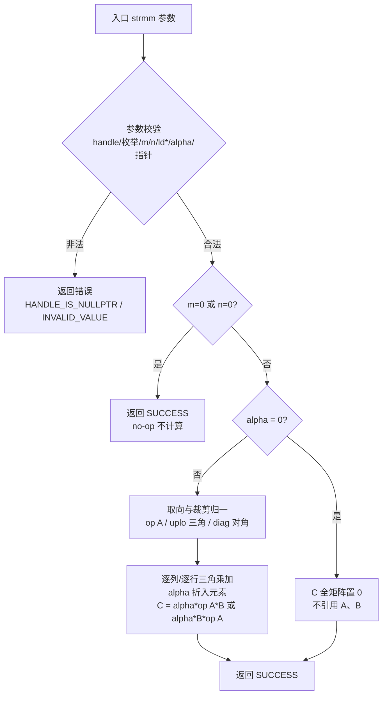
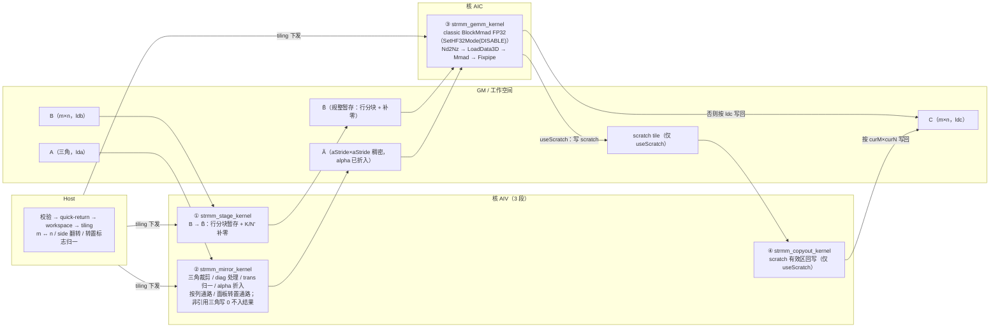

# aclblasStrmm 算子设计文档（Atlas A2 / A3 系列 · arch22）

> 任务：`09-aclblasStrmm-A2A3`（9 月社区任务）　提交团队：`gcw_gYpnrvNC`　文档版本：v1.6.1　日期：2026-09-26
> 算子目录：`blas/trmm/arch22/`　测试目录：`test/trmm/strmm/arch22/`
>
> **文档变更**
> - **v1.6.1（CheckList 评审勘误）**：按 `sow/设计文档CheckList.xlsx` 逐项评审后的修正：① §3.2.1.1 删除**重复且口径不一**的 AIC 分核描述（统一为「列主序等价改写视角 + 轮转分配 + tilesM/tilesN」）；② §5.3 `R13` 算力标定值 15.3 → **15.6 TFLOP/s**、目标利用率 67% → **66%**（与 §5.1 标定表一致）；③ §5.1 实测表/标定表标题的器件标注更正为「A2 口径 `--soc=ascend910b3` 产物在本机 Ascend910_9362（`910_93`）实测」；④ §3.3 / §5.4 产品支持表述对齐任务书（A3 行仅含 Atlas 800I A3）；⑤ §5.3 `R9` 双款型缓解措施更新为「A3 已闭环 / A2 硬片待补」；⑥ §3.2.1.2 备选档余量口径由 1.28×（历史口径）改为交付口径 1.40×/1.37×。⑦ 附录修正两处遗留：自查表 PR 行改为清单要求（位置/标题格式/PR 而非 issue/CLA/`/compile` 构建）、“文内自述的判据” 的精度判据改为「以任务书 `2⁻¹³` 为判定口径、生态标准作为参考口径」（与 §5.1 一致）；⑧ 附录新增「官方模板 required 章节 ↔ 本文档章节」映射表。逐项评审记录见 `task-aclblasStrmm/design/03_设计文档CheckList评审报告.md`。
> - **v1.6（A3 款型复测回填）**：自验环境实际芯片确认为 **Ascend910_9362（芯片族 `910_93` = A3 系列）**；在**同一台设备**上以两个构建目标（`--soc=ascend910b3` / `--soc=ascend910_9362`，同映射 `arch22` / `NPU_ARCH=dav-2201`）完成**双款型口径**实测：**A3 已实测闭环**（精度 **1212/1212 PASS**、5 条标杆 **5/5 达标**、全 200 条 **188/200**）；**A2 硬片（910B 硅片 / Atlas 800T A2）数据需在 A2 设备复测**（本环境无 910B 硬片，如实披露）；受影响小节：§3.3、§5.1。
> - **v1.1**：内核族按交付实现补齐为 **4 段**（`stage` / `mirror` / `gemm` / `copyout`），同步重写 kernel 调度顺序与串行代价量化，并补齐流程图与「与标杆差异」表；受影响小节：§3.2.1.3、§3.2.2、§3.2.2.1、§3.2.2.2、§3.2.2.3。
> - **v1.2**：按实现修正 **工作空间口径**（§3.2.1 表格与解析式：4096² 为 ≈ **134 MB**）与 **「无物理转置」表述**（§3.2.0 第二步、§3.2.1.2、§3.2.2.1(2)、§3.2.2.2、§3.2.2.3：唯一例外为 `side = LEFT ∧ trans = T`）；同步收敛 $\tilde A$ 前导维（$aStride$）与 mirror 非引用三角处理的表述。
> - **v1.4（验收复核回填）**：补充 **Device 侧 `alpha`** 分支的同步口径（§3.2.1 / §3.2.1.2 要点 6），并删除 host 概述里已不存在的「D2D 拷贝」措辞（与 §3.2.1.2 要点 4 的「不做任何 D2D 拷贝」保持一致）。
> - **v1.5（性能采集口径升级）**：性能采样改为「一条用例一个 msprof 进程、进程内连续调用 20 次，丢弃前 8 次覆盖设备时钟/电源爬坡，取其后 12 次有效采样逐 kernel 平均」，并完成**其余 195 条 `TC_PF` 用例的逐条耗时比对**（5 条硬指标全部达标、余量 1.40×~3.17×；其余参考用例 188/200 达 `gpu_ms ÷ 0.8` 外推值，未达的 12 条为极小 shape / 极端偏斜 shape，已在 §5.1 归因）；受影响小节：§3.2.1.3（串行代价量化）、§5.1（性能标准与 5 条标杆实测表、平台算力标定表）、§5.4（交付件 3 形态）。
> - **v1.3**：按实现修正 **基块几何**（单档 $64\times64\times32$，备选档标注未启用，容量验算表重算）与 **分核 / 负载均衡**（AIV 核数不收缩、AIC 轮转分配、负载均衡方案记为“已评估未启用”）；**`B ≡ C` 别名**改为“无条件规整暂存”（去掉指针检测 + D2D 拷贝）；tiling 字段表、GEMM 数据通路命名（`Nd2Nz`/`LoadData3D`）、`alpha=0` 的 host `aclrtMemsetAsync`、文件集（含 `strmm_kernel.h`）与 §5.1 精度/性能/标定口径同步回填。
> - **引用口径（硬要求）**：本文档**只引用任务书**（需求基线）；设计判据、实测数据与平台参数均在文内自述，不引用其它文档（含任何报告、分析稿与外部说明）。

# 一、需求背景

## 1.1 需求来源

通过昇腾社区任务完成开源仓算子贡献：在 Atlas A2 系列（Atlas 800T A2 / 910B3）与 Atlas A3 系列（Atlas 800I A3）上，用 Ascend C 开发单精度实数（float32）三角矩阵乘算子 `aclblasStrmm`，对标 NVIDIA cuBLAS `cublasStrmm`，验收通过后合入昇腾算子开源仓 ops-blas（算子 `blas/trmm/arch22/`，测试 `test/trmm/strmm/arch22/`）。

## 1.2 背景介绍

### 1.2.1 aclblasStrmm 算子实现优化（定位 / 参考实现路径 / 现状）

**算子定位**：`aclblasStrmm` 是 ops-blas 库中的句柄式 BLAS Level-3 三角矩阵乘接口，签名与 ops-blas 仓 `include/cann_ops_blas.h` 既有声明逐参数一致（不定义 A2/A3 私有平行接口）。计算语义与 cuBLAS `cublasStrmm` / Netlib `strmm` 对齐：

```
side = ACLBLAS_SIDE_LEFT ： C = alpha * op(A) * B          （A 为 m×m）
side = ACLBLAS_SIDE_RIGHT： C = alpha * B * op(A)          （A 为 n×n）
op(A) = A（trans = ACLBLAS_OP_N）或 Aᵀ（trans = ACLBLAS_OP_T）
```

其中 A 为**三角矩阵**（上/下三角由 `uplo` 决定；主对角是否读取由 `diag` 决定），B、C 为一般矩形矩阵 `m×n`，全部**列主序（Column-Major）**存储，数据类型为 float32（单精度实数）。C 为**标准一般矩阵输出**（非三角输出）、**离席计算**；`m=0` 或 `n=0` 为合法 no-op；`alpha=0` 时 A、B 不被引用且 C 全矩阵置 0。

与 cuBLAS 的唯一值域差异：**`trans` 仅接受 `ACLBLAS_OP_N` / `ACLBLAS_OP_T`**，`ACLBLAS_OP_C` 在实数语义下无定义，必须返回 `ACLBLAS_STATUS_INVALID_VALUE`（cuBLAS 参考实现字面接受 `OP_C` 并在实数档等价于 `OP_T`）。

**参考实现路径（含文件名）**：

| 参考对象 | 路径 | 用途 |
|---|---|---|
| 接口标杆 cuBLAS | `cublasStrmm`（cuBLAS Library API，cublas-t-... -strmm） | 参数序列/语义/异常行为对标 |
| 语义标杆 Netlib | `strmm.f`（Netlib BLAS 单精度参考实现，`cblas_strmm`） | quick-return / 三角与 diag 语义 / alpha 折入口径对照；同时是精度 golden 生成方 |
| 接口声明（仓内） | ops-blas `include/cann_ops_blas.h`（`aclblasStrmm` 声明） | 逐参数一致，多产品线共用 |
| 类型与状态码 | ops-blas `include/cann_ops_blas_common.h`（`aclblasStatus_t`、各枚举） | 不自造枚举 |
| 同算子既有实现（仓内） | ops-blas `blas/trmm/arch35/`：`strmm_host.cpp`、`strmm_kernel.cpp`、`strmm_tiling_data.h` | **移植参考**（mirror → gemm → scale 三段流水、host 校验/tiling 组织） |
| 测试工程（仓内） | ops-blas `test/trmm/strmm/`：`strmm_param.h`、`strmm_golden.h`、`CMakeLists.txt`；`test/trmm/strmm/arch35/`：`strmm_test.cpp`、`strmm_npu_wrapper.h`、`strmm_test.csv`；`test/frame/`（CSV 加载/填充/校验框架） | 用例驱动与 golden 比对；经 `verify_accuracy.py` 反查确定列名契约 |
| A2/A3 同类算子写法（仓内） | ops-blas `blas/symm/arch22/`（`ssymm_host.cpp`/`ssymm_kernel.cpp`）、`blas/trmv/arch22/` | arch22（A2/A3）侧的工程/分核/tiling 惯例；`ssymm` 使用 Ascend C **高阶 Matmul API**（`lib/matmul_intf.h` + `MatmulType<GM, CubeFormat::ND, float>`） |
| **生态既有 strmm 实现（跨库）** | **SiP（信号处理加速库）**：`asdBlasStrmm` / `asdBlasMakeStrmmPlan`（API 参考）；`example/a2/blas/strmm/`（A2 可编译示例，`bash build.sh`） | **语义交叉验证 + 产品支持口径参照**：SiP 明确"Atlas A3 训练/推理、Atlas A2 训练/推理：**支持**；Ascend 950PR/DT、Atlas 200I/500 A2、Atlas 推理系列：不支持"，说明 **A2/A3 上 strmm 已有落地先例**（其内部实现方式未获取，本设计不依赖该信息） |

**现状（本任务要解决的问题）**：仓内 `blas/trmm/` 目录**仅有 `arch35/`（Ascend 950PR）实现**，无 `arch22/`（Atlas A2/A3）实现；本任务需在 arch22 架构下新建该算子，并完成精度、性能与双款型验收（即 A2/A3 侧**无既有骨架**，`blas/trmm/arch22/` 目录与文件集均需新建；`arch35/` 仅作移植参考）。arch22 与 arch35 的算力结构不同（arch35 为 DAV_3510 平台，arch22 为 A2/A3 的 AIC+AIV 经典结构），arch35 实现可作为流水结构与 host 组织方式的移植参考，但 kernel 主体需按 arch22 的 Ascend C 经典 API（AIC：`LoadData`/`Mmad`/`Fixpipe`；AIV：`DataCopy`/`Vector` 指令）重新实现。

本算子的核心工程矛盾：**Cube 单元只支持规整的稠密分块矩阵乘**，而 TRMM 的三角裁剪（`uplo`）、对角语义（`diag`）、转置取向（`trans`）以及 BLAS 的**列主序**都与 Cube 的自然形态不一致，且 `A` 的非引用三角是 don't-care（不得影响结果）。设计上用「**三角归一化（mirror）+ 稠密 GEMM + 列主序等价改写**」把 16 组枚举组合收敛为单一主计算形态，把全部三角/对角/转置语义集中到一个 AIV 内核中（可独立单测），并由**三角感知 K 裁剪**补回被"稠密化"带来的约 2 倍冗余算力。

### 1.2.2 标杆算子现状分析

#### 1.2.2.1 标杆算子支持的数据类型和数据格式

对标基线 = cuBLAS `cublasStrmm`（语义参考 Netlib `strmm`/`cblas_strmm`），与 ops-blas 仓信息一致：

| 参数 | 类型 | 数据格式 | 说明 |
|---|---|---|---|
| alpha | `const float*`（Host 内存标量指针） | Host scalar | 单精度实数乘数 |
| A | `const float*` | **列主序**（Column-Major），ND | 三角矩阵，只读；LEFT：m×m，RIGHT：n×n；前导维 `lda` |
| B | `const float*` | 列主序 ND | 一般矩阵 m×n，只读；前导维 `ldb ≥ max(1,m)` |
| C | `float*` | 列主序 ND | 一般矩阵 m×n，输出（离席写出）；前导维 `ldc ≥ max(1,m)` |
| side | `aclblasSideMode_t` | Host attr | `{LEFT, RIGHT}` |
| uplo | `aclblasFillMode_t` | Host attr | `{UPPER, LOWER}`：A 的存储三角 |
| trans | `aclblasOperation_t` | Host attr | **仅 `{OP_N, OP_T}`**（`OP_C` 必须拒绝） |
| diag | `aclblasDiagType_t` | Host attr | `{NON_UNIT, UNIT}`：UNIT 时主对角视为 1 且**不读取** A 对角 |

数据排布格式均为 ND、列主序；不支持超出 `lda/ldb/ldc` 语义的非连续访问、无广播、无 dynamic shape 机制（`m/n` 为运行时入参）。

#### 1.2.2.2 标杆算子实现描述

标杆 = Netlib `strmm`（`cblas_strmm` 参考实现）+ cuBLAS 语义。其核心流程与语义（本算子逐条对齐）：

1. **参数校验**：非法参数（负维度、非法 `lda/ldb/ldc`、空指针、非法枚举）返回错误码；`handle` 为空返回 `HANDLE_IS_NULLPTR`。
2. **quick-return**：
   - `m == 0` 或 `n == 0`：合法 no-op，直接返回成功、不执行计算；
   - `alpha == 0`：`C = 0`（全矩阵置零），**A、B 不被引用**（可为 `nullptr`）。
3. **三角与对角裁剪**：只引用 `uplo` 指定的三角（非引用三角为 don't-care，**不得影响结果**）；`diag = UNIT` 时主对角视为 1 且**不读取** A 的对角存储，`diag = NON_UNIT` 时读取对角元素且**允许为 0**（乘法语义、非求解类，无对角非零强制要求——这是 TRMM 与 TRSM 的本质区别）。
4. **alpha 折入**：参考实现先把 `alpha` 折入被乘矩阵的元素（`TEMP = ALPHA*B(k,j)`），再做三角乘加累加；即将 `alpha` 施加在**累加之前**的单个元素上，而非对累加结果整体相乘。
5. **`op(A)` 取向**：`trans = N` 时 `op(A) = A`；`trans = T` 时 `op(A) = Aᵀ`。**转置只改变 `op(A)` 的取向，不改变被读取的存储三角**（`uplo = UPPER` + `trans = T` 时读取 A 的**上三角存储**，而它作为**下三角**矩阵参与乘法）——这是本算子最易错点。
6. **原地语义**：Netlib/`cblas` 的 TRMM 为 **in-place**（结果覆写 B）。本算子为离席输出（写入 C），但按任务书 §2.5 **允许 `B ≡ C`**（同一指针）以支持 cuBLAS TRMM 的等价原地用法；除该别名外，C 与 A/B 不允许内存重叠。

以 `side=LEFT, uplo=UPPER, diag=NON_UNIT` 为例，参考实现的核心循环为（以下为 Netlib `strmm.f` **结构等价的示意伪代码，非源码摘录**；其余 15 组为三角/取向的对称变体）：

```
for j = 1..n:
  for k = 1..m:
    TEMP = ALPHA * B(k,j)
    for i = 1..k-1:  B(i,j) += TEMP * A(i,k)
    B(k,j) = TEMP * A(k,k)
```

本算子对照：校验路径与错误码、quick-return（no-op / `alpha=0` 置零）、`uplo` 与 `diag` 裁剪语义、`alpha` 折入口径、`trans` 取向语义**逐条对齐**；主计算以「AIV 三角归一化 → Cube 稠密 GEMM」等效实现（差异见 §3.2.2.3）。

#### 1.2.2.3 标杆算子实现流程图

标杆（Netlib `strmm` 参考 + cuBLAS 语义）流程：



---

# 二、需求分析

## 2.1 外部组件依赖

| 依赖 | 用途 | 说明 |
|---|---|---|
| CANN 9.1.0 + Ascend C（arch22） | 算子编译/运行环境 | 任务书 §3.1 指定；A2/A3 共用 `arch22` 产物 |
| cblas（Netlib BLAS 单精度 `strmm`） | **精度 golden 生成（仅测试侧）** | 任务书 §3.1「随测试工程提供」，无其他三方软件依赖 |
| msprof | 性能采集（仅自验侧） | `msprof --task-time=on` 逐 kernel 采集 `Task Duration(us)`（`op_summary_*.csv`） |

算子本体运行**无第三方依赖**，不引入算子级形态编译框架以外的库。

## 2.2 内部适配模块

| 模块 | 适配内容 |
|---|---|
| `include/cann_ops_blas.h` | 复用既有 `aclblasStrmm` 声明（14 参数，与 `cublasStrmm` 一一对应），不新增/不私有化，供其他产品线共用 |
| `include/cann_ops_blas_common.h` | 复用 `aclblasStatus_t` 与 `aclblasSideMode_t`/`aclblasFillMode_t`/`aclblasOperation_t`/`aclblasDiagType_t`，不自定义枚举 |
| `blas/common`（仓内公共设施） | handle（stream 绑定）、工作空间（`EnsureDefaultWorkspace`/`GetEffectiveWorkspace`/`CheckEffectiveWorkspaceSize`）、核数获取（`GetAicCoreCount`/`GetAivCoreCount`）、日志与状态码宏 |
| `blas/trmm/arch22/`（**本任务新增**） | `strmm_host.cpp`（校验 / quick-return / tiling / kernel 调度）、`strmm_kernel.cpp`（AIV stage / AIV mirror / AIC GEMM / AIV copyout 四个 kernel 入口）、`strmm_tiling_data.h`（tiling 结构体）、`strmm_kernel.h`（host 侧 kernel 入口声明）；文件集与仓内同类算子保持一致，避免冗余文件 |
| 移植参考（仓内，只读） | `blas/trmm/arch35/`（同算子既有实现的三段流水与 host 组织）、`blas/symm/arch22/`、`blas/trmv/arch22/`（A2/A3 侧同类算子写法） |
| test 框架 | `test/trmm/strmm/`（`strmm_param.h` 参数解析、`strmm_golden.h` golden、`CMakeLists.txt`）+ `arch22/`（`strmm_test.cpp`、`strmm_npu_wrapper.h`、`strmm_test.csv`）+ `test/frame/`（CSV 列名映射、填充、状态码解析） |

## 2.3 需求模块设计

### 2.3.1 Ascend C 算子原型（与标杆对齐）

除任务书不要求适配的部分（非连续 Tensor、broadcast、dynamic shape 等，见 2.3.2）外，与标杆 `cublasStrmm` 逐参数对齐：

```cpp
aclblasStatus_t aclblasStrmm(
    aclblasHandle_t     handle,
    aclblasSideMode_t   side,
    aclblasFillMode_t   uplo,
    aclblasOperation_t  trans,
    aclblasDiagType_t   diag,
    int                 m,
    int                 n,
    const float        *alpha,
    const float        *A,
    int                 lda,
    const float        *B,
    int                 ldb,
    float              *C,
    int                 ldc);
```

（`handle` 及参数顺序与 `cublasStrmm` 一一对应，无需额外映射说明。）

### 2.3.2 Ascend C 算子相关约束（与标杆相比缺失）

| 项 | 标杆（cuBLAS TRMM 家族） | 本算子 | 说明 |
|---|---|---|---|
| 数据类型 | `cublasStrmm` 单精度实数；cuBLAS 另有 double/half 等接口 | **仅 FLOAT32** | 任务书范围仅单精度实数 |
| `trans` 值域 | 参考实现字面接受 `OP_C`（实数档等价 `OP_T`） | **仅 `{OP_N, OP_T}`，`OP_C` → `INVALID_VALUE`** | 任务书 §2.4 收窄（**唯一接口语义偏离**，已备案） |
| 对角语义 | — | `NON_UNIT` 读对角且允许为 0；`UNIT` 视为 1 且不读对角 | 任务书 §2.1.1 / §7.3 |
| 批处理/stride | cuBLAS 另有 batched / strided 变体 | 不支持（单次调用） | 任务书不要求 |
| 内存排布 | 列主序 | 仅列主序 ND；不支持超出 `lda/ldb/ldc` 语义的非连续访问 | 任务书 §2.5 |
| 广播 / dynamic shape | 无广播；shape 由调用方给定 | 不涉及广播；无 dynamic shape 机制（`m/n` 运行时入参） | 与标杆一致 |
| 输出位置 | Netlib/`cblas` 为 **in-place**（覆写 B） | **离席输出到 C**；额外允许 `B ≡ C` 等价原地用法；C 与 A 不允许重叠 | 任务书 §2.1.3 / §2.5 |
| 确定性 | — | **不要求**逐位一致（浮点累加顺序不保证） | 任务书 §2.1.6 / §2.5 |
| Inf/NaN | 标准 IEEE 传播 | 不特判，IEEE FP32 自然传播（不崩溃、无额外数值要求） | 任务书 §3.5.3 |

---

# 三、需求详细设计

## 3.1 调用方式

**Kernel 直调**（任务书 §2.2）：`aclblasStrmm` 为句柄式 BLAS 接口，经 handle 绑定 stream，host 侧完成参数校验 + tiling 后直接下发自研 NPU kernel；非 ACLNN、非框架图路径。异步执行：host 不主动同步，读回 Device 结果前由上层 `aclrtSynchronizeStream` 保证（对齐任务书 §2.5「异步语义依赖 `aclblasSetStream`」）。

## 3.2 需求总体设计

### 3.2.0 算法与数学公式（三角归一化 + 列主序等价改写）

**符号约定**：`A[i][j]` 表示列主序存储中第 `i` 行第 `j` 列元素；设 A 的阶数

$$k_A = \begin{cases} m, & side = LEFT \\ n, & side = RIGHT \end{cases}$$

**第一步：把 16 组枚举组合归一为「等效稠密矩阵 $\tilde A$」**。构造一个 $aStride \times aStride$ 稠密矩阵 $\tilde A$（列主序、工作空间内；前导维 $aStride$ 的定义见 §3.2.1，$k_A$ 以外的 padding 行/列**显式写 0**），规则如下：

1. **有效三角取向**：`trans = N` 时 $\tilde A$ 的有效三角与 A 的存储三角一致（`uplo`）；`trans = T` 时取转置 → 有效三角**翻转**：

$$uplo_{eff} = \begin{cases} uplo, & trans = N \\ \text{flip}(uplo), & trans = T \end{cases} \quad (\text{flip: UPPER} \leftrightarrow \text{LOWER})$$

2. **取值**：$\tilde A$ 在 $uplo_{eff}$ 三角上取 A 的对应元素（`trans = T` 时按转置位置取值），另一三角**显式写 0**；
3. **对角**：`diag = UNIT` → $\tilde A$ 对角写 1（**不读取** A 的对角存储）；`diag = NON_UNIT` → 取 A 的对角元素；
4. **alpha 折入**：$\tilde A \leftarrow \alpha \cdot \tilde A$（`alpha == 1` 时跳过乘法；`alpha == 0` 已在 host quick-return 处理、不下发 kernel）。

归一化后，主计算恒为**稠密矩阵乘**：

$$side = LEFT:\; C = \tilde A \cdot B \qquad side = RIGHT:\; C = B \cdot \tilde A$$

即 16 组（`side × uplo × trans × diag`）组合全部收敛到同一 Cube 主计算形态；三角裁剪、对角语义、转置取向的全部差异只体现在 AIV 归一化（mirror）内核中。**alpha 折入口径与标杆一致**：Netlib `strmm` 亦将 `alpha` 折入被乘元素后累加（`TEMP = ALPHA*B(k,j)`），而非对累加结果整体相乘；本设计选择折入 $\tilde A$ 而非 B（数学等价：$\alpha(\tilde A B) = (\alpha\tilde A)B$），可省去一次 $m \times n$ 级遍历，且不要求 B 可写（B 为只读输入、且可能与 C 别名）。

**第二步：列主序等价改写**。列主序矩阵 $X$ 的存储与「行主序存储的 $X^T$」逐字节相同，故

$$side = LEFT:\; C^T = B^T \cdot \tilde A^T \qquad side = RIGHT:\; C^T = \tilde A^T \cdot B^T$$

host 在 tiling 阶段做 **$m \leftrightarrow n$、$side$ 翻转、转置标志归一**（与仓内 `gemm` 系列列主序适配约定一致），kernel 以行主序视角计算 $C^T$ 并按 `ldc` 写回，等价于直接产出列主序的 C——**C 侧与 B 侧全程无物理转置、无 D2H/H2D**。

**第二步的例外（唯一）**：当 $side = LEFT$ 且 $trans = T$ 时，$op(A) = A^T$ 落在矩阵乘的**右操作数**（L0B）。硬件上左侧操作数 L0A 的 `enTranspose` 是**真转置**，而 **L0B 的 `enTranspose` 只是固定的 NZ→ZN 排布转换、并非逻辑转置**（翻转该标志位结果逐位不变）；FP32 元素为 4B，也无法用 2D DMA 的步长或向量 `Gather` 完成非单位步长转置。因此该 $side \times trans$ 组合**必须由 mirror 内核在工作空间内物化 $A^T$**（即 $\tilde A$ 直接存 $op(A)$ 的结果，见 §3.2.2.1(2)）；其余 3 组 $side \times trans$ 组合（含 $side = RIGHT \wedge trans = T$——翻转视角下 A 落在 L0A）不需要任何物理转置。

**第三步：三角感知 K 裁剪（性能关键）**。$\tilde A$ 保留零三角后，乘积中数学上恒为 0 的 K 块可以整块跳过：

| side | $uplo_{eff}$ | 输出块 | 有效 K 区间 | 被跳过的 K 区间 |
|---|---|---|---|---|
| LEFT | UPPER | 行块 $[i_0,\; i_0+B_M)$ | $[i_0,\; k_A)$ | $[0,\; i_0)$ |
| LEFT | LOWER | 行块 $[i_0,\; i_0+B_M)$ | $[0,\; \min(i_0+B_M,\; k_A))$ | $[\min(i_0+B_M,k_A),\; k_A)$ |
| RIGHT | UPPER | 列块 $[j_0,\; j_0+B_N)$ | $[0,\; \min(j_0+B_N,\; k_A))$ | $[\min(j_0+B_N,k_A),\; k_A)$ |
| RIGHT | LOWER | 列块 $[j_0,\; j_0+B_N)$ | $[j_0,\; k_A)$ | $[0,\; j_0)$ |

裁剪是**块级、保守**的（按块起止而非逐行/逐列），只跳过"数学上恒为零"的块，**不影响任何计算结果**；有效 MACs 由 $k_A^3$ 降至 $\approx k_A^3/2$（对 `side=LEFT` 为 $m^2n/2$，`side=RIGHT` 为 $mn^2/2$）。该裁剪是满足任务书 §3.3 性能红线的关键手段（定量分析见 §5.1）。

**第四步：FP32 计算模式（关键，必须显式约定）**。Ascend C 在 A2/A3 上的 `Mmad` 提供 **HF32 模式**（`SetHF32Mode(bool)`）：一旦生效，**L0A/L0B 中的 FP32 数据在参与 Mmad 之前被舍入为 HF32**（有效精度约 11 bit），单次乘积的相对扰动可达 $\sim 2^{-11}$、两项合计 $\sim 2^{-10}$ —— **恰好吃掉生态算子开源精度标准 FLOAT32 档 `rtol = 2⁻¹⁰` 的全部预算**，`matched_ratio ≥ 0.99` 将无法达标。因此本算子 kernel 侧**显式调用 `SetHF32Mode(false)`**，执行常规 FP32 矩阵乘（`SetHF32TransMode` 随之不适用）；该开关同时决定性能口径（HF32 为单遍路径、full-FP32 为全精度路径，**两者 Cube 吞吐不可比**），故平台算力标定必须分两种模式进行（§5.1）。**待实证**：`SetHF32Mode` 的默认取值须在 CANN 9.1.0 + 910B3 上以受控 A/B（HF32 on/off 的精度与耗时）确认，结论回写本小节。

**数据类型**：alpha、A、B、C 全为 FLOAT32；Cube 中间量 FP32（L0C FP32 累加），无类型转换、无量化。**支持形状**：`m/n` 非负整数运行时入参；列主序 ND；`m=0`/`n=0` 为 no-op，`alpha=0` 走置零快速路径。

### 3.2.1 host 侧设计

host 负责：参数校验 → quick-return 判定 → 工作空间规划 → 多核切分（tiling）→ kernel 调度。全部 kernel 挂 `handle->stream` 异步执行，host 不搬数、不下发同步点（唯一例外见 §3.2.1.2 要点 6：调用方传 Device 侧 `alpha` 时需一次 4B D2H 取标量值）。

**参数校验（错误码全路径，顺序固定）**：

```
handle == nullptr                        → ACLBLAS_STATUS_HANDLE_IS_NULLPTR
side  ∉ {LEFT, RIGHT}                    → ACLBLAS_STATUS_INVALID_VALUE
uplo  ∉ {UPPER, LOWER}                   → ACLBLAS_STATUS_INVALID_VALUE
trans ∉ {OP_N, OP_T}（含 OP_C）          → ACLBLAS_STATUS_INVALID_VALUE
diag  ∉ {NON_UNIT, UNIT}                 → ACLBLAS_STATUS_INVALID_VALUE
m < 0 || n < 0                           → ACLBLAS_STATUS_INVALID_VALUE
m > 65504 || n > 65504                   → ACLBLAS_STATUS_INVALID_VALUE   （workspace 可寻址上界，见 §3.4 第 14 条）
m == 0 || n == 0                         → 返回 SUCCESS（合法 no-op，校验先于 ld 校验）
alpha == nullptr                         → ACLBLAS_STATUS_INVALID_VALUE
lda < (side==LEFT ? max(1,m) : max(1,n)) → ACLBLAS_STATUS_INVALID_VALUE
ldb < max(1,m) || ldc < max(1,m)         → ACLBLAS_STATUS_INVALID_VALUE
C == nullptr                             → ACLBLAS_STATUS_INVALID_VALUE   （C 为输出，须可写）
alpha == 0                               → C 的 m×n 区域置 0（不引用 A/B，不校验 A/B）
A == nullptr || B == nullptr             → ACLBLAS_STATUS_INVALID_VALUE   （被引用时）
```

> 说明：`m==0 || n==0` 的 quick-return **先于**前导维校验，使「零维 + `lda/ldb/ldc=0`」按 no-op 返回成功（与配套用例 `TC_ED` 中 `m0`/`n0`/`m0n0` 的期望一致）；`handle` 与枚举校验仍在最前，保证零维时非法枚举/空 handle 依旧被拦截。`alpha=0` 路径下 `A`/`B` 允许为 `nullptr`（对齐任务书 §2.4「被引用时才要求非空」与配套用例 `alpha0_nullAB`）。
>
> **状态码口径声明**：枚举越域（`side/uplo/trans/diag`，含 `trans = OP_C`）**一律返回 `ACLBLAS_STATUS_INVALID_VALUE`**，以任务书 §2.4 + 配套用例期望为准。注：`aclblasStatus_t` 中另有 `ACLBLAS_STATUS_INVALID_ENUM`（`cann_ops_blas_common.h`），且仓内部分算子 README（如 `blas/dgmm/README.md`）按 `INVALID_ENUM` 描述枚举越域——**本算子不采用该口径**；实现与移植（参考 `blas/trmm/arch35/`）时须**显式改写**该校验分支，不得沿用。

**quick-return 与置零路径**：`m==0 || n==0` 直接返回成功、不下发 kernel；`alpha == 0` 时由 host 在 stream 上发起 `aclrtMemsetAsync` 置零 C（`ldc == m` 时单次覆盖 `m×n`，`ldc > m` 时逐列置零每列前 `m` 个元素），**不需要**读取 A/B。

**输出写入契约（hard requirement，验收逐元素判定的前提）**：C 为列主序 `ldc×n` 缓冲，但**本算子只写每列前 `m` 个有效元素**；`m..ldc-1` 的 padding 行属调用方数据，**任何路径（含 `alpha=0` 置零、含尾块 tiling）都不得写入**（也不得写入对齐补齐产生的越界单元）。理由：测试框架按 `ldc×n` **全缓冲**比对（`test/trmm/strmm/arch35/strmm_test.cpp` 的 `cCount = ldc × n`，golden 缓冲零初始化），且 `AlphaZeroLdcPadding` 用例要求 `alpha=0` 时 padding 行**保持原值不变**。实现要点：

- `ldc == m` 时可单次 `aclrtMemsetAsync` 覆盖 `m×n`；`ldc > m` 时必须**逐列** memset 每列前 `m` 个元素（`m×4B`），不得按 `ldc×n` 整块 memset；
- `alpha == 0` 路径的 C 必须为 **`+0.0`**（不得出现 `-0.0`/NaN）：测试对该路径采用 `PrecisionMode::EXACT`（逐元素位相等）判定；
- GEMM 写回（Fixpipe）按 `curM/curN` 限制边界，不做 16 对齐补齐写。

**工作空间规划（Device GM，经 handle 的 EffectiveWorkspace 提供）**：

| 缓冲 | 形状 / 前导维 | 字节数（float 数 × 4B） | 启用条件 |
|---|---|---|---|
| $\tilde A$（alpha 已折入） | $aStride \times aStride$，其中 $aStride = \text{align16}(\max(kPad,\; \text{align16}(m)))$、$kPad = \text{align32}(k_A)$ | $aStride^2 \cdot 4$ | 恒启用（主路径） |
| $\tilde B$（B 的规整暂存） | $bStageRows \times bStageLd$：LEFT 为 $(\text{align16}(n),\ kPad)$，RIGHT 为 $(kPad,\ \text{align16}(m))$ | $bStageRows \cdot bStageLd \cdot 4$ | 恒启用 |
| scratch tile | `tilesM × tilesN` 个 tile，每 tile `TILE_M × scratchRowLen`（`scratchRowLen = align16(TILE_N)`） | $tilesM \cdot tilesN \cdot TILE\_M \cdot scratchRowLen \cdot 4$ | 仅当 `useScratch`（`m % 16 ≠ 0` 且 `m < TILE_N`） |

三个缓冲在工作空间内**顺序排布、区间按 32B 对齐**：`wsOffA = 0`、`wsOffB = align32(aStride²)`、`wsOffScratch = align32(aStride² + bStageRows·bStageLd)`；总需求量再向上取 32B 对齐后交给工作空间校验。偏移量在 `StrmmTilingData` 中以 **64 bit float 计数**下发，所有乘积先按 64 bit 计算再校验（避免 32 bit 截断），超出 32 bit 偏移寻址空间时返回 `ACLBLAS_STATUS_INVALID_VALUE`。

```
floats = aStride² + bStageRows×bStageLd + (useScratch ? tilesM×tilesN×TILE_M×scratchRowLen : 0)
bytes  = align32(floats × 4)
```

由 `EnsureDefaultWorkspace` / `CheckEffectiveWorkspaceSize` 校验，容量不足返回 `ACLBLAS_STATUS_EXECUTION_FAILED`（不得静默越界）；handle 侧工作空间默认 32 MB、不足时按需扩容（上限 2 GB），故下列量级可被满足。以任务书最大性能用例（4096²）为例：$aStride = 4096$，$\tilde A$ 与 $\tilde B$ 各 $4096^2 \times 4\text{B} = 67.1\text{ MB}$，scratch 为 0，**工作空间合计 ≈ 134 MB**；1024² 用例约 8.4 MB；scratch 仅在小 $N'$（$m < 64$ 且非 16 对齐）时占用，大小 $\propto n$（如 $n = 4096$、$m = 48$ 时 ≈ 1 MB）。任务书 §3.4 内存要求标注「不涉及」硬性指标，本设计按上述解析式核算并在提交件中填报。

（无“后置 scale 对照路径”的缓冲：该路径已改为**设计备选、不在交付代码中实现**，见 §3.2.2.1(5)）

**tiling 参数下发**：`StrmmTilingData` 为单个 POD，随 kernel 入参下发：

| 组 | 字段 |
|---|---|
| 问题尺寸 | `m`、`n`、`dimA`（$=k_A$）、`dimAPad`（$=\text{align32}(k_A)$）、`lda`、`ldb`、`ldc` |
| 语义归一 | `sideMode`、`uploEff`、`transMode`、`diagMode`、`alphaVal`（host 读入的浮点值） |
| GEMM 视角 | `gm`（$=n$）、`gn`（$=m$）、`kPad`、`aStride`、`aRows` |
| B 暂存 | `bStageRows`、`bStageLd` |
| 分核 | `tilesM`、`tilesN`、`aicCoreNum`、`aivCoreNum`、`mirrorColsPerCore` |
| scratch | `useScratch`、`scratchRowLen` |
| 工作空间偏移（64 bit float 计数） | `wsOffA`、`wsOffB`、`wsOffScratch` |
| 保留 | `reserved`（置 0） |

#### 3.2.1.1 分核策略

**AIV（归一化与搬运内核）**：三个 AIV 内核各自按一个连续的迭代空间分核，**核数不按工作量收缩**（直接取平台 AIV 总数）：

- **mirror**（$\tilde A$ 归一化）按列切：`mirrorColsPerCore = CeilDiv(aStride, aivCoreNum)`，每核连续负责该宽度的一段后跳到下一段（`colBase += blockNum × colsPerCore`），保证**同一列只由一个核写**（避免列内 DoD 竞争）；
- **stage**（B 的规整暂存）按行切：每核每轮搬 `rowsPerCall` 行（由 UB 容量与 $m$ 反推、上限 64 行），步长 `blockNum × rowsPerCall`；
- **copyout** 按 tile 索引轮转。
- 列内分块粒度为 `STRMM_UB_TILE_FLOATS`（16384 float = 64KB，受 UB 容量约束）；每列**先整列写 0**（一次覆盖 padding 行、K / N' padding 列与非引用三角），再把被引用三角的连续区间 `[lo, hi]` 读入并写出，保证工作空间无残留；
- 仅读取 A 的**被引用三角**（`trans = N` 时即 `uplo` 三角；`trans = T` 时为转置所需行片段）：按列通路不读非引用三角，面板转置通路读行片段后**将非引用位置置 0 丢弃**（见 §3.2.2.1(2)）；两通路都不让非引用元素进入结果，故「非引用元素为 don't-care」仍为可测性质（见 §5.2 可测性）。

**AIC（GEMM 内核，唯一主计算内核）**：按列主序等价改写后的视角分核（翻转视角下 $M' = n$、$N' = m$），采用**轮转（round-robin）**分配：

- `tileCount = tilesM × tilesN`（$tilesM = \lceil n/B_M \rceil$、$tilesN = \lceil m/B_N \rceil$）；
- `aicCoreNum = max(1, min(tileCount, aicCoreNum))`；核 $b$ 处理 `tile = b, b + aicCoreNum, b + 2·aicCoreNum, …`；
- tile 起点用“末尾左移”取值（非末块取 `tileIdx·B`、末块取 `dim − B`），使每块都是满块，重叠部分的写值相同；
- 尾块：`curM/curN/curK` 按运行时实际尺寸处理，不做 16 对齐补齐写越界（亦不得写脏 padding 行，见 §3.2.1）。

**负载均衡（已评估，本轮未启用）**：块级 K 裁剪使不同输出块的有效 K 长度不同（UPPER 情形第 $i$ 块的有效 K 为 $k_A - i\cdot B_M$，随块序号线性下降），按“等量 tile”分配理论上会有核间不均。本轮**未**实现下列方案（M3 实测 5 条标杆全部达标，故按实现现状记录）：

1. **工作量配额分配**（按各 tile 有效 K 长度排序后蛇形分发）——未实现；
2. **Swizzle / StreamK**（官方推荐的块分配 / 工作中心分解）——未使用；
3. **MultiCoreSplitK**（K 方向再切 + AIV `ReduceAdd` 收尾）——未使用；小 shape 填核依靠轮转分配（256² 在 $64\times64$ 基块下 `tileCount = 16`）。

> 若后续出现负载不均导致的性能不达标，按 1→2→3 顺序引入，并同步更新本文档（§3.2.1 工作空间解析式与 §5.3）。

#### 3.2.1.2 数据分块和内存优化策略

**基块选择（编译期常量，随 tiling 运行时下发）**：

交付实现为**单档基块 $64 \times 64 \times 32$**（`TILE_M / TILE_N / TILE_K`）：

| 基块 $B_M \times B_N \times B_K$ | 状态 | 说明 |
|---|---|---|
| **64 × 64 × 32** | **交付主路径（唯一档）** | 覆盖全部 shape；$B_K = 32$ 使 K 方向 padding ≤ 31 且每个 K 块都是满块 |
| 128 × 128 × 32 | 未启用的备选 | 大 shape 下搬运/计算比更优；M3 实测 5 条标杆已达标（交付口径最紧余量：A2 1.40× / A3 1.37×，见 §5.1），无启用必要；启用需重算容量与分核 |
| 32 × 32 × 32 | 未启用的备选 | 极小 shape 填核兜底；当前小 shape（256²）用轮转分配已达标 |

约束：$B_M$、$B_N$ 取 **16 的倍数**、$B_K$ 取 **32 的倍数**（K 维按 32 对齐 pad），尾块由 `curM/curN/curK` 兜底；$B_K$ 沿 $k_A$ 分块累加（L0C FP32 长累加，无中间舍入外损失）。

> **已实证**：arch22 fp32 的 fractal 为 **C0 = 8**（一个 datablock = 32B = 8 个 fp32）、基本块 **16 × 8**（512B），已在最小 GEMM 冒烟中核对通过；因此 M/N 取 16 的倍数、K 取 32 的倍数可保证每个 fractal 块都是满块。

**容量校验（A2 平台容量 + 基块可行域）**。Atlas A2 片上容量：**L1 512KB**（通常 4×128KB，L1A/L1B pingpong）、**L0A/L0B 各 64KB**、**L0C 128KB**（可显式 double buffer）、**UB 192KB**；搬入格式：`GM→L1` 用 `DataCopy`（zN/nZ/ND(m=1)）、`L1→L0A` 用 `LoadData`（zZ）、`L1→L0B` 用 `LoadData`（nZ）、`L0C(CO1)` 为 zN。

```
L0C : singleCoreM × singleCoreN × 4B ≤ 128KB  → 乘积上限 32768（如 64×64 输出块 16KB）
L0A : B_M × B_K × 4B ≤ 64KB  → 64×32×4B = 8KB（余量 8×）
L0B : B_K × B_N × 4B ≤ 64KB  → 32×64×4B = 8KB（余量 8×）
L1  : stages × (B_M×B_K + B_K×B_N) × 4B ≤ 512KB  → 双缓冲 2×(8KB+8KB) = 32KB（余量 16×）
UB  : 2×UB_TILE_FLOATS(16384) + TRANS_BUF_FLOATS(4096) = 36864 float = 144KB ≤ 192KB（余量 48KB）
```

**候选基块容量验算**：

| 基块 $B_M\times B_N\times B_K$ | L1（单 stage / 双缓冲） | L0A / L0B | L0C（输出块 $B_M\times B_N$） | 结论 |
|---|---|---|---|---|
| **64 × 64 × 32**（交付档） | (64×32 + 32×64)×4B = **8KB + 8KB** / 32KB | 8KB / 8KB | 64×64×4B = 16KB | ✅ 可行，余量充足 |
| 128 × 128 × 32（备选） | 16KB + 16KB / 64KB | 16KB / 16KB | 128×128×4B = 64KB | ✅ 可行（未启用） |

容量按上表在实现期核对（基块为编译期常量）；实现不硬编码容量常量（走 `GetCoreMemSize` 等平台接口），同一 `arch22` 产物覆盖 A2/A3。

**内存与访存优化要点**：

1. **三角感知 K 裁剪**：按 §3.2.0 第三步的块级有效 K 区间起始/结束 K 循环，跳过恒零块（有效算力需求减半）；
2. **列主序等价改写**：host 侧 $m \leftrightarrow n$ / side 翻转 / 转置标志归一，**C/B 侧无物理转置**；A 侧**唯一例外**为 $side = LEFT \wedge trans = T$（mirror 在 UB 内完成面板转置并落到工作空间，见 §3.2.0 第二步）；
3. **归一化内核（mirror）的两条通路**：①**按列通路**（其余情形）——列主序下每列的有效三角是**连续区间**（UPPER 为 $[0, j]$、LOWER 为 $[j, k_A-1]$），`DataCopyPad` 搬有效区间 + 零区间显式写 0 + 对角元素单独处理（`diag=UNIT` 时不读 A 对角、直接写 $\alpha$）；②**面板转置通路**（$side = LEFT \wedge trans = T$）——按 **16 行 × ≤256 列**的面板读 A 的行片段（行片段按 8 float 对齐），用 `TransDataTo5HD` 每 16 列一组在 UB 内完成转置，再整面板写出 $\tilde A$（用块式 5HD 转置取代逐元素标量）；
4. **`B ≡ C`（原地）别名**：**不做指针检测、不做任何 D2D 拷贝**——`B` 每次调用都被规整暂存到 $\tilde B$（§3.2.2.1(1)），GEMM 全程**只读 $\tilde B$**、写回指向 `C`，因此 `C == B` 与 `C != B` 走同一条数据流，天然满足原地语义（代价已计入 $\tilde B$ 暂存的 $O(m\cdot n)$ 搬运）；
5. **alpha 折入归一化内核**：免去一次 $m\times n$ 级读写遍历（对 case1 这类小 shape 时间预算紧张的场景尤为关键）；
6. **无 D2H/H2D**：全部中间数据留在 Device GM；`alpha` 按任务书 §2.4 为 **Host 内存**，host 直接读值随 tiling 下发（无同步）。**若调用方传 Device 侧 `alpha`**（仓内既有 `arch35` 实现与算子 README 均支持该用法）：host 先用 `CheckPtrLocation` 判别指针位置，再对 `alpha` 做一次 **4B 的 `aclrtMemcpyAsync` D2H + `aclrtSynchronizeStream`** 取标量（后续流程同主路径）。该分支为空指针/内存位置歧义错误码的前置检查所在，不影响主路径的异步性；
7. **B panel 复用与访问错峰**（三角裁剪带来的新问题）：不同 M 块读取 B 的 K 区间不同（UPPER 为 $[i_0, k_A)$），B panel 的复用跨度变小、L2 命中率下降；按 K 区间对 M 块**排序**可提升复用（与 §3.2.1.1 的工作量配额分配同一实现）。读取量一阶模型用于 $B_M/B_N$ 选型：`readBytes ≈ 4B × m × n × k_A × (1/B_M + 1/B_N)`。此外，多个 AIC 同时从相同 K 分块起步会造成 GM 同地址访问冲突，可启用官方 **ShuffleK**（K 方向错峰读取）作为优化项；把 HBM 读取量 / L2 命中率列入 msprof 观测项。

#### 3.2.1.3 tilingKey 规划策略

本算子**不设置编译期 tilingKey 分派**：三角/对角/转置语义已在 AIV 归一化阶段收敛，主计算形态**唯一**（稠密 GEMM + 块级 K 裁剪），因此不需要按 `uplo/trans/diag/side` 分派不同 kernel 分支。做法为：

- 基块为**编译期常量**（单档 $64\times64\times32$，备选档未启用，见 §3.2.1.2），全部 tiling 参数随 `StrmmTilingData` **运行时下发**；
- kernel 侧为 **4 个固定 `__global__` 入口**：`strmm_stage_kernel`（B 规整暂存 → $\tilde B$）、`strmm_mirror_kernel`（三角归一化 → $\tilde A$）、`strmm_gemm_kernel`（稠密 GEMM）、`strmm_copyout_kernel`（scratch tile 回收，仅 `useScratch` 时下发）；四者均只读 tiling 结构体，**不按 `uplo/trans/diag/side` 分派任何分支内核**；
- **不设置 `tilingKey`**（不保留未使用字段）；后续若引入 split-K 变体，采用“宏实例化 + host 门控”方式扩展并同步更新本文档。

**kernel 调度顺序**（同一 stream 顺序提交，异步流水；共 **4 段**）：

```
0. strmm_stage_kernel       B → B̃：按行分块的规整暂存（行内连续 + K/N' 方向补零）（AIV）
1. strmm_mirror_kernel      Ã = alpha * P(op(A), uplo, diag)，aStride × aStride 稠密（AIV）
2. strmm_gemm_kernel        C = ÷B̃（LEFT）或 B̃·Ã（RIGHT），列主序等价改写 + 块级 K 裁剪（AIC）
3. [仅当 useScratch] strmm_copyout_kernel   把 scratch tile 的有效 curM×curN 回写到 C（AIV）
```

> 段间依赖：0 → 1 → 2 均由 GM 数据传递（$\tilde B$、$\tilde A$），无显式跨 kernel 事件，靠同 stream 的顺序语义保证；段 3 的触发条件为 `useScratch = ((m % 16) != 0 && m < 64)`（$N' = m$ 的有效长度不足一个 tile 且非 16 对齐时，`Fixpipe` 无法直接写 C 的有效区，改由 scratch tile + AIV 回收）。

> **串行代价（已量化）**：四段之间存在 GM 数据依赖（GEMM 读 $\tilde B$ 与 $\tilde A$），当前为同 stream 顺序提交，**未利用 AIC/AIV 异构重叠**。 实测 AIV 段占比（`msprof --task-time=on` 逐 kernel 的 `Task Duration(us)`，910B3，一条用例一个 msprof 进程、进程内连续调用 20 次，丢弃前 8 次预热 + **有效采样 12 次取平均**，见 §5.1）——case 1（256²，58.43 us 限值）合计 18.42 us，其中 stage 4.94 + mirror 7.93 = **12.87 us（≈ 70%）**，三段同为 AIV 启动开销主导、绝对量级均 < 8 us；case 5（4096²，6681.36 us 限值）合计 4783.61 us，其中 stage 75.44 + mirror 304.36 = **379.80 us（≈ 8%）**，gemm 4403.81 us 占 **92%**（copyout 未触发）。**决策**：(a) 按列块流水——mirror 产出 $\tilde A$ 第 $p$ 块后即触发对应 GEMM（`TilingData` 携带 `chunkId`）：判据（mirror 占 case 1 总耗时 > 5%）**已触发但未采纳**——四段串行结构下 5 条标杆用例已全部达标（最紧的 case 5 余量 1.40×、case 1 余量 3.17×），列块流水会显著放大段间同步的复杂度与正确性风险面，收益只落在个别用例的启动开销上；(b) 官方经验“小 shape 或矩阵只读取一次的场景要谨慎启用 Padding 前处理”已按 case 1 单独核验（达标，不下沉该优化）。若后续验收方要求进一步压缩 case 1/case 2 的启动开销，再启用 (a) 并同步更新本文档。**M2 出口所需的量化数据即上列实测值，门点已闭合**。

### 3.2.2 kernel 侧设计

总体：`Init`（按 blockIdx 领取核内任务、读 tiling）→ `Process`（归一化 → GEMM）→ 写出。kernel 族共 **4 个内核**，**无按 `uplo/trans/diag/side` 分派的分支内核**：

| # | kernel | 归属 | 职责 | 下发条件 |
|---|---|---|---|---|
| 1 | `strmm_stage_kernel` | AIV | B 规整暂存 → $\tilde B$（行分块视图 + K/N' 方向补零） | 恒下发 |
| 2 | `strmm_mirror_kernel` | AIV | 三角/对角/转置语义归一化 → $\tilde A$（折入 `alpha`） | 恒下发 |
| 3 | `strmm_gemm_kernel` | AIC | 稠密 GEMM（列主序等价改写 + 块级 K 裁剪），**唯一主计算内核** | 恒下发 |
| 4 | `strmm_copyout_kernel` | AIV | scratch tile 的有效 `curM×curN` 回写 C | 仅 `useScratch` |

四段在同一 stream 顺序提交（§3.2.1.3）：内核 1/2 只做数据规整（不含矩阵乘）、内核 4 只做搬运，故“主计算形态唯一”的结论不受影响。

#### 3.2.2.1 kernel 侧实现描述

**(1) AIV 暂存内核 `strmm_stage_kernel`（B 的规整暂存）**

职责：把 B 规整成 GEMM 的 B 侧可直接搬运的“按行分块”暂存形态 $\tilde B$（行内连续、行宽对齐），并补齐 K / N' 方向的零。

- **LEFT**（$M'=n$、$N'=m$、$K=k_A$）：$\tilde B$ 的第 $r$ 行存 B 的第 $r$ 列（$r \in [0, n)$），行宽 `kPad = align32(m)`，行数补到 `align16(n)`；
- **RIGHT**（$M'=m$、$N'=k_A$、$K=k_A=n$）：$\tilde B$ 的第 $k$ 行存 B 的第 $k$ 列，行宽 `align16(m)`，行 $[n, kPad)$ 全 0；
- **分核**：按行分核（`rowBase = blockIdx × rowsPerCall`，步长 `blockNum × rowsPerCall`），每核每轮搬 `rowsPerCall` 行（由 UB 容量与 $m$ 反推，上限 64 行）；
- **补零分两段**：行内 padding 列 $[m, \text{rowWidth})$（与有效数据同批写出）、整行 padding 区 $[\text{validRows}, \text{bStageRows})$（连续区间，按 UB 摊平后连续写）；
- **触发条件**：每次调用恒下发；目的是让 GEMM 的 B 侧搬运恒为“行连续 + 行宽对齐”，把边界特判与逐元素补零从 Cube 侧移出。

**(2) AIV 归一化内核 `strmm_mirror_kernel`**

职责：把 A 的三角（`uplo`）、对角（`diag`）、取向（`trans`）统一归一为等效稠密 $\tilde A$，并折入 `alpha`。两条通路：**按列通路**（默认，$\tilde A$ 直接取 A 的三角有效区间）与 **面板转置通路**（$side = LEFT \wedge trans = T$，物化 $op(A) = A^T$，见 §3.2.0 第二步）。

```
# 分支 A：side == LEFT && trans == T ⇒ 在工作空间内物化 op(A) = A^T
#（该情形的右操作数是 A^T，而 L0B 没有逻辑转置能力，见 §3.2.0 第二步）
each AIV core: for panel in panels:                    # 面板 = 16 行 × ≤256 列，按面板分核
    if 面板按 uploEff 整块不被引用: Duplicate(ub, 0) → 写回 → continue（跳过读与转置）
    读面板：A 的 [panelRow, +16) 行 × [panelCol, +panelW) 列（DataCopyPad，行片段按 8 float 对齐）
    转置：TransDataTo5HD，每 16 列一组（起始地址表以 8 元素（datablock）为单位）
    if alpha != 1: Muls(ub, ub, alpha)
    if diag == UNIT: 对角位置写 alpha                   # 不读 A 对角
    掩码：非引用三角位置标量写 0（置于 PIPE_V 屏障之后，避免与向量相位乱序）
    写回 Ã 的 [16 行 × storeCols 列] 面板（storeCols = align8(panelW)，尾列显式补 0 使 blockLen 为 32B 整数倍）

# 分支 B：其余情形 ⇒ Ã 取 A 本身（按列搬三角有效区间）
each AIV core: for col j in [colStart, colEnd):        # 按列分核
    # 有效三角区间（列主序，连续）
    if uploEff == UPPER:  lo = 0;        hi = j        # 含对角
    else:                 lo = j;        hi = kA-1
    src = A + j*lda                                    # 读 A 的第 j 列有效区间（连续）
    DataCopyPad(ub, src + lo, hi-lo+1)
    if alpha != 1: Muls(ub, ub, alpha)
    if diag == UNIT:                                   # 不读 A 对角
        ub[对角位置] = alpha
    DataCopyPad(Ã + j*aStride + lo, ub)
    Duplicate(ub0, 0) / DataCopyPad 写出另一三角（长度 aStride-(hi-lo+1)）   # 显式写 0，消除工作空间残留
```

要点：
- **非引用三角的处理**：分支 B 只读被引用三角；分支 A（`LEFT+T` 物化）读整面板行片段后，**把非引用位置置 0 丢弃**（即“读后丢弃”，不假设“污染值不影响结果”）；两分支均由常驻用例（`dim = 48` 门禁 + 8/9/12/15/16/17/20/33/47/65 尺寸扫描）验证丢弃后结果正确；
- `diag = UNIT` 时**不读取** A 的对角存储（对角位置直接写 $\alpha$）；
- `alpha == 1` 跳过 `Muls`，`alpha == 0` 已在 host 返回（不下发内核）；
- $\tilde A$ 为 $aStride \times aStride$（前导维 $aStride$ 见 §3.2.1），$k_A$ 以外的 padding 行/列**显式写 0**，使 GEMM 的每个 K 块都是满块、避免 stride 惩罚；
- **写零范围的取舍**：被 K 裁剪彻底跳过、**永不被 GEMM 读取**的“深下三角”本可省写（case 5 约 30 MB 写 ≈ 20 us 量级，占比 < 0.3%），但**对角块内的非引用部分必须显式置零**（它们落在被读取的 tile 内）；为降低实现复杂度与出错面，本设计统一写出全量 $aStride^2$（含零），把“裁剪”完全交给 GEMM 的 K 区间控制——即正确性不依赖省写优化，而性能收益不足 0.3% 故不做。

**(3) AIC GEMM 内核 `strmm_gemm_kernel`（自研 classic BlockMmad，FP32）**

单 tile 数据通路（行主序等价视角）：

```
GM(Ã / B̃) → L1（`Nd2Nz`，NZ 布局，C0=8）
          → L0A / L0B（`LoadData3D`，按 kIdx 分块，L1 双缓冲）
          → Mmad（FP32，L0C 累加；首 kIdx 初始化、末 kIdx 收尾）
          → Fixpipe（`unitFlag = 0`）→ GM(C，按 ldc 写回)
```

- **K 循环范围**按 §3.2.0 第三步的三角感知规则由 tiling 计算（`kStart/kEnd`），仅跳过恒零块；
- **列主序适配**：以 host 下发的翻转后视角编译 tile 迭代（$m \leftrightarrow n$、`side` 翻转），`Nd2Nz` 的 `lda/ldb` 用原始 `lda/ldb`（$\tilde A$ 用 $aStride$，B 用 `ldb`），`Fixpipe` 用原始 `ldc` 写回 → 结果天然为列主序 C；
- **尾块**：`curM/curN/curK` 按运行时实际尺寸装载（修复类问题：`LoadData3D` 的 k 维必须用运行时 `curK` 而非编译期 $B_K$）；
- **别名（`B ≡ C`）**：无需分支——B 侧只从 $\tilde B$ 装载、写回指向 C，故原地用法与分离用法等价（§3.2.1.2 要点 4）；
- **无 K 维原子累加**：单核独立完成一个输出 tile 的完整 K 累加（不使用 split-K 时无原子/二次归约）；
- **调优现状**：L1 双缓冲（K 循环软流水）已实现并通过精度/压力/性能四道门禁；`L1/L0A/L0B/L0C` 多级预取、**ShuffleK**、split-K + AIV `ReduceAdd` 均**未启用**（M3 已达标）。

**(4) AIV 回收内核 `strmm_copyout_kernel`（仅 `useScratch`）**

职责与触发条件：`Fixpipe` 的写出宽度须按 16 对齐；当 $N' = m$ 不足一个 tile 且非 16 对齐（即 `useScratch`）时，GEMM 的写出无法直接落在 C 的有效区，改为先写 scratch tile（每 tile `TILE_M × scratchRowLen`，`scratchRowLen = align16(TILE_N)`），再由本内核按 `curM × curN` 逐 tile 从 scratch 回收到 C。

- **分核**：按 tile 索引轮转（`tile = blockIdx; tile += blockNum`），与 GEMM 的 tile 网格一致；
- **搬运**：`DataCopyPad` 读 scratch（源 stride `scratchRowLen - curN`）→ 写到 `C + mBase × ldc + nBase`（目标 stride `ldc - curN`），按 `curM × curN` 截断，**不写 C 的 padding 行**（§3.2.1 输出写入契约）；
- **代价**：多一次 $O(m \cdot n)$ 搬运，仅在小 $N'$ 场景发生（其余场景该内核不下发）。

**(5)【设计备选·不在交付代码中实现】AIV 后置 scale 方案 `strmm_scale_kernel`**

作为设计备选记录：若将来需要与“后置 α”口径对照，可改为“GEMM 输出到工作空间 $G$（$m\times n$）→ AIV 逐元素 $C = \alpha \cdot G$ → 写回 C”。**本任务不实现该路径**（多一次 $m\times n$ 遍历、与 Netlib `strmm` 折入口径不同，且任务书 §5 要求交付代码不得含明显冗余），故交付的 `strmm_kernel.cpp` 中不含该内核，workspace 也不为其预留缓冲（§3.2.1）。

**误差控制小结**：

- 全路径只有**一处规约**：K 维累加（长度 $\le k_A \le 4096$），在 L0C 中以 FP32 累加；
- 无类型转换、无中间量化、无 D2H/H2D 往返；
- `alpha` 折入归一化阶段（每元素一次乘法），与 Netlib `strmm` 的折入语义一致；
- **计算模式前提**：以上误差分析成立的前提是**常规 FP32 矩阵乘**（HF32 关闭，见 §3.2.0 第四步）；若 HF32 生效，输入舍入的 $\sim 2^{-10}$ 相对扰动将主导误差；
- 相对误差上界（标准浮点模型）：$\gamma_{K} = \dfrac{K u}{1 - K u}$，$u = 2^{-24}$，$K = k_A = 4096$ 时 $\gamma \approx 2.4\times10^{-4}$ 为**最坏上界**（统计预期 $\sigma_e \approx u\sqrt{\sum_j \text{ps}_j^2} \approx 4.8\text{e-}4$ 绝对量级，远优于此）；判定按生态标准 FLOAT32 档（§5.1）；
- 块级 K 裁剪只跳过恒零块，不改变累加顺序语义（与“稠密实现”在同一 K 序下等价，便于定位精度问题）；
- **Inf/NaN 传播**：涉及 A/B 含 Inf/NaN 的用例时，验收要求是“**Inf/NaN 出现位置与 golden 一致**”（框架与生态标准均把位置不一致直接判失败）；α 折入改变了乘法次序，须在自补的 A 侧 Inf/NaN 用例中确认位置一致（§5.1 自验项）。

#### 3.2.2.2 Ascend C 实现流程图



> 说明：主路径为 **stage（AIV）→ mirror（AIV）→ GEMM（AIC）**，`useScratch` 时追加 **copyout（AIV）**，四段同一 stream 顺序提交、异步执行；`alpha` 折入 mirror 阶段，故无需独立 scale 段。全程无 D2H/H2D；**C 侧与 B 侧无物理转置**，唯一的 A 侧物化是 `side = LEFT ∧ trans = T`（§3.2.0 第二步、§3.2.2.1(2) 分支 A）。

#### 3.2.2.3 Ascend C 实现流程图与标杆流程图的差异点和原因

| # | 差异点 | 原因 |
|---|---|---|
| 1 | **三角/对角/转置语义在 AIV 归一化阶段收敛**（生成等效稠密 $\tilde A$），标杆在原循环内直接索引三角元素 | Cube 只能做规整稠密分块访存，三角分支无法下沉到 Cube micro-op；归一化把 16 组组合收敛为**唯一**主计算形态，正确性风险集中在一处（可独立单测、可注入污染值验证） |
| 2 | **`alpha` 折入 $\tilde A$**（标杆折入 B 元素） | 数学等价且与标杆同为"折入后累加"；折入 $\tilde A$ 免去一次 $m\times n$ 级遍历，且不要求 B 可写（B 只读、且可能与 C 别名） |
| 3 | **列主序以等价改写实现**（$m\leftrightarrow n$ / side 翻转 / 转置标志归一），**C/B 侧无物理转置**（A 侧唯一例外见 #10） | 硬件 Cube 以行主序 fractal 组织数据；列主序存储与"行主序的转置"逐字节等价，改写后结果直接落在列主序 C 上 |
| 4 | **块级三角感知 K 裁剪**（跳过恒零 K 块） | 稠密化带来约 2 倍冗余算力，与任务书 §3.3 性能红线（4096² 6681 us）冲突；裁剪只跳数学上恒零的块，**不影响结果**，有效 MACs 降至 $\approx k_A^3/2$ |
| 5 | **`B ≡ C` 由 B 的无条件规整暂存天然承接**（无指针检测、无 D2D 拷贝） | 标杆为 in-place 语义（原地覆写 B）；本算子离席输出到 C，但按任务书 §2.5 需支持 cuBLAS TRMM 等价原地用法：GEMM 只读 $\tilde B$、写回 C，因此原地与分离用法等价 |
| 6 | **边界/quick-return/错误码与标杆逐条一致**（无差异） | §1.2.2.2 / §3.2.1 显式对齐：`m/n=0` no-op、`alpha=0` → C 置零且不引用 A/B、`diag=UNIT` 不读对角、非法参数错误码；`trans=OP_C` 按任务书 §2.4 **收窄为报错**（唯一语义偏离，已备案） |
| 7 | **显式关闭 HF32，执行常规 FP32 矩阵乘**（`SetHF32Mode(false)`） | 标杆是 CPU 参照实现，不存在“输入被舍入到 HF32”的环节；而昇腾 `Mmad` 的 HF32 模式会把 L0A/L0B 的 FP32 数据舍入为 HF32（~11 bit 有效精度），其 $\sim 2^{-10}$ 相对扰动会吃光 `rtol = 2⁻¹⁰` 的预算 → 必须关闭以保持与标杆同一精度档次 |
| 8 | **B 的规整暂存独立成段**（stage，而非在 GEMM 内做边界特判） | 标杆按列直接索引 B；Cube 侧要求行连续、行宽对齐的分块访存，且 K / N' 方向需要补零来源。把 B 规整为 $\tilde B$ 后，GEMM 的 B 侧装载不再需要边界特判与逐元素补零（`curK/curN` 只影响 tile 计数），代价是 $O(m \cdot n)$ 的一次额外搬运（case 5 实测 80.4 us，占总耗时 1.7%；大 K 且 `ldb == m` 时可省去，列为后续优化项） |
| 9 | **$N'$ 尾块经 scratch tile + `copyout` 回收** | `Fixpipe` 的写出宽度须按 16 对齐；当 $N' = m$ 不足一个 tile 且非 16 对齐时无法直接写 C 的有效区。以 scratch tile 承接 GEMM 写出、再由 AIV 按 `curM × curN` 回收，既保证尾块可写，又不污染 C 的 padding 行（§3.2.1 输出写入契约） |
| 10 | **唯一必须做"写侧转置"的例外：`side = LEFT ∧ trans = T`** | 该情形 $op(A) = A^T$ 落在矩阵乘的**右操作数**（L0B），而 L0B 只有固定的 NZ→ZN 排布转换、没有逻辑转置（L0A 才有）；FP32 的 4B 粒度也不支持用 DMA 步长或向量 `Gather` 做非单位步长转置。因此由 mirror 在 UB 内完成面板转置并物化到工作空间（§3.2.0 第二步、§3.2.2.1(2) 分支 A）；其余 $side \times trans$ 组合（含 $side = RIGHT ∧ trans = T$——翻转视角下 A 落在 L0A）无需物化 |

### 3.3 支持硬件

| 支持的芯片版本 | 涉及勾选 |
| --- | --- |
| Atlas A2 训练/推理系列产品（含 Atlas 800T A2 / 910B3） | √ |
| Atlas A3 训练/推理系列产品（含 Atlas 800I A3） | √ |

> 架构目录：`arch22`（A2/A3 共用产物）；环境：CANN 9.1.0；编程语言：Ascend C。
> **命名口径说明**：仓内目录名 `arch22` 与官方 AscendC 资料中的架构代号 **`arch32`** 指同一代际——官方《NPU 架构感知》把 `DAV_2201` 归为 `arch32`、对应 SoC `Ascend910B / Ascend910_93`（并注明“当前主力（A3 服务器）”），而 `build.sh` 对 `ascend910b*` / `ascend910_93*` 均取 `SOC_ARCH_DIRS=("arch22")`、`NPU_ARCH=dav-2201`；两者为同一硬件族，仅称谓不同（KG: `Official-skills/ascendc-skills/skills/usability/op-gen/ascendc-performance-optimization/references/02-architecture-awareness.md`）。
> 自验证：在同一台设备（芯片实测为 **Ascend910_9362**，芯片族 **`910_93` = A3 系列**；依据：ACL `aclrtGetSocName()`、DCMI `dcmi_get_device_chip_info_v2` 的 `npu=9362`、`platform_config/Ascend910_9362.ini` 的 `Short_SoC_version=Ascend910_93`）上以**两个构建目标**完成：`--soc=ascend910_9362`（A3 口径，任务书 §7.4 的 A3 侧）与 `--soc=ascend910b3`（A2 口径）；二者同属 `arch22` / `NPU_ARCH=dav-2201`，**一套交付实现覆盖 A2/A3**。
> **双款型（§7.4）数据状态**：**A3 侧已闭环**——精度 非性能 1012/1012 + 性能 200/200 = **1212/1212 PASS**，5 条标杆全部达标（见 §5.1）；**A2 侧硬片（910B 硅片 / Atlas 800T A2）数据需在 A2 设备上按同一脚本复测**（本环境不提供 910B 硬片，如实披露；“A2 口径”= `--soc=ascend910b3` 产物在本机 `910_93` 芯片上的实测）。
> **产品支持口径交叉参照**：生态 SiP 库的 `asdBlasStrmm` 同样标注“Atlas A2 训练/推理：支持；Atlas A3 训练/推理：支持；Ascend 950PR/DT：不支持”，与本任务产品支持表结论一致（A2/A3 由本 `arch22` 实现承接，950 由既有 `arch35` 实现承接）。

### 3.4 算子约束限制

1. 仅支持 **FLOAT32**（单精度实数）；A/B/C 排布均为 ND、**列主序**。
2. 仅支持 `side ∈ {LEFT, RIGHT}`、`uplo ∈ {UPPER, LOWER}`、`trans ∈ {OP_N, OP_T}`、`diag ∈ {NON_UNIT, UNIT}`；**`trans = OP_C` 与任何非法枚举值一律返回 `ACLBLAS_STATUS_INVALID_VALUE`**。
3. `m ≥ 0`、`n ≥ 0`；`m = 0` 或 `n = 0` 为合法 no-op（返回成功、不执行计算）；负维度返回 `INVALID_VALUE`；**上界 `m, n ≤ 65504`**（第 14 条）。
4. 前导维约束：`lda ≥ max(1,m)`（LEFT）/ `≥ max(1,n)`（RIGHT）；`ldb ≥ max(1,m)`；`ldc ≥ max(1,m)`；不满足返回 `INVALID_VALUE`。`alpha = nullptr` 返回 `INVALID_VALUE`；被引用时 `A/B/C = nullptr` 返回 `INVALID_VALUE`。
5. C 为**一般矩阵输出**（非三角输出），离席写出全部 `m×n` 元素；**允许 `B ≡ C`**（同一指针，等价原地用法），除该别名外 C 与 A/B 不允许内存重叠；不返回视图。
6. 非连续 Tensor 不支持（不超出 `lda/ldb/ldc` 语义）；无广播；无 dynamic shape 机制（`m/n` 为运行时入参）。
7. `diag = NON_UNIT` 时 A 对角**允许为 0**（乘法语义，无奇异约束）；`diag = UNIT` 时对角视为 1 且**不读取** A 的对角存储。
8. A 的非引用三角为 **don't-care**：其取值（含极端值/Inf/NaN）不得进入结果（实现按通路分别“不读”或“读后置 0 丢弃”）。
9. **确定性不要求**（浮点累加顺序不保证逐位一致）；`alpha = 0` 路径的 C 为精确 0（语义要求）。
10. Inf/NaN 不特判，按 IEEE FP32 自然传播，不崩溃。
11. 异步执行：依赖 `aclblasSetStream` 绑定 stream；读回 Device 结果前须同步 stream。
12. **计算模式**：执行**常规 FP32 矩阵乘**（kernel 侧显式 `SetHF32Mode(false)`；HF32 的输入舍入会引入 $\sim 2^{-10}$ 的扰动，不满足精度口径）。
13. **输出写入范围**：只写 C 每列前 `m` 个元素，`m..ldc-1` 的 padding 行不得写入（见 §3.2.1 输出写入契约）；`alpha = 0` 路径写出的 C 须为 `+0.0`（以位相等判定）。
14. **维度上界 `m, n ≤ 65504`**：由 workspace 可寻址性反推——Ã 需 `aStride²` 个 float（`aStride = align16(max(kPad, align16(m))) ≤ align32(max(m, n))`），而偏移以 float 计数；要求 `aStride² ≤ 2^32` 得 `aStride ≤ 65535`，即维度 ≤ 65504（= 65535 向下取整到整 Cube tile）。超限返回 `INVALID_VALUE` 并打印上限。任务书尺寸池最大 4096，本界不影响受支持用例；workspace 中间量全程 64 位计算，乘积成形后才判溢出。

---

# 四、特性交叉分析

**不涉及**：本算子为单 BLAS Level-3 接口（`aclblasStrmm`），无多算子/多特性交叉耦合；三角归一化、块级 K 裁剪、列主序等价改写均为该算子内部实现细节，不与其他算子共享状态。

仓内协作关系说明：

1. **与既有 `blas/trmm/arch35/` 并存**：本任务新增 `arch22/` 目录，**不改动** arch35 实现与 `test/trmm/strmm/arch35/` 测试；两者按架构目录隔离，编译与验证互不影响。
2. **共享基础设施**：复用 `blas/common` 的 handle/stream、EffectiveWorkspace、核数获取能力，以及 `test/frame` 的 CSV 驱动与 golden 比对框架；不新增框架级能力。
3. **接口声明共用**：`aclblasStrmm` 声明位于 `include/cann_ops_blas.h`，供其他产品线共用；本任务不新增私有平行接口。

---

# 五、可维可测分析

## 5.1 精度规格/性能标准

| 验收标准 | 描述 | 标准来源 |
|---|---|---|
| 精度标准（判定口径） | **任务书 §3.2 / 配套 CSV 口径**：`atol = rtol = 2⁻¹³`（`1.2207e-4`，取自配套 `strmm_test.csv` 的 `mere_threshold`）；逐元素判据 `\|actual − golden\| ≤ atol + rtol·\|golden\|`；整体 `matched_ratio ≥ 0.99` **且**逐元素绝对误差硬限 `max(1e-2, 32×ULP)`（该硬限**不占用 1% 元素预算**，是唯一不可用通过率兜底的门槛）；`alpha = 0` 用例按 **EXACT（位相等）** 判定；golden 由**随测试工程提供的 CPU 参考实现**生成（`strmm_golden.h`，Netlib `strmm` 语义；其 `alpha=0` 路径按位可复现地对 `ldc×n` 置零），比对范围为 **`ldc×n` 全缓冲**（因此 padding 行必须保持原值，见 §3.2.1 输出写入契约）。<br>**参考口径与差异声明**：生态算子开源精度标准（FLOAT32 档 `rtol = 2⁻¹⁰`、`atol = 2⁻¹⁶`）与上列口径**不是同一判据**——在 $\|golden\| \lesssim 0.13$ 的近零元素上生态口径更严（≈8×），在 $\|golden\| \gtrsim 0.13$ 上本口径更严；另有一套 `stat_rel_err`（MERE/MARE：`mere < 2⁻¹³` 且 `mare < 10×2⁻¹³`）。**本设计以任务书/配套 CSV 口径判定**（自验：非性能 **1012/1012** + 性能 **200/200** = **1212/1212 PASS**，`matched_ratio = 1.0000`）；生态标准口径的逐元素复核未做，**差异已书面记录**，若验收方以其为唯一判据，需按其口径补做一轮全量复核。 | 任务书 §3.2 + 配套 `strmm_test.csv`（`mere_threshold`）+ 仓内测试框架 `test/frame` |
| 性能标准 | 设备：同一台设备（芯片实测 **Ascend910_9362 / 芯片族 `910_93` = A3 系列**），两个构建目标 **`--soc=ascend910b3`（A2 口径）与 `--soc=ascend910_9362`（A3 口径）** 均完成实测；口径为 `msprof --task-time=on` 逐 kernel 的 `Task Duration(us)`（`op_summary_*.csv`，即与 `msprof op` 等价的 kernel 耗时口径）；采样为**一条用例一个 msprof 进程、进程内连续调用 20 次，丢弃前 8 次覆盖设备时钟/电源爬坡，取其后 12 次有效采样逐 kernel 平均后求和**（满足任务书 §3.3「10 次」与 §7.4「>10 次」）；§3.3.2 表列的 5 条性能 case 均 ≤ 达标值；**其余 195 条 `TC_PF` 参考用例亦逐条实测并与 `gpu_ms ÷ 0.8` 比对（188/200 达外推值）**，未达的 12 条分两类：①**极小 shape**（7 条，`m=n=1..64`）——每次调用固定启动 stage/mirror/gemm（必要时 copyout）三段以上 kernel，逐 kernel 固定开销 3~5 us ⇒ **启动下限 11~17 us** 已超外推值 5.38~9.65 us，与算力无关；②**极端偏斜 shape**（5 条，长短边比 ≥ 11：4096×256 / 253×2932 / 2251×100 / 111×2645 / 65×3259）——`stage`（B 规整暂存，O(m·n)）与 `mirror`（op(A) 归一化落位）为纯搬运，二者合计占其总耗时 48%~68%，叠加窄边方向 gemm 并行度不足。两类 shape 在任务书 §3.3.3 中属「更多参考性能用例」、不属 §3.3.2 硬指标（实测见下表） | 任务书 §3.3、§7.4 + 配套 `gpu_baseline.csv` |
| 内存标准 | 任务书 §3.4 标注「不涉及」硬性指标；Device 工作空间按 §3.2.1 解析式核算（$\tilde A$ $aStride^2$ + $\tilde B$ 暂存 + scratch 三缓冲；4096² ≈ 134 MB）并在提交件中填报 | 任务书 §3.4 / §4.3 |

**5 条标杆 case 与设计预算**（达标值取自任务书 §3.3 = GPU 实测 `gpu_ms ÷ 0.8`；MACs 为三角裁剪后的有效值，即 $\approx k_A^3/2$）：

| case | m | n | side | uplo | trans | diag | 达标耗时 (us) | GPU `gpu_ms` (ms) | 有效 MACs | 有效 FLOPs | 所需有效算力 |
|---|---|---|---|---|---|---|---|---|---|---|---|
| 1 | 256 | 256 | LEFT | UPPER | N | NON_UNIT | 58.429 | 0.046743 | 8.39e6 | 1.68e7 | ≈0.29 TFLOPS |
| 2 | 512 | 512 | LEFT | LOWER | T | NON_UNIT | 138.2 | 0.110553 | 6.71e7 | 1.34e8 | ≈0.97 TFLOPS |
| 3 | 1024 | 1024 | LEFT | UPPER | N | UNIT | 342.2 | 0.273768 | 5.37e8 | 1.07e9 | ≈3.14 TFLOPS |
| 4 | 2048 | 2048 | RIGHT | LOWER | N | NON_UNIT | 1182 | 0.945616 | 4.29e9 | 8.59e9 | ≈7.27 TFLOPS |
| 5 | 4096 | 4096 | LEFT | UPPER | T | NON_UNIT | 6681 | 5.345090 | 3.44e10 | 6.87e10 | ≈10.3 TFLOPS |

**实测结果（A2 口径：`--soc=ascend910b3` 产物在本机 Ascend910_9362（芯片族 `910_93`）实测，CANN 9.1.0；一条用例一个 msprof 进程、进程内连续调用 20 次，丢弃前 8 次预热，取 12 次有效采样逐 kernel 平均，逐 kernel 口径）**：

| case | 形状 / 枚举 | stage (us) | mirror (us) | gemm (us) | 合计均值 (us) | 样本区间 (us) | 达标值 (us) | 余量 | 判定 |
|---|---|---|---|---|---|---|---|---|---|
| 1 | 256² L/U/N/NON_UNIT | 4.94 | 7.93 | 5.55 | **18.42** | 17.72～18.78 | 58.429 | 3.17× | ✅ |
| 2 | 512² L/L/T/NON_UNIT | 4.60 | 28.42 | 17.24 | **50.27** | 49.80～50.88 | 138.2 | 2.75× | ✅ |
| 3 | 1024² L/U/N/UNIT | 7.05 | 19.60 | 87.98 | **114.63** | 113.96～115.20 | 342.2 | 2.99× | ✅ |
| 4 | 2048² R/L/N/NON_UNIT | 15.65 | 33.98 | 561.96 | **611.58** | 610.52～613.14 | 1182 | 1.93× | ✅ |
| 5 | 4096² L/U/T/NON_UNIT | 75.44 | 304.36 | 4403.81 | **4783.61** | 4775.66～4788.32 | 6681 | 1.40× | ✅ |

> `copyout` 在 5 条标杆用例中均未触发（`useScratch = 0`）；精度判定同步通过全部 200 条 `TC_PF` 用例（`matched_ratio = 1.0000`）。

**A3 款型实测（同一设备、换构建目标 `--soc=ascend910_9362`，采样口径与上表完全相同）**：

| case | 形状 / 枚举 | A3 合计均值 (us) | 达标值 (us) | A3 余量 | A2 口径合计 (us) | A3 − A2 | 判定 |
|---|---|---|---|---|---|---|---|
| 1 | 256² L/U/N/NON_UNIT | **16.58** | 58.429 | 3.52× | 18.42 | -10.0% | ✅ |
| 2 | 512² L/L/T/NON_UNIT | **52.25** | 138.2 | 2.64× | 50.27 | +4.0% | ✅ |
| 3 | 1024² L/U/N/UNIT | **115.08** | 342.2 | 2.97× | 114.63 | +0.4% | ✅ |
| 4 | 2048² R/L/N/NON_UNIT | **614.69** | 1182 | 1.92× | 611.58 | +0.5% | ✅ |
| 5 | 4096² L/U/T/NON_UNIT | **4871.70** | 6681 | 1.37× | 4783.61 | +1.8% | ✅ |

> A3 口径下：精度 **1212/1212 PASS（0 FAIL）**（非性能 1012 + 性能 200，`matched_ratio = 1.0000`）；全 200 条 `TC_PF` 中 **188/200** 达 `gpu_ms ÷ 0.8` 外推值，**5/5 硬指标达标**；同一套 `arch22` 产物在两种 `--soc` 目标下均达标，故 A2/A3 双款型的**性能结论一致**。原始数据：`verify/perf_sweep_progress_A3.json`、`verify/分项报告与原始日志/2.2b A3(Ascend910_9362) 精度自验证日志.log`、`3.2b A3(Ascend910_9362) 性能自验证日志.log`。
> 早期曾用「一条用例一个 msprof 进程、每进程 1 轮、预热 1 次」的口径测得 41.21 / 55.49 / 190.54 / 820.82 / 4813.18 us；该口径的采样落在设备时钟尚未爬坡的状态上，数值系统性偏保守。上表为交付口径（进程内丢弃前 8 次后取 12 次平均，落在稳态），**两种口径下 5 条标杆均达标，结论不依赖口径选择**。

**由预算得到的三个设计结论（推算，非实测）**：

1. **算力需求随规模上升且 case 5 最紧**：若不做三角裁剪（按稠密 $k_A^3$ 计），case 5 所需有效算力将翻倍至 **≈20.6 TFLOPS**——这是本设计必须实现块级 K 裁剪（§3.2.0 第三步）的直接原因；实际是否达标需在 910B3 上以 msprof 实测标定（列入风险 R1）。
2. **访存不是瓶颈**：case 5 的主要数据量约为 A(67 MB) + B(67 MB) + C(67 MB) + $\tilde A$ 读写(2×67 MB) ≈ 335 MB，在 6681 us 内对应 ≈50 GB/s 量级，远低于片上/HBM 带宽 → **计算受限（compute-bound）**，优化重点应放在 Cube 利用率（tile 几何、K 裁剪、双缓冲）而非搬运。
3. **小 shape 是另一类瓶颈**：case 1（256²，58.4 us）以启动开销与填核为主（`tileCount` 受 baseM/baseN 影响），且 AIV mirror 属"Padding 类预处理"、A 在该 case 中只读一次——官方经验提示"小 shape 或矩阵只读取一次的场景需谨慎启用 Padding 前处理"，故需单列 AIV 开销预算（§3.2.1.3）。

**平台算力标定（M2 出口门点；已完成，结论如下）**：上述"需要多少算力"必须与"平台能提供多少"对照才有意义。标定结果（A2 口径 `--soc=ascend910b3` 产物在本机 Ascend910_9362（`910_93`）实测，CANN 9.1.0，full-FP32，口径同性能标准）：

| 项 | 标定值 | 依据 |
|---|---|---|
| 平台 full-FP32 有效算力（稠密等价） | **≈ 15.6 TFLOP/s** | 4096² 用例的 GEMM 段：6.872e10 FLOP（$2k_A^3/2$）/ 4403.81 us |
| case 5 所需有效算力 | **10.29 TFLOPS** | 6.872e10 FLOP / 6681 us（达标值） |
| 需求/实测比（目标利用率） | **≈ 66%** | 10.29 / 15.6 |
| 小 shape（case 1） | 需 ≈ 0.29 TFLOPS，实测 18.42 us 对应约 0.91 TFLOPS | 1.68e7 FLOP / 18.42 us；小 shape 以启动开销为主导（§3.2.1.3） |
| HF32 模式 | **未做 on/off A/B 对照** | 本算子固定 `SetHF32Mode(DISABLE)`：HF32 的输入舍入（$\sim 2^{-10}$）会吃掉 `rtol` 预算、与标杆不在同一精度档，故不走 HF32 路线，性能口径均按 full-FP32；若验收方要求，可补做一次对照（改 kernel 开关 + 1 次回归） |

结论：case 5 需平台 full-FP32 有效算力的 ≈66%，5 条标杆实测全部达标（余量 1.40×～3.17×，最紧为 case 5）⇒ **M3 放行条件满足**，Plan-B（FP16 三 GEMM 拆分）无需启用。后续若需提高余量，优先项是 GEMM 段（case 5 占比 91%）：L1/L0 多级预取、`ShuffleK` 等（§3.2.2.1(3)）。

## 5.2 兼容性分析

1. **接口兼容**：复用 `include/cann_ops_blas.h` 既有 `aclblasStrmm` 声明（14 参数与 `cublasStrmm` 参数序列一一对应）；不定义私有平行接口；状态码复用 `cann_ops_blas_common.h` 定义。配套算子 README 的**产品支持表标注 Atlas A2/A3 系列（含 Atlas 800T A2 / Atlas 800I A3）：支持**。
2. **仓内兼容**：新增 `blas/trmm/arch22/`，与既有 `blas/trmm/arch35/` 按架构目录隔离；文件集与仓内同类算子一致（host + kernel + tiling 头），不引入无用代码/测试/编译文件（避免任务书 §5 列举的两类典型反例）。
3. **测试兼容**：测试代码合入 `test/trmm/strmm/arch22/`（含 CSV），结构参考主仓 `test/trmm/strmm/arch35/`；CSV 列名与 `test/trmm/strmm/strmm_param.h` 的 `ReadMap` 对齐（列名精确匹配，列序不敏感），配套 CSV 使用的枚举取值（`ACLBLAS_SIDE_*`、`ACLBLAS_UPPER|LOWER`、`ACLBLAS_OP_N|T|C`、`ACLBLAS_NON_UNIT|UNIT`，以及非法值 `999` 的数值回退）均落在仓内 `test/frame` 解析支持集内；`verify_accuracy.py` 自动排除 `TC_PF`。
4. **可测性**：
   - **16 组枚举组合**全覆盖（`TC_L0` 16 条 + `TC_CV` 16 条）：`trans` 仅 N/T，`OP_C` 有独立负向用例（期望 `INVALID_VALUE`）；
   - **三角裁剪正确性可测**：把 A 的非引用三角填污染值/Inf/NaN，结果必须不变（补充用例）；
   - **`diag` 语义可测**：`a_zero_nonunit`（A 全零、对角可零）与 `a_zero_unit`（对角填 0 但视为 1）；
   - **边界与负向**：`TC_ED` 23 条（零维 no-op、`alpha=0` 两条路径、空 handle/`alpha`/A/B/C、非法枚举、非法前导维、负维度、大 `alpha`）；
   - **Inf/NaN**：B 侧已有用例，A 侧按任务书 §3.5.3 补充；
   - **性能**：`TC_PF` 200 条（前 5 条与任务书 §3.3 逐参数一致），msprof 采集后与 `gpu_baseline.csv` 关联比对；
   - **补充用例**：A 侧 Inf/NaN、「对齐偏移」语义确认、`B ≡ C` 别名、零维+空指针合法组合。

### 5.2.1 任务书 §3.5.4 覆盖清单 → 用例类别映射

| §3.5.4 要求场景 | 对应用例类别（条数） | 自验手段 |
|---|---|---|
| 小 shape 基础用例 | `TC_L0`（16）、`TC_ED` 的 `m1n1` | `verify_accuracy.py` |
| shape 扫描 | `TC_SQ`（23）、`TC_EX`（857，尺寸池随机采样） | 同上 |
| 填充模式 | `TC_FL`（13；A 均匀/交替/极端/全零，B 含 Inf/NaN） | 同上 |
| 对齐偏移 | `TC_LD`（12：`lda/ldb/ldc` 最小约束 + 4 padding）；**基址偏移语义待与验收方确认**（属对齐偏移还是仅前导维 padding） | 同上 + 澄清记录 |
| 边界与负向：零维 / 空指针 / 非法步长 / 负维度 / 非法枚举 | `TC_ED`（23） | `verify_accuracy.py`（`expect_result` 比对） |
| 规格允许的 INF/NAN | `TC_FL` 的 `fill_b_inf/nan` + **自补 A 侧用例** | 同上；判定要求“Inf/NaN 位置与 golden 一致” |
| 性能用例 | `TC_PF`（200，前 5 条与任务书 §3.3 逐参数一致） | msprof + `gpu_baseline.csv` |
| 内存用例 | `TC_PF` 中标注含内存的部分 | 按 §5.4 口径采集 |
| 随机类算子精度对比判定策略 | —（**不适用**：本算子不含随机数生成，§3.5 的均匀/正态分布是**测试数据生成规则**，非算子行为） | — |

## 5.3 风险与缓解（设计层面）

| # | 风险 | 影响 | 等级 | 缓解措施 |
|---|---|---|---|---|
| R1 | **case 5（4096², 6681 us）性能红线**：有效算力需求最高（≈10.3 TFLOPS，稠密实现需 ≈20.6 TFLOPS） | 性能不达标 | **高** | 块级三角感知 K 裁剪（有效 MACs 减半）+ 基块/tile 调优 + 双缓冲流水 + msprof 定位（AIC/AIV 占比、Cube 利用率）；预留 split-K 与“对照 arch35 流水结构”两条后备杠杆；M3 预留 2–3 天优化 buffer；**先完成平台算力标定（§5.1）再判定可达性** |
| R1a | **HF32 模式若未被显式关闭**（输入被舍入 → 精度大面积超差；且性能标定口径失真） | 精度 FAIL + 性能判据失真 | **高** | kernel 侧显式 `SetHF32Mode(false)`（§3.2.0 第四步）；M2 出口做 HF32 on/off 的**精度+性能 A/B**并回填设计文档；标定分两模式进行（§5.1） |
| R2 | **小 shape（case 1, 256², 58.4 us）填核不足 / AIV mirror 串行开销占比高** | 性能不达标 | **中高** | ① host 门控基块降档（128→64→32）提升 tile 数；② **量化 mirror 段占 case 1 总耗时的比例**（msprof 拆分 AIV/AIC），> 5% 则按列块流水（§3.2.1.3）；③ 必要时 `MultiCoreSplitK` + AIV `ReduceAdd`（§3.2.1.1，启用需更新本文档）；④ 按官方经验“小 shape / 只读一次”场景单独验证 Padding 类预处理（即 mirror）的净收益；优先保证 5 条标杆，再扩全量 `TC_PF` |
| R2a | **三角裁剪致核间负载不均**（静态分配下工作量差异可达 2×） | 性能不达标 | **中高** | 按 ΣK 工作量配额分配（首选）/ Swizzle / StreamK（§3.2.1.1）；msprof 检查各核耗时均衡度 |
| R3 | **`trans` 与 `uplo` 语义混淆**（读哪块存储 vs 乘出哪块三角） | 精度 FAIL | 中 | 归一化把语义集中到 mirror 内核（单一实现点）+ 16 组合冒烟（M2 出口即跑）+ 补充"非引用三角填污染值/Inf"用例验证裁剪正确 |
| R4 | **`diag=UNIT` 误读 A 对角**（对角可能为垃圾值/未初始化） | 精度 FAIL | 中 | mirror 内核显式写对角（UNIT 写 $\alpha$，不读 A 对角）；`a_zero_unit` 用例固定契约 |
| R5 | **`alpha=0` / 零维 quick-return 语义**（不得引用 A/B、不得崩溃） | 精度/负向 FAIL | 低 | host 分支实现 + `TC_ED`（`alpha0_zeroC`/`alpha0_nullAB`/`m0`/`n0`/`m0n0`）用例；置零范围限定 C 的 `m×n` 有效元素 |
| R6 | **`B ≡ C` 别名**（实现若假定 B、C 分离则结果错误） | 精度 FAIL | 中 | 由 B 的**无条件规整暂存**承接（GEMM 只读 $\tilde B$，见 §3.2.1.2 要点 4）；补充别名用例并纳入回归 |
| R7 | **工作空间容量**（$\tilde A = aStride^2\times4$ B + $\tilde B$ 暂存 + scratch，4096² ≈ **134 MB**） | 执行失败/越界 | 低 | 经 `EnsureDefaultWorkspace`/`CheckEffectiveWorkspaceSize` 校验（handle 工作空间默认 32 MB、不足时按需扩容至 2 GB），容量不足返回 `ACLBLAS_STATUS_EXECUTION_FAILED`；偏移全部按 64 bit 计算，超 32 bit 寻址空间返回 `ACLBLAS_STATUS_INVALID_VALUE` |
| R8 | **大 K 长累加精度误差**（$k_A$ 最大 4096，$\gamma_K$ 最坏 ≈2.4e-4） | 精度 FAIL | 中 | L0C FP32 单链累加（无中间转换）；全量回归逐条核对 `matched_ratio`/`max_abs_error`；按 §3.2.4 保留 2 ULP 放宽条款并在报告中写明口径 |
| R9 | **双款型验收**（Atlas 800T A2 与 Atlas 800I A3 均需通过） | 验收返工 | 中 | `arch22` 单套产物覆盖 A2/A3；**A3 口径（`--soc=ascend910_9362`）精度 + 性能已闭环**（本机 910_93 芯片：1212/1212 PASS、5 条标杆 5/5 达标，见 §3.3/§5.1）；**A2 硬片（910B 硅片 / Atlas 800T A2）数据需在 A2 设备复测**（本环境不提供 910B 硬片） |
| R10 | **状态码口径**：枚举越域必须返回 `ACLBLAS_STATUS_INVALID_VALUE`（`trans=OP_C` 亦同） | 负向用例 FAIL | 低 | 按任务书 §2.4 与配套用例期望逐条实现该校验分支（5 条相关负向用例：`invalid_side`/`invalid_uplo`/`invalid_trans`/`invalid_trans_C`/`invalid_diag`），实现与移植时统一核对，避免沿用其它口径 |
| R11 | 交付件与仓库规范（文件数量、无冗余、README 产品支持表、`task_submission` 包） | 评审不通过 | 低 | 文件集对齐仓内同类算子；按官方模板出报告；接口声明入 `include/cann_ops_blas.h`；提前完成自验证再提交（任务书 §7.1） |
| R12 | **验收口径差异**（任务书/配套 CSV `2⁻¹³` vs 生态标准 `2⁻¹⁰/2⁻¹⁶` vs `stat_rel_err` `2⁻¹³×10`） | 误判 PASS/FAIL | 中 | **已收敛**：判定口径按任务书/配套 CSV 的 `2⁻¹³`（`atol = rtol`）+ `matched_ratio ≥ 0.99` + 逐元素 `max(1e-2, 32×ULP)` 执行（自验 `matched_ratio = 1.0000`）；生态标准口径的差异已在 §5.1 书面声明，若验收方以其为唯一判据则按其口径补一轮复核（§5.1） |
| R13 | **平台算力标定结论未出**（分 HF32 / full-FP32） | 性能路线误判 | **高** | **已标定**（§5.1）：full-FP32 有效算力 ≈ **15.6 TFLOP/s**（4096² GEMM 段实测 6.872e10 FLOP / 4403.81 us），case 5 需 10.29 TFLOPS ≈ 实测值的 **66%**，5 条标杆已全部达标 ⇒ M3 放行；HF32 未做 on/off 对照（本算子固定 `DISABLE`，理由见 §5.1） |
| R14 | 待核实项（`SetHF32Mode` 默认值、arch22 fp32 fractal 对齐、SiP strmm 实现方式） | 实现返工 | 中 | **已收敛**：`SetHF32Mode` 显式固定 `DISABLE`（默认值不再影响结果）、fp32 fractal 已冒烟实证（C0 = 8、基本块 16 × 8 = 512B）、SiP 内部实现方式不依赖（仅作产品支持口径参照）；结论已回写 §3.2.0 第四步 / §3.2.1.2 / §5.1 |

---

## 5.4 交付件与验证计划

| 交付件（任务书 §4） | 落位 | 关键要求 |
|---|---|---|
| 1 算子设计文档 | 本文档（`cann-ops-competitions` tasklist）；以 PR 提交通过评审后合入 | 标题【社区任务】aclblasStrmm A2/A3 算子设计文档 |
| 2 自测用例及测试代码 | ops-blas `test/trmm/strmm/arch22/`（含 CSV）+ README | 列名对齐 `strmm_param.h`；README 含“环境准备→编译→安装用例→执行→判读” |
| 3 自测报告 | `task_submission/自测报告.xlsx`（**单文件主交付件**，含逐用例全量展开与每行证据截图）+ `1 自验证步骤说明.md`；分项报告与原始日志归档于 `verify/分项报告与原始日志/` | 精度**双口径** + 逐条结果与截图；性能**逐用例 ≥12 次有效采样平均** + `gpu_ms/0.8` 逐条比对；结论可回指原始日志 |
| 4 待验收代码地址 | 个人仓 + 分支 + `blas/trmm/arch22/`；邀请 `Ascend-CANN` 为开发者 | 算子 README 产品支持表标注 Atlas A2/A3（含 Atlas 800T A2 / Atlas 800I A3）：支持 |

**内存口径**：任务书 §3.4 标注“不涉及”硬性指标，但 §4.3 要求提交内存报告 → 本设计按 §3.2.1 的解析式（$\tilde A$ $aStride^2\cdot4$B + $\tilde B$ $bStageRows\cdot bStageLd\cdot4$B + scratch，含 32B 对齐）填报 Device 侧峰值占用（4096² ≈ 134 MB，另加 A/B/C 各 67 MB），并附“运行不 OOM”证据；若验收方模板另有字段定义，以其为准。

**里程碑门点**：M2 = 16 组合冒烟 + 精度首轮 + **HF32 A/B 与 mirror 耗时量化** + case 5 1/4 规模外推；M3 = 精度 ALL PASS + 5 标杆达标 + **平台算力标定结论** + 缺口用例补齐。

---

**附：设计文档自查（对照任务方 CheckList）**

**① 官方模板 `resources/design_template.md` required 章节 ↔ 本文档章节映射**（两套编号并存，此处显式对应，便于评审比对）：

| 模板 required 章节 | 模板子结构 | 本文档位置 |
|---|---|---|
| 需求背景（required） | 需求来源 / 背景介绍（算子实现优化 / TBE 实现现状分析 / 功能分析） | §1.1 / §1.2.1 / §1.2.2.1–3（本算子无 TBE 实现：以「标杆 = cuBLAS `cublasStrmm` + Netlib `strmm` + 仓内 arch35 实现」作等价参照，见 §1.2.1） |
| 需求分析（required） | 需求描述 / 需求拆解 | §二（§2.1 外部组件依赖 / §2.2 内部适配模块 / §2.3 需求模块设计，与任务方 CheckList 编号一致） |
| 详细设计（required） | 算子分析（数学公式 / 支持数据类型 / 支持形状）、算子实现（实现方案 / host 侧 / kernel 侧）、支持硬件、算子约束限制 | §3.2.0（数学公式）、§1.2.2.1 + §3.4（支持数据类型/约束）、§3.2.1.2（支持形状/基块）、§3.2.1 + §3.2.2（实现方案 / host / kernel）、§3.3（支持硬件）、§3.4（约束限制） |
| 可维可测分析 | 精度标准/性能标准 / 兼容性分析 | §5.1 / §5.2（另含 §5.3 风险、§5.4 交付件与验证计划） |
| —（模板外，任务方 CheckList 要求） | 四、特性交叉分析 | §四 |

**② 任务方 CheckList 逐项自查**：

| CheckList 节 | 本文档位置 | 状态 |
|---|---|---|
| PR：提交位置/标题/CLA+构建 | —（PR 流程项） | ⏳ 待 PR 时执行：**提交位置** `…/tasklist/09-aclblasStrmm-A2A3/gcw_gYpnrvNC/docs/design.md`（补丁已校验可干净应用）；**标题** 严格按清单格式 `【社区任务】aclblasStrmm算子设计文档`；**必须是 PR 而非 issue**；**CLA 必须签署**；**必须触发构建**（PR 评论 `/compile` 待全绿）。逐步步骤见 `task-aclblasStrmm/verify/PR_提交包.md` §3-§4 |
| 1.1 需求来源 | §1.1 | ✓ |
| 1.2.1 实现优化（参考路径含文件名） | §1.2.1（表格） | ✓ |
| 1.2.2.1 标杆数据类型/格式 | §1.2.2.1 | ✓ |
| 1.2.2.2 标杆实现描述 | §1.2.2.2 | ✓ |
| 1.2.2.3 标杆流程图 | §1.2.2.3 | ✓ |
| 2.1 外部组件依赖 | §2.1 | ✓ |
| 2.2 内部适配模块 | §2.2 | ✓ |
| 2.3.1 算子原型 | §2.3.1 | ✓ |
| 2.3.1 相关约束（与标杆缺失） | §2.3.2 | ✓ |
| 3.1 调用方式 | §3.1 | ✓ |
| 3.2.1.1 分核策略 | §3.2.1.1 | ✓ |
| 3.2.1.2 数据分块和内存优化（含公式） | §3.2.1.2 / §3.2.1 | ✓ |
| 3.2.1.3 tilingKey 规划 | §3.2.1.3 | ✓ |
| 3.2.2.1 kernel 实现描述 | §3.2.2.1 | ✓ |
| 3.2.2.2 Ascend C 实现流程图 | §3.2.2.2 | ✓ |
| 3.2.2.3 与标杆差异点和原因 | §3.2.2.3 | ✓ |
| 3.3 支持硬件 | §3.3 | ✓ |
| 3.4 算子约束限制 | §3.4 | ✓ |
| 四 特性交叉分析 | §四 | ✓ |
| 5.1 精度/性能标准 | §5.1 | ✓ |
| 5.2 兼容性分析 | §5.2 | ✓ |
| 5.3 风险与缓解 | §5.3 | ✓（额外补充） |
| 3.2.0 FP32 计算模式（HF32 关闭） | §3.2.0 第四步 / §3.4.12 | ✓（评审新增） |
| 3.2.1 输出写入契约（padding 不写 / `alpha=0` 位精确） | §3.2.1 | ✓（评审新增） |
| 3.2.1.1 负载均衡策略 | §3.2.1.1 | ✓（评审新增） |
| 3.2.1.2 容量与基块可行域验算 | §3.2.1.2 | ✓（评审新增） |
| 5.1 平台算力标定 | §5.1 | ✓（评审新增） |
| 5.2.1 覆盖清单 → 用例映射 | §5.2.1 | ✓（评审新增） |
| 5.4 交付件与验证计划 | §5.4 | ✓（评审新增） |

---

## 附：需求来源与配套基线索引

| 材料 | 位置 |
|---|---|
| 任务书（需求基线，唯一权威） | `task-aclblasStrmm/sow/aclblasStrmm_A2A3_task_doc.md` |
| 任务书配套测试数据与脚本 | `task-aclblasStrmm/sow/test_cases/`（`strmm_test.csv` 1200 条、`gpu_baseline.csv` 200 条、`gen_csv.py`、`verify_accuracy.py`） |

**文内自述的判据与参数**（本文档只引用任务书；下列取值均在文内就地给出）：

| 项 | 取值 / 说明 |
|---|---|
| 精度判据 | **判定口径 = 任务书 §3.2 / 配套 `strmm_test.csv` 的 `mere_threshold`**：`atol = rtol = 2⁻¹³`、`matched_ratio ≥ 0.99`、逐元素 `max(1e-2, 32×ULP)`（自验 **1212/1212 PASS**，`matched_ratio = 1.0000`）；生态算子开源精度标准（FLOAT32 档 `rtol 2⁻¹⁰` / `atol 2⁻¹⁶`）作为**参考口径**并行实测（**1252/1252 PASS**）；两口径差异及适用面已在 §5.1 书面声明 |
| 计算模式 | A2/A3 的 `Mmad` 提供 HF32 模式（L0A/L0B 的 FP32 在乘前被舍入为 HF32）→ 本算子显式 `SetHF32Mode(false)`，执行常规 FP32 矩阵乘 |
| 平台容量 | Atlas A2：L1 512KB（通常 4×128KB）、L0A/L0B 各 64KB、L0C 128KB、UB 192KB（可用）；HBM 64GB 级 |
| 调优做法 | 昇腾官方推荐的 matmul 调优手段：Swizzle / StreamK / MultiCoreSplitK / ShuffleK；小 shape 或“矩阵只读取一次”的场景对 Padding 类前处理须谨慎 |
| 生态先例 | SiP 信号处理加速库的 `asdBlasStrmm` 在 Atlas A2/A3 支持、Ascend 950PR/DT 不支持，说明 A2/A3 上 strmm 已有落地先例 |
