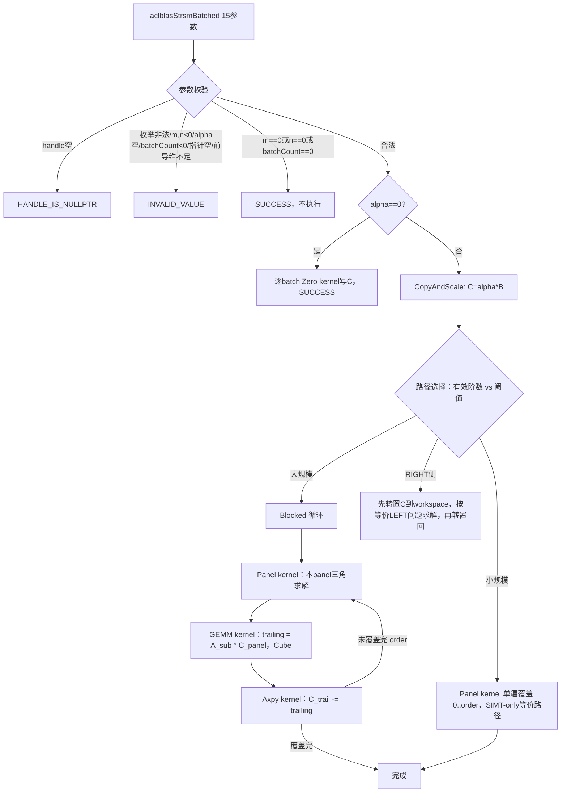

# aclblasStrsmBatched 算子设计文档（A2/A3）

| 项目 | 内容 |
| --- | --- |
| 算子 | `aclblasStrsmBatched`（独立输出重载，15 参数） |
| 任务 | 9月社区任务：`aclblasStrsmBatched` 算子开发（A2/A3） |
| 目标硬件 | Atlas A2（性能验收设备 Atlas 800T A2 / 910B3）、Atlas A3（Atlas 800I A3），均需独立验收通过 |
| CANN 版本 | 9.1.0 |
| 目标目录 | `blas/trsmbatched/arch22/`（实现）、`test/trsmbatched/strsmbatched/arch22/`（测试） |
| 文档版本 | v1.1.0（2026-09-23，经 4 路独立审查修订：参数计数、L1/L0 硬件规格、Trailing GEMM 架构选型等） |

> 本文只描述本任务新增的 arch22（Atlas A2/A3）独立输出实现与公共接口重载声明。仓内已有的 `blas/trsmbatched/arch35/`（Atlas 950，原地覆写语义）实现与既有公共声明不在本任务改动范围内。
>
> **v1.1.0 修订说明**：v1.0.0 经 4 个独立审查（源码 fact-check、arch22 Cube 可行性、分块 TRSM 算法正确性、任务书合规性比对）后发现并修正：(1) 参数计数错误（13/15，非此前的 12/14）；(2) Trailing GEMM 的 Cube 实现从"参照 `chemm` 手写底层 API"改为"参照 `ssymm`/同算法家族 `experimental` 原型的 `lib/matmul_intf.h` 高层模板"（`chemm` 是孤例、无双缓冲、仅支持 64/32 对齐尺寸，不适合分块 TRSM 的非对齐 trailing 块场景）；(3) A2/A3 硬件规格改用 `blas/common/arch/hardware.h` 权威表（L1=512KB，此前版本方向写反）；(4) 补充双重缩放 bug 预警、workspace 偏移耦合风险、任务书 §3.1/§3.4 遗漏条款等。

# 需求背景（required）

## 需求来源

- 随任务下发的《aclblasStrsmBatched_A2A3 任务书》及配套测试材料（`test_cases/strsmbatched_test.csv` 1200 条、`test_cases/gpu_baseline.csv` 200 条 GPU 基线、`test_cases/gen_csv.py`、`test_cases/verify_accuracy.py`）。
- 目标代码仓：[cann/ops-blas](https://gitcode.com/cann/ops-blas)。
- 社区任务流程：[2026 社区任务参与及 PR 流程](https://gitcode.com/cann/cann-ops-competitions/blob/master/04_tasks/01_community-task-2026/README.md) 与【社区任务】流程注意事项（gitcode.com/org/cann/discussions/39）。
- 算法语义参考：cuBLAS `cublasStrsmBatched`（[官方文档](https://docs.nvidia.com/cuda/cublas/index.html#cublas-t-trsmbatched)）；精度 golden 由 cblas（Netlib BLAS `strsm`）逐 batch 生成。

## 背景介绍

`aclblasStrsmBatched` 是 BLAS Level 3 批量三角求解算子：对 `batchCount` 个相互独立、同尺寸的三角线性系统批量求解 `op(A[i]) * X[i] = alpha * B[i]`（LEFT）或 `X[i] * op(A[i]) = alpha * B[i]`（RIGHT），`A[i]` 为三角矩阵。相比 cuBLAS 原地覆写语义（解 X 覆写 B），本任务要求**独立输出**：新增 `Carray`/`ldc`，B 只读输入，`C[i] = X[i]` 离席写出，C 与 A/B 不允许内存重叠。

## 任务启动基线

| 项目 | 当前状态 | 本任务处理 |
| --- | --- | --- |
| 公共 API | `include/cann_ops_blas.h:529` 已有 `aclblasStrsmBatched` **13 参数**声明（`handle, side, uplo, trans, diag, m, n, alpha, A[], lda, B[], ldb, batchCount`，B 原地读写，arch35 使用） | 新增第二个重载（**15 参数**，`Barray` 只读 + `Carray`/`ldc`），参数个数不同不构成重载歧义，不改动既有声明 |
| `arch35/trsmbatched` | `blas/trsmbatched/arch35/strsmbatched_host.cpp`（723 行）已有完整实现：`ValidateTrsmbatchedEnums/Params` 校验范式、SIMT-only / Blocked 双路径选择、panel 求解 + trailing GEMM + axpy 的分解式 kernel 组、workspace 复用协议。但该实现走仓库自研的 SIMT 抽象层（`__simt_vf__`/`asc_vf_call`，`kernel_operator.h`+`simt_api/asc_simt.h`）与手写 Cube 抽象（`Location::L0A/L0B/L0C/L1`+`MakeTensor`），均为 arch35 专属工具链，**不能直接迁移到 arch22** | 复用其 Host 侧校验/路径选择/workspace 管理**范式**（非代码），kernel 侧改用 arch22 标准 AscendC 编程模型重写 |
| `experimental/aclblasTrsmBatched` | 另一贡献者（HuangRZzzz，5月同类任务）留下的原型：MIX_AIC_1_2（AIV panel 求解 + AIC Cube trailing GEMM，`CrossCoreSetFlag` 跨核同步），在 **Ascend910B4**（A2 同代）实测过、有 320 用例性能报告（`docs/perf_report_320cases.md`）。接口是 13 参数原地版本（`int64_t` 参数），与本任务 15 参数独立输出签名不同 | **不直接复用/署名**（作者是其他社区成员）；仅作性能可行性与算法思路参考（panel 分块尺寸、L1 预算计算方法） |
| `arch22` AIV 编程模型 | `blas/trsv/arch22/strsv_kernel.cpp`（非批量三角求解）：`GlobalTensor`/`LocalTensor`/`TQue<VECIN/VECOUT>` 标准 AscendC，AIV-only，无 Cube | AIV 部分（panel 求解/axpy/transpose/scale/zero）参照 `strsv` |
| `arch22` Cube 编程模型（**已修正**） | 全仓 28 个 `blas/*/arch22` 目录里，**只有 `blas/hemm/arch22/chemm_kernel.cpp` 一家用手写底层 Cube API**（`LoadData3DParamsV2`+`Mmad`+`Fixpipe`+`TPosition::A1/B1/A2/B2/CO1` 显式分配），是孤例、不是范式；真正的主流写法是官方高层模板库 `lib/matmul_intf.h`（`MatmulType<TPosition::GM,...>`+`Matmul<MmA,MmB,MmC> mm`），`blas/symm/arch22/ssymm_kernel.cpp`（同为 Level-3 GEMM-like 算子）与**同算法家族、已在 Ascend910B4 实测过 320 用例的 `experimental/aclblasTrsmBatched/op_kernel/trsm_batched_aic.h`** 都用这套高层 API，且 experimental 版本已经解决了"trailing 块非 64/32 整除尺寸"的 padding 问题——chemm 的手写路径反而只支持 64/64/32 整除尺寸，不满足就整体退化纯 AIV，不适合 panel 尺寸逐轮递减、几乎必然出现非对齐余量的分块 TRSM | Trailing GEMM **改用 `lib/matmul_intf.h` 高层模板**（对齐 `ssymm`/`experimental trsm_batched_aic.h` 的 API 选型，不抄 chemm 的手写 Cube 写法；框架自带双缓冲/流水调度与任意 M/N/K tiling，显著降低实现风险） |
| `blas/trsv/arch22/strsv_host.cpp` | Host 侧用 `aclrtMalloc`+H2D/D2H 显式搬运 A/x 到自建 device buffer，并在函数内部 `aclrtSynchronizeStream`——与任务书"Device 内存，只读/独立输出"及"异步执行、调用方负责同步"的要求不一致，是质量较弱的参照 | **不采用**其 host 侧模式；改采 `blas/hemm/arch22/chemm_host.cpp` 的模式（直接使用调用方传入的 Device 指针，不做二次搬运，不在函数内部同步） |
| `blas/CMakeLists.txt` | `SOC_ARCH_DIRS` 通配已同时支持 `arch22`/`arch35`，新建 `blas/trsmbatched/arch22/` 目录后源文件按现有 glob 规则自动收编，无需改 CMake | 仅需确认新目录被正确收编（构建验证项，非代码改动） |
| 测试工程 | `test/trsmbatched/`（arch35 对应目录）已有 CSV 驱动 GTest 模式；本任务 CSV 列结构为 `case_name,description,side,uplo,trans,diag,m,n,alpha,lda,ldb,batchCount,a,b,expect_result,mere_threshold,mare_multiplier,random_seed`（**无 C/ldc 列**——C 为纯输出，测试工程侧自行分配，不从 CSV 读取填充模式） | 新建 `test/trsmbatched/strsmbatched/arch22/`，wrapper 侧新增 C 输出缓冲区分配与释放逻辑（CSV 没有这部分，需按仓内其它离席算子的测试 wrapper 惯例补齐） |
| 任务配套材料 | `strsmbatched_test.csv` 1200 条（1000 精度 + 200 性能，见下表分类）、`gpu_baseline.csv`（200 条，`gpu_ms` 列，A100 实测）、`verify_accuracy.py`（`--repo`+`--soc ascend910b3` 自动跑 `build.sh` + GTest，自动排除 `TC_PF_` 前缀） | 官方脚本与 CSV 原件不修改，作为验收输入；性能判定按 `gpu_ms/0.8` 换算（任务书 §3.3 五条典型 case 已核对与 `gpu_baseline.csv` 的 `strsmBatched-base-000~004` 逐条吻合，见"性能分析"节） |
| API 文档 | `docs/zh/api_list.md` 当前无 `aclblasStrsmBatched` 独立输出重载条目 | 新增条目，标注 A2/A3 支持 |

## 功能价值

完成后，Atlas A2/A3 系列产品可通过统一的 ops-blas 句柄式接口执行 FLOAT32 批量三角求解并获得独立输出，与仓内已有的 arch35 原地版本互为不同硬件目标的对等实现，公共头文件的重载声明为其他产品线复用该接口铺路。

# 需求分析（required）

## 需求描述

### 接口

`include/cann_ops_blas.h` 在现有 13 参数 `aclblasStrsmBatched` 声明（约 `:529`）邻近位置新增第二个重载：

```cpp
aclblasStatus_t aclblasStrsmBatched(
    aclblasHandle_t handle,
    aclblasSideMode_t side, aclblasFillMode_t uplo,
    aclblasOperation_t trans, aclblasDiagType_t diag,
    int m, int n,
    const float* alpha,
    const float* const* Aarray, int lda,
    const float* const* Barray, int ldb,
    float* const* Carray, int ldc,
    int batchCount);
```

`handle` 为 Host 侧句柄，携带 stream；`Aarray`/`Barray`/`Carray` 及其指向的每个地址均为 Device 内存；`Barray` 只读、`Carray` 独立输出，二者不允许内存重叠。算子使用 `handle` 绑定的 stream 异步执行，调用者读回 `Carray` 前必须自行同步 stream（本算子内部不做同步，与 `arch35` 现有实现及 `chemm`/`gemv_batched` 等既有 arch22 句柄式接口一致）。

### 数学定义

对每个 batch `i ∈ [0, batchCount)` 独立求解，`op(A[i])` 由 `trans` 决定（`ACLBLAS_OP_N`→`A[i]`，`ACLBLAS_OP_T`→`A[i]ᵀ`；实数无共轭语义，**不支持 `ACLBLAS_OP_C`**，与 cuBLAS 在实数档下把 `OP_C` 等价 `OP_T` 的宽松处理不同——任务书明确收紧为非法枚举）：

```text
side=LEFT:  op(A[i]) · X[i] = alpha · B[i]    A[i] 为 m×m
side=RIGHT: X[i] · op(A[i]) = alpha · B[i]    A[i] 为 n×n
C[i] = X[i]
```

`uplo` 指定 A 的上/下三角部分被引用；`diag=UNIT` 时对角元视为 1（不读取存储值）；列主序存储，`A[i]` 前导维 `lda`，`B[i]`/`C[i]` 前导维 `ldb`/`ldc`（均为 `m×n`）。

### 参数与返回值语义

任务书 §2.4 只逐参数列出了合法值域与对应异常行为（表格形式），**没有规定校验的先后顺序**；下表的顺序是本设计参照 `arch35` 现有 `ValidateTrsmbatchedEnums`/`ValidateTrsmbatchedParams` 的实际代码顺序拟定的（同一算子族保持顺序一致，便于调用方形成稳定预期），逐条落实任务书 §2.4 规定的错误码，但顺序本身不是任务书强制要求，属设计选择，PR 评审阶段如有更合适的顺序约定可调整：

| 顺序 | 条件 | 行为 |
| --- | --- | --- |
| 1 | `handle == nullptr` | `ACLBLAS_STATUS_HANDLE_IS_NULLPTR` |
| 2 | `side`/`uplo`/`trans`/`diag` 不在合法枚举内（`trans` 仅接受 `ACLBLAS_OP_N`/`ACLBLAS_OP_T`，`ACLBLAS_OP_C` 判非法） | `ACLBLAS_STATUS_INVALID_VALUE` |
| 3 | `m < 0` 或 `n < 0` | `ACLBLAS_STATUS_INVALID_VALUE` |
| 4 | `alpha == nullptr` | `ACLBLAS_STATUS_INVALID_VALUE` |
| 5 | `batchCount < 0` | `ACLBLAS_STATUS_INVALID_VALUE` |
| 6 | `Carray` 为空，或其中任一元素地址为空（C 是唯一无条件被引用的数组——即使 `alpha==0` 也要写零，所以 `Carray` 的检查不受 `alpha` 取值影响） | `ACLBLAS_STATUS_INVALID_VALUE` |
| 7 | `*alpha != 0` 时：`Aarray`/`Barray` 为空，或其中任一元素地址为空 | `ACLBLAS_STATUS_INVALID_VALUE` |
| 8 | `*alpha != 0` 时：`lda < max(1, k)`（`k = side==LEFT ? m : n`），`ldb < max(1, m)`；`ldc < max(1, m)` 始终检查（C 始终被引用） | `ACLBLAS_STATUS_INVALID_VALUE` |
| 9 | `m == 0 \|\| n == 0 \|\| batchCount == 0` | 合法 no-op，返回 `ACLBLAS_STATUS_SUCCESS`，不执行计算、不触发 Kernel |
| 10 | `alpha == 0`（且未在第 7/8 步因跳过而漏检 `Carray`/`ldc`） | `A[i]`/`B[i]` 不被引用，`C[i]` 逐 batch 置零，返回 `ACLBLAS_STATUS_SUCCESS` |

说明：

- **`alpha==0` 免检 A/B 指针是任务书 §2.5 明确写的**（"`alpha=0` 时 A[i]、B[i] 不被引用（B 无需为有效输入）"），本设计把这条从 `arch35` 现有代码里**只对 A 生效**（`*alpha != 0.0f && A == nullptr` 才检查 A，但 `B == nullptr` 是无条件检查，因为 `arch35` 是原地版本、B 同时是输出目标，任何 alpha 取值都必须能写）**扩展到同时覆盖 A 和 B**——本任务的 `Barray` 只读，`alpha==0` 时确实不需要读它，这是相对 `arch35` 现有代码的一处必要修正，不能整段照抄。`Carray` 因为始终是写入目标，不享受这条豁免，任何 alpha 取值下都必须校验。
- `batchCount` 的合法下界从 `arch35` 现有的 `< 1`（即 `batchCount==0` 非法）放宽为本任务的 `< 0`（即 `batchCount==0` 合法 no-op），这是任务书明确要求的语义差异，编码时不能直接复用 `arch35` 的 `batchCount < 1` 判断。
- `Aarray`/`Barray`/`Carray` 的**逐元素**空指针检查需要先把指针数组从 Device 拷回 Host 才能判空（`arch35` 现有 `CopyPtrArraysD2H` 已有该模式，本任务同样需要，且新增对 `Carray` 元素的空指针检查——`arch35` 版本没有这一项，因为它没有独立的 C 数组）。
- **no-op 判定（第 9 步）与指针/前导维校验（第 6-8 步）的相对顺序**：仓内存在两种先例（`arch35 trsmbatched`：先全量校验再以 `if (m==0||n==0) return SUCCESS` 短路；`isamin`：quick return 优先于指针检查）。经核对官方 `strsmbatched_test.csv` 的全部 27 条 `TC_ED` 边界用例，**没有任何一条把 `m==0`/`n==0`/`batchCount==0` 与空指针组合在一起**（`TC_ED_148~152` 均是纯 no-op、指针合法；空指针类用例 `TC_ED_155~162` 均是 `m=n=16` 的正常尺寸），也就是说官方用例**不区分**这两种实现顺序，两种写法都能通过官方 1200 条。本文档按"参数与返回值语义"表的顺序（同族 `arch35` 先例）定稿，但这是一个官方用例没有锁定、评审可能有不同意见的点，不是可以从数据里反推出"标准答案"的问题，落地时如评审对此有明确要求以评审意见为准。
- `TC_ED_154`（`alpha0_nullA`：`alpha=0` + A 传 `NULLPTR`，期望 `SUCCESS`）**证实了上面"alpha=0 免检 A"的修正方向是对的**；但官方 CSV 没有 `alpha=0 + B 空指针` 的对应组合用例，"免检范围从 A 扩大到 B"是本设计基于任务书 §2.5 文字的推断，未被官方用例直接验证，落地时需要**自行补充一条 `alpha=0 + Barray=NULLPTR` 的用例**去锁定这个行为（任务书 §3.5.4 本就要求"配套用例没覆盖的场景需自行补充"）。
- 状态码语义以 `include/cann_ops_blas_common.h` 为准，不新增状态码。

### 特殊场景

| 场景 | 行为 |
| --- | --- |
| `m=0` 或 `n=0` 或 `batchCount=0` | 合法 no-op，`SUCCESS`，不触碰任何 Device 内存 |
| `alpha=0` | `A[i]`、`B[i]` 不被引用（即使为非法地址也不校验到，因为该分支已越过指针校验），`C[i]` 逐 batch 置零 |
| `diag=UNIT` | 对角元不读取存储值，视为 1（`arch35` panel kernel 已有 `DIAG_IS_UNIT` 编译期分支，同样思路） |
| `C` 与 `A`/`B` 内存重叠 | 任务书 §2.5 要求"不允许重叠"；本设计**不做运行时检测**（工程决策，非任务书明文要求），违反时行为未定义，由调用方保证 |

## 需求拆解

| 子任务 | 设计输出 | 验收重点 |
| --- | --- | --- |
| 公共声明 | `include/cann_ops_blas.h` 新增 15 参数重载 | 与现有 13 参数声明不冲突，签名与任务书 §2.3 逐字段对齐 |
| Host 接口 | 校验、no-op/alpha=0 快速路径、tiling、workspace、SIMT/Blocked 路径选择、异步发射 | 状态码顺序、指针逐元素检查、`Barray` 只读语义、`Carray` 独立输出正确性 |
| CopyAndScale / Zero kernel（AIV） | `C[i]=alpha*B[i]` / `C[i]=0` | 独立输出改造的关键落点：不得写回 B |
| Panel 求解 kernel（AIV） | 面板内前代/回代三角求解，标准 AscendC（`GlobalTensor`/`LocalTensor`/`TQue`）重写，非 arch35 SIMT 范式 | 四种 uplo×trans 组合、diag 处理、列分核正确 |
| Trailing GEMM kernel（AIC，Cube） | `temp = A_sub × C_panel`（或转置形式），改用 `lib/matmul_intf.h` 高层模板（参照 `ssymm`/`experimental trsm_batched_aic.h`，非 `chemm` 手写底层 API） | Matmul 模板参数选型、非对齐尺寸 padding 策略、精度累加正确 |
| Axpy kernel（AIV） | `C_trail -= temp` | 逐元素减法，双缓冲流水 |
| Transpose kernel（AIV） | RIGHT 侧转换为等价 LEFT 问题时的 C 转置 | 转置正确性、workspace 复用不越界 |
| 测试工程 | `test/trsmbatched/strsmbatched/arch22/` CSV 驱动 GTest，C 输出缓冲区分配 | 覆盖任务书全部有效维度与官方 1200 条用例；A2、A3 均需跑通 |
| 文档 | `blas/trsmbatched/README.md` 产品支持表加 A2/A3 列、`docs/zh/api_list.md` 补条目 | API 与实现一致 |

## 验收口径

### 精度

FLOAT32 混合容差标准（生态算子开源精度标准）：

```text
逐元素：|actual - golden| <= atol + rtol * |golden|         atol=rtol=2^-13≈1.2207e-4
整体：matched_ratio >= 0.99  且  max_abs_error <= 1e-2（或 32×ULP，规约场景可放宽至 2ULP）
```

golden 由 cblas（Netlib BLAS `strsm`）逐 batch 生成（测试工程内提供，本任务不新增 golden 生成逻辑）。CSV 的 `mere_threshold` 列已固定为 `0.0001220703125`（即 2⁻¹³），与任务书阈值一致。

### 性能

任务书 §3.3 五条典型 case 达标耗时，经与 `gpu_baseline.csv` 的 `strsmBatched-base-000~004` 行核对，公式为 `达标耗时 = gpu_ms × 1000 / 0.8`：

| case | batchCount | m | n | side/uplo/trans/diag | gpu_ms（A100 实测） | 达标耗时（us） |
| --- | ---: | ---: | ---: | --- | ---: | ---: |
| base-000 | 64 | 256 | 256 | LEFT/LOWER/N/NON_UNIT | 0.504585 | 630.7 |
| base-001 | 128 | 384 | 512 | LEFT/UPPER/T/NON_UNIT | 2.449540 | 3062 |
| base-002 | 32 | 1024 | 1024 | RIGHT/LOWER/N/UNIT | 4.107520 | 5134 |
| base-003 | 8 | 2048 | 2048 | LEFT/UPPER/T/NON_UNIT | 6.944380 | 8680 |
| base-004 | 2 | 4096 | 4096 | RIGHT/UPPER/N/UNIT | 11.488800 | 14361 |

其余 195 条 TC_PF 用例按同一公式对各自 `gpu_baseline.csv` 行的 `gpu_ms` 判定。计时口径：`msprof op` 采集 `OpBasicInfo.csv` 的 `Task Duration(us)`，按 kernel 名分组求平均单次耗时（GTest 端到端耗时含 host 开销，不作为发布依据，仅粗筛，与 icamin 项目的教训一致）。

# 详细设计（required）

## 算子分析

### 数学公式

```text
side=LEFT:  op(A[i]) · X[i] = alpha · B[i]      A[i]: m×m
side=RIGHT: X[i] · op(A[i]) = alpha · B[i]      A[i]: n×n
C[i] = X[i]                                     i = 0..batchCount-1
```

blocked 算法（LEFT，NoTrans，Lower，正向递推为例；其余 7 种 uplo×trans×方向组合对称推导）：将 `C[i]` 按行分成宽度 `nb` 的 panel，从上到下推进：

```text
for each panel k (rows [k*nb, k*nb+bs)):
    1) panel 内三角求解：C[panel_rows, :] = TriSolve(A[panel_rows, panel_rows], C[panel_rows, :])   // AIV
    2) trailing 更新：C[trail_rows, :] -= A[trail_rows, panel_rows] * C[panel_rows, :]                // AIC Cube GEMM + AIV axpy
```

正确性依据：这是标准 LAPACK 分块 TRSM（`?trsm` 的 blocked 变体）的推导——把 `A`（下三角）按行块划分为 `[[A11, 0], [A21, A22]]`、`C` 对应划分为 `[C1; C2]`，`A·C=B` 展开为 `A11·C1=B1` 与 `A21·C1+A22·C2=B2`，先解出 `C1`（panel 内小三角求解），再把 `A21·C1` 从 `B2` 中减去得到修正后的右端项，递归对 `A22·C2=B2-A21·C1` 求解，逐 panel 推进即得到与直接对整个 `A` 做三角求解完全一致的结果（非近似算法，只是重新组织了计算顺序以让大头计算量落进 Cube 核）。Upper/Trans/Right 三个维度分别对应"反向递推"、"下标转置访问"、"整体转成等价 LEFT 问题再转置回"，与仓内 `arch35` 现有实现的分支结构一致，本任务只重写 kernel 层的具体指令，不改变这套分支拓扑。

### 支持数据类型

FLOAT32（单精度实数）。列主序，`A` 前导维 `lda`，`B`/`C` 前导维 `ldb`/`ldc`。

### 支持形状

`A[i]`：`m×m`（LEFT）或 `n×n`（RIGHT）；`B[i]`、`C[i]`：`m×n`；`batchCount` 个独立矩阵组，batch 间尺寸/地址互不关联。`m=0`、`n=0`、`batchCount=0` 为合法 no-op。任务配套 CSV 实测尺寸范围（`-1` 为负向用例的故意非法值，不计入正常形状范围）：精度用例 `m,n ∈ [0,2048]`、`batchCount ∈ [0,1024]`；性能用例 `m,n ∈ [8,4096]`、`batchCount ∈ [1,1024]`。

### 实现方案比较

| 方案 | Trailing 更新算力载体 | 结论 |
| --- | --- | --- |
| 纯 AIV panel-by-panel（无 Cube） | 向量核逐元素累乘累加 | 小尺寸（m 或转换后有效阶数较小）够用，实现简单、无 Cube 编程风险；大尺寸下 `O(n^3)` 累加全部压在向量核，无法在 case 5（4096×4096×batch2，14361us 门限）内完成——**不能覆盖全部性能 case，仅作小规模路径** |
| Panel AIV 求解 + Trailing AIC Cube GEMM（本方案） | 立方核做 `trailing` 部分的矩阵乘，向量核只做 panel 内小三角求解与 axpy | 与 `arch35` 现有实现的分工模式一致；Cube 部分改用 `lib/matmul_intf.h` 高层模板（`ssymm`、同算法家族的 `experimental trsm_batched_aic.h` 均如此），采用 |
| 单 kernel 融合（仿 `experimental` 的 MIX_AIC，跨核 `CrossCoreSetFlag` 同步） | 单发射内 AIV/AIC 协同 | 省发射开销，性能上限更高，但跨核同步语义在不同芯片上有实测差异（icamin 项目教训：`CrossCoreSetFlag` 在 950PR 上不是全屏障，需换 `SyncAll`；A2/A3 上的同等原语未经验证），且该模式是他人未署名工作，不作为一期方案的架构基础，留作后续性能优化方向 |

## 算子实现

### 总体执行流程



### Host 侧设计

#### Tiling 与路径选择

沿用 `arch35` 现有阈值结构（`BLOCKED_THRESHOLD`/`SIMT_BLOCKED_N_THRESHOLD` 同名常量，数值需按 A2/A3 的 UB/L1/Cube tile 规格重新标定，不能直接照搬 arch35 的 128/256）：

```text
side=LEFT:
  useBlocked = (m > BLOCKED_THRESHOLD) || (m <= BLOCKED_THRESHOLD && n >= SIMT_N_THRESHOLD)
side=RIGHT:
  先判断有效阶数 n 是否超阈值，走对称逻辑；RIGHT 问题整体转换为
  "转置C、按LEFT问题求解、转置C回"，复用同一套 LEFT 路径代码
```

panel 尺寸 `panelBs` 按有效阶数分档取值（`arch35` 现有 `ChoosePanelSize` 的思路：小矩阵用较小 panel 避免 UB 浪费，大矩阵用较大 panel 减少 panel 轮数）。Trailing GEMM 的 Cube tile 形状交给 `lib/matmul_intf.h` 高层模板管理（见下方"UB/L1/L0 预算"与"Kernel 侧设计"），host 侧只需按 A2/A3 的 L1=512KB（远大于最初参照 `chemm` 起点尺寸时误判的规格）传入合适的 tile 形状参数，不需要像手写 Cube 方案那样自己核算 L1/L0 各分区字节数。

#### 独立输出改造

`arch35` 现有算法全程在 B 上原地读写；本任务改为：

1. 先发 `CopyAndScale` kernel：`C[i] = alpha * B[i]`（`alpha==1` 时退化为纯拷贝，仍需要这一步，因为后续所有 panel/GEMM/axpy 操作都只读写 C，不再碰 B）——**这一步是逐 batch 循环内部的一个 kernel 发射，不是批次外的单一全局步骤**（`Aarray`/`Barray`/`Carray` 是独立指针数组，各 batch 地址互不相关，必须逐 batch 处理；总体执行流程图里画成路径选择之前的单一节点是简化表示，不代表脱离 per-batch 循环）；
2. 后续 panel 求解、trailing GEMM、axpy、transpose 全部只操作 C 与只读的 A，B 在这一步之后不再被访问；
3. RIGHT 侧的"转置求解再转置回"发生在 C 与 workspace 之间，不涉及 B。

这样 `arch35` 现有的 panel/GEMM/axpy/transpose 算法结构可以整体保留（把所有函数签名里的 `B` 参数替换为 `C`，`A` 仍只读），只有 kernel 的底层指令要换成 arch22 API。

**⚠️ 移植时必须删除内部残留的重复缩放调用，否则会产生 `C = alpha² * B` 的双重缩放 bug**：`arch35` 现有代码的 `ScaleBByAlpha` 并不是只调用一次，而是分散在 `TrsmbatchedLeftSimtPath`/`TrsmbatchedRightSimtPath`/`TrsmbatchedLeftBlockedPath`/`TrsmbatchedRightDevicePath` **四个路径入口函数内部各自调用一次**（RIGHT 路径之所以不会被二次缩放，是因为它调用内层 LEFT 路径时显式传 `alpha=1.0f`，配合 `ScaleBByAlpha` 内部的 `if (alpha==1.0f) return;` 短路）。本设计把这套分散调用折叠成一次外层统一的 `CopyAndScale: C=alpha*B`，这个简化本身合理，但**如果实现时只是机械地把这四个路径函数体里的"B"替换成"C"，而没有同步删除/屏蔽它们各自内部原有的那次 `ScaleBByAlpha`（改名后应为 `ScaleCByAlpha`）调用**，就会造成 C 被缩放两次。这个 bug 只在 `alpha≠1` 且 `≠0` 时触发，且测试自检"`Barray` 调用后保持不变"完全抓不到（出问题的是 C 不是 B），会导致 TC_AB（alpha 特殊值，16条）大面积精度失败、排查成本高。落地编码时的检查点：四个路径函数移植进 arch22 版本后，函数体内部**不应再出现任何缩放调用**，缩放只在最外层 `CopyAndScale` 发生一次。

#### Workspace

- Blocked 路径的 trailing GEMM 结果需要 temp 缓冲（不能直接累加进 C：Cube 算完一个 tile 的 GEMM 结果后要经 Fixpipe 落盘，再由 AIV 做 `C -= temp`，如果直接把 GEMM 结果累加写回 C，会与同一 panel 内其他 tile 的并发访问产生数据竞争）；
- RIGHT 侧转置需要额外一块 `n×m`（转置后维度）缓冲；
- 复用 `GetEffectiveWorkspace`/`EnsureDefaultWorkspace`（定义在 `blas/common/helper/aclblas_handle_internal.h`，与核数查询函数 `GetAivCoreCount`/`GetAicCoreCount` 所在的 `common/helper/host_utils.h` 是两个不同头文件，`arch35` 现有代码里两者一并 include，`arch35` 现有机制），按 blocked/right 两路径的最大需求量申请。

#### UB / L1 / L0 预算

`blas/common/arch/hardware.h` 有按 `ArchType` 特化的权威硬件参数表，被 `blas/dot/arch22`、`blas/syr/arch22` 等 12+ 个 arch22 kernel 实际引用（非孤例常量）：

| 硬件参数 | arch22（`ASCEND_V220`，A2/A3） | arch35（`ASCEND_V350`，950，仅作对照） |
| --- | ---: | ---: |
| UB | 192 KB | 248 KB |
| L1 | **512 KB** | 32 KB |
| L0A / L0B | 64 KB | — |
| L0C | 128 KB | 256 KB |
| L1↔L0 block size | 32 | 16 |

**此前版本此处有一处方向性错误已修正**：不是"不能假设 A2/A3 和 950 一样是 512KB"，而是 950（arch35）的 L1 实际只有 32KB，反而是 arch22 的 L1 比 arch35 大 16 倍。`strsv/arch22` 独立写死的 `UB_SIZE=192*1024`（另有 `blas/ger/arch22/sger_kernel.cpp:20`、`blas/rotm/arch22/srotm_kernel.cpp:25` 两处交叉印证）与上表 UB=192KB 吻合，可信。

| 缓冲 | 用途 | 预算 |
| --- | --- | --- |
| Panel 求解 UB（AIV） | 面板 `panelBs×panelBs` 三角块常驻 + `TQue<VECIN/VECOUT,2>` 双缓冲的 C 列块 | 预算上限 192KB，具体 `panelBs` 分档取值需实测标定（见"工程实现与验收门禁"） |
| Trailing GEMM（AIC，Cube） | 改用 `lib/matmul_intf.h` 高层模板后，L1/L0A/L0B/L0C 的具体切分由框架内部管理，不需要本设计手工核算 `aSizeAlignL1` 等字段 | 只需在调用 `MatmulType`/`Matmul` 时提供正确的 tile 形状参数；512KB L1 预算远大于 `chemm` 起点尺寸（64×64×32 tile 实际仅占约 16KB，不到 4%），有充分空间把 base tile 取得更大以提高 Cube 利用率，具体取值留待实测 |

### Kernel 侧设计（arch22 标准 AscendC，AIV 参照 `strsv`，Cube 参照 `ssymm`/`experimental trsm_batched_aic.h`）

#### CopyAndScale kernel（AIV）

`C[i] = alpha * B[i]`，按 `strsv/arch22` 的 `GlobalTensor`+`TQue<VECIN,2>`/`TQue<VECOUT,2>` 双缓冲搬运范式：`CopyIn(B tile)` → `Muls(tile, tile, alpha)` → `CopyOut(C tile)`，按核分列区间。`alpha==1` 时跳过 `Muls`，直接 `DataCopy` 直通。

#### Zero kernel（AIV）

`alpha==0` 路径：`Duplicate(0.0f)` 填充后 `DataCopy` 写出到 `C[i]`，不触碰 `A`/`B`。

#### Panel 求解 kernel（AIV）

对 `[panelStart, panelStart+panelSize)` 子块做前代（Lower/NoTrans 或 Upper/Trans）或回代（其余两种组合）三角求解，按列分核（每核负责一段 C 的列区间）。与 `strsv/arch22` 的 `Compute()` 的区别：`strsv` 只解一个向量（单列），本 kernel 要对一个 batch 内的 `n` 列 C 同时求解——把 `strsv` 的"每次处理 1 个 `x` 分量"扩展为"每次处理一段 C 的列区间"，面板内 A 子块（`panelSize×panelSize`）整体载入 UB 常驻（`GlobalTensor`→`LocalTensor` 一次性 `DataCopy`），避免每列重复读 A。四种 `uplo×trans` 组合与 `diag` 处理通过模板参数在编译期特化（同 `strsv` 的 `UploMode`/`TransMode`/`DiagMode` 模板机制）。

#### Trailing GEMM kernel（AIC，Cube 核）——**已改用高层 Matmul 模板，不再参照 chemm**

`temp[trail_rows, :] = A[trail_rows, panel_rows] * C[panel_rows, :]`（NoTrans 情形；Trans 情形调换左右矩阵角色，与 `arch35` 现有 `TrsmbatchedTrailingUpdateNoTrans`/`Trans` 的两套路径同构）。

**此前版本这里写的是参照 `chemm_kernel.cpp` 手写 `LoadData3DParamsV2`+`Mmad`+`Fixpipe`，经子代理审查发现两个实质问题后已推翻**：(1) `chemm` 是全仓 28 个 arch22 目录里唯一用这套手写底层 API 的孤例，不能代表 arch22 Cube 编程的通用范式；(2) `chemm` 的 Cube 主循环实际是单缓冲串行（`a1/b1/a2/b2/c1` 在循环外分配一次，靠 `WaitFlag/SetFlag` 链式强制串行推进，没有双缓冲），且只处理 `m%64==0 && n%64==0 && k%32==0` 的对齐尺寸，不满足就整体退化到纯 AIV fallback kernel——而分块 TRSM 的 trailing 块行数每 panel 递减，几乎不可能一直保持 64 对齐，照抄这个"不对齐就整体退化"的策略会让 Cube 路径在绝大多数 panel 边界失效，直接打穿大尺寸 case（base-003/004，8680/14361us 门限）的性能目标。

**改为使用官方高层模板库 `lib/matmul_intf.h`**（`MatmulType<TPosition::GM, CubeFormat::ND, float>` 定义 A/B/C 的类型描述符，`Matmul<MmA, MmB, MmC> mm` 声明矩阵乘对象，`mm.SetTensorA/SetTensorB`+`mm.IterateAll`/`mm.GetTensorC` 完成计算），理由：

- 仓内真正有代表性的两个 Cube 先例都用这套 API：`blas/symm/arch22/ssymm_kernel.cpp`（同为 Level-3 GEMM-like 算子）与**同算法家族、已在 Ascend910B4（A2 同代）实测过 320 用例的 `experimental/aclblasTrsmBatched/op_kernel/trsm_batched_aic.h`**（其注释明确写"GEMM rank-K updates via Matmul library"）；
- `experimental` 版本已经用 padding 方案解决了"trailing 块非对齐"问题（AIV 侧构造 padded 规范化缓冲，AIC 只在 Cube-safe 的 padded 维度上做 rank-K，不整体回退），这正是本设计需要的能力，比 chemm 的整除即用/否则整体放弃策略更合适分块 TRSM 的场景；
- 框架内部管理 L1/L0 双缓冲与流水调度，不需要本设计手工维护 `Nd2NzParams`/`LoadData3DParamsV2` 字段和 event 依赖链，显著降低实现与调试风险；
- 512KB 的 A2/A3 L1 预算（见"UB/L1/L0 预算"）远大于按 `chemm` 起点尺寸推算的占用量，用高层模板可以更自然地把 tile 取大，不需要手工反复核算 L1/L0 分区字节数。

`k` 维（panel 尺寸）方向的循环、首块清零/后续累加的控制，交由 `Matmul` 对象的迭代接口处理，不需要本设计手写 `MmadParams.cmatrixInitVal` 这类底层控制字段。具体的 `MatmulType`/`MatmulImpl` 模板参数组合、tile 形状取值，需要参照 `ssymm_kernel.cpp` 与 `trsm_batched_aic.h` 的实际写法在落地编码阶段确定（这是"工程实现与验收门禁"里新增的一条待验证项，不是本文档能纸面定死的细节）。

#### Axpy kernel（AIV）

`C[trail_rows, :] -= temp`，逐元素减法，`Sub` 向量指令，双缓冲流水，接口与语义对齐 `arch35` 现有 `TrsmbatchedAxpySimt`，指令换成标准 AscendC `Sub`/`DataCopy`。

#### Transpose kernel（AIV）

RIGHT 侧问题转换需要的 C 转置（转到 workspace、解完再转置回），沿用 `arch35` 现有 `TrsmbatchedTransposeSimt` 的分块转置思路，指令换成标准 AscendC。

#### Tiling 数据传递方式

按值传入 `extern "C" __global__` kernel（如 `sger_kernel`/`srotm_kernel`/`sspmv_kernel`/`stbmv_kernel`/`stpmv_kernel`/`srotg_kernel`/`chpr_kernel` 等至少 7 个 arch22 算子 + `chemm` 的写法，经审查确认这是仓内多数 arch22 算子的常见模式，非孤例），**不采用** `strsv/arch22` 额外 `aclrtMalloc`+`aclrtMemcpy` 把 tiling 结构体搬到一块 GM buffer 再让 kernel 内部 `reinterpret_cast` 读取的写法——后者多一次不必要的 H2D 拷贝，且 `strsv` 那份实现本身在 Host 侧内存/同步语义上有前述问题，不作为本任务的参照对象。本设计三个 tiling struct（`StrsmbatchedPanelTilingData`/`GemmTilingData`/`AxpyTilingData`）字段均为标量/小数组，体积远小于按值传参的常见上限，按值传参可行。

### 预期文件变更

| 文件 | 变更 |
| --- | --- |
| `include/cann_ops_blas.h` | 新增 15 参数 `aclblasStrsmBatched` 重载声明（紧邻现有 13 参数声明，约 `:529`） |
| `blas/trsmbatched/arch22/strsmbatched_host.cpp` | 新增：校验、no-op/alpha=0 快速路径、tiling、workspace、路径选择、发射 |
| `blas/trsmbatched/arch22/strsmbatched_kernel.cpp` | 新增：CopyAndScale/Zero/Panel/GEMM/Axpy/Transpose 六个 kernel 与对应 `_do` 发射包装 |
| `blas/trsmbatched/arch22/strsmbatched_kernel.h` | 新增：Host 发射声明 |
| `blas/trsmbatched/arch22/strsmbatched_tiling_data.h` | 新增：`StrsmbatchedPanelTilingData`/`StrsmbatchedGemmTilingData`/`StrsmbatchedAxpyTilingData` |
| `test/trsmbatched/strsmbatched/arch22/CMakeLists.txt` | 新增：测试目标注册（`"arch22" IN_LIST SOC_ARCH_DIRS` 时纳入构建） |
| `test/trsmbatched/strsmbatched/arch22/strsmbatched_test.cpp` | 新增：CSV 驱动 GTest（含 C 输出缓冲区分配/释放，官方 CSV 无此列，需按仓内其他离席算子测试 wrapper 惯例补齐）+ 性能计时用例 |
| `test/trsmbatched/strsmbatched/arch22/strsmbatched_test.csv` | 新增：任务配套 1200 条用例入库 |
| `test/trsmbatched/strsmbatched/README.md` | 新增：测试步骤说明（交付件要求可复现） |
| `blas/trsmbatched/README.md` | 更新：产品支持表增加 Atlas A2/A3 列 |
| `docs/zh/api_list.md` | 新增 `aclblasStrsmBatched`（独立输出重载）条目 |

`blas/CMakeLists.txt` 按 `*/${SOC_ARCH_DIRS}/*.cpp` glob 自动收集源文件，`blas/trsmbatched/arch22/*.cpp` 无需改动即编入库（已用 `blas/gemv_batched/arch22`、`blas/hemm/arch22` 等既有目录验证过该 glob 规则生效）。

上表只覆盖 `ops-blas` 代码仓改动。任务书 §4 另要求提交到**开发者私仓**新建的 `task_submission/` 目录（非 `ops-blas` 仓）：`1 自验证步骤说明.md`、`2.1/2.2 精度自验证报告/日志`、`3.1/3.2 性能自验证报告/日志`、`4.1/4.2 内存自验证报告/日志`（共 6 个文件），以及私仓需邀请 `Ascend-CANN` 账号为开发者——这部分是验收流程的行政要求，不是代码改动，照 `H:\st\CANN算子开发-经验手册.md` 里 icamin 项目的流程执行即可，此处不重复列入"预期文件变更"表。

## 支持硬件

| 支持的芯片版本 | 涉及勾选 |
| --- | --- |
| Atlas A2 系列产品（Atlas 800T A2 / 800I A2，性能验收设备 910B3） | √ |
| Atlas A3 系列产品（Atlas 800I A3） | √ |

## 算子约束限制

- `trans` 不支持 `ACLBLAS_OP_C`（实数无共轭语义），传入按非法枚举返回 `ACLBLAS_STATUS_INVALID_VALUE`；
- 任务书 §2.5 原文"原地与视图语义"三要素：**离席计算（结果写入 C）、C 与 A/B 不允许内存重叠、不返回视图**——本设计对"不允许重叠"这条**不做运行时重叠检测**，由调用方保证（这是本设计的工程决策，任务书原文没有说是否需要检测，不要把"不检测"误读成任务书要求）；
- `m=0`、`n=0`、`batchCount=0` 为合法 no-op（不执行计算，不触碰任何 Device 内存）；`alpha=0` 时 A/B 不被引用，C 逐 batch 置零（任务书 §2.5"空 Tensor 与 0 维处理"对应条款，详见"参数与返回值语义"表）；
- 不支持非连续 Tensor（超出 lda/ldb/ldc 语义的访问）、不涉及 broadcast、不要求 dynamic shape、不要求确定性计算（浮点累加顺序不保证逐位一致，含规约场景允许 2ULP 放宽）；
- 异步语义依赖 `aclblasSetStream`，本算子内部不做同步，调用方读回 `Carray` 前需自行 `aclrtSynchronizeStream`；
- `Aarray`/`Barray`/`Carray` 及其指向地址均为 Device 内存，Host 侧仅做指针数组本身的 D2H 拷贝以完成逐元素非空校验（对齐 `arch35` 现有 `CopyPtrArraysD2H` 机制）。

# 可维可测分析

## 精度标准/性能标准

| 类别 | 标准 |
| --- | --- |
| 精度 | cblas（Netlib `strsm`）逐 batch golden；FLOAT32 混合容差 rtol=atol=2⁻¹³，matched_ratio≥0.99 且 max_abs_error≤1e-2（规约场景放宽至 2ULP） |
| 性能 | 5 个典型 case（见"验收口径→性能"表）+ TC_PF 195 条其余用例，NPU 均值 ≤ `gpu_baseline.csv` 对应行 `gpu_ms`/0.8；warmup 后 msprof 采样 |
| 双硬件（最终验收） | 任务书 §7.4："Atlas 800I A2 与 Atlas 800I A3 均需完成验收"——提交验收申请前，两种硬件都要跑通 |
| 双硬件（自验证阶段） | 任务书 §3.1 明确给了口子："自验证只需覆盖一种款型，精度建议 910B3 或者 A3，性能建议 910B3"——**开发过程中的自验证不要求两种硬件都跑**，只有最终提交验收申请前才需要两种都过；这条容易被"最终必须双硬件"的要求盖过而被忽略，误以为日常自验证也要双机全跑，实际不必 |

## 测试用例矩阵

任务配套 CSV（`strsmbatched_test.csv`，固定种子 20260823，1200 条，经本地校验实际分布）：

| 类别 | 前缀 | 条数 | 覆盖 |
| --- | --- | --- | --- |
| L0 基础 | TC_L0 | 32 | side×uplo×trans×diag 16 组枚举全组合 × 小尺寸 × bc=2 |
| L1 尺寸 | TC_SQ | 23 | 23 种尺寸（1→2048，含奇数/边界/非对齐）× 枚举轮转 |
| L2 标量 | TC_AB | 16 | alpha 特殊值（含 0 置零路径）× 枚举组合 |
| L3 batch | TC_BC | 13 | batchCount 规模扫描 1~1024 |
| L3 非方阵 | TC_WS/TH | 12+12=24 | fat（side=LEFT）/thin（side=RIGHT）非方阵 |
| L4 前导维 | TC_LD | 12 | lda/ldb/ldc padding 场景 |
| L5 填充 | TC_FL | 11 | A/B 均匀/交替/极端/Inf/NaN |
| L5b 覆盖 | TC_CV | 16 | 中等尺寸 × 枚举组合抽样 |
| L6 边界 | TC_ED | 27 | 零维/no-op/alpha=0/空指针（含逐元素）/非法枚举（含 OP_C）/非法前导维/负维度/batchCount 负值 |
| EX 扩展 | TC_EX | 826 | 尺寸×枚举×标量×batch×padding 确定性采样，精度条数主力 |
| PF 性能 | TC_PF | 200 | 5 条典型 case 精确匹配 + 规模/枚举/非方阵/大尺寸扫描 |

CSV 无 `Carray`/`ldc` 列（C 为纯输出），测试 wrapper 需自行按 `m×n×batchCount` 分配 C 输出缓冲（Device），精度比对读回 C 与 golden 比对，`a`/`b` 两列沿用 CSV 既有填充模式解析逻辑。

## 精度分析

- golden 由任务方提供的 cblas `strsm` 参考路径逐 batch 生成，测试工程侧不新增 golden 逻辑，只需保证 wrapper 正确调用新签名并把 `Carray` 读回比对（不能像原地版本那样直接比对 `Barray`，`Barray` 在独立输出版本里应保持输入值不变，这本身也是一条隐含的正确性检查点——若测试发现调用后 `Barray` 被修改，说明实现退化成了原地写，是需要拦截的 bug）。
- `diag=UNIT` 情形 A 的对角存储值不应被读取，测试的 `RANDOM_EXTREME` 填充可能在对角放置奇异值（如 0），若实现误读了对角存储值会在这类用例上产生明显精度偏差，是本算子较容易暴露实现错误的场景，需要在精度用例里重点复核。

## 性能分析

### 关键路径

大规模 case（如 case-004: `4096×4096×batch2`）的耗时主要由 blocked 循环内 **trailing GEMM 的 Cube 算力**决定（`O(n^3)` 计算量的大头），panel 内三角求解与 axpy/transpose 是 `O(n^2)` 的向量核开销，随 `panelBs` 选择增大而减小占比。与 icamin（纯归约、访存受限）不同，本算子是计算受限（compute-bound）的 Level-3 算子，性能优化的重心在 Cube tile 尺寸、L1/L0 双缓冲流水是否打满，而不是访存带宽。

### 工程措施

1. **构建类型**：性能验收须 Release 构建（社区同任务实测 Debug 下 kernel 劣化约一个数量级的教训，见经验手册）；
2. **panel 尺寸取舍**：`panelBs` 过小则 panel 轮数多、trailing GEMM 调用次数多（发射与流水填充开销累积）；过大则 panel 内三角求解（纯向量核，`O(panelBs^2)` 逐元素）占比上升、且 UB 装不下——需要按尺寸分档实测标定（`arch35` 现有 `ChoosePanelSize` 的分档思路，具体阈值需按 A2/A3 重新标定，不能照搬 arch35 数值）；
3. **Cube tile 与双缓冲**：改用 `lib/matmul_intf.h` 高层模板后，L1/L0 双缓冲由框架内部调度（**此前版本这里写"参照 chemm 的两个 L1 buffer 交替"是错的**——`chemm` 的 Cube 主循环实际是单缓冲、`WaitFlag/SetFlag` 链式强制串行，没有双缓冲，字面照抄反而拿不到流水收益；`ssymm`/`experimental trsm_batched_aic.h` 用的高层模板才有开箱即用的双缓冲调度）；
4. **发射次数**：blocked 循环每 panel 至少 3 次 kernel 发射（panel 求解 + GEMM + axpy），对 batchCount 较大、单 batch 矩阵较小的 case（如 base-000: `256×256×batch64`）发射次数×batchCount 的固定开销占比会明显放大——是否需要把 batch 维度也编入单次发射的 grid（而非 Host 逐 batch 循环）是本设计需要在实测后复核的优化点，一期先保证正确性用逐 batch host 循环。

### 性能验证方法

1. 固定硬件型号（Atlas A2/910B3、Atlas A3 分别测）、CANN 9.1.0、同一频率与运行环境；
2. `msprof op --application="<test_bin> --gtest_filter=*TC_PF*" --output=./prof_strsmbatched`，采集 `OpBasicInfo.csv` 的 `Task Duration(us)`，按 kernel 名分组求均值；
3. GTest 端到端耗时（含 host 侧生成/拷贝/golden 比对）不作为发布依据，仅粗筛（与 icamin 项目 `verify_performance.py` 的教训一致）。

## 兼容性分析

- 仅新增公共接口重载声明，不修改 `arch35` 现有 13 参数原地实现与其对外行为；
- 新代码仅进入 `arch22`，不改变 `arch35` 既有编译产物；
- 与 cuBLAS 的差异（`trans` 拒绝 `OP_C`、`batchCount==0` 合法 no-op、独立输出而非原地覆写）均为任务书明确要求，非本设计自行引入。

# 工程实现与验收门禁（未验证项，需在真实环境编译探针确认，按优先级排列）

| 工程项 | 风险 | 验证方式 |
| --- | --- | --- |
| `lib/matmul_intf.h` 高层模板的具体调用方式 | 已改用高层 Matmul 模板（见"Trailing GEMM kernel"节），但本会话没有 CANN 工具链可编译验证，具体的 `MatmulType`/`MatmulImpl` 模板参数组合、tile 形状取值仍需照 `ssymm_kernel.cpp`/`experimental/trsm_batched_aic.h` 的实际写法核实；风险等级已从"完全未经验证的手写底层 API"降为"抄写有两个真实先例（含同算法家族）背书的高层 API"，但仍需落地前实操验证 | 落地第一步先写一个最小 Matmul 探针 kernel 单独编译，跑通再接入主流程；非 64/32 对齐尺寸的 trailing 块处理需专门抄 `trsm_batched_aic.h` 的 padding 策略并验证 |
| A2 与 A3 的 UB/L1/L0 实际容量 | 已用 `blas/common/arch/hardware.h`（12+ arch22 kernel 交叉引用）的权威表核实：arch22 UB=192KB、L1=512KB、L0A/B=64KB、L0C=128KB；但 **A3 是否与 A2（910B3）完全相同规格仍未核实**（该表按 `ArchType::ASCEND_V220` 一个特化覆盖，未见 A3 专属特化，需确认是否共用） | 在两种硬件上分别跑通建立差异表，若 A3 确实复用同一 `ArchType` 特化则可放心共用一套 tiling 参数 |
| tiling 阈值（`BLOCKED_THRESHOLD` 等） | `arch35` 现有数值（128/256）是针对 950 标定的，A2/A3 的核数、Cube/AIV 吞吐比不同，直接照搬大概率不是最优，甚至可能不满足性能门限；且 A2/A3 的 L1（512KB）远大于 arch35（32KB），Cube tile 有条件取得比"沿用 chemm 起点尺寸"更大，需要重新推导而非简单继承旧阈值 | 先用保守值跑通正确性，再用 TC_PF 用例做 A/B 实测标定，专门验证放大 tile 尺寸对性能的收益 |
| CSV 无 C 列，测试 wrapper 的 C 缓冲区分配惯例 | 仓内是否有其他"独立输出（非原地）"批量算子的测试 wrapper 可直接抄，还是需要新写 | 检索仓内是否已有类似 `Carray` 模式的现成测试 wrapper（如非批量的独立输出 trsm/gemm 变体），有则对齐其写法 |
| Host 校验顺序与 `arch35` 的 `batchCount` 差异 | `arch35` 现有 `batchCount < 1` 判断若被直接复用会错误拒绝本任务要求合法的 `batchCount == 0` | 编码时显式对照本文档"参数与返回值语义"表逐条实现，不整段复制 arch35 校验函数 |
| no-op 判定与指针校验的先后顺序 | 仓内两种先例并存（`arch35 trsmbatched`：先全量校验再短路；`isamin`：quick return 优先于指针检查），任务书未挑明本任务该用哪种；两者在 `m==0` 且指针非法的负向用例上返回值不同（`INVALID_VALUE` vs `SUCCESS`），会直接影响 TC_ED 边界用例的通过与否 | 本文档已按同族的 `arch35 trsmbatched` 顺序定稿（"参数与返回值语义"表），编码前用任务书配套 CSV 里 `m==0`/`batchCount==0` 与指针异常的组合用例反查期望的 `expect_result`，若 CSV 里没有这类组合用例则按本文档顺序实现并在自测报告里注明取舍 |
| **双重缩放 bug**：`CopyAndScale` 与移植进来的路径函数内部残留缩放调用叠加 | `arch35` 的 `ScaleBByAlpha` 分散在 4 个路径入口函数内部各自调用一次，若移植时只做"B→C"文本替换而不删除这些内部调用，会导致 `C=alpha²*B`；仅在 `alpha≠1且≠0` 时触发，测试"Barray 未被修改"自检抓不到，会导致 TC_AB（16条）大面积莫名失败 | 编码后检查四个路径函数体内部不应再出现任何缩放调用，缩放只在最外层 `CopyAndScale` 发生一次；用 `alpha=2.5` 等非 1 非 0 的值跑精度用例重点复核 |
| RIGHT 侧转置路径与 Blocked 路径共享 workspace 的偏移计算 | `arch35` 现有 `CalcRightBlockedWorkspace` 里"外层预判内层 `TrsmbatchedLeftBlockedPath`/`TrsmbatchedBlockedStep` 会不会走 Trans 分支从而需要多留 aWs+bWs"这个耦合逻辑必须原样保留、且与内层实际判断条件完全对应，否则会在"RIGHT + 大尺寸走 Blocked + 特定 trans 取值"组合下导致 workspace 预留不足、堆越界（不一定表现为精度错误，可能是随机崩溃或读到脏数据，常规精度用例不一定能测出来） | 实现时**直接照搬** arch35 `CalcRightBlockedWorkspace` 的条件表达式，不重新推导；专门为 "RIGHT+Blocked+trans=N" 和 "RIGHT+Blocked+trans=T" 两种组合各设一条显式的 workspace 边界用例（比如用 ASAN 或边界哨兵值检测越界写） |
| 官方脚本口径 | `verify_accuracy.py` 已知会自动排除 `TC_PF_` 前缀跑精度；"本批不提供性能跑测脚本"这句话**出自 `test_cases/README.md`（测试说明），不是任务书原文**（此前版本此处误标成任务书，已修正来源），需按文档"性能验证方法"节手工走 msprof 流程 | 按本文档"性能验证方法"节执行，不依赖脚本自动出性能结论 |
| §3.4 内存要求与 §4 交付件的自相矛盾 | 任务书 §3.4 写"内存要求：不涉及"，但 §4 交付件清单仍要求提交"4.1/4.2 内存自验证报告/日志"两个文件；任务书自身存在这个矛盾，本设计不替任务书消解它，但需要有一个最低限度的应对方案，不能干脆不交这两个文件 | 按更严格口径处理：在 `task_submission/` 目录仍提交 `4.1 内存自验证报告.xlsx`/`4.2 内存自验证日志.log`，内容可以是"按 §3.4 本算子无专门内存要求，此处记录峰值 Host/Device/workspace 占用供参考"，不留空 |
| `blas/trsmbatched/arch22/` 目录路径与任务书 §2.2 的表述不一致 | 任务书 §2.2 原文写"实现代码放在 `blas/trsm/`"，但 §5 与目录结构图明确是 `blas/trsmbatched/arch22/`——这是任务书自身内部的疑似笔误，本设计统一采用与 §5/目录图/README 一致的后者，不代表本设计断言 §2.2 是错的，只是两处不一致时以更明确的 §5 为准 | 若评审对目录路径有疑问，可直接引用任务书 §5 原文与目录结构图作为依据 |

# 参考资料

- 《aclblasStrsmBatched_A2A3 任务书》（9月社区任务随附文档）及 `test_cases/` 配套材料（`strsmbatched_test.csv`、`gpu_baseline.csv`、`gen_csv.py`、`verify_accuracy.py`）
- [cann/ops-blas](https://gitcode.com/cann/ops-blas)：`blas/trsmbatched/arch35/*`（Host 侧范式蓝本）、`blas/trsv/arch22/*`（arch22 AIV 标准编程范式）、`blas/symm/arch22/ssymm_kernel.cpp` 与 `experimental/aclblasTrsmBatched/op_kernel/trsm_batched_aic.h`（arch22 Cube 编程范式，`lib/matmul_intf.h` 高层模板，取代此前误用的 `blas/hemm/arch22/chemm_*` 手写底层 API 参照）、`blas/common/arch/hardware.h`（arch22/arch35 权威硬件规格表）、`blas/gemv_batched/arch22/*`（arch22 目录组织参照）；`experimental/aclblasTrsmBatched`（他人原型，算法与性能可行性参考，不直接复用/署名）
- [cuBLAS `cublasStrsmBatched` 官方文档](https://docs.nvidia.com/cuda/cublas/index.html#cublas-t-trsmbatched)
- [生态算子开源精度标准](https://gitcode.com/cann/opbase/blob/master/docs/zh/ops_precision_standard/mixed_tolerance_standard.md)
- [2026 社区任务参与及 PR 流程](https://gitcode.com/cann/cann-ops-competitions/blob/master/04_tasks/01_community-task-2026/README.md)、[【社区任务】流程注意事项](https://gitcode.com/org/cann/discussions/39)
- `H:\st\CANN算子开发-经验手册.md`（上一项目 aclblasIcamin 沉淀：验收流程、950 环境坑、kernel 黄金经验、测试工程坑）
