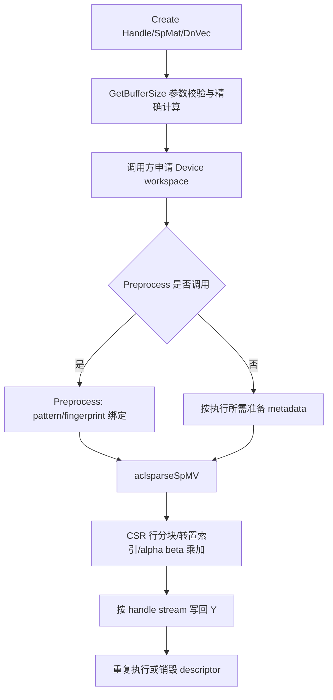
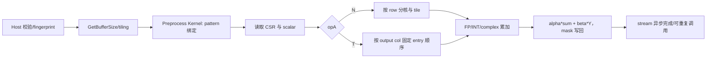

# 【社区任务】aclsparseSpMV 算子开发方案（Ascend 950/A5）

## 0. 文档信息与范围

| 项目 | 内容 |
|---|---|
| 任务 | `aclsparseSpMV` 算子开发（A5/950） |
| 目标硬件 | Ascend 950PR，DAV_3510，`arch35`，编译参数 `--npu-arch=dav-3510` |
| CANN | 9.1.0 及后续配套版本 |
| 目标仓库 | [cann/ops-sparse](https://gitcode.com/cann/ops-sparse)，统一提交 `master` |
| 公开头文件 | `include/cann_ops_sparse.h`（沿用现有声明，不重复定义同名接口） |
| 实现目录 | `sparse/spmv/arch35/` |
| C++ UT/ST | `test/spmv/arch35/` |
| ATen/Python | ops-sparse 内的 Python/torch 层和 ATen NPU Dispatcher 注册 |
| 适配框架 | PyTorch 2.7 及以上、torch_npu 26.0.0 及以上 |
| API 语义 | cuSPARSE SpMV 三阶段接口；Python 入口对齐 `torch.mv`/`aten::mv` |

核心计算必须在 A5 NPU 上完成。公共 Host 逻辑与 A2/A3 解耦；标准
`aclsparseSpMV` 与 `aclsparseSpMVOp` 保持为两个独立接口，不能以 SpMVOp 替代标准接口。

## 一、需求背景

### 1.1 需求来源

来源为 CANN 社区任务，要求向开源 `ops-sparse` 贡献 A5 SpMV 能力，并提交设计文档、
可复现测试代码和自测报告。算子计算为：

```text
Y = alpha * op(A) * X + beta * Y
```

其中 A 是 `[M,K]` 的 CSR 稀疏矩阵，X/Y 是稠密向量；索引为 I32，index base 支持 0/1。

### 1.2 背景介绍与现状分析

#### 1.2.1 aclsparseSpMV 实现优化、参考源码和接口核查

本任务是 aclsparse Legacy C++ API，不把不存在的 TBE/aclnn 实现写成已支持能力。进入
CANN 环境后按下表逐文件复核，并把实际版本/提交号记入自测报告：

| 类别 | 获取路径（含文件名） | 核查结论和用途 |
|---|---|---|
| TBE 源码候选 | `${CANN_PATH}/opp/built-in/op_impl/ai_core/tbe/impl/dynamic/spmv.py`、`${CANN_PATH}/opp/built-in/op_impl/ai_core/tbe/impl/spmv.py` | 当前任务包未提供可验证同名源码；若环境存在，逐行对照 dtype、CSR、转置和 alpha/beta，不继承未声明能力 |
| 算子信息库候选 | `${CANN_PATH}/opp/op_proto/built-in/spmv*.json`、`${CANN_PATH}/opp/op_impl/built-in/op_info*.json` | 核对文件名、输入输出 dtype/format、属性和动态 shape；未找到条目时以任务书和头文件为准 |
| Legacy 基线 | `ops-sparse/include/cann_ops_sparse.h`、`ops-sparse/sparse/spmv/`（现有 arch22 路径） | 复用 Handle、SpMat、DnVec、状态码和构建风格；补齐 arch35 标准 SpMV |
| cuSPARSE 参考 | cuSPARSE `SpMV` 的 `GetBufferSize`/`Preprocess`/`SpMV` 文档 | 核对三阶段顺序、workspace、pointer mode、异步和 descriptor 生命周期 |
| Python/ATen 参考 | PyTorch `aten/src/ATen/native/native_functions.yaml` 的 `mv`、`torch.mv` 公开接口、torch_npu Dispatcher | 确认参数、输出、alias、异常和设备语义；入口只覆盖 CSR 二维 mat 与一维 vec |

若 TBE 与任务书冲突，以本任务书声明为准，并在 README/设计文档中记录差异。`aclsparseSpMV*`
公开函数、Host、Kernel 和测试均应验证声明是否相互一致。

#### 1.2.2 现状支持分析

当前基线的标准 SpMV 主要为 arch22，`GetBufferSize`/`Preprocess` 只有声明或未支持标记，
尚无本任务所需的 A5 全类型及 ATen 路径。本次目标是补齐真实三阶段实现、Python/ATen
注册和 NPU Kernel，不改变 `aclsparseSpMVOp` 的既有语义。

##### 1.2.2.1 TBE/基线支持的数据类型和数据格式

最终公开能力以本方案 2.3 的组合表冻结：仅 CSR、I32、base 0/1、NON_TRANSPOSE/TRANSPOSE；
支持 INT8、FP16、BF16、FP32、complex64 及表中声明的输出/computeType 组合。CSC、COO、
SELL、批量/广播、任意 stride 和未声明算法返回 `NOT_SUPPORTED`，不能从 TBE 或其他算子推断支持。

##### 1.2.2.2 参考实现逻辑

Host 校验 handle、descriptor、shape、dtype、index、标量、算法和阶段顺序，计算精确
workspace 并生成 tiling/fingerprint；Preprocess 在 NPU 上绑定 matA pattern 和 workspace，
准备可复用的 row metadata。Kernel 按 CSR row segment 读取 I32 column（扣除 base），对每行
顺序执行乘加，TRANSPOSE 时交换输出坐标；alpha、beta 转为 computeType，beta=0 仍按接口
语义处理原 Y。INT8→INT32 使用整数累加，浮点混合组合使用 FP32 累加，complex64 使用
复数乘加。所有结构处理和计算在 NPU，禁止 CPU fallback。

##### 1.2.2.3 参考流程图



## 二、需求分析

### 2.1 外部组件依赖

| 组件 | 用途 | 版本/要求 |
|---|---|---|
| Ascend 950PR、驱动、固件 | NPU 编译和运行 | DAV_3510；版本写入报告 |
| CANN/ACL/Ascend C headers | Runtime、stream、Kernel launch | CANN 9.1.0+ |
| PyTorch + torch_npu | `torch.mv`/ATen 测试、NPU 注册 | 2.7+ / 26.0.0+ |
| cuSPARSE/PyTorch CUDA | GPU 精度或性能对照 | 仅作为标杆，不替代 NPU |
| ATK | 精度泛化执行 | 运行 `run_accuracy_atk.sh` |
| CANN Profiler/msprof | NPU Dispatch、Kernel、stream、无 CPU fallback 证据 | 目标环境安装 |

### 2.2 内部适配模块

| 模块 | 责任 |
|---|---|
| `include/cann_ops_sparse.h` | 三个 SpMV 函数声明、枚举和数据类型契约；同步导出符号 |
| 公共 sparse Host | Handle/stream、descriptor、pointer mode、错误码、阶段状态、溢出和 alias 校验 |
| `sparse/spmv/arch35/host` | A5 参数适配、GetBufferSize、Preprocess 状态、tiling、workspace 分区和 Kernel 下发 |
| `sparse/spmv/arch35/kernel` | CSR 行处理、N/T、I32/base、各 dtype/混合累加、alpha/beta 和边界保护 |
| Python/torch 层 | CSR Tensor + 1-D Tensor 校验、`torch.mv` 映射和输出构造 |
| ATen NPU 注册 | `aten::mv` Dispatcher、设备/布局/stride/dtype/异常/alias/异步语义 |
| `test/spmv/arch35` | C++ UT/ST：返回码、workspace、生命周期、输入只读、Kernel 结果 |
| `test_cases/common` 和 `aclsparseSpMV_testCase` | ATK 精度、GPU/NPU 性能、内存、固定种子和报告资产 |

### 2.3 需求模块设计

#### 2.3.1 aclsparse C++ 算子原型

沿用现有声明，补齐真实实现（不新增带 buffer size 的兼容 ABI）：

```c
aclsparseStatus_t aclsparseSpMVGetBufferSize(
    aclsparseHandle_t handle, aclsparseOperation_t opA, const void *alpha,
    aclsparseConstSpMatDescr_t matA, aclsparseConstDnVecDescr_t vecX,
    const void *beta, aclsparseDnVecDescr_t vecY, aclDataType computeType,
    aclsparseSpMVAlg_t alg, size_t *bufferSize);

aclsparseStatus_t aclsparseSpMVPreprocess(
    aclsparseHandle_t handle, aclsparseOperation_t opA, const void *alpha,
    aclsparseConstSpMatDescr_t matA, aclsparseConstDnVecDescr_t vecX,
    const void *beta, aclsparseDnVecDescr_t vecY, aclDataType computeType,
    aclsparseSpMVAlg_t alg, void *externalBuffer);

aclsparseStatus_t aclsparseSpMV(
    aclsparseHandle_t handle, aclsparseOperation_t opA, const void *alpha,
    aclsparseConstSpMatDescr_t matA, aclsparseConstDnVecDescr_t vecX,
    const void *beta, aclsparseDnVecDescr_t vecY, aclDataType computeType,
    aclsparseSpMVAlg_t alg, void *externalBuffer);
```

三阶段顺序固定为 `GetBufferSize -> 可选 Preprocess -> SpMV`。Preprocess pattern 与 matA、
workspace 和 descriptor 生命周期绑定；pattern 变化后必须重新预处理。调用方按查询值分配
足量 Device buffer；ABI 不传实际 buffer size，因此不承诺可靠检测欠配，但空指针、对齐和
阶段错误必须返回明确错误。标准 SpMV 的结果和状态不调用 `aclsparseSpMVOp`。

#### 2.3.2 Python/ATen 接口设计

公开入口 `torch.mv(mat, vec)` 映射到 `aten::mv`，仅接受二维 CSR sparse `mat` 和一维
dense `vec`，并在 NPU Dispatcher 中：

1. 校验 `mat.device == vec.device == NPU`、CSR layout、二维/一维 shape、连续 stride、
   dtype 组合和索引 dtype（转换为 I32 时检查范围）；不支持的 layout、batch、广播、非连续
   stride、CPU device 和未声明 dtype 抛出明确 PyTorch 异常。
2. 把 CSR crow/col/values 转为复用的 SpMat descriptor，把 vec 转为 DnVec descriptor，
   构造 NPU 输出 Tensor（长度为 M），并按 `alpha=1`、`beta=0` 调用底层 `aclsparseSpMV*`。
   Python/ATen 不暴露其他 alpha/beta 组合；这些组合由 C++ API 覆盖。
3. 保留 `torch.mv` 的输出 dtype、输入只读、alias/in-place（不允许 mat 与 vec/输出重叠）、
   异步 stream 和错误传播语义，不同步 CPU，不调用 CPU reference。注册路径须通过 NPU
   Dispatch/Profiler 验证。

#### 2.3.3 数据类型、索引、操作和参数契约

| matA/vecX | vecY | computeType | alpha/beta |
|---|---|---|---|
| INT8 | INT32 | INT32 | INT32，整数精确累加 |
| INT8 | FP32 | FP32 | FP32 |
| FP16 | FP32 | FP32 | FP32 |
| BF16 | FP32 | FP32 | FP32 |
| FP16 | FP16 | FP32 | FP32 累加后按输出类型写回 |
| BF16 | BF16 | FP32 | FP32 累加后按输出类型写回 |
| FP32 | FP32 | FP32 | FP32 |
| complex64 | complex64 | complex64 | 复数 alpha/beta |
| FP32 | complex64 | complex64 | 复数 alpha/beta，FP32 values 按实数嵌入复数 |

所有组合均为 CSR、I32、base 0/1，`opA` 仅 NON_TRANSPOSE/TRANSPOSE。非转置时 X=[K]、
Y=[M]；转置时 X=[M]、Y=[K]。complex64 进行复数乘加并按任务书规则处理转置/复数语义；
未声明的 conjugate-transpose、FP64/complex128 或 dtype 提升返回 `NOT_SUPPORTED`。

| 参数 | 合法值和实现 | 错误行为 |
|---|---|---|
| `handle` | 有效上下文、调用方 stream、pointer mode | 空/失效返回错误 |
| `opA` | NON_TRANSPOSE、TRANSPOSE | 非法枚举返回错误 |
| `alpha/beta` | Host pointer；若补齐 `aclsparseSetPointerMode` 则支持 Device pointer；转换为 computeType | 空指针、mode/dtype 不匹配返回错误 |
| `matA` | CSR `[M,K]`，values 为表中类型，I32，base 0/1，动态 nnz | 格式/index/shape/values 非法返回错误 |
| `vecX/vecY` | 连续 dense vector；长度分别为 K/M 或 M/K；Y 为 in/out | 长度、dtype、stride、设备不匹配返回错误 |
| `computeType` | INT32、FP32、complex64，且和组合表一致 | 未支持组合返回 `NOT_SUPPORTED` |
| `alg` | 公开头文件声明的算法枚举；首版仅已实现枚举 | 非法或未实现返回 `NOT_SUPPORTED` |
| `bufferSize` | Host `size_t*`，64 位计算并检查溢出 | 空指针/溢出返回错误 |
| `externalBuffer` | 连续、满足对齐的 Device workspace，至少为查询值 | 空指针/未对齐返回错误 |

CSR 的重复坐标、有序性和最大 M/K/nnz 约束必须在 README 和头文件说明；实现支持空行、
零 nnz、nnz=1、动态 M/K/nnz。A/X 只读，Y 原地更新；不持久化完整稠密矩阵，不泄漏 descriptor
或 Device 内存，也不做无必要 Host 同步。

本方案对输入结构的公开约定为：`rowPtr` 必须单调、首尾值与 nnz 一致，column index 必须
在 `[0,K)`（扣除 base 后）；每行允许未排序和重复 column。Preprocess/Kernel 按
`(row, entry_position)` 的固定原始顺序累加重复项，从而保证确定性；README、头文件和 UT
必须同步这一约定。超出范围或 rowPtr 不合法返回参数错误，而不是静默修正。

## 三、需求详细设计

### 3.1 使能方式和阶段状态

标准调用序列：

```text
Create Handle/SpMat/DnVec
  -> GetBufferSize
  -> 调用方 aclrtMalloc workspace
  -> Preprocess（可选；pattern 复用时推荐）
  -> SpMV（可重复）
  -> stream 完成后 Destroy descriptor/workspace
```

Host 保存阶段状态和 fingerprint：matA/vecX/vecY descriptor、CSR pointer、M/K/nnz、base、
opA、dtype、computeType、alg、pointer mode、workspace 地址和 pattern hash。Preprocess/SpMV
期间这些属性必须一致，pattern 或 workspace 变化需回到 GetBufferSize/Preprocess。Handle 的
调用方 stream 上异步提交，Kernel 完成前不得释放或修改输入、输出、descriptor、scalar 或
workspace；接口不隐式 synchronize。

### 3.2 需求总体设计

采用“公共 Host 校验与状态管理 + A5 arch35 tiling + Ascend C CSR Kernel”。Host 只负责
参数、溢出、状态和 launch；索引处理、转置映射、乘加和输出写回均在 NPU。

#### 3.2.1 Host 侧设计

##### 3.2.1.1 分核策略

NON_TRANSPOSE 按 CSR row 分片，每个核处理连续 row range；TRANSPOSE 按输出列分片，使用
CSR entries 的 `(row,col)` 映射并在每个输出元素保持固定 entry 顺序。令第 i 行 nnz 为
`r_i`，工作量 `W_i=r_i`（complex64 可按 2 倍权重），总工作量 `W=ΣW_i`，核数
`C=min(core_count,max(1,ceil(W/target_work)))`。首先按累计 `W_i` 均衡切分；空行被保留，
长尾行（`r_i > 4*median(r)`）单独标记并按 entry tile 切分。长尾 partial 结果按固定
顺序归约，禁止非确定性浮点 atomic；整数路径可使用宽累加并做溢出检查。

##### 3.2.1.2 数据分块、LocalMemory 和 workspace

向量按 `tile_elems` 分块，优先让每个核读取连续 X、values 并将 Y 结果写回一次。设元素
字节数 `e`（INT8=1、FP16/BF16=2、FP32/INT32=4、complex64=8），可用 UB 为 `U`，双缓冲
系数 `db=2`，保留元数据 `R`，则：

```text
bytes(tile) = db * (tile*e + tile*4 + tile*e) + align(metadata)
tile = max(1, floor((U - R - align(metadata)) / (db*(2*e + 4))))
```

实际 UB 预算由 A5 编译器报告确定，若使用 Data Cache 则
`U_usable = U_total - data_cache_reserve - static_ub`；不足时退化为 GM streaming，不能
超出 UB。每块尾部使用 mask，保证动态长度和空行不越界。workspace 按 64 位安全加法、64
字节对齐计算，至少包括：

```text
pattern = (M+1)*4 + nnz*4 + nnz*e       # row metadata/col/value staging
transpose = (nnz*4 + M*4)               # 转置映射和分片元数据（需要时）
partial = long_row_count * tile * acc_e  # 长尾 partial，acc_e=4 或 8
status = Align64(core_count * sizeof(uint32_t))
workspace = Align64(pattern + transpose + partial + sort_temp + status)
```

`GetBufferSize` 根据 dtype、op、shape、nnz、算法精确给出上述空间，并检查 `size_t` 溢出；
Preprocess 与执行复用同一 buffer。Host 不额外保存完整 CSR/稠密副本，workspace 的 pattern
缓存与 matA fingerprint 绑定。

##### 3.2.1.3 tilingKey 规划策略

建议位域：bit0-2 输入/输出 dtype 组合，bit3 computeType，bit4 opA，bit5 base，bit6
alg，bit7 pointer mode，bit8 small/large row，bit9 zero/normal nnz，bit10 long-tail，
bit11 Python/Legacy entry。M/K/nnz、tile、core、workspace offset 写入 TilingData，不
扩张 key。未声明组合不生成 key；A2/A3 分支通过编译宏与 arch35 key 解耦。

#### 3.2.2 Kernel 侧设计

##### 3.2.2.1 Ascend C 实现描述

1. **参数读取**：读取 TilingData、CSR rowPtr/colInd/value、X/Y、alpha/beta 和 base；检查
   rowPtr 单调、索引范围和 tile 边界，异常写入 status。
2. **非转置**：每个输出 row 初始化 `acc=beta*Y[row]`，按 `[rowPtr[row]-base,
   rowPtr[row+1]-base)` 固定顺序读取 `value*X[col-base]`，完成 `acc=alpha*sum+beta*Y`。
3. **转置**：每个 output col 遍历分配到的 CSR entry，读取 `X[row]`，累加到
   `alpha*sum+beta*Y[col]`；对长尾使用固定 partial/归约顺序，避免竞态。
4. **类型路径**：INT8→INT32 用 int32/int64 中间累加并 exact 写回；FP16/BF16/INT8 混合
   先转 FP32；FP32 用 FP32；complex64 用实虚分量或 `complex<float>` 乘加，alpha/beta
   同为 complex64。beta=0 仍读取并按定义处理 Y，不把输出初始化假定为零。
5. **写回与异步**：使用 mask 写回连续 dense Y，输入只读；在调用方 stream 上完成，不做
   Host 同步。Kernel status 供 Host 在已有错误机制下报告。

##### 3.2.2.2 Ascend C 实现流程图



##### 3.2.2.3 与 TBE 流程差异点和原因

当前工作区没有可核验同名 TBE 源码，发现后必须按源码更新本表；不能假设 TBE 已支持下列能力。

| 项目 | TBE 可能的通用行为 | 本 Ascend C 方案 | 原因 |
|---|---|---|---|
| 稀疏遍历 | 由 DSL/库封装 | 显式 CSR row/entry kernel | Legacy descriptor 和 A5 可控性能 |
| 转置 | 可能生成临时稠密/隐式格式 | CSR entry 映射、固定归约 | 禁止完整稠密副本和 CPU fallback |
| dtype | 由算子信息库决定 | 严格按 9 个声明组合 dispatch | 防止未声明提升 |
| workspace | 框架隐式申请 | GetBufferSize 精确查询、Preprocess 绑定 | 对齐 cuSPARSE 三阶段语义 |
| 确定性 | 实现相关 | 固定 row/entry/partial 顺序 | 满足确定性验收 |
| Python 入口 | TBE 通常无 `aten::mv` 语义 | 单独 NPU Dispatcher 注册 | 对齐 PyTorch 2.7+/torch_npu 26+ |

### 3.3 支持硬件

首版仅宣称 Ascend 950PR（DAV_3510/A5），CANN 9.1.0 及后续配套版本。公共 Host API 可
被 A2/A3 编译，但 A2/A3 Kernel 不在本任务范围；后合入时基于已合入版本解决公共代码冲突，
保留各硬件所需分支并执行 A2/A3 与 A5 回归。Ascend C 源文件使用 `kernel_operator.h` 和
950 对应编译门禁，不能把纯 CPU 或其他 SOC 结果当作 A5 验收结果。

### 3.4 算子约束限制

- 仅二维 CSR；CSC/COO/SELL、批量/广播、任意 stride、非连续 dense vector、I64 index、
  非 I32 base、未声明 alg 和未声明 dtype 返回明确 `NOT_SUPPORTED`。
- 仅 NON_TRANSPOSE/TRANSPOSE；非转置 X/K-Y/M，转置 X/M-Y/K；M/K/nnz 可动态且允许
  零值、空行、nnz=0/1，`nnz <= M*K`，所有索引和字节计算检查溢出。
- 输入 A/X 只读，Y 为 in/out；不允许部分 alias、A 与 X/Y 重叠或 Python 输出复用输入。
- Host pointer mode 是当前基线；只有实现并测试 `aclsparseSetPointerMode` 分支后，才能
  宣称 Device alpha/beta。不能把仅支持 Host pointer 写成已支持 Device pointer。
- complex64 支持复数 alpha/beta 和复数乘加；不自动提升到 complex128，不声明共轭转置能力。
- externalBuffer 必须为调用方分配的 Device 连续内存；接口不带 size，调用方须使用查询值，
  Preprocess/SpMV 异步完成前保持 descriptor、pattern、values、scalar 和 buffer 有效。
- 不做无必要 Host 同步、完整稠密化或资源泄漏；重复执行确定性算法需按任务书 bit-wise
  规则验证，其他算法按误差标准验证。

## 四、特性交叉分析

| 特性 | 设计处理 |
|---|---|
| 动态 M/K/nnz、零 nnz、空行 | 64 位 shape/size 计算；空 row 直接写 beta*Y；零 nnz 仍走合法阶段 |
| CSR base 0/1 | Kernel 统一减 base，rowPtr/colInd 范围检查 |
| N/T | N 按 row 分核；T 按 output col entry 映射和固定归约 |
| 长尾/非均匀稀疏度 | 加权分核，长尾 entry tile + partial；空行不参与错误分支 |
| dtype/computeType | 由 tilingKey 选择精确组合；FP32/complex64 累加和写回分别处理 |
| alpha/beta | 转 computeType；beta=0 仍遵循原 Y 语义；Host/Device mode 分支专项测试 |
| workspace/preprocess | GetBufferSize 精确查询；pattern、buffer、descriptor 生命周期绑定 |
| stream/异步 | 使用 handle stream，不隐式同步；完成前禁止释放资源 |
| Python/ATen | 只注册 `aten::mv` CSR+1D NPU；异常、stride、alias、输出 dtype 对齐 PyTorch |
| 确定性 | 固定 entry/partial 顺序，禁止非确定性 atomic 影响验收 |
| 资源和内存 | 不保留稠密矩阵；描述符连续创建/执行/销毁并检测泄漏 |
| A2/A3 共存 | 公共 Host 与 arch35 kernel 分层；PR 按已合入版本解决冲突并回归 |

## 五、可维可测分析

### 5.1 精度标准和性能标准

精度遵循《生态算子开源精度标准》，采用单标杆方法，NPU 只与 CPU Golden 比较：

- CPU Golden：INT8→INT32 整数精确；INT8→FP32、FP16、BF16 用 float32；FP32 用 float64；
  complex64 用 complex128。必须同时校验 CSR、X、Y、alpha、beta 和输出，不能转换成其他
  表示后只比较部分结果。
- INT8→INT32 逐元素 exact match。其余实数逐元素满足
  `|actual-golden| <= atol + rtol*|golden|`，整体匹配率不低于 0.99，绝对误差不超过
  `max(A, 32*ULP(golden))`。
- 参数：FP16 `rtol=atol=2^-9, A=1e-1`；BF16 `rtol=atol=2^-6, A=1e0`；FP32
  `rtol=2^-10, atol=2^-16, A=1e-2`。complex64 实部和虚部分别按 FP32 混合容差验收。
- 覆盖普通值、小值、正负、零、离群值以及标准允许的 INF/NAN；确定性算法重复执行按
  bit-wise 规则，其余按上述误差规则。

性能倍率定义为 `GPU 设备 Event 调用耗时 / NPU 同调用范围总 Kernel 耗时`。每 case 预热
10 次、正式 30 次，每轮设备同步后计时；descriptor、workspace、Preprocess 结果复用，
不计编译、数据生成、搬运和无关初始化。记录阶段耗时、workspace、输入规模、nnz/索引
分布、dtype、alg 和输出规模，并报告 median/P90。所有声明类型组合须达到 0.3 倍 GPU 标杆：

| 编号 | 维度和稀疏结构 | 覆盖 | GPU 标杆 median_us（任务包明细） | 目标 |
|---|---|---|---|---|
| P-01 | `8192x28672`，每行 64 nnz，nnz=`524288`（Llama 3.1 70B MLP） | 全部声明组合，I32 base 0/1 | 89.968--425.920（32 个有效场景） | >=0.3x |
| P-02 | `4096x1536`，每行 64 nnz，nnz=`262144`（Qwen3-235B-A22B MoE） | 全部声明组合，I32 base 0/1 | 91.056--380.240（32 个有效场景） | >=0.3x |
| P-03 | `7168x2048`，每行 64 nnz，nnz=`458752`（DeepSeek-V3 MoE） | 全部声明组合，I32 base 0/1 | 90.912--410.176（32 个有效场景） | >=0.3x |

明细文件为 `/home/swenzhai/work/tmp/task/SpMV950/test_cases/aclsparseSpMV_testCase/gpu_performance_result_benchmark.md`；
不得以更有利 case 替换固定种子生成的索引。GPU 无整数稀疏契约时记录 skipped 及原因，但
NPU 必须执行全部声明组合。

### 5.2 内存标准

输入输出总量超过 500 MB 时，同 Torch API 调用下 NPU 额外峰值内存不得超过 GPU 总峰值的
50%；无等价 GPU 接口时，固有 workspace 不得超过目标硬件 L2 Cache。使用相同
`test_cases/aclsparseSpMV_testCase/performance_cases.json`，分别运行
`collect_sparse_ops_gpu_memory.py`、`collect_sparse_ops_npu_memory.py`，再运行
`compare_sparse_ops_memory.py`，报告 `input_baseline_*_bytes`、`peak_*_bytes`、
`extra_peak_*_bytes`、workspace 和 L2 容量。reset Y 不计入计时和峰值；不得额外持久化
稠密 A 或泄漏 descriptor/device allocation。

### 5.3 兼容性、可维护性和可定位性

保持既有 aclsparse ABI 和错误码风格，在头文件、README、UT 中同步声明能力边界；公共
Host 与 A5 Kernel 分层，A2/A3 回归不受影响。Host 错误应包含阶段和参数；调试日志记录
tilingKey、分核、tile、workspace 分区、fingerprint 和 pointer mode。Profiler 至少能区分
Preprocess、N/T Kernel 和 Python/ATen dispatch。所有 offset/element size 使用 64 位并在
Host/Kernel 双侧保护；README 固定记录 `dav-3510` 编译门禁、注册名、命令和失败解释。

## 六、测试与自验设计

### 6.1 C++ UT/ST 和 ATen UT 矩阵

- **基础功能**：方/长/宽矩阵、空行、长尾行、nnz=0/1、转置、alpha/beta、workspace。
- **类型属性**：9 个声明组合；I32 base 0/1；NON_TRANSPOSE/TRANSPOSE；公开算法枚举；
  Host pointer，并在实现后加入 Device pointer 专项。
- **边界异常**：零长度、合法最小/最大 M/K/nnz、越界/负索引、非单调 rowPtr、非法 shape、
  dtype、layout、stride、algorithm、空/未对齐 workspace；按 ABI 约定不要求检测欠配 size。
- **流程生命周期**：GetBufferSize、可选 Preprocess、重复 SpMV、pattern 改变后重做、
  descriptor 连续创建/执行/销毁；验证输入只读、Y 边界、stream 异步和无泄漏。
- **Python/ATen**：`torch.mv`/`aten::mv` 入口、CSR+1D 正向结果、输出 dtype/shape、设备、
  stride/layout/dtype/alias/in-place/异常；Profiler 证明 NPU dispatch 且无 CPU fallback。

生成规则固定种子：A/X/Y 中 70% 为 `[-1,1]` 均匀、20% 为正态 `mu=0,sigma=1`、10% 覆盖
零值、整数边界和标准允许特殊值；CSR pattern 覆盖空行、长尾、重复坐标（并按 README 规范
有序性处理）。dtype、computeType、op、alg、pointer mode、base、shape、nnz 采用笛卡尔与
成对覆盖结合。每个 C++ case 比较 CPU Golden，检查返回码、输入只读、输出越界和阶段状态。

### 6.2 测试资产、环境和命令

任务包必须随交付保留以下文件，不以其他历史数据替代：

```text
test_cases/
  common/{atk_accuracy.py,backend.py,benchmark_runner.py,case_io.py,compare_memory.py,
          memory_metrics.py,memory_runner.py,sparse_patterns.py}
  aclsparseSpMV_testCase/{README.md,accuracy_cases.json,accuracy_sparse_ops.py,
    benchmark_sparse_ops_gpu.py,benchmark_sparse_ops_npu.py,collect_sparse_ops_gpu_memory.py,
    collect_sparse_ops_npu_memory.py,compare_sparse_ops_memory.py,function_sparse_ops.py,
    generate_cases.py,gpu_performance_result_benchmark.md,nodes_accuracy.yaml,
    operator_adapter.py,performance_cases.json}
  baseline_results/{README.md,gpu_full_results.tsv,manifest.json}
  run_accuracy_atk.sh run_all_gpu_benchmarks.sh
```

目标环境先加载 PyTorch CUDA/torch_npu 和本地算子注册，再从 `test_cases/` 执行：

```bash
CUDA_DEVICE_INDEX=0 bash run_all_gpu_benchmarks.sh
(cd aclsparseSpMV_testCase && python3 benchmark_sparse_ops_npu.py \
  --case-file performance_cases.json --device 0 --output results)
(cd aclsparseSpMV_testCase && python3 collect_sparse_ops_npu_memory.py \
  --case-file performance_cases.json --device 0 --output results_memory)
bash run_accuracy_atk.sh
```

`run_accuracy_atk.sh` 必须校验 200 条泛化用例并执行 ATK；未加载 ATK 应明确失败。GPU
默认使用 PyTorch CUDA CSR `torch.sparse.mm`，整数累加无等价公开契约时列入 skipped；
`--allow-reference-fallback` 仅可用于小规模冒烟，不能作为验收结论。NPU hook 必须命中
注册的 `spmv_npu(row_ptr,col_ind,values,x,y,alpha,beta,trans,base)`，不得静默切到 reference。

### 6.3 自测报告

报告逐 case 给出输入摘要（固定 seed）、M/K/nnz/base/op/dtype/computeType/alg/alpha/beta、
CSR/X/Y/output 结构、返回码和 workspace。精度部分列 exact/match rate/max error/ULP、
INF/NAN 和确定性；性能部分列 Kernel/ATen 端到端 median/P90、P-01/P-02/P-03 倍率、
阶段耗时和 workspace；内存部分列 baseline/peak/extra bytes。另附 CANN、驱动、固件、
硬件型号、编译提交版本、截图、NPU Dispatch 和 Profiler trace；失败/跳过项必须说明原因，
无法全量执行的组合须在验收前取得确认。

## 七、代码落地与里程碑

### 7.1 建议目录

```text
ops-sparse/
  include/cann_ops_sparse.h
  sparse/spmv/arch35/{host/{spmv_host.cpp,spmv_tiling.cpp,spmv_state.hpp},
    kernel/{spmv_kernel.cpp,spmv_tiling_data.h}}
  torch_npu/{spmv_npu.cpp,spmv_registration.cpp}  # 以仓库现有 ATen 目录为准
  test/spmv/arch35/{spmv_ut.cpp,spmv_st.cpp,spmv_aten_ut.cpp,CMakeLists.txt}
```

### 7.2 实施步骤

1. 复核 CANN 9.1/A5 API、TBE/ops-info 候选、cuSPARSE 和现有 arch22；冻结头文件、错误码、
   dtype/format/alg/pointer mode 能力表。
2. 接入公共 descriptor/Handle 状态、GetBufferSize 溢出检查、Preprocess 生命周期和 Host 校验。
3. 完成 A5 FP32 CSR N/T Kernel，打通 C++ UT 的最小/空行/零 nnz 路径。
4. 增加 INT8、FP16、BF16、complex64 及全部混合输出/computeType，验证 alpha/beta 和 base。
5. 完成转置长尾分核、workspace 复用、确定性归约和边界保护；标准 SpMV 不调用 SpMVOp。
6. 实现可选 Device pointer mode（若规格评审决定补齐），添加专项错误和异步测试；否则在文档明确 Host-only。
7. 接入 `torch.mv -> aten::mv` 的 NPU Dispatcher，完成输出构造、异常、alias、stride、Profiler 证据。
8. 针对 P-01/P-02/P-03 调优 tile、核数、GM/UB、长尾并采集性能、内存和 trace。
9. 执行 C++ UT/ST、ATen UT、ATK/CPU Golden、GPU/NPU 性能和内存测试，形成 README 和自测报告。
10. 基于已合入版本完成 A2/A3 公共 Host 回归，提交 ops-sparse 代码 PR、设计文档 PR 和验收材料。

