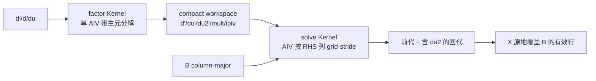

# aclsparseSgtsv2 A2/A3 算子开发设计文档

| 项目 | 内容 |
| --- | --- |
| 任务名称 | 9月社区任务-aclsparseSgtsv2算子开发（A2/A3） |
| 目标硬件 | Atlas A2 训练系列（910B3/910B4）与 Atlas A3 系列（DAV_2201，`arch22`） |
| 软件版本 | CANN 9.1.0 及后续配套版本 |
| 实现仓库 | `cann/ops-sparse` |
| 实现目录 | `sparse/gtsv2/arch22/`、`test/gtsv2/arch22/` |
| 文档状态 | 设计评审稿 |

## 需求背景（required）

### 需求来源

9 月社区任务要求在 `cann/ops-sparse` 为 Atlas A2/A3（DAV_2201，`arch22`）补齐 Legacy API `aclsparseSgtsv2`。接口对齐 cuSPARSE 同名 API，支持 FP32、带部分选主元、多个 RHS、B 原地覆写、workspace 查询和 stream 异步执行；CANN 版本为 9.1 及以后。

### 背景介绍

已有 `arch35` 实现面向 A5/Ascend 950，使用 SIMT thread 独立完成一个 RHS 的分解和求解。A2/A3 不支持该 SIMT 编程路径，而且同一矩阵 A 在每个 RHS 上被重复分解，workspace 为 `12*m*n` 字节。新实现需要遵守同一 ABI 和数值语义，同时适配 DAV_2201 Ascend C 能力并满足三组大 m、多 RHS 性能场景。

### 现状能力

| 项目 | arch35 现状 | arch22 目标 |
| --- | --- | --- |
| dtype | FP32 | FP32 |
| 算法 | 每 RHS 带主元 Thomas | 一次带主元分解，多 RHS 复用 |
| 并行维度 | SIMT thread 沿 RHS | AIV core 沿 RHS |
| workspace | `align_up(12*m*n,128)` | `align_up(17*m,128)` |
| B | column-major 原地覆盖 | 保持一致 |
| singular | 自然传播 Inf/NaN | 保持一致 |

## 需求分析（required）

### 需求描述

求解 `A * X = B`。A 是 m 阶三对角矩阵，由长度 m 的 `dl/d/du` 表示；`dl[0]` 和 `du[m-1]` 不参与计算并由调用方置零。B 为 `ldb × n` 的 column-major 缓冲区，有效区域是每列前 m 个元素，结果 X 原地覆盖该区域。

矩阵 A 的结构为：

$$
A=\begin{bmatrix}
d_0 & du_0 & & \\
dl_1 & d_1 & du_1 & \\
& \ddots & \ddots & \ddots \\
& & dl_{m-1} & d_{m-1}
\end{bmatrix},
\qquad AX=B.
$$

公开接口不得改变：

```cpp
aclsparseStatus_t aclsparseSgtsv2_bufferSizeExt(
    aclsparseHandle_t handle, int m, int n,
    const float *dl, const float *d, const float *du,
    const float *B, int ldb, size_t *pBufferSizeInBytes);

aclsparseStatus_t aclsparseSgtsv2(
    aclsparseHandle_t handle, int m, int n,
    const float *dl, const float *d, const float *du,
    float *B, int ldb, void *pBuffer);
```

| 参数 | 位置与方向 | 约束 | 异常或边界语义 |
| --- | --- | --- | --- |
| `handle` | Host，输入 | 有效 aclsparse handle，携带执行 stream | null 返回 `HANDLE_IS_NULLPTR` |
| `m` | Host，输入 | `n>0` 时 `m>=3` | 非法返回 `INVALID_VALUE` |
| `n` | Host，输入 | `n>=0` | `n=0` 成功短路，查询值为 0 |
| `dl/d/du` | Device，输入只读 | 连续 FP32 `[m]`；调用方保证 `dl[0]=0`、`du[m-1]=0` | `n>0` 时 null 返回 `INVALID_VALUE` |
| `B` | Device，输入输出 | FP32 column-major `[ldb,n]`；每列仅 `[0,m)` 有效 | 执行接口中 `n>0` 时 null 返回 `INVALID_VALUE` |
| `ldb` | Host，输入 | `ldb>=max(1,m)` | 非法或地址跨度溢出返回 `INVALID_VALUE` |
| `pBufferSizeInBytes` | Host，输出 | 非空 | null 返回 `INVALID_VALUE` |
| `pBuffer` | Device，输入 | 查询大小足量且首地址 128B 对齐 | null/未对齐返回 `INVALID_VALUE`；ABI 无法校验实际容量 |

### 需求拆解

1. Host 校验 `handle/m/n/ldb`、必需指针、128B workspace 对齐和可表示的地址跨度；`n=0` 优先短路。
2. Kernel 必须实现相邻行部分选主元，保存换行产生的第二上对角 fill-in。
3. `dl/d/du` 只读，B 仅改写每列 `[0,m)`，padding 不变。
4. 同一 stream 内异步执行，不在 API 内同步，不做 CPU fallback。
5. CPU FP64 golden 对比采用 `rtol=2^-10`、`atol=2^-16`、匹配率 0.99 和 `max(1e-2, 32 ULP)` 绝对误差上限。
6. P-01/P-02/P-03 的 NPU 总 kernel 中位耗时分别不超过约 5304/5141/10397 μs。

## 详细设计（required）

### 算子分析

#### 数学公式与算法

第 i 步（`i=1..m-1`）比较当前工作主元 `pivotD` 与 `dl[i]` 的绝对值：

- 不换行（`|pivotD|>=|dl[i]|`）：`mult=dl[i]/pivotD`，当前 U 行保存 `d'[i-1]=pivotD`、`du'[i-1]=pivotDu`、`du2'[i-1]=0`，下一主元为 `d[i]-mult*pivotDu`；
- 换行（`|pivotD|<|dl[i]|`）：`mult=pivotD/dl[i]`，相邻两行交换后保存 `d'[i-1]=dl[i]`、`du'[i-1]=d[i]`、`du2'[i-1]=du[i]`，下一主元为 `pivotDu-mult*d[i]`，下一上对角为 `-mult*du[i]`。

由于 A 对所有 RHS 相同，`d'/du'/du2'/mult/ipiv` 与 B 无关。将分解从 RHS 循环提出后，每次 API 调用只做一次 O(m) 分解；每列 RHS 用保存的 `mult/ipiv` 做前代，再用三组上三角因子回代。

前代对每个 RHS 使用固定顺序：不换行时令 `b[i]-=mult*b[i-1]`；换行时先交换相邻 RHS 元素，再令新的 `b[i]=old_b[i-1]-mult*old_b[i]`。回代为：

$$
x_i=\frac{b_i-du'_i x_{i+1}-du2'_i x_{i+2}}{d'_i}.
$$

算法总复杂度为 `O(m + m*n)`，额外空间为 `O(m)`。分解和每列求解均保持确定的标量递推顺序，不使用原子操作。

### 算子实现

#### Host 侧设计

Host 校验顺序如下：

1. 两个接口首先校验 `handle`；查询接口还先校验输出大小指针。
2. 拒绝 `n<0`；`n=0` 随后短路，不访问 Device 数据，也不发射 Kernel。
3. `n>0` 时校验 `m>=3`、`ldb>=max(1,m)`、必需数据指针和 `ldb*n*sizeof(float)` 地址跨度。
4. 执行接口校验 workspace 非空和 128B 对齐；实际容量由调用方按查询结果保证。
5. 从 handle 取得 stream 和 AIV core 数；失败时返回仓库既有错误码，不进行 CPU fallback。

Host 计算 workspace：

```text
factor bytes = 4 * m * sizeof(float)
pivot bytes  = m * sizeof(uint8_t)
workspace    = align_up(factor bytes + pivot bytes, 128)
```

workspace 布局：

```text
| d'[m] | du'[m] | du2'[m] | multiplier[m] | ipiv[m] | alignment padding |
```

分流和分核：

- `m <= 8192`：UB 路径，`blockNum=min(n, AIV core count)`；若列步长 `ldb*4` 非 32B 对齐则用单核，避免不同核非对齐 DMA 边界重叠。
- `m > 8192`：GM 标量回退并固定单核，规避多个 core 对同一 cache line 的标量写回竞争。
- factor kernel 固定 1 个 AIV core，solve kernel 使用上述 `blockNum`。

为保持 arch35 已有公开行为和公共 UT，`bufferSizeExt` 不读取 Device 数据并允许 B 为 null；`n=0` 返回 0。执行接口按 handle 所带 stream 顺序发射 factor 和 solve 两个 Kernel，依赖由 stream 顺序保证。API 内不调用 stream/device synchronize，异步任务完成前由调用方维持输入、B 和 workspace 生命周期。

#### Kernel 侧设计

执行链：



UB 路径单核空间上界：

- 公共因子：`4*m` 个 float；
- pivot：`m` 个 byte；
- 当前 RHS：`m` 个 float；
- 总计约 `21*m` byte，`m=8192` 时为 168 KiB，低于 DAV_2201 的 192 KiB UB，并保留约 24 KiB 余量；`InitBuffer` 对非 32B 大小自动向上对齐。

为保持与 arch35 的 FP32 运算顺序一致，递推采用标量 `GetValue/SetValue`。GM 回退中标量写通过 `DataCacheCleanAndInvalid<..., ENTIRE_DATA_CACHE, CACHELINE_OUT>` 显式刷回，确保后续 kernel 或 Host 观察到一致数据。

Kernel 不读取或改写 `dl[0]`、`du[m-1]` 的越界语义位置以外的数据，不修改 `dl/d/du`。UB 路径对 B 使用长度恰为 `m*sizeof(float)` 的 DataCopyPad，GM 路径也仅遍历有效行，因此 `ldb-m` 个 padding 元素保持不变。

#### 性能优化方案

1. 公共 A 仅分解一次，把 O(m*n) 重复系数计算降为 O(m)。
2. workspace 从 O(m*n) 降为 O(m)，P-01/P-02/P-03 分别只需 139264、69632、121856 字节，远低于目标硬件 L2 容量。
3. m 不超过 8192 时因子和 RHS 驻留 UB，前代/回代不产生逐元素 GM 中间写回。
4. column-major 布局使每个 RHS 列连续，核间分列无需转置或原子操作。
5. 真机 profiling 后仅调整 block 数、UB 阈值或 RHS 调度；不以 nopivot CR/PCR 替换带主元语义。

### 支持硬件

| 支持的芯片版本 | 涉及勾选 |
| --- | --- |
| Atlas A2（910B3/910B4，DAV_2201） | √ |
| Atlas A3（arch22 / DAV_2201） | √ |
| Ascend 950（arch35，交叉回归） | √，保持既有实现 |

### 算子约束限制

- 仅支持 FP32；`m>=3`、`n>=0`、`ldb>=m`。
- `dl/d/du` 各为长度 m 的 Device 连续数组，B 为 column-major。
- 调用方负责 `dl[0]=0`、`du[m-1]=0` 和 workspace 足量；执行 ABI 不含实际 buffer 大小，无法在运行时验证不足分配。
- 奇异或零主元不转成错误码，按 IEEE-754 自然产生 Inf/NaN。
- `m>8192` 和非 32B 对齐列步长当前优先正确性，采用单核路径；其性能不作为三组正式 P case 的目标路径。

## 可维可测分析

### 精度与功能测试

公共 C++ 测试覆盖：最小 m、n=0/1/多 RHS、`ldb=m/m+padding`、UB 上边界与 GM 下边界、连续 pivot/no-pivot、零主元、奇异传播、空指针、非法 shape、未对齐 workspace、系数只读和 padding 不变。A2/A3 复用 A5 同一套公共 API 测试，避免架构语义漂移。

离线用 FP32 位级模拟验证“一次分解后复用”与 arch35 每 RHS 算法的运算顺序等价；真机使用任务包 200 条精度用例和 CPU FP64 golden 验收。

| 测试类别 | 主要覆盖 |
| --- | --- |
| 正常功能 | `m=3`、`n=1/多 RHS`、单位阵、随机矩阵、对角占优矩阵 |
| 主元分支 | 全步换行、仅首步/末步换行、极端 pivot 比例、相等时不换行 |
| 布局边界 | `ldb=m`、带 padding、32B 对齐与非对齐列步长、padding 哨兵保护 |
| 路径边界 | `m=8192` UB 上界、`m=8193` GM 下界、较大 m 回退 |
| 异常参数 | null handle/指针、`m<3`、`n<0`、`ldb<m`、未对齐 workspace、整数溢出 |
| 语义 | `n=0`、系数只读、B 原地、异步 stream、重复执行确定性、奇异 Inf/NaN |
| 内存安全 | 查询大小准确、workspace 前后 guard、B padding 不变 |

### 性能与内存测试

对 3 条正式 case 预热不少于 10 次、采样不少于 30 次，workspace 复用且每轮恢复 B。记录两个 kernel 合计的 median/P90，并保存 msprof 原始文件。内存按任务包脚本采集 input baseline、peak、extra peak 和 workspace；本方案最大正式 workspace 约 139 KiB。

| 场景 | `m/n/ldb` | GPU median | NPU median 上限（0.25 倍目标） | arch22 workspace |
| --- | --- | ---: | ---: | ---: |
| P-01 | `8192/64/8192` | 1326.032 μs | 5304.128 μs | 139264 B |
| P-02 | `4096/64/4096` | 1285.184 μs | 5140.736 μs | 69632 B |
| P-03 | `7168/128/7168` | 2599.184 μs | 10396.736 μs | 121856 B |

真机按 910B3、910B4 和任务提供的 A3 型号分别记录 SoC、CANN、驱动、固件、代码 commit、两个 Kernel 的 median/P90、总耗时、性能倍率和峰值内存。Profiler 需能看到 NPU Dispatch，且 API 调用区间内无 CPU fallback、无隐式同步。

### 兼容性分析

公开函数原型、符号、参数顺序及 n=0/异常语义不变。CMake 按 SoC 只选择一个架构目录：910B/910_93 构建 arch22，950 构建 arch35，因此两个 Host 导出实现不会同时链接。接口文档增加 A2/A3 支持说明；A5 代码不修改并执行交叉回归。

任务书中的交付路径写作 `sparse/sgtsv2`，而当前公开主线已有 ABI 所在目录为
`sparse/gtsv2`（对应测试目录为 `test/gtsv2`）。本实现沿用主线的唯一现有算子目录，
避免新增别名目录后被 CMake 同时收集、造成重复导出符号。PR 前如主线目录规范变更，再按评审意见做机械性迁移。

### 风险与验证点

| 风险 | 控制措施 |
| --- | --- |
| Ascend C API/编译器版本差异 | CANN 9.1 环境先做 arch22 clean build，保留完整编译日志 |
| 标量递推未达性能目标 | 对 factor/solve 分别 profile；依据 AIV 利用率调整分核或增加 RHS tile SIMD 路径 |
| DCache 可见性或非对齐 DMA 冲突 | GM 路径显式 DCCI；非对齐列步长单核；专项检查输入与 padding |
| 病态矩阵与 FP64 golden 差异 | 使用任务混合容差和残差；保留 pivot-required、near-singular、singular 分类结果 |
| A2/A3 型号差异 | 910B3、910B4、A3 分别记录 SoC/驱动/固件/CANN 并执行同一测试矩阵 |

### 设计评审确认点

| 编号 | 需确认事项 | 建议方案 |
| --- | --- | --- |
| D-01 | 任务书交付路径写作 `sparse/sgtsv2`，主线既有实现实际位于 `sparse/gtsv2` | 沿用主线 `gtsv2`，避免重复导出 ABI；若维护者要求则机械迁移 |
| D-02 | 任务书参数表要求查询接口的 B 非空，但 arch35 实现与公共 UT 明确允许 `bufferSizeExt(B=null)` | 优先保持既有 ABI；由评审明确是否需要跨架构统一变更 |
| D-03 | UB 阈值与非对齐 ldb 的单核降级是否接受 | 首版以正确性为准；真机 Profiler 后仅调整调度，不改变算法语义 |
| D-04 | A3 验收具体 SoC 型号 | 由任务环境确认，报告按实际型号单列结果 |

## 参考资料

1. [NVIDIA cuSPARSE API Reference](https://docs.nvidia.com/cuda/cusparse/)
2. [Fast Tridiagonal Solvers on the GPU](https://research.nvidia.com/sites/default/files/pubs/2010-01_Fast-Tridiagonal-Solvers/Zhang_Fast_2009.pdf)
3. [A Guide for Implementing Tridiagonal Solvers on GPUs](https://doi.org/10.1007/978-3-319-06548-9_2)
4. [Efficient solution of batched band linear systems on GPUs (2025)](https://doi.org/10.1177/10943420251347460)
5. [PaScaL_TDMA 2.1 (2026)](https://doi.org/10.1016/j.cpc.2026.110120)
6. [Ascend C DataCopyPad](https://www.hiascend.com/document/detail/zh/CANNCommunityEdition/900beta1/API/ascendcopapi/atlasascendc_api_07_0265.html)
7. [Ascend C DataCacheCleanAndInvalid](https://www.hiascend.com/document/detail/en/canncommercial/850/API/ascendcopapi/atlasascendc_api_07_0177.html)

## 修订记录

| 日期 | 版本 | 修改说明 |
| --- | --- | --- |
| 2026-09-03 | v0.1 | 按社区模板形成初稿，给出一次分解、多 RHS 复用方案 |
| 2026-09-03 | v0.2 | 对齐主线 arch35 ABI，补充参数、精确 pivot 递推、性能门槛、测试矩阵和评审确认点 |
