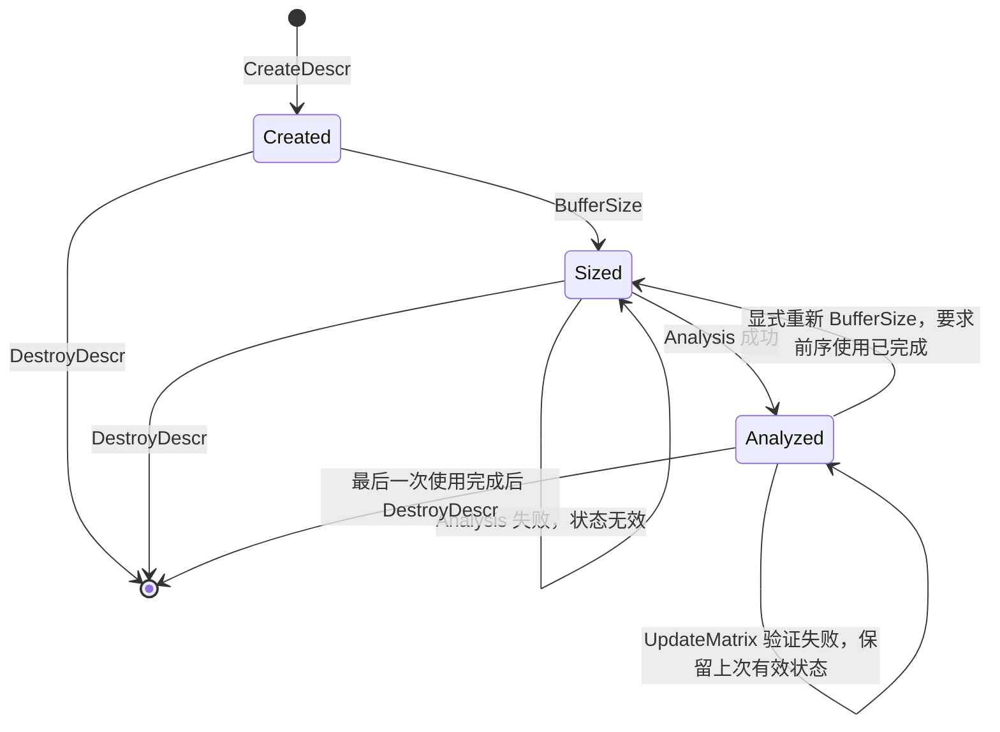

# aclsparseSpSM 算子设计文档（Ascend 950）

| 项目 | 内容 |
| --- | --- |
| 社区任务 | 9月社区任务-aclsparseSpSM算子开发（950） |
| 提交账号 | maincourses |
| 目标代码仓 | cann/ops-sparse，master |
| 源码调研基线 | `da27c925f718ad464e5c0e1c2b1e896ad3e8e797` |
| 文档日期 | 2026-09-03 |
| 文档状态 | 设计评审稿；功能扩展、性能目标及内存预算属于待实现、待验证内容 |

# 1. 需求背景

## 1.1 需求来源

依据报名平台提供的《aclsparseSpSM 算子开发(A5/950)任务书》和配套独立测试包，在 ops-sparse 既有 SpSM 接口及 arch35 实现上补齐能力。计算为 `op(A) C = alpha × op(B)`，目标平台为 Ascend 950（A5 / DAV_3510），验收软件环境为 CANN 9.1.0 及后续配套版本。

设计采用 aclsparse 公开 C++ Legacy API、Host 多阶段状态管理和 Ascend C Kernel 工程模式。设计文档提交至 competitions 仓库；后续代码、C++ UT/ST 和接口说明提交至 ops-sparse。

## 1.2 现状分析及复用边界

以下为指定基线的源码事实，不代表已经完成任务要求。文件链接固定到调研 commit，避免 master 更新导致结论失去对应关系。

| 项目 | 已有实现 | 本任务工作 |
| --- | --- | --- |
| 公开 API | CreateDescr / DestroyDescr / BufferSize / Analysis / SpSM 已存在；无 UpdateMatrix | 保持已有函数原型；增加更新枚举及接口 |
| 格式、类型 | 仅 CSR、FP32、I32 索引 | 补齐 CSC、COO、complex64；覆盖 base 0/1 |
| 运算 | opA 支持 N/T，opB 仅 N | opA/opB 均支持 N/T/H；复数 H 执行共轭 |
| 三角属性、布局 | LOWER/UPPER、UNIT/NON_UNIT、ROW/COL 已有路径 | 保留并扩展组合；补齐独立 B/C 布局、leading dimension 与 alias 测试 |
| alpha | 只接受 Host pointer mode，Solve 在 Host 解引用 float | 支持 Device 标量和 complex64 标量 |
| Analysis | D2H 拷贝索引及 values，在 CPU 转置、提取对角并进行 level scheduling，再 H2D 写回 | 迁移至 NPU；Host 不保存与 m/nnz 同规模的矩阵缓存 |
| Solve | RHS 分块、同层行分核、层间 SyncAll；列主序前后进行转换 | 复用分块搬运和向量求解思想；支持长行分片、层表分页和深依赖调度 |
| 跨阶段状态 | 缓存部分 A/B/C 元数据、opA/opB、workspace、tiling | 补齐描述符身份、索引指针、属性、设备、stream、pointer mode 和更新代次 |
| 容量限制 | 整行索引/values 和全部 levelRowPtr 放 UB；超限返回 NOT_SUPPORTED | 采用固定容量页/块，避免合法长行及深层矩阵因整体预加载而受限 |
| 测试 | 94 条 CSV 用例：79 条预期成功、15 条预期不支持；另有 20 个异常测试 | 将新增支持项的拒绝测试改为正向测试，新增全生命周期及专项测试 |

主要依据：[公开头文件][src-api]、[Host 实现][src-host]、[描述符][src-descr]、[Kernel][src-kernel]、[测试配置][src-test-cmake]、[CSV][src-csv]。

通用稠密描述符还有一项需要保留兼容性：当前 `aclsparseCreateDnMat` 拒绝空 values 和零维度，但 `aclsparseDnMatSetValues` 允许将有效描述符的 values 置空。初始实现利用已有 setter 构造 Analysis 所需的空 values 描述符，不为此扩大通用创建接口的变更范围。[通用描述符实现][src-common]

## 1.3 已完成的环境与基线验证

2026-09-03 在 Ascend950PR 上完成原生 ACL 内存读写和 NPU 加法检查；获取相同 commit 的 ops-sparse 后，编译生成 `libops_sparse.so` 和 `spsm_test`。补齐 Eigen 3.4.0 头文件依赖后，运行 `SpsmExceptionTest.*:*L0*`，共 **28/28 通过**。没有据此宣称全量回归或性能达标。

当前环境为 CANN 9.0.0-beta.2、npu-smi Version 25.7.rc1。平台查询报告 AIV 56、UB 253952 B、L2 134217728 B。以上数值仅记录本次设备，实现仍动态查询能力。当前 torch_npu 在初始化时报告不支持 Ascend950PR，Python NPU 测试路径尚不可用；原生 C++ 基线已独立验证。正式自测必须切换到任务要求的配套环境并重跑。

# 2. 需求分析

## 2.1 功能和输入输出

设 A 为 m×m 稀疏矩阵，右端数量为 r。`op(A)`、`op(B)` 支持 N（原矩阵）、T（转置）、H（共轭转置）。FP32 的 H 与 T 数学等价；complex64 必须对虚部取反。

| 对象 | 约定 |
| --- | --- |
| A | CSR/CSC/COO；Device I32 索引；base 0 或 1；values 为 FP32 或 complex64 |
| B | opB=N 时为 m×r，否则为 r×m；ROW/COL 和合法 leading dimension |
| C | m×r；ROW/COL 独立于 B，支持 B/C values 为同一 Device 指针 |
| alpha | 与 computeType 一致；Host 标量或 Device 上一个标量 |
| computeType | A/B/C/alpha 一致，ACL_FLOAT 或 ACL_COMPLEX64 |
| fill / diag / alg | LOWER/UPPER、UNIT/NON_UNIT、DEFAULT |
| workspace | Device 存储，由 BufferSize 查询，由 Analysis 绑定，持续到最后一次异步使用完成 |

I32 索引路径要求 m、nnz 及 `nnz+base` 可由相应索引字段表示；超界在 Host 检查后返回明确错误。稠密矩阵跨度、workspace 字节数和所有中间乘加独立进行 64 位溢出检查，不能以 I32 索引合法替代字节范围检查。

对下三角有效矩阵，行求解为：

`C[i,k] = (alpha × op(B)[i,k] − Σ(j<i) Aeff[i,j] × C[j,k]) / diag[i]`。

上三角按逆行序使用 j>i 的依赖。UNIT 时 diag 恒为 1，存储的对角 values 不参与计算。有效三角方向由 fill 和 opA 联合决定：转置或共轭转置时交换 LOWER/UPPER。

## 2.2 需求拆解

| 编号 | 需求 | 验证方式 |
| --- | --- | --- |
| R01 | 三格式、两类型、I32、base 0/1 | C++ 格式/类型交叉用例 |
| R02 | N/T/H、三角属性、布局、ld、多 RHS | 非对称复数矩阵及 padding 哨兵测试 |
| R03 | 空 B/C values 的 BufferSize/Analysis | 创建有效描述符后 SetValues(nullptr)，分析后恢复有效 Device values |
| R04 | Host/Device alpha 和 B/C 同指针 | stream 内生成 Device alpha；独立布局的原地对照 |
| R05 | GENERAL/DIAGONAL UpdateMatrix | 更新前后高精度 Golden；连续混合更新；更新后对角检查 |
| R06 | 未排序、重复坐标、确定性 | 固定输入重复运行逐位比较，覆盖不同原始存储顺序 |
| R07 | 描述符、workspace、stream 生命周期 | 参数变更、错误调用顺序、同 stream 排序、隔离进程异常测试 |
| R08 | NPU 执行和性能、内存 | Profiler、设备 Event、workspace 明细与峰值内存 |
| R09 | A2/A3 与 950 兼容性 | 公开头文件、公共描述符和各架构已有算子的联合回归 |

# 3. 详细设计

## 3.1 公开接口与工程组织

保持既有五个 SpSM 接口原型和 DEFAULT 枚举值；在 `include/cann_ops_sparse.h` 增加：

```cpp
typedef enum aclsparseSpSMUpdate_t {
    ACL_SPARSE_SPSM_UPDATE_GENERAL = 0,
    ACL_SPARSE_SPSM_UPDATE_DIAGONAL
} aclsparseSpSMUpdate_t;

aclsparseStatus_t aclsparseSpSMUpdateMatrix(
    aclsparseHandle_t handle,
    aclsparseSpSMDescr_t spsmDescr,
    void *newValues,
    aclsparseSpSMUpdate_t updatePart);
```

GENERAL 的 `newValues` 是按原始 CSR/CSC/COO 存储槽位排列的 nnz 个元素。DIAGONAL 是按原始矩阵行号排列的 m 个对角值，更新内部矩阵状态，不修改只读 matA 描述符及其输入数组。该区分与 cuSPARSE 的更新定义对齐；任务包 Python hook 传入整份 values 的 diagonal 路径需要先提取对角数组。[cuSPARSE SpSM][cusparse]

主要修改位置为 `sparse/spsm/arch35/`，增加规范化、分析和更新 Kernel，并扩展现有内部描述符、tiling、求解和布局转换实现。通用参数检查仅在有复用价值时提取至 `sparse/common/`，避免其他架构链接 arch35 私有结构。

专项测试放到任务书要求的 `test/spsm/arch35/`，在 `test/spsm/CMakeLists.txt` 注册独立扩展测试目标；保留并回归当前 `test/spsm/spsm/arch35/` 的既有目标。Python 专项测试继续使用 `test_cases/aclsparseSpSM_testCase/`。不同测试目录的命名差异在 PR 中说明，不复制两份同名实现。

硬件适配以 arch35 / DAV_3510 的 Ascend 950 为目标，使用平台接口查询核数、UB 和 L2。正式构建及验收使用任务规定的 CANN 9.1.0 及后续配套版本；A2/A3 的检查范围为公共接口和已有算子的兼容性回归。

## 3.2 Host 状态机



内部记录包含：描述符身份、A 的 shape/nnz/format/索引类型/base/fill/diag/索引指针/初始 values 指针，B/C 的 shape/order/ld/type，opA/opB、computeType、alg、pointer mode、alpha 地址、设备、stream、workspace 地址/查询大小、pattern 代次、values 代次和 kernel 调度摘要。

规则如下：

- BufferSize 只读取 Host 描述符元数据，计算与数据内容无关的空间上界；不读取 alpha 数值或 Device 矩阵内容。
- Analysis 使旧 analyzed 状态失效；仅在 NPU 结构/对角验证和内部状态构造全部成功后发布新状态。
- B/C values 在 Analysis 时可为空。允许通过原描述符 setter 在第一次 Solve 前绑定有效数据；首次执行时记录绑定关系。shape/order/ld/type 等仍须保持一致。空间查询始终覆盖可能的原地路径，不依赖 Analysis 时是否已知 alias。
- alpha 地址和 pointer mode 跨阶段一致；Host alpha 在 Solve 下发前按 dtype 复制到参数，Device alpha 的值由同 stream Kernel 执行时读取。
- Solve 只检查可在 Host 判断的状态/参数并下发 Kernel，不执行 D2H 检查或 stream 同步。
- Analysis/UpdateMatrix 的数据检查在 NPU 执行；为返回结构、零对角等明确错误，允许对绑定 stream 的固定大小状态回传进行等待。回传为错误码及层数等摘要，不超过 64 B，不复制矩阵。阶段等待时间单独计入报告。
- UpdateMatrix 按相同 pattern 重建或刷新 values 相关状态；不允许直接更换索引指针或稀疏结构来复用旧分析。调用者修改索引数组内容而不重新 Analysis 属于违反生命周期约定。
- 同一 plan 绑定一个设备及一个 stream。并行 stream 使用不同 plan/workspace；切换 stream 需在前序使用完成后重新分析。内部维护 SpSM 描述符存活记录，在解引用前拒绝已销毁句柄。

外部 buffer 的提前释放、任意裸指针真实长度及 dtype 无法仅凭 `void*` 在所有情况下可靠辨认。实现检查可获取的指针属性、对齐和描述符元数据；分配长度及生命周期由调用方遵守，并通过带分配记录的测试封装、内存检查工具和隔离进程专项测试验证，不承诺生产 API 能拦截所有悬空指针。

## 3.3 Device 格式规范化

内部统一为表示 `op(A)` 的 base-0 CSR，包含 rowPtr、colIdx、按规范顺序保存的 values、原始槽位映射 permutation 和独立对角缓存。所有内容在 workspace 中生成，输入 A 只读。

1. **校验索引。** CSR/CSC 先验证压缩指针端点、单调性及范围，再允许后续 Kernel 访问对应槽位；要求首值为 base、末值为 nnz+base。COO 校验所有行列下标。任何错误通过 Device 状态阻止后续访问，避免错误输入导致越界读取。
2. **解码坐标。** CSR 用行区间生成 row，CSC 用列区间生成 col，COO 直接读取两个索引数组。压缩指针和坐标都按声明 base 归一化，不能只对列索引减 base。
3. **应用 opA。** T/H 交换坐标；H 在 values 搬运时取共轭。保留 originalSlot，GENERAL 更新依此读取新 values。非选定三角的条目不参与求解，但其下标仍须合法。
4. **稳定排序。** 以 `(row, col, originalSlot)` 为整数键进行分块排序和 GM 稳定归并。短块参考现有 arch35 Sort 用法，长输入使用可分片的归并路径；不把 I32 下标转为 float 排序，不以原子写入先后决定条目顺序。
5. **构造内部 CSR 和对角。** 重复坐标保留为独立条目，按排序顺序依次贡献；同一行的重复对角按固定槽位顺序求和。UNIT 强制对角为 1；NON_UNIT 缺失或合计为零则返回明确错误。保留重复条目可使 GENERAL 更新保持原始槽位一一映射。

复用候选为现有 `csrsort` 的短行/长行排序思想及 `csr2csc_ex2` 的 Device 计数流程。不能直接调用会修改 matA 输入的原地排序接口，需在 workspace 上组织适用的内部 Kernel；若引入共享 Kernel，其源文件纳入单算子构建依赖。[csrsort][src-sort]、[csr2csc_ex2][src-convert]

## 3.4 NPU Analysis 和依赖调度

对有效下三角，`level[i] = 0`（没有依赖）或 `1 + max(level[j])`（j<i）；上三角反向处理。依赖由结构而非当前数值是否为零决定，因此 values 从零变为非零不会使旧层次失效。

第一阶段采用 Device 有序扫描：一个负责分析的 AIV/SIMT 执行单元按三角方向遍历行，在 GM 保存 level，确定 maxRowLen、层数和层宽摘要。该路径复杂度为 O(m+nnz)，不需要 Host 矩阵缓存，也不依赖尚未获调度的其他核完成任务。其串行部分是明确的性能风险，需单独报告 Analysis 耗时；后续优化可按独立结构块并行处理，不能改变依赖语义。

再在 NPU 按 `(level,row)` 稳定分桶，生成 levelRowPtr/levelRowIdx。层表保留于 GM，Solve 只载入当前一页，取消现有整张层表常驻 UB 的限制。

求解规划保留两条 Device 路径：

- **层调度路径：** 任务单元为 `(row,RHS tile)`，同层跨核分配；每个 tile 内按 col/slot 固定顺序累积。只有层间执行受支持的全核同步；启动核数不超过动态查询的 AIV 核数，所有启动核都必须经过同步点。
- **深依赖路径：** 当层宽很小、层数很大时，由每个 RHS tile 的固定执行单元按三角行序完成整个系统，消除逐行全核 barrier。RHS tiles 独立，无跨核等待环，也不在一个 kernel 中启动超过可驻留资源的等待任务。对小 RHS 的并行度限制如实纳入性能分析。

调度选择只依赖 pattern、shape、dtype 和平台资源，不能依赖 values；同一输入、同一运行配置选择固定路径。阈值由真实 950 profiling 确定，在报告中记录，不预先宣称达到目标。

## 3.5 Solve、布局与原地语义

对 ROW 布局，地址为 `row*ld+col`；COL 为 `col*ld+row`，所有地址乘法使用经溢出检查的 64 位数。根据 opB 先映射逻辑坐标到物理坐标，H 还对复数取共轭。

通用路径先在 NPU 将 `op(B)` 复制到 workspace 中的 ROW 稠密缓冲，再在该缓冲上求解，最后按 C 的布局写回。第一次写 C 之前已保存全部所需输入，因此 B/C 同一 Device 指针、不同布局及 opB=T/H 时也不会覆盖尚未读取的 B。调用方的共享分配必须容纳 B/C 各自描述符要求的最大存储跨度。

对可证明安全的 ROW/N 布局可使用直接求解路径，降低搬运开销；但 BufferSize 仍为尚未绑定 values 的描述符预留通用路径容量。非完全相同起始地址的部分重叠不属于本次声明的 alias 能力。

长稀疏行按固定 nnz tile 流式读取，跨 tile 继续同一个累积，不分配 maxRowLen 大小的 UB 数组。依赖的多个 RHS 连续向量化读取，并采用现有 TQue 双缓冲思想。

complex64 使用两个 FP32 分量完成乘加和除法。复数除法采用比例缩放，避免直接计算 `real²+imag²` 的无谓溢出；INF/NAN 与抵消场景单独测试。是否需要补偿累积由高精度对照结果决定，并固定编译选项及归约顺序，不能用降低误差检查阈值替代精度修复。

保守的 Solve UB 预算为 `2*t*(4+s) + 8*s*K + 4*page + 8192 <= UB`：t 为稀疏条目块长，K 为 RHS 块宽，page 为层表页大小，s 为 4/8 B。实际还需计入 API scratch、对齐和同步资源；无法满足时缩小块，不因整行过长直接拒绝合法输入。

## 3.6 UpdateMatrix

GENERAL 通过 permutation 从 nnz 个原始槽位的新 values 刷新内部排序 values，按 opA 决定是否共轭，并重算对角。所有结构依赖和行列分桶保留；更新 values 代次和相关 tiling 状态，禁止复用旧对角缓存。

DIAGONAL 从 m 个新对角值刷新独立对角缓存，H 时取共轭；非对角内部 values 保持原样。Solve 始终跳过 CSR 中的所有对角槽位，仅使用独立对角缓存，避免读到更新前的存储对角。UNIT 下有效对角仍为 1；该调用完成参数检查后作为不改变有效矩阵的更新处理。后续 GENERAL 以其完整输入重新确定全部有效 values，不继承更早的 diagonal override。

更新分为“验证候选对角/输入”与“提交 values”两步，在相同 stream 上有序执行。验证失败时不覆盖上次有效内部状态，用户可修正输入后重试。候选输入在更新完成前必须有效且不被并发修改。重复对角在 GENERAL 中按固定顺序求和；DIAGONAL 提供的是最终有效对角，不乘以原始重复次数。

## 3.7 Workspace 上界与内存预算

所有与矩阵规模相关的持久状态和临时存储均来自 externalBuffer。Host plan 只保存固定大小元数据。BufferSize 采用检查溢出的 size_t/uint64_t 计算，并对区域分别按 64 B 对齐。

记 q=nnz、s=4（FP32）或 8（complex64），`A64(x)` 为向上取整到 64 B，H=65536 B 为本设计阶段给固定元数据、区域对齐和运行控制预留的预算。

持久区 P 包含：rowPtr `4(m+1)`、colIdx `4q`、permutation `4q`、内部 values `sq`、diag `sm`、rowLevel `4m`、levelRowPtr `4(m+1)`、levelRowIdx `4m`，每项独立对齐后加 H。

临时区复用：

```text
S_sort  = A64(24*q + 8*(m+1))     # 两份 (row,col,slot) 归并数组及扫描空间
S_level = A64(16*m + 8*(m+1))     # (level,row) 分桶及扫描空间
S_dense = A64(s*m*r)              # op(B) 快照及内部解共用
W       = P + max(S_sort, S_level, S_dense)
```

Analysis 返回前其临时区使用已结束，Solve 可复用为稠密缓冲；UpdateMatrix 使用固定状态和分块缓冲。需要新增临时区时必须更新公式和预算，不能另外申请未计入的同规模 Device 或 Host 缓存。

| 场景规模 m / q / r | FP32 预算约 MiB | complex64 预算约 MiB |
| --- | ---: | ---: |
| P-01：32768 / 262144 / 16 | 9.94 | 11.06 |
| P-02：65536 / 786432 / 32 | 28.81 | 32.06 |
| P-03：131072 / 1966080 / 64 | 71.06 | 97.06 |

本次平台查询 L2 为 128 MiB，因此以上三个规模的**设计预算**低于该实测容量。它们不是 BufferSize 实测值；实现后须记录每一用例的实际 workspace，并在 CANN 9.1 配套环境重新查询 L2。超出这些规模的输入仍需单独计算和验证，不能据此推断全部动态 shape 满足内存验收。

## 3.8 异常、边界和资源生命周期

| 情形 | 处理原则 |
| --- | --- |
| 空 handle、空描述符、空输出参数 | 在解引用前返回仓库对应错误码 |
| 不支持 dtype / alg / index type | 返回 NOT_SUPPORTED；非法枚举或元数据返回 INVALID_VALUE |
| 未 Analysis 就 Solve/Update | 返回 NOT_INITIALIZED |
| 非法压缩指针或越界索引 | Device 验证后 Analysis 返回 INVALID_VALUE，不继续访问非法槽位 |
| NON_UNIT 缺失/零对角 | Analysis/Update 返回明确失败，初始沿用现有 NOT_SUPPORTED 返回口径并记录原因 |
| workspace 为空、未对齐、查询尺寸溢出 | 返回 INSUFFICIENT_RESOURCES 或 INVALID_VALUE，具体映射写入接口测试 |
| m/r 为 0 | 当前公开 DnMat 创建接口返回 INVALID_VALUE；按此链路测试，不伪造内部描述符。若验收要求成功空输出，需先评审通用创建契约变更 |
| m=1、r=1 | 正常求解，包括 UNIT 和 complex64 |
| q=0 | m/r>0 且 UNIT 时视为单位三角系统；NON_UNIT 为缺失对角错误 |
| 描述符参数或索引指针变化 | 拒绝复用旧 plan，要求重新分析 |
| B/C values 在 Solve 为空 | INVALID_VALUE，不下发求解 |
| buffer 与索引/values/输出发生不允许的重叠 | 对可确定的重叠返回错误；调用方保证独立 workspace 分配 |
| 非有限数 | 按运算规则传播并按专项 Golden 比较，不用统一置零掩盖错误 |

测试中的提前释放、越界和悬空指针场景在独立进程内执行，结合内存检查工具，不污染后续性能测试。正常调用序列显式等待最后一个 Solve 完成后释放 buffer、输入输出和描述符；Destroy 不隐式替调用方等待所有设备工作。

# 4. 可维可测分析

## 4.1 测试层次及覆盖

1. C++ Host UT 覆盖参数、状态机、空间溢出、调用顺序、描述符变化及错误码；新增接口必须直接通过公开 API 测试。
2. 950 端到端 ST 覆盖真实 Device 索引/values、NPU Analysis/Update/Solve、Host/Device alpha 和异步 stream。
3. FP64/complex128 CPU Golden 对照求解结果。CPU 从实际低精度输入的相同比特数据升精度，不能重新生成一份高精度随机输入当作相同样本。
4. Python/ATK 桥接 C++ 真实接口，负责标准化运行和报告；在匹配的 torch_npu 环境就绪前，原生 C++ 测试承担验证入口，不使用 CPU fallback 冒充 NPU。

用例按 R01—R09 建立可追溯矩阵：核心语义全部覆盖，组合采用成对覆盖并补齐高风险交叉，例如 complex64×H×COO×base1×DIAGONAL、B/C 同指针×不同布局×opB=T/H。所有新增声明能力都要有至少一项真实 NPU 正向测试，不能仅保留预期“不支持”的旧用例。

pattern 包含空行、对角、带状、独立块、长链、单长行、长尾、重复及未排序坐标。输入 values 按任务要求组织 70% 均匀分布、20% 正态分布和 10% 特殊构造，并记录 seed、参数及输入文件校验值。m/nnz/RHS 覆盖 0/1 和任务性能规模。

每个确定性用例重复运行并比较输出原始字节，包括 GENERAL/DIAGONAL 更新后的重复 Solve。对相同数学矩阵的不同存储排列，验证精度等价；由于重复值浮点归约次序可能变化，不将跨排列逐位一致作为额外承诺。

stream 测试在同 stream 排入输入写入、Device alpha 写入、更新、Solve 和结果回传；使用事件及 Profiler 验证有序执行。多 plan 在不同 stream 并发验证状态隔离，跨设备/跨 stream 误用同一 plan 验证明确拒绝。

## 4.2 精度标准

FP32 逐元素按 `abs(actual-golden) <= 2^-16 + 2^-10*abs(golden)` 比较，匹配率至少 0.99；同时每个元素满足绝对误差不超过 `max(1e-2, 32*ULP(golden))`。complex64 实部、虚部分别执行完整规则。ULP 使用待测低精度类型对应的间距，不能误用 FP64 Golden 类型的间距；与官方精度标准和仓库比较器对齐。

INF 要求符号一致，NAN 单独判断，有限 Golden 对应非有限输出判失败。抵消、极小/极大有限数及复数除法单列测试。不同运行之间的位级确定性独立检查，不以容差比较替代。

## 4.3 性能与内存标准

每场景预热 10 次、正式采样 30 次，报告 median、P90、Analysis、Update、Solve、布局转换、workspace 及 Profiler。主倍率为 `GPU 同范围设备 Event 耗时 / NPU 同范围设备 Event 耗时 >= 0.3`。

计时至少区分：一次 Analysis；已有 plan 的 Solve；已有 pattern 的 Update+Solve。两端的分子分母必须来自同一行定义。如果 GPU 缺少 UpdateMatrix 而使用 Reanalysis+Solve，必须独立标注，并以两端相同工作范围重新采集或获得验收方确认，不能与 NPU 的 Solve-only 直接相除。额外报告 Host 端到端耗时，以披露 Analysis/Update 的状态回传等待。

保留任务包原始 206 条性能 JSON 和原始基线。现有 P-01 仅 FP32，P-02/P-03 仅 complex64，各有 base0/1 两例；针对任务书的“两类型均达标”补充另外三组 dtype 场景，并按等价输入采集新的 GPU/NPU 结果，明确标注追加用例。

内存按同一 case 比较 input baseline、peak、extra peak、实际 workspace。输入输出超过 500 MB 时，按任务书“NPU 较 GPU 使用的额外内存不超过 GPU 使用内存总量的 50%”核对比例路径，并明确差额及分母对应的报告字段；否则或没有等价 GPU 接口时，按 workspace/L2 路径验证。不能把 500 MB 以下用例判为满足比例路径，也不能将预算表作为最终内存测试结果。

## 4.4 测试包需修正的适配点

- 补齐 format、B/C order、ld、alias 等参数与真实 C++ API 桥接，现有 CSR-only hook 不足以覆盖任务。
- DIAGONAL 提供 m 个有效对角值，不能直接传整份 nnz values。
- 统一 GPU/NPU 的计时边界；当前 Python reset 中的 update 在事件开始之前，原生 CUDA 则汇总 update/reanalysis 与 solve。
- Golden 使用与 NPU 完全相同的输入数据，再升精度求解。
- 核对并补齐生成器依赖；任务包 `generate_cases.py` 引用的 `extra_performance_cases`、`extra_accuracy_cases` 未随当前目录提供。已有 JSON 可以直接使用，不能宣称生成器已可独立复现。
- 原始基线、修正后的结果和补充用例分别记录 case hash、输入 seed、API/版本及计时范围，保留来源追溯。

## 4.5 分阶段实施及验收产物

| 阶段 | 工作 | 出口条件 |
| --- | --- | --- |
| M0 | 固定源码、现状调研、设计评审 | 设计 PR 评审通过；正式验收前已合入 |
| M1 | Host 状态机、空间布局、NPU 规范化/分析 | CSR FP32 已有用例回归，新增分析路径有 Profiler 证据 |
| M2 | 三格式、complex64、opA/opB、布局和 alias | R01—R04 专项用例通过 |
| M3 | 更新、异常、确定性、stream 生命周期 | R05—R07 用例通过，资源释放可复现 |
| M4 | 深依赖和长行优化、两类型性能及内存 | 按统一口径达到目标，失败项不遗漏 |
| M5 | CANN 配套环境和 A2/A3 联合回归 | 测试报告、README、接口文档、日志、Profiler、代码链接齐备 |

# 5. 兼容性分析与评审确认项

已有 API 名称、参数次序、DEFAULT 值保持不变；新增 enum/API 为增量扩展。opaque SpSM 描述符内部布局可扩展，外部测试不得以偏移读取其字段。当前 SpSM 仅有 arch35 源码，本任务不宣称新增 A2/A3 SpSM 内核；公共头文件和共用描述符/Host 逻辑变更必须回归 A2/A3 已有算子及构建，避免新增符号依赖破坏其他架构。

以下事项需要在设计评审中确认并将结论写回本文件：

| 编号 | 已发现差异 | 当前方案及确认点 |
| --- | --- | --- |
| Q1 | 任务书内存比例为 50%，测试 README/脚本使用 5% | 设计按任务书 50% 和 workspace/L2 两路径；确认后修改比较器 |
| Q2 | 任务书 P-01 中位数约 56–58 ms，附带明细约 323–324 ms，其他 P 场景也不一致 | 不挑选有利数据；确认有效原始基线、GPU 型号/版本和计时阶段 |
| Q3 | Python Solve-only 与原生 CUDA Update/Reanalysis+Solve 范围不同 | 按第 4.3 节分别采样并比较同范围指标 |
| Q4 | 当前环境为 CANN 9.0 beta，任务要求 9.1；torch_npu 不支持当前芯片 | 获取支持 Ascend950PR 的正式配套组合后重跑；本次结果仅作开发基线 |
| Q5 | 通用 DnMat 创建拒绝零维度，任务要求覆盖 m/RHS=0 但未指定成功或失败语义 | 暂沿用公开创建接口的明确错误；如需空输出成功，则单独评审通用 API 及其他算子的兼容性 |
| Q6 | 裸指针长度、已释放 externalBuffer 的通用检测能力有限 | 明确 API 可检查项、调用方责任与隔离测试判据，避免无法兑现的运行时检查承诺 |
| Q7 | 返回 Device 数据错误需阶段同步，而 Solve 必须异步 | Analysis/Update 仅回传不超过 64 B 状态并等待；确认此返回码与同步边界 |

# 6. 参考资料

- [社区任务流程与设计提交目录][workflow]。
- [官方设计模板][template]。
- [ops-sparse 公开头文件][src-api]、[SpSM Host][src-host]、[内部描述符][src-descr]、[Kernel][src-kernel]。
- [通用描述符创建/更新实现][src-common]、[测试注册][src-test-cmake]、[SpSM 测试][src-test]。
- [cuSPARSE SpSM 接口及 UpdateMatrix 定义][cusparse]。
- 报名平台任务书、独立测试包及其 GPU 基线（2026-09-03 本地核对版本）。

[workflow]: https://gitcode.com/cann/cann-ops-competitions/blob/7c335b5f0c268627e58d41b58613d222ebc4b34a/04_tasks/01_community-task-2026/README.md
[template]: https://gitcode.com/cann/cann-ops-competitions/blob/7c335b5f0c268627e58d41b58613d222ebc4b34a/04_tasks/01_community-task-2026/resources/design_template.md
[src-api]: https://gitcode.com/cann/ops-sparse/blob/da27c925f718ad464e5c0e1c2b1e896ad3e8e797/include/cann_ops_sparse.h
[src-host]: https://gitcode.com/cann/ops-sparse/blob/da27c925f718ad464e5c0e1c2b1e896ad3e8e797/sparse/spsm/arch35/spsm_host.cpp
[src-descr]: https://gitcode.com/cann/ops-sparse/blob/da27c925f718ad464e5c0e1c2b1e896ad3e8e797/sparse/spsm/arch35/spsm.h
[src-kernel]: https://gitcode.com/cann/ops-sparse/blob/da27c925f718ad464e5c0e1c2b1e896ad3e8e797/sparse/spsm/arch35/spsm_kernel.cpp
[src-common]: https://gitcode.com/cann/ops-sparse/blob/da27c925f718ad464e5c0e1c2b1e896ad3e8e797/sparse/common/aclsparse_descr.cpp
[src-test-cmake]: https://gitcode.com/cann/ops-sparse/blob/da27c925f718ad464e5c0e1c2b1e896ad3e8e797/test/spsm/CMakeLists.txt
[src-test]: https://gitcode.com/cann/ops-sparse/blob/da27c925f718ad464e5c0e1c2b1e896ad3e8e797/test/spsm/spsm/arch35/spsm_test.cpp
[src-csv]: https://gitcode.com/cann/ops-sparse/blob/da27c925f718ad464e5c0e1c2b1e896ad3e8e797/test/spsm/spsm/arch35/spsm_test.csv
[src-sort]: https://gitcode.com/cann/ops-sparse/blob/da27c925f718ad464e5c0e1c2b1e896ad3e8e797/sparse/csrsort/arch35/csrsort_kernel.cpp
[src-convert]: https://gitcode.com/cann/ops-sparse/blob/da27c925f718ad464e5c0e1c2b1e896ad3e8e797/sparse/csr2csc_ex2/arch35/csr2csc_ex2_kernel.cpp
[cusparse]: https://docs.nvidia.com/cuda/cusparse/index.html#cusparsespsm
