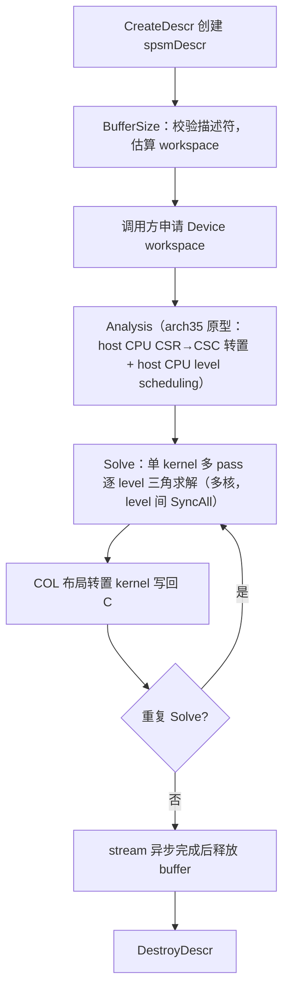
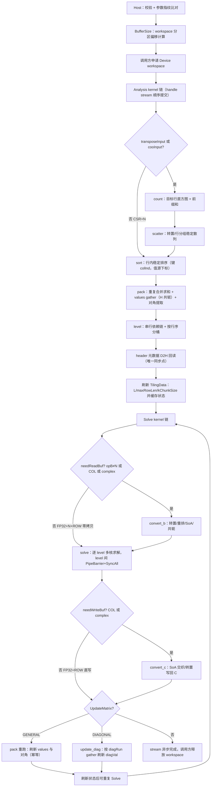

# 【社区任务】aclsparseSpSM 算子设计文档

> 对应任务书：`9月社区任务-aclsparseSpSM算子开发(A2A3)/aclsparseSpSM_A2A3_task_doc.md`。本文是面向 Atlas A2/A3（arch22 / DAV_2201，Ascend C SIMD 向量编程模型）的开发方案，代码、测试和自测报告以任务书为最终验收依据。

## 文档适用范围与依据

本方案覆盖 `aclsparseSpSMCreateDescr`、`aclsparseSpSMDestroyDescr`、`aclsparseSpSMBufferSize`、`aclsparseSpSMAnalysis`、`aclsparseSpSM`（Solve）和 `aclsparseSpSMUpdateMatrix` 六个公开接口，覆盖 CSR/CSC/COO、FP32/complex64、多 RHS、ROW/COL、opA/opB 的 N/T/H、Host/Device pointer mode、原地求解与异步 stream 语义。

方案依据如下：

1. 任务书中给出的 `op(A)·C = alpha·op(B)` 语义、参数矩阵、验收阈值和目录约定。
2. `ops-sparse` master 的 arch35/DAV_3510 `aclsparseSpSM` FP32 CSR 原型（Host 状态机、workspace 布局、level-scheduling SIMD solve kernel 可移植框架）及其公共 Legacy API 风格。
3. cuSPARSE SpSM 的 create、BufferSize、Analysis、Solve、updateMatrix、destroy 生命周期和三角求解语义。
4. 社区任务设计文档 CheckList（`asctool/docs/official/设计文档CheckList.md`）的审核项。
5. 任务包中的 `test_cases/aclsparseSpSM_testCase/`、`test_cases/common/` 和已采集 GPU 基线（`gpu_performance_result_benchmark.md`）。

## 一、需求背景

### 1.1 需求来源

本需求来源于 2026 年 9 月 CANN 社区任务（【社区任务】aclsparseSpSM 算子开发 A2/A3），目标是在 Atlas A2/A3 上补齐开源 `ops-sparse` 仓库的稀疏三角多右端求解能力，并向社区提交可复现的代码、测试和文档。

目标源码目录为 `sparse/spsm/arch22/`，专项 C++ UT/ST 按 `test/spsm/` 下仓库 CMake 自动发现约定组织（`test/spsm/spsm/arch22/`，与既有 arch35 用例同构），公开接口同步更新 `include/cann_ops_sparse.h`；主计算与格式相关计算全部在 NPU Kernel 中执行，禁止 CPU fallback。

### 1.2 背景介绍

#### 1.2.1 aclsparseSpSM 实现优化

SpSM（Sparse Triangular Solve with Multiple Right-Hand Sides）求解下列方程：

```text
op(A) * C = alpha * op(B)
```

其中 `A` 是稀疏三角方阵（`m×m`，CSR/CSC/COO，LOWER/UPPER，UNIT/NON_UNIT），`B` 是多列稠密右端矩阵，`C` 是解矩阵（`values` 可与 `B` 完全相同实现原地求解）；`opA/opB` 支持 N/T/H（complex64 的 H 为共轭转置）；dtype 支持 FP32 与 complex64，Device 索引统一 I32、base 0/1。

现有 master 原型（Ascend 950 / arch35）可以作为 Host API、状态管理、workspace 布局和 FP32 CSR level-scheduling solve kernel 的实现基线，但 A2/A3（arch22）目录下没有 SpSM 实现，且原型本身缺少 CSC/COO、complex64、opB、Device pointer mode、UpdateMatrix、确定性规范化等能力，其 Analysis 阶段还存在 host CPU 转置与 host CPU level scheduling（违反本任务 NPU 路径要求），均需在 arch22 上重新实现。

##### 参考源码与算子信息库核查结论

本任务是 `ops-sparse` 的 aclsparse Legacy C++ API 适配任务，并非 aclnn/TBE 算子迁移：本任务不涉及 TBE DSL 源码和算子信息库（无 `spsm.py` 或 ops-info json 可参考；本机 CANN 9.1.0 安装目录下亦无同名 TBE 实现）。正确参考对象与获取路径如下（均已逐一核对文件名）：

| 参考对象 | 路径（含文件名） | 用途 |
| --- | --- | --- |
| 现有原型 Host | `ops-sparse/sparse/spsm/arch35/spsm_host.cpp`（1483 行） | 三阶段状态机、校验集、workspace 偏移布局法（需删除 host CPU 转置/level 路径） |
| 现有原型 Kernel | `ops-sparse/sparse/spsm/arch35/spsm_kernel.cpp`、`spsm_kernel.h` | level-scheduling 多核 solve、kChunk UB 分块、DataCopyPad 跨步加载、FMA 累加序列 |
| 现有原型 Tiling | `ops-sparse/sparse/spsm/arch35/spsm_tiling_data.h`、`spsm.h` | TilingData by-value 传递、描述符内部结构范式 |
| 公开接口 | `ops-sparse/include/cann_ops_sparse.h`（SpSM 声明 L840 起） | 接口基线；本任务补充 `aclsparseSpSMUpdate_t` 枚举与 `aclsparseSpSMUpdateMatrix` |
| 算子文档 | `ops-sparse/sparse/spsm/README.md` | 产品支持表（当前仅 950PR/DT，本任务补 A2/A3） |
| 既有测试 | `ops-sparse/test/spsm/spsm/arch35/spsm_test.cpp`、`spsm_golden.h`、`spsm_test.csv` | Eigen FP64 golden、CSV 用例驱动框架（arch22 用例同构扩展） |
| 姊妹算子 | `ops-sparse/sparse/spsv/arch35/`（SpSV） | `updateMatrix` 的 GENERAL/DIAGONAL 语义与描述符状态位范式 |
| 公共层 | `ops-sparse/sparse/common/`（`aclsparse_descr.cpp`、`aclsparse_handle_internal.h`、`aclsparse_host_utils.h`） | 描述符/Handle/核数与 UB 动态获取工具，直接复用 |
| 标杆接口 | cuSPARSE SpSM 官方文档；任务包 `test_cases/aclsparseSpSM_testCase/benchmark_cusparse_gpu.cu` | 五阶段生命周期、参数语义、性能基线 |

#### 1.2.2 aclsparseSpSM 现状分析

##### 1.2.2.1 标杆与现有算子支持的数据类型和数据格式

标杆接口为 cuSPARSE SpSM（CSR/CSC/COO、FP32/FP64/complex64/complex128、N/T/H、ROW/COL、Host/Device pointer mode、updateMatrix、stream 异步）。受 A2/A3 硬件与任务书约束，本任务对齐其中 FP32/complex64 + I32 索引子集。现有实现基线与目标能力对照如下（`I32` 为 Device 端统一索引类型）：

| 能力 | 现有 arch35 原型 | A2/A3（arch22）现状 | 本任务目标 |
| --- | --- | --- | --- |
| A 格式 | 仅 CSR | 无实现 | CSR、CSC、COO（NPU 归一化） |
| A dtype | 仅 FP32 | 无实现 | FP32、complex64 |
| 索引 dtype/base | I32 / base 0 | 无实现 | I32，base 0/1 |
| B/C 布局 | ROW（COL 走 host/独立 kernel 转置） | 无实现 | ROW、COL，动态 leading dimension |
| `opA` | N/T（T 走 host CPU CSR→CSC 转置） | 无实现 | N/T/H；complex64 的 H 共轭转置 |
| `opB` | 仅 N | 无实现 | N/T/H |
| 三角属性 | LOWER/UPPER、UNIT/NON_UNIT | 无实现 | 全组合 |
| RHS | 多 RHS（kChunk 分块） | 无实现 | 动态多 RHS，含 RHS=1 |
| pointer mode | 仅 HOST（DEVICE 拒绝） | 无实现 | HOST、DEVICE（alpha 依 mode 读取） |
| UpdateMatrix | 无 | 无实现 | GENERAL、DIAGONAL |
| 未排序/重复索引 | 不处理（语义未定义风险） | 无实现 | 确定性规范化，bitwise deterministic |
| Analysis 计算位置 | host CPU（D2H→CPU 转置/level→H2D，违规） | 无实现 | 全 NPU kernel 链 |
| 编程模型 | SIMD（vector API） | 仅支持 SIMD（arch22 无 SIMT） | Ascend C SIMD |

未列出的 dtype、索引或格式不得通过隐式转换宣称支持。

##### 1.2.2.2 标杆算子实现描述

**cuSPARSE SpSM 生命周期语义**：`cusparseSpSMCreateDescr → cusparseSpSM_bufferSize → cusparseSpSM_analysis（可选）→ cusparseSpSM（可重复 Solve）→ cusparseSpSM_updateMatrix（可选，值更新免重分析）→ cusparseSpSMDestroyDescr`。Analysis 阶段只依赖矩阵 pattern（B/C values 可为空），缓存与 opA/opB/dtype/layout/尺寸/workspace 绑定相关的跨阶段状态；结构或参数变化后须重新 Analysis；workspace 从 Analysis 起至异步 Solve 完成前保持有效。

**三角求解算法**（逐行公式，多右端以向量方式计算）：

```text
rhs_i = alpha * op(B)[i, :]
sum_i = rhs_i - Σ_j A_eff[i, j] * C[j, :]     # j 为已求解依赖行
C[i, :] = sum_i / A_eff[i, i]                  (NON_UNIT)
C[i, :] = sum_i                                (UNIT)
```

其中 `A_eff = op(A)`：`opA=T` 交换行列坐标，`opA=H` 交换坐标并对 complex64 取共轭；有效 fill 随之翻转（LOWER↔UPPER），决定依赖方向与求解方向（LOWER 正向 `i=0..m-1`，UPPER 反向）。

**依赖调度**：三角依赖构成 DAG，按 level scheduling 分层——无依赖行为 level 0，其余 `level(i) = 1 + max(level(j))`（j 为 i 的依赖行）；同一 level 内行互不依赖，可多核并行；level 之间存在全局依赖，需核间同步。随机三角 pattern（性能场景 k≈7–15 依赖/行）的 level 数 L≈k·ln(m)（约 75–110 层），层内并行度充足。

**现有 arch35 原型实现流程**（本任务的可移植基线，亦为需修正项来源）：

1. Host 校验描述符/shape/dtype/ld 后，`BufferSize` 按 workspace 分区偏移法计算字节数。
2. `Analysis`：opA=T 时 host CPU 完成 CSR→CSC 转置（D2H→CPU→H2D）；host CPU 计算 level scheduling，回填 TilingData（L/maxRowLen/kChunkSize）。
3. `Solve`：单 kernel 多 pass 逐 level 求解，level 内行跨核均分；每行加载 CSR 行数据（colInd/values 双缓冲），RHS 按 kChunk 列块循环：`acc = alpha·B[i,:]` → 双缓冲预取依赖行做 `Muls+Sub` FMA 累加 → NON_UNIT 乘 `1/diag` → 写回；level 间 `PipeBarrier<PIPE_MTE3> + SyncAll` 同步；COL 布局由独立 transpose kernel 在 Solve 前后转换。

需修正的问题：host CPU 转置与 level 计算（违规，必须 NPU 化）、不支持 CSC/COO/complex64/opB/DEVICE alpha/UpdateMatrix、不处理未排序与重复索引。

##### 1.2.2.3 标杆算子实现流程图

当前可确认的参考语义是 cuSPARSE 五阶段生命周期与 arch35 原型的“Host 分析 + NPU Solve”流程（不存在可引用的同名 TBE compute 图，下图描述可执行的参考语义而非虚构源码）：



cuSPARSE 标杆额外支持 `updateMatrix`（值更新免重分析）；arch35 原型缺失该阶段，本任务补齐。

## 二、需求分析

### 2.1 外部组件依赖

运行时不新增第三方依赖，依赖 CANN Runtime、Ascend C 编译链和 `ops-sparse` 已有公共组件。测试与报告依赖仅用于离线验证：

| 组件 | 用途 | 运行时依赖 |
| --- | --- | :---: |
| CANN 9.1.0+（Atlas A2/A3 配套驱动） | 编译、Device、stream、Profiler | 是 |
| `acl/acl.h`、Ascend C headers（`kernel_operator.h`） | Legacy API、kernel launch 和同步 | 是 |
| cuSPARSE | GPU 对照、性能基线和生命周期语义参考 | 否 |
| PyTorch/torch_npu（`torch.ops.ops_sparse_test.spsm_*_npu` hook） | 测试驱动、CPU Golden 与 NPU 挂接 | 测试 |
| ATK/任务包公共组件 | 泛化精度与性能执行 | 测试 |
| CANN Profiler/msprof | Kernel、stream、workspace 证据 | 测试 |

### 2.2 内部适配模块

| 模块 | 适配内容 |
| --- | --- |
| `include/cann_ops_sparse.h` | 新增 `aclsparseSpSMUpdate_t` 枚举与 `aclsparseSpSMUpdateMatrix` 声明（驼峰命名，对齐 SpSM 系） |
| `sparse/common/`（公共 Host 层） | 描述符/Handle/pointerMode/attribute 既有实现直接复用；`GetAivCoreCount/GetUbSize/CeilDiv/CHECK_RET` 工具复用；`AclsparseValidateSupportedCsrIndexTypes` 严格 I32 校验复用 |
| `sparse/spsm/arch22/spsm.h` | SpSM 描述符内部结构（跨阶段状态缓存）、workspace 分区偏移计算（`ComputeSpsm22WsOffsets`） |
| `sparse/spsm/arch22/spsm_host.cpp` | 五阶段 Host 状态机、参数/一致性/生命周期校验、tiling 构造、kernel 下发 |
| `sparse/spsm/arch22/spsm_kernel.{h,cpp}`、`spsm_tiling_data.h` | 9 个 SIMD kernel：预处理链（count/scatter/sort/pack/level）、求解链（convert_b/solve/convert_c）、更新（update_diag）；TilingData by-value |
| `test/spsm/spsm/arch22/` | C++ UT/ST：`spsm_test.cpp` + CSV 用例（复用 arch35 的 `spsm_golden.h`/`spsm_param.h`/框架，扩展 complex64/多格式/opB/update 用例列） |
| `test_cases/aclsparseSpSM_testCase/`、`test_cases/common/` | 任务包用例生成、benchmark、内存采集对比脚本（保留原样随交付提交） |

### 2.3 需求模块设计

#### 2.3.1 aclsparse Legacy API 算子原型

公开接口严格采用任务书基线（现有 master 原型 + 新增 UpdateMatrix）：

```cpp
aclsparseStatus_t aclsparseSpSMCreateDescr(aclsparseSpSMDescr_t *spsmDescr);
aclsparseStatus_t aclsparseSpSMDestroyDescr(aclsparseSpSMDescr_t spsmDescr);
aclsparseStatus_t aclsparseSpSMBufferSize(
    aclsparseHandle_t handle, aclsparseOperation_t opA, aclsparseOperation_t opB,
    const void *alpha, aclsparseConstSpMatDescr_t matA,
    aclsparseConstDnMatDescr_t matB, aclsparseDnMatDescr_t matC,
    aclDataType computeType, aclsparseSpSMAlg_t alg,
    aclsparseSpSMDescr_t spsmDescr, size_t *bufferSize);
aclsparseStatus_t aclsparseSpSMAnalysis(
    aclsparseHandle_t handle, aclsparseOperation_t opA, aclsparseOperation_t opB,
    const void *alpha, aclsparseConstSpMatDescr_t matA,
    aclsparseConstDnMatDescr_t matB, aclsparseDnMatDescr_t matC,
    aclDataType computeType, aclsparseSpSMAlg_t alg,
    aclsparseSpSMDescr_t spsmDescr, void *buffer);
aclsparseStatus_t aclsparseSpSM(
    aclsparseHandle_t handle, aclsparseOperation_t opA, aclsparseOperation_t opB,
    const void *alpha, aclsparseConstSpMatDescr_t matA,
    aclsparseConstDnMatDescr_t matB, aclsparseDnMatDescr_t matC,
    aclDataType computeType, aclsparseSpSMAlg_t alg,
    aclsparseSpSMDescr_t spsmDescr);
typedef enum aclsparseSpSMUpdate_t {
    ACL_SPARSE_SPSM_UPDATE_GENERAL = 0,
    ACL_SPARSE_SPSM_UPDATE_DIAGONAL
} aclsparseSpSMUpdate_t;
aclsparseStatus_t aclsparseSpSMUpdateMatrix(
    aclsparseHandle_t handle, aclsparseSpSMDescr_t spsmDescr,
    void *newValues, aclsparseSpSMUpdate_t updatePart);
```

参数约定摘要如下（完整参数矩阵见任务书 2.4，两处保持一致）；BufferSize、Analysis、Solve 三阶段对同一组属性执行一致性校验：

| 参数 | I/O/属性 | 数据类型/布局 | 合法值域 | 异常行为 |
| --- | --- | --- | --- | --- |
| `handle` | 输入 | Handle，标量句柄 | 已创建且未销毁 | 空句柄返回明确错误码 |
| `opA`/`opB` | 属性 | enum，单值 | N/T/H | 非法枚举返回明确错误码 |
| `alpha` | 输入 | FP32/complex64 标量指针，Host 或 Device | 与 `computeType` 一致 | 空指针、dtype 或 pointer mode 不匹配返回明确错误码 |
| `matA` | 输入 | sparse descriptor，CSR/CSC/COO，`[m,m]`，I32，base 0/1 | 合法 fill/diag 及索引结构 | 非法描述符、shape、dtype、索引或属性返回明确错误码 |
| `matB` | 输入 | dense descriptor，ROW/COL，动态 ld 与 RHS | 与 A/computeType 一致，`op(B)` 与 `op(A)` 右维匹配 | 描述符、shape、layout、dtype 不匹配返回明确错误码 |
| `matC` | 输出/原地 | dense descriptor，ROW/COL | 与 `op(A)` 左维及 B 的 RHS 数匹配；可与 B 同 values 指针 | 描述符、shape、layout、dtype 不匹配返回明确错误码 |
| `computeType` | 属性 | enum，单值 | `ACL_FLOAT`、`ACL_COMPLEX64` | 不支持或不一致返回明确错误码 |
| `alg` | 属性 | enum，单值 | `ACL_SPARSE_SPSM_ALG_DEFAULT` | 非法或不支持枚举返回明确错误码 |
| `spsmDescr` | 输入/输出 | opaque descriptor | Create 后至 Destroy 前有效 | 空指针、阶段错误返回明确错误码 |
| `bufferSize` | 输出 | `size_t*`，Host 标量 | 不溢出的非负字节数 | 空指针或溢出返回明确错误码 |
| `buffer` | workspace | Device byte buffer，满足对齐 | 至少 `bufferSize` 字节；Analysis 至异步 Solve 完成前有效 | 空/未对齐/生命周期错误返回明确错误码 |
| `newValues` | 输入 | Device 连续 values，与原 A 一致 | GENERAL 为 `nnz`，DIAGONAL 为对角更新所需元素数 | 空指针、dtype 或长度不匹配返回明确错误码 |
| `updatePart` | 属性 | enum，单值 | GENERAL、DIAGONAL | 非法枚举返回明确错误码 |

维度必须满足 `op(A)·C = alpha·op(B)`（C 为 `m×n`；opB=N 时 B 为 `m×n`，opB=T/H 时 B 为 `n×m`）；NON_UNIT 的对角元素存在且非零（缺失/零对角在 Analysis 阶段检出并报错）；BufferSize/Analysis 允许 B/C 描述符 values 为空（描述符本身须有效），Solve 使用有效 Device values；未排序与重复坐标为合法输入，由确定性规范化处理。

#### 2.3.2 Ascend C 算子相关约束与相对标杆的缺失项

本任务无同名 TBE 算子可比对，以 cuSPARSE SpSM 为标杆说明首版明确不支持的能力：非 I32 索引、FP16/BF16/FP64/complex128、批量稀疏矩阵、任意 stride（仅支持 leading dimension）、非 `DEFAULT` 的 alg、CPU fallback。alias 仅允许 B/C values 完全同指针；A 与 B/C 重叠、部分重叠和 Host values 均报错。相对 arch35 原型缺失的 host 转置/level 能力不是“约束”而是被 NPU kernel 链替代。

## 三、需求详细设计

### 3.1 调用方式

本任务不是 aclnn Tensor API，而是 `ops-sparse` 的 aclsparse Legacy C++ API。调用方通过 handle 绑定 stream，按 cuSPARSE 对齐的六接口五阶段顺序执行，全程异步、不隐式 synchronize：

```text
aclsparseCreateHandle / aclsparseSetStream / aclsparseSetPointerMode
  -> aclsparseSpSMCreateDescr
  -> aclsparseSpSMBufferSize          // B/C values 允许为空
  -> 调用方申请 Device workspace（aclrtMalloc）
  -> aclsparseSpSMAnalysis            // NPU 规范化 + level scheduling；B/C values 允许为空
  -> 设置 matB/matC 的 Device values
  -> aclsparseSpSM                    // 可重复调用；原地求解时 C.values == B.values
  -> aclsparseSpSMUpdateMatrix        // 可选：GENERAL / DIAGONAL 值更新
  -> aclsparseSpSM                    // 用更新后的值再次求解
  -> aclrtSynchronizeStream           // 异步 Solve 完成后方可释放 buffer
  -> aclsparseSpSMDestroyDescr
```

从 Analysis 到 Solve 期间，matA/matB/matC 描述符、参数和 externalBuffer 必须保持一致；结构或参数变化后重新执行 Analysis；buffer 在异步 Solve 完成后释放。此调用链对应 CheckList 的“调用框架适配”要求，不提供独立的 kernel 直调入口。

### 3.2 需求总体设计

总体采用“公共 Host 状态管理 + NPU 预处理（格式规范化 + level scheduling）+ NPU level-scheduled solve”的三层结构。Analysis 产生可复用的 pattern 元数据并绑定 workspace；Solve 只读取 Device values 和已绑定 workspace；UpdateMatrix 只刷新 values 相关状态。格式转换和与稀疏结构相关的计算全部由 NPU kernel 完成，Host 仅负责参数校验、状态机管理、tiling 描述、kernel 提交和 32 字节级元数据回读，不执行 CPU 求解或 CPU 排序 fallback。

Host 描述符状态机：

```text
CREATED
  -> BUFFER_SIZED   (cachedBufferSize；shape/dtype/layout 已校验)
  -> ANALYZED       (analysisLaunched；规范化 CSR/level/diag 元数据、tiling、buffer 绑定)
  -> SOLVING        (Solve kernel 已提交，stream 异步执行中)
  -> UPDATED        (updateMatrixCalled；values 指针一致性校验放宽)
  -> DESTROYED
```

Analysis 缓存 A 格式、三角属性、opA/opB、dtype、尺寸、索引、B/C layout、RHS 数量和 workspace 绑定状态；Solve 前逐项比对（参数指纹），变更即返回错误要求重新 Analysis。

#### 3.2.1 Host 侧设计

Host 侧职责：参数校验（空指针/非法枚举/方阵与维度匹配/ld 与 order 契约/INT32 上限/溢出检查）、派生量计算（是否转置散列、读/写缓冲条件、有效 fill、kChunkSize）、workspace 分区偏移计算（BufferSize 与 Analysis 共用同一函数保证一致）、TilingData 构造与跨阶段缓存、kernel 链下发（全部 `<<<blockDim, nullptr, stream>>>` 于 handle stream）、Analysis 末尾 header 元数据 D2H 回读（唯一同步点）与状态刷新。

##### 3.2.1.1 分核策略

`blockDim` 统一取 `GetAivCoreCount()` 动态获取（R2 规则禁止硬编码；获取失败兜底 1 核，此时退化为单核执行仍保证正确性）。各 kernel 的分核方式：

| kernel | 分核策略 |
| --- | --- |
| `count`（直方图+前缀和） | 核间按 nnz 段并行计数目标行频次，核 0 串行完成 `m+1` 前缀和（O(m)） |
| `scatter`（稳定散列） | 核间按 nnz 段并行，将三元组散列到目标行桶；桶内游标允许整数原子自增（仅决定暂存顺序，最终顺序由后续 sort 的稳定键唯一确定，浮点禁止原子归约） |
| `sort`（行内稳定排序） | 核间按行区间均分（core r 处理行 `[r·m/K, (r+1)·m/K)`）；行长 ≤ UB 阈值的行在 UB 内排序（插入/bitonic），超长行分段归并（行长上界由 `maxRowLen` UB 校验保证） |
| `pack`（压缩合并+对角提取） | 核间按行区间均分，逐行扫描 sorted 流做重复坐标合并与 values gather |
| `level`（分层+分桶） | 串行依赖链单核（核 0）按 solveDir 行序扫描 `level(i)=1+max(level(deps))`，O(nnz)；随后计数+前缀和+按行序稳定写入分桶（行序天然确定，无需原子）；其余核直接退出 |
| `convert_b` / `convert_c`（稠密重排） | 核间按 `m×n` 元素均分，行/列块搬运 |
| `solve`（三角求解） | 单 kernel 多 pass 逐 level：level 行集 `[lvStart, lvEnd)`，`rowsPerCore = ceil(lvRows / numCores)`，core b 处理连续行区间 `[lvStart + b·rowsPerCore, min(…, lvEnd))`（最后一个核吸收余数）；level 间全核 `SyncAll`（空核亦参与握手，满足 DAV_2201 SyncAll 全核到达要求） |
| `update_diag` | 核间按行区间均分，按 diagRun 元数据 gather 刷新 |

level 内连续行均分保证同一行的 kChunk 列块始终在同一核内串行处理（写序确定）；level 数 L≈k·ln(m)（性能场景约 75–110），层间同步开销占比小。长尾行（`nnz_i·n` 过大）通过 kChunk 列块切分控制单行 UB 占用；行长受 `maxRowLen ≤ (UB−预留)/16B` 上界约束，超出返回不支持。

##### 3.2.1.2 数据分块和内存优化策略

**UB（LocalMemory）划分**（solve kernel，FP32 元素计；complex64 以实虚分离的双 f32 通道处理，每通道同布局）：

```text
固定占用 F = 8 KiB 预留 + 4 × maxRowLen × 4 B（colInd/vals 各双缓冲）+ 64 B（diag 等标量槽）+ align32((L+1) × 4 B)（levelRowPtr 预加载）
kChunk 槽位 = 4 × kChunkAlign × 4 B（inQue 双缓冲 + accBuf + tmpBuf）
kChunkAlign = align8( clamp( floor((UB − F) / 16 B), 1, n ) )
```

- `maxRowLen` 由 Analysis kernel 产出并经 header 回读，Host 做 UB 容量校验后确定 `kChunkSize`；
- 双缓冲预取：依赖行 `dep[k+1]` 的 X 切片（MTE2 搬入）与 `dep[k]` 的 `Muls+Sub` 计算（V 流水）重叠；
- rowOff/levelRowIdx 保持 GM 标量读取（m 大时避免 UB 膨胀），levelRowPtr 一次性预加载 UB；
- 所有容量从 `GetUbSize()` 动态获取，乘法先用 64 位检查溢出。

**workspace（GlobalMemory）布局**（64 B 分区对齐；`nnzCap = nnz` 上界预留，压缩后 `nnz' ≤ nnzCap`；`valSize = complex ? 8 : 4`）：

```text
[header]        i32 × 16            flags/nnzOut/L/maxRowLen/diagFound（kernel 产出，D2H 回读）
[effRowOff]     i32 × (m+1)         规范化有效 CSR rowOff
[effColInd]     i32 × nnzCap        规范化 colInd（重复压缩后）
[effVals]       valSize × nnzCap    规范化 values（AoS；complex 8 B，opA=H 已共轭）
[diagVal]       valSize × m         对角值副本（NON_UNIT；solve 用，update 刷新）
[diagRunStart/Len] i32 × m × 2      对角 run 元数据（DIAGONAL update 用）
[levelRowPtr]   i32 × (m+1)         level 前缀和（L 动态，按 m+1 预留）
[levelRowIdx]   i32 × m             行按 level 分桶
[sortedColInd]  i32 × nnzCap        行内稳定排序流
[sortedPerm]    i32 × nnzCap        排序流 → 源 values 下标
[tmpRowOff/ColInd/Src]（条件 needTmp = 转置散列 || COO）i32 (m+1) + 2 × nnzCap
[bRe/bIm]（条件 needReadBuf = opB≠N || orderB=COL || complex）f32 × m×n [×2]
[cRe/cIm]（条件 needWriteBuf = orderC=COL || complex）f32 × m×n [×2]
```

读/写缓冲条件设计使得 **FP32 + opB=N + B/C 均为 ROW** 的最快路径零额外稠密缓冲（solve 直接读写 GM B/C，原地安全）；complex64 统一 AoS→SoA 拆分（`bRe/bIm`），求解后 SoA→AoS 交织写回（`cRe/cIm`）。P-03（m=131072/nnz=1966080/RHS=64）complex64 估算约 30 MB（pattern）+ 128 MB（4 × m×n×4B 稠密缓冲）；若实测 workspace 超出目标硬件 L2 容量，启用备选优化（complex + opB=N + ROW 时 solve 直接按 AoS 跨步读 B，省去 `bRe/bIm` 分区），验收按任务书 3.4 两路径之一执行并记录实测值。workspace 只由 BufferSize 报告、调用者提供，Analysis 至异步 Solve 完成前保持有效，Host 不保留与输入同规模的结构副本。

##### 3.2.1.3 tilingKey 规划策略

本任务为 Legacy API 多 kernel 架构，不使用 TBE 的 tilingKey 编译分发机制，等价能力由两部分实现：

1. **TilingData by-value 传递**（`Spsm22TilingData`，`#pragma pack(4)`）：维度（m/n/nnzCap/isComplex）、操作与布局（opA/opB/orderB/orderC/ldb/ldc）、有效矩阵属性（effFill/diagType/solveDir/srcIndexBase）、格式归一化开关（srcFormat/transposeInput/cooInput）、调度量（L/maxRowLen/kChunkSize/blockDim）、alpha（mode + Host 标量或 Device GM 地址）、全部 workspace 分区偏移（独立命名字段，R4 规则禁止数组）。
2. **kernel 内部分支编码**（`SPSM22_OP_N/T/H`、`SPSM22_FMT_CSR/CSC/COO`、`SPSM22_FILL_LOWER/UPPER`、`SPSM22_DIAG_UNIT/NON_UNIT` 等内部常量，与公开枚举解耦）：Host 侧派生 `transposeInput = (CSR+T/H || CSC+N)`、`cooInput = (格式==COO)`、`needReadBuf`、`needWriteBuf`、`effFill`（opA=T/H 翻转）、`solveDir` 等分支条件并编码进 TilingData，kernel 按 编码+条件 选择执行路径，避免 host 端组合爆炸的 kernel 变体。

后续若单 kernel 分支过多影响性能，可将上述编码收敛为位域 tilingKey 并拆分专用 kernel（预留演进，不改变接口）。

#### 3.2.2 Kernel 侧设计

##### 3.2.2.1 Kernel 侧实现描述

共 9 个 SIMD（AIV）kernel，均 `extern "C" __global__ __aicore__` 入口 + host `*_kernel_do` dispatcher，`KERNEL_TASK_TYPE_DEFAULT(KERNEL_TYPE_AIV_ONLY)`：

**阶段 A：Analysis 预处理链（5 kernel，处理 pattern 与 values 归一化）**

| kernel | 输入 | 输出 | 说明 |
| --- | --- | --- | --- |
| `spsm22_count` | `rowInd`(COO) 或 `colInd`(CSR+T/H) 或 `rowInd`(CSC+N)，base 归一化 | `tmpRowOff[0..m]` | 目标行直方图计数 + 核 0 前缀和 |
| `spsm22_scatter` | 同上 | `tmpColInd/tmpSrc` | 转置/行分组稳定散列（COO 按 rowInd 桶内源序；CSR+T/CSC+N 转置） |
| `spsm22_sort` | 输入 colInd（CSR+N 直读）或 tmp 流 | `sortedColInd/sortedPerm` | 行内稳定排序：键 colInd 升序、值源下标，重复 colInd 保持源序 |
| `spsm22_pack` | sorted 流 + 源 values | `effRowOff/effColInd/effVals/diagVal/diagRunStart/diagRunLen` + header | 重复坐标按固定顺序**合并求和**（数学等价）；对角提取（run 长度>1 表示重复对角）；complex64 + opA=H 在 gather 时施加共轭；索引越界/零对角置 `SINGULAR` flag |
| `spsm22_level` | effRowOff/effColInd | `levelRowPtr[L+1]/levelRowIdx[m]` + header{L} | 串行链单核 + 按行序稳定分桶 |

CSR+N 直读输入（无需 count/scatter）；规范化产物：0-based、行内 colInd 严格升序、重复坐标已合并——这是全部下游路径的**确定性基准**。

**阶段 B：Solve 求解链（3 kernel）**

`spsm22_convert_b`（条件 `needReadBuf`）：B → 内部行主读缓冲。FP32 时输出 `bRe`（含 opB=T/H 转置与 orderB=COL 重排）；complex64 时拆分 `bRe/bIm` 并对 opB=H 施加共轭。

`spsm22_solve`（核心，单 kernel 多 pass 逐 level）：

```text
for lv in 0..L-1:                            // level 顺序 = 拓扑序
    并行 for row i in 本核分得的连续行区间:
        len = effRowOff[i+1] - effRowOff[i]
        加载 colInd[i]/vals[i] 到 UB（双缓冲，跨 kChunk 复用）
        invDiag = UNIT ? 1.0 : 1.0/diagVal[i]   // 零对角兜底 0，防 Inf 污染
        for kStart in 0..n step kChunkSize:      // RHS 列块循环
            acc = alpha × Bsrc[i, kStart:kEnd]   // alpha：HOST 用 tiling 标量；DEVICE 读 GM
            for k in row 段（colInd 升序）:        // 双缓冲预取依赖行
                j = colInd[k]（已 0-based）
                acc -= vals[k] × Csrc[j, kStart:kEnd]   // Muls+Sub 紧邻序列，硬件 FMA 融合
            acc × = invDiag (NON_UNIT)
            写回 Cdst[i, kStart:kEnd]
    PipeBarrier<PIPE_MTE3>()                     // 排空本核 UB→GM 写
    SyncAll()                                    // level 间全核栅栏
```

- 数据源选择：FP32+opB=N+ROW 直接读 B 的 GM（零拷贝），否则读 `bRe/bIm`；FP32+ROW 直接写 C 的 GM，否则写 `cRe/cIm`；complex64 全程 SoA 双通道，复乘固定 `a.re·b.re−a.im·b.im`、`a.re·b.im+a.im·b.re` 顺序，除法用 `×invDiag`；
- **原地安全**（C.values == B.values）：直写路径逐行“先读 B[i,:] 后写 C[i,:]”，行内列块互不重叠；依赖行 j 属于更早 level（已求解落盘），读写不竞争；缓冲路径经 workspace 中转天然安全；
- **bitwise deterministic**：规范化行内 colInd 严格升序 + 依赖按固定顺序累加（Muls+Sub FMA 固定序列）+ level 内行间独立（GM 写不重叠）+ 无浮点原子归约；重复执行、UpdateMatrix 后重复求解均逐位一致。

`spsm22_convert_c`（条件 `needWriteBuf`）：`cRe/cIm` → C（SoA→AoS 交织；行主→COL 转置）。

**阶段 C：UpdateMatrix（1 kernel + 1 复用）**

- `GENERAL`：仅重跑 `spsm22_pack`（pattern/排序流/level 不变，幂等刷新 `effVals/diagVal/diagRun*`，同步刷新依赖与 tiling 状态）；
- `DIAGONAL`：`spsm22_update_diag` 按 `diagRunStart/diagRunLen` gather 新对角值刷新 `diagVal`（run 内多源累加，与 GENERAL 合并语义一致；UNIT 对角语义固定 1，无操作）。

两者均异步提交于 handle stream，完成后 `updateMatrixCalled = true`（放宽后续 Solve 对 A values 指针的一致性校验，`matAValues` 绑定到新指针）。

##### 3.2.2.2 Ascend C 实现流程图



##### 3.2.2.3 Ascend C 实现流程图与标杆算子流程图存在的差异点和原因

| 项目 | 标杆（cuSPARSE / arch35 原型） | 本 Ascend C 设计（arch22） | 原因 |
| --- | --- | --- | --- |
| Analysis 计算位置 | arch35：host CPU 转置 + host CPU level（D2H→CPU→H2D） | NPU kernel 链（count/scatter/sort/pack/level） | 任务书要求主计算与格式相关计算全走 NPU，禁止 CPU fallback |
| 格式处理 | arch35 仅 CSR；cuSPARSE 由库内部处理 | NPU 统一规范化 CSR/CSC/COO → 内部规范 CSR | 统一依赖图、确定性基准与单一 solve 路径 |
| 未排序/重复索引 | arch35 不处理（语义未定义风险） | 稳定排序 + 固定顺序合并求和 | 任务书要求确定性规范化，bitwise deterministic |
| opB | arch35 仅 N | convert_b/solve 下标映射支持 N/T/H | 对齐 cuSPARSE 语义与任务书 |
| complex64 | 均无 | SoA 双 f32 通道全链路 + H 共轭 | 任务书要求；仓库首例复数算子 |
| alpha pointer mode | arch35 仅 HOST | HOST 标量 / DEVICE 读 GM，kernel 同一路径 | 对齐 cuSPARSE handle pointer mode |
| 值更新 | arch35 无 | GENERAL 重跑 pack / DIAGONAL 按 diagRun gather | 对齐 cuSPARSE updateMatrix，避免重分析 |
| level 间同步 | arch35：`PipeBarrier<MTE3>+SyncAll` | 相同（DAV 系列语义一致） | 保证跨核 GM 写→读可见性 |
| 调度分发 | cuSPARSE 内部不可见 | TilingData by-value + kernel 内部分支编码（见 3.2.1.3） | Legacy API 多 kernel 架构无 TBE tilingKey 机制 |

### 3.3 支持硬件

| 支持的芯片版本 | 涉及勾选 |
| --- | --- |
| Atlas 800I/T A2（910B3、910B4） | √ |
| 任务环境提供的 Atlas A3 具体型号（arch22/DAV_2201 同源） | √ |
| Ascend 950PR/950DT（arch35） | 已有原型，另行维护 |

使用 CANN 9.1.0 及后续配套版本；`blockDim`/UB/L2 均运行时动态获取（`GetAivCoreCount/GetUbSize`），不硬编码型号参数。公共 Host 层与 arch22/arch35 差异层解耦（同主干维护，A5/950 可复用 Host 状态机）；能力声明和验收结论仅针对上表勾选硬件，自测报告记录实际 CANN、驱动、SOC、Device、编译器与 Profiler 版本。

### 3.4 算子约束限制

| 维度 | 约束 |
| --- | --- |
| A shape | 二维三角方阵 `[m,m]`；m/nnz/RHS 支持动态有效范围，不超过 INT32 上限，字节计算 64 位防溢出 |
| dtype | FP32、complex64；A/B/C/alpha/computeType 必须一致 |
| index | Device row/column index 仅 I32；base 仅 0/1（读取时归一化） |
| format | A 支持 CSR/CSC/COO；B/C 仅 ROW/COL 稠密布局与合法 leading dimension（ROW→ld≥cols，COL→ld≥rows） |
| op | opA/opB 接受 N/T/H；FP32 的 H 按实数语义等同 T，complex64 的 H 执行共轭转置 |
| 三角属性 | LOWER/UPPER；UNIT 不读取对角 value，NON_UNIT 要求对角存在且非零（Analysis 检出 `SINGULAR`） |
| alg | 仅承诺 `ACL_SPARSE_SPSM_ALG_DEFAULT` |
| alias | 仅允许 B/C values 完全同指针；A 与 B/C 重叠、部分重叠、Host values 均报错 |
| values 生命周期 | Analysis 可空 B/C values；Solve/UpdateMatrix 必须有效 Device values；matA/matB 只读 |
| workspace | BufferSize 查询、Analysis 绑定；异步 Solve 完成前有效且不被修改；描述符/参数变更须重新 Analysis |
| 确定性 | 未排序/重复坐标经固定规范化；固定累加顺序；无浮点原子归约 |
| 异常 | 非法 shape、索引、dtype、layout、指针、workspace、生命周期、阶段顺序均返回明确 `aclsparseStatus_t`，不通过 kernel 崩溃表达 |
| 其他 | 不支持 batch、广播、任意 stride、量化及其他 dtype；行长超过 UB 安全上界返回不支持 |

## 四、特性交叉分析

| 特性 | 是否涉及 | 交叉影响与处理 |
| --- | :---: | --- |
| 动态 shape | 是 | BufferSize/Analysis 每次按 m/nnz/RHS/ld 重算 TilingData 与 workspace；所有字节数 64 位溢出检查 |
| CSR/CSC/COO | 是 | Analysis 在 NPU 统一规范化为内部规范 CSR；原始 format/base/fill/diag 纳入参数指纹 |
| base 0/1 | 是 | kernel 读源索引时统一扣除 base，内部产物 0-based |
| LOWER/UPPER | 是 | 折算有效 fill（含 opA 翻转），决定依赖方向、solveDir 与对角检查 |
| opA N/T/H | 是 | T/H 触发转置散列与 fill 翻转；H 在 pack 阶段对 complex64 values 共轭 |
| opB N/T/H | 是 | 只影响 convert_b/solve 的 dense 下标映射与共轭，不改变 A 的 level 依赖图 |
| ROW/COL、ld | 是 | 地址公式纳入指纹；needReadBuf/needWriteBuf 条件缓冲；尾块按有效长度搬运 |
| 多 RHS | 是 | kChunk 列块向量化；RHS=1 合法（kChunk 收缩到 1） |
| pointer mode | 是 | HOST 解引用进 TilingData 标量；DEVICE 记录 GM 地址由 kernel 读取，结果一致 |
| B/C 原地 | 是 | C.values == B.values 允许；直写路径按 level 序先读后写，缓冲路径经 workspace 中转 |
| UpdateMatrix | 是 | GENERAL 重跑 pack 刷新 values/diag/tiling；DIAGONAL 按 diagRun gather；不重建 pattern/level |
| 异步 stream | 是 | 全 kernel 提交于 handle stream，不隐式同步；Analysis 末 header 回读为唯一同步点；资源至异步完成前不得释放/修改 |
| 确定性 | 是 | 稳定 sort + 固定合并顺序 + colInd 升序累加 + FMA 固定序列 + 无浮点原子 |
| 空/边界 | 是 | m/nnz/RHS 为 0/1、空行、零/缺失对角、未排序、重复坐标分别验证并返回规定状态 |
| profiler | 是 | 记录预处理链各 kernel、solve、convert、update kernel 与 stream 依赖证据 |
| 内存 | 是 | workspace 查询/绑定/生命周期；峰值内存与同 case GPU 对比或 L2 上限路径 |

安全性要求：task 坐标、row/col、workspace offset、写回范围均在 kernel 内做边界保护；Host 不把未经 64 位检查的值下转 32 位；不读取三角属性未指定的矩阵半区；不缓存调用者短生命周期指针。

## 五、可维可测分析

### 5.1 精度标准/性能标准

#### 5.1.1 精度标准

CPU Golden 单标杆：FP32 采用 float64、complex64 采用 complex128 生成参考解。逐元素判定：

```text
rtol = 2^-10, atol = 2^-16, A = 1e-2
|actual − golden| ≤ atol + rtol × |golden|
```

整体匹配率不低于 `0.99`；每元素绝对误差不超过 `max(A, 32 × ULP(golden))`；complex64 实部和虚部分别适用全部规则。校验每个 C 元素、N/T/H、UNIT 对角、INF/NAN、UpdateMatrix 和重复调用的 bitwise deterministic 结果（相同输入与 tiling 下 C 输出逐位一致；INF/NAN 按框架特殊值规则记录）。Tensor 生成规则遵循任务书：A/B values 70% `[-1,1]` 均匀、20% 正态 `μ=0,σ=1`、10% 单位对角/零对角/规格允许特殊值；pattern 覆盖空行、长尾、重复与未排序坐标；attr 覆盖 format、fill/diag、opA/opB、ROW/COL、dtype、pointer mode、base、alg、in-place、updatePart 组合。

#### 5.1.2 性能标准

性能倍率 = 标杆接口 GPU 设备 Event 调用耗时 / NPU 同调用范围总耗时。每个 case×dtype×RHS 预热 10 次、采样 30 次，报告中位数、P90、Analysis、Solve、workspace 和 Profiler 数据。A2/A3 每个场景达到 0.25 倍性能标杆以上：

| 编号 | 场景（开源模型维度锚点） | m / nnz / RHS | dtype | GPU 标杆 median_us（μs） | 目标 |
| --- | --- | --- | --- | ---: | --- |
| P-01 | Llama 3.1 70B 锚点合成三角系统 | 32768 / 262144 / 16 | FP32、complex64 | 322955.031–323942.188（2 条） | ≥ 0.25× |
| P-02 | Qwen3-235B-A22B 锚点合成三角系统 | 65536 / 786432 / 32 | FP32、complex64 | 722870.312–724188.000（2 条） | ≥ 0.25× |
| P-03 | DeepSeek-V3 锚点合成三角系统 | 131072 / 1966080 / 64 | FP32、complex64 | 1834473.875–1887568.875（2 条） | ≥ 0.25× |

性能自验证优先在 Atlas A2（910B3）完成；测试覆盖 910B3、910B4 及任务环境 Atlas A3 型号，各自执行功能、精度、性能验收并记录 SOC、pointer mode、stream、布局和 Profiler 证据。调优抓手：level 内行均衡、行内 RHS 向量化（DataCopyPad + 广播 FMA）、colInd/values 双缓冲预取、AIV 满核利用。

#### 5.1.3 内存标准

沿用任务书两条验收路径（满足其一）：输入输出总量超过 500 MB 时，同 Torch API 调用下 NPU 较 GPU 额外峰值内存不超过 GPU 总量 50%；无等价 GPU 接口时方案固有 workspace 绝对值不超过目标硬件 L2 Cache 容量。使用 `performance_cases.json` 同一 case，分别运行 `collect_sparse_ops_gpu_memory.py`、`collect_sparse_ops_npu_memory.py`，再以 `compare_sparse_ops_memory.py` 汇总 `input_baseline_*_bytes`、`peak_*_bytes`、`extra_peak_*_bytes`，自测报告记录实测值与所用路径。

### 5.2 兼容性分析

| 维度 | 方案 |
| --- | --- |
| API/ABI | 复用既有 aclsparse 类型与枚举，仅新增 `aclsparseSpSMUpdate_t`/`aclsparseSpSMUpdateMatrix`（驼峰命名对齐 SpSM 系）；头文件、导出符号、`docs/zh/api_list.md` 同步更新 |
| 源码 | 公共 Host 逻辑与 arch22/arch35 差异层解耦（CMake 按架构目录互斥编译）；不修改既有 arch35 行为并同步回归 |
| CANN | 目标 CANN 9.1.0+；以实际 910B 工具链编译与运行为准 |
| 硬件 | 仅声明 Atlas A2 训练系列（910B3/910B4）与任务环境 Atlas A3 型号 |
| 异步 | handle stream 语义与 cuSPARSE 对齐；接口返回不代表 Device 完成 |
| workspace | 调用者所有；Solve 完成前有效；算子不释放或缓存外部 workspace；Analysis 状态仅存元数据，不使用 CPU 端同规模求解缓存 |
| 数值 | FP32/complex64 严格路径，不启用未经精度准入的近似模式 |
| 确定性 | 同一输入与 tiling 结果 bitwise deterministic；UpdateMatrix 后重复求解逐位一致 |
| 回滚 | arch22 目录新增文件独立成单元，不影响既有算子构建；公共层改动经全量 sparse 回归 |

## 六、测试与自验设计

### 6.1 C++ UT/ST 用例矩阵

| 类别 | 必测场景 |
| --- | --- |
| 基础功能 | CSR/CSC/COO；LOWER/UPPER；UNIT/NON_UNIT；FP32/complex64；多 RHS |
| 操作与布局 | opA/opB N/T/H；complex64 共轭；B/C ROW/COL；不同 leading dimension |
| 多阶段 | Create、BufferSize、空 values 的 Analysis、SpSM、GENERAL/DIAGONAL UpdateMatrix、Destroy；Analysis 到 Solve 的描述符/参数/externalBuffer 一致性及异步完成后 buffer 释放 |
| 边界与异常 | m/nnz/RHS 为 0/1、未排序、空行、零对角、维度/dtype/index/workspace 异常 |
| 原地与指针 | B/C 同指针、Host/Device pointer mode、空 values 描述符、重复执行、描述符变更与过早释放 buffer 的生命周期校验 |

参数序列与 cuSPARSE SpSM 的 create/BufferSize/Analysis/Solve/UpdateMatrix/destroy 阶段逐项对应；golden 用 Eigen FP64/complex128 三角求解（复用 `test/spsm/spsm/spsm_golden.h` 范式），Verifier 采用 `rtol/atol/匹配率 0.99` 判据。

### 6.2 测试资产与执行命令

仓库侧（随算子 PR 提交）：`test/spsm/spsm/arch22/spsm_test.cpp` + CSV 用例（GTest，`bash build.sh --ops=spsm --soc=ascend910b --run`）；任务包测试资产保留原样随交付提交：

```text
9月社区任务-aclsparseSpSM算子开发(A2A3)/test_cases/
  common/                                  # 公共运行组件
  aclsparseSpSM_testCase/                  # 专项用例与脚本
    accuracy_cases.json / performance_cases.json
    accuracy_sparse_ops.py / function_sparse_ops.py
    benchmark_sparse_ops_npu.py / benchmark_sparse_ops_gpu.py
    collect_sparse_ops_npu_memory.py / collect_sparse_ops_gpu_memory.py
    compare_sparse_ops_memory.py / operator_adapter.py
  baseline_results/                        # 已采集 GPU 标杆
```

NPU 侧需通过 `operator_adapter.py` 注册 `torch.ops.ops_sparse_test.spsm_analysis_npu`、`spsm_update_npu`、`spsm_npu` 三个 hook（torch C++ extension 绑定 aclsparse 六接口）：

```bash
cd test_cases && bash run_accuracy_atk.sh                       # 精度（ATK 泛化）
cd aclsparseSpSM_testCase && python3 benchmark_sparse_ops_npu.py \
  --case-file performance_cases.json --device 0 --output results          # 性能
cd aclsparseSpSM_testCase && python3 collect_sparse_ops_npu_memory.py \
  --case-file performance_cases.json --device 0 --output results_memory   # 内存
```

GPU 侧使用 `run_all_gpu_benchmarks.sh`/`run_cusparse_gpu.py` 复核标杆。hook 缺失时脚本必须失败；参考回退仅允许小规模冒烟，不得作为精度/性能验收依据。

### 6.3 自测报告内容

按官方模板提交：用例 ID 与完整参数、返回码、descriptor 状态转移、workspace 生命周期、FP32/complex64 精度统计（匹配率/最大误差/ULP）、bitwise 重复性、Analysis/Solve/Update 耗时与 P90、峰值内存与对比结论、CANN/驱动/SOC/pointer mode/stream/布局信息、Profiler 截图（Host、Kernel、workspace、调用流与 NPU 执行）和失败项说明。README 说明环境、编译及测试步骤，保证验收人可复现。

## 七、代码落地目录与里程碑

### 7.1 交付分支与目录（`ops-sparse`，PR 到 master）

- **代码仓**：https://gitcode.com/yitaa/ops-sparse
- **交付分支**：`feature/spsm-arch22`（基于 upstream/master，单提交 squash）
- **交付目录**：

```text
ops-sparse/
  include/cann_ops_sparse.h                 # + aclsparseSpSMUpdate_t / aclsparseSpSMUpdateMatrix
  sparse/spsm/arch22/
    spsm.h                                  # 描述符内部结构 + workspace 偏移计算
    spsm_tiling_data.h                      # TilingData + 内部分支编码常量
    spsm_kernel.h / spsm_kernel.cpp         # 9 个 kernel + dispatcher
    spsm_host.cpp                           # 五阶段 Host 状态机
  sparse/spsm/README.md                     # 产品支持表补 A2/A3
  test/spsm/spsm/arch22/
    spsm_test.cpp + CSV 用例                # GTest UT/ST（复用 golden/param/框架）
  docs/zh/api_list.md                       # 接口文档同步
```

### 7.2 里程碑

| 阶段 | 内容 | 出口标准 |
| --- | --- | --- |
| M1 骨架 | 头文件、arch22 目录、描述符/校验/状态机、CMake 接入 | 编译通过，单测空跑 |
| M2 预处理 | count/scatter/sort/pack/level kernel | 乱序/重复/空行/COO/CSC 输入与 golden 一致 |
| M3 求解 | solve + convert_b/c：FP32/c64、N/T/H、ROW/COL、原地、pointer mode、ld | UT 全绿 |
| M4 更新 | GENERAL/DIAGONAL + 状态刷新 | UT 全绿 |
| M5 UT/ST | 仓库 GTest+CSV 专项覆盖自验表 | 全绿 |
| M6 联调 | torch hook + 任务包精度/性能/内存脚本 | 精度匹配率 ≥ 0.99 达标 |
| M7 调优 | P-01/02/03 三场景 0.25× 达标 + Profiler 证据 | 达标 |
| M8 文档 | 设计文档 PR 合入、README、自测报告 | 评审通过 |
