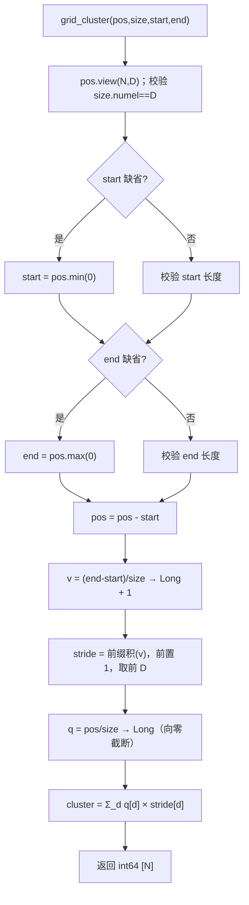
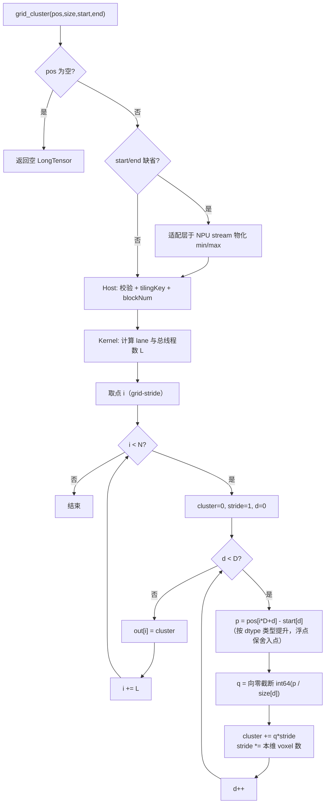

# 【社区任务】grid_cluster 算子设计文档

# 一、需求背景

## 1.1 需求来源

通过社区任务完成开源仓算子贡献的需求，在 Ascend 950 上提供与 `torch_cluster.grid_cluster` 对齐的 NPU 算子。

## 1.2 背景介绍

### 1.2.1 grid_cluster 算子实现优化

grid_cluster 为新增算子：无既有 TBE 实现，算子信息库中无登记条目，无对应 aclnn 接口，不涉及 aclnn 适配。

标杆源码获取路径（含文件名，以任务书指定版本为准）：

| 层 | 文件名 | 用途 |
| --- | --- | --- |
| PyTorch 接口 | `torch_cluster/grid.py` | 接口签名、缺省值语义 |
| CPU 参考 | `csrc/cpu/grid_cpu.cpp` | 逐元素算术语义、bit-wise 真值 |
| CUDA 参考 | `csrc/cuda/grid_cuda.cu` | 逐点并行结构参照 |

### 1.2.2 grid_cluster 算子现状分析

#### 1.2.2.1 标杆算子支持的数据类型和数据格式

| 名称 | 类型 | 形状 | 约束 |
| --- | --- | --- | --- |
| `pos` | float16 / bfloat16 / float32 / int8 / int16 / int32 / uint8 | `[N, D]` | D 维点坐标 |
| `size` | Tensor | `[D]` | 每维 voxel 边长，逐元素 > 0 |
| `start` | Tensor 或 None | `[D]` | 缺省为 `pos.min(0)` |
| `end` | Tensor 或 None | `[D]` | 缺省为 `pos.max(0)` |
| `cluster` | int64 | `[N]` | 线性 voxel ID |

数据格式：一维连续布局；非连续输入由适配层转为连续。

#### 1.2.2.2 标杆算子实现描述

CPU 参考（`grid_cpu.cpp`）为整张量向量化实现，流程与源码逐段一致：

1. `pos` 展平为 `[N, D]`，校验 `size.numel() == D`；
2. `start`/`end` 缺省时取 `pos.min(0)` / `pos.max(0)`，显式给出时校验长度；
3. `pos = pos - start`（广播减）；
4. 每维 voxel 数 `v = (end - start) / size` 转 Long 后 `+1`，经 `cumprod` 前缀积、前置 1、截取前 D，得步长 `stride[0]=1, stride[d]=∏_{k<d}v_k`；
5. `q = pos / size` 转 Long（`true_divide` 后转 Long，即向零截断，非 floor）；
6. `cluster = Σ_d q[d] × stride[d]`，输出 int64 `[N]`。

语义要点：维度 0 为线性化最低位；各元素运算在 int64 域内与顺序无关，只需保证除法截断一致即可 bit-wise 对齐；每点输出只依赖本点坐标与网格参数，无跨点状态，天然确定。

CUDA 参考（`grid_cuda.cu`）为逐点并行：每线程处理一个点，遍历 d 依次累加 `q×stride` 并更新 stride，语义与 CPU 一致。

#### 1.2.2.3 标杆算子实现流程图

# 二、需求分析

## 2.1 外部组件依赖

| 组件 | 用途 |
| --- | --- |
| torch_cluster | 仅生成 CPU 真值、作为接口/语义标杆，不链接其运行时实现 |
| PyTorch | 算子注册、张量与 Dispatch |
| torch_npu | NPU 后端接入 |
| CANN | Ascend C 算子开发、平台信息与 Launch |

## 2.2 内部适配模块

| 模块 | 职责 |
| --- | --- |
| Python 适配层 | 校验、空输入短路、缺省 `start/end` 物化、连续化 |
| 算子注册 | `torch.ops.torch_cluster.grid`（NPU dispatch） |
| Host | 形状/dtype 推导、参数校验、平台信息、Tiling/Launch 配置 |
| Kernel | 按点计算 cluster ID，逐点单写 |

## 2.3 需求模块设计

### 2.3.1 Ascend C 算子原型

除任务书不要求适配的部分外，其余对标杆算子对齐：

- 7 种 `pos` dtype、输出固定 int64 `[N]`；
- 缺省 `start/end`、`true_divide` 后向零转 Long、维度 0 为最低位的线性化顺序与标杆一致；
- 任务书未要求、不纳入首版：batch 参数、`pos` 任意尾维展平、输出连续重编号 / unique 表、反向（输出离散，不可导）。

### 2.3.2 Ascend C 算子相关约束

与标杆相比的缺失/不同能力：不支持任意尾维展平（仅二维 `[N,D]`）；空输入返回空 LongTensor（参考实现对空张量求 min/max 会失败）；仅支持 Ascend 950；不支持 batch。

# 三、需求详细设计

## 3.1 调用方式

采用 PyTorch 框架接入：`grid_cluster(pos, size, start=None, end=None)` → 底层调用 `torch.ops.torch_cluster.grid`。`start/end` 缺省时在适配层于 NPU stream 上物化后再调用。非 ACLNN 直调、非 Kernel 裸调。

## 3.2 需求总体设计

方案：Host 完成默认值物化、校验与 Launch 配置；Kernel 采用纯 SIMT 按点并行、全局 grid-stride 实现。每点独立计算、输出位置单写，不使用原子、无 Workspace、无跨核同步，保证 bit-wise 确定性。

### 3.2.1 Host 侧设计

#### 3.2.1.1 分核策略

查询可用 AIV 核数 `A`（平台接口），不硬编码。每核 SIMT 线程数 `T`，任务块数 `blockNum = clamp(ceil(N/T), 1, A)`；全局 lane 数 `L = blockNum × T`。采用 grid-stride：每个 lane 依次处理点 `i = lane, lane+L, ...`，每 lane 约处理 `ceil(N/L)` 点；线程循环始终检查 `i < N`，尾部无需分支处理。

#### 3.2.1.2 数据分块和内存优化策略

首版不进行 UB 分块、不显式搬入 LocalMemory：

- 每点仅 D 次标量除法和 int64 乘加，中间量存于寄存器，单核驻留需求远小于 UB 容量；
- 辅助张量 `size/start/end` 各 ≤ D 元素（性能必测 D ≤ 64），为全核共享的小段 GM 热点数据，无需分块搬运；
- 不搬 UB 即不存在 DataCopy 对齐、UB 尾块与 double buffer 问题，LocalMemory 占用为 0，Workspace 为 0；
- 已知代价：宽 D 下逐点按列标量读 `pos` 有效带宽下降，若真机确认成为瓶颈，按性能预案升级为连续多点 + SIMD/UB 分块路径。

Host 不预计算依赖 `size/start/end` 数值的步长（避免设备到 Host 同步），数值均以输入张量传入 Kernel。

#### 3.2.1.3 tilingKey 规划策略

| tilingKey | 设置条件 |
| --- | --- |
| 计算语义路径（浮点/整数） | 依据 `pos` 为浮点或整型 |
| dtype 分支 | 每种支持 dtype 及其辅助输入 dtype 组合，逐表达式复现类型提升，可审计 |
| D | 不作为 tilingKey，作为动态循环上界 |

`start/end` 是否缺省不进入 Kernel（均已物化），不设 key。TilingData 携带 `N`、`D`、`totalThreadCount`、`dtypeKey`、`semanticVersion`。

### 3.2.2 Kernel 侧设计

#### 3.2.2.1 kernel 侧实现描述

1. 由核号/线程号计算全局 lane 与总线程数 `L`；
2. grid-stride 选取待处理点 `i`；
3. 初始化 `cluster = 0`、`stride = 1`；
4. 遍历 `d = 0..D-1`：按 dtype 分支复现 `(pos[i,d]-start[d])/size[d]` 的类型提升与中间舍入（浮点保留参考除法舍入点），结果向零截断转 int64 得 `q`，`cluster += q × stride`，并 `stride *= (end[d]-start[d])/size[d] 向零转 Long + 1`；半精度若内部升精度计算须在转 int64 前恢复舍入点；
5. 将 int64 `cluster` 单写至 `out[i]`；
6. 处理下一 grid-stride 点直至 `i >= N`。

仅使用私有寄存器中间量，每点唯一归属一个线程，无竞争、无 barrier，结果确定。若真机 profiling 确认宽 D 为瓶颈，依次启用：D=3 专用展开、同一线程连续多点、SIMD + UB 分块、dtype 专用转换序列；任一改法不改变截断、舍入点与 int64 线性化顺序。

#### 3.2.2.2 Ascend C 实现流程图

#### 3.2.2.3 Ascend C 实现流程图与标杆算子流程图的差异点及原因

| 差异点 | 标杆 | Ascend C | 原因 |
| --- | --- | --- | --- |
| 并行模型 | CPU 整张量向量化；CUDA 每线程一点 | SIMT 每线程一点、grid-stride | 元素运算在 int64 域内与顺序无关，语义 bit-wise 一致 |
| 空输入 | 对空张量 min/max 失败 | 适配层短路返回空结果 | 规避参考缺陷，符合验收口径 |
| 默认 start/end 物化 | 函数内同步读取 | 适配层在 NPU stream 计算 | 避免 Host 读设备数据 |
| 参考校验缺陷 | `end` 分支误用 `start` 做校验 | 不复现 | 参考实现笔误 |
| 类型提升 | PyTorch 隐式提升 | Kernel 显式分支复现 | 保证可审计、避免 reinterpret |
| 半精度舍入 | CPU 保留 fp16 舍入 | 内部升精度时转 int64 前恢复 | 保证边界处 bit-wise 一致 |
| 非连续输入 | CUDA 层 contiguous | 适配层连续化 | 接口对齐 |
| 中间张量 | CPU 产生 N×D 中间量 | 仅寄存器中间量 | NPU 逐点方案不物化中间张量，语义不变 |

## 3.3 支持硬件

Ascend 950 系列（DAV_3510，算子目录 `arch35`），与任务书要求一致。

## 3.4 算子约束限制

1. `pos` 为二维 `[N, D]`，`D >= 1`，N 可为 0；
2. `size/start/end` 为 `[D]`，非空张量与 `pos` 同设备，dtype 组合遵循 PyTorch 类型提升；
3. `size[d] > 0`；
4. 线性 voxel ID 及中间前缀乘积须在 int64 可表示范围内；
5. 不支持 batch；不支持输出连续重编号 / unique 表；
6. 显式边界外点不 clamp，可能得到负 ID（与 CPU 一致），"非负"以默认边界为有效域；
7. NaN、Inf、`start > end`、溢出不属于正常输入域。

# 四、特性交叉分析

| 交叉点 | 分析结论 |
| --- | --- |
| 自动微分 | 输出为离散 int64，不可导，无反向需求 |
| aclnn / 融合编译 | 无 aclnn 单算子接口，走 `torch.ops` 注册，无接口冲突 |
| 去重/连续重编号类功能 | 不耦合，本算子不保证 cluster 编号连续 |
| 默认边界归约时序 | `min/max` 与主 Kernel 同 stream，无跨设备拷贝 |
| dtype 分级 | L2（bf16/int8/uint8）仅功能验收，与性能路径按 tilingKey 隔离 |
| 输入域 | 空输入短路；D 为动态，不把性能表范围误作接口上限 |

结论：无必须新增的平台能力，交叉风险集中在浮点舍入与缺省边界时序，已在约束与测试中锁定。

# 五、可维可测分析

## 5.1 精度标准/性能标准

| 项 | 要求 |
| --- | --- |
| 精度标准 | 所有支持 dtype 的 int64 cluster ID 与 CPU `torch_cluster.grid_cluster` 逐元素 bit-wise 一致（不用 atol/rtol）；相同输入重复执行一致 |
| 性能标准 | 任务书性能表中所有用例耗时 ≤ 标杆耗时的 1/0.45，即 `speed ratio = baseline / NPU >= 0.45` |

测试方法：CPU `torch_cluster.grid_cluster` 生成真值，NPU 结果经 PyTorch 层 `grid_cluster()` 获取，`torch.equal` 比对形状/dtype/全元素；性能测试使用 Ascend 950 真机与任务书指定软件栈，预热后多次重复取中位数，标杆与待测采用相同输入、stream、同步与统计方法。

## 5.2 兼容性分析

| 项目 | 设计结论 |
| --- | --- |
| torch_cluster | 对齐其 Python API、默认边界与 CPU 算术语义；不复现参考校验缺陷 |
| PyTorch | 算子注册、TorchScript、非连续输入与 NPU dispatch 需验证 |
| torch_npu | 使用与任务书指定软件栈配套的版本 |
| CANN | 目标为任务书指定版本；纯 SIMT API 可用性须在选定发布版复核 |
| 硬件 | 仅承诺 Ascend 950 / DAV_3510 / arch35 |

兼容性分析结论与本文算子设计、优化手段及评审 checklist 相吻合。
