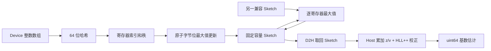
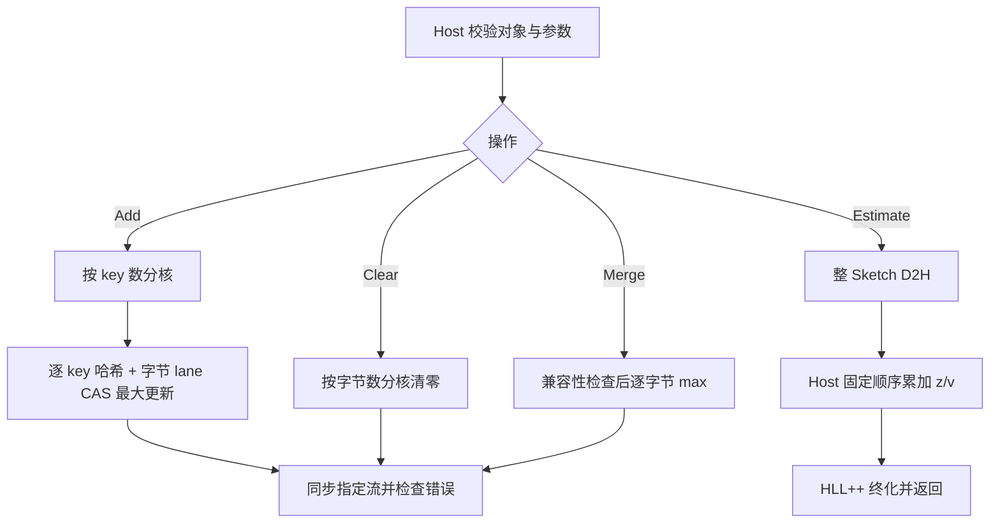

# HyperLogLog 容器及算子设计文档（Atlas 950）

| 项目 | 内容 |
| --- | --- |
| 设计对象 | `aclco::HyperLogLog` 基数估算容器及 Create、Destroy、Clear、Add、Merge、Estimate |
| 工程模式 | ops-collections 纯头文件容器；C++ Host 管理 + Ascend C AIV/SIMT Kernel |
| 目标平台 | Atlas 950 系列（Ascend 950PR，SIMT-VF，`dav-3510` 架构） |
| 输入类型 | I32（`int32_t`）、I64（`int64_t`） |
| 设计依据 | 《hyperloglog容器开发(950)任务书》及随附功能、性能测试源码 |
| 代码基线 | ops-collections（`9d12996`） |
| 文档性质 | 新增容器的实现设计与验收方法 |

# 1. 需求背景

## 1.1 需求来源

本任务要求参考 NVIDIA cuCollections 的 `cuco::hyperloglog`，在昇腾 NPU（Atlas 950，SIMT-VF 编程模型）上提供固定容量、可合并、结果可重复的近似去重计数容器。设计遵循任务书指定的[算子设计模板](https://gitcode.com/cann/cann-ops-competitions/blob/master/04_tasks/01_community-task-2026/resources/design_template.md)，保留需求背景、需求分析、详细设计、可维可测分析四部分，并针对容器工程补充生命周期、接口、内存与测试集成设计。

任务书和附带测试确定验收契约；cuCollections 用于解释算法及接口语义；本地仓库（ops-collections）用于确定工程组织、公共组件和构建方式。代码基线尚不包含 HyperLogLog 头文件、实现目录及测试构建入口，本文定义这些新增模块的目标行为。

## 1.2 背景介绍

HyperLogLog（HLL）以固定大小的 Sketch 估计输入集合的去重基数。每个输入经均匀哈希后，使用一部分比特选择寄存器，其余比特计算前导零长度；寄存器保存已观察到的最大秩。Sketch 不保存原始 key，空间由精度决定，不随累计输入数量增长。

本容器适用于大批量整数去重规模估算、分片统计汇总和流式累计统计。Add 对输入顺序、重复次数不敏感；Merge 对两个兼容 Sketch 做逐寄存器最大值运算，表达集合并集。Estimate 返回近似值；本容器不提供成员查询、精确去重结果、删除或交集计数能力，这些不属于本次六接口验收范围。

## 1.3 参考实现与工程现状

参考对象为 [`cuco::hyperloglog`](https://github.com/NVIDIA/cuCollections/blob/dev/include/cuco/hyperloglog.cuh)。它将 owning 容器、非 owning 引用、哈希更新和 HLL++ 估算分层实现：构造配置在前，add 使用输入迭代器范围，merge 接收另一容器，estimate 返回主机侧标量。目标接口将迭代器范围替换为 Device 首地址和元素数量（`void* + Extent<std::size_t>`），保留参数相对顺序与语义。

两者的物理布局不能直接等同：所核对的 cuCollections 实现使用 32 位寄存器，而任务配套 `hll_test_common.h::RegisterCount` 明确采用每寄存器 1 字节。本设计以任务测试为准，定义 `m = SketchSizeKB × 1024`，`p = log2(m)`。对标寄存器状态时必须使用相同 `p`、`m`、hash 和 seed；相同 KB 标签不代表两端寄存器数相同，性能比较严格使用任务书给定的 KB 标签与基线。

工程上复用的仓库既有组件如下。

| 已有模块 | 复用或参照内容 |
| --- | --- |
| `include/bloom_filter.h`、`include/bloom_filter_ref.h` | owning/ref 分离、禁用复制、移动所有权、同步流接口 |
| `include/detail/bloom_filter/kernels.h` | AIV 入口、`VF_CALL`、SIMT 线程划分、地址空间限定 |
| `include/extent.h`、`include/utility/allocator.h` | 元素数量、Device 内存分配与释放 |
| `include/macros.h` | `COLLECTION_AIV_GLOBAL`、`COLLECTION_SIMT_VF`、`COLLECTION_SIMT_DEVICE` 等声明 |
| `tests/CMakeLists.txt`、`scripts/build.sh` | 单功能源文件对应独立测试程序；构建/运行入口 |
| `tests/performance/performance_test_framework.h` | 性能测试注册框架（`REGISTER_PERFORMANCE_TEST`） |



# 2. 需求分析

## 2.1 需求描述与拆解

| 编号 | 需求 | 设计约束与验收方式 |
| --- | --- | --- |
| R01 | 三种构造方式 | 按 SketchSizeKB、标准差、精度构造，统一换算为 `p` 和 `m` |
| R02 | 生命周期 | Create 返回有效对象；析构、移动构造和移动赋值转移所有权；禁止复制所有权 |
| R03 | Clear | 全部寄存器归零；重复 Clear 幂等；清空后可重用 |
| R04 | Add | I32/I64 Device 数组；空输入、重复输入、分批输入及尾块均正确 |
| R05 | Merge | 同 Key 类型、精度、布局、Device 兼容；源容器不变 |
| R06 | Estimate | 返回 `uint64_t`，空 Sketch 返回 0，估算不修改 Sketch |
| R07 | 可重复 | 相同 key 集合与配置得到相同寄存器及估算结果；重复 Estimate 一致 |
| R08 | 精度 | 非空集合满足 `abs(estimate − N) / N ≤ 3 × 1.04 / sqrt(m)` |
| R09 | 性能 | 全部 72 个参数组合逐项比较，`T_actual ≤ T_baseline / 0.4` |
| R10 | 内存 | 不复制完整 Device 输入；容器的 Sketch 与临时空间不随输入规模线性增长 |
| R11 | 集成 | 新增指定头文件、detail 目录、功能/性能测试目录及 README 入口 |
| R12 | 验证范围 | 1280 个功能执行组合、72 个性能组合及必要边界补充用例 |

## 2.2 输入输出与参数约束

| 参数 | 类型及位置 | 形状/范围 | 行为与校验 |
| --- | --- | --- | --- |
| `hll` | Host C++ 对象 | 已初始化且拥有 Device Sketch | 对象表达任务书中的句柄；不引入额外 C handle |
| `keys` | Device `void*`，按 `Key` 读取 | ND 连续数组 `[keyNum]` | `keyNum > 0` 时非空；`Key` 仅支持 `int32_t`/`int64_t`（static_assert） |
| `keyNum` | `Extent<std::size_t>` | 非负整数 | 0 时允许 `keys == nullptr` 直接返回；非零数量配空指针抛异常 |
| `sketchSizeKb` | Host `uint32_t` | 8、16、32、64、128、256 | 其他值抛 `invalid_argument`，不静默舍入 |
| `precision` | Host `uint32_t` | 13～18 | `m = 2^precision`；其余值抛异常 |
| `standardDeviation` | Host `double` | 有限正数且能在支持容量内满足目标 | 按 3.1.1 换算；非正值或超范围抛异常 |
| `other` | 同模板类型容器的只读引用 | 与目标容器兼容 | 不兼容（stub Sketch 为空或精度不同）在 Kernel 启动前抛异常 |
| `stream` | `aclrtStream` | 当前设备/上下文上的有效流 | 缺省为 ACL 默认流语义；操作在指定流上提交并同步 |
| `estimate` | Host `uint64_t` 返回值 | 非负整数 | Estimate 完成所需 Device 拷贝及 D2H、同步后返回 |

`Key` 类型通过模板限定，`void*` 本身不携带运行时 dtype。Host 可检查空指针，但不能仅凭指针推断外部分配的真实长度与数据类型；调用方必须提供有效 Device 缓冲区。可由 ACL 检测的地址或流错误通过返回码或同步错误传播。

## 2.3 容量、精度与标准差

一个逻辑寄存器占 8 位（1 字节）；Sketch 占用 `m` 字节，恰好对应任务书 `SketchSizeKB` 的容量定义。

| SketchSizeKB | 寄存器数 m | 精度 p | 理论标准差 | 三倍标准差验收阈值 |
| ---: | ---: | ---: | ---: | ---: |
| 8 | 8192 | 13 | 1.149049% | 3.447146% |
| 16 | 16384 | 14 | 0.812500% | 2.437500% |
| 32 | 32768 | 15 | 0.574524% | 1.723573% |
| 64 | 65536 | 16 | 0.406250% | 1.218750% |
| 128 | 131072 | 17 | 0.287262% | 0.861786% |
| 256 | 262144 | 18 | 0.203125% | 0.609375% |

此处 `1.04 / sqrt(m)` 是标准误差模型，三倍标准误差是任务规定的样本验收阈值，并非对任意整数集合的确定性误差上界。

## 2.4 对外接口设计

以下为实际新增接口的声明（`hyperloglog.h`），与配套测试直接对应；容器为 move-only，所有权转移通过移动构造/移动赋值完成，析构等价于 Destroy。

```cpp
namespace aclco {

template <class Key, class Allocator = aclco::DefaultAllocator<std::uint8_t>>
class HyperLogLog {
public:
    using KeyType = Key;
    using RegisterType = std::uint8_t;
    using SizeType = std::uint64_t;
    using RefType = HyperLogLogRef<KeyType>;

    static constexpr std::uint32_t minPrecision = 13;  ///< 8 KB sketch
    static constexpr std::uint32_t maxPrecision = 18;  ///< 256 KB sketch
    static constexpr std::uint32_t minSketchSizeKb = 8;
    static constexpr std::uint32_t maxSketchSizeKb = 256;

    HyperLogLog(HyperLogLog const&) = delete;
    HyperLogLog& operator=(HyperLogLog const&) = delete;
    HyperLogLog(HyperLogLog&& other) noexcept;
    HyperLogLog& operator=(HyperLogLog&& other) noexcept;
    ~HyperLogLog();

    static HyperLogLog CreateWithSketchSizeKB(std::uint32_t sketchSizeKb, aclrtStream stream = nullptr);
    static HyperLogLog CreateWithStandardDeviation(double standardDeviation, aclrtStream stream = nullptr);
    static HyperLogLog CreateWithPrecision(std::uint32_t precision, aclrtStream stream = nullptr);

    void Clear(aclrtStream stream = nullptr);
    void Add(void* keys, Extent<std::size_t> keyNum, aclrtStream stream = nullptr);
    void Merge(HyperLogLog const& other, aclrtStream stream = nullptr);
    std::uint64_t Estimate(aclrtStream stream = nullptr) const;

    std::uint32_t SketchSizeKB() const noexcept;
    std::uint32_t Precision() const noexcept;
    std::uint64_t NumRegisters() const noexcept;
    std::uint8_t* Data() noexcept;
    std::uint8_t const* Data() const noexcept;
};

}
```

| 目标接口 | 参考接口含义 | 同步与状态约定 |
| --- | --- | --- |
| 三个 `CreateWith…` 工厂 | 三种配置构造（SketchSizeKB / StandardDeviation / Precision） | 分配并清空初始化，同步成功后返回有效对象；配置非法抛异常 |
| 析构 / 移动 | 释放容器拥有的资源；转移 Sketch 与精度 | 析构不抛异常；重复释放安全；moved-from 对象上调用 Add/Merge/Estimate 抛 `logic_error` |
| `Clear(stream)` | `clear(stream)` | 清零后同步指定流 |
| `Add(keys, keyNum, stream)` | `add(first, last, stream)` | 输入首地址、范围、流的相对顺序不变；完成更新后同步 |
| `Merge(other, stream)` | `merge(other, stream)` | 源在前、流在后；完成合并后同步；不兼容抛异常 |
| `Estimate(stream)` | `estimate(stream)` | 返回 Host 标量；等待 D2H 与同步完成；不修改 Sketch |
| `SketchSizeKB / Precision / NumRegisters / Data` | 容量与状态查询 | `Data()` 暴露 Device 地址，供 ref/外部 Kernel 使用，生命周期由调用方约束 |

六类公开操作采用同步语义：操作在指定流上提交，接口末尾调用 `aclrtSynchronizeStream` 并检查错误。该同步边界也与所附性能测试的计时方式一致。

## 2.5 外部依赖与支持硬件

| 组件 | 要求或用途 |
| --- | --- |
| Atlas 950 | AIV、SIMT-VF、GM/UB、32 位原子操作 |
| CANN | 9.1.0（`dav-3510` 架构）；实际安装版本须提供所用 SIMT API |
| 编译器 | Bisheng（clang 15.0.5，`asc`）；架构参数与安装包匹配 |
| C++ / CMake | C++17；仓库脚本 |
| Catch2 | ≥ 3.5.4；仓库脚本默认获取 v3.5.4 |
| ACL Runtime | 内存分配、执行流、Kernel 调用、D2H 与同步 |
| cuCollections | 算法与 API 参考，不作为 NPU 运行时依赖 |

不默认支持 A2/A3；后续产品只有在具备所需 SIMT 和原子能力并完成验证后才纳入支持范围。

# 3. 详细设计

## 3.1 算子分析

### 3.1.1 配置归一化

按容量构造时，先检查离散合法值（`{8,16,32,64,128,256}`），再计算 `m = sketchSizeKb × 1024`、`p = log2(m)`。按精度构造时，先检查 `13 ≤ p ≤ 18`，再计算 `m = 1ULL << p`。所有移位均在校验后执行。

按标准差 `sigma` 构造时，选择支持范围中满足 `1.04 / sqrt(2^p) ≤ sigma` 的最小 `p`：

```text
p_required = ceil(2 × log2(1.04 / sigma))
p = max(13, min(18, p_required))
若 sigma 非有限正数，或超出支持范围，拒绝构造。
```

配套标准差 `0.0115 / 0.0082 / 0.0058 / 0.0041 / 0.0029 / 0.0021` 分别对应 8/16/32/64/128/256 KB。换算采用任务书与 cuCollections 共用的 `1.04` 标准误差模型。

### 3.1.2 哈希、索引和秩

默认哈希为容器的 `HllHash`：murmur 风格 fmix64 雪崩混合（乘—异或—乘—异或），I32 按 4 字节位模式、I64 按 8 字节位模式参与哈希，不将 I32 扩展为 I64 再哈希；负数按无符号位模式参与。设备内核与 `HyperLogLogRef` 共用同一实现，保证 Device/引用路径逐位一致、估算可重复。哈希为自选（官方测试只验相对误差与自洽），要求分布均匀且设备可编译。

对每个输入 `x`，设 `h = HllHash(x)` 为 64 位无符号整数：

```text
j   = h >> (64 - p)
w   = (h << p) | (1ULL << (p - 1))
rho = clz64(w) + 1
R[j] = max(R[j], rho)
```

最高 `p` 位用于索引，其余位用于秩；哨兵位保证 `w != 0`，避免对 0 执行未定义的前导零计数。`0 ≤ j < m`，`1 ≤ rho ≤ 65 − p`（最大 52），8 位寄存器足以无损保存，`0` 专门表示未命中。

### 3.1.3 Sketch 合并与代数性质

```text
R_dst[j] = max(R_dst[j], R_src[j]),  j = 0 ... m-1
```

逐寄存器最大值满足交换律、结合律和幂等性，因此重复 Add、分批 Add、改变顺序、对集合分片后 Merge 都得到相同寄存器状态；`Merge(hll, hll)` 可直接返回。兼容条件包括 Key 类型、`p/m`、寄存器布局版本、Hash 语义、Device 与 context。禁止将不同精度的 Sketch 直接拼接、截断或逐字节合并，也不把 Merge 定义为两个估计值相加。

### 3.1.4 确定性估算与 HLL++ 校正

Estimate 将整份 Sketch（≤ 256 KB）一次性 `aclrtMemcpyAsync(DEVICE_TO_HOST)` 取回，Host 以固定顺序累加，再做 HLL++ 终化：

```text
V = 零寄存器个数
Z = Σ 2^(-R[j])                                // Host double 精度
alpha = 0.7213 / (1 + 1.079 / m)               // m ≥ 8192，用渐近常数
E_raw = alpha × m × m / Z
```

终化与 cuCollections 的 [finalizer](https://github.com/NVIDIA/cuCollections/blob/dev/include/cuco/detail/hyperloglog/finalizer.cuh) 对齐：

1. `V == m` 时直接返回 0。
2. `V > 0` 时计算 `H = m × log(m / V)`；当 `E_raw ≤ 2.5m` 时使用线性计数 `H`。
3. 其余情况：`E_raw < 5m` 时采用该精度经验偏差表的 6 点近邻平均偏差作修正，达到 `5m` 后使用原始估计。
4. 对非负结果执行四舍五入后转 `uint64_t`。

偏差/校正表仅覆盖 `p = 13…18`，从参考文献转写为 Host `constexpr` 数据，表索引与求和顺序固定；纠偏阈值与插值点数与参考实现一致。估算只读取 Sketch，不修改状态，固定顺序累加保证重复调用逐次一致。

## 3.2 算子实现

### 3.2.1 模块与文件组织

```text
ops-collections/
├── include/
│   ├── hyperloglog.h               # 对外容器的接口声明
│   ├── hyperloglog_ref.h           # Device 侧非拥有引用（逐元素 Add 语义）
│   └── detail/hyperloglog/
│       ├── hyperloglog.inl         # 容器方法实现、内核启动封装、流同步
│       ├── kernels.h               # SIMT 内核与 AIV 入口
│       ├── finalizer.h             # HLL++ 终化（host）
│       └── finalizer_tables.h      # p=13..18 的偏差修正常量
├── tests/
│   ├── common/hll_test_common.h    # 官方用例公共头
│   ├── hyperloglog/                # 六类功能测试
│   └── performance/hyperloglog/    # 六个 perf_*.cpp
└── docs/
    └── hyperloglog_API文档和使用示例.md
```

`hyperloglog.h` 声明公共接口并包含 `.inl`；`HyperLogLogRef` 只携带 GM 指针、`p/m` 与哈希，不拥有内存、不分配、不同步、不释放，逐元素 Add 复用与容器共享的打包原子更新。Device ref 的寿命不得超过所属容器，外部 Kernel 对 ref 的访问必须由调用方建立流依赖并在 Destroy 前完成。

### 3.2.2 Host 侧设计

**存储与所有权。** 容器持有 `std::uint8_t* sketch_`（`m` 字节）、`precision_` 与分配器。创建时按 `NumRegisters()` 字节分配并立即 Clear 初始化；任一步失败都释放已取得资源，不返回半初始化对象。移动操作转移 Sketch 与精度并将源置零；移动赋值先释放目标已有资源。对 moved-from 对象，Clear/Add/Merge/Estimate 报 `logic_error`，即使 Add 输入为空也不能绕过对象有效性检查。析构与释放共用幂等逻辑，不调用 `aclrtFinalize`、不重置设备、不销毁传入流。

**执行流。** Clear/Add/Merge/Estimate 接收并使用调用方指定流，接口末尾统一 `aclrtSynchronizeStream` 并检查返回值，失败抛含操作名与错误码的 `runtime_error`。同一对象上的操作要求调用方串行；外部 ref 访问与外部写入的输入数据由调用方显式同步。

**参数校验与错误分类。** 非法配置（容量/精度/标准差）、非空数量配空地址、Merge 不兼容使用 `invalid_argument`；对象无资源使用 `logic_error`；必要分配失败使用 `bad_alloc`；ACL 失败使用 `runtime_error`。

**核数与任务切分。** 查询实际 `GetCoreNumAiv()` 作为核数上界，按工作量自适应启动，不硬编码平台核数：

```text
blocks = min(availableAivCores, max(1, ceil(workItems / 1024)))
i      = blockIndex × 1024 + threadIndex        // 64 位索引
stride = blocks × 1024
```

Clear/Merge 以寄存器（字节）数为工作量，Add 以 key 数为工作量。SIMT 每块 1024 线程（`HLL_THREAD_NUM`）。不引入 Tensor OpDef、ACLNN 注册、动态二进制配置或独立算子工程；tiling 是容器内的网格 stride 任务切分。

### 3.2.3 Kernel 侧设计

Kernel 采用 `COLLECTION_AIV_GLOBAL` 入口，通过 `AscendC::Simt::VF_CALL` 调用 SIMT-VF 函数；GM 指针保留 `__gm__` 地址空间限定，先引入 `kernel_operator.h` 再引入 SIMT 依赖，与既有容器保持一致。

| Kernel | 职责 | 工作划分 |
| --- | --- | --- |
| `ClearSimt` | Sketch 清零 | 网格 stride 逐字节写零 |
| `AddDirectSimt<Key>` | 逐 key 哈希 + 寄存路最大更新 | 网格 stride 扫 key；先读后 CAS 字节 lane 最大 |
| `MergeSimt` | 逐寄存器最大合并 | 网格 stride；字节条件写，无原子 |

**Clear。** 清零范围严格为实际分配的 `m` 字节。清空和 Add/Merge 不可并发访问同一 Sketch；重复 Clear 幂等。

**Add 的字节 lane 原子最大更新。** 硬件 SIMT 原子不提供 `uint8` 字节级原子最大，将 4 个寄存路视作一个 `uint32_t` 存储字，通过 CAS 循环只改写目标字节、其余字节原样保留：

```text
word = sketch_u32[reg >> 2];  shift = (reg & 3) * 8
loop:
    cur = (word >> shift) & 0xFF
    if cur >= rank: return                       // 已饱和，零原子流量
    updated = (word & ~(0xFF << shift)) | (rank << shift)
    prev = asc_atomic_cas(word_ptr, word, updated)
    if prev == word: return
    word = prev
```

不能对打包 `uint32` 直接做整数 max：较高字节可能掩盖另一个较低字节的独立增长；也不能用普通 byte store 覆盖并发更新。读取旧字是普通 GM 读（cache 语义），由于 Add 期间寄存器只增不减，读到较旧的小值只会增加 CAS 重试次数，不会改变最终结果；该提前退出不得跨 Clear、Kernel 边界或工作空间复用使用陈旧状态。

Add 直接更新全局 Sketch，不复制输入、不引入与输入规模线性相关的 Device 中间缓冲；每个 key 至少一次哈希 + 一次寄存器级读改写，这是正确性必需的更新量。

**Merge。** 逐字节网格 stride：仅当源字节大于目标字节时写回，因此每个字节由唯一线程处理，无原子需求，源只读、目标独占。即使两个 Sketch 的估计值相同，也逐寄存器比较，不以估计值相等推断 Sketch 相等。

**Estimate。** 不启动设备归约内核：整份 Sketch（≤ 256 KB）一次 D2H 拷回 Host，Host 侧 `ldexp(1.0, -R[j])` 累加 `z` 与零寄存器数 `v`，再执行 3.1.4 的 HLL++ 终化。选择该路径的原因是 Sketch 至多 256 KB，单次 D2H 比启动一个设备归约内核更便宜（后者的小尺寸下核启动延迟反而占主导）；Host double 终化与 cuCollections host estimate 同构。Estimate 每个字节固定顺序遍历，可重复、不修改状态、不保留历史输入。



### 3.2.4 内存与复杂度

| 资源 | 大小 | 生命周期 |
| --- | --- | --- |
| 持久 Sketch | `m` 字节（8～256 KB） | Create 至析构 |
| Estimate Host 缓冲 | `m` 字节（≤ 256 KB） | 单次 Estimate 内 |
| 输入 | `keyNum × sizeof(Key)` 字节，由调用方拥有 | 同步 Add 返回前有效 |
| 最终输出 | 8 字节 Host 标量 | 由调用方持有 |

除 Sketch 外容器无其他持久 Device 工作空间；Estimate 的 Host 缓冲随调用分配，与输入规模无关。Clear/Merge 时间复杂度 `O(m)`；Add 为 `O(n)` 次哈希加原子重试；Estimate 为 `O(m)` 的 D2H + Host 扫描。原子冲突影响实际耗时，不能仅凭大 O 判断达标。

1 亿输入的 I32、I64 原始 Device 数据分别约 400 MB、800 MB（十进制），属调用方输入空间，不计作容器额外拷贝（R10）。

## 3.3 约束与兼容性边界

1. 固定容量仅支持六档 Sketch（8～256 KB），输入为连续一维 I32/I64，不支持广播、非连续 stride 或浮点类型。
2. Merge 不支持跨 Key 类型、跨精度、跨哈希语义、跨 Device 或未知不兼容策略；不隐式迁移 Device 数据。
3. 同一对象上的操作必须串行（调用方负责）；外部 ref 的并发访问、输入写入和生命周期由调用方显式同步。默认不支持 Clear 与 Add 并发。
4. 不导出与 cuCollections 字节兼容的 Sketch 序列化格式；相同 `p/m` 可逐寄存器比较逻辑状态。
5. 估算保持概率算法语义，不承诺精确计数。
6. 目标 Kernel 的编译与设备运行须在安装的 CANN 与 Atlas 950 上验证，本文不携带未经执行的运行声明（见第 4 章证据要求）。

# 4. 可维可测分析

## 4.1 功能与精度标准

测试采用三层判定：独立 Host golden 计算每个 key 的 hash/索引/rank 与最终寄存器；Host 精确集合提供真实基数 `N`；NPU 容器输出与 golden/真实基数分别比较。Host golden 与设备共享 `HllHash`/秩规则并逐位核对，避免同源实现错误被自洽掩盖。

| 判定对象 | 标准 |
| --- | --- |
| Hash / 索引 / rank | 与独立 golden 逐元素一致 |
| Clear | 每个寄存器严格为 0，Estimate 严格为 0 |
| Add / Merge | 最终每个寄存器与 golden 一致；分批、重排、重复输入结果相同 |
| Estimate 空集合 | 必须为 0，不计算相对误差 |
| Estimate 非空集合 | 误差不超过 `3 × 1.04 / sqrt(m)`；逐 case 判断 |
| 可重复性 | 相同数据重复 Estimate 的返回值相等；两独立容器结果一致 |
| 错误处理 | 非法参数在所声明边界内被拒绝，无资源泄漏、重复释放或越界写入 |

## 4.2 配套功能测试矩阵

配套用例按 dtype、`GENERATE` 参数组合与 `SECTION` 分支展开后的数量如下。Catch2 顶层测试名数与这些执行组合数是不同统计量，报告须分别记录。

| 接口 | 主要覆盖内容 | 展开数量 |
| --- | --- | ---: |
| Create | 两 dtype × 六容量/六标准差/六 precision 与非法配置分支 | 38 |
| Destroy | 两 dtype × 六容量 × 反复构造析构/移动构造 | 24 |
| Clear | 两 dtype × 六容量 × 五种输入规模 × 三个分支 | 180 |
| Add | 两 dtype × 六容量 × 十二规模 × 五条展开路径，加六个大规模用例 | 726 |
| Merge | 两 dtype × 六容量 × 四种规模 × 四个分支 | 192 |
| Estimate | 两 dtype × 六容量 × 十个基数 | 120 |
| 合计 | 六个功能测试源文件 | **1280** |

补充的独立用例（不以补充数量替代 1280 组合）：I32/I64 的极值、0、负数和热点 key；构造边界与非法配置；同 `uint32` 内多字节并发更新、同一寄存路高冲突、rank 上界；分批 == 一次性 Add、自合并、Merge 源不变；移动赋值、moved-from 拒绝、显式清空后复用；跨流顺序与同步错误传播。固定随机 seed 保证验收数据可复现。

## 4.3 性能标准与计时边界

每行以吞吐性能比 `T_baseline / T_actual` 判断，要求至少 0.4；等价时延上限为 `2.5 × T_baseline`。实际时延取接口完成时间（含同步），不使用单次 Kernel 最小值代替接口时间。

任务附带的六个 `perf_*.cpp` 使用 Host `high_resolution_clock` 计时，将同一微秒数填入 `TestResult` 的 CPU 与 Device 字段，因此以 **Mean CPU Time** 为比较数据；微秒除以 1000 后方与任务书毫秒基线比较。逐行对照并记录离散程度，不达标的行按任务书要求提供具体原因，不报告笼统的整体均值。

| 操作 | 计时包含 | 组合数 |
| --- | --- | ---: |
| Create | CreateWithSketchSizeKB、分配、初始化及同步 | 12 |
| Destroy | 析构与释放 | 12 |
| Clear | 同步 Clear | 12 |
| Add | 1 亿 key 的同步 Add | 12 |
| Merge | 同步 Merge | 12 |
| Estimate | D2H、同步、Host 校正及返回 | 12 |
| 合计 | 两 dtype × 六容量 × 六操作 | **72** |

Add 为 UNIFORM（`1..100000000` 唯一整数）、Multiplicity=1；实现必须处理实际 key，不能依赖分布标签、数值或固定指针的捷径。

## 4.4 构建与运行集成

在 `tests/CMakeLists.txt` 的功能/性能源列表中新增 hyperloglog 目录（GLOB 自动纳入），放置 `tests/common/hll_test_common.h`，沿用 `COLLECTION` INTERFACE、Catch2 及现有 ACL 链接配置，不新建库目标或仓库根目录独立算子目录。生成六个功能目标与六个 `hyperloglog_perf_*` 性能目标。

构建与运行（目标 Linux/NPU 环境，CANN 已初始化）：

```bash
bash scripts/build.sh -b --ascend-home "${ASCEND_HOME_PATH}"   # 构建功能测试
bash scripts/build.sh -r --test-name hyperloglog                # 运行功能测试
bash scripts/build.sh -p --ascend-home "${ASCEND_HOME_PATH}"   # 构建性能测试
bash scripts/build.sh -rp                                      # 运行性能测试
```

日志检查退出码、断言失败、`No tests ran` 等；性能是否达标须按 4.3 逐行计算，性能框架不会自动证明满足任务阈值。

## 4.5 可维护性与风险控制

| 重点 | 设计措施 | 验证证据 |
| --- | --- | --- |
| 8 位布局与原子并发 | `uint32` 对齐 + 字节 lane CAS + 先读后写 | 冲突测试与寄存器 golden |
| 估算重复性 | D2H 后固定顺序累加、固定偏差表 | 相同状态多次 Estimate 一致 |
| 小基数与阈值 | 线性计数、精度对应偏差、round 规则 | 精度矩阵与边界样本 |
| 大输入争用 | 先读后 CAS 降低饱和寄存器原子流量、核数自适应 | 性能逐行数据 |
| 生命周期 | RAII、move-only、清空幂等 | 移动/重复释放/异常资源测试 |
| 编译与地址空间 | 复用 AIV 宏与 VF_CALL、显式 `__gm__` | 目标 CANN 编译及 NPU 功能日志 |
| 工程回归 | 独立新增头文件与测试注册，复用通用基础设施 | hyperloglog 专项与相关回归 |

哈希、rank 规则、配置归一化分别封装，避免 Host/Device/测试使用不同的容量含义；所有路径共用同一哈希与逻辑寄存器定义。

## 4.6 验收材料与完成判定

完整验收需提供：本设计文档、指定目录的容器与测试源码、API 使用示例与 README、1280 个功能组合的完整证据、72 个性能组合的逐行对照、运行环境与测试日志、待验收代码地址。设计文档评审与源码 PR 按任务书分别提交到相应仓库。

本设计文档定义实现契约与验收方法；编译、精度、性能与资源回收以目标设备上的实际测试（功能/性能日志，按任务书要求归入自测报告）为准。

# 附录 A：完整性能基线与时延上限

单位为毫秒。上限使用十进制定点计算 `baseline ÷ 0.4`，保留任务书全部精度。表中数值均为验收标准，不是本实现的测量结果。

## A.1 构造（create）

| T | SketchSizeKB | 标杆时延（ms） | 最大允许时延（ms） |
| --- | --- | ---: | ---: |
| I32 | 8 | 0.509452 | 1.273630 |
| I32 | 16 | 0.437249 | 1.093123 |
| I32 | 32 | 0.497847 | 1.244618 |
| I32 | 64 | 0.431705 | 1.079263 |
| I32 | 128 | 0.468345 | 1.170863 |
| I32 | 256 | 0.447700 | 1.119250 |
| I64 | 8 | 0.510325 | 1.275813 |
| I64 | 16 | 0.445346 | 1.113365 |
| I64 | 32 | 0.514238 | 1.285595 |
| I64 | 64 | 0.442902 | 1.107255 |
| I64 | 128 | 0.499370 | 1.248425 |
| I64 | 256 | 0.403518 | 1.008795 |

## A.2 析构（destroy）

| T | SketchSizeKB | 标杆时延（ms） | 最大允许时延（ms） |
| --- | --- | ---: | ---: |
| I32 | 8 | 0.450497 | 1.126243 |
| I32 | 16 | 0.442138 | 1.105345 |
| I32 | 32 | 0.487931 | 1.219828 |
| I32 | 64 | 0.480021 | 1.200053 |
| I32 | 128 | 0.460845 | 1.152113 |
| I32 | 256 | 0.470879 | 1.177198 |
| I64 | 8 | 0.474998 | 1.187495 |
| I64 | 16 | 0.471362 | 1.178405 |
| I64 | 32 | 0.457632 | 1.144080 |
| I64 | 64 | 0.464786 | 1.161965 |
| I64 | 128 | 0.477563 | 1.193908 |
| I64 | 256 | 0.450429 | 1.126073 |

## A.3 清空（clear）

| T | SketchSizeKB | 标杆时延（ms） | 最大允许时延（ms） |
| --- | --- | ---: | ---: |
| I32 | 8 | 0.031079 | 0.077698 |
| I32 | 16 | 0.029187 | 0.072968 |
| I32 | 32 | 0.029462 | 0.073655 |
| I32 | 64 | 0.029917 | 0.074793 |
| I32 | 128 | 0.030977 | 0.077443 |
| I32 | 256 | 0.033233 | 0.083083 |
| I64 | 8 | 0.029108 | 0.072770 |
| I64 | 16 | 0.029241 | 0.073103 |
| I64 | 32 | 0.029420 | 0.073550 |
| I64 | 64 | 0.029899 | 0.074748 |
| I64 | 128 | 0.031733 | 0.079333 |
| I64 | 256 | 0.033185 | 0.082963 |

## A.4 估算基数（estimate）

| T | NumInputs | SketchSizeKB | 标杆时延（ms） | 最大允许时延（ms） |
| --- | --- | --- | ---: | ---: |
| I32 | 100000000 | 8 | 0.037083 | 0.092708 |
| I32 | 100000000 | 16 | 0.040014 | 0.100035 |
| I32 | 100000000 | 32 | 0.046175 | 0.115438 |
| I32 | 100000000 | 64 | 0.054031 | 0.135078 |
| I32 | 100000000 | 128 | 0.068271 | 0.170678 |
| I32 | 100000000 | 256 | 0.099492 | 0.248730 |
| I64 | 100000000 | 8 | 0.037359 | 0.093398 |
| I64 | 100000000 | 16 | 0.040540 | 0.101350 |
| I64 | 100000000 | 32 | 0.047773 | 0.119433 |
| I64 | 100000000 | 64 | 0.060547 | 0.151368 |
| I64 | 100000000 | 128 | 0.075881 | 0.189703 |
| I64 | 100000000 | 256 | 0.115725 | 0.289313 |

## A.5 合并（merge）

| T | NumInputs | SketchSizeKB | 标杆时延（ms） | 最大允许时延（ms） |
| --- | --- | --- | ---: | ---: |
| I32 | 100000000 | 8 | 0.032128 | 0.080320 |
| I32 | 100000000 | 16 | 0.031713 | 0.079283 |
| I32 | 100000000 | 32 | 0.033607 | 0.084018 |
| I32 | 100000000 | 64 | 0.036923 | 0.092308 |
| I32 | 100000000 | 128 | 0.043673 | 0.109183 |
| I32 | 100000000 | 256 | 0.057226 | 0.143065 |
| I64 | 100000000 | 8 | 0.030822 | 0.077055 |
| I64 | 100000000 | 16 | 0.031887 | 0.079718 |
| I64 | 100000000 | 32 | 0.033782 | 0.084455 |
| I64 | 100000000 | 64 | 0.036920 | 0.092300 |
| I64 | 100000000 | 128 | 0.043677 | 0.109193 |
| I64 | 100000000 | 256 | 0.057901 | 0.144753 |

## A.6 添加：均匀分布（add）

| T | Distribution | NumInputs | SketchSizeKB | Multiplicity | 标杆时延（ms） | 最大允许时延（ms） |
| --- | --- | --- | --- | --- | ---: | ---: |
| I32 | UNIFORM | 100000000 | 8 | 1 | 0.316691 | 0.791728 |
| I32 | UNIFORM | 100000000 | 16 | 1 | 0.317554 | 0.793885 |
| I32 | UNIFORM | 100000000 | 32 | 1 | 0.317865 | 0.794663 |
| I32 | UNIFORM | 100000000 | 64 | 1 | 0.321785 | 0.804463 |
| I32 | UNIFORM | 100000000 | 128 | 1 | 0.458247 | 1.145618 |
| I32 | UNIFORM | 100000000 | 256 | 1 | 2.031375 | 5.078438 |
| I64 | UNIFORM | 100000000 | 8 | 1 | 0.376610 | 0.941525 |
| I64 | UNIFORM | 100000000 | 16 | 1 | 0.377037 | 0.942593 |
| I64 | UNIFORM | 100000000 | 32 | 1 | 0.377799 | 0.944498 |
| I64 | UNIFORM | 100000000 | 64 | 1 | 0.381595 | 0.953988 |
| I64 | UNIFORM | 100000000 | 128 | 1 | 0.509386 | 1.273465 |
| I64 | UNIFORM | 100000000 | 256 | 1 | 2.138625 | 5.346563 |

# 附录 B：设计依据

| 来源 | 核对内容 |
| --- | --- |
| 本任务 `hyperloglog_task_doc.md` | 六类接口、平台、精度、72 行性能基线与交付要求 |
| 附件 `test-cases/common/hll_test_common.h` | 三个 CreateWith 入口、1 字节寄存器、误差公式与 Add 签名 |
| 附件 `test-cases/hyperloglog/{create,destroy,clear,add,merge,estimate}_test.cpp` | 功能契约及展开组合 |
| 附件 `test-cases/benchmark/hyperloglog/perf_*.cpp` | 同步 Host 计时与 setup/计时区间边界 |
| ops-collections `include/`、`tests/CMakeLists.txt`、`scripts/build.sh` | 容器模式、原子示例与构建目标 |
| [官方设计模板](https://gitcode.com/cann/cann-ops-competitions/blob/master/04_tasks/01_community-task-2026/resources/design_template.md) | 设计文档四部分结构 |
| [cuCollections HyperLogLog 公共接口](https://github.com/NVIDIA/cuCollections/blob/dev/include/cuco/hyperloglog.cuh) | 参数顺序、owning/ref 划分 |
| [cuCollections hyperloglog 实现](https://github.com/NVIDIA/cuCollections/blob/dev/include/cuco/detail/hyperloglog/hyperloglog_impl.cuh) | 索引/rank、配置换算与寄存器更新 |
| [cuCollections finalizer](https://github.com/NVIDIA/cuCollections/blob/dev/include/cuco/detail/hyperloglog/finalizer.cuh) | 线性计数、偏差校正和整数舍入 |
| [HyperLogLog++ 论文](https://static.googleusercontent.com/media/research.google.com/de//pubs/archive/40671.pdf) | 偏差修正表与阈值建模 |
