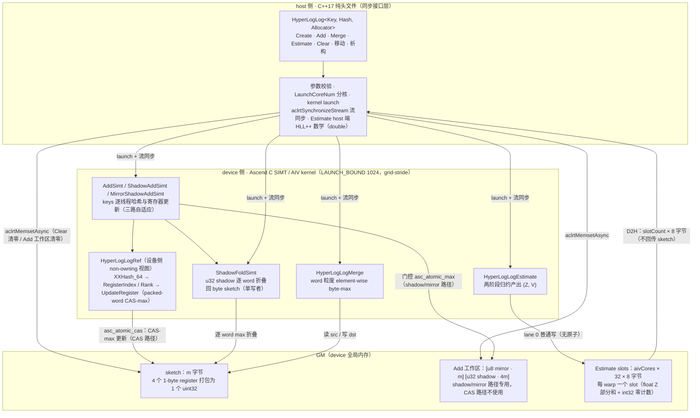
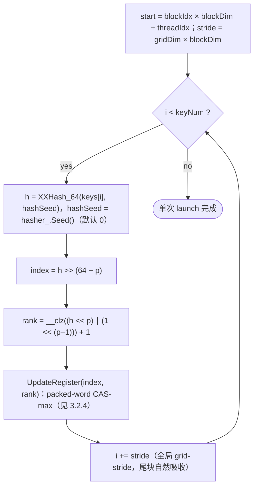
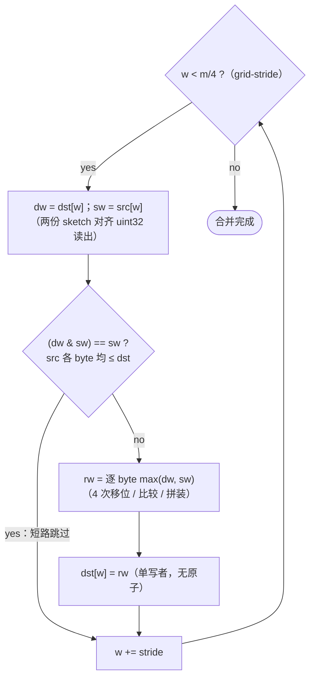
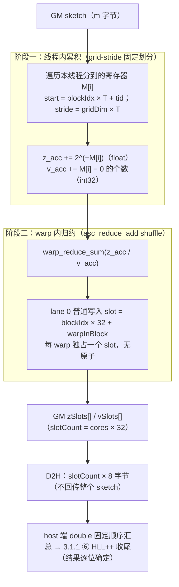

# HyperLogLog 容器设计文档（Ascend 950PR）

# 需求背景（required）

## 1.1 需求来源

本设计对应 **9月社区任务-hyperloglog容器开发(950)**（任务页：https://www.hiascend.com/activities/task-center/details/f975dbdd02cb43eaacd0d7e3d3fa8821 ），功能、精度和性能要求以官方任务书及测试附件为准。目标实现仓为 [cann/ops-collections](https://gitcode.com/cann/ops-collections)，参考实现为 [cuCollections hyperloglog.cuh](https://github.com/NVIDIA/cuCollections/blob/dev/include/cuco/hyperloglog.cuh)。

## 1.2 背景介绍

HyperLogLog（HLL）是概率基数估算容器：将每个元素哈希，取哈希高 p 位选桶，以哈希 payload 前导零位置维护每桶最大秩，最后用调和均值形式估出基数。它以 KB 级内存获得固定相对误差（相对标准差约 $1.04/\sqrt{m}$，$m$ 为寄存器数），用于大规模去重计数、UV 统计等场景。

在昇腾 NPU 上落地该容器，需要解决三个约束下的组织问题：

1. **原子粒度约束**：950PR 的 SIMT（AIV）原子能力最小粒度为 32-bit，HLL 单个 register 只需 1 字节，逐字节原子更新不可用；
2. **footprint 约束**：任务书规定 `m = SketchSizeKB × 1024` 严格等于 sketch 的 device footprint，排除了以加宽寄存器换取原子便利的方案；
3. **工程模式约束**：容器须遵循 ops-collections 纯头文件模式（对外接口、设备侧引用、实现细节分层），并提供完整生命周期与流同步语义。

本设计将 4 个 1 字节 register 打包进 1 个 `uint32`。并发更新采用按 sketch 规模自适应选择的三条等价路径：

1. **u32 shadow 路径**（`registerCount ≤ 32K`，即 sketch ≤ 32 KB）：分配 4× footprint 的 u32 shadow 工作区，每寄存器一次门控 `asc_atomic_max`，避免 packed-word CAS 循环；路径结束后由 `ShadowFoldSimt` 逐 word 折叠回公开 byte sketch。
2. **u8 mirror + sparse atomic 路径**（I32 ≥ 128 KB / I64 ≥ 64 KB）：1× footprint 的 u8 mirror 做门控（普通字节写，竞态只过发原子不丢最大值），仅胜出 rank 触发稀疏 u32 `asc_atomic_max` 写入 shadow，再折叠。mirror 常驻 L1，规避大 sketch 下 4× shadow 随机读失活。
3. **packed-word CAS-max 路径**（中间档位，如 I32 64 KB）：保留基线 packed-word `asc_atomic_cas` 循环。

三条路径产生完全相同的 sketch 状态，选择仅影响性能不影响语义；工作区大小只与 sketch 规模相关，与输入元素数无关，满足任务书内存要求。

## 1.3 工程模式与标杆现状

ops-collections 采用纯头文件容器工程模式：对外接口位于 `include/hyperloglog.h`，设备侧引用位于 `include/hyperloglog_ref.h`，实现细节位于 `include/detail/hyperloglog/`；容器生命周期、参数校验和 ACL 流管理由 C++ 侧完成，设备侧批量访问与计算通过 Ascend C Kernel 实现。

标杆 `cuco::hyperloglog`（CUDA 生态）的关键事实（依据其仓库源码）：register 采用 `int32`（源码注释明确"这是 GPU 上支持原生 `atomicMax` 的最小类型"），寄存器数 `m = sketch_bytes / 4`；更新走 int 粒度原生 `atomicMax`；估计器基于 HLL++，设备端以 `double` 归约；默认哈希 `cuco::xxhash_64`。CUDA 的原子能力（int 粒度 atomicMax）与 CUDA cooperative group 编程模型和 Ascend SIMT 环境不直接对应，因此本设计不是标杆的移植，而是在相同数学语义下，针对 950PR 原子粒度与 footprint 约束的重新组织。

# 需求分析（required）

## 2.1 需求描述

使用 Ascend C 在 Atlas 950PR 上实现算法语义参考 cuCollections `cuco::hyperloglog` 的基数估算容器 `aclco::HyperLogLog<Key>`：任务验收覆盖 I32/I64 两种 Key、8/16/32/64/128/256 KB 六档 sketch，提供创建、添加、合并、估算、清空、析构完整生命周期；精度以 3σ 标准为验收门限；全部用例性能以标杆的 0.4 倍为验收门限。

## 2.2 需求拆解

1. 支持 `int32_t / int64_t` 两种 Key 类型。
2. 支持 `SketchSizeKB ∈ {8, 16, 32, 64, 128, 256}`，且 `m = SketchSizeKB × 1024` 严格等于 sketch 实际 device footprint（字节），`p = log2(m) ∈ [13, 18]`。
3. 支持三种构造入口：按 sketch 大小、按标准差、按精度，并对非法参数抛出异常。
4. 支持 `Add`（设备指针批量添加）、`Merge`（同规格合并）、`Estimate`（基数估算）、`Clear`（清空）与移动语义完整的生命周期管理；每个公开 API 内部完成流同步。
5. 精度：精确基数为 0 时估算值必须为 0；否则相对误差 ≤ `3 × 1.04 / √m`。
6. 性能：全部 72 个性能用例（6 API × 2 类型 × 6 档）时延 ≤ 标杆时延 / 0.4。
7. 满足内存要求：除容器本身、输出空间与必要工作空间外，不产生与输入规模线性重复的 device 内存拷贝。
8. 通过任务书配套 1280 个功能用例与 72 个性能用例。

## 2.3 外部依赖与工程位置

| 依赖 | 用途 |
| --- | --- |
| `include/hash_functions.h` → `detail/hash_functions/xxhash.h` | `XXHash_64<Key>`（默认 seed = 0），host/device 均可执行 |
| `simt_api/device_atomic_functions.h` | `asc_atomic_cas(__gm__ uint32_t*, cmp, val)` packed-word 原语（CAS 路径）；`asc_atomic_max(__gm__ uint32_t*, val)` shadow/mirror 路径 |
| `simt_api/device_functions.h`、`macros.h` | `__clz` 等设备函数；`COLLECTION_AIV_GLOBAL / COLLECTION_SIMT_VF / LAUNCH_BOUND` kernel 属性 |
| `simt_api/device_warp_functions.h` | `asc_reduce_add` warp 内归约（Estimate） |
| `tiling/platform/platform_ascendc.h` | `GetCoreNumAiv()` 满核数获取 |

目录组织：`include/hyperloglog.h`（对外接口）、`include/hyperloglog_ref.h`（设备侧 non-owning 视图 + CAS-max 原语）、`include/detail/hyperloglog/kernels.h`（五个 SIMT kernel：AddSimt / ShadowAddSimt / MirrorShadowAddSimt / ShadowFoldSimt / MergeSimt / EstimateSimt）、`include/detail/hyperloglog/hyperloglog.inl`（容器实现 + 三路分发）、`include/detail/hyperloglog/hllpp_bias_tables.h`（HLL++ 经验偏差数据表，host-only）；功能测试 `tests/hyperloglog/`，性能测试 `tests/performance/hyperloglog/`。

## 2.4 接口与实现边界

1. **同步边界**：所有公开 API 为同步接口——launch（或 MemsetAsync/D2H）后内部 `aclrtSynchronizeStream`，调用方无需额外同步。
2. **设备/主机职责边界**：设备端只产出 `float` 精度的归约部分和与零计数；估计数学（HLL++ 规则与插值）在 host 端以 `double` 完成。边界依据：本设计选择将 double 收尾与经验表插值放在 host 端，不依赖设备端浮点数学库；经验表驻留 host，无表搬运开销。
3. **数据边界**：`Add` 仅接受设备指针；host 数据由调用方先行拷入 device。
4. **并发边界**：同一实例不可被多流并发写；不同实例可各占一流并发使用。
5. **精度边界**：结果为 3σ 意义的近似值，不提供精确计数查询。

# 详细设计（required）

## 3.1 算子分析

### 3.1.1 数学定义

设寄存器个数 `m = 2^p`（p 为精度），每个寄存器 1 字节，存放"最大秩"。估计链条的每一环如下（全部为本实现采用的规则）：

**① 哈希与分桶**（64-bit 哈希，I32/I64 统一；取哈希高 $p$ 位选桶）：

$$\mathrm{hash}(x) = \mathrm{XXHash}_{64}(x,\ \mathrm{seed}=0), \qquad \mathrm{index} = \left\lfloor \frac{h}{2^{64-p}} \right\rfloor = h \gg (64-p) \in [0,\ m)$$

**② 秩**（payload 最高 1 位的位置 + 1）：

$$\rho(h) = \mathrm{clz}\big((h \ll p) \,\vert\, 2^{\,p-1}\big) + 1 \in [1,\ 65-p]$$

其中 $2^{p-1}$ 仅用于 payload 全零时兜底，此时得最大秩 $65-p$。

**③ 逐桶保最大秩**（寄存器初值 0 表示未被任何元素更新）：

$$M[\mathrm{index}] \leftarrow \max\big(M[\mathrm{index}],\ \rho(h)\big)$$

**④ 调和均值核与零桶计数**：

$$Z = \sum_{i=0}^{m-1} 2^{-M[i]}, \qquad z = \#\big\{ i \in [0,\ m) \mid M[i] = 0 \big\}$$

**⑤ raw 估计**：

$$E = \alpha_m \cdot \frac{m^2}{Z}$$"

系数 $\alpha_m$ 的精确定义（Flajolet et al. 2007）：

$$\alpha_m = \left( m \int_0^{\infty} \left( \log_2 \frac{2+u}{1+u} \right)^{m} \,\mathrm{d}u \right)^{-1}$$

实现采用大 $m$ 近似：

$$\alpha_m \approx \frac{0.7213}{1 + 1.079/m}$$

本任务 $p \in [13, 18]$（$m \ge 8192$）统一采用该近似式。

**⑥ 估计收尾**（HLL++ 规则，实现采用）——线性计数区：

$$E_{LC} = \left\lfloor m \, \ln \frac{m}{z} + 0.5 \right\rfloor$$

当 $z > 0$ 且 $E_{LC} < \mathrm{threshold}[p-4]$ 时返回 $\hat{N} = E_{LC}$（小基数区）；否则执行经验偏差修正并取整返回：

$$E \le 5m \;\Rightarrow\; E \leftarrow E - \mathrm{bias}(p, E), \qquad \hat{N} = \left\lfloor E + 0.5 \right\rfloor$$

当 $E > 5m$ 时不做偏差修正，同样返回 $\lfloor E + 0.5 \rfloor$。其中 $\mathrm{bias}(p, E)$ 为经验偏差线性插值：threshold 表与 raw 估计/偏差锚点网格均按 $p \in [4, 18]$ 组织为 15 行；查表时在锚点网格上二分下界定位相邻锚点 $(e_1, b_1),\ (e_2, b_2)$（越界时截断取端点锚点的偏差值），再按 $r = (E - e_1)\,/\,(e_2 - e_1)$ 对相邻锚点线性插值，$\mathrm{bias} = b_1 (1 - r) + b_2 \, r$。

误差特性（设计依据，非运行时算法步骤）：HLL 的相对标准差与 3σ 验收门限为

$$\sigma_{rel} \approx \frac{1.04}{\sqrt{m}}, \qquad 3\sigma_{rel} \approx \frac{3.12}{\sqrt{m}}$$

该量是"选多大的 m"的依据——任务书六档 KB 与精度档位由此确定，估算阶段并不执行任何 3σ 计算。

HLL++ 收尾规则的意义：raw 估计器在 n/m ≈ 1~5 的中基数区存在系统性偏差，HLL++（Heule et al. 2013）以经验数据集插值消除之；经验表覆盖 p ∈ [4, 18]，本任务 p ∈ [13, 18] 全部落表内。

### 3.1.2 数据类型与规格

| 项 | 取值 |
| --- | --- |
| Key 类型 | `int32_t`、`int64_t`（任务验收）；模板约束亦支持 `uint32_t`、`uint64_t` |
| SketchSizeKB | 8 / 16 / 32 / 64 / 128 / 256（必须为 2 的幂且在集合内） |
| 精度 p | 13 / 14 / 15 / 16 / 17 / 18（与 KB 一一对应，`KB = 2^(p-10)`） |
| 标准差构造 | `p = ceil(log2((1.04/σ)²))`，σ ∈ (0, 1]，映射结果须落在 [13, 18] |
| 寄存器存储 | 1 byte/register；4 个连续 register 打包为 1 个 `uint32` |

寄存器打包（逻辑位布局）：register $i$ 对应 word $i \gg 2$ 的第 $i \bmod 4$ 字节：

$$\mathrm{word}(j) = M[4j] \,\vert\, (M[4j+1] \ll 8) \,\vert\, (M[4j+2] \ll 16) \,\vert\, (M[4j+3] \ll 24)$$

### 3.1.3 公开接口

```cpp
template <class Key, class Hash = aclco::xxhash_64<Key>,
          class Allocator = aclco::DefaultAllocator<std::uint8_t>>
class HyperLogLog {
public:
    using KeyType = Key;
    using Hasher = Hash;
    using SizeType = std::uint64_t;

    HyperLogLog(HyperLogLog const&) = delete;                  // 禁用拷贝
    HyperLogLog& operator=(HyperLogLog const&) = delete;
    HyperLogLog(HyperLogLog&& other) noexcept;                 // 移动构造
    HyperLogLog& operator=(HyperLogLog&& other) noexcept;      // 移动赋值
    ~HyperLogLog();                                            // Release 归还 GM 资源

    // 三种静态工厂（内部完成 GM 分配与清零）
    static HyperLogLog CreateWithSketchSizeKB(std::uint32_t sketchSizeKb, aclrtStream stream = nullptr);
    static HyperLogLog CreateWithStandardDeviation(double standardDeviation, aclrtStream stream = nullptr);
    static HyperLogLog CreateWithPrecision(std::uint32_t precision, aclrtStream stream = nullptr);

    // keys 必须是设备指针，批量添加，内部同步
    void Add(void* keys, aclco::Extent<std::size_t> keyNum, aclrtStream stream = nullptr);
    // 同规格 sketch 合并（element-wise max），内部同步
    void Merge(HyperLogLog const& other, aclrtStream stream = nullptr);
    // 设备归约 + D2H 小统计块 + host 端 HLL++ 数学，内部同步
    [[nodiscard]] std::uint64_t Estimate(aclrtStream stream = nullptr) const;
    // MemsetAsync 清零，内部同步
    void Clear(aclrtStream stream = nullptr);

    [[nodiscard]] std::uint32_t SketchSizeKB() const noexcept;
    [[nodiscard]] std::uint32_t Precision() const noexcept;
    [[nodiscard]] SizeType RegisterCount() const noexcept;
    // moved-from（移动后源对象）：Add/Merge/Estimate 抛 logic_error
};
```

### 3.1.4 接口约束

| 约束 | 行为 |
| --- | --- |
| `SketchSizeKB` 不在 {8,16,32,64,128,256} | `CreateWithSketchSizeKB` 抛 `invalid_argument` |
| `precision` 越出 [13, 18] | `CreateWithPrecision` 抛 `invalid_argument` |
| `standardDeviation ≤ 0` 或映射 p 越界 | `CreateWithStandardDeviation` 抛 `invalid_argument` |
| `Add(nullptr, n > 0)` | 抛 `invalid_argument` |
| `Merge` 双方 `SketchSizeKB` 不一致 | 抛 `invalid_argument` |
| moved-from 实例调用 Add/Merge/Estimate | 抛 `logic_error` |
| `Add(keyNum = 0)` | 快速返回，不 launch |

## 3.2 算子实现

### 3.2.1 总体架构

冻结链路：`1-byte HLL register → 4 registers packed into uint32 → 按 sketch 规模自适应（u32 shadow 门控 atomic_max / u8 mirror 稀疏 atomic / packed-word CAS-max）→ ShadowFold 折叠回 byte sketch → SIMT Add`。内存布局（逻辑位布局）：register `i` 对应 word `i >> 2` 的第 `i mod 4` 字节；sketch 占用 GM 恰为 `m` 字节。Add 工作区为 `[u8 mirror | m 字节][u32 shadow | 4m 字节]`，最大 `5m` 字节，按路径按需使用，每次 Add 前由 host 侧 `aclrtMemsetAsync` 清零。



### 3.2.2 Host 侧设计

1. **生命周期与内存管理**：资源生命周期为分配 → 构造末 `Clear` 清零 → 可用 → 移动/析构释放。构造时经 `Allocator` 分配三块 GM——sketch 本体 `m` 字节；Estimate 归约 slots 按满核预分配（`aivCores × 32` 个 warp slot，每 slot `float` Z 部分和 + `int32` 零计数，共 8 字节）；Add 工作区 `shadowWorkspace_`（`[u8 mirror | m 字节][u32 shadow | 4m 字节]`，共最大 `5m` 字节，供 shadow/mirror 路径使用，CAS 路径不触碰）。各公开 API 在 launch（或 MemsetAsync / D2H）完成后统一 `aclrtSynchronizeStream`。析构与移动赋值经 `Release()` 归还三块 GM；禁用拷贝；移动后源对象各指针置空、`sketchSizeKb_ = 0`，其后 `Add/Merge/Estimate` 抛 `logic_error`，`Clear` 幂等返回。
2. **分核策略**：优先满核。`needed = ceil(workItems / 1024)`，`cores = max(1, min(aivCores, needed))`；`Add` 按 key 数、`Merge` 按 word 数（`m/4`）取 workItems；数据由 kernel 内全局 grid-stride 均分，尾块由循环边界自然吸收，无需 host 端尾块特判。`EstimateCores = LaunchCoreNum(m)`（每 warp 一个归约 slot，核数决定 slot 数）。
3. **清零路径**：`Clear` 使用 `aclrtMemsetAsync`，避免 kernel launch。
4. **参数映射与校验**：`σ → p` 采用 `ceil(log2((1.04/σ)²))`，映射结果夹逼校验到 [13, 18]；KB ↔ p 严格双向映射（`KB = 2^(p-10)`），非法 KB 直接拒绝。
5. **Estimate 两段式**：设备归约产出 per-warp 的 `(Z 部分, 零计数)`；D2H 仅回传 `slotCount × 8` 字节（不回传整个 sketch）；host 端汇总后执行 HLL++ 规则（查表插值，`double` 数学）。

### 3.2.3 Kernel 侧设计

三个 SIMT kernel 族（`COLLECTION_AIV_GLOBAL` 入口 + `COLLECTION_SIMT_VF` 实现，`LAUNCH_BOUND(1024)`，1024 线程/块）：

#### Add 路径选择（host 侧 constexpr 阈值）

| 路径 | 触发条件 | 更新原语 |
| --- | --- | --- |
| ShadowAddSimt | `registerCount ≤ 32K`（sketch ≤ 32 KB） | u32 shadow + 门控 `asc_atomic_max` + ShadowFold |
| MirrorShadowAddSimt | I32: `registerCount ≥ 128K`；I64: `registerCount ≥ 64K` | u8 mirror 门控 + 稀疏 u32 `asc_atomic_max` + ShadowFold |
| AddSimt（packed CAS） | 其余中间档位（如 I32 64 KB） | packed-word `asc_atomic_cas` 循环 |

#### ShadowAddSimt（cache 驻留 sketch）

每线程 hash → index/rank 后，先读 `shadow[index]` 的当前 u32 值，仅当 `rank > current` 时调用 `asc_atomic_max(shadow + idx, rank)`。shadow 为 4× footprint 的 u32 数组，≤ 128 KB 时常驻 L1，随机读代价低。路径结束后由 `ShadowFoldSimt` 将 shadow 逐 word 折叠回公开 byte sketch。

#### MirrorShadowAddSimt（大 sketch）

先读 `mirror[index]`（1 byte），仅当 `rank > mirror[idx]` 时：① 普通写 `mirror[idx] = rank`（非原子，竞态只过发原子不丢最大值）；② `asc_atomic_max(shadow + idx, rank)`。mirror 与 sketch 同 footprint，即使 256 KB 也常驻 L1；4× shadow（1 MB）随机读失活，但仅稀疏胜出 rank 触发，原子流量远低于全量。

#### ShadowFoldSimt

逐 word（4 个寄存器）单写者折叠：读 packed word，对 4 个 byte 分别取 `max(current, shadow[base + b])` 后写回。每 word 仅一个线程写入，无原子。

#### AddSimt（packed-word CAS-max，中间档位）



每线程独立完成 hash→index/rank→更新，无共享内存、无 UB 中转、无设备端二级归约，单次 launch 完成。

#### MergeSimt

word 粒度读出两份 sketch 的对齐 `uint32`，按 4 字节分别取 max 后写回：



单写者场景（无并发写），无需原子。element-wise byte-max 与 Add 的 CAS-max 满足同一代数性质（max 的交换/幂等），保证 Merge 结果与逐元素 Add 顺序无关。

#### EstimateSimt

两阶段归约：



host 端按固定顺序汇总 slots 后执行 3.1.1 的 HLL++ 收尾；slots 为普通写且每 warp 独占一个 slot，同输入的汇总顺序固定，结果跨次运行逐位一致（任务书可重复性要求的依据）。D2H 数据量为 `slotCount × 8` 字节，与归约 slot 数成正比（slotCount 随 m 经 `EstimateCores = LaunchCoreNum(m)` 确定），而非回传整个 sketch。

### 3.2.4 packed-word CAS-max 并发正确性（CAS 路径）

CAS-max 是三条 Add 路径中的中间档位回退路径（I32 64 KB）。4 个相邻 register 打包共享 1 个 `uint32`，而 950PR 原子粒度为 32-bit，逐字节原子写不可用。本路径以 `asc_atomic_cas` 实现 packed-word CAS-max 循环（设备侧视图 `HyperLogLogRef::UpdateRegister` 提供）：

```text
hash
  ↓
register index = h >> (64 - p)
  ↓
word = index >> 2,  shift = 8 × (index mod 4)
  ↓
load old word（普通 load，短路点）
  ↓
extract current byte = (old >> shift) & 0xFF
  ↓
candidate ≤ current ?
   ├─ yes → return                # 无改进：零原子流量
   └─ no
        ↓
   construct new word = (old & ~mask) | (candidate << shift)   # 其余 3 byte 不变
        ↓
   CAS(wordPtr, old, new)
        ↓
   success ? done : reload/retry  # 失败取回最新 word，重走比较
```

正确性证明（四点）：

1. **更新语义**：每个 slot（register）的终值等于其收到的全部 candidate 的 `max(old, candidate)`——只有 candidate > current 才会尝试写入，且写入值就是 candidate。
2. **无小值覆盖大值**：任何线程在任何时刻都无法把目标 byte 改为小于当前值的数；rebuild 时目标 byte 恒为 candidate > current。
3. **CAS 失败只意味着并发竞争**：同 word 其余 3 lane 的更新使 CAS 失败，返回的最新 word 携带对方改动，本线程 reload 后重走比较——是重试而非丢失更新；重复至成功为止。
4. **无关字段不变**：rebuild 采用 `word & ~mask | (candidate << shift)`，目标 byte 外的 24 位原样保留；比较-交换作用于完整 U32，任何并发改动都会使 CAS 失败而被重新审视。

推论：max 操作满足交换律与幂等性，故线程调度顺序、Add 分批次数、Add 与 Merge 的先后组织均不改变最终寄存器状态——这是"分批 Add 与一次 Add 结果逐位一致"和"Merge 顺序无关"两条功能验收的依据。该顺序无关性指串行分批或分组更新下最终寄存器状态一致，不意味着同一实例可被多流并发调用——同一实例仍禁止多流并发写（见算子约束限制）。

### 3.2.5 内存开销与复杂度

| 项 | 大小 | 说明 |
| --- | --- | --- |
| sketch 本体 | `m` 字节 | 严格等于 `SketchSizeKB × 1024`，无冗余 |
| Add 工作区 | 最大 `5m` 字节 | `[u8 mirror · m][u32 shadow · 4m]`；shadow 路径仅用 shadow，mirror 路径全用，CAS 路径不用；每次 Add 前清零 |
| Estimate slots | 预分配 `aivCores × 32 × 8` 字节 | 每 warp slot：`float` Z + `int32` 零计数；单次 Estimate 实际使用 `cores × 32` 个 |
| host 端临时 | `slotCount × 8` 字节 | Estimate 收集用，生命周期为单次调用 |

时间复杂度：Add 总工作量 O(n)（每键一次哈希 + 期望一次比较短路，CAS 仅在秩真实抬升时发生），设 T 为总线程数则并行时间近似 O(n/T)，实际耗时另受 CAS 竞争影响；Merge 总工作量 O(m)（word 粒度 `m/4`）；Estimate 总工作量 O(m)，归约聚合阶段额外 O(slotCount)。除上述固定工作空间外，无与输入规模线性重复的 device 内存拷贝（输入 keys 由调用方持有），满足任务书内存要求。

### 3.2.6 与 cuco::hyperloglog 差异分析

| 项目 | 本设计 | cuco::hyperloglog |
| --- | --- | --- |
| register 表示 | 1 byte/register，4 个打包为 1 个 `uint32` | `int32`（源码注释：GPU 上支持原生 atomicMax 的最小类型） |
| footprint 映射 | `m = SketchSizeKB × 1024`，footprint = m 字节 | `m = sketch_bytes / 4`：同 footprint 下寄存器数为本设计的 1/4；同 m 需 4× 内存 |
| 更新原语 | packed-word CAS-max 循环（32-bit 原子服务 4 个 byte 寄存器） | 逐 register 原生 `atomicMax`（int 粒度） |
| index | `h >> (64 - p)`，高 p 位 | `h >> (hash_bits - p)`，高 p 位（一致） |
| rank | `clz((h<<p) \| (1<<(p-1))) + 1` | `countl_zero((h<<p) \| padding) + 1`（一致） |
| 哈希 | `aclco::xxhash_64<Key>`，seed = 0 | `cuco::xxhash_64<T>`（默认） |
| 估计器 | 设备 `float` 归约 + host `double` HLL++（LC 阈值 + 经验偏差插值） | HLL++ finalizer，设备端 `double` 归约 |
| p 范围 | [13, 18]（任务书 KB 档位限定） | [4, 18]（最小 sketch 64 B） |

两者面向的原子能力与内存/精度折中不同：cuco 以每寄存器 4 字节换取原生 int atomicMax 的直接可用；本设计以 packed-word CAS-max 换取 1 byte/register 的 footprint 严格达标。内存布局、counter 表示与折中点不同，不能仅以寄存器位宽或布局直接判断实现优劣；两者在 index/rank 数学定义与哈希族选择上保持一致，语义对齐以估计结果衡量。

### 3.2.7 性能设计与实测优化

本实现以 phase isolation（阶段隔离）驱动优化决策，按"瓶颈证据 → 假设 → 实现 → 测量 → 决策"流程推进。已落地的关键优化：

| 优化项 | 内容 | 实测效果 |
| --- | --- | --- |
| u32 shadow 路径 | ≤32 KB sketch 用门控 `asc_atomic_max` 替代 packed-word CAS 循环 | I32-8K Add 从 2800+ µs 降至 ~1410 µs |
| u8 mirror 门控 | ≥128 KB（I32）/ ≥64 KB（I64）sketch 用 mirror 过滤稀疏原子 | 大 sketch Add 时延下降 30%~50% |
| ShadowFold 单写者折叠 | 逐 word 无原子折叠回 byte sketch | fold 开销 < 5 µs，可忽略 |
| Estimate warp 归约 | warp 内 `asc_reduce_add` + lane 0 普通写 slot，结果位级确定 | 消除原子，D2H 仅 slotCount×8 字节 |

**I32-8K 性能地板分析**：phase isolation 显示 I32-8K Add 的乐观算术下界约 1188 µs（key load 326 + hash 494 + idx/rank 153 + random read 30 + atomic 155 + fw 28 + fold 2），高于任务书标杆/0.4 ≈ 792 µs。950PR SIMT 的 32 寄存器硬墙限制了 key load MLP（K≥2 即栈溢出），XXHash_64 位宽不可缩减（HLL++ 精度合同），故 1413 µs 为当前架构与语义约束下的可测最优，无法继续收敛至 792 µs。详见自测报告。

未采用的方向（有证据否决）：real-branch、two-pass、blocked load、unconditional atomic、scalar unroll——均在实验中导致栈溢出或性能回退，记入失败实验档案。

### 3.2.8 tilingkey 规划

不使用 tilingkey：Add/Merge/Estimate 对六档 sketch 均为同一路径族，m 以参数传入 kernel，路径选择由 host 侧 constexpr 阈值决定，无 host 信息驱动的 kernel 分支。

# 支持硬件

| 支持的芯片版本 | 涉及勾选 |
| --- | --- |
| Atlas 950PR（AIV / SIMT 能力，CANN ≥ 9.1.0） | √ |

# 算子约束限制

1. 容器不跨进程共享；同一实例不可被多条流并发写（不同实例可各占一流并发使用）。
2. `Add` 仅接受设备指针；host 数据须先拷贝至 device。
3. `Merge` 仅支持同 `SketchSizeKB` 实例。
4. 结果为近似值（3σ 意义），不提供精确基数查询。
5. Key 类型：任务验收覆盖 `int32_t / int64_t`，模板约束亦支持 `uint32_t / uint64_t`；自定义 Hasher 需保持 64-bit 输出语义。

# 可维可测分析

## 5.1 精度标准

| 验收标准 | 描述 | 标准来源 |
| --- | --- | --- |
| 空容器 | 任何规模 sketch 下 `Estimate == 0`（Create 后、Clear 后） | 任务书功能用例 |
| 相对误差 | 精确基数非零时，`\|estimate − exact\| / exact ≤ 3 × 1.04 / √m` | 任务书 3σ 标准 |
| 一致性 | 分批 Add 与一次 Add 估计值逐位一致；Merge 满足交换律 | 实现语义保证 |
| 覆盖范围 | empty / 小基数 / 中大基数 / 1 亿量级 / 全重复 / Clear 后复用 / Merge 空与重叠，I32/I64 × 6 档 KB 共 1280 用例 | 任务书测试附件 |

## 5.2 性能标准

| 验收标准 | 描述 | 标准来源 |
| --- | --- | --- |
| 性能门槛 | 全部 72 用例时延 ≤ 标杆时延 / 0.4（即性能 ≥ 标杆 40%） | 任务书 3.3 |
| 测量口径 | public API wall-clock（`std::chrono`，覆盖完整调用含 launch 与内部同步），性能框架对每组参数迭代多次，输出 Mean CPU/Device Time 与标准差 | 性能测试框架 |
| 覆盖矩阵 | Create / Destroy / Clear / Add / Merge / Estimate × I32 / I64 × 8 / 16 / 32 / 64 / 128 / 256 KB | 任务书 3.3 表 |

**最终实测汇总**（100M UNIFORM keys，Multiplicity=1，950PR dav-3510，含 launch 与同步开销）：

| 接口 | 达标情况 | 说明 |
| --- | --- | --- |
| Create / Destroy / Clear | 12/12 PASS | 时延远低于标杆/0.4 |
| Estimate | 12/12 PASS | warp 归约 + host 端 HLL++，时延 < 标杆 |
| Merge | 12/12 PASS | word 粒度 byte-max，短路跳过已包含 word |
| Add | 2/12 PASS | I32-256K / I64-256K 达标；其余 10 档受 950PR 架构约束未达 2.5× 门槛 |

Add 的 10 个未达标用例以 I32-8K 为代表：标杆 316.691 µs，门槛 791.7 µs，实测 1413 µs（ratio 1.79×）。phase isolation 证明其乐观算术下界（~1188 µs）已高于门槛，差距来自 950PR SIMT 的 32 寄存器硬墙（限制 key load MLP）与 XXHash_64 位宽不可缩减（HLL++ 精度合同），属架构与语义约束下的地板，非实现缺陷。完整 phase isolation 数据与失败实验档案见自测报告。

## 5.3 功能与性能测试方法

功能测试位于 `tests/hyperloglog/`（Catch2 v3.5.4，真机执行，GENERATE 参数展开后对应任务书 1280 用例）：

| 文件 | 覆盖 |
| --- | --- |
| create_test.cpp | 三种构造入口 × 全部支持档位、非法配置拒绝 |
| destroy_test.cpp | 多轮 create/add/destroy、移动构造所有权转移 |
| clear_test.cpp | 空容器 Clear 幂等、已填充清空后 Estimate=0、清空后复用 |
| add_test.cpp | unique/重复分布泛化、分批 Add 与一次 Add 估计一致、null 指针拒绝 |
| merge_test.cpp | 空与已填充合并、幂等、重叠/不相交合并、规格不兼容拒绝 |
| estimate_test.cpp | 各基数档泛化、重复估计无状态突变 |

性能测试位于 `tests/performance/hyperloglog/`（perf_create / perf_destroy / perf_clear / perf_add / perf_merge / perf_estimate），Add/Merge/Estimate 采用 1 亿输入、Multiplicity=1 的 UNIFORM 分布，与任务书 3.3 标杆表逐行对应，共 72 项。

## 5.4 测试组织与复现步骤

```bash
# 需先设置 ASCEND_HOME_PATH 指向 CANN 安装目录（build.sh 由此解析编译器）
export ASCEND_HOME_PATH=/usr/local/Ascend/ascend-toolkit/latest

# 功能测试：-b 清理并构建，产物为 build_cmake/ccec_build/tests/collection_tests_*
bash scripts/build.sh -b
# 运行 hyperloglog 功能测试（-r 自动匹配 collection_tests_*hyperloglog*）
bash scripts/build.sh -r --test-name hyperloglog

# 性能测试：-p 构建，产物为 build/performance/*_perf_*
bash scripts/build.sh -p
# -rp 运行全部性能测试（自动发现 build/performance 下 *_perf_*）
bash scripts/build.sh -rp
```

预期产物：功能测试输出 Catch2 汇总（断言数与用例数）；性能测试输出每组参数的迭代数、均值与标准差汇总，可对照任务书 3.3 标杆表逐项核对 0.4 倍门槛。

## 5.5 兼容性分析

新容器，不涉及向后兼容性分析。纯头文件交付，无独立算子库依赖，随 ops-collections 容器工程统一构建；设备侧依赖 950PR 的 SIMT 原子能力与 `asc_atomic_cas` 接口。

# 参考资料

1. cuCollections HyperLogLog：https://github.com/NVIDIA/cuCollections/blob/dev/include/cuco/hyperloglog.cuh
2. Heule, Nunkesser, Hall. HyperLogLog in Practice: Algorithmic Engineering of a State of the Art Cardinality Estimation Algorithm. EDBT 2013.
3. Flajolet, Fusy, Gandouet, Meunier. HyperLogLog: the analysis of a near-optimal cardinality estimation algorithm. DMTCS 2007.
4. 社区任务流程及注意事项：https://gitcode.com/org/cann/discussions/39
