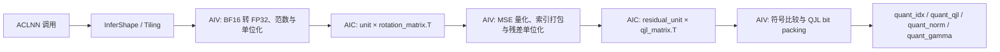
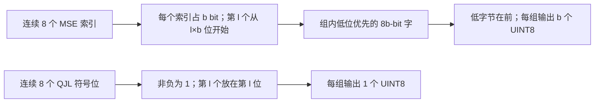
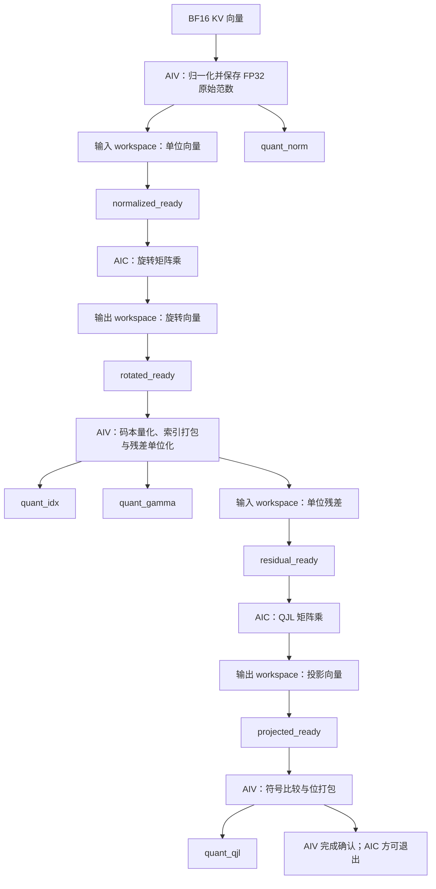

# KvCacheTurboQuant 算子设计文档

## 需求背景

### 需求来源

大模型自回归推理需要长期保存历史 token 的 Key/Value。随着上下文长度增加，KV Cache 的显存占用和访存带宽快速增长，逐渐成为长序列推理的重要瓶颈。本任务要求在昇腾平台实现 `KvCacheTurboQuant`，对标准 MHA/GQA 场景的 KV 向量进行在线压缩，以较低的量化误差换取更小的缓存体积。

任务采用 TurboQuant 的两阶段编码思路：先对旋转后的单位向量执行低比特 MSE 标量量化，再对第一阶段残差执行 1-bit QJL 编码。首版范围不包含 MLA，也不包含论文中按异常通道和普通通道拆分的混合精度 3.5-bit 方案。

### 背景介绍

#### 论文方法

TurboQuant 论文指出，随机旋转可以把单位向量的坐标分布随机化，使各坐标近似服从高维球面坐标分布；随后可以使用预先计算的 Lloyd-Max 标量码本独立量化各坐标。单纯面向 MSE 优化的低比特量化会给内积估计带来偏差，因此论文进一步对 MSE 量化残差应用 1-bit Quantized Johnson-Lindenstrauss（QJL）映射，使内积估计在随机矩阵意义下无偏，并获得随维度下降的方差上界。

论文的完整 `TurboQuant_prod` 用总预算中的 `b-1` bit 做 MSE 编码、另用 1 bit 做残差 QJL。本任务的接口把 `mse_bits` 明确定义为第一阶段 MSE 码宽，另外始终输出一份 1-bit QJL，因此任务实际存储预算是 `mse_bits + 1` bit/通道，再加两个 BF16 标量。

当 `head_dim=128`、`mse_bits=3`、`qjl_dim=128` 时，每个 head 的存储量为：

$$
\frac{128\times3}{8}+\frac{128}{8}+2+2=48+16+4=68\ \text{Byte}
$$

原始 BF16 向量为 `128×2=256 Byte`，因此仅按该向量载荷计算，压缩比为：

$$
\frac{256}{68}\approx3.76
$$

该数值不等于论文中的 3.5 bit/channel。论文的 3.5-bit 结果来自异常通道与普通通道拆分后采用不同精度，任务书已明确首版不实现该方案。

算法依据：[TurboQuant 论文](https://arxiv.org/abs/2504.19874)；接口依据：任务包中的 `op.json`、`case.json` 和 `golden.py`。

#### KvCacheTurboQuant 算子实现信息

| 模块 | 文件或目录 | 作用 |
| --- | --- | --- |
| 算子定义 | `op_host/kv_cache_turbo_quant_def.cpp` | 输入、输出、属性及芯片注册 |
| Shape 推导 | `op_host/kv_cache_turbo_quant_infershape.cpp` | 四个输出的 shape/dtype 推导 |
| Tiling | `op_host/kv_cache_turbo_quant_tiling.{h,cpp}` | 参数校验、核数、workspace 与 Matmul Tiling |
| Kernel | `op_kernel/kv_cache_turbo_quant.{h,cpp}` | AIC/AIV 混合 Kernel 与 2/3/4-bit 专用路径 |

#### KvCacheTurboQuant 现状分析

任务包只提供了算子定义、用例描述和 PyTorch NPU Golden，没有提供可复用的 CANN 算子实现。`ops-transformer` 当前存在其他 TurboQuant 压缩/反量化相关实验算子，但它们面向 MLA 或 4-bit latent 等不同协议，码本、数据布局和输出语义均不能直接复用为本算子实现。

接口计算与打包语义以任务包的 `golden.py` 为准，具体比较规则和输出布局见下文数学公式。

#### KvCacheTurboQuant 设计基线流程图



#### KvCacheTurboQuant 功能分析

输入 `kv_vectors[T,H,D]` 中每个 `(token, kv_head)` 对应一个独立向量。算子对 `M=T×H` 个向量执行相同编码，向量之间没有数据依赖。设计采用 AIC/AIV 混合调度：AIV 负责逐行归一化、码本量化和 bit packing，AIC 通过 Matmul API 批量执行两次 128×128 FP32 稠密乘。两个阶段通过分组 workspace 和跨核事件衔接。

本算子的关键难点不是接口数量，而是同时满足以下三点：

- 两次 128×128 FP32 稠密矩阵-向量乘的吞吐；
- 整数编码输出必须复现 Golden 的边界规则和 bit layout；
- `T=1` 的低并行度场景与 `T=2048` 的大吞吐场景都要达到至少 10 倍 PyTorch eager 基线。

## 需求分析

### 需求描述

#### 输入、输出和属性

以下表格以 `op.json` 为首版接口契约。

| 名称 | 类型 | 格式 | Shape | 说明 |
| --- | --- | --- | --- | --- |
| `kv_vectors` | BF16 | ND | `[T,H,128]` | 待编码 KV 向量 |
| `rotation_matrix` | FP32 | ND | `[128,128]` | 第一阶段旋转矩阵，计算使用其转置语义 |
| `qjl_matrix` | FP32 | ND | `[Q,128]`，首版 `Q=128` | 残差随机投影矩阵，计算使用其转置语义 |
| `mse_bits` | int 属性 | - | `2/3/4` | 第一阶段标量量化位宽，默认 3 |
| `quant_idx` | UINT8 | ND | `[T,H,ceil(128×mse_bits/8)]` | MSE 码字索引打包结果；首版末维分别为 32/48/64 |
| `quant_qjl` | UINT8 | ND | `[T,H,ceil(Q/8)]` | QJL 符号位打包结果；`Q=128` 时末维为 16 |
| `quant_norm` | BF16 | ND | `[T,H]` | 原始向量 L2 范数 |
| `quant_gamma` | BF16 | ND | `[T,H]` | 原始范数与旋转域残差范数之积 |

#### 支持范围

| 维度/属性 | 首版支持范围 | 依据 |
| --- | --- | --- |
| `T=num_tokens` | 任务用例覆盖 1、64、2048 | `case.json` |
| `H=num_kv_heads` | 任务书声明 4～32；正式用例当前为 8 | 任务书、`case.json` |
| `D=head_dim` | 固定 128 | 任务书、正式用例 |
| `Q=qjl_dim` | 首版固定 128 | 正式用例；当前接口没有独立属性 |
| `mse_bits` | 2、3、4 | `golden.py` |
| 场景 | 标准 MHA/GQA 的在线 KV 编码 | 任务书 |
| 不支持 | MLA；论文中的异常通道拆分/混合精度 2.5/3.5-bit；熵编码 | 任务书和首版范围 |

### 需求拆解

| 编号 | 需求 | 设计落点 | 验证入口 |
| --- | --- | --- | --- |
| RQ-01 | 三输入、四输出及 `mse_bits` 属性 | Host Shape/dtype 推导、算子定义 | InferShape UT、ACLNN 示例 |
| RQ-02 | 支持 2/3/4-bit MSE 编码 | 三个 TilingKey 和编译期模板实例 | Tiling UT、三个位宽设备用例 |
| RQ-03 | 复现固定码本、比较规则和 bit layout | 数学公式、Kernel Quantize/Pack | CPU 参考、设备逐字节比较 |
| RQ-04 | `D=Q=128`、`H=4~32` | Host 参数校验和 Tiling | 非法 shape/属性 UT |
| RQ-05 | FP32 旋转与 QJL 稠密矩阵语义 | 两次 Cube Matmul | 设备输出校验 |
| RQ-06 | 算子工程注册 | OpDef 芯片配置 | 目标环境编译与调用 |
| RQ-07 | 五条场景性能达到 PyTorch eager 的 10 倍 | 混合核、8 行 tile、SWAR packing | 自测建议：10 次预热、30 次采样并报告 P90；最终以验收口径为准 |
| RQ-08 | 与官方输入口径一致 | 固定矩阵、输入及属性要求 | 获取官方矩阵后复测 |

### 接口与参数分析

`op.json` 只声明 BF16 的 `kv_vectors`、两份 FP32 矩阵和 BF16 标量输出；任务书表格中更宽的矩阵/标量 dtype 范围尚未体现在算子定义中。`qjl_dim` 由矩阵首维表达，但当前 Kernel 固定为 128；`mse_bits` 是主量化位宽，QJL 始终额外占 1 bit/通道。正式输入的 shape、dtype、固定矩阵、`mse_bits` 和 Golden 必须逐项对齐。

## 详细设计

### 算子分析

#### 数学公式

将 `kv_vectors` 的前两维展平，记第 `i` 个输入向量为 `x_i ∈ R^128`，旋转矩阵为 `R ∈ R^(128×128)`，QJL 矩阵为 `S ∈ R^(128×128)`。

##### 1. 原始范数与单位化

$$
n_i=\lVert x_i\rVert_2=\sqrt{\sum_{k=0}^{127}x_{i,k}^2}
$$

$$
u_i=\begin{cases}
x_i/n_i,&n_i>0\\
0,&n_i=0
\end{cases}
$$

Golden 中非零分支的分母使用 `clamp_min(1e-30)`；在 BF16 输入条件下，只要 `n_i>0`，该 clamp 不改变正常有限输入结果。Kernel 仍按相同语义保留该下限。

##### 2. 随机旋转

Golden 表达式为：

$$
y_i=u_iR^T,\quad y_{i,j}=\sum_{k=0}^{127}u_{i,k}R_{j,k}
$$

矩阵在内存中按 `[output_channel, input_channel]` 使用，每个输出通道对应矩阵的一行。接口允许传入一般 FP32 矩阵，Kernel 不假设其为 Hadamard 矩阵或具有稀疏结构。

##### 3. MSE 标量量化

令位宽为 `b ∈ {2,3,4}`，有序码本为 `C_b=(c_0,…,c_(2^b-1))`，边界为：

$$
t_j=\frac{c_j+c_{j+1}}{2},\quad j=0,\ldots,2^b-2
$$

量化索引严格按 Golden 计算：

$$
q_{i,k}=\sum_j\mathbf{1}(y_{i,k}>t_j)
$$

等价于选择最近中心点，但边界相等时必须归入较小索引，不能使用 `>=`。重构值和残差为：

$$
\hat y_{i,k}=c_{q_{i,k}},\qquad r_{i,k}=y_{i,k}-\hat y_{i,k}
$$

固定码本如下，必须使用 FP32 常量，不在 Kernel 中重新训练或缩放：

| `mse_bits` | 码本 |
| --- | --- |
| 2 | `[-0.1335033178, -0.04002048075, 0.04002048075, 0.1335033178]` |
| 3 | `[-0.19020693, -0.1187859178, -0.06682205945, -0.02166347019, 0.02166347019, 0.06682205945, 0.1187859178, 0.19020693]` |
| 4 | `[-0.2414890379, -0.1828317791, -0.1429702938, -0.1109927073, -0.08325428516, -0.05802082643, -0.03428063914, -0.01134236995, 0.01134236995, 0.03428063914, 0.05802082643, 0.08325428516, 0.1109927073, 0.1429702938, 0.1828317791, 0.2414890379]` |

##### 4. 残差范数、Gamma 和 QJL

$$
\rho_i=\lVert r_i\rVert_2,\qquad \gamma_i=n_i\rho_i
$$

$$
v_i=\begin{cases}
r_i/\rho_i,&\rho_i>0\\
0,&\rho_i=0
\end{cases}
$$

$$
p_i=v_iS^T,\quad p_{i,j}=\sum_{k=0}^{127}v_{i,k}S_{j,k}
$$

QJL 输出 bit 为：

$$
z_{i,j}=\mathbf{1}(p_{i,j}\ge0)
$$

注意 MSE 阶段使用严格 `>`，QJL 阶段使用 `>=`，两者不可混用。

论文中 `S` 的元素为独立标准高斯随机变量，旋转矩阵可由高斯随机矩阵 QR 分解得到。上述分布是论文无偏性和失真结论的前提，但它不是当前算子对输入数值的 Host 校验条件；算子只按传入矩阵执行确定性计算。

##### 5. Bit packing

每连续 8 个逻辑值组成一组。对位宽 `b`，组内 64-bit 中间字为：

$$
w_g=\bigvee_{l=0}^{7}\left(q_{8g+l}\ll(l\times b)\right)
$$

再按小端顺序输出 `b` 个字节：

$$
out_{g\times b+s}=(w_g\gg(8s))\ \&\ 0xff,\quad s=0,\ldots,b-1
$$

QJL 使用 `b=1`，每组直接输出一个字节。`D=Q=128` 均可被 8 整除；实现仍可保留尾组补零逻辑，但首版正式路径不存在尾通道。

**打包布局图与核对样例**



例如 `mse_bits=3`，首组索引 `[0,1,2,3,4,5,6,7]` 打成 24-bit 字 `0xFAC688`，按低字节在前输出 `[0x88,0xC6,0xFA]`。若首组 QJL bit 为 `[1,0,1,0,1,0,1,0]`，输出字节为 `0x55`。这个样例同时检查组内位序和跨字节顺序，不能只比较解码后的整数序列。

| `mse_bits` | 每组索引字节数 | 128 维 `quant_idx` 长度 | 128 维 `quant_qjl` 长度 |
| ---: | ---: | ---: | ---: |
| 2 | 2 | 32 Byte | 16 Byte |
| 3 | 3 | 48 Byte | 16 Byte |
| 4 | 4 | 64 Byte | 16 Byte |

#### 零值和边界语义

- `x` 全零时，仅 `unit` 被置零；后续仍按正常流程量化 `rotated=0`。由于码本不含 0，残差不为零，QJL 结果取决于输入矩阵。不能把四个输出全部清零。
- `residual_norm=0` 时 `residual_unit=0`，此时所有投影为 0，按 `>=0` 规则，128 个 QJL bit 全为 1。
- 输入包含 NaN/Inf 的行为未在任务书定义。首版不承诺其数值语义，Host 也不扫描 tensor 数值；测试数据应为有限值。

#### 支持数据类型

Kernel 内部计算统一使用 FP32：BF16 `kv_vectors` 在 CopyIn 后转换为 FP32，矩阵保持 FP32，归约和两次矩阵-向量乘均使用 FP32，最终仅 `norm/gamma` 转 BF16。该选择用于复现 Golden，而不是性能最优的低精度近似。

矩阵乘使用 Cube Matmul API 的 FP32 输入输出路径，并启用 HF32 执行模式；接口输入和 workspace 中间结果仍为 FP32。`quant_idx` 和 `quant_qjl` 是离散输出，矩阵乘误差可能使边界或零点附近的结果翻转，因此须用任务固定矩阵验证该模式的精度。

#### 支持形状

输入 `kv_vectors=[T,H,128]`，其中 `T>0`、`4≤H≤32`；两份矩阵当前均为 `[128,128]`。正式性能点覆盖 `T=1/64/2048`、`H=8`，`mse_bits=2/3/4`。输出末维按打包位宽计算，分别见“接口与参数分析”和 Host Shape 推导。

### 算子实现

#### 实现方案

##### 3.2.1 整体架构

采用单个 AIC/AIV 混合 Kernel，`KERNEL_TYPE_MIX_AIC_1_2` 下每个 AIC 分组对应两个 AIV 子块：

1. 将 `[T,H,128]` 展平为 `M=T×H` 行，并按 AIC 分组连续切分；组内两条 AIV 再各取一半行。
2. AIV 以 8 行为一个 tile，将 BF16 输入转为 FP32，计算原始范数和单位向量，写入分组 workspace。
3. AIC 等待单位向量就绪后，用第一套 Matmul 对整组行执行 `unit @ rotation_matrix.T`，结果写回另一块 workspace。
4. AIV 完成对称码本量化、索引打包、残差范数和单位残差，再写回 Matmul 输入 workspace。
5. AIC 用独立的第二套 Matmul 执行 `residual_unit @ qjl_matrix.T`。
6. AIV 对投影结果执行 `>=0` 比较并打包 QJL bit；四类输出分别在对应阶段写回。

分组 workspace 的行数向 16 对齐，避免 Cube 尾块写回覆盖相邻组。AIC/AIV 之间以跨核 flag 串联四个阶段；两个 Matmul 对象分别初始化和结束。该方案以 workspace 换取 Cube 批量矩阵乘吞吐。

**AIC/AIV 协作与数据流**

下面的图按一个 AIC 分组展示执行顺序。两个 AIV 子块各处理本组的一半完整行；图中的同步点是组内跨核 flag，不表示对所有分组做全局同步。两块 FP32 行矩阵分别承担 Matmul 输入和输出，第二次矩阵乘复用同一对缓冲。



| 阶段 | 主执行单元 | 读取 | 写入 | 下一阶段条件 |
| --- | --- | --- | --- | --- |
| 归一化 | AIV | BF16 `kv_vectors` | FP32 单位向量、原始范数、BF16 `quant_norm` | 本组两条 AIV 均完成写回 |
| 旋转 | AIC | 单位向量、`rotation_matrix` | FP32 旋转向量 | Matmul 写回完成 |
| 主量化 | AIV | 旋转向量、原始范数、固定码本 | `quant_idx`、`quant_gamma`、FP32 单位残差 | 本组两条 AIV 均完成写回 |
| QJL 投影 | AIC | 单位残差、`qjl_matrix` | FP32 投影向量 | Matmul 写回完成 |
| 符号打包 | AIV | 投影向量 | `quant_qjl` | AIV 完成确认，避免 AIC 提前结束 |

同一分组必须等上一阶段完成后才能复用 workspace，不做跨阶段双缓冲；不同 AIC 分组处理互不重叠的行，可以并行推进。正确性取决于每次 GM 写入完成后再发布相应 flag，以及同步覆盖两个 AIV 子块。性能上需分别观察短输入的启动/同步开销与长输入的 Cube 吞吐。

##### 3.2.2 Host 侧设计

**Shape 和 dtype 推导**

设输入为 `[T,H,D]`，`rotation_matrix=[D,D]`，`qjl_matrix=[Q,D]`：

```text
quant_idx.shape   = [T, H, ceil(D * mse_bits / 8)]
quant_qjl.shape   = [T, H, ceil(Q / 8)]
quant_norm.shape  = [T, H]
quant_gamma.shape = [T, H]
```

输出 dtype 固定为 `UINT8, UINT8, BF16, BF16`。

**参数校验**

Host 侧至少校验：

- `kv_vectors` rank 为 3，dtype 为 BF16，格式为 ND；
- `rotation_matrix` 和 `qjl_matrix` rank 为 2，dtype 为 FP32，格式为 ND；
- `D=128`；
- `rotation_matrix.shape=[128,128]`；
- 首版 `qjl_matrix.shape=[128,128]`；
- `H` 在任务书约束 `[4,32]` 内；
- `T>0`；
- `mse_bits` 属于 `{2,3,4}`；
- 输入 shape 乘法和输出字节数无整数溢出。

动态 shape 场景中，编译期无法确定的约束延后到 Tiling 阶段检查。任何不支持组合应返回明确错误，不得静默截断或按其他规格执行。

**Tiling 策略**

定义 `M=T×H`，可用 AIC 核数为 `C`：

```text
core_num = min(M, C)
rows_per_group = ceil(M / core_num)
workspace_rows_per_group = align_up(rows_per_group, 16)
```

不对单个 128 维向量做跨核拆分。每个 AIC 分组处理连续完整行，两个 AIV 子块按前后两段分配该组行数；这样范数无需跨核归约。

**分组规则与方案取舍**

实际分组为近似均分，而不是简单用 `rows_per_group` 作为每组有效行数。令 `a=floor(M/core_num)`、`r=M mod core_num`：前 `r` 组各有 `a+1` 行，其余组各有 `a` 行；组内第一条 AIV 处理 `floor(group_rows/2)` 行，第二条处理剩余行。这样每个有效行只有一个写入者，`quant_idx`、`quant_qjl` 和两个标量输出不需要原子操作，也不产生跨组归约。

| 决策 | 直接收益 | 代价及需要验证的边界 |
| --- | --- | --- |
| 每个向量只归一个 AIC 分组 | 两次范数归约都留在单条 AIV 的行内，输出地址唯一 | `M` 很小时每组矩阵乘的 M 维过短，Cube 利用率可能低 |
| 每组固定两条 AIV | 对多行分组并行处理归一化、比较和 bit packing | 奇数行两条 AIV 相差一行；单行组有一条 AIV 不处理有效行 |
| `core_num=min(M,C)` | 不启动完全没有有效行的 AIC 分组 | `T=1,H=8` 且 `C≥8` 时会形成 8 个单行组，不能预先假定这比少核大组更快 |
| `rowsPerTile=8` | 一次处理完整的 8 行、复用向量缓冲与比较 mask | 不是由任务书推出的最优值；需在目标硬件上比较 4/8/16 行的 UB 占用和耗时 |

因此当前分核和 tile 值是可验证的基线设计，不是性能最优性的证明。短输入应实测不同启用核数下的端到端耗时，避免为了“满核”牺牲每个 Cube Matmul 的有效 M 维；长输入则优先比较 AIC 利用率和 AIV 量化阶段耗时。任何调参都不能改变行所有权、四类输出布局或 Golden 的比较边界。

TilingData 实际包含：

| 字段 | 作用 |
| --- | --- |
| `totalRows` | `T×H` |
| `headDim` | 固定 128，保留字段便于校验/寻址 |
| `qjlDim` | 首版 128 |
| `mseBits` | 2/3/4 |
| `idxBytesPerRow` | 32/48/64 |
| `qjlBytesPerRow` | 16 |
| `coreNum` | 实际启用的 AIC 分组数 |
| `workspaceRowsPerCore` | 每组按 16 行对齐后的 workspace 行数 |
| `matmulTiling` | 128×128 FP32 Matmul 的 Cube Tiling |

`rowsPerTile=8` 是 Kernel 侧编译期常量，不写入 TilingData。UB 不常驻矩阵，只保存 8 行向量、残差、工作区、比较 mask 和打包结果；矩阵由 Matmul API 管理。主要预算如下：

```text
row input/unit buffer      rowsPerTile*128*4
rotated/residual buffer    rowsPerTile*128*4
compare mask buffer        boundaryCount*rowsPerTile*16 B
index/packed buffer        rowsPerTile*64 B（按 4-bit 上界）
norm/gamma/reduce scratch  按 32 B 归约写回粒度隔离
```

8 行 tile 用于摊销搬运和归约开销。归约指令即使逻辑输出一个 FP32，也按 32 字节块预留结果槽，避免把多行归约结果按 4 字节紧邻布置。

按 8 行、128 维估算，一份 FP32 tile 为 `8×128×4=4096 Byte`；4-bit 索引打包结果为 `8×64=512 Byte`，QJL 结果为 `8×16=128 Byte`。这些只是单项缓冲的大小，不等于 UB 总用量：输入队列、多个 FP32 工作缓冲、比较 mask、归约临时区和 Matmul 库资源必须同时计入。选 8 行的目的在于减少逐行搬运/归约开销而不过度放大 mask 缓冲；最终以编译资源报告和目标设备实测决定是否保留。

**TilingKey**

为消除运行时位宽分支，按 `mse_bits` 设置三个 TilingKey：

| TilingKey | 场景 |
| --- | --- |
| 2 | 2-bit MSE + 1-bit QJL |
| 3 | 3-bit MSE + 1-bit QJL |
| 4 | 4-bit MSE + 1-bit QJL |

码本长度、边界长度和 pack 字节数均成为编译期常量。

**Workspace**

workspace 包含两块 FP32 行矩阵、一份 FP32 原始范数数组，以及 `platform.GetLibApiWorkSpaceSize()` 返回的系统 Matmul workspace：

```text
matrix_elements = coreNum * workspaceRowsPerCore * 128
user_workspace = 2 * matrix_elements * sizeof(float) + totalRows * sizeof(float)
workspaceSize = user_workspace + matmul_system_workspace
```

两块矩阵区在两个阶段交替承载 Matmul 输入和输出。FP32 范数单独保存，是因为 MSE 阶段在旋转完成后还需计算 `gamma=norm*residual_norm`。

设 `G=coreNum×workspaceRowsPerCore×128`、`M=T×H`，则用户 workspace 的字节布局为：`[0,4G)` 放 Matmul 输入，`[4G,8G)` 放 Matmul 输出，`[8G,8G+4M)` 放原始范数；系统 Matmul workspace 由运行时另行计入总申请量。分组 `g` 在两块矩阵中的起始元素偏移均为 `g×workspaceRowsPerCore×128`。尾行占据对齐后的分组空间，但不参与有效输出；这样相邻分组的 Cube 尾块写回不会互相覆盖。Host 计算总字节数时需要检查整数溢出。

对齐开销可以直接审计：有效组行数最多为 `ceil(M/coreNum)`，每组预留到 16 行边界，因此总预留行数比 `M` 多，但小于 `16×coreNum` 行。以 `M=8`、可用 AIC 核数至少为 8 为例，当前规则启动 8 组、每组只有 1 个有效行却预留 16 行；两块 FP32 矩阵 workspace 合计 `8×16×128×4×2=131072 Byte`，另加 32 Byte 原始范数和系统 workspace。该例量化了短输入的固定容量开销；它不等于实际 GM 读写量，也不能仅据此判断耗时瓶颈。

##### 3.2.3 Kernel 侧设计

**Init**

- 绑定三输入和四输出 GlobalTensor；
- AIC/AIV 使用同一分组编号；AIV 再依据 `GetSubBlockIdx()` 切分本组前后两段行；
- AIC 分别初始化 rotation 和 QJL 两个 Matmul 对象；
- AIV 初始化 8 行 BF16 输入队列、FP32 向量缓冲、比较 mask、打包缓冲和按 32 字节隔离的归约结果区；
- 绑定两块分组 FP32 matrix workspace 和原始范数 workspace；
- 对齐 GM 搬运长度，尾行通过有效元素数控制，禁止越界读写。

**Process**

处理顺序固定为四段：

1. **AIV NormalizeRows**：8 行连续搬入并转 FP32；逐行归约范数，把标量结果按 32 字节槽隔离后汇聚；一次完成 tile 除法和连续 workspace 写回，同时输出 BF16 `quant_norm`。
2. **AIC Rotation Matmul**：等待单位向量就绪，使用 `SetOrgShape/SetSingleShape(groupRows,128,128)` 批量计算整组旋转结果，并通知 AIV。
3. **AIV QuantizeRows**：8 行一次执行绝对值和正半轴边界比较；利用码本中心对称性恢复符号、索引和残差。比较 mask 先形成 bit plane，再用 SWAR `SpreadBits` 打包 2/3/4-bit 索引。随后计算残差范数、`gamma` 和单位残差，连续写回第二次 Matmul 输入。
4. **AIC QJL Matmul + AIV PackQjlRows**：AIC 批量完成 QJL 投影；AIV 以 8 行 tile 执行 `>=0`，比较结果本身就是连续 bit mask，可直接写回 `quant_qjl`。

跨核 flag 顺序为 `normalized_ready -> rotated_ready -> residual_ready -> projected_ready`。末尾增加 AIV 到 AIC 的确认，确保 Kernel 结束前输出侧已消费第二次 Matmul 结果。

**同步和尾行正确性约束**

| 交接 | 发布者 → 等待者 | 必须先完成的写入 | 若过早发布的后果 |
| --- | --- | --- | --- |
| `normalized_ready` | 两条 AIV → AIC | 两条 AIV 所拥有的全部单位向量行 | 旋转矩阵乘读到旧值或未写行 |
| `rotated_ready` | AIC → 两条 AIV | 本组旋转结果的有效行 | 主量化读取不完整结果 |
| `residual_ready` | 两条 AIV → AIC | 全部单位残差行及主编码输出 | QJL 矩阵乘读取旧残差 |
| `projected_ready` | AIC → 两条 AIV | 本组 QJL 投影的有效行 | 符号位判断错误 |
| 完成确认 | 两条 AIV → AIC | `quant_qjl` 写回 | Kernel 退出时输出尚未可见 |

每个阶段的等待都限定在同一个分组，不能将其他组的 flag 当作本组完成信号。`group_rows` 为奇数时，两条 AIV 的行数相差 1；`group_rows=1` 时空闲 AIV 仍须参与阶段握手，否则 AIC 等待可能无法结束。首版重点用 `T=1,H=8`、非 8 整除的组行数、以及最后一个不足 8 行的 tile 检查这些条件。尾 tile 只计算 `valid_rows=min(8,remaining_rows)`，GM 搬运和输出写回均以有效行数为界；对齐补出的 workspace 行不能被当作真实输入行参与量化。

**FP32 点积实现**

矩阵每行和向量均为连续 128 个 FP32。两次稠密点积由 Cube Matmul API 批量执行，矩阵 B 使用转置语义，和 Golden 的 `input @ matrix.T` 一致。两套 Matmul 对象各自只调用一次 `Init` 和 `End`。

点积的加法顺序可能影响边界附近结果。开发阶段必须构造“恰好在码本边界附近”和“QJL 投影接近零”的定向测试，确认 Ascend C 的 FP32 reduction 与 Golden 在验收容差下相容。若 `case.json` 对 UINT8 要求完全一致，则不能用近似数学或 fast-math 改写比较前的数值路径。

**流水设计**

按阶段批量处理整组行，AIV 内部以 8 行 tile 摊薄指令和小块搬运开销：

```text
AIV normalize(all rows) -> AIC rotation(all rows)
-> AIV quantize/residual(all rows) -> AIC QJL(all rows)
-> AIV sign-pack(all rows)
```

当前按阶段同步，未引入双缓冲。

**性能场景与取舍**

| 场景 | 有效行数 `M=T×H` | 主要压力 | 当前设计的对应策略 |
| --- | ---: | --- | --- |
| `gqa_decode_b1` | 8 | 可并行行数少，Kernel 启动和阶段交接占比高 | 单个混合 Kernel 完成两次 Matmul 和两次打包，避免拆成多个算子调用 |
| `gqa_decode_b64` | 512 | 分组负载和同步开销都不可忽略 | 连续行分组；AIV 以 8 行 tile 处理，AIC 按组批量 Matmul |
| 三个 `t2048` 场景 | 16384 | 两次稠密乘的吞吐及 workspace 读写量 | 尽量提供较大的组内矩阵乘规模；2/3/4-bit 使用独立 TilingKey |

这三类场景共用一个算法，不因 `T` 改变量化公式。若短输入达不到 10 倍，应先分辨固定启动/同步成本；若长输入不达标，应分别测量两次 Matmul、AIV 量化打包和 GM workspace 搬运，不能只依据总耗时猜测瓶颈。上述策略是设计取舍，不等同于已经取得实测加速比。

**性能预算和定位顺序**

设端到端算子时间为 `t`，任务要求 `t ≤ t_ref/10`。把两次 128×128 乘法按每行 `32768` 次乘加估算，可由任务书基线推得下列最低有效处理速率。这里的“等效 TMAC/s”只是 `M×32768/t_target` 的算术换算，包含所有非矩阵乘开销，不是硬件峰值或已有实测结果。

| 用例 | 10× 上限（μs） | 至少处理行数/μs | 等效 TMAC/s 下限 |
| --- | ---: | ---: | ---: |
| `gqa_decode_b1` | 149.168 | 0.054 | 0.0018 |
| `gqa_decode_b64` | 155.278 | 3.297 | 0.108 |
| `gqa_prefill_t2048` | 385.542 | 42.496 | 1.393 |
| `gqa_mse2_t2048` | 360.796 | 45.411 | 1.488 |
| `gqa_mse4_t2048` | 528.650 | 30.991 | 1.016 |

诊断时先确认同源输入、同步位置和计时范围，再按自测 P90 检查是否超过目标上限；最终判定仍以任务方验收口径为准。短输入重点比较不同核数的固定开销和单组 Matmul 形状；长输入先区分 Cube 计算、AIV 比较/打包与 workspace 数据搬运。两块矩阵 workspace 的逻辑流量至少包括每行两次 AIV 写入、两次 AIC 读取、两次 AIC 写入和两次 AIV 读取，合计 `8×128×4=4096 Byte/行`；`M=16384` 时约 64 MiB，尚未计入输入、输出及矩阵本身。这是逻辑读写量，不能直接当作物理 HBM 流量，因为缓存和实际访问模式会改变外存流量。

若短输入主要受启动/同步限制，优先比较较少 AIC 组与当前满行数分组的耗时；若长输入主要受 Cube 限制，检查分组 M 维和 Matmul tiling；若 AIV 量化占主导，再比较不同 tile 行数、比较 mask 和打包路径。每项优化都应先确认 `quant_idx/quant_qjl` 逐字节不变、`quant_norm/quant_gamma` 满足验收口径，再比较性能，不能以放宽离散输出换取倍率。

#### 复杂度与数据量

每个输入向量主要计算量约为：

- 两次 128×128 点积：`2×128×128=32768` 次乘加；
- 两次 L2 范数和若干向量算术/比较；
- 利用码本中心对称性后，2/3/4-bit 每元素只比较 1/3/7 条幅值边界，再比较一次符号；无需执行完整的 3/7/15 条有符号边界比较。

按 `M=T×H`，总体计算复杂度为 `O(MD²)`，而非普通逐通道量化的 `O(MD)`。这是该任务性能风险的根源。论文方法允许结构化快速旋转，但当前接口只提供一般稠密矩阵，也没有矩阵类型属性，因此首版不能合法地把稠密乘法替换为 Fast Hadamard Transform。

### 算子约束限制

- 仅支持 ND 连续输入；非连续 tensor 由框架 `AutoContiguous` 或上层转换处理。
- 首版固定 `head_dim=128`、`qjl_dim=128`。
- `mse_bits` 仅支持 2、3、4。
- 旋转矩阵和 QJL 矩阵必须与 Golden 使用的固定矩阵完全一致，才能比较离散输出和论文指标。
- 不校验输入矩阵是否正交或是否服从高斯分布；不满足论文前提时，只保证执行接口数学过程，不保证论文失真界。
- 不支持 MLA、异常通道拆分、混合精度码本、熵编码。
- 不处理训练反向传播。
- NaN/Inf 的数值语义需要官方明确，有限值由调用方保证；当前 Host 拒绝 `T=0` 和超出 `[4,32]` 的 head 数。

## 可维可测分析

### 精度标准/性能标准

#### 官方测试集合（验收主线）

以任务包 `golden.py` 为逐项参考：

- `quant_idx`：UINT8 离散结果，应逐字节一致；
- `quant_qjl`：UINT8 离散结果，应逐字节一致；
- `quant_norm`：与 Golden FP32 计算后转 BF16 的结果比较；
- `quant_gamma`：与 Golden FP32 计算后转 BF16 的结果比较。

当前 `case.json` 对两个 BF16 标量输出给出了 `[0,0]` 阈值，按字面口径要求完全一致。归约加法顺序可能导致 BF16 舍入边界差异，因此应在固定官方矩阵和输入上逐项验证；如任务方另有容差定义，以最终验收规则为准。

**精度定位方法**

离散输出与浮点输出应分开排查。对每个旋转元素定义到最近码本边界的距离 `d_mse=min_j |y-t_j|`，对每个 QJL 投影定义到符号边界的距离 `d_qjl=|p|`。若 Kernel 与 Golden 在乘法、归约上的数值差异接近或超过对应距离，`quant_idx` 或 `quant_qjl` 就可能翻转；因此仅报告整体浮点误差很小，并不能证明两个 UINT8 输出正确。边界恰好相等时，MSE 必须按严格 `>` 归入低索引，QJL 必须按 `>=0` 输出 1。

| 对比顺序 | 检查对象 | 错误时优先排查 |
| --- | --- | --- |
| 1 | Host 输出 shape、dtype、2/3/4-bit 字节长度 | 属性/shape 推导与 TilingKey |
| 2 | FP32 原始范数和旋转结果的中间诊断值 | BF16 转 FP32、矩阵转置语义、归约与 HF32 模式 |
| 3 | 未打包 MSE 索引，再比较 `quant_idx` 字节 | 码本常量、严格比较、码字位序和跨字节顺序 |
| 4 | 残差范数与单位残差，再比较 QJL 投影符号和 `quant_qjl` 字节 | 码本重构、零范数处理、QJL 矩阵转置及 `>=0` |
| 5 | `quant_norm`、`quant_gamma` 的 BF16 位模式 | FP32 运算顺序、舍入与最终转换 |

中间值用于调试，不增加公开输出。使用自构造矩阵做边界定向测试，可以先定位算法或打包错误；正式五条用例则必须用任务方固定矩阵与相同输入复核。两类证据不能互相替代，尤其不能用随机矩阵上的通过结果代替 `case.json` 所指矩阵的验收结果。

#### 算法质量指标

任务书另要求：

1. 重构相对 MSE：

$$
\frac{\lVert x-\hat x\rVert_2^2}{\lVert x\rVert_2^2}<0.05
$$

2. 内积相对误差的 95% 分位小于 0.1。

上述相对误差公式在 `x=0` 或参考内积为 0 时没有定义；这类边界输入仍需做编码输出的功能测试，但统计相对误差时应由验收协议明确排除规则或分母下限，不能自行把零分母样本记为通过。

这两项需要明确使用与编码相同的 `rotation_matrix`、`qjl_matrix` 和反量化公式。对 `qjl_dim=128`、正交矩阵 `R` 和高斯投影矩阵 `S`，把打包 QJL 位还原为 `s=2z-1 ∈ {-1,+1}^128` 后，论文对应的重构形式为：

$$
\hat x_i=R^T\left(n_i\hat y_i+\gamma_i\frac{\sqrt{\pi/2}}{128}S^Ts_i\right)
$$

其中 `n_i` 和 `gamma_i` 使用输出中保存的 BF16 值。此式说明重构与内积指标如何计算，不是当前编码算子的额外输出。

#### 官方未覆盖项的补充测试

除五条正式用例外，建议增加：

- 全零向量；
- 单位基向量、常数向量、正负交替向量；
- 极小和极大但仍为有限 BF16 的输入；
- 旋转结果落在每个码本边界两侧及恰好等于边界；
- QJL 投影为负、正和恰好为零；
- 三个位宽分别验证首字节、跨字节和最后一组 bit layout；
- `T=1,H=4/8/32` 和 `T=2048,H=8`；
- 非法 rank、错误矩阵 shape、错误 dtype、非法 `mse_bits`。

#### 性能标准

任务书要求 NPU 算子性能不低于 PyTorch eager 参考的 10 倍。按任务包给出的基准换算，目标上限为：

| 用例 | T | H | `mse_bits` | PyTorch eager 基准（μs） | 10×目标上限（μs） |
| --- | ---: | ---: | ---: | ---: | ---: |
| `gqa_decode_b1` | 1 | 8 | 3 | 1491.676 | 149.168 |
| `gqa_decode_b64` | 64 | 8 | 3 | 1552.784 | 155.278 |
| `gqa_prefill_t2048` | 2048 | 8 | 3 | 3855.422 | 385.542 |
| `gqa_mse2_t2048` | 2048 | 8 | 2 | 3607.963 | 360.796 |
| `gqa_mse4_t2048` | 2048 | 8 | 4 | 5286.502 | 528.650 |

#### 性能测试口径

正式倍率需使用任务方固定矩阵和对应输入，与 PyTorch eager 基线保持同源。测试时须固定：

- 最终输入 shape、dtype、矩阵内容、`mse_bits`；
- warmup 次数、正式采样次数和同步位置；
- 统计中位数和 P90，避免只报告最小值；
- PyTorch eager 与 NPU 自定义算子使用同一设备、同一矩阵和同一数据；
- 性能计时排除数据生成、Host-to-Device 搬运和结果拷回；基线与算子使用同一计时范围。

### 兼容性分析

- 接口遵循 `ops-transformer` 的 OpDef、InferShape/InferDataType、Tiling 和 Ascend C Kernel 结构。
- `op.json` 只声明 FP32 矩阵，首版不扩展 BF16 矩阵输入，以免设计文档与注册接口不一致。
- 首版输出布局完全按 `golden.py`，不复用仓库中其他 TurboQuant 算子的 nibble layout 或 corrected-scale 协议。

### 风险与降级预案

| 风险 | 处理与降级 |
| --- | --- |
| `case.json` 引用了 `data/rotation_matrix.bin` 和 `data/qjl_matrix.bin`，当前任务包缺失 | 取得矩阵及 SHA256 或经确认的生成规则后，按正式输入复测精度和性能 |
| BF16 标量输出的 `[0,0]` 阈值与不同 FP32 归约顺序可能冲突 | 按现有用例先逐值比较，边界不一致时提供最小复现并向任务方确认最终容差 |
| 任务书允许矩阵 FP32/BF16、标量输出 FP16/BF16，`op.json` 仅声明 FP32 矩阵和 BF16 标量 | 首版按 `op.json` 实现；需要其他 dtype 时同步扩展接口、Tiling 与测试 |
| `qjl_dim` 可从矩阵形状表达，但当前 Kernel 固定为 128 | 首版明确限定 `[128,128]`；扩展前保持 Host 拒绝其他维度 |
| HF32 Matmul 的结果与 Golden FP32 路径在码本边界或 QJL 零点附近可能落到不同侧 | 用正式固定矩阵逐字节核对两个 UINT8 输出；如出现边界翻转，先定位点积差异，再评估更严格的计算路径，不放宽比较规则 |
