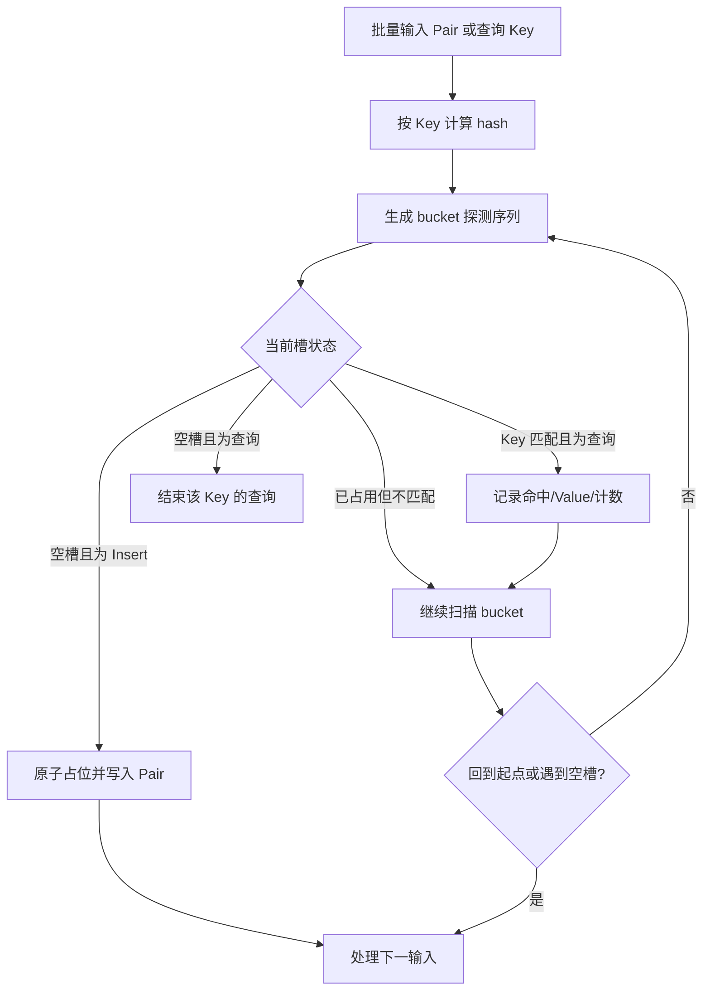
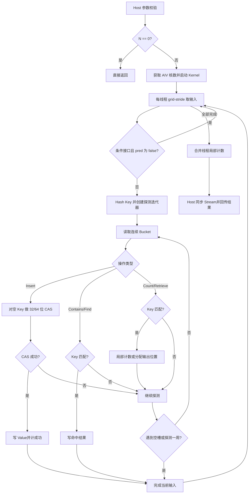

# static_multimap 容器开发方案（Ascend 950）

## 文档信息

| 项目 | 内容 |
| --- | --- |
| 任务名称 | 9 月社区任务——static_multimap 容器开发（950） |
| 文档性质 | 开发方案/设计文档；实现前评审基线 |
| 目标仓库 | `cann/ops-collections` |
| 目标产品 | Ascend 950PR、Ascend 950DT（DAV_3510） |
| 最低 CANN 版本 | CANN 9.0.0-beta.2；实际构建必须使用支持目标 950 型号的配套 CANN/毕昇版本 |
| 编程模型 | C++ Host + Ascend C AIV Kernel + SIMT VF，纯头文件容器 |
| 对标实现 | NVIDIA cuCollections `cuco::static_multimap`（`dev` 分支） |
| 任务输入 | `static_multimap_task_doc.md`、随任务提供的功能与性能测试 |
| 设计依据快照 | `ops-collections` master `9d12996d4317e28420d74bcb1ec4d3b3507599ce`；`cann-ops-competitions` master `bad7e130f01673fbcccc55e4384261b337a0b357` |
| 950 文档基线 | `asc-devkit-dls`，目标架构 `dav-3510` |
| 文档状态 | 方案阶段；本文不声明已编译、已上板或已达到性能指标 |

> 范围说明：本任务是通用容器库开发，不是 TBE 算子迁移，也不通过 ACLNN 注册算子。本文仍逐项覆盖《设计文档 CheckList》；TBE、算子信息库、ACLNN、Host Tiling 和 tilingKey 等不适用项均给出明确原因和替代核对对象。

# 一、需求背景

## 1.1 需求来源

需求来源于 CANN 2026 年 9 月社区任务。目标是在 `ops-collections` 中新增与 cuCollections `static_multimap` 核心语义一致的静态多值键值映射：一个 Key 可以对应多个 Value，容量创建后固定，支持 Host 侧批量接口和 Device 侧引用接口，在 Ascend 950 的 AIV/SIMT 能力上完成构造、析构、清空、插入、条件插入、查询、条件查询、计数和全量检索。

验收范围包括：

1. Key/Value 同型的 `int32_t/int32_t`、`int64_t/int64_t`。
2. Create、Destroy、Clear、Insert、InsertIf、Contains、ContainsIf、Find、FindIf、Count、Retrieve、RetrieveAll。
3. 空输入、重复 Key、重复键值对、不同 multiplicity、命中/未命中、容量边界等泛化场景。
4. 任务书给出的 1086 个展开后功能 case 和 32 个性能 case。
5. 性能不低于标杆的 0.4 倍，即 `T_impl <= T_baseline / 0.4 = 2.5 * T_baseline`。

## 1.2 背景介绍

### 1.2.1 static_multimap 容器实现优化

本任务不涉及历史 TBE 源码。CheckList 中“TBE 源码路径”和“算子信息库路径”的替代核对对象如下。

| 类型 | 路径/来源 | 作用 |
| --- | --- | --- |
| 对标公开接口 | `cuCollections/include/cuco/static_multimap.cuh` | 多值语义、接口顺序、Find/Count/Retrieve 行为 |
| 对标 Device ref | `cuCollections/include/cuco/static_multimap_ref.cuh`、`detail/static_multimap/` | 单线程插入、查找、计数、检索思路 |
| 现有 Host 容器 | `ops-collections/include/static_map.h` | 命名、构造参数、同步接口和纯头文件模式 |
| 现有 Device ref | `ops-collections/include/static_map_ref.h` | Device 侧非持有引用风格 |
| 开放寻址实现 | `ops-collections/include/detail/open_addressing/` | 探测、Kernel 启动、计数器和同步模式 |
| 存储与探测组件 | `ops-collections/include/detail/storages/`、`bucket_storage.h`、`probing_scheme.h` | 容量取整、桶布局、线性/双哈希探测 |
| 类型与原子封装 | `pair.h`、`hash_functions.h`、`utility/atomic_cas_wrap.h` | Pair、Hash、32/64 位 CAS |
| 构建入口 | `ops-collections/CMakeLists.txt`、`scripts/` | 毕昇编译与测试开关 |
| 功能测试输入 | 任务附件 `test-cases/static_multimap/*.cpp` | 公开接口与边界行为的验收契约 |
| 性能测试输入 | 任务附件 `test-cases/benchmark/static_multimap/*.cpp` | 32 个性能场景与参数 |

拟新增或修改的最终仓库文件：

```text
ops-collections/
├── include/
│   ├── static_multimap.h
│   ├── static_multimap_ref.h
│   └── detail/static_multimap/
│       ├── kernels.h
│       ├── static_multimap.inl
│       ├── static_multimap_impl.h
│       └── static_multimap_ref.inl
├── tests/
│   ├── static_multimap/
│   └── performance/static_multimap/
├── docs/static_multimap_API文档和使用示例.md
├── README.md
└── CMakeLists.txt
```

优先复用通用 `Pair`、`Extent`、Allocator、BucketStorage、Hash、KeyEqual 和平台信息获取模块。只有当现有 `OpenAddressingRefImpl` 的“相同 Key 视为 duplicate”行为无法隔离时，才新增 multimap 专用探测实现；禁止修改 `StaticMap` 现有语义来迁就 multimap。

### 1.2.2 参考实现现状分析

#### 1.2.2.1 参考实现支持的数据类型和数据格式

容器元素位于 Device Global Memory，不属于张量算子，不存在 ND/NCHW 等格式。任务验收类型如下。

| 对象 | 类型 | 存储形式 | 本任务约束 |
| --- | --- | --- | --- |
| Key | `int32_t`、`int64_t` | GM 标量数组或 `Pair.first` | 不得等于 `emptyKey` |
| Value | `int32_t`、`int64_t` | GM 标量数组或 `Pair.second` | 与 Key 同型；`emptyValue` 用于 Find 未命中返回 |
| Slot | `Pair<Key, Value>` | 连续 GM 开放寻址表 | I32 为 8B，I64 为 16B |
| Stencil | `uint32_t` | 连续 GM 数组 | 与输入一一对应 |
| Contains 输出 | `unsigned char`/bool 语义 | 连续 GM 数组 | 0=false，非 0=true |
| Count/Size/返回计数 | `std::size_t`/`uint64_t` 语义 | Host 标量，Device 计数器 | 必须防止 32 位溢出 |
| 数据格式 | 不适用 | 一维连续数组 | 指针必须指向 Device 可访问空间 |

`emptyKey` 是保留键。`emptyValue` 不是判定槽是否为空的依据，槽状态只看 Key；因此 Value 可以取普通合法值，但当 Value 等于 `emptyValue` 时，调用者不能仅凭 `Find` 的返回值区分命中和未命中，需配合 `Contains`。实现不得用 Value 哨兵承担 I64 槽发布同步。

#### 1.2.2.2 参考实现逻辑

cuCollections `static_multimap` 是固定容量开放寻址哈希表：

1. 对 Key 计算哈希并生成探测序列。
2. Insert 对空槽执行原子占位；与已存在 Key 相等时不终止探测，因此同一 Key 可写入多个槽，完全相同的 Pair 也可以重复保存。
3. Contains/Find 沿同一探测序列扫描；遇到第一个真正空槽可判定探测结束。Find 只返回某一个匹配 Value，匹配项选择不承诺业务顺序。
4. Count 扫描所有相关槽并累计匹配数；重复查询 Key 会重复计数。
5. Retrieve 对每个查询 Key 输出全部匹配的 `(probeKey, value)`；RetrieveAll 扫描全表并输出所有非空槽。输出顺序不作为接口契约。
6. Clear 把全部槽恢复为空；Size 统计已占用槽数；Destroy 释放持有的 Device 内存。

与 `StaticMap` 的关键差异是：`StaticMap` 在遇到相同 Key 后返回 duplicate，而 `StaticMultimap` 必须继续寻找空槽并保留每一个输入元素。因此只能复用存储和探测基础设施，不能直接调用 `StaticMapRef::Insert`。

#### 1.2.2.3 参考实现流程图



# 二、需求分析

## 2.1 外部组件依赖

| 依赖 | 要求 | 用途 |
| --- | --- | --- |
| CANN Toolkit | 9.0.0-beta.2 及以上，且明确支持目标 950 型号 | ACL Runtime、平台信息、Ascend C 头文件和编译器 |
| 毕昇 ASC/仓库支持的 ccec | 与 CANN 匹配 | 编译 Host 与 AIV/SIMT Kernel |
| CMake | 3.16 及以上 | 构建配置 |
| Catch2 | 3.5.4 及以上 | 功能测试 |
| ACL Runtime | 随 CANN | Device 内存、Stream、Kernel 启动与同步 |

不新增 CUDA、Thrust、TBE、GE、ACLNN、PyTorch 或第三方哈希库依赖。cuCollections 只用于语义和性能对标，不作为编译依赖。

## 2.2 内部适配模块

| 模块 | 设计职责 |
| --- | --- |
| `static_multimap.h` | 持有型 Host 公共类、构造/析构、同步批量接口、类型约束 |
| `static_multimap_ref.h` | 可拷贝的 Device 非持有引用、单条 Insert/Contains/Find/Count/遍历匹配 |
| `static_multimap_impl.h` | 参数检查、内存持有、Kernel 调度、固定大小状态计数器、结果回传 |
| `static_multimap_ref.inl` | multimap 专用探测循环和槽占位逻辑 |
| `kernels.h` | AIV Kernel 入口、SIMT VF、grid-stride 批处理和固定大小原子计数 |
| `BucketStorage`/Allocator | 表空间申请、容量对齐、清空与释放 |
| `ProbingScheme`/Hash/KeyEqual | 保证插入与查询使用完全一致的探测序列 |
| 平台信息模块 | 动态获取可用 AIV 核数和 UB 信息 |
| CMake | `dav-3510`、SIMT 使能、Release/Debug 构建和资源报告开关 |

## 2.3 需求模块设计

### 2.3.1 Host 公共原型

建议接口以任务测试为直接契约，模板参数风格与 `StaticMap` 对齐：

```cpp
template <class Key,
          class T,
          class Extent = aclco::Extent<std::size_t>,
          class KeyEqual = aclco::EqualTo<Key>,
          class ProbingScheme = aclco::LinearProbing<aclco::murmurhash3_32<Key>>,
          class Storage = aclco::Storage<defaultMultimapBucketSize>>
class StaticMultimap {
public:
  using SizeType = typename Extent::ValueType;
  using ValueType = aclco::Pair<Key, T>;

  StaticMultimap(Extent capacity, Key emptyKey, T emptyValue,
                 aclrtStream stream = nullptr);
  StaticMultimap(Extent capacity, Key emptyKey, T emptyValue,
                 KeyEqual const& pred, ProbingScheme const& probingScheme,
                 Storage storage, aclrtStream stream = nullptr);
  ~StaticMultimap();

  void Clear(aclrtStream stream);
  SizeType Insert(void* values, Extent valueNum, aclrtStream stream);
  template <typename StencilT, typename Predicate>
  SizeType InsertIf(void* values, StencilT* stencil,
                    Extent valueNum, aclrtStream stream);
  void Contains(void* keys, void* output, Extent keyNum, aclrtStream stream) const;
  template <typename StencilT, typename Predicate>
  void ContainsIf(void* keys, StencilT* stencil, void* output,
                  Extent keyNum, aclrtStream stream) const;
  void Find(void* keys, void* outputValues, Extent keyNum,
            aclrtStream stream) const;
  template <typename StencilT, typename Predicate>
  void FindIf(void* keys, StencilT* stencil, void* outputValues,
              Extent keyNum, aclrtStream stream) const;
  SizeType Count(void* keys, Extent keyNum, aclrtStream stream) const;
  SizeType Retrieve(void* keys, Extent keyNum,
                    void* outputProbeKeys, void* outputValues,
                    Extent outputCapacity, aclrtStream stream) const;
  SizeType RetrieveAll(void* outputKeys, void* outputValues,
                       Extent outputCapacity, aclrtStream stream) const;
  SizeType Size(aclrtStream stream) const;
  constexpr SizeType Capacity() const noexcept;
};
```

接口语义：

| 接口 | 同步性 | 返回/输出约定 |
| --- | --- | --- |
| 构造（Create） | 初始化排入给定 Stream；首次跨 Stream 使用前需同步 | 实际容量不小于请求容量；0 容量抛异常 |
| 析构（Destroy） | 释放前保证本对象相关工作完成 | RAII；不得在仍有未完成 Kernel 时释放 |
| Clear | 同步 | 清空后 `Size()==0`，可重复调用 |
| Insert | 同步 | 返回插入失败元素数；重复 Key/Pair 均是合法成功插入 |
| InsertIf | 同步 | 仅谓词为 true 的元素参与；返回其中插入失败数 |
| Contains/ContainsIf | 同步 | 每个输入一个布尔结果；谓词 false 固定输出 false |
| Find/FindIf | 同步 | 命中时返回探测序列中的一个匹配 Value；未命中或谓词 false 返回 `emptyValue` |
| Count | 同步 | 返回每个查询 Key 的 multiplicity 之和；重复查询重复累计 |
| Retrieve | 同步 | 输出全部匹配 `(probeKey, value)`，返回实际写出数，顺序不保证 |
| RetrieveAll | 同步 | 输出表内全部 Pair，返回实际写出数，顺序不保证 |
| Size | 同步 | 返回已占用槽数，重复元素逐个计数 |
| Capacity | Host 即时 | 返回取整后的物理槽数 |

`void*` 是仓库现有兼容接口，但实现和 API 文档必须强调类型、长度和 Device 地址由调用者保证。后续如仓库接受强类型重载，可新增而不能破坏上述测试接口。

### 2.3.2 Device 引用原型

`StaticMultimapRef` 持有空槽值、比较器、探测策略和 `BucketStorageRef`，不持有内存。至少提供：

```cpp
template <typename PairLike>
COLLECTION_SIMT_DEVICE bool Insert(PairLike value) noexcept;

template <typename ProbeKey>
COLLECTION_SIMT_DEVICE bool Contains(ProbeKey key) const noexcept;

template <typename ProbeKey>
COLLECTION_SIMT_DEVICE T Find(ProbeKey key) const noexcept;

template <typename ProbeKey>
COLLECTION_SIMT_DEVICE SizeType Count(ProbeKey key) const noexcept;

template <typename ProbeKey, typename Callback>
COLLECTION_SIMT_DEVICE void ForEachMatch(ProbeKey key, Callback& cb) const noexcept;
```

`Insert` 的成功条件是占到一个空槽，而不是“Key 原先不存在”。扫描遇到相同 Key 时必须继续；`ForEachMatch` 在遇到第一个空槽或探测一周后结束。

### 2.3.3 参数校验与异常契约

1. `capacity == 0`：构造失败并抛出 `std::invalid_argument`。
2. `numInputs == 0`：无条件快速返回；允许所有数据指针为 `nullptr`，不得启动 Kernel。
3. `numInputs > 0` 且必需输入/输出指针为空：同步返回值接口按任务测试返回全失败或 0；无返回值接口记录 ACL 错误并不得访问空地址。最终实现前应与仓库统一错误策略对齐，API 文档必须固定行为。
4. 输入 Key 等于 `emptyKey`：定义为非法输入。Debug/测试路径检测并报告；Release 不得把它计为成功插入。
5. `outputCapacity` 小于需要写出的元素数：不得越界。Kernel 用 `idx = AtomicAdd(counter, 1)` 取得逻辑位置，仅当 `idx < outputCapacity` 写出；Host 检测逻辑总数大于容量后报告空间不足。返回值定义为实际写出数，完整所需数通过错误日志/后续状态返回机制报告；若仓库已有异常规范，改为统一异常但不改变“绝不越界”。
6. `StencilT` 与 Predicate 必须可在 SIMT Device 侧实例化，Predicate 返回可转 bool。
7. Stream 必须是有效 ACL Stream；对象跨 Stream 并发读写不保证安全。只读操作可否跨 Stream 并发，在完成数据竞争验证前不承诺。
8. 所有容量、下标和计数内部使用至少 64 位；Kernel 分段处理超过 `uint32_t` 的输入，不能静默截断。

### 2.3.4 与对标能力的约束差异

| 能力 | 本任务设计 | 差异原因 |
| --- | --- | --- |
| Key/Value 类型 | 仅 I32/I32、I64/I64 | 任务验收范围和 950 原子能力边界 |
| Iterator | Device 首地址 + Extent | 对齐 ops-collections 公共风格 |
| 异步 API | 本期公共验收不强制 | 返回计数的接口必须同步回传；可在后续增加 Async |
| Rehash/Reserve/Erase | 不支持 | 静态容量且任务未要求 |
| 自定义 allocator/scope | 沿用仓库可支持部分 | 不复制 CUDA thread scope 模型 |
| Find 多匹配选择 | 固定容器状态下按探测顺序返回首个匹配；不同构建/并发插入不承诺同一 Value | cuCollections 同样不规定选择哪一个匹配 |
| Retrieve 输出顺序 | 不保证，内容多重集必须正确 | 原子分配输出位置，追求并行性能 |
| 后续 SIMT 产品 | 源码保留泛化可能，当前只验收 950PR/950DT | 未验证的平台不得宣称支持 |

# 三、需求详细设计

## 3.1 使能方式

### 3.1.1 用户侧

`ops-collections` 为纯头文件库：

```cpp
#include "static_multimap.h"

aclco::StaticMultimap<int32_t, int32_t> map(
    aclco::Extent<std::size_t>(capacity), emptyKey, emptyValue, stream);
```

容器通过 ACL Stream 启动内嵌 Ascend C Kernel，不注册 ACLNN，不生成算子 JSON，不依赖 TBE/OPP 算子信息库。

### 3.1.2 构建侧

Ascend 950 必须显式选择 DAV_3510 并使能 SIMT：

```cmake
set(CMAKE_ASC_ARCHITECTURES "dav-3510" CACHE STRING "NPU architecture")
set(CMAKE_ASC_ENABLE_SIMT ON CACHE BOOL "Enable SIMT")
```

若当前工程直接给 `bisheng` 传参，则等价要求为：

```text
--npu-arch=dav-3510 --enable-simt
```

当前 `ops-collections` CMake 已传 `--npu-arch=${BISHENG_AICORE_ARCH}`，但基线快照未显式传 `--enable-simt`；实现阶段必须修正并用 verbose build 日志确认最终编译命令。不得为本整数哈希任务启用 `--cce-use-fast-math`、FTZ 或精度放宽选项。用 `--cce-res-usage` 检查寄存器和栈使用。

## 3.2 需求总体设计

### 3.2.1 Host 侧设计

#### 3.2.1.1 分核策略

Host 从平台管理器读取 AIV 核数 `A`，不硬编码物理核数。对输入规模 `N`：

```text
threadsPerBlock = 256（初始候选；以资源报告和实测在 256/512/1024 中择优）
requiredBlocks = ceil(N / threadsPerBlock)
blockNum = min(max(requiredBlocks, 1), A)
globalThread = blockIdx * threadsPerBlock + threadIdx
stride = blockNum * threadsPerBlock
for (i = globalThread; i < N; i += stride) ...
```

选择 256 作为首版候选是因为 3510 在最大线程数不超过 256 时每线程可用寄存器最多，哈希探测包含 64 位 Hash、循环状态和分支，需降低 spill 风险。最终线程数必须以 I32/I64 两条路径的 `--cce-res-usage` 和 950 实测决定。

Clear/RetrieveAll 属于容量 `C` 的线性扫描，按 `C` 分核；Insert/Contains/Find/Count/Retrieve 按输入 `N` 分核。`N==0` Host 直接返回。

#### 3.2.1.2 数据分块和内存优化策略

主数据结构位于 GM：

```text
slotBytes = sizeof(Pair<Key, Value>)           // I32: 8B, I64: 16B
physicalCapacity = MakeValidExtent(requestedCapacity, bucketSize, probingScheme)
tableBytes = physicalCapacity * slotBytes
stateBytes = O(1)                              // size、失败数、输出计数、overflow 标志
```

不为输入复制一份线性 Device 缓冲区。Contains/Find 输出为 `O(N)`，Retrieve 输出由调用者提供，RetrieveAll 输出由调用者提供；容器自身除表外只持有固定大小的哨兵和计数器。

SIMT 哈希探测直接访问 GM，经 128B 粒度 Data Cache。槽连续、Bucket 连续，使同一 Warp 邻近探测尽可能合并访存。首版不申请动态 UB，保留默认至少 32KB、至多 128KB Data Cache；不得把 256KB UB 当作全部可用。若后续增加 UB staging，需满足：

```text
staticUB + dynamicUB + reserved(8KB) + dataCache(>=32KB) <= 256KB
```

负载因子是首要性能变量。任务性能场景为 occupancy=0.5；建议 API 文档提示常规使用不超过 0.8，高负载会显著增加平均探测长度。实际容量向 Bucket/探测策略合法范围上取整。

I64 Pair 为 16B，硬件没有 128 位整槽 CAS。设计采用“Key CAS 占槽 + Value 写入”的两阶段发布，仅用于 Insert Kernel 内部；同步 Insert 返回前 Kernel 已结束，后续查询才可见完整 Pair。若未来支持插入与查询跨 Stream 并发，必须引入独立槽状态或发布哨兵和明确的 acquire/release 协议，本期不宣称该并发能力。

计数器原子优化：每线程先在寄存器累计成功/失败/匹配数，循环结束后最多一次 64 位或分层原子累加，避免 1 亿输入集中争用单地址。若目标原子 API 对 64 位加法支持或性能不足，则使用每 Block 小计 + 第二阶段归约，不允许退回 32 位计数。

#### 3.2.1.3 tilingKey 规划策略

本任务是模板化纯头文件容器直调，不经过算子 Host Tiling 框架，也没有 `TilingData`/`tilingKey`。因此 checklist 的 tilingKey 项不适用。

等价的编译期分派维度为：

- `Key/Value = int32_t`：8B 槽，可使用 64 位整槽 CAS 或 Key CAS；以实测选择。
- `Key/Value = int64_t`：16B 槽，使用 64 位 Key CAS + Value 写入。
- 条件/非条件接口：通过 Predicate 模板实例化，而非运行时分支。
- Insert/Query/Scan：分别使用专用 Kernel，避免热路径携带无关分支。

不得为了满足模板形式虚构 tilingKey。若仓库后续统一引入 Kernel 策略枚举，应在不改变公共 ABI 的前提下增加。

#### 3.2.1.4 生命周期和 Stream

1. 构造：校验容量，分配表、哨兵和固定计数器；在给定 Stream 清表并清零 size。
2. 同步批量接口：参数快检 → 清零临时计数 → 启动 Kernel → `aclrtSynchronizeStream` → 回传结果/错误。
3. Clear：把槽 Key/Pair 恢复为空并把 size 置 0；必须可幂等调用。
4. 析构：对象不可复制、可移动。释放前必须保证其相关 Stream 工作完成；移动后源对象为空且析构安全。
5. ACL 错误不得只打印后继续伪装成功；采用仓库统一异常/错误封装向调用者传播。

### 3.2.2 Kernel 侧设计

#### 3.2.2.1 Kernel 实现描述

**Insert/InsertIf**

每个 SIMT 线程处理一个或多个输入 Pair。若条件接口的 Predicate 为 false，直接跳过。对 Key 计算 Hash 并遍历 Bucket：

1. 若 Key 是 `emptyKey`，记失败。
2. 对空槽的 Key 做原子 CAS。
3. CAS 成功：写 Value；成功计数加一。相同 Key 或相同 Pair 不视为 duplicate。
4. CAS 失败或槽已占用：继续探测，不因 Key 相同而停止。
5. 探测一周未找到空槽：记失败。
6. Kernel 末将本线程局部计数合并至固定计数器；Host 用成功数更新 size。

**Contains/Find/ContainsIf/FindIf**

按查询 Key 生成相同探测序列。遇到 Key 相等即命中；Contains 写 true，Find 返回探测顺序中的第一个匹配 Value。遇到真正空槽或回到起点则未命中；条件接口 Predicate 为 false 时直接写 false/`emptyValue`。每个输入输出位置固定，不使用原子。

**Count**

每个查询 Key 扫描至真正空槽或探测一周，统计所有 Key 相等的槽。同一查询数组内重复 Key 独立统计。线程局部累计后再原子合并，最终结果为所有查询 multiplicity 的总和。

**Retrieve**

每个查询 Key 扫描全部匹配槽。每个匹配通过原子递增逻辑输出计数器取得输出位置，位置小于 `outputCapacity` 时写 `outputProbeKeys[idx]=queryKey`、`outputValues[idx]=slot.value`；否则仅设置 overflow。Kernel 必须继续得到完整逻辑计数以便 Host 判断容量不足。输出顺序不保证，内容按多重集比较。

**RetrieveAll**

对 `[0, capacity)` 做 grid-stride 扫描。非空槽通过原子/分层 prefix 分配输出位置并拆分写 Key/Value。首版可用原子计数保证正确性；性能不达标时改为“两阶段 block 计数 + prefix + 无冲突写出”，不得产生与表等大的额外副本。

**Clear**

对全表连续写 `emptySlot`，适合复用现有 SIMD Clear 或专用连续写 Kernel。I64 Pair 必须同时恢复 Key 和 Value，不能只清 Key 后让 `Find` 未命中值不确定。清表完成后 size 置 0。

**Size**

优先维护 64 位成功插入计数，避免每次 Size 扫全表。Insert/InsertIf 完成后增加成功数，Clear 清零。计数更新与表写入在同一 Stream 顺序中完成。

#### 3.2.2.2 Ascend C 实现流程图



#### 3.2.2.3 与 cuCollections 流程的差异及原因

| 差异 | Ascend 方案 | 原因 |
| --- | --- | --- |
| Kernel 入口 | Host `<<<blockNum, dynUb, stream>>>` 启动 AIV Kernel，Kernel 用 `asc_vf_call`/仓库封装进入 SIMT VF | 3510 SIMD+SIMT 混合调用层级要求 |
| 并行组织 | AIV block + SIMT thread，首版 256 threads/block 候选 | 3510 寄存器预算与 spill 风险 |
| GM 访问 | 经 128B 粒度 SIMT Data Cache | 3510 硬件内存层级 |
| 槽原子 | I32 可 64 位整槽 CAS；I64 采用 Key CAS + Value 发布 | 3510 原子类型支持，不假设 128 位 CAS |
| 输出迭代器 | Device 指针 + Extent/容量 | ops-collections 公共接口约定 |
| 输出容量 | 显式 `outputCapacity` 并做 overflow 防护 | `void*` 无法推导缓冲区长度，必须避免越界 |
| 状态回传 | Device 固定计数器 + Stream 同步 | Host 需要失败数、Size 和检索数 |
| 动态共享内存 | 首版为 0，优先保留 Data Cache | 哈希访问离散，GM Cache 比 UB staging 更直接 |
| Cooperative Group | 首版每线程独立探测 | 仓库当前 SIMT 基础模式；后续按性能再评估 Warp 协作 |

### 3.2.3 原子性、可见性和确定性

1. 同一个槽只能由一个线程从 `emptyKey` CAS 成功；其他线程继续探测。
2. I32 8B Pair 若采用整槽 CAS，Key/Value 原子发布；I64 16B Pair 在 Insert Kernel 内两阶段发布，Host 同步后才允许查询。
3. 本期支持“同一 Stream 上批量操作顺序一致”；不支持 Insert 与 Query 在不同 Stream 无同步并发。
4. 对固定容器内存状态，Contains、Count、Find 的探测顺序确定；Find 返回第一个匹配。并行插入导致的槽布局和 Retrieve 输出顺序不作为稳定 ABI。
5. 验证多值内容时按多重集比较，不能用输出物理顺序判错。

## 3.3 支持硬件

| 硬件 | 架构标识 | 状态 |
| --- | --- | --- |
| Ascend 950PR | `ASCEND950` / `dav-3510` / `__NPU_ARCH__ == 3510` | 本任务必须支持和验收 |
| Ascend 950DT | `ASCEND950` / `dav-3510` / `__NPU_ARCH__ == 3510` | 本任务必须支持和验收 |
| 后续支持 SIMT 的昇腾产品 | 由对应产品架构决定 | 仅保留源码可移植性，不在本期宣称已验证 |
| 2201、3002 等其他架构 | 非 3510 | 不在本方案支持范围 |

3510 相关约束：AIC:AIV=1:2；SIMT 运行在 AIV；UB 总容量 256KB，其中混合/SIMT 场景须预留 32KB~128KB Data Cache 和默认 8KB 预留空间；SIMT 每次对外访存以 128B 为粒度。

## 3.4 容器约束限制

1. 只支持 `Key==Value==int32_t` 或 `Key==Value==int64_t` 的验收组合。
2. 容量创建后固定，不自动扩容，不支持 Rehash、Reserve 和 Erase。
3. `emptyKey` 为保留值，不得插入；0 容量非法。
4. 实际容量可能因 Bucket/探测策略向上取整，`Capacity() >= requested`。
5. 输入、输出、stencil 必须是 Device 可访问的连续内存，元素数必须与 Extent 一致。
6. `Find` 仅返回一个匹配 Value；如需全部匹配必须使用 Retrieve。
7. `Find` 未命中返回 `emptyValue`；Value 恰好等于 `emptyValue` 时需用 Contains 区分。
8. Retrieve/RetrieveAll 输出顺序不保证；输出容量不足必须报告，绝不截断后伪装成功。
9. 对同一对象的跨 Stream 并发修改、读写并发和析构并发不支持；调用者必须建立 Stream 依赖。
10. 极高负载因子会导致探测长度和时延显著上升；表满后 Insert 返回失败数。
11. 单次输入若超过 Kernel 32 位索引范围，Host 必须分段启动；不得截断。
12. Predicate 必须是 Device 可调用、无依赖 Host 状态的轻量函数对象。

# 四、特性交叉分析

| 特性 | 影响分析 | 设计措施 | 验证 |
| --- | --- | --- | --- |
| I32/I64 | 槽宽和原子发布不同 | 两条模板实例化路径；I64 禁止假设 128 位 CAS | 两种 dtype 全接口 |
| multiplicity | 相同 Key/Pair 必须重复保存 | 相同 Key 不结束 Insert 探测 | 1/2/4/8 及重复 Pair |
| occupancy | 决定探测长度 | 容量取整、满表终止、建议上限 | 0/0.1/0.5/0.9/1.0 |
| matching rate | 决定查询早停和输出规模 | 空槽早停、满表一周终止 | 0/0.1/0.5/1.0 |
| 空输入 | 空指针也必须安全 | Host 快速返回，不启动 Kernel | 所有接口 zero extent |
| Stream | 生命周期和可见性 | 同步接口明确同步；跨 Stream 需用户依赖 | 连续调用、Clear 后重插 |
| 大容量 | 100M 元素和 64 位计数 | 64 位 size/index；分段启动 | I32/I64 100M 性能 case |
| Data Cache | 离散 GM 访问性能核心 | 不占用不必要 UB；观察 cache miss | Profiling/性能扫描 |
| 分支发散 | 探测长度不同 | Bucket 连续访问、控制流简化 | 不同负载/命中率 |
| 寄存器 | 1024 threads 时每线程仅 32 个寄存器 | 256 首选、资源报告后调优 | `--cce-res-usage` |
| 兼容性 | 现有 StaticMap 不得回归 | 独立实现/最小公共抽取 | 全仓回归测试 |
| 错误处理 | `void*` 易误用 | Host 参数快检、容量参数、错误传播 | null/0/容量不足 |
| 安全 | 越界和整数溢出 | checked multiply、输出上界、64 位计算 | 边界与 sanitizer/静态检查 |

# 五、可维可测分析

## 5.1 精度标准/性能标准

### 5.1.1 功能标准

整数容器不存在浮点容差。以下结果必须精确一致：

- Insert/InsertIf 成功与失败数；
- Size 和 Capacity；
- Contains/ContainsIf 布尔数组；
- Find/FindIf：未命中严格等于 `emptyValue`，命中值必须属于该 Key 的 Value 多重集；
- Count：所有查询 Key 的 multiplicity 总和；
- Retrieve/RetrieveAll：返回数量和 `(Key, Value)` 多重集完全相同，比较前允许排序；
- 相同容器状态下重复调用结果内容一致，未承诺的输出顺序不作为标准。

功能测试采用任务提供的 Catch2 用例，按 dtype、`GENERATE` 和 `SECTION` 展开后共 1086 case：Create 14、Destroy 18、Clear 32、Insert 290、InsertIf 20、Contains 100、ContainsIf 56、Find 100、FindIf 56、Count 100、Retrieve 98、RetrieveAll 202。

### 5.1.2 性能标准

验收公式：

```text
performance_ratio = T_baseline / T_impl
pass <=> performance_ratio >= 0.4
     <=> T_impl <= 2.5 * T_baseline
```

必须覆盖任务书全部 32 个性能场景：Create/Destroy 4 个，Insert/RetrieveAll 4 个，Contains/Find/Retrieve/Count 在 3 档 MatchingRate 下 24 个。测试规模为 100,000,000，occupancy=0.5，multiplicity=1。

| 接口 | I32 最大允许时延（ms） | I64 最大允许时延（ms） | MatchingRate |
| --- | ---: | ---: | --- |
| Create | 19.088530 | 38.549508 | - |
| Destroy | 22.596903 | 44.415178 | - |
| Insert | 24.962168 | 34.985320 | - |
| RetrieveAll | 3.672773 | 8.554383 | - |
| Contains | 17.938978 / 17.190395 / 15.681630 | 22.657220 / 22.269248 / 21.745708 | 0.1 / 0.5 / 1.0 |
| Find | 19.606198 / 19.186355 / 17.663425 | 24.270223 / 23.917183 / 23.251730 | 0.1 / 0.5 / 1.0 |
| Retrieve | 30.138850 / 32.596240 / 33.689373 | 36.049475 / 39.412053 / 41.065493 | 0.1 / 0.5 / 1.0 |
| Count | 14.670478 / 14.936308 / 15.243933 | 21.782223 / 22.095158 / 22.464738 | 0.1 / 0.5 / 1.0 |

性能测量要求：Release 构建，固定 CANN/固件/驱动/设备型号与频率策略；预热后重复采样，报告 median、p90、最小值、样本数；同步边界必须与测试框架一致；Create/Destroy 是否包含分配释放必须与任务基线一致。失败项记录 Hash 探测长度、负载因子、Kernel 数量、原子冲突、Data Cache、寄存器/栈和 Host 同步开销，禁止只给“波动”结论。

## 5.2 兼容性分析

1. 新增 `StaticMultimap`，不改变 `StaticMap`、`StaticSet` 的公共语义和默认模板参数。
2. 复用公共组件时必须跑全仓功能回归，尤其是 open_addressing、probing、storage 和 utility 测试。
3. 公共头文件新增后更新安装/导出规则和 README；用户只需 include，不增加链接依赖。
4. CANN 9.0.0-beta.2 是任务最低版本，但设计核对使用了较新 3510 文档。实现使用的每个 SIMT API、重载、dtype、地址空间和原子类型必须在实际验收 CANN 版本再次核对；不允许用较新接口破坏最低版本。
5. 当前 9.1.0-beta.1 API 约束索引中 `asc_atomic_cas`/原子加法支持 32/64 位整数 GM 操作，但产品命名与 950 文档可能不同；最终以目标 CANN 包的声明、实现和 950 样例编译为准。

## 5.3 可维护性与可观测性

- 公共 API 注释写明同步性、指针空间、返回计数、空输入、哨兵和输出容量。
- Debug 构建保留关键参数检查；性能测试关闭 printf/Dump，避免调测初始化污染时延。
- 构建日志保存完整编译参数；资源报告保存每个 Kernel 的寄存器、栈和 UB 使用。
- 测试日志按功能/性能、dtype、接口和 case 参数命名；性能原始样本可追溯。
- 代码中仅对 16B 槽发布、探测终止和输出 overflow 等硬件/正确性关键点添加注释。

# 六、开发实施计划

## 6.1 阶段与出口条件

| 阶段 | 工作项 | 出口条件 |
| --- | --- | --- |
| P0 基线冻结 | 确认目标 CANN、950 型号、ops-collections commit、任务测试版本 | 版本和构建命令写入记录 |
| P1 API/骨架 | 新增两个公共头和 detail 目录，完成 RAII/移动语义/参数校验 | Host 编译通过，公共签名匹配测试 |
| P2 Device ref | 完成 multimap 探测、I32/I64 插入发布、Contains/Find/Count | Device 最小编译；API 证据表完成 |
| P3 Bulk Kernel | InsertIf、Retrieve、RetrieveAll、Clear、Size 和计数器 | 单接口基本 case 通过，无越界 |
| P4 功能验证 | 接入任务测试并补必要的仓库回归 | 1086/1086；全仓相关回归通过 |
| P5 性能调优 | 线程数、Bucket、探测、原子聚合、RetrieveAll 两阶段方案 | 32/32 达到 0.4× 标杆 |
| P6 文档交付 | API 文档、示例、README、自测报告、日志 | 交付件齐全并完成 checklist |
| P7 PR | 设计 PR 和代码 PR，签 CLA，触发构建 | `/compile` 通过、评审问题关闭 |

## 6.2 API 证据记录模板

对每个新使用的 Ascend C/Runtime API 建立记录：

| API | 文档路径 | include 声明 | impl/架构分支 | 950 测试/样例 | 选中重载与约束 |
| --- | --- | --- | --- | --- | --- |
| 32/64 位 atomic CAS | SIMT 原子接口文档 | 目标 CANN `simt_api/device_atomic_functions.h` | DAV_3510 实现 | 950 SIMT atomic case | GM 地址；I32/I64 Key |
| 32/64 位 atomic add | SIMT 原子接口文档 | 同上 | DAV_3510 实现 | 950 SIMT atomic case | 计数器位宽及地址空间 |
| SIMT VF 调用 | 混合编程 Kernel/VF 文档 | `simt_api/common_functions.h`/聚合头 | 3510 | hybrid example | 线程数与参数寄存器预算 |
| Block/Thread 索引 | SIMT 编程文档 | 目标头文件 | 3510 | quickstart | grid-stride 边界 |
| ACL 内存/Stream | Runtime API | ACL 头文件 | 目标 Runtime | 仓库 guard/allocator | 错误码和同步语义 |

找不到精确声明或 950 支持证据时，该 API 不得进入实现。

## 6.3 验证命令模板

以下仅是目标环境模板，本文未在本机执行成功性验证：

```bash
cmake -S . -B build \
  -DCMAKE_BUILD_TYPE=Release \
  -DBUILD_TESTS=ON \
  -DBUILD_PERFORMANCE=ON \
  -DBISHENG_AICORE_ARCH=dav-3510 \
  -DCMAKE_ASC_ENABLE_SIMT=ON \
  -DCatch2_DIR=<catch2-cmake-dir>
cmake --build build -j
ctest --test-dir build --output-on-failure -R static_multimap
```

必须从 verbose 输出确认存在 `--npu-arch=dav-3510 --enable-simt`。功能验证后再运行仓库规定的 performance runner，并保存 32 个场景的原始数据。

## 6.4 风险与对策

| 风险 | 等级 | 对策/停止条件 |
| --- | --- | --- |
| I64 16B Pair 发布期间被并发读取 | 高 | 本期禁止跨 Stream 并发读写；若需求扩大则增加槽状态协议 |
| Count/Retrieve 原子热点 | 高 | 线程局部聚合；必要时 block 分层归约/prefix |
| 高 occupancy 探测退化 | 高 | 满表一周终止；容量建议；负载扫描 |
| 64 位计数 API/性能 | 高 | 目标包编译证据；不支持时使用分层 32 位局部 + 64 位 Host 合并，保证无溢出 |
| 当前 CMake 缺少 SIMT 开关 | 高 | 显式加入并检查实际编译命令 |
| 任务书“确定可重复”与 Retrieve 无序 | 中 | 明确内容多重集确定、物理顺序不承诺；测试按排序比较 |
| 任务最低 CANN 与较新文档不一致 | 高 | 在最低版本和验收版本双编译；API 逐项证据化 |
| 100M I64 内存压力 | 高 | 启动前 checked size 计算；记录表/输入/输出峰值；避免线性副本 |
| `void*` 类型误用 | 中 | 文档、静态模板重载和 Debug 校验；不做越界类型猜测 |
| 性能基线测量口径不同 | 中 | 与任务 runner 保持同步边界、预热和统计方法一致 |

# 七、交付件与 PR 计划

## 7.1 交付件

1. 设计文档：按社区模板提交至对应任务目录的团队 `docs/design.md`。
2. 容器代码：`include/static_multimap.h`、`include/static_multimap_ref.h`、`include/detail/static_multimap/`。
3. 功能测试：`tests/static_multimap/`，完整接入任务提供用例。
4. 性能测试：将附件 `test-cases/benchmark/static_multimap/` 映射到仓库规范 `tests/performance/static_multimap/`。
5. API 文档和使用示例：`docs/static_multimap_API文档和使用示例.md`。
6. README 更新：支持容器、构建、运行、复现和限制。
7. 自测报告：环境、commit、命令、1086 功能结果、32 性能原始值/比率、失败分析和日志链接。
8. 待验收代码地址：个人仓、分支、目录；邀请 `Ascend-CANN` 为开发者。

## 7.2 PR 要求

- 设计文档 PR 标题：`【社区任务】static_multimap 容器设计文档`。
- 设计文档必须以 PR 而非 Issue 提交到 `cann/cann-ops-competitions` 的对应 tasklist 目录。
- 代码 PR 提交到 `cann/ops-collections`，不在仓库根目录新建独立算子工程。
- 提交前签署 CLA；PR 评论 `/compile` 并确保构建通过。
- PR 描述列出功能、精度/正确性、性能、内存和兼容性结果；未执行项不得写成通过。

# 八、设计文档 CheckList 逐项闭环

| 原行号 | 审核项 | 本文覆盖位置 | 结论/说明 |
| ---: | --- | --- | --- |
| 2 | 设计文档 PR 提交位置、PR/CLA/`/compile` | 7.2 | 已规划；实际提交时执行 |
| 3 | PR 标题 | 7.2 | `【社区任务】static_multimap 容器设计文档` |
| 4 | 1.1 需求来源 | 1.1 | 已覆盖社区任务来源和验收范围 |
| 5 | 1.2.1 TBE 源码/信息库路径 | 1.2.1 | 不适用 TBE；已列 cuCollections 与 ops-collections 替代路径及文件名 |
| 6 | 1.2.2.1 TBE dtype/format | 1.2.2.1 | 不适用 TBE；已列容器 I32/I64、槽布局和无张量格式原因 |
| 7 | 1.2.2.2 TBE 实现描述 | 1.2.2.2 | 已用对标 cuCollections 实现逻辑替代并详细描述 |
| 8 | 1.2.2.3 TBE 流程图 | 1.2.2.3 | 已提供参考实现流程图 |
| 9 | 2.1 外部组件依赖 | 2.1 | 已覆盖版本、用途和不新增依赖 |
| 10 | 2.2 内部适配模块 | 2.2 | 已覆盖公共头、实现、Kernel、存储、构建 |
| 11 | 2.3.1 AscendC 算子原型 | 2.3.1、2.3.2 | 本任务为容器；已给 Host/Device 完整原型 |
| 12 | 2.3.1 AscendC 相关约束/缺失功能 | 2.3.3、2.3.4、3.4 | 已列错误契约、对标差异和限制 |
| 13 | 3.1 使能方式/ACLNN | 3.1 | 不走 ACLNN；已说明 include、Stream 直调和构建使能 |
| 14 | 3.2.1.1 分核策略 | 3.2.1.1 | 已给公式、核数来源、线程候选和边界 |
| 15 | 3.2.1.2 分块/LocalMemory | 3.2.1.2 | 已给容量/内存公式、GM 布局、UB/Data Cache 预算 |
| 16 | 3.2.1.3 tilingKey | 3.2.1.3 | 不适用；已说明原因和等价模板分派 |
| 17 | 3.2.2.1 Kernel 描述 | 3.2.2.1 | 已逐接口描述 |
| 18 | 3.2.2.2 AscendC 流程图 | 3.2.2.2 | 已提供 Mermaid 流程图 |
| 19 | 3.2.2.3 与 TBE 差异 | 3.2.2.3 | 不适用 TBE；已与 cuCollections 参考流程逐项比较 |
| 20 | 3.3 支持硬件 | 3.3 | 与任务书 950 范围一致，未外推其他架构 |
| 21 | 3.4 约束限制 | 3.4 | 已覆盖 dtype、容量、哨兵、指针、Stream、输出等 |
| 22 | 四、特性交叉分析 | 第四章 | 已覆盖 dtype/负载/命中/空输入/缓存/兼容/安全 |
| 23 | 5.1 精度/性能标准 | 5.1 | 正确性精确对标；性能 ≥0.4×，列出全部阈值和 case 数 |
| 24 | 5.2 兼容性分析 | 5.2 | 已覆盖现有容器回归、头文件集成和 CANN 版本兼容 |

# 九、参考资料

1. 任务附件：`static_multimap_task_doc.md`。
2. 任务附件：`test-cases/static_multimap/`、`test-cases/benchmark/static_multimap/`。
3. CANN 社区任务设计模板：`cann-ops-competitions/04_tasks/01_community-task-2026/resources/design_template.md`。
4. ops-collections：<https://gitcode.com/cann/ops-collections>。
5. cuCollections static_multimap：<https://github.com/NVIDIA/cuCollections/blob/dev/include/cuco/static_multimap.cuh>。
6. 本地 950 架构文档：`asc-devkit-dls/docs/zh/guide/programming_guide/advanced_programming/hardware_implementation/architecture_spec/npu_arch_3510.md`。
7. 本地 SIMT/混合编程文档：`asc-devkit-dls/docs/zh/guide/programming_guide/programming_model/ai_core_simt_programming/`、`advanced_programming/advanced_ai_core_programming_model/simd_simt_hybrid_programming/`。
8. 本地编译文档：`asc-devkit-dls/docs/zh/guide/programming_guide/compilation_and_execution/operator_compilation/ai_core_operator_compilation.md`。
9. 本地 Ascend C 9.1.0-beta.1 API 约束索引：`docs/ascendc_api_ref_9_1_0_beta_1_01_ai/api_constraints.jsonl`。

