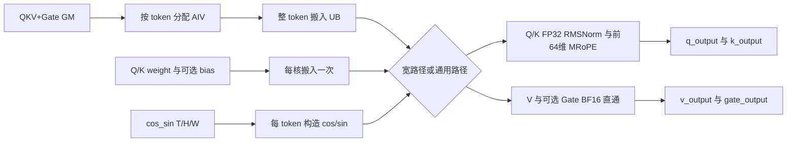
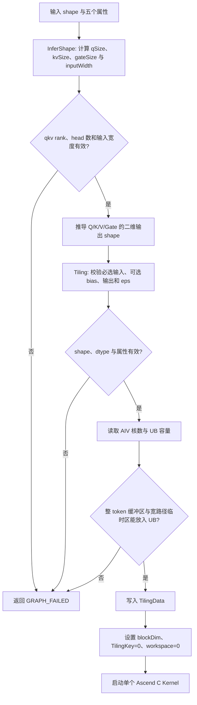
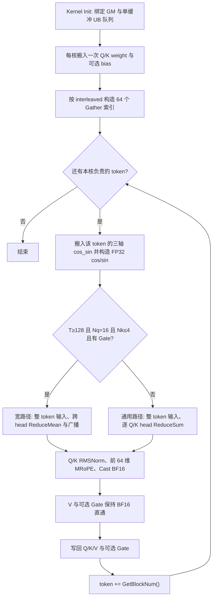
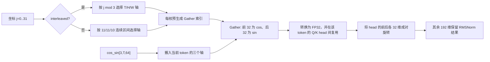

# SplitQkvRmsnormMrope 算子设计文档

## 需求背景（required）

### 需求来源

Qwen3-VL 系列模型在视觉语言推理中，需要将线性层输出的 QKV+Gate 融合张量拆分为 Q、K、V 和 Gate，对 Q/K 按 head 执行 RMSNorm，再对 Q/K 的前 64 维执行 temporal/height/width 三轴 MRoPE。当前 vLLM Ascend 通过 Triton Kernel `split_qkv_rmsnorm_mrope_kernel` 融合完成上述过程。

本任务要求使用 Ascend C 重新实现该融合算子，在保持输出语义与 PyTorch NPU Golden 一致的前提下，通过 Vector Core 并行、GM/UB 分块、参数复用与搬运计算流水，将整体时延降低到 Triton 基线的 50% 以下。

任务页：<https://www.hiascend.com/activities/task-center/details/21928ae613c14c828420253070a0bde4?menu=tasks>。算子代码目标仓库为 `cann/ops-transformer`；设计文档按任务书以 PR 提交至当前官方仓库 `cann/cann-ops-competitions` 的 `04_tasks/01_community-task-2026/tasklist`，放在对应算子任务与实际团队目录下的 `docs/design.md`。设计输入包括下载任务书、`op.json`、`case.json`、`golden.py` 和 [vLLM Ascend Triton 实现](https://github.com/vllm-project/vllm-ascend/blob/main/vllm_ascend/ops/triton/linearnorm/split_qkv_rmsnorm_mrope.py)。首版验收语义以任务包中的可执行接口与 Golden 为准；任务中心页面与下载任务书的硬件标注不一致，本设计保留 A2/A3 双平台编译与验证路径，最终性能验收平台需由任务发布方确认。

### 背景介绍

#### 当前 Triton 实现分析

参考实现对每个 token 执行以下流程：

1. 从 QKV+Gate 融合张量中读取 Q/Gate、K 和 V。
2. 将 Q 和 K 转为 FP32，按 head 在 256 维上计算 RMSNorm。
3. 按 `mrope_section=[11,11,10]` 选择每个旋转坐标应使用的 T/H/W 轴 cos/sin。
4. 对 Q/K 的前 64 维执行 half/NeoX 形式的 RoPE，保留后 192 维 RMSNorm 结果。
5. 写回 Q、K，并将 V/Gate 原样写回对应输出。

Triton 版本已经是单 Kernel 融合实现，因此 Ascend C 版本不能仅依靠减少 Kernel Launch 数量达成 2 倍性能目标，还需重点优化：

- 小 token 场景下的 head 级并行度；
- 大 token 场景下的有效 GM 带宽与流水；
- 同一 token 内 Q/K head 对三轴 cos/sin 数据的复用；
- Q/Gate 和 K/V 对应工作单元的联合搬运；
- 256 维 FP32 RMSNorm reduction 中的同步与中间数据开销。

#### 任务包与验证边界

| 轨道 | 当前状态 | 边界 |
| --- | --- | --- |
| 设计文档 | 设计 PR 评审 | 已覆盖官方模板必填章节和任务包语义；本 PR 仅提交设计文档，评审结论以仓库实际状态为准 |
| Ascend C 实现 | 已推送，继续校准 | 个人仓分支 `feat/split-qkv-rmsnorm-mrope` 的提交 `eaaa35b18a0a21f798e0261cd28408201ea060b0` 包含 Host、Kernel、ACLNN 实机样例、Golden 对照脚本和 README；A3 `ascend910_93` 已编译安装，A2 `ascend910b` 已交叉编译，尚未完成 A2 实机及正式验收 |
| 实机验证 | 部分通过，未达验收 | HiDevLab `SplitQkvA3C91` 为 A3/CANN 9.1.0，实测 SoC 为 `Ascend910_9382`；合成 T=1、T=16 与任务 Golden 的四路输出完全一致，T=128 的 Q 仍有 2/524288 个 BF16 舍入分界点超过绝对误差 `1e-3`；T=8192 内核事件中位数多次测量约 340～356 μs，高于任务目标 `<334.7495 μs` |
| 外部流程 | 设计与代码轨道独立 | 本 PR 不包含算子代码；代码 PR 与任务中心验收状态需分别核对 |

以下实现描述以个人仓上述提交为基线。A3 开发期结果摘要保存在该提交的 `tests/evidence/a3_20260923/RESULTS.md`；原始构建与逐 case 日志仍在代码工作目录，尚未纳入已推送提交。设计评审、正式自测和代码验收应分别核对，不以该摘要代替验收报告。

任务包提供以下内容：

| 文件 | 作用 |
| --- | --- |
| `op.json` | 定义 6 个输入、4 个输出和 5 个属性 |
| `golden.py` | 定义 Q/Gate 布局、FP32 RMSNorm、MRoPE 轴选择与输出语义 |
| `case.json` | 定义 7 条正式验收 shape、输出阈值与性能基线 |
| 任务书 | 定义交付件、硬件/CANN 要求、精度与性能目标 |

任务包未提供 Ascend C 实现。`case.json` 中 7 条用例各有 QKV 与 cos/sin 两个非空 `data_path`，共 14 个 `.bin` 路径，ZIP 均未附带。开发阶段需按相同 shape 和值域生成可复现数据，验收时以验收环境提供或工具生成的正式数据为准。

#### SplitQkvRmsnormMrope 算子功能分析

设 `T=num_tokens`、`Nq=num_q_heads`、`Nk=num_kv_heads`、`D=256`，则：

```text
q_size    = Nq * D
kv_size   = Nk * D
gate_size = has_gate ? q_size : 0
input_dim = q_size + gate_size + 2 * kv_size
```

`has_gate=true` 时，Q/Gate 不是两段整体连续区域，而是每个 Q head 后紧跟一个 Gate head：

```text
[Q_head0(256) | Gate_head0(256) | ... | Q_headN(256) | Gate_headN(256) | K | V]
```

Q/K head 之间无数据依赖，具备进一步按 `(token, head)` 分核的可能。当前实现按 token 分核，在单核内处理该 token 的全部 Q/K head；Gate 与 Q head 在输入中相邻，V 与 K head 具有相同 head 索引，因此均可从整 token 输入缓冲区直接拆分，避免额外的 GM Split 遍历。

## 需求分析（required）

### 需求描述

在不改变任务包接口与 Golden 语义的前提下，在 `cann/ops-transformer` 中新增 `SplitQkvRmsnormMrope` 融合算子，完成 QKV+Gate 拆分、Q/K RMSNorm 和三轴 MRoPE。实现需使用 Ascend C，适配 CANN 9.1.0 及以上版本，支持任务指定 BF16、动态 token 数和 Q/KV head 组合，在最终确认的验收机型上达到 Q/K 最大误差小于 `1e-3`、V/Gate 精确直通，以及时延小于同口径 Triton baseline 50% 的目标。

### 接口与参数分析

#### 输入、输出和属性

以 `op.json` 为首版接口契约，输入顺序为 `qkv, q_weight, k_weight, cos_sin, q_bias, k_bias`。

| 名称 | 类型 | 参数类型 | 格式 | Shape | 说明 |
| --- | --- | --- | --- | --- | --- |
| `qkv` | BF16 | 必选输入 | ND | `[T,input_dim]` | 融合 QKV+Gate 输入 |
| `q_weight` | BF16 | 必选输入 | ND | `[256]` | Q RMSNorm weight |
| `k_weight` | BF16 | 必选输入 | ND | `[256]` | K RMSNorm weight |
| `cos_sin` | BF16 | 必选输入 | ND | `[3,T,64]` | T/H/W 三轴 cos/sin；前 32 为 cos，后 32 为 sin |
| `q_bias` | BF16 | 可选输入 | ND | `[256]` | Q RMSNorm 仿射 bias |
| `k_bias` | BF16 | 可选输入 | ND | `[256]` | K RMSNorm 仿射 bias |
| `q_output` | BF16 | 必选输出 | ND | `[T,q_size]` | RMSNorm+MRoPE 后的 Q |
| `k_output` | BF16 | 必选输出 | ND | `[T,kv_size]` | RMSNorm+MRoPE 后的 K |
| `v_output` | BF16 | 必选输出 | ND | `[T,kv_size]` | V 原样输出 |
| `gate_output` | BF16 | 必选输出 | ND | `[T,gate_size]` | Gate 原样输出；无 Gate 时末维为 0 |

| 属性 | 类型 | 默认值 | 说明 |
| --- | --- | --- | --- |
| `num_q_heads` | int | 16 | Q head 数 |
| `num_kv_heads` | int | 4 | K/V head 数 |
| `eps` | float | `1e-6` | RMSNorm epsilon |
| `interleaved` | bool | true | T/H/W 轴坐标是否交织 |
| `has_gate` | bool | true | 输入是否包含 Gate |

#### 支持范围

| 维度/属性 | 首版支持范围 | 依据 |
| --- | --- | --- |
| `T` | 正式用例覆盖 1、16、128、2048、8192 | `case.json` |
| `Nq` | 正式用例为 16 | `case.json` |
| `Nk` | 正式用例为 2、4 | `case.json` |
| `head_size` | 固定 256 | 任务书、Golden |
| `rope_dim` | 固定 64 | 任务书、Golden |
| `mrope_section` | 固定 `[11,11,10]` | 任务书、Golden；当前接口无独立属性 |
| `interleaved` | true/false | 任务书、`op.json` |
| `has_gate` | true/false | `op.json`、Golden |
| bias | Q/K bias 分别可选 | `op.json`、Golden；上游 Triton 的单边 bias 路径存在限制 |

### 需求拆解

1. **算子原型与推导**：注册 6 输入、4 输出和 5 属性，实现 shape/dtype 推导。
2. **Host 校验**：校验 rank、dtype、shape、head 数、`eps`、各可选 bias 与整数溢出。
3. **Split 与直通输出**：按 head 交织布局拆分 Q/Gate，正确定位 K/V，V/Gate 按 BF16 bit pattern 原样搬运。
4. **Q/K RMSNorm**：以 FP32 累加 256 维平方和，完成归一化、weight 与可选 bias。
5. **MRoPE**：选择 T/H/W 三轴 cos/sin，支持交织和非交织轴分配，仅替换前 64 维。
6. **精度验证**：覆盖 7 条正式 case，补充双边/单边 bias、无 Gate、非交织及非法输入测试。
7. **性能验证**：按任务书给定的 7 条 Triton baseline/2 目标验收，并记录在最终验收机型上同口径重测的 Triton 数据。
8. **工程交付**：提供 ACLNN 接口、算子 README、自测用例和可复现脚本、自测报告与原始日志；按任务书准备设计文档 PR、个人仓代码地址和 `task_submission` 交付目录。

### 交付件与证据

| 任务书交付件 | 设计/验证落点 |
| --- | --- |
| 算子设计文档 | 按官方模板编写，在社区任务仓以设计 PR 提交并完成评审 |
| 自测用例及测试代码 | 原样覆盖 7 条 `case.json`，补充属性和边界用例，README 写明数据生成与执行步骤 |
| 自测报告 | 保存逐 case 参数、精度对比、性能样本、原始日志与截图；依任务书模板整理报告 |
| 待验收代码地址 | 提供个人仓链接、分支及 `experimental/posembedding` 下算子目录，附算子 README |
| `task_submission` | 按任务书目录要求整理自验证步骤、精度/性能报告与日志；内存项虽无量化指标，仍按验收模板说明测试或不适用依据 |

## 详细设计（required）

### 算子分析

#### 数学公式

##### 1. Split

对 token `t` 和 Q head `h`，`has_gate=true` 时：

```text
Q[t,h,:]    = X[t, h*512 : h*512+256]
Gate[t,h,:] = X[t, h*512+256 : (h+1)*512]
```

K 和 V 起始偏移为：

```text
kStart = qSize + gateSize
vStart = kStart + kvSize
```

`has_gate=false` 时 Q 区域为连续的 `[T,q_size]`，`gate_size=0`，K 紧随 Q 区域。

##### 2. RMSNorm

对 Q 或 K 的单个 256 维 head 向量 `x`：

```text
v   = sum(x[i] * x[i] for i in 0..255) / 256
r   = 1 / sqrt(v + eps)
y[i] = x[i] * r * w[i] + b[i],  i in 0..255
```

其中 `b` 为本路径可选 bias；Q/K 的 bias 存在性相互独立，缺省时取 0。输入、weight 和存在的 bias 在计算前转换为 FP32，平方、归约、开方、乘加均使用 FP32，最后输出转回 BF16。

##### 3. MRoPE 轴选择

令 `j=0,...,31` 为前 64 维中的 half 坐标。`interleaved=true` 时：

```text
a(j) = j % 3,  j in 0..31
```

三轴分别获得 11、11、10 个坐标。`interleaved=false` 时：

```text
a(j) = 0,  0  <= j < 11
     = 1,  11 <= j < 22
     = 2,  22 <= j < 32
```

从 `cos_sin[3,T,64]` 取：

```text
c[t,j] = cos_sin[a(j), t, j]
s[t,j] = cos_sin[a(j), t, j+32]
```

##### 4. MRoPE 计算

对 RMSNorm 后的 Q/K head `y`：

```text
z[j]    = y[j]    * c[t,j] - y[j+32] * s[t,j],  j in 0..31
z[j+32] = y[j+32] * c[t,j] + y[j]    * s[t,j],  j in 0..31
out[i]  = z[i],  0 <= i < 64
        = y[i], 64 <= i < 256
```

`interleaved` 属性只改变 T/H/W 轴选择，不改变 `[0:32]` 与 `[32:64]` 的 half 配对方式。

##### 5. V/Gate 直通

```text
V_out    = V_in
Gate_out = Gate_in
```

V/Gate 不参与算术计算，Kernel 中使用 BF16 直接搬运，不经过 BF16↔FP32 转换，以保证 bitwise 一致。

#### 支持数据类型

| 对象 | GM 数据类型 | UB/计算类型 |
| --- | --- | --- |
| Q/K 输入 | BF16 | FP32 |
| weight/bias | BF16 | FP32 |
| cos/sin | BF16 | FP32 |
| Q/K 输出 | BF16 | FP32 计算后 Cast |
| V/Gate | BF16 | BF16 直接搬运 |

#### 支持形状

首版支持任务契约中的二维 QKV+Gate 输入，head size 和 RoPE 规格固定。Host 不对 `T/Nq/Nk` 进行无根据的广泛承诺，至少保证下列正式用例。若代码使用运行时 head 数且补充测试通过，可在后续 README 中扩大公开支持范围。

### 算子实现

#### 实现方案

##### 3.2.1 整体架构

算子采用单 Kernel 融合实现，不使用中间 workspace，不将 Split、RMSNorm 和 MRoPE 拆成多个算子。逻辑流程如下：



当前调度是 token 并行：每个 AIV 核按核号和总核数步进处理 token。`T>=128,Nq=16,Nk<=4,has_gate=true` 时，整 token 的 Q/K 进入跨 head 向量化宽路径；其他通过 Host 校验的组合进入逐 head 通用路径。两条路径均复用每核的 weight/bias 和每 token 的 cos/sin，不使用 GM 中间结果。小 token 的 head 级并行、连续 token tile 和双缓冲是后续性能候选，尚未实现。

##### 3.2.2 Host 侧设计

**Shape 和 dtype 推导**

Host 根据属性计算：

```text
q_size    = num_q_heads * 256
kv_size   = num_kv_heads * 256
gate_size = has_gate ? q_size : 0
input_dim = q_size + gate_size + 2 * kv_size
```

输出 shape 为：

```text
q_output    [T, q_size]
k_output    [T, kv_size]
v_output    [T, kv_size]
gate_output [T, gate_size]
```

四个输出 dtype 固定为 BF16，与任务接口中的 `qkv` dtype 一致。

**参数校验**

Host 侧至少执行以下校验：

- `qkv` rank 为 2，dtype 为 BF16，格式为 ND，`T>0`；
- `q_weight/k_weight` rank 为 1，shape 均为 `[256]`，dtype 为 BF16；
- `q_bias/k_bias` 分别可选；每个存在的 bias 均须为 BF16、ND、rank 1、shape `[256]`；
- `cos_sin` rank 为 3，shape 为 `[3,T,64]`，dtype 为 BF16；
- `num_q_heads>0`、`num_kv_heads>0`；
- `qkv.shape[1] == input_dim`；
- `eps>0` 且为有限数；
- head 数、宽度、行数和字节数的乘法/加法无整数溢出；
- 动态 shape 场景下无法在 InferShape 确定的条件，在 Tiling 阶段再次校验。

不支持的组合应返回明确错误，不得默认截断、修改 head 数或按其他布局执行。

**Tiling 策略**

Host 从平台信息取得 AIV 核数与 UB 大小，以 token 为工作单元，将逻辑核数设置为 `min(T, available_aiv_num)`，经平台接口计算实际 `blockDim`。Kernel 从 `GetBlockIdx()` 开始，以 `GetBlockNum()` 为步长遍历 token。由于当前一次搬入整个 token，Host 按输入/输出缓冲区、宽路径临时区和固定开销检查 UB 预算；超出预算的组合直接报错，不声称支持任意大的 head 数或输入宽度。宽路径条件与 Kernel 保持一致：`T>=128,Nq=16,Nk<=4,has_gate=true`；其余合法组合使用通用路径。

当前 Host 推导和 Tiling 的执行顺序如下。InferShape 先推导四路输出，Tiling 再校验运行时 shape、dtype 与资源预算；任一步失败均不启动 Kernel。



**UB 规划**

UB 区域概念划分如下：

| 区域 | 数据 | 生命周期 |
| --- | --- | --- |
| 常驻参数区 | Q/K weight、可选 bias | 单核整个 Kernel |
| token 参数区 | 三轴 BF16 cos/sin、选择后 FP32 cos/sin | 当前 token |
| 输入队列 | 整 token QKV+Gate BF16 | 当前 token 的 CopyIn/Compute |
| FP32 计算区 | Q/K、square、reduction/broadcast 临时区 | Compute |
| 输出队列 | Q/K BF16，Gate/V BF16 | Compute/CopyOut |

当前宽路径以整 token 的 Q/K head 为计算块，通用路径以单 head 为计算块，输入输出队列均为单缓冲。Host 根据平台 UB 容量与实际配置核算内存占用；当前没有 `headsPerTile` 字段或 double buffer。

**TilingData**

当前源码中的 TilingData 字段如下；`blockDim` 由 Host 设置到 TilingContext，不作为结构体字段传递：

| 字段 | 作用 |
| --- | --- |
| `tokens` | token 数 T |
| `qHeads/kvHeads` | Q/KV head 数 |
| `inputWidth/qSize/kvSize` | 整 token 输入宽度与输出 GM 寻址参数 |
| `hasGate/interleaved` | 输入布局与轴选择开关 |
| `hasQBias/hasKBias` | Q/K bias 分别存在与否 |
| `eps` | RMSNorm epsilon |

**TilingKey**

当前 Host 设置 `TilingKey=0`。Kernel 根据 TilingData 中的属性和 shape 选择宽路径或通用路径；没有针对 bias、`interleaved`、`has_gate` 或 schedule 的多 TilingKey 专用编译。后续如增加专用 key，必须保留其他合法属性组合的正确通用路径。

**Workspace**

所有 RMSNorm 归约都在单核 UB 内完成，Q/K head 之间无跨核数据依赖，当前 Host 设置 `workspaceSize=0`。如后续引入单 head 跨核归约，需重新设计 workspace、同步和精度口径。

##### 3.2.3 Kernel 侧设计

**Init**

1. 绑定 4 个必选输入与有效输出 GlobalTensor；Q/K bias 分别按存在性绑定与读取。`has_gate=false` 时 `gate_output` 为 `[T,0]`，Kernel 不访问其指针，也不写入数据。
2. 根据核号、核数和 token 数确定本核负责的 token 序列。
3. 初始化 Q/K weight、bias、cos/sin、输入输出队列和 FP32 临时缓冲区。
4. 每核仅搬入一次 Q/K weight 和各自存在的 bias，转换为 FP32 并常驻 UB。
5. 对每个 token 使用 Host 已验证的输入宽度和输出宽度；当前没有跨 token 的尾 tile。

当前 Kernel 从每核初始化到每 token 写回的流程如下，分支条件与 Host 的 UB 预算判断一致；`has_gate=false` 时跳过 Gate 指针绑定和写回。



**Q+Gate 路径**

1. 一次从 GM 搬入整 token 的 BF16 QKV+Gate 输入；`has_gate=true` 时从输入缓冲区按 `[Q_head,Gate_head]` 定位，否则按连续 Q head 定位。
2. 存在的 Gate 保持 BF16，进入直通输出队列；Q Cast 为 FP32。
3. 执行 Q RMSNorm：平方、求均值、加 `eps`、计算 `1/sqrt`，再乘 weight 并按需加 `q_bias`。通用路径采用单 head `ReduceSum` 和标量 `sqrt`；宽路径采用跨 head `ReduceMean`、`Sqrt`、`Div` 与广播。
4. 从 Q 前 64 维取两个 32 维 half，执行 MRoPE，覆盖写回前 64 维。
5. Q Cast 为 BF16 写入 `q_output`；仅在 `has_gate=true` 时将 Gate 直接写入 `gate_output`。

**K+V 路径**

1. 从同一整 token 输入缓冲区按 `kStart` 和 `vStart` 定位 K/V；当前不另发 K/V 的 GM 搬入。
2. V 保持 BF16，进入直通输出队列；K Cast 为 FP32。
3. K 执行与 Q 相同的 RMSNorm 和 MRoPE，使用 K weight 与独立可选的 `k_bias`。
4. K Cast 为 BF16 写入 `k_output`，V 直接写入 `v_output`。

**RMSNorm reduction**

当前通用路径将单个 256 维 head 转为 FP32，平方后使用 `ReduceSum`，再乘 `1/256`；宽路径将同 token 的 Q/K head 组成二维 FP32 区域，对每个 head 使用 `ReduceMean`，将逆均方根广播回 256 维。宽路径采用 `Sqrt` 后 `Div(1, root)`；直接 `Rsqrt` 在开发期精度试验中造成大量超阈值点，未进入当前源码。

RMSNorm 的加法顺序可影响 BF16 最终舍入。实现阶段必须与 PyTorch NPU Golden 逐项比较，不能只依据数学等价性改写 reduction，也不能使用降低精度的 fast-math 路径。

**MRoPE 参数构造**

每核根据 `interleaved` 属性构造一次 64 个 Gather 索引。处理每个 token 时，从三个轴各搬入 64 个 BF16 值，使用这些索引 Gather 出 32 个 cos 与 32 个 sin，再转换为 FP32；结果在当前 token 的全部 Q/K head 间复用。轴选择在运行时完成，并非编译期模板参数。



**流水设计**

当前使用单缓冲输入/输出队列和 FP32 计算缓冲区，按 token 顺序执行 CopyIn、Compute、CopyOut；V/Gate 保持 BF16 直通，不占用 FP32 计算缓冲区。未实现跨 token 的 CopyIn/Compute/CopyOut 双缓冲重叠。

后续性能优化候选包括：在 `T=1/16` 时按 head 增加 AIV 并行度；在大 T 时评估连续 token tile、搬运计算重叠或双缓冲。每项均需先通过 Golden 与 V/Gate 位精确回归，再在 A2/A3 分别测量 UB 占用、精度和端到端时延；候选方案不作为当前实现能力。

##### 3.2.4 复杂度与数据量

对每个 Q/K head，主要计算量为 256 个平方、一次 256 维归约、归一化/仿射和 64 维 MRoPE，复杂度为 `O(T * (Nq + Nk) * D)`。

`q16/kv4/has_gate=true` 时，单 token 主数据读写合计约 40 KiB。`T=8192` 用例的主输入输出载荷约 320 MiB，任务时延目标为 `<334.7495 us`，理论有效带宽需求超过 1 TB/s。因此大 shape 性能对重复读取和额外 GM 中间结果非常敏感，必须保持单 Kernel、无 workspace 中转和 token 内 cos/sin 复用。

2026-09-23 的 A3 实测：初版逐 head GM 搬运在合成 `T=8192,Nq=16,Nk=4` 上约 2618 μs；整 token 搬运、跨 head 归约与广播、RoPE 重复指令、步进式本地拷贝合并后，多次设备事件中位数约 340～356 μs。该值不含输入生成和 Host 调用开销，尚不能代替任务方正式性能口径，并且仍未稳定低于 `<334.7495 μs` 目标。合成数据与任务 Torch NPU Golden 对照：T=1、T=16 四路全等；T=128 的 Q 有 2/524288 个元素、T=2048 的 Q/K 有 14/8388608 和 3/2097152 个元素、T=8192 的 Q/K 有 40/33554432 和 7/8388608 个元素超过绝对误差 `1e-3`，均为 BF16 舍入分界附近的一个 ULP 差异；V/Gate 均位精确。正式 `.bin` 数据缺失，精度与性能结论均不能写作验收通过。

### 支持硬件

| 支持的芯片版本 | 编译配置 | 设计状态 |
| --- | --- | --- |
| Atlas 800T A2 | `ascend910b` | 下载任务书指定；HiDevLab 提供 A2+CANN 9.1.0 环境 |
| Atlas 800T A3 | `ascend910_93` | 任务中心在线页面指定；HiDevLab 提供 A3+CANN 9.1.0 环境 |

本设计以 A2/A3 双平台可编译为目标，通过 Host platform info 分别获取核数和 UB 容量。性能结论按平台独立报告，在任务发布方确认前，不将任一平台的结果替代另一平台的验收证据。

### 算子约束限制

- 仅支持 ND 格式的 BF16 输入输出。
- `head_size` 固定为 256，`rope_dim` 固定为 64，`mrope_section` 固定为 `[11,11,10]`。
- Q/K bias 分别可选；其任一存在时必须为 BF16、ND、`[256]`。
- `has_gate=true` 时使用每 head Q/Gate 交织布局，不支持整体 `[Q|Gate]` 两段布局。
- 仅 Q/K 参与 RMSNorm 和 MRoPE，V/Gate 不做数值转换。
- 不提供训练反向传播。
- 不将 MRoPE 扩展为任意轴数、任意 section 或任意 RoPE 配对模式。
- NaN/Inf 输入语义未在任务书中定义；Host 不扫描 tensor 数值，测试和上层调用应保证输入有限。

## 可维可测分析

### 精度标准/性能标准

| 验收标准 | 描述 | 标准来源 |
| --- | --- | --- |
| Q/K 精度 | 任务书要求与 Triton 逐元素比较，`max_diff < 1e-3`；正式 `case.json` 调用 PyTorch NPU `calc_expect_func_no_bias`，Q/K 的 `err_threshold` 均为 `[0.001,0]` | 任务书、`case.json` |
| V/Gate 精度 | 与输入拆分结果完全一致 | 任务书、`case.json` |
| 性能 | 同平台、同 shape、同测量口径下，运行时延小于 Triton baseline/2 | 任务书 |

#### 正式用例与目标

固定参数：`head_size=256`、`rope_dim=64`、`mrope_section=[11,11,10]`、`eps=1e-6`、`interleaved=true`、`has_gate=true`、无 bias。

| case | T | Nq | Nk | Triton baseline (us) | Ascend C 目标 (us) |
| --- | --- | --- | --- | --- | --- |
| `decode_t1_q16_kv4` | 1 | 16 | 4 | 636.240 | `<318.120` |
| `small_t16_q16_kv4` | 16 | 16 | 4 | 643.246 | `<321.623` |
| `medium_t128_q16_kv4` | 128 | 16 | 4 | 678.923 | `<339.4615` |
| `prefill_t2048_q16_kv4` | 2048 | 16 | 4 | 641.700 | `<320.850` |
| `prefill_t8192_q16_kv4` | 8192 | 16 | 4 | 669.499 | `<334.7495` |
| `decode_t1_q16_kv2` | 1 | 16 | 2 | 640.793 | `<320.3965` |
| `prefill_t2048_q16_kv2` | 2048 | 16 | 2 | 669.931 | `<334.9655` |

任务书给出的 baseline/2 是当前可核对的数值目标，不以本地重测值替换。baseline 的测量平台、是否包含 ACLNN 调用开销及统计量尚未说明；在最终验收机型上以相同输入和计时边界重测 Triton，并同时报告任务书原值与重测值。最终判定以任务方确认的验收计时口径为准。

#### 精度测试设计

1. **正式主线**：逐条运行 `case.json` 的 7 条用例，保留 AscendOpTest 命令、完整日志、环境信息和结果。
2. **布局补充**：构造可辨识递增数据，分别校验 Q/Gate 交织拆分、K/V 起始偏移和 `Nk=2/4`。
3. **属性补充**：覆盖 `interleaved=false`、`has_gate=false`、Q/K bias 同时存在、仅 Q bias、仅 K bias；验证无 Gate 时 `[T,0]` 输出创建与 Kernel 零访问，单边 bias 使用 Golden 验证，上游 Triton 不作为该组合的基线。
4. **数值边界**：覆盖全零、极小值、正负交替、非常量 weight/bias，验证 FP32 reduction 和 BF16 Cast。
5. **直通输出**：V/Gate 使用 bitwise 比较，不使用浮点近似阈值。
6. **Host 反例**：覆盖 rank 错误、width 不匹配、cos_sin token 数不匹配、任一存在的 bias shape/dtype 错误、非正 `eps`、非 BF16 输入。
7. **调度边界**：覆盖 `T=1`、`T=AIV-1/AIV/AIV+1`、token 按核数步进时分配不均的尾部，以及最大正式 shape。

Q/K 比较应同时记录 max absolute diff、max relative diff 和首个不一致位置，避免只保留 pass/fail 结论。

#### 性能测试设计

性能对比必须使用相同：

- 物理 NPU 和 SoC；
- CANN、PyTorch、torch_npu、Triton Ascend 版本；
- 输入 shape、dtype、随机数据与属性；
- stream 与同步方式；
- 编译模式与性能环境设置；
- warmup 次数、测量次数和统计方法。

开发期建议 warmup 至少 20 次、采样至少 100 次，报告 median、P90 和最小值。性能日志同时保留 Kernel 自身时延和完整 ACLNN 调用时延，并记录原始单次样本。任务书未规定采样统计量或计时边界，不能自行把 Kernel median 指定为正式判定口径；验收以任务方测试工具的实际统计方式为准。

Profiling 重点观察：

- AIV 核使用率与大小核不均衡；
- MTE2/MTE3 与 Vector 管线等待比例；
- cos/sin 和 weight/bias 重复 GM 读取量；
- `T=8192` 时实际有效带宽；
- `T=1/16` 时启动开销和未占满核问题；
- RMSNorm reduction 的 Vector 同步数量；
- 单缓冲与候选双缓冲、连续 token tile 规模的性能取舍。

### 兼容性分析

本算子为新增实验算子，不修改现有公开算子 ABI，不影响已有算子的 shape/dtype 推导和 Kernel 调度。ACLNN 接口保持 `op.json` 定义的参数顺序和默认属性。

A2 和 A3 在可用核数、UB 容量、搬运特性和实际带宽上可能不同，Host Tiling 使用平台信息计算而不共用硬编码常量。两个平台需分别执行目标编译、功能验证和性能验证。
