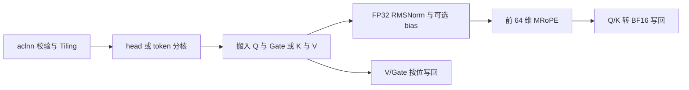

# split_qkv_rmsnorm_mrope 算子设计文档

| 项目 | 内容 |
| --- | --- |
| 社区任务 | 9月社区任务-split_qkv_rmsnorm_mrope算子开发 |
| 贡献者 / 版本 | artistkeepmonkey / v1.2，2026-09-23 |
| 算子名 / 工程名 | `SplitQkvRmsnormMrope` / `split_qkv_rmsnorm_mrope` |
| 目标环境 | Atlas 800T A2，CANN 9.1.0 及后续配套版本，Ascend C |
| 实现位置 | `ops-transformer/experimental/posembedding/split_qkv_rmsnorm_mrope/` |
| 文档状态 | 开发前设计；资源值为预算，性能值为验收目标，尚无 NPU 实测结果 |

# 需求背景（required）

## 需求来源

依据原始任务包 `4a4076b695c347bc948cb6a3a7a9a138.zip` 中的任务书、`op.json`、`golden.py` 和 `case.json`，按[社区设计模板](../../../../resources/design_template.md)编写。接口顺序、属性及可选参数以 `op.json` 为准，计算语义结合任务书、附件 Golden 与 Triton 实现核对。

设计文档提交到 `tasklist/09-split_qkv_rmsnorm_mrope/artistkeepmonkey/docs/design.md`，PR 标题为 `【CANN社区任务】split_qkv_rmsnorm_mrope算子设计文档`。当前官方任务列表尚未给出本算子编号，`09` 按已合入目录惯例表示九月；后续以官方目录为准。代码提交至 `ops-transformer`。

## 背景介绍

本算子用于 Qwen3-VL：拆分线性层的 QKV/Gate 输出，对每个 Q/K head 执行 RMSNorm，并对前 64 维应用三轴 MRoPE；V/Gate 直接输出。权重、可选 bias 和旋转计算均在 FP32 中完成，Q/K 最终转换为 BF16。

现有 `vllm_ascend/ops/triton/linearnorm/split_qkv_rmsnorm_mrope.py` 已采用融合 Kernel，按 token 分核，每核处理该 token 的全部 head。本设计的优化重点如下：

| 现状 | 优化方向 |
| --- | --- |
| `T=1` 仅启动一个 program | 按完整 head 分核，提高 decode 并行度 |
| Q/Gate 按 head 交织，参考实现对其整体转 FP32 | 用带 stride 的 DMA 分离；Gate 保持 BF16 位模式 |
| 各 head 共用权重和当前 token 的旋转系数 | 权重常驻，系数按 token 复用，减少重复加载和展开 |
| D=256、旋转维度=64 固定 | 按行批量归约、缩放与部分旋转，减少指令发射和临时空间 |

采用单个 AIV Kernel，无跨核归约或原子操作。A2 已有的 `QkvRmsNormRopeCache` 和 `RopeWithSinCosCache` 可提供向量计算、搬运及 aclnn 接入参考；其 Cache 协议与输入布局不适用于本任务。arch35 的 MRoPE 实现仅用于语义核对，不直接复用到 A2。

# 需求分析（required）

## 需求描述

记 `T=num_tokens`、`Hq=num_q_heads`、`Hk=num_kv_heads`、`G=int(has_gate)`，固定 `D=256`、`R=64`、`mrope_section=[11,11,10]`：

```text
Q = Hq * D
K = Hk * D
W = (1 + G) * Q + 2 * K
```

所有 Tensor 使用 BF16、连续 ND，位于同一 NPU。四个输出由调用者独立分配。

| 参数 | 方向 | Shape | 语义 |
| --- | --- | --- | --- |
| qkv | 输入 | `[T,W]` | 有 Gate 时为 `[Q0,Gate0,Q1,Gate1,...,K,V]`，无 Gate 时为 `[Q,K,V]` |
| q_weight / k_weight | 输入 | 各 `[256]` | 对应类型的全部 token/head 共享，直接乘 weight |
| cos_sin | 输入 | `[3,T,64]` | 三轴顺序为 temporal/height/width；每轴前 32 项为 cos，后 32 项为 sin |
| q_bias / k_bias | 独立可选输入 | 各 `[256]` | 在乘 weight 后、旋转前相加；缺省参数为 nullptr |
| q_output | 输出 | `[T,Q]` | RMSNorm 与部分旋转后的 Q |
| k_output | 输出 | `[T,K]` | RMSNorm 与部分旋转后的 K |
| v_output | 输出 | `[T,K]` | V 原始位模式 |
| gate_output | 输出 | `[T,G*Q]` | Gate 原始位模式；无 Gate 时仍返回第四个空 Tensor |

| 属性 | 类型 | 默认值 | 约束 |
| --- | --- | --- | --- |
| num_q_heads / num_kv_heads | INT | 16 / 4 | 正整数，不要求为 2 的幂，也不要求 Hq 是 Hk 的整数倍 |
| eps | FLOAT | `1e-6` | 转 FP32 后为有限正数；必测值为 `1e-6` |
| interleaved | BOOL | true | 选择三轴排列，不改变旋转配对 |
| has_gate | BOOL | true | 控制输入布局及 Gate 输出宽度 |

`T≥0`，head 数和 token 数按运行时形状处理，不设七个测试 shape 的白名单。空 token 返回正确形状的四个空输出；`has_gate=false` 且 `T>0` 时仍计算 Q/K/V。输入只读，输出不得与输入或其他输出重叠；非连续布局由接口校验拒绝。

## 需求拆解

| 子需求 | 设计响应 | 验证方式 |
| --- | --- | --- |
| 接口一致 | 按附件注册输入、属性、四个输出；独立处理两个 bias | API、InferShape 与异常 UT |
| 完整计算 | Split → 全 256 维 RMSNorm → 前 64 维 MRoPE | Triton 与附件 Golden 对照 |
| 精确直通 | V/Gate 使用 BF16 原始数据搬运 | uint16 位模式比较 |
| decode 并行 | `(token,head)` 为独立任务 | 核利用率、负载与时延 |
| prefill 吞吐 | token 分核、head 分块、系数复用及双缓冲 | 带宽、流水等待与时延 |
| 泛化与交付 | 七个指定用例及语义、边界、异步专项 | UT/ST、Profiler、报告与复现步骤 |

# 详细设计（required）

## 算子分析

### 1. Split 地址映射

以下偏移以元素为单位，BF16 字节偏移乘 2。对 `0≤t<T`、`0≤d<256`：

```text
q_src(t,h,d) = t*W + h*(1+G)*256 + d          (h < Hq)
g_src(t,h,d) = t*W + h*512 + 256 + d          (h < Hq，仅 G=1)
k_src(t,h,d) = t*W + (1+G)*Q + h*256 + d      (h < Hk)
v_src(t,h,d) = t*W + (1+G)*Q + K + h*256 + d  (h < Hk)

q_dst/g_dst(t,h,d) = t*Q + h*256 + d
k_dst/v_dst(t,h,d) = t*K + h*256 + d
```

Q 任务携带同 head 的 Gate，K 任务携带同 head 的 V。每个有效输入元素读取一次，每个输出元素只有一个写入者。

### 2. RMSNorm

对单个 Q/K head 的向量 x，全部运算使用 FP32：

```text
v = sum(x[d] * x[d], d=0..255) / 256
r = 1 / sqrt(v + eps)
n[d] = (x[d] * r) * weight[d]
n[d] = n[d] + bias[d]                       (对应 bias 存在时)
```

归约覆盖全部 256 维；Q/K 分别使用自己的 weight、bias 和均方值。归一化结果在旋转前保持 FP32。

### 3. MRoPE 选轴与旋转

令 `j=0..31`，轴编号 `0/1/2` 分别表示 temporal/height/width。在本任务固定 section 下：

```text
interleaved=true:  axis(j) = j % 3
interleaved=false:
    axis(j) = 0, 0 <= j < 11
              1, 11 <= j < 22
              2, 22 <= j < 32

c(t,j) = float32(cos_sin[axis(j),t,j])
s(t,j) = float32(cos_sin[axis(j),t,j+32])

y[j]    = n[j]    * c(t,j) - n[j+32] * s(t,j)
y[j+32] = n[j+32] * c(t,j) + n[j]    * s(t,j)
y[d]    = n[d]                              (64 <= d < 256)
```

`j%3` 是固定 `[11,11,10]` 下对附件条件式的化简。两模式均使用全局下标 j 取系数，均配对 `(j,j+32)`；`interleaved` 不表示偶奇维配对。两半结果计算完成后再覆盖原值。Q/K 以最近偶数舍入转 BF16，V/Gate 按位复制。

## 算子实现

### 总体方案

一个非空调用启动一个融合 AIV Kernel，提供两种调度模式，共用逐行算术与舍入实现。中间 Q/K 和系数广播均留在 UB，不申请随 T 增长的 GM 临时矩阵。



### 3.2.1 Host 侧设计

#### 接口与工程接入

采用显式 L2 参数检查与 L0 AICore 调度，保证连续布局、独立可选输入和空 Gate 的行为可控。参考仓内 `qkv_rms_norm_rope_cache/op_host/op_api/` 的接入方式，OpDef 保持附件契约，使用 `aclnn_exclude` 对应构建机制排除重复生成的同名 API。

```cpp
aclnnStatus aclnnSplitQkvRmsnormMropeGetWorkspaceSize(
    const aclTensor *qkv,
    const aclTensor *qWeight, const aclTensor *kWeight,
    const aclTensor *cosSin,
    const aclTensor *qBiasOptional, const aclTensor *kBiasOptional,
    int64_t numQHeads, int64_t numKvHeads,
    double eps, bool interleaved, bool hasGate,
    aclTensor *qOutput, aclTensor *kOutput,
    aclTensor *vOutput, aclTensor *gateOutput,
    uint64_t *workspaceSize, aclOpExecutor **executor);

aclnnStatus aclnnSplitQkvRmsnormMrope(
    void *workspace, uint64_t workspaceSize,
    aclOpExecutor *executor, aclrtStream stream);
```

OpDef 名称为 `SplitQkvRmsnormMrope`，注册 BF16/ND，编译目标为 `ascend910b`。外层 double eps 转换为 OpDef FLOAT 后再校验。L0 直接将调用者输出作为 Kernel 输出，不插入连续化或结果回拷 Kernel；通过 API UT 和 Profiler 核实实际执行链。

校验分工如下：

| 层次 | 检查与处理 |
| --- | --- |
| L2 接口 | 必选指针、dtype/rank/shape、连续性、属性和可识别的存储重叠；可选 bias 分别检查 |
| InferShape / InferDataType | 推导四输出形状和 BF16；符号 T 保留为未知维，运行时再验证 |
| Tiling | 具体 shape、64 位乘法与地址范围、核数、UB 容量、DMA/repeat 参数上限 |
| 空计算 | 参数有效且 T=0 时返回空执行计划；空 Gate 不触发整体空返回 |
| 执行入口 | 在用户 stream 上异步调度；workspace/executor 按运行库规则使用 |

Host 不读取 Tensor 数值。错误码沿用仓库定义，测试分别记录查询和执行阶段的返回状态。输入、输出和 workspace 在 stream 完成前保持有效；不跨 stream 共享可写缓冲或复用单次 executor。

#### 分核策略

通过 `PlatformAscendC` 查询可用 AIV 核数 C 和 UB 容量 U。所有区间使用半开形式，地址和任务数使用经过溢出检查的 64 位整数。

统一均分公式：任务量 N、核数 `cN=min(C,N)`，`base=N/cN`、`extra=N%cN`。核 c 的区间为：

```text
begin(c) = c*base + min(c,extra)
count(c) = base + (c < extra)
end(c)   = begin(c) + count(c)
```

| 模式 | 任务映射 | 核内执行 |
| --- | --- | --- |
| `HEAD_PARALLEL`，key=0 | `N=T*(Hq+Hk)`；`t=p/(Hq+Hk)`、`h=p%(Hq+Hk)` | 前 Hq 项处理 Q/Gate，后 Hk 项处理 K/V；同 token、同类型的相邻 head 合并成 tile |
| `TOKEN_TILED`，key=1 | `N=T` | 每核循环分配的 token，分别按 B 个 head 处理 Q、K；系数在整个 token 内复用 |

小 token 优先 `HEAD_PARALLEL`。例如 T=1、Hq=16、Hk=4 时有 20 个独立任务，不拆开单个 head 的 256 维归约。大 token 优先 `TOKEN_TILED`，避免系数重复读取并提高批量搬运效率。

初始 dispatch 使用以下可复现规则：T<C 选 head 模式；T≥C 时计算 token 均分利用率 `eta=T/(C*ceil(T/C))`，eta≥0.8 选 token 模式，否则选 head 模式。0.8 为待实测的初始阈值，用于避免 `T=C+1` 等场景的尾核长尾；最终按 A2 的两路径对比固定阈值。无 Gate 时 Q/K 搬运成本不同，另测负载差异。路由只依赖 shape、属性和资源，不依赖用例编号。

#### Tile 与 TilingData

单 tile 仅含一个 token 的一种 Q/K 类型，容量 B 从 `{1,2,4,8,16}` 中选择；尾块使用 `validHeads≤B`。两路径共用相同算术次序。初始优先 B=8，满足容量后比较相邻候选；短任务使用单缓冲，多 tile 路径比较单/双缓冲。

| 字段 | 用途 |
| --- | --- |
| tokenCount、qHeads、kvHeads、inputWidth、qSize、kvSize | 64 位形状及 GM 地址计算 |
| taskCount、baseTasks、extraTasks、blockDim | 确定每核区间，含 token/head 模式 |
| headsPerTile、bufferDepth、scratchBytes | 局部容量、队列深度与实际 scratch |
| eps、interleaved、hasGate、hasQBias、hasKBias | 计算与布局属性 |

每个在途 tile 保存 `tokenId、Q/K类型、headBegin、validHeads、cosSlot`，CopyIn/Compute/CopyOut 使用同一份元数据。flags 在一次调用内固定，首版不展开 bias 组合的独立 Kernel。

#### UB 与 workspace 预算

设队列深度 `d∈{1,2}`，`Ba=align_up(B,8)`。按每个 head 带一个 Gate/V 块的最坏情况预算：

| UB 区域 | 字节数 | 生命周期 |
| --- | ---: | --- |
| BF16 输入与输出队列 | `2048*d*B` | 各包含计算数据、直通数据两块 `[B,256]` |
| FP32 原值 X、工作区 S | `2048*B` | S：平方 → 归一化；X：原值 → 旋转交叉项 |
| 左右旋转结果，各 `[B,32]` | `256*B` | 两半均完成后写回 S |
| 行统计与广播块 | `4*Ba + 32*Ba` | 统计/缩放向量，以及每行 8 个 FP32 缩放副本 |
| 常驻权重/bias、双槽系数、索引 | 16 KiB | 核内复用 |
| 归约及所选 API 的临时区 | `S_api(B)` | 以实际实现的 scratch 需求为准 |
| 对齐和框架保留量 | 8 KiB 初始预留 | 按编译结果复核 |

容量条件为：

```text
(2048*d + 2304)*B + 36*Ba + 24576 + S_api(B) <= U
```

d=2、B=16 时为 `127552 + S_api(16)` 字节。各分配分别按 32 字节对齐；Brcb 每批处理 8 个行缩放值，因此 B<8 时也按 Ba=8 分配并初始化无效项，避免尾块越界。bufferDepth 改变时同步改变物理队列分配。

常驻量明细：四组 BF16 权重/bias 暂存 2048 字节、FP32 4096 字节；两个系数槽各含 BF16 `[3,64]` 384 字节、FP32 `[3,64]` 768 字节、选出的 cos/sin 256 字节，共 2816 字节；两张 32 项 uint32 索引表 256 字节。合计 9216 字节，纳入 16 KiB 预算。

算法 GM workspace 为 0；aclnn 仍按执行计划返回实际系统 workspace，不能预设总 workspace 恒为 0。单核额外空间为 `O(B*D)`，与 T 无关。

### 3.2.2 Kernel 侧设计

#### CopyIn：直接拆分与系数复用

每个 head 的 BF16 数据为 512 字节，天然满足 32 字节搬运粒度。有 Gate 时，Q 与 Gate 分别使用一次带 stride 的 DMA 搬入紧凑 `[B,256]` 区域。普通 `DataCopyParams` 的设计参数如下，单位为 32 字节块：

```text
blockCount = validHeads
blockLen   = 16                 # 512 B
srcStride  = 16                 # 跳过相邻 Gate 或下一 head 的 Q
dstStride  = 0                 # UB 中紧凑存放
```

Q 源起点为首个 Q head，Gate 源起点加 256 元素。无 Gate 时 Q 连续搬入；K/V 从各自连续区各搬入一次。相较“整块搬入再局部解交织”，此方案省去 Q/Gate 解交织临时区和 UB Copy；HBM 逻辑读取量不变，实际事务效率由 Profiler 验证。

当前 token 的三轴系数从三个 GM 起点分别加载，各 64 个 BF16。轴间距为 `T*64` 元素，不能把三轴误作连续 192 元素。转换为局部 FP32 `[3,64]` 后，以字节索引 `4*(axis(j)*64+j)` 和 `4*(axis(j)*64+j+32)` Gather 出 cos/sin。索引在 Init 时生成，热循环不逐元素 GetValue/SetValue。

token 模式每 token 加载一次系数；head 模式在核内缓存当前 token 系数，允许不同核独立加载。双槽按 token 标记，最后一个引用该槽的 tile 完成计算后才能覆盖。

#### Compute：逐行归约与向量复用

1. 将 Q/K 转为 FP32 X，Mul 生成平方 S。正确性基线逐行对 256 项做 ReduceSum；吞吐版本采用固定两级向量归约，所有 tile 共用相同的行内加法次序。
2. 两级归约候选：对每行先计算 `u[j]=(S[j]+S[j+64])+(S[j+128]+S[j+192])`，j=0..63，再 WholeReduceSum 64 项。中间结果复用 S，行间互不混合。该树与 Triton 不预设等价，启用前通过严格精度回归。
3. 均方乘 `1/256`、加 eps，计算 `r=1/sqrt(...)`。基线采用 Sqrt 后以全 1 向量做 Div；全 1 向量使用归约完成后的 S 空闲区，Rsqrt 作为精度通过后的候选。统计、缩放均留在 UB，不逐 head 读回 Scalar。
4. Brcb 将每个 r 展开为一个 32 字节块。按通道偏移 0/64/128/192 分四次 Mul，每次 64 lane、validHeads 个 repeat：X/输出的行步长为 32 个块，r 的块内步长为 0、行步长为 1 个块，得到紧凑 `[B,256]` 归一化结果 S。weight/bias 同样按四个通道段计算，在 head 维使用 repeat stride=0 复用。
5. 旋转使用 32 lane、validHeads 个 repeat；S 的行步长为 32 个块，两个结果暂存的行步长为 4 个块，系数 repeat stride=0。先形成两半结果，再写回 S 的前 64 维；归一化完成后 X 可保存交叉乘积，无需第三份 FP32 整行缓冲或 `[B,32]` 系数广播副本。

上述 stride 均以对应 API 的 32 字节块定义为准，repeat 数按字段上限拆分。依赖运算之间设置所需 Vector 屏障；归约、FMA、sqrt/rsqrt 与转换设置经过同一组误差测试后固定，不用改变计算顺序换取未经验证的精度风险。

#### CopyOut 与同步

Q/K 使用 BF16 `CAST_RINT`，在 A2 上验证最近偶数舍入行为。V/Gate 在输入、输出队列间以 uint16 等价位模式复制，不参与 FP32 运算。每个有效 head 只写自己的输出区间，尾块仅搬运 `validHeads`。

流水采用 TQue 与对应 pipe 事件，先填充、再稳定重叠、最后排空。双缓冲只复制 BF16 队列与系数槽，FP32 计算区供单个 Compute 阶段复用。

| 缓冲 | 复用前必须完成 |
| --- | --- |
| 输入槽 | Q/K Cast 与 Gate/V 位模式复制 |
| 平方区 S | 行归约及统计结果保存；随后改存归一化结果 |
| 原值区 X | 全行归一化；随后可作旋转交叉项暂存 |
| 系数槽 | 对应 token 最后一个 Q/K tile 的 Vector 读取 |
| 输出槽 | 对应 MTE3 搬出 |

MTE2→Vector→MTE3 的生产/消费顺序由队列或事件保证；同 pipe 数据依赖由相应屏障保证。不同 Q/K 权重独立驻留，不在类型切换时覆盖尚被读取的地址。无跨核数据依赖，全局原子和整卡屏障均不需要。

### 复杂度与优化依据

总工作量为 `Θ(T*W)`，已与读写全部独立输出的下界同阶。优化主要降低搬运、指令发射和同步常数，而非改变渐进复杂度。

主体 qkv 读与四输出写共 `4*T*W` 字节。所选方案完整读取三轴表，token 模式另加 `384*T` 字节；语义上实际选用的系数仅 `128*T` 字节。head 模式有跨核重复系数读取，另计每核权重/bias；这些均为逻辑流量，不等于实测 HBM 事务或峰值内存。

T=8192、Hq=16、Hk=4、G=1 时，主体与完整系数读取共 338.69 MB。若达到任务目标 334.7495 μs，相应逻辑速率约 1.01 TB/s。因此长序列应重点测有效带宽和 MTE/Vector 重叠，decode 则重点测启动、指令与核间负载。

| 优化项 | 预期收益 | 启用依据 |
| --- | --- | --- |
| head/token 双路径 | 小 token 增加并行度，大 token 复用系数 | 各 shape 与阈值邻域实测 |
| 带 stride 的 Q/Gate DMA | 减少局部解交织与临时区 | 精度、DMA 事务与总时延 |
| 逐行批量归约/缩放/旋转 | 减少标量交互与逐 head 指令循环 | 严格误差及 Vector 时长 |
| S/X 生命周期复用 | 两份 FP32 整行区完成归一化与旋转 | UB 分配检查、流水专项 |
| 单/双缓冲与 B 选择 | 在队列开销、局部占用和流水重叠间取舍 | B=1/2/4/8/16 消融 |

RMS 缩放不后移到旋转之后，weight 不预合并到 cos/sin；保留参考的 FP32 运算阶段，以控制 BF16 舍入差异。

### 文件组织与构建

```text
experimental/posembedding/split_qkv_rmsnorm_mrope/
├── CMakeLists.txt
├── README.md
├── op_host/
│   ├── CMakeLists.txt
│   ├── split_qkv_rmsnorm_mrope_def.cpp
│   ├── split_qkv_rmsnorm_mrope_infershape.cpp
│   ├── split_qkv_rmsnorm_mrope_tiling.cpp
│   └── op_api/           # aclnn L2、L0 调度及对应头文件
├── op_kernel/
│   ├── split_qkv_rmsnorm_mrope.cpp
│   ├── split_qkv_rmsnorm_mrope.h
│   ├── split_qkv_rmsnorm_mrope_tiling_data.h
│   └── split_qkv_rmsnorm_mrope_tiling_key.h
├── examples/test_aclnn_split_qkv_rmsnorm_mrope.cpp
└── tests/
    ├── CMakeLists.txt
    ├── ut/op_host/       # API、InferShape、Tiling
    ├── ut/op_kernel/     # 数学语义、边界、流水
    ├── test_split_qkv_rmsnorm_mrope.py
    ├── benchmark_split_qkv_rmsnorm_mrope.py
    └── README.md
```

构建按仓库已有子目录扫描和手写 aclnn 接入机制组织，保留 `_tiling.cpp` 后缀。实现完成后在 A2 上执行：

```bash
source <实际CANN安装目录>/set_env.sh
bash build.sh --pkg --experimental --soc=ascend910b \
  --ops=split_qkv_rmsnorm_mrope --vendor_name=custom
bash build.sh --test --experimental --soc=ascend910b \
  --ops=split_qkv_rmsnorm_mrope
# 安装生成的算子包并加载其环境后：
bash build.sh --run_example split_qkv_rmsnorm_mrope eager cust \
  --experimental --soc=ascend910b --vendor_name=custom
```

Python 测试通过 aclnn/Torch 薄封装调用本 Kernel，封装仅绑定参数与 stream；Golden 单独运行。

## 支持硬件

| 平台 | 范围 |
| --- | --- |
| Atlas 800T A2，ascend910b | 本任务开发与验收目标；CANN 9.1.0+ 配套环境 |

记录实际 NPU、CANN、驱动、固件、编译器、torch/torch_npu、Triton/vllm-ascend 和 Profiler 版本。

## 算子约束限制

1. BF16 输入输出、连续 ND；固定 D=256、R=64、section=[11,11,10]。
2. T≥0，Hq/Hk>0；cos_sin 的 token 数与 qkv 一致，weight/bias 长度为 256。
3. interleaved 控制三轴选择；两个模式均使用 half-split 配对。
4. bias 可独立缺省；无 Gate 返回 `[T,0]`，不读写 Gate 数据。
5. 不支持输出别名、任意 stride、反向或跨设备调用；内部对齐不限制 T/Hq/Hk 的整除性。
6. FP32 算术仍可能对极端 BF16 数据溢出；非有限值检查位置和传播，不用普通数值容差掩盖。

# 可维可测分析

## 精度标准/性能标准

| 项目 | 判定 | 来源 |
| --- | --- | --- |
| Q/K 精度 | BF16 输出转 FP32 后，逐输出 `max(abs(actual-reference)) < 1e-3` | 任务书 3.2 |
| V/Gate 精度 | 与原始输入切片 bitwise 一致 | 任务书 3.2 |
| 性能 | 每个必测 shape 的 NPU 时延严格 `< baseline/2` | 任务书 3.3～3.5 |
| 内存 | 无任务门槛；记录 workspace、UB 预算并验证越界/生命周期 | 任务书 3.4 |
| 交付 | 全部附件用例、测试代码、步骤、报告、日志及截图 | 任务书 4 |

### 精度方法

任务指定参考为原始 Triton 实现，附件 `golden.py` 提供 Torch NPU FP32 语义对照；CPU FP64 参考仅用于定位。所有路径使用相同 BF16 输入、属性与可追溯版本。

BF16 在 `[1,2)` 的间距为 `0.0078125`，大于本任务 `1e-3`。因此不能用通用 BF16 相对误差标准替代验收。保存最大绝对误差、失败位置及 BF16 位模式；必要时用独立诊断版本输出归约/旋转中间值，排查归约树、sqrt/rsqrt、FMA 和 cast。

先比较 Triton 与附件 Golden：前者使用 `1/sqrt`，后者使用 `torch.rsqrt`，不能预设最终 BF16 完全相同。若参考间已超阈值，保留最小复现并明确验收参考。原始 Triton 包装层用 q_bias 是否为空同时控制两侧 bias，单边 bias 专项以附件独立可选语义验证。

V/Gate 以原始输入的 uint16 视图作标杆；附件 Golden 的 FP32 往返不用于证明 NaN payload 保留。特殊值单独检查，不将 NaN 差值置零。空输出单独判定，避免空集合 max。

### 七个任务用例

固定 `eps=1e-6`、`interleaved=true`、`has_gate=true`、无 bias，weight 均为 1。qkv/cos_sin 声明范围为 `[-1,1]`。

| case | T | Hq | Hk | qkv Shape | 任务 Triton (μs) | NPU 目标 (μs) |
| --- | ---: | ---: | ---: | --- | ---: | ---: |
| decode_t1_q16_kv4 | 1 | 16 | 4 | [1,10240] | 636.240 | <318.1200 |
| small_t16_q16_kv4 | 16 | 16 | 4 | [16,10240] | 643.246 | <321.6230 |
| medium_t128_q16_kv4 | 128 | 16 | 4 | [128,10240] | 678.923 | <339.4615 |
| prefill_t2048_q16_kv4 | 2048 | 16 | 4 | [2048,10240] | 641.700 | <320.8500 |
| prefill_t8192_q16_kv4 | 8192 | 16 | 4 | [8192,10240] | 669.499 | <334.7495 |
| decode_t1_q16_kv2 | 1 | 16 | 2 | [1,9216] | 640.793 | <320.3965 |
| prefill_t2048_q16_kv2 | 2048 | 16 | 2 | [2048,9216] | 669.931 | <334.9655 |

cos_sin 为 `[3,T,64]`，四输出 shape 按接口公式检查。表中目标由任务 baseline 除以 2 得到，实测结果单独填入自测报告。

### 专项测试

| 类别 | 覆盖点 | 判定重点 |
| --- | --- | --- |
| 语义组合 | 两模式 × Gate 开关 × 四种 bias 组合；非1/零/负权重 | 独立属性与四输出 |
| 地址与选轴 | 三轴不同哨兵；j=0/10/11/21/22/29/30/31；不同 token | 轴间 GM 间距、全局 j、half-split |
| 数学边界 | 零/常量/稀疏单非零输入；后192维非零；cos=1,sin=0 及 cos=0,sin=1 | 全256维归约、旋转符号、非旋转尾部 |
| 形状边界 | T=0/1/2/15/17/127/129、C±1、dispatch 阈值附近；Hq/Hk=1/3/5 | 两路径、均分覆盖、head 尾块；空 Gate 不跳过 Q/K/V |
| 数值边界 | BF16 舍入中点、抵消、极大/极小量、NaN/Inf、符号零 | 严格误差与特殊值传播 |
| 接口异常 | dtype/rank/shape/stride、缺失指针、非法 head/eps、整数溢出、可识别别名 | 明确报错，不启动非法 Kernel |
| 生命周期 | token/QK 切换、尾 tile、双槽环绕、多 stream、连续不同输入 | 无旧系数、提前覆盖或串流 |
| 重复与资源 | 固定配置重复运行、保护区、单/双缓冲及两路径对比 | 位模式重复性、越界与 UB 分配 |

在固定平台与编译配置下检查重复性；启用批量归约后，两路径和所有 B 共用同一行内顺序。七个任务 case 与专项用例分别统计通过数。

### 数据与环境准备

原始 ZIP 仅含四个文件；七个 case 引用的 14 个 `data/*.bin` 均未包含。优先补齐原始数据；如按声明范围重建，固定 seed，记录 shape/dtype/字节序/SHA256，并标记“重建输入”。文件名 `pm1` 本身不足以认定分布为离散 ±1。

保留原始 `case.json`，在运行副本中配置 `case_path`、`expect_func` 和数据路径。核对测试框架 `err_threshold` 的解释，并额外执行显式 Q/K 严格绝对误差及 V/Gate 位模式检查。

A2 环境使用配套的 CANN、torch/torch_npu、Triton/vllm-ascend、NumPy 与 ml_dtypes。附件 Golden 要求 NPU；固定参考源码与依赖版本，确保测试执行的是本次安装的 aclnn 符号。

### 性能测量

1. 同一 A2、相同输入/属性/输出范围，先完成编译、加载和初始化；至少预热 10 次、采样 100 次，保存原始样本及 median/P90/min/max。
2. NPU Event 覆盖完整设备调用，包括 Q/K、V/Gate 及实际辅助 Kernel；输入生成、Golden、数据拷回不计入。两实现对输出分配采用相同约定。
3. 同步墙钟时延单列，记录 Python/aclnn 包装及分配开销；不与设备时延混算。短 Kernel 批量重复时，两实现使用相同批次大小。
4. 分别列任务给定 baseline 和同机 Triton 重测值，逐 case 计算倍率；以同口径时延判定 `>2`，不以平均收益覆盖失败 case。任务若提供固定测时脚本，以该脚本为验收口径。
5. 独立运行 msprof，检查 Kernel 数、时长、核间负载、MTE/Vector 等待和 UB 占用；性能采样与 Profiler 采样分开。Event 区间若含 Host 提交空隙，结合时间线说明。
6. 对分核、DMA、归约、B 和缓冲深度逐项消融，修改后先通过精度，再比较时延。测时前后校验输出，记录设备负载与时钟状态。

任务给定的 Triton 时延约为 636～679 μs，尚缺原始测时范围和环境信息，须通过同机复测核实。

### 交付与可维护性

| 阶段 | 产出 | 通过条件 |
| --- | --- | --- |
| 接口与基线 | OpDef、L2/L0、Tiling、单路径融合 Kernel、示例 | A2 编译；七个 case 与语义专项通过 |
| 性能优化 | 双路径、批量向量化、DMA、缓冲调优 | 精度不回退；逐 case 性能达标 |
| 完整交付 | UT/ST、README、Profiler、自测报告 | 边界/异步通过，结果可复现 |

Host 校验、调度、逐行计算和流水管理分别封装；两路径共用计算模块，避免独立维护两套公式。README 提供构建、安装、精度、性能和 Profiler 命令。

实现仓库根目录 `task_submission/` 按模板提供自验证步骤说明，精度、性能、内存报告及日志。任务不设内存门槛，材料记录实际 workspace 与测量口径。报告包含执行 commit、环境版本、参数/seed/哈希、逐输出误差、性能原始样本、截图和 Profiler 路径。

## 兼容性分析

新增独立算子，不改变既有 RoPE/RMSNorm/Cache 接口。与附件保持输入顺序、属性默认值和四输出顺序；vllm 薄适配层固定 D/R/section，并显式传入 has_gate，避免沿用 Triton 包装层默认 false。开发前复核上游是否出现同名实现。

## 待验证项

| 项目 | 关闭条件 |
| --- | --- |
| Triton 与 Torch Golden 的 BF16 差异 | 固定版本、严格对照；明确参考冲突的处理 |
| 原始输入缺失、baseline 计时范围不明 | 原数据或标记清楚的重建数据；同机、同口径测量 |
| 手写 aclnn 的可选输入与空 Gate | API UT 验证独立 nullptr、`[T,0]` 和直接输出；Profiler 检查执行链 |
| DMA/归约/缓冲优化的收益与资源 | A2 编译、UB 预算、精度、生命周期及性能消融全部通过 |

## 参考资料

实现参考快照为 `ops-transformer@0b0854250d55f746bd66c812f18f852a9a8a1569`。

- [社区模板](../../../../resources/design_template.md)、[目录与提交流程](../../../../README.md)。
- [Triton 源文件](https://github.com/vllm-project/vllm-ascend/blob/main/vllm_ascend/ops/triton/linearnorm/split_qkv_rmsnorm_mrope.py)：2026-09-23 下载快照，SHA256 `ba3c7e740c3a2a9c8850733d3be77fefac79bc3ed02a45b4be076b58d6f7632d`；实测补记完整 commit。
- [A2 QkvRmsNormRopeCache](https://gitcode.com/cann/ops-transformer/tree/0b0854250d55f746bd66c812f18f852a9a8a1569/posembedding/qkv_rms_norm_rope_cache)：手写 aclnn、向量归约与广播参考，布局和 Cache 功能不复用。
- [RoPE 局部向量实现](https://gitcode.com/cann/ops-transformer/blob/0b0854250d55f746bd66c812f18f852a9a8a1569/posembedding/rope_with_sin_cos_cache/op_kernel/rope_with_sin_cos_cache_f_bf16.h)：A2 Copy、Gather 与 BF16 转换参考。
- [RotaryPositionEmbedding3d](https://gitcode.com/cann/ops-transformer/tree/0b0854250d55f746bd66c812f18f852a9a8a1569/experimental/posembedding/rotary_position_embedding3d)：实验算子构建与 UT 组织参考。

文档组织参考以下三份已在社区 master 中的设计，仅借鉴需求映射、生命周期和验证方法；本任务硬件、数学定义和验收阈值独立确定：

| 参考设计 | 采用的组织方式 |
| --- | --- |
| [MatmulLayerNormMatmul / zhou_zhiyuan](../../../09-45-MatmulLayerNormMatmul/zhou_zhiyuan/docs/design.md) | 完整归约范围、容量公式和缓冲复用条件 |
| [BatchedMatmulSoftmax / xukunming2025](../../../07-8-BatchedMatmulSoftmax/xukunming2025/docs/design.md) | 统一计算契约、工作量调度与生产/消费生命周期 |
| [SlidingTileAttention A2 / gcw_FGO3DNh6](../../../08-17-SlidingTileAttention-A2/gcw_FGO3DNh6/docs/design.md) | aclnn 工程、Host/Kernel 分工和验收表述 |

| 任务输入 | SHA256 |
| --- | --- |
| 原始 ZIP | `d8e91995fccfe30b0dec6e001afc5e51aae5891da5f158032c4fe5baa757bb4d` |
| 任务书 | `f732d407e4dc87680fe4be18297743e0fb88d376c6c3dce824030e940b008fc8` |
| op.json | `212f844fd7f9bdf774fc3c0d7758c9672ee6125483325db1dc44860dfbee5ac6` |
| golden.py | `85e0b2dbc7d100ed7837e31a0c6f6109a8f1c747ef8c24c73255d71169a33fe4` |
| case.json | `aad5a56813d74db2187c0f9cac72522b7718efde6ce24611cae3ae7f25abe466` |
