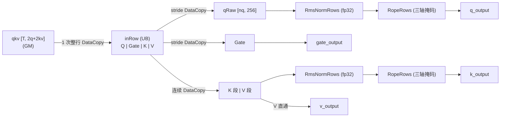

# SplitQkvRmsnormMrope 算子设计文档

# 1. 需求背景（required）

## 1.1 需求来源

CANN 社区任务 2026 算子开发任务：`split_qkv_rmsnorm_mrope` 算子（vLLM-Ascend 中以 Triton 实现，
kernel 名称 `split_qkv_rmsnorm_mrope_kernel`，路径 `vllm_ascend/ops/triton/linearnorm/split_qkv_rmsnorm_mrope.py`）。

## 1.2 背景介绍

Qwen3-VL 系列模型在线性层输出阶段将 QKV 与 Gate 投影结果融合为一个张量，随后需要：

1. 将融合张量拆分为 Q / Gate / K / V；
2. 对 Q、K 按 head 做 RMSNorm（fp32 累积）；
3. 对 Q、K 的 RoPE 维度应用 Multi-axis RoPE（三轴 temporal / height / width）。

这三个步骤在数学上互不依赖（仅共享同一输入行），若分三个算子实现需要 3 次 GM 读写往返；
而 Q/K 的 RMSNorm 属于访存密集操作，适合在 Vector Core 上以「整行搬入 + UB 内一次性计算」的
融合方式实现，以避免 Triton 方案中的多次 GM 读写与 kernel 启动开销。

## 1.3 现有实现分析

Triton 版本按 token 行并行，逐 head 计算：

1. 读取 `qkv` 行（`num_tokens × (2×q_size + 2×kv_size)`）；
2. RMSNorm（fp32），并乘权重；
3. 按 mrope_section 分段选择三轴 cos/sin，对前 `rope_dim` 维执行旋转；
4. 写回 Q/K 输出，Gate/V 直通输出。

任务书给出的 Triton 基准时延在 636us ~ 679us 区间内几乎不随 token 数变化，
说明其耗时主要由固定开销（kernel 启动/编译缓存等）主导，为 Ascend C 融合实现留出了优化空间。

# 2. 需求分析（required）

## 2.1 需求描述

使用 Ascend C 编程语言实现 `SplitQkvRmsnormMrope` 算子，以 aclnn 算子工程的形式交付。

### 2.1.1 接口定义

| 参数名 | 输入/输出 | 含义 | 数据类型 | 形状 | 约束 |
| ------ | --------- | ---- | -------- | ---- | ---- |
| `qkv` | 输入 | 融合 QKV+Gate 投影输出 | bfloat16 | `[num_tokens, q_size + gate_size + 2*kv_size]` | 2 维；布局 `[Q_head0\|Gate_head0\|…\|K\|V]` |
| `q_weight` | 输入 | Q RMSNorm 权重 | bfloat16 | `[head_size]` | — |
| `k_weight` | 输入 | K RMSNorm 权重 | bfloat16 | `[head_size]` | — |
| `cos_sin` | 输入 | MRoPE 三轴 cos/sin | bfloat16 | `[3, num_tokens, rope_dim]` | 前 `rope_dim/2` 为 cos，后为 sin |
| `q_bias` | 输入（可选） | Q RMSNorm 偏置 | bfloat16 | `[head_size]` | 可选，缺省为 nullptr |
| `k_bias` | 输入（可选） | K RMSNorm 偏置 | bfloat16 | `[head_size]` | 可选，缺省为 nullptr |
| `q_output` | 输出 | 归一化 + 旋转后的 Q | bfloat16 | `[num_tokens, q_size]` | — |
| `k_output` | 输出 | 归一化 + 旋转后的 K | bfloat16 | `[num_tokens, kv_size]` | — |
| `v_output` | 输出 | V 直通输出 | bfloat16 | `[num_tokens, kv_size]` | 与输入对应段位级一致 |
| `gate_output` | 输出 | Gate 直通输出 | bfloat16 | `[num_tokens, q_size]` | 与输入对应段级一致；`has_gate=false` 时为空 |

属性（Attribute）：

| 属性名 | 类型 | 默认值 | 含义 |
| ------ | ---- | ------ | ---- |
| `num_q_heads` | int | 16 | Q head 数 |
| `num_kv_heads` | int | 4 | K/V head 数 |
| `eps` | float | 1e-6 | RMSNorm 的 eps |
| `interleaved` | bool | true | RoPE 三轴是否为交错（interleaved）模式 |
| `has_gate` | bool | true | 输入是否含 Gate 段 |

其中 `q_size = num_q_heads × head_size`、`gate_size = q_size`、`kv_size = num_kv_heads × head_size`。
数据类型固定为 bfloat16（内部 fp32 计算，输出 cast 回 bfloat16）。

**偏置的判定方式**：`q_bias` / `k_bias` 为 OPTIONAL 输入。host 侧以「`q_bias` 第 0 维长度是否
等于 `head_size`」判定是否启用偏置（得到 `hasBias`），并作为 tiling data 的一个字段下发；
kernel 侧据此跳过偏置分支，避免对空指针做逐元素判断。

## 2.2 需求拆解

| 编号 | 需求项 | 说明 |
| ---- | ------ | ---- |
| R1 | 功能正确 | 与 Triton/golden 实现逐元素对齐，Q/K `max_diff < 1e-3`，V/Gate 完全一致 |
| R2 | 性能达标 | 端到端时延 < Triton 基准的 1/2（即加速比 ≥ 2x） |
| R3 | 算子工程化 | op_host / op_kernel / op_api / examples / tests 完整，可编译可测试 |
| R4 | 多 shape 支持 | 覆盖 decode（t=1）与 prefill（t=8192）等场景，kv head 数可变（2/4） |

# 3. 详细设计（required）

## 3.1 算子分析

### 3.1.1 数学公式

设 `x = qkv[t]`，`head_size = H`，`rope_dim = R = H/4`，`q_size = n_q × H`，`kv_size = n_kv × H`：

1. Split（`has_gate = true`）：

```
qg = x[0 : 2*q_size].reshape(n_q, 2H)
Q  = qg[:, :H]          Gate = qg[:, H:]
K  = x[2*q_size : 2*q_size + kv_size].reshape(n_kv, H)
V  = x[2*q_size + kv_size : ]
```

2. RMSNorm（fp32，逐 head）：

```
var = mean(Q^2)                 # 对 1 个 head 的 H 个元素
Qn  = Q * rsqrt(var + eps) * q_weight (+ q_bias)
```

3. Multi-axis RoPE（仅作用于每 head 的前 `R` 维）：

```
for c in [0, R/2):
    a = axis(c)                 # interleaved 时为 c % 3；否则按 [11, 11, 10] 分段
    cos = cos_sin[a, t, c]
    sin = cos_sin[a, t, R/2 + c]
first  = value[:R/2], second = value[R/2:R]
out[:R/2]  = first  * cos - second * sin
out[R/2:R] = second * cos + first  * sin
```

4. 输出：`q_output`、`k_output`（归一化 + 旋转后），`v_output`、`gate_output`（直通）。

### 3.1.2 支持数据类型

bfloat16（内部 fp32 计算，输出 cast 回 bfloat16）。

### 3.1.3 支持形状

| 维度 | 取值 |
| ---- | ---- |
| num_tokens | 1 ~ 8192（动态） |
| num_q_heads | 16 |
| num_kv_heads | 2 / 4 |
| head_size | 256（固定） |
| rope_dim | 64（固定） |

## 3.2 算子实现

### 3.2.1 Host 侧设计

**算子注册（`split_qkv_rmsnorm_mrope_def.cpp`）**：声明 6 个输入（其中 `q_bias`、`k_bias` 为
OPTIONAL）、4 个输出与 5 个属性（`num_q_heads` / `num_kv_heads` 为 OPTIONAL 且带默认值，
与算子原型的 `default_value` 一致），注册 `ascend910b` / `ascend910_93`。

**Shape 推导（`split_qkv_rmsnorm_mrope_infershape.cpp`）**：

```
q_output     : [num_tokens, num_q_heads * head_size]
k_output     : [num_tokens, num_kv_heads * head_size]
v_output     : [num_tokens, num_kv_heads * head_size]
gate_output  : [num_tokens, has_gate ? num_q_heads * head_size : 0]
```

**Tiling 策略（`split_qkv_rmsnorm_mrope_tiling.cpp`）**：

- **输入校验**（任一不满足即 `GRAPH_FAILED`，并打印具体期望值）：

  | 校验项 | 条件 |
  | ------ | ---- |
  | `qkv` 维度 | 必须为 2 维 |
  | `q_weight` 末维 | 必须等于 `head_size`（256） |
  | `k_weight` 末维 | 必须等于 `head_size` |
  | `cos_sin` 维度 | 必须为 3 维 |
  | `cos_sin` 第 2 维 | 必须等于 `num_tokens` |
  | `rope_dim` | 必须等于 64 |
  | `qkv` 宽度 | 必须等于 `(has_gate ? 2*q_size : q_size) + 2*kv_size` |
  | `num_q_heads` / `num_kv_heads` | 必须为正数 |

- **分核策略**：以 token 为最小任务粒度，`coreNum = min(AIV 核数, num_tokens)`（下限为 1），
  `tokensPerCore = ceil(num_tokens / coreNum)`，核间均匀切分。
  单核内对 `[tokenStart, tokenEnd)` 串行处理，每个 token 走一次完整流水；
  decode（t=1）时实际只用 1 个核，prefill（t=8192）时用满 AIV 核数。

- **三轴掩码预计算**：host 侧按 `interleaved` 规则生成 96 个 fp32 掩码
  `mask[a][c] = (axis(c) == a)` 放入 tiling data，kernel 侧以掩码乘加完成「按坐标选轴」，
  从而避免 kernel 内的 gather 与分支。

- **tiling key**：固定为 0（当前仅支持 bfloat16，无需按 dtype 分档）。

- 采用 raw struct + `IMPL_OP_OPTILING` 的轻量 tiling 写法，避免引入通用 tiling 框架开销。

tiling data 结构（`op_kernel/split_qkv_rmsnorm_mrope_tiling_data.h`）：

| 字段 | 含义 |
| ---- | ---- |
| numTokens / numQHeads / numKvHeads | 规模信息 |
| headSize / ropeDim / qSize / kvSize | 维度信息 |
| qkvRowStride / qOffset / gateOffset / kOffset / vOffset | 输入行布局偏移（`kOffset = has_gate ? 2*qSize : qSize`） |
| cosAxisStride | `numTokens × rope_dim`（三轴之间的跨距） |
| hasGate / hasBias | 分支开关（0/1） |
| coreNum / tokensPerCore | 分核信息 |
| eps / invHeadSize | RMSNorm 参数（`1/headSize` 预先计算，减少 kernel 内除法） |
| mropeMask[96] | 三轴坐标掩码 |

### 3.2.2 Kernel 侧设计

**数据流**：



**流水结构**：Kernel 采用 `TQue` 双缓冲（`inRowQue_` / `outQQue_` / `outKvQue_`）
+ `TBuf` 工作区的经典流水结构，单核一次处理一个 token：

```
Process(token):
  AllocTensor(inRow)                                       // [Q | Gate | K | V] 整行 20KB
  DataCopy(inRow, qkv[token])                              // 1 次连续搬入
  EnQue(inRow)
  LoadCosSin(token); BuildCosSin()                         // 3×64 → cosFull[64] / sinFull[64]
  DeQue(inRow)
  ── Q 分支 ──
  DataCopy(qRaw, inRow, stride)                            // 摘下每 head 的 Q（256 维，跳过 Gate）
  DataCopy(outQ[qSize], inRow[headSize], stride)           // Gate 直通（无计算）
  Cast(x, qRaw)                                            // bf16 → fp32
  RmsNormRows(x, numQHeads)
  RopeRows(x, numQHeads)
  Cast(outQ, x)                                            // 紧凑写回 [Q | Gate] 缓冲
  ── K/V 分支 ──
  Cast(x, inRow[kOffset])
  RmsNormRows(x, numKvHeads)
  RopeRows(x, numKvHeads)
  DataCopy(outKv, inRow[kOffset], 2*kvSize)                // V 直通
  Cast(outKv, x, kvSize)                                   // K 覆盖前段
  搬出：q_output、gate_output、k_output、v_output（各 1 次 DataCopy）
  FreeTensor(...)
```

**关键实现点**：

1. **整行搬入**：`qkv` 一行为连续的 `[Q|Gate|K|V]`，用一次 20KB 的 `DataCopy` 完成，减少 MTE 指令数；
   Q/Gate 的分离通过带 stride 的 `DataCopyParams(blockCount = num_q_heads, blockLen = headSize×2B,
   srcStride = headSize×2B, dstStride = 0)` 在 UB 内完成，无需额外的 GM 访问。

2. **RMSNorm（fp32 累积，批处理归约）**：
   - `Mul(sq, x, x)` 批量计算平方；
   - **半行分离 + 批处理归约**：先用两次带 stride 的 `DataCopy` 把每行的前后半复制成两个紧凑的
     `[rows, H/2]` 块，再用两条 stride `Add`（`[rows,H/2] + [rows,H/2]` → `[rows,H/4]`）
     完成整批行内归约，最后逐行 `WholeReduceSum(64)` 得到每行 `Σx²`；
   - `Muls(1/H)` → `Adds(eps)` → `Sqrt` → `Duplicate(1.0f)` + `Div` 得到 `rstd = 1/sqrt(var+eps)`；
   - **逐行 scale 的向量化广播**：用 `Brcb` 把每行 rstd 扩展成一个 32B block（8 个相同 fp32），
     再用 `BRCB_BLOCK` 次块 `DataCopy` 铺满一个 64 元素的组，得到 `[rows, 64]` 广播矩阵；
     后续 `Mul` 以 `src1RepStride = 0` 复用该矩阵，实现「每行一个 scale」且全程无标量寄存器往返；
     最终 `out = x * rstd * weight`（fp32），与 golden 的 `x * rsqrt(var+eps) * weight` 结构一致。

3. **Multi-axis RoPE**：`cos_sin[a, t, c]` 的「按坐标选轴」在 kernel 侧用掩码乘加完成
   （`cosFull[c] = Σ_a cos3[a][c] · mask[a][c]`，`sin` 同理），避免 gather；
   旋转采用 `out = x · cosFull + swapHalf(x) · sinFull` 的形式（其中 `sinFull = [-sin, sin]`），
   对 `[rows, R]` 批量执行，每行 1 个 repeat。

4. **直通输出**：`Gate` / `V` 只做 UB 内 stride 搬运直通，不做任何数值处理，保证与输入按位一致。

5. **流水同步**：搬运（MTE2/MTE3）与计算（V）之间采用**显式 `HardEvent` 同步**
   （`MTE2_V`、`V_MTE2`、`V_MTE3`、`MTE3_V`、`S_V`，由 `SetFlag` / `WaitFlag` 成对插入），
   全部同步点集中在 4 个内联辅助函数中，不在业务代码中散布。

**UB 占用规划**（`InitBuffer` 共 23 个 buffer，合计 179,264 字节 / 192 KB）：

| 类别 | 主要 buffer | 字节数 | 说明 |
| ---- | ----------- | -----: | ---- |
| 输入 | `inRowQue_`（双缓冲） | 40,960 | 整行 `qkvRowStride × 2B × 2` |
| 输出 | `outQQue_` + `outKvQue_`（双缓冲） | 40,960 | Q/Gate 与 K/V 两路输出 |
| 计算工作区 | `xBuf_` / `sqBuf_` / `sqSplitBuf_` | 49,152 | fp32 归一化与归约缓存 |
| 归约中间量 | `red1Buf_` / `red2Buf_` / `sumBuf_` | 12,352 | 批处理归约的分级缓存 |
| RoPE | `ropeBuf_` / `swapBuf_` / `tmp0Buf_` / `tmp1Buf_` | 16,384 | `[rows, R]` 旋转工作区 |
| cos/sin | `cosRawBuf_` / `cos3Buf_` / `cosFullBuf_` / `sinFullBuf_` | 1,664 | 三轴原始值与按轴合成结果 |
| 广播与权重 | `brcbBuf_` / `bcastBuf_` / `wRawBuf_` / `wBuf_` | 9,216 | 逐行 scale 广播矩阵与权重 |
| 掩码 | `maskBuf_` | 384 | 96 个 fp32 三轴掩码 |

其中 `xBuf_` / `sqBuf_` 按最大 head 数（`rowsMax_ = max(num_q_heads, num_kv_heads)`）分配，
Q/K 两支复用；输出缓冲需同时容纳 Q+Gate（`2 × qSize`）与 K+V（`2 × kvSize`）。

### 3.2.3 精度设计

- 归一化、旋转全程 fp32；仅两个降精度点：输入 Cast（bf16→fp32，`CAST_NONE`，无损）
  与输出 Cast（fp32→bf16，`CAST_RINT`）；
- `1/headSize`、`eps` 由 host 侧预计算并下发（`1/256` 为 2 的幂，乘法精确）；
- 三轴掩码为 0/1 精确值，掩码乘加不引入额外误差；
- 与 golden 的计算顺序对齐：RMSNorm（先取倒数、后乘权重）→ RoPE → cast bf16，
  与 `golden.py` 的 `value * (1.0 / sqrt(var + eps)) * weight` 结构一致；
- 输出为 bfloat16（尾数 7 位，机器 epsilon = 2^-7 = 7.8125e-03），
  因此单次量化步长即为该输出格式的最小非零误差，设计上不再引入额外精度损失。

## 3.3 性能优化设计

> 对应任务书第 90 行要求：「设计文档需包含算子功能、设计思路、**性能优化方案**」。

### 3.3.1 优化思路

优化的出发点来自基线的两个特征：

1. **Triton 基准几乎不随 token 数变化**（636 ~ 679us）→ 其耗时由固定开销主导。
   因此设计上把「一个 token 的全部计算放进单核一次流水」，避免多次 kernel 调用与中间张量落盘，
   使小 batch 场景的固定开销降到最低。
2. **本算子的数据量远小于其指令开销** → 需要先判断瓶颈类型是指令受限还是带宽受限，
   再决定优化方向。判断方法：构造一个只做搬入/搬出的最小化 kernel，测其耗时作为数据通路下限，
   与完整实现的耗时对比。若二者差距大，说明瓶颈在计算指令而非搬运带宽。

据此确定优化方向：**减少每个 token 的向量指令条数**，而不是增大搬运粒度。
从这个方向出发做了三项优化（见 3.3.2），并在实现中遇到两个必须绕开的限制（见 3.3.3）。

### 3.3.2 三项关键优化

| # | 优化项 | 解决的问题 | 实现方式 |
| - | ------ | ---------- | -------- |
| ① | **逐行 scale 向量化广播** | 每行需要把自己的 rstd 广播到该行所有元素，若用 `GetValue` + `Muls` 走标量寄存器会增加标量指令与同步开销 | `Brcb` 把每行 rstd 扩展为 32B block，再用 `BRCB_BLOCK` 次块 `DataCopy` 铺成 `[rows, 64]` 矩阵；`Mul` 以 `src1RepStride = 0` 复用该矩阵 |
| ② | **归一化改为「先取倒数再乘」** | `Div` 的广播控制复杂，且与 golden 的实现形式不一致 | 由 `x / sqrt(v)` 改为 `x * (1 / sqrt(v))`：`Sqrt` → `Duplicate(1.0f)` → `Div` 得到 rstd，再统一用 `Mul` 施加到 `[rows, H]` |
| ③ | **批处理归约（半行分离 + stride Add）** | 逐行独立归约会产生大量重复的 `Add` / `WholeReduceSum` 指令 | 先把每行的前后半用带 stride 的 `DataCopy` 复制成两个紧凑 `[rows, H/2]` 块，用两条 stride `Add` 完成整批归约（`[rows,H/2]+[rows,H/2]→[rows,H/4]`、`[rows,H/4]+[rows,H/4]→[rows,H/8]`），最后逐行 `WholeReduceSum(64)` 收尾 |

三项优化的共同目标是把「每个 head 一次向量操作」改为「整批 rows 一次向量操作」，
使向量指令数由 O(2 × num_heads) 量级降到 O(1) 量级（与 head 数无关）。

### 3.3.3 实现约束与注意事项

在实现上述优化时遇到三个必须绕开的硬约束，记录如下（对后续维护同样适用）：

1. **向量指令的 `src1` 无法跨行回绕**：`Mul` / `Add` 的 `src1` 按 `repeat` 递增地址读取时，
   不能在各行边界自动折返。因此不能直接用 packed 的行数据做 stride 访问，
   必须先把数据重排成「紧凑块」再做批量运算 —— 这是「半行分离」的由来。
2. **标量广播会造成跨行串扰**：若用 `GetValue` 取某行的 rstd 标量再 `Muls` 广播到整批，
   广播范围会超出该行（随机数据下表现为部分 head 的 sum 被重复累加；
   常数数据下恰好正确，属难以发现的隐式错误）。故 scale 必须走纯向量广播（优化 ①）。
3. **显式流水同步不可省略**：曾尝试删除全部 `SetFlag` / `WaitFlag`、完全依赖编译器 auto-sync，
   结果出现精度崩溃（向量指令读到尚未就绪的搬运结果）。故保留显式同步，
   并将同步点收敛到 4 个辅助函数中。

## 3.4 支持硬件

| 支持的芯片版本 | 是否支持 | 对应产品 |
| -------------- | -------- | -------- |
| `ascend910b` | √ | Atlas A2 训练系列产品 / Atlas A2 推理系列产品 |
| `ascend910_93` | √ | Atlas A3 训练系列产品 / Atlas A3 推理系列产品 |

## 3.5 算子约束限制

- `head_size` 必须为 256；
- `rope_dim` 必须为 64（`head_size / 4`）；
- `mrope_section` 固定为 `[11, 11, 10]`；
- `qkv` 必须为 2 维，且宽度等于 `(has_gate ? 2*q_size : q_size) + 2*kv_size`；
- `cos_sin` 必须为 `[3, num_tokens, rope_dim]`，且第 2 维等于 `num_tokens`；
- `num_q_heads`、`num_kv_heads` 必须为正数；Q 与 K/V 的 head 数可不等（支持 GQA 布局）；
- 仅支持 bfloat16 输入输出，仅支持 ND 格式；
- 算子不申请业务 workspace（`GetWorkspaceSizes(1)[0] = 0`），无中间全局张量。

# 4. 可维可测分析

## 4.1 精度标准 / 性能标准

| 验收标准 | 描述 | 标准来源 |
| -------- | ---- | -------- |
| 精度标准 | V/Gate 与输入按位完全一致；Q/K 与 Triton/golden 逐元素对齐 | 任务书 3.2 |
| 性能标准 | 端到端时延 < Triton 基准 / 2（加速比 ≥ 2x） | 任务书 3.3 |
| 内存标准 | 不涉及 | 任务书 3.4 |

## 4.2 测试设计

| 测试层次 | 文件 | 覆盖内容 |
| -------- | ---- | -------- |
| 精度测试 | `tests/verify/self_test.py` | 7 个官方用例，与 `golden.py` 等价的 numpy 参考实现逐元素对比；统计 max_diff、超阈值元素数与占比、V/Gate 位级一致性 |
| 精度复核 | `tests/verify/ulp_analysis.py` | 把差异元素按自身幅值的 bf16 ULP 归一化，量化差异的量化步长倍数 |
| 性能测试 | `examples/test_aclnn_split_qkv_rmsnorm_mrope.cpp` | warmup 1 轮后连续 20 轮「GetWorkspaceSize + 执行」，取平均端到端时延 |
| 回归验证 | 同上 | 每次改动后重跑 7 用例，确认精度/性能无回归 |

自测用例覆盖 tokens ∈ {1, 16, 128, 2048, 8192}、kv_heads ∈ {2, 4}，
覆盖 decode（t=1）到长序列 prefill（t=8192）全区间；测试步骤见 `tests/verify/README.md`。

## 4.3 可维护性设计

- **参数集中**：`head_size`、`rope_dim`、`mrope_section`、掩码尺寸等约束以 `constexpr`
  常量集中在 host 与 kernel 两侧（`SUPPORTED_*` / `SQKM_*`），与任务书约束一一对应；
- **无魔法数**：全部形状偏移（`qOffset` / `gateOffset` / `kOffset` / `vOffset` / `cosAxisStride`）
  由 host 侧计算后经 tiling data 下发，kernel 不重复推导；
- **校验前置**：输入合法性全部在 tiling 阶段校验并打印具体期望值，避免 kernel 内无效计算；
- **同步点收敛**：流水同步集中在 4 个内联辅助函数，不在业务代码中散布 `SetFlag` / `WaitFlag`；
- **可观测性**：example 打印统一格式的 `SPLIT_QKV_RMSNORM_MROPE_PERF` 行
  （含 tokens / iters / avg_us），便于脚本解析与历史数据对比。

## 4.4 兼容性分析

本算子为新增算子，不涉及存量接口兼容性。
接口设计上，`q_bias` / `k_bias` 为 OPTIONAL 且支持缺省，`has_gate` 属性可关闭 Gate 段，
`interleaved` 属性同时支持交错与非交错两种 RoPE 排布，为后续模型形态变化预留了扩展空间。
