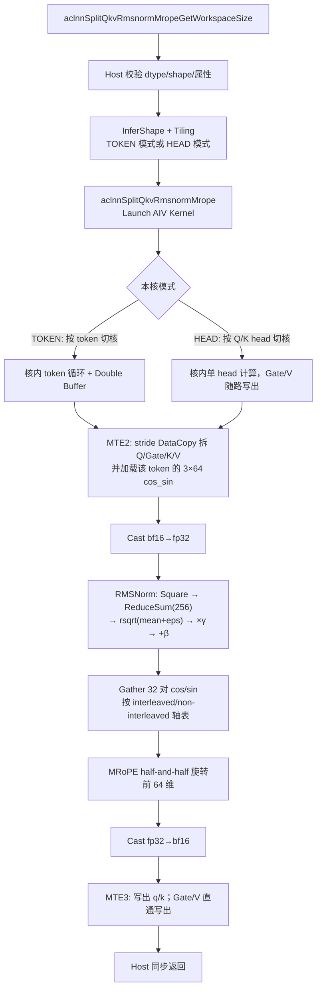

# 【社区任务】split_qkv_rmsnorm_mrope 算子设计文档

## 一、需求描述

### 1.1 需求来源

- **任务来源**：9 月社区任务《split_qkv_rmsnorm_mrope 算子开发》，任务书见 `split_qkv_rmsnorm_mrope算子开发任务书.md`。
- **对标实现**：vllm-ascend Triton kernel `split_qkv_rmsnorm_mrope_kernel`（`vllm_ascend/ops/triton/linearnorm/split_qkv_rmsnorm_mrope.py`）。
- **交付目标**：使用 Ascend C 按 aclnn 工程化重新实现，合入 `ops-transformer` 的 `experimental/posembedding/split_qkv_rmsnorm_mrope`。
- **面向硬件**：Atlas 800T A2（`ascend910b` / DAV_2201）；CANN 9.1.0+；开发语言 Ascend C。
- **适用模型**：Qwen3-VL 系列（Qwen3-VL-4B/9B tp1、Qwen3-VL-35B tp2）prefill / decode。

### 1.2 需求分析

**现状**：vllm-ascend 将该融合算子落在 Triton 上。Triton 路径把 Split、RMSNorm、MRoPE 拆成 Python 侧多次访存与解释型 kernel 启动，decode（`num_tokens=1`）与长 prefill（`num_tokens=8192`）的实测时延几乎同量级（约 636~679 µs），说明启动开销主导、核内流水未吃满 HBM/Vector。

**目标**：一个 Vector Core 融合 Kernel，一次 GM 读入融合 QKV+Gate，在 UB 内完成拆分、逐 head RMSNorm、三轴 MRoPE，再一次写出四个输出，消除中间 GM 往返，时延达到 Triton 的 **1/2 以下**。

**算子语义**：

```
input qkv [num_tokens, q_size + gate_size + 2*kv_size]
       has_gate=true 时 layout:
       [Q_h0 | Gate_h0 | Q_h1 | Gate_h1 | ... | Q_hNq-1 | Gate_hNq-1 | K | V]

1. Split  → Q, Gate, K, V
2. RMSNorm(Q)  逐 head，fp32 累积，乘 q_weight（可选 +q_bias）
3. RMSNorm(K)  逐 head，fp32 累积，乘 k_weight（可选 +k_bias）
4. MRoPE(Q[..., :rope_dim])  按 mrope_section 取三轴 cos/sin 做 half-and-half 旋转
5. MRoPE(K[..., :rope_dim])  同上
6. 输出 q_output, k_output, v_output, gate_output
   V / Gate 为直通拷贝，不参与 Norm / RoPE
```

**固定约束（Qwen3-VL）**：

| 项 | 值 |
| --- | --- |
| head_size | 256 |
| rope_dim | 64（head_size × 0.25） |
| mrope_section | [11, 11, 10]（temporal / height / width） |
| rms_norm_eps | 1e-6（属性可配，默认 1e-6） |
| q_size | num_q_heads × 256 |
| kv_size | num_kv_heads × 256 |
| gate_size | has_gate ? q_size : 0 |
| dtype | 输入输出均为 bfloat16，内部 fp32 |
| format | ND |
| RoPE 模式 | interleaved（默认）与 non-interleaved |

**计算量 vs 访存量（以 `q16_kv4` 为例）**：

- 每 token 输入 10240×2 B、输出 10240×2 B，外加 cos_sin 384 B，近似 **访存密集型**。
- RMSNorm 为 256 点归约 + 向量乘，MRoPE 仅覆盖前 64 维，计算密度低。
- 优化重点：一次加载、stride 拆分、Q 与 Gate 同读、Double Buffer 隐藏 MTE，而不是堆更多 Vector 指令。

### 1.3 需求拆解

1. 支持 aclnn 两段式接口：`aclnnSplitQkvRmsnormMropeGetWorkspaceSize` + `aclnnSplitQkvRmsnormMrope`。
2. 覆盖 `has_gate` / `interleaved` / 可选 `q_bias`/`k_bias`。
3. Q/K 与 golden（等价 Triton）逐元素 `max_diff < 1e-3`；V/Gate bit 级一致。
4. 7 个自测 shape 上 NPU 时延 < Triton baseline / 2。
5. 工程结构对齐 `ops-transformer/experimental/posembedding` 现有算子（如 `rotary_position_embedding3d`）。

---

## 二、方案设计

### 2.1 算子分析

#### 数学公式

**(1) 尺寸**

\[
q\_size = N_q \cdot D,\quad kv\_size = N_{kv} \cdot D,\quad
gate\_size = \mathbb{1}[has\_gate]\cdot q\_size,\quad D=256
\]

**(2) Split（has_gate = true）**

对 token \(t\)、Q head \(h\)：

\[
\begin{aligned}
Q[t,h,:] &= qkv[t,\ 2hD\ :\ (2h+1)D] \\
Gate[t,h,:] &= qkv[t,\ (2h+1)D\ :\ (2h+2)D]
\end{aligned}
\]

K / V 紧随 Q-Gate 交错段之后，各占 \(N_{kv} D\)：

\[
\begin{aligned}
K[t] &= qkv[t,\ 2q\_size\ :\ 2q\_size+kv\_size] \\
V[t] &= qkv[t,\ 2q\_size+kv\_size\ :\ 2q\_size+2kv\_size]
\end{aligned}
\]

has_gate = false 时 Q 连续存放在前 \(q\_size\)，其后为 K、V，无 Gate。

**(3) RMSNorm（逐 head，最后一维，fp32）**

\[
\begin{aligned}
x &= \mathrm{cast}_{fp32}(X) \\
\mathrm{var} &= \mathrm{mean}(x^2) = \frac{1}{D}\sum_{i=0}^{D-1} x_i^2 \\
y &= x \cdot \mathrm{rsqrt}(\mathrm{var}+\varepsilon) \cdot \gamma \\
y &\leftarrow y + \beta \quad (\text{若存在 bias})
\end{aligned}
\]

Q 使用 `q_weight` / `q_bias`，K 使用 `k_weight` / `k_bias`。\(\varepsilon\) 默认 \(10^{-6}\)。

**(4) MRoPE（仅前 rope_dim=64，half-and-half）**

`cos_sin` 布局 `[3, num_tokens, 64]`：最后一维前 32 为 cos、后 32 为 sin。三轴 0/1/2 = temporal / height / width。

对 pair 下标 \(i \in [0,32)\)，先按模式选轴 \(a(i)\)，再取值：

\[
\cos_i = \mathrm{cos\_sin}[a(i), t, i],\quad
\sin_i = \mathrm{cos\_sin}[a(i), t, i+32]
\]

**interleaved**（与 golden.py `_axis_indices` 一致，section=[11,11,10]）：

\[
a(i)=\begin{cases}
1 & i\bmod 3=1 \land i\le 3\cdot 11 \\
2 & i\bmod 3=2 \land i\le 3\cdot 10 \\
0 & \text{otherwise}
\end{cases}
\]

即 \(a = [0,1,2,0,1,2,\ldots,0,1,2,0,1]\)（11 个 T、11 个 H、10 个 W）。

**non-interleaved**：\(i<11\to 0\)，\(i<22\to 1\)，否则 \(2\)。

旋转（只改前 64 维，后 192 维保持 RMSNorm 结果）：

\[
\begin{aligned}
y_{0:32} &\leftarrow y_{0:32}\cdot\cos - y_{32:64}\cdot\sin \\
y_{32:64} &\leftarrow y_{32:64}\cdot\cos + y_{0:32}\cdot\sin
\end{aligned}
\]

最后 \(\mathrm{cast}_{bf16}\) 写回。V、Gate 不做上述计算，按 bf16 原值拷贝。

#### 支持数据类型

| 张量 | dtype | format |
| --- | --- | --- |
| qkv / q_weight / k_weight / cos_sin | bfloat16 | ND |
| q_bias / k_bias（可选） | bfloat16 | ND |
| q_output / k_output / v_output / gate_output | bfloat16 | ND |

本任务不扩展 fp16/fp32 入口；内部计算统一 cast 到 fp32，与 Triton / golden 一致。

#### 支持形状

- `qkv`：`[num_tokens, q_size+gate_size+2*kv_size]`，`num_tokens ≥ 1`
- `q_weight` / `k_weight` / 可选 bias：`[256]`
- `cos_sin`：`[3, num_tokens, 64]`
- `q_output`：`[num_tokens, q_size]`
- `k_output` / `v_output`：`[num_tokens, kv_size]`
- `gate_output`：`has_gate=true` 时 `[num_tokens, q_size]`，否则 `[num_tokens, 0]`

不支持广播，不支持非 ND、不支持 head_size ≠ 256。

### 2.2 接口内部实现

算子类别：**融合 Vector 算子** = 转换（Split）+ 尾轴归约（RMSNorm，AR-FullLoad）+ 逐元素（MRoPE）+ 直通拷贝（V/Gate）。全程走 AI Vector，不使用 Cube。



**关键设计 1 — Q 与 Gate 同读**：has_gate 时输入按 head 交错。一次 `DataCopy` 读入 `2D` 个 bf16，前 256 走 RMSNorm+MRoPE，后 256 原样写出 Gate，避免对交错段二次 GM 读取。

**关键设计 2 — cos_sin 按 token 复用**：`cos_sin` 与 head 无关。TOKEN 模式下每个 token 只从 GM 取一次 3×64，在全部 Q/K head 间复用。

**关键设计 3 — 轴表编译期固化**：`mrope_section` 与 `rope_dim` 固定，32 个轴号做成 kernel 内 `constexpr` 数组，按 tilingKey 选择 interleaved / non-interleaved，避免运行时分支与额外 GM 表。

**关键设计 4 — 小 T 切 head**：`num_tokens=1` 若只按 token 切核则只用 1 个 AIV，decode 无法吃满 48 核。`T < usedCoreNum` 时改为按 Q/K head 切核，Gate 随 Q head、V 随 K head 写出。

### 2.3 Host 侧设计

#### 参数校验

| 检查 | 规则 |
| --- | --- |
| 指针 | 必选输入/输出非空；可选 bias 允许为空（同时决定 has_q_bias / has_k_bias） |
| dtype | 全部张量为 `DT_BF16` |
| format | ND |
| rank | qkv/输出 2 维；weight/bias 1 维；cos_sin 3 维 |
| 属性 | `num_q_heads>0`，`num_kv_heads>0`，`eps>0` |
| 宽度 | `qkv.shape[1] == (has_gate?2:1)*Nq*256 + 2*Nkv*256` |
| 对齐 | `q_weight/k_weight` 长度为 256；`cos_sin == [3, T, 64]` |
| 输出 | 与 InferShape 结果一致；空 tensor（T=0 或 gate 宽为 0）Host 短路成功返回 |

#### InferShape

由 `num_tokens=qkv.shape[0]`、`num_q_heads`、`num_kv_heads`、`has_gate` 推导四个输出 shape，与 2.1 节一致。

#### 分核策略

运行时 `coreNum = PlatformAscendC.GetCoreNumAiv()`（A2 典型 48），`ubSize = GetCoreMemSize(UB)`（DAV_2201 典型 192 KB）。**禁止写死核数/UB**。

设 `T = num_tokens`。

| 模式 | 条件 | 切分维度 | 每核任务 |
| --- | --- | --- | --- |
| TOKEN | \(T \ge coreNum\) | 沿 token | 大核 `ceil(T/coreNum)` 个 token，处理该 token 全部 Q/K/V/Gate |
| HEAD | \(T < coreNum\) | 沿 Q head + K head | 工作项 \(T\cdot(N_q+N_{kv})\) 均分到核；Q 项顺带写对应 Gate head，K 项顺带写对应 V head |

不能均分时余数给前若干核（大核 +1），`usedCoreNum = min(coreNum, 工作项数)`，`SetBlockDim(usedCoreNum)`。

TOKEN 模式 token 区间：

```
blockFactor = Ceil(T / usedCoreNum)
tokenStart  = blockIdx * blockFactor
tokenEnd    = min(tokenStart + blockFactor, T)
```

HEAD 模式将 `(t, head, isK)` 展平后按同样大核/小核切。

#### UB 切分与 Buffer 规划

RMSNorm 归约轴 R=256，256×fp32=1 KB，必为 **AR-FullLoad**（单行完整进 UB），不切 R。

**Resident（每核常驻，生命周期覆盖全程）**：

| Buffer | 大小 | 用途 |
| --- | --- | --- |
| qWeightFp32 / kWeightFp32 | 2×256×4 B | γ，Init 时 cast 一次 |
| qBiasFp32 / kBiasFp32 | 0 或 2×256×4 B | 可选 |
| packedCosSin | 3×64×2 B | 当前 token 三轴表 |
| cosFp32 / sinFp32 | 2×32×4 B | Gather 后的 32 对 |
| xFp32 | 256×4 B | 当前 head |
| tmpFp32 | 256×4 B | square / MRoPE 中间，与 x 分时复用同一 TBuf 的后半也可，保守各 1 KB |
| reduceWork | 8 KB 量级 | `ReduceSum` tmp（按 API 查询大小对齐到 32 B） |

Resident 合计约 12~16 KB。

**TOKEN 模式 IO（Double Buffer = 2）**

单 token bf16 IO：

\[
B_{io} = (q\_size + gate\_size + 2\cdot kv\_size)\cdot 2 \cdot 2
\quad(\text{in+out})
\]

`q16_kv4` 时 \(B_{io}=40960\) B。再加 packed cos_sin 384 B。

\[
tileTokens = \max\left(1,\ \left\lfloor\frac{ubSize - B_{resident}}{BUFFER\_NUM \cdot (B_{io}+384)}\right\rfloor\right)
\]

A2、DB=2、`q16_kv4`：`tileTokens` 至少为 1，UB 仍有余量可提到 2（约 90 KB~170 KB，利用率约 48%~90%）。**同一 TBuf 在 RMSNorm 的 square 与 MRoPE tmp 之间复用**，不额外申请第三块 256-fp32。

**HEAD 模式**：单 head 512 B 级 IO，UB 远小于上限，DB 只为隐藏 MTE 延迟。

对齐：256 bf16 = 512 B，已 32 B 对齐，CopyIn/CopyOut 走 `DataCopy` 即可，不必 `DataCopyPad`。

#### tilingKey

| bit | 含义 | 取值 |
| --- | --- | --- |
| 0 | interleaved | 0 non-interleaved / 1 interleaved |
| 1 | has_gate | 0 / 1 |

bias 有无、TOKEN/HEAD 模式放进 `TilingData` 运行时字段，避免 kernel 组合爆炸。自测 7 案全是 `interleaved=1, has_gate=1`，对应 key=3 为主路径。

#### TilingData（草案）

```
numTokens, numQHeads, numKvHeads, headSize=256, ropeDim=64
qSize, kvSize, qkvHidden, gateSize
eps, reciprocal=1/256
hasGate, interleaved, hasQBias, hasKBias
tilingMode          // 0 TOKEN / 1 HEAD
usedCoreNum, blockFactor, ubFactor
```

Workspace：只用系统 workspace（16 MB 级），**不申请随 T 线性增长的用户 workspace**。weight / cos_sin / 中间结果全部走 UB。

### 2.4 Kernel 侧设计

单模板 `SplitQkvRmsnormMrope<T=bfloat16>`，`Init` + `Process`。

#### 数据搬运

has_gate 时从 GM 抽 Q（或 Gate）：

```
DataCopyParams { blockCount = nHeads, blockLen = 16,  // 256 bf16 = 16×32B
                 srcStride  = 16,                     // 跳过交错的另一半
                 dstStride  = 0 }
```

Q 的 src 偏移 0，Gate 的 src 偏移 256。K/V 为连续段，整段 `DataCopy`。

`cos_sin[3,T,64]` 对固定 token 三轴不连续，用

```
blockCount=3, blockLen=4,           // 64 bf16 = 4×32B
srcStride = (T-1)*4                 // T=8192 时 32764，uint16 可表示
```

收入 UB 后排布 `[axis0(64) | axis1(64) | axis2(64)]`。

#### RMSNorm（Vector）

```
Cast(xFp32, xBf16, 256)
Mul(tmp, xFp32, xFp32, 256)
ReduceSum(var, tmp, work, 256)
Muls(var, var, reciprocal, 1)          // /256
Adds(var, var, eps, 1)
Rsqrt(rstd, var, 1)
Muls(xFp32, xFp32, rstd_scalar, 256)  // GetValue + Muls
Mul(xFp32, xFp32, weightFp32, 256)
if hasBias: Add(xFp32, xFp32, biasFp32, 256)
```

依赖指令之间插 `PipeBarrier<PIPE_V>()`。256 点归约用 Level-2 `ReduceSum`，R 已 32 B 对齐。

#### MRoPE

轴表（interleaved）固化为 32 个 uint8。对 packed 缓冲构造 32 个 gather index：`axis[i]*64 + i`（cos）、`axis[i]*64 + 32 + i`（sin），`Gather` 到 `cosFp32/sinFp32`（先 Cast 再算，保证 fp32）。随后：

```
Mul(outL, x[0:32],  cos, 32)
Mul(tmp,  x[32:64], sin, 32)
Sub(outL, outL, tmp, 32)
Mul(outR, x[32:64], cos, 32)
Mul(tmp,  x[0:32],  sin, 32)
Add(outR, outR, tmp, 32)
```

`x[64:256]` 不动。最后 `Cast` 回 bf16 入出队。

32 点不足一个 256 B 整 repeat 时，按 API 要求用 mask / 对齐到 8 个 fp32（32 B）的 `count=32`（已对齐）。

#### 流水

TOKEN 模式对 `tileTokens` 做标准 `CopyIn / Compute / CopyOut` 三拍，`QuePosition::VECIN/VECOUT` depth=2，使 MTE2、V、MTE3 重叠。HEAD 模式同样 DB，只是粒度变成 head。

V/Gate 在 CopyIn 后不进 Vector 计算路径，Compute 阶段只 `DataCopy` UB→出队缓冲（或直接 MTE3 转发），减少 V 指令占用。

### 2.5 接口设计

#### Kernel / GE 定义（OpDef）

与 `op.json` 对齐，算子名 `SplitQkvRmsnormMrope`：

| 参数 | 方向 | 类型 | shape |
| --- | --- | --- | --- |
| qkv | 必选输入 | BF16 ND | [T, hidden] |
| q_weight | 必选输入 | BF16 ND | [256] |
| k_weight | 必选输入 | BF16 ND | [256] |
| cos_sin | 必选输入 | BF16 ND | [3, T, 64] |
| q_bias | 可选输入 | BF16 ND | [256] |
| k_bias | 可选输入 | BF16 ND | [256] |
| q_output | 必选输出 | BF16 ND | [T, Nq×256] |
| k_output | 必选输出 | BF16 ND | [T, Nkv×256] |
| v_output | 必选输出 | BF16 ND | [T, Nkv×256] |
| gate_output | 必选输出 | BF16 ND | [T, Nq×256] 或 [T, 0] |
| num_q_heads | 属性 int | 默认 16 | |
| num_kv_heads | 属性 int | 默认 4 | |
| eps | 属性 float | 默认 1e-6 | |
| interleaved | 属性 bool | 默认 true | |
| has_gate | 属性 bool | 默认 true | |

`AICore().AddConfig("ascend910b")`。同架构 `ascend910_93` 可一并注册，指令集同为 DAV_2201，不改变本任务验收范围。

#### Host aclnn

```c
aclnnStatus aclnnSplitQkvRmsnormMropeGetWorkspaceSize(
    const aclTensor *qkv, const aclTensor *qWeight, const aclTensor *kWeight,
    const aclTensor *cosSin, const aclTensor *qBias, const aclTensor *kBias,
    int64_t numQHeads, int64_t numKvHeads, float eps,
    bool interleaved, bool hasGate,
    aclTensor *qOutput, aclTensor *kOutput, aclTensor *vOutput, aclTensor *gateOutput,
    uint64_t *workspaceSize, aclOpExecutor **executor);

aclnnStatus aclnnSplitQkvRmsnormMrope(
    void *workspace, uint64_t workspaceSize, aclOpExecutor *executor, aclrtStream stream);
```

可选 bias 传 `nullptr` 表示无 bias。experimental 仓通过 `add_modules_sources(... ACLNNTYPE aclnn)` 由 OpDef 生成 aclnn，不手写一套 op_api（与 `rotary_position_embedding3d` 相同）。

### 2.6 测试用例设计

Golden：任务附带 `golden.py:calc_expect_func_no_bias`（NPU fp32 参考，输出转 bf16）。数值域 `qkv/cos_sin ∈ [-1,1]`，weight 自测为全 1。

| 级别 | 用例 | Shape / 属性 | 覆盖点 |
| --- | --- | --- | --- |
| L0 精度 | decode_t1_q16_kv4 | T=1, Nq=16, Nkv=4, hidden=10240 | HEAD 模式；最小 token |
| L0 精度 | small_t16_q16_kv4 | T=16, q16_kv4 | 小 batch，HEAD/TOKEN 交界 |
| L0 精度 | medium_t128_q16_kv4 | T=128, q16_kv4 | TOKEN 模式满核 |
| L1 精度 | prefill_t2048_q16_kv4 | T=2048 | 中长 prefill、多 tile |
| L1 精度 | prefill_t8192_q16_kv4 | T=8192 | 最长序列、stride 拷贝 cos_sin |
| L1 精度 | decode_t1_q16_kv2 | T=1, Nkv=2, hidden=9216 | 35B tp2 decode |
| L1 精度 | prefill_t2048_q16_kv2 | T=2048, Nkv=2 | 35B tp2 prefill |
| L2 功能 | interleaved=false | 同 L0 shape | 非交错轴表 |
| L2 功能 | has_gate=false | Gate 宽 0 | 连续 Q 布局、gate 空输出 |
| L2 功能 | 带 q_bias/k_bias | 同 L0 | Add bias 路径 |
| L2 异常 | 空指针 / 错误 dtype / 错误 hidden | — | Host 校验失败码 |
| L1 性能 | 上述 7 个自测 case | 见 3.1 | NPU 时延 < baseline/2 |

判定：

- Q/K：`err_threshold = [0.001, 0]`，即 `max_diff < 1e-3`
- V/Gate：`err_threshold = [0, 0]`，直通 bit 一致

---

## 三、可维可测

### 3.1 精度标准 / 性能标准

| 验收项 | 标准 | 来源 |
| --- | --- | --- |
| Q/K 精度 | 与 Triton/golden 逐元素 `max_diff < 1e-3` | 任务书 3.2 |
| V/Gate 精度 | 与输入对应切片完全一致 | 任务书 3.2 |
| 性能 | 算子 NPU 时延 < Triton baseline / 2 | 任务书 3.3 |
| 内存 | 无随输入规模线性增长的额外 Device 临时缓冲 | 任务书 3.4 不涉及；本方案仅系统 workspace |

性能对照（固定 `head_size=256, rope_dim=64, section=[11,11,10], eps=1e-6, interleaved=true, has_gate=true`）：

| case | T | Nq | Nkv | Triton (µs) | 目标 (µs) |
| --- | ---: | ---: | ---: | ---: | ---: |
| decode_t1_q16_kv4 | 1 | 16 | 4 | 636.240 | < 318.120 |
| small_t16_q16_kv4 | 16 | 16 | 4 | 643.246 | < 321.623 |
| medium_t128_q16_kv4 | 128 | 16 | 4 | 678.923 | < 339.462 |
| prefill_t2048_q16_kv4 | 2048 | 16 | 4 | 641.700 | < 320.850 |
| prefill_t8192_q16_kv4 | 8192 | 16 | 4 | 669.499 | < 334.750 |
| decode_t1_q16_kv2 | 1 | 16 | 2 | 640.793 | < 320.397 |
| prefill_t2048_q16_kv2 | 2048 | 16 | 2 | 669.931 | < 334.966 |

粗算：`T=8192, q16_kv4` 双向 HBM 约 336 MB。A2 单芯 HBM 带宽量级 TB/s，理论下限远低于 200 µs；Triton 曲线几乎不随 T 变化，本融合核在 decode 与 prefill 均有明确 2× 窗口。若上板 prefill 未达 2×，优先加大 `tileTokens`、确认 DB 生效、避免 cos_sin 重复加载，而不是改算法。

### 3.2 兼容性分析

- **新算子**：不修改仓内已有 RoPE / RMSNorm / `QkvRmsNormRopeCache` 接口与数值语义。
- **差异**：`QkvRmsNormRopeCache` 面向 PA_NZ cache 且 D=128、无 Gate、RoPE 为全维度 half-and-half；本算子面向 Qwen3-VL 的 D=256、Q-Gate 交错、64 维三轴 MRoPE，故独立实现，不复用其 kernel。
- **产品**：验收芯片 Atlas 800T A2（`ascend910b`）。DAV_2201 同源的 A3（`ascend910_93`）可一并编译，不作为本任务必验项。
- **二进制**：仅新增目录 `experimental/posembedding/split_qkv_rmsnorm_mrope`，父级 CMake 已 glob 含 `CMakeLists.txt` 的子目录。

### 3.3 风险与降级

| 风险 | 影响 | 预案 |
| --- | --- | --- |
| interleaved 轴表与 Triton 不一致 | Q/K 精度超 1e-3 | 以 golden.py `_axis_indices` 为唯一真值，L0 先对 T=1 对拍 |
| `DataCopy` stride 在 T 很大时 uint16 溢出 | T>16384 | 任务最大 T=8192；超限时改为三次线性 Copy |
| decode 只切 token 导致单核 | 小 T 性能差 | HEAD 模式按 head 切核 |
| 本机 CANN 9.0.0 / 芯片为 A3 | 与任务书 9.1.0+、A2 不完全一致 | 指令集同属 DAV_2201，功能可在本机验证；最终性能以 A2 验收环境为准 |
| ReduceSum 256 点精度 | var 偏差传导到 RMSNorm | 全程 fp32；必要时改为 pairwise 累加（当前 256 点足够） |

---

## 附录 A：工程目录（合入 ops-transformer）

```
experimental/posembedding/split_qkv_rmsnorm_mrope/
  CMakeLists.txt
  README.md
  op_host/
    CMakeLists.txt
    split_qkv_rmsnorm_mrope_def.cpp
    split_qkv_rmsnorm_mrope_infershape.cpp
    split_qkv_rmsnorm_mrope_tiling.cpp
  op_kernel/
    split_qkv_rmsnorm_mrope.cpp
    split_qkv_rmsnorm_mrope.h
    split_qkv_rmsnorm_mrope_tiling_data.h
    split_qkv_rmsnorm_mrope_tiling_key.h
  examples/
    test_aclnn_split_qkv_rmsnorm_mrope.cpp
  tests/
    CMakeLists.txt
    ut/op_host/   infershape + tiling
    ut/op_kernel/ kernel 直调
```

不新增无用编译产物、不把实现写入 ops-tensor。

## 附录 B：修订记录

| 日期 | 版本 | 修改描述 | 作者 |
| --- | --- | --- | --- |
| 2026-09-23 | v1.0.0 | 初稿：需求、公式、TOKEN/HEAD 分核、UB/MRoPE/RMSNorm 与测试规划 | yyds33 |
