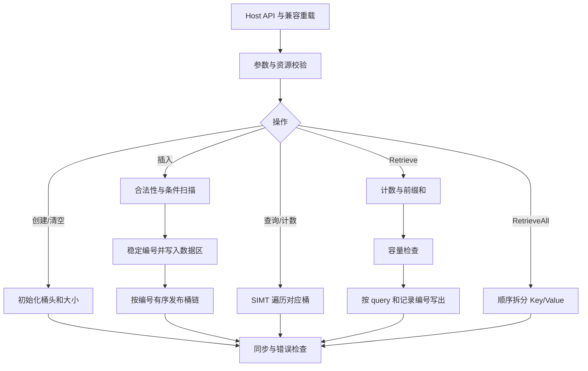

# static_multimap 容器设计文档

> 任务：9 月社区任务 static_multimap 容器开发（950）
>
> 贡献者：Helloyouth_git
>
> 代码仓：[ops-collections](https://gitcode.com/cann/ops-collections)，[个人 fork](https://gitcode.com/Helloyouth_git/ops-collections)
>
> 目标环境：Atlas 950 系列及后续支持 SIMT 的昇腾产品；CANN 9.0.0-beta.2 及以上
>
> 文档状态：实现前设计评审；下述性能均为任务书基线和验收上限，不是 NPU 实测结果。

# 一、需求背景

## 1.1 需求来源

依据随任务提供的 `static_multimap_task_doc.md` 及 `test-cases/`，参考 NVIDIA cuCollections
`static_multimap`，在 Ascend C 上实现固定容量、多值键值映射容器。设计覆盖 Create、Destroy、Clear、
Insert、InsertIf、Contains、ContainsIf、Find、FindIf、Count、Retrieve、RetrieveAll 全部 12 项能力。

文档组织参考 radius 设计文档的“需求背景、需求分析、详细设计、特性交叉、可维可测、兼容性”结构；
工程实现遵循本任务的纯头文件容器模式，不引入 Python 包装、aclnn 算子注册或独立算子根目录。

## 1.2 背景介绍

多值映射用于邻接关系、分组查询和一对多索引。与 StaticMap 相比，重复 Key 不覆盖已有 Value，
完全相同的 `(Key, Value)` 也应作为独立记录保存。容量按记录条数计算，而不是不同 Key 的数量。

### 1.2.1 参考实现现状

| 参考 | 已核对位置 | 本任务采用方式 |
| --- | --- | --- |
| cuCollections | `include/cuco/static_multimap.cuh` | 多重集合语义、查询和检索契约。 |
| ops-collections | `include/static_map.h`、`include/detail/static_map/` | Host 容器、设备引用、Extent、Pair、流和模板风格。 |
| ops-collections | `tests/CMakeLists.txt`、`scripts/build.sh` | Catch2、性能框架与现有构建入口。 |
| 随包测试 | `test-cases/static_multimap/`、`benchmark/static_multimap/` | 验收调用签名、边界行为、参数组合和计时范围。 |

本次检查的 ops-collections revision 为 `9d12996d4317e28420d74bcb1ec4d3b3507599ce`；
cuCollections dev revision 为 `532795b81e72e3fe4ce2b26eb0c5abc8abb1e2b4`。
实现、CUDA 对照和验收日志必须记录实际使用的 revision，不能用可变 dev 分支名称替代。

### 1.2.2 需明确的契约差异

| 项目 | 参考或任务描述 | 本设计约定 |
| --- | --- | --- |
| Insert 返回值 | 任务书举例为成功数；当前 cuco multimap 返回 void；本地 StaticMap 和随包测试返回失败数。 | 返回失败数，成功数为候选数减失败数；在 API 文档明确记录，提交评审确认。 |
| Count 输出 | 任务书通用表提及逐项输出；cuco 和随包测试调用返回总数。 | 必选接口返回所有 query 的总匹配数；逐项 count 仅为内部中间量。 |
| 参数顺序 | 任务书要求对应 cuco 顺序，随包 Find/Contains 等采用仓库原有顺序。 | 提供 cuco 顺序主接口和薄兼容重载，共用实现。 |
| Retrieve 匹配输出 | 当前 cuco 输出匹配的 Pair；随包测试输出 Value 数组。 | 主接口提供 Pair 输出，兼容重载提供 Value 输出；不能把 Pair 缓冲区解释为 Value 缓冲区。 |
| 超容量输入 | 通用表写 `numInputs<=capacity`；随包测试插入 `Capacity()+5` 条。 | Insert 允许输入条数超过容量，接纳可容纳的前缀，返回剩余失败数；不越界。 |
| 空指针插入 | 通用表写校验报错；随包测试要求 `Insert(nullptr,3)==3`。 | 普通 Insert 按 3 条失败返回、状态不变；其他非法参数按异常契约处理。 |
| 顺序和 Find 选值 | cuco 不保证输出顺序或多匹配时选哪一个。 | 固定插入顺序下按记录编号产生稳定结果，是参考允许行为的确定化。 |

上述差异是可审查的适配边界，不通过修改随包断言掩盖。评审若调整契约，应同步更新主接口、兼容层和新增测试。

## 1.3 任务条款基线

| 编号 | 要求 | 设计落点 |
| --- | --- | --- |
| RQ-01 | 12 项生命周期和批量操作 | 2.3 接口、3.3 Kernel 流程。 |
| RQ-02 | I32/I32、I64/I64 | 模板静态约束、两套测试实例，不窄化 Key。 |
| RQ-03 | 重复 Key 和重复 Pair 均保留 | 每次有效插入分配独立记录编号。 |
| RQ-04 | 相同输入及状态结果确定 | 前缀接纳、有序桶链、稳定扫描输出。 |
| RQ-05 | 空输入、命中率、multiplicity、容量边界 | 2.4 异常表、5.2 测试矩阵。 |
| RQ-06 | 纯头文件集成 | 3.1 文件映射与现有 CMake 接入。 |
| RQ-07 | Atlas 950、CANN >=9.0.0-beta.2 | 能力探针、编译器与架构匹配。 |
| RQ-08 | 每个性能 case 达到标杆 0.4 倍 | 5.3 全部 32 行基线与上限。 |
| RQ-09 | 无线性重复的 payload 拷贝 | 3.5 静态数据区、索引和工作空间预算。 |
| RQ-10 | 1086 功能 case、32 性能 case 和日志 | 5.2、5.4 自验流程。 |

# 二、需求分析

## 2.1 功能及数学语义

将容器视为按稳定编号保存的记录序列 `D=[(k_j,v_j)]`，当前条数为 S，实际容量为 C，满足 `0<=S<=C`。
对查询 `q_i` 定义 `M_i={j | k_j=q_i, 0<=j<S}`，则：

| 操作 | 语义 |
| --- | --- |
| Contains | `out[i] = !M_i.empty()`。 |
| ContainsIf | `out[i] = pred(stencil[i]) && !M_i.empty()`，未激活输出 false。 |
| Find | 未命中输出 emptyValue；命中输出编号最小的记录 Value。 |
| FindIf | 未激活或未命中输出 emptyValue；其余同 Find。 |
| Count | `E=sum_i |M_i|`，重复 query 分别累计，不做去重。 |
| Retrieve | 按 query 下标 i、再按记录编号 j 递增输出匹配结果，共 E 条；未命中不输出占位项。 |
| RetrieveAll | 按编号 `[0,S)` 输出所有 Key/Value，共 S 条，重复 Pair 不合并。 |

例如插入 `[(7,10),(7,20),(7,10),(9,30)]`，query 为 `[7,8,7]`：Contains 为
`[true,false,true]`，Find 为 `[10,emptyValue,10]`，Count 为 6；Retrieve 输出两组完整的
`[(7,10),(7,20),(7,10)]`。Clear 后 S=0，容量不变。

InsertIf 的候选是 `pred(stencil[i])==true` 的条目。按输入下标给合法候选编号，剩余容量 R=C-S，
只接纳前 R 个合法候选；条件为 false 的条目既不插入，也不计作失败。非法保留键作为失败条目统计。
候选数 A、接纳数 K 和失败数 F 满足 `F=A-K`。普通 Insert 视所有输入为候选。

## 2.2 外部依赖与约束

| 依赖 | 要求 |
| --- | --- |
| 硬件 | Atlas 950 及后续 SIMT 产品，读取平台能力，不写死核数。 |
| CANN | 9.0.0-beta.2 及以上；实际原子操作、内存序和 SIMT 能力经编译及运行探针验证。 |
| 编译器 | 仓库支持的 ccec 或毕昇 ASC；架构值必须与工具链一致。 |
| 构建 | CMake >=3.16，沿用仓库脚本及 COLLECTION 目标。 |
| 测试 | Catch2 >=3.5.4；CUDA/cuCollections 只用于参考结果，不成为 NPU 库依赖。 |

Key/Value 验收范围仅为 `int32_t/int32_t`、`int64_t/int64_t`，连续 Device 数组，无广播。
emptyKey 不能作为输入键；emptyValue 用于 Find 未命中，容器有效性由编号和链表决定。
Value 等于 emptyValue 时仍能存储和检索，是否命中应通过 Contains 判断；CUDA 对照避开参考不支持的保留值输入。
容量固定，不提供 Erase、自动扩容或并发读写保证。

## 2.3 公共接口与兼容层

以下为拟议声明，`E=aclco::Extent<std::size_t>`、`SizeType=std::uint64_t`，索引和字节计算均做溢出检查。
实际头文件补齐命名空间、const 限定和仓库宏，生命周期通过 RAII 和显式接口共用同一实现。

```cpp
StaticMultimap(E capacity, Key emptyKey, Value emptyValue, aclrtStream stream);
static StaticMultimap Create(E capacity, Key emptyKey, Value emptyValue,
                            aclrtStream stream);
void Destroy(aclrtStream stream);
void Clear(aclrtStream stream);
SizeType Capacity() const;
SizeType Size(aclrtStream stream) const;

SizeType Insert(void* pairs, E count, aclrtStream stream);
template<class StencilT, class Predicate>
SizeType InsertIf(void* pairs, E count, StencilT* stencil,
                  Predicate pred, aclrtStream stream);
void Contains(void* keys, E count, bool* output, aclrtStream stream);
template<class StencilT, class Predicate>
void ContainsIf(void* keys, E count, StencilT* stencil, Predicate pred,
                bool* output, aclrtStream stream);
void Find(void* keys, E count, void* valuesOut, aclrtStream stream);
template<class StencilT, class Predicate>
void FindIf(void* keys, E count, StencilT* stencil, Predicate pred,
            void* valuesOut, aclrtStream stream);
SizeType Count(void* keys, E count, aclrtStream stream);
SizeType Retrieve(void* keys, E count, Key* probeOut,
                  aclco::Pair<Key, Value>* matchOut, E outputCapacity,
                  aclrtStream stream);
SizeType RetrieveAll(void* keysOut, void* valuesOut, E outputCapacity,
                     aclrtStream stream);
```

输入区间 `(first,last)` 映射为 `(pointer,count)`；Predicate 保留为设备可调用对象，支持带状态谓词。
Retrieve 返回条数替代两个尾迭代器，额外的 outputCapacity 用于检查边界。提供以下随包测试兼容重载：

```cpp
void Contains(void* keys, void* output, E count, aclrtStream stream);
void Find(void* keys, void* output, E count, aclrtStream stream);
template<class StencilT, class Predicate>
SizeType InsertIf(void* pairs, StencilT* stencil, E count, aclrtStream stream);
template<class StencilT, class Predicate>
void ContainsIf(void* keys, StencilT* stencil, void* output,
                E count, aclrtStream stream);
template<class StencilT, class Predicate>
void FindIf(void* keys, StencilT* stencil, void* output,
            E count, aclrtStream stream);
SizeType Retrieve(void* keys, E count, void* probeOut, void* valuesOut,
                  E outputCapacity, aclrtStream stream);
```

无显式谓词的重载只对可默认构造的 Predicate 启用，并转发 `Predicate{}`。Pair 输出主接口与 Value 输出兼容接口
通过输出类型区分；`nullptr` 的零长度调用由明确的空指针重载或显式类型消歧。编译测试覆盖重载选择。
StencilT 在验收中为 uint32；谓词在 Device 执行，不把 stencil 搬到 Host。
Contains 系列兼容重载的 output 指向 count 字节，逐元素写 uint8 的 0/1，与随包 unsigned char
缓冲区一致；主接口写 bool，不要求调用方把 void* 隐式转换为 bool*。

## 2.4 校验、异常与同步语义

| 场景 | 行为 |
| --- | --- |
| capacity=0、字节数/累计输出数溢出 | 抛出参数或溢出异常，不分配或启动数据 Kernel。 |
| count=0 | 已构造容器上允许相关数组为 nullptr；返回 0 或 no-op。 |
| Insert 的 pairs=nullptr 且 count>0 | 返回 count，容器不变，与随包测试一致。 |
| Insert/InsertIf 中出现 emptyKey | 该候选计入失败，不写入，其他合法候选按输入顺序接纳。 |
| InsertIf 非空时输入或 stencil 为空 | 抛出参数异常，不能在无法读取谓词时伪造失败数量。 |
| 查询非空时输入/定长输出为空，或条件查询 stencil 为空 | 抛出参数异常。 |
| 查询中出现 emptyKey | 校验 Kernel 标记非法输入，读取状态后抛出异常，不当作合法 miss。 |
| Retrieve 输出容量不足 | 先计算 E，再抛出异常；不写部分输出。 |
| RetrieveAll 输出容量不足 | 在 Kernel 前以 S 检查并抛出异常。 |
| 已 Destroy/移动后的对象调用数据操作 | 报未初始化；重复 Destroy 为 no-op。 |
| 非法 device/context/stream、ACL 或 Kernel 失败 | 保留原始错误码和操作阶段，报错；运行时写入失败后标记对象不可继续使用，仅允许销毁。 |

裸指针接口不能自行识别真实数组长度、dtype 或任意指针的分配边界。模板约束类型，调用方保证指针实际类型和
至少 count 个元素；对可查询到的 ACL 分配信息做补充检查。不能承诺对任意裸指针都在 Host 检出越界。

必选接口采用同步完成语义：各阶段绑定传入流，仅同步该流并检查错误，返回后结果可见。
Host 标量 Count/Size/失败数只回读标量。默认 nullptr 流按 ACL 合法默认流处理，不将其直接判错。
对象记录创建时的 device/context；每次调用验证归属。多个流访问同一对象由调用方串行安排，禁止重叠写入。
析构不抛异常，尽力释放资源并记录失败；显式 Destroy 可报告失败。禁止复制，移动转移所有权。

# 三、需求详细设计

## 3.1 工程映射与使能

| 文件 | 职责 |
| --- | --- |
| `include/static_multimap.h` | 公共声明、生命周期、类型约束和兼容重载。 |
| `include/static_multimap_ref.h` | Device 只读视图：数据、桶头、next、size、sentinel。 |
| `include/detail/static_multimap/static_multimap.inl` | Host 检查、分配、分派、流同步。 |
| `include/detail/static_multimap/static_multimap_ref.inl` | 桶定位、比较、稳定遍历。 |
| `include/detail/static_multimap/kernels.h` | Init、Append、Link、Query、Count、Scan、Retrieve 模板 Kernel。 |
| `tests/static_multimap/` | 随包功能用例和补充边界用例。 |
| `tests/performance/static_multimap/` | 随包 8 个性能源文件、32 个参数 case。 |
| `tests/common/multi_container_test_common.h` | 共用数据生成和 CPU oracle，按需隔离 multiset 依赖。 |
| `docs/static_multimap_API文档和使用示例.md` | 接口、输出顺序、构建、运行和复现说明。 |
| `tests/CMakeLists.txt`、`README.md` | 增加测试 glob、容器介绍和测试入口。 |

保持模板定义可从头文件引用；内联非模板辅助函数，避免多翻译单元重复定义。
不直接复用 StaticMap 的“相等键即停止插入”逻辑，不修改既有容器的语义。

实现后的预期命令如下，架构需按实际工具链选择：

```bash
source "${ASCEND_HOME_PATH}/set_env.sh"
# ccec 通常使用 CCE_AICORE_ARCH=dav-c310；毕昇通常使用 BISHENG_AICORE_ARCH=dav-3510。
# 以已安装编译器支持的值为准，只设置对应变量。
bash scripts/build.sh -r --test-name static_multimap
bash scripts/build.sh -p
ctest --test-dir build/performance -R '^static_multimap_' --output-on-failure
```

随包 benchmark 源文件迁入 `tests/performance/static_multimap/`，保留相对性能框架路径。
当前 CMake 未自动包含新容器目录，实施时必须补充两个 glob。
随包 common 头同时 include `static_multiset.h` 并定义 MakeMultiset；本任务不要求实现 multiset，
可将 set 专属 include/factory 移至独立辅助头，保持 multimap 数据生成和全部断言不变。

## 3.2 总体架构



### 3.2.1 存储结构

容器在 Create 时分配容量 C 的连续 Pair 数据区 `records[C]`、桶头 `heads[B]` 和索引 `next[C]`。
初版 B=C，桶由固定种子的整数哈希 `h(Key)%B` 定位；不为容量取整到二次幂导致容量预算失真。
Key 的全部 32/64 位参与哈希，碰撞时必须比较完整 Key。

记录下标就是稳定编号；有效范围 `[0,S)`，不需要每槽另存 key sentinel 或占用状态。
每个桶链按记录编号严格递增，包含该桶的所有有效记录，链尾为 invalidIndex。不同 Key 可共享桶。
验收容量小于 `UINT32_MAX` 时用 uint32 索引，保留全 1 为 invalidIndex；更大容量选择 uint64 索引，
只有工具链能力和 checked allocation 均满足时才使能。I64 Key 不意味着必须使用 64 位索引。

该结构付出显式索引空间，换取重复 Pair 保留、确定性的 Find/Retrieve 和连续的 RetrieveAll。
逻辑容量与 distinct key 数量无关，满表后查询仍有链尾，不依赖空槽早停。

### 3.2.2 Host 计划与分核

Host 计划传递 C/B/S/count、输出容量、dtype、indexWidth、操作类别和平台分核信息；地址通过 Kernel 参数传入。
对于连续数据读写和 query，使用唯一的 grid-stride 映射：

```text
tid = blockIdx * threadsPerBlock + threadIdx
stride = blockDim * threadsPerBlock
for i = tid; i < count; i += stride:
    process(i)
```

blockDim 不超过平台可用核数，小输入减少 block；线程组大小通过工具链支持和实测选择。
连续 scan/reduce 按 tile 分块，尾块显式掩码；计数用 uint64，索引地址乘法使用 size_t/uint64 的受检计算。
不将所有哈希访问搬入 UB，SIMT 随机读取走 GM；UB/寄存器用于连续扫描、局部规约和短链查询状态。

## 3.3 生命周期与写入 Kernel

### 3.3.1 Create、Destroy、Clear

Create 检查容量，分配静态存储，初始化 heads 为 invalidIndex，S=0，返回前同步。
未发布的 records/next 不读取，无需为整块 payload 填 sentinel。任一步分配失败释放已分配资源。
Clear 清空 heads、S 和内部统计，旧数据失效，保留容量和已分配工作空间；下一次编号从 0 开始。
Destroy 释放容器和工作空间，清空所有权；析构及显式 Destroy 共用资源管理路径。

### 3.3.2 Insert、InsertIf 的稳定接纳

1. 在 Device 计算合法候选标志：普通 Insert 检查 key；InsertIf 先计算谓词，再检查激活项 key。
2. 对合法标志做 exclusive scan，得到各合法条目的 rank 和合法数 L；同时规约候选数 A。
3. K=min(L,C-S)，仅 rank<K 的条目写 `records[S+rank]`，记录按原始输入顺序连续存储。
4. 初始化新节点的 next，后续独立 Kernel 将其发布到对应桶的有序链。
5. 链发布完成后提交新 S，失败数为 A-K。非法 key、满容量失败都不产生半条 Pair。

普通 Insert 在验证所有键合法且容量足够时省去逐项 rank 存储，直接用 `S+i` 编号；
不能仅根据性能 case 的数据规律跳过验证。混合非法键和条件插入复用稳定扫描路径。
这避免用原子抢占决定满容量时保留哪些记录，使跨运行的状态和返回值一致。

### 3.3.3 有序链发布与内存可见性

每个新节点 id 只由一个线程负责插入；沿链找 `pred < id < succ` 的位置，将未发布节点的 next 设为 succ，
再对 heads[b] 或 next[pred] 做 CAS，期望值为 succ，目标值为 id。CAS 失败后重新查找位置，
因为另一线程可能已插入更小编号节点。成功后本线程不再重写自己的 next；后续 next 更新均通过原子操作。

不删除、不复用本轮节点，避免 ABA；所有并发读取链接都使用与 CAS 兼容的原子访问。
发布采用工具链验证过的 release/acquire 语义或等效 Device 内存栅栏，不能假定 CUDA intrinsic 可直接移植。
records 在前一 Kernel 完整写入；query 在 Link Kernel 完成后才启动，不与插入重叠。
没有跨核自旋锁或要求所有 block 同时驻留的全局屏障。

节点编号唯一，链始终递增，所有线程完成后桶链唯一确定。索引宽度原子操作不受支持时，在启动前选择
下述批量建链方案；不以非原子读写替代 CAS。

### 3.3.4 高冲突路径与复杂度

均匀分布时平均链长约 S/B，查询平均为 O(1+S/B)，顺序记录写入为 O(N)。
所有键落同桶时，逐节点有序插入可能达到 O(N²)，因此不能把该路径作为高 multiplicity 的唯一实现。

批量路径对新记录编号按 `(bucket,id)` 排序，只重排索引，不复制 Pair payload；扫描排序结果形成各桶新链，
再由每个活跃桶的唯一线程/线程组将已有链尾连接到新链头。由于所有新 id 大于旧 id，旧链只需遍历一次，
不需要逐个节点重扫旧链；不同桶独占 heads/next 更新。排序可用确定性 radix histogram/scan/scatter 实现，
每轮独立 Kernel，复用两块索引缓冲区，复杂度为固定轮数 O(N) 加活跃桶旧记录遍历成本。

路径选择依据插入前的桶计数/冲突统计、批量大小和工作空间预算，阈值由 950 profiling 固化。
自适应条件和两条路径使用相同编号与链顺序；切换不改变容量选择或输出。
初版先验证通用路径和批量路径正确性，再按完整 API 时延选择阈值；不能以降低重复度换取性能。

## 3.4 查询、计数和检索 Kernel

### 3.4.1 Contains、ContainsIf、Find、FindIf

一个线程处理一个 query，读取对应桶链并逐条比较 Key。Contains 首次命中即可返回 true；
Find 首次命中就是最小编号记录，返回其 Value。链尾仍未命中时写 false/emptyValue。
条件版本对未激活项直接写 false/emptyValue，不依赖调用方预先初始化输出。
查询输入合法性可在同一 Kernel 标记错误，但结果只在 Host 检查通过后才视为有效。

### 3.4.2 Count

每个 query 统计全部匹配，块内规约后写块级 uint64 计数，再规约总数并回读一个标量。
不为 Count 分配 N 个 Pair 或 N 个输出结果。计数加法检测溢出；重复 query 不能因 key cache 而丢失重复次数。

### 3.4.3 Retrieve

1. 第一遍得到每个 query 的匹配数 `c[i]`，做 uint64 exclusive scan 得到 `offset[i]` 和总输出 E。
2. 回读 E 和错误标志；检查 E<=outputCapacity、两路输出指针及受检字节数。E=0 时允许空输出。
3. 第二遍按 query 独占区间 `[offset[i],offset[i]+c[i])` 写结果，桶链天然保证记录编号顺序。
4. Pair 输出写 `(query,matchedPair)`；Value 兼容输出写 `(query,matchedValue)`；返回 E。

两遍之间容器不允许变化；不使用全局 atomicAdd 分配输出片段，因此线程调度不会改变输出顺序。
E 可大于 C：同一键被重复查询时，每次都要输出全部匹配，不得把输出上限错误限制为容器容量。
极长链可由线程组分段遍历，但最终写出位置仍由确定性前缀确定。

### 3.4.4 RetrieveAll

S 已知且数据连续，直接将 `records[0:S]` 拆成 Key/Value 输出；无需全容量扫描、原子计数或排序。
每个线程写相同编号位置，只处理有效记录。空容器返回 0，不访问输出指针。

## 3.5 内存预算

设 P 为 Pair 字节数（I32 为 8，I64 为 16）、w 为索引字节数，B=C：

| 数据 | 规模 | 生命周期 |
| --- | --- | --- |
| records | P*C | 静态容器存储，唯一 payload 副本。 |
| heads、next | w*(B+C) | 静态索引。 |
| size、错误状态、块级规约 | O(blockDim) | 容器元数据/复用工作空间。 |
| 条件插入扫描 | 最多约 8*N 加 tile 摘要 | 按需工作空间，可按固定 tile 分批重算 rank。 |
| 批量建链排序 | 两份 w*N 索引，加直方图/块偏移 | 仅高冲突或能力回退路径；复用同一 scratch arena。 |
| Retrieve offsets | 8*(N+1) 加 scan 摘要 | 原地由计数转换为 offset，不重复保存 Pair。 |
| 输出 | 按 E 和输出类型分配 | 调用方所有，显式容量校验。 |

C=2e8、w=4 时静态容器约为 I32 3.2 GB、I64 4.8 GB（十进制）；N=1e8 的 Retrieve offset 约 0.8 GB。
输入、输出、性能框架缓冲区也必须计入峰值，不能只报告容器常驻内存。
工作空间不永久同时保留所有算法的最大缓冲区；可共用 arena，在当前流操作结束后复用。
桶计数、排序直方图和 scan 摘要的实际大小必须在实施时列入分配清单和报告，不隐藏在线性开销中。
OOM 在修改容器前返回错误；若不足以承载排序路径，按受限 tile 构建索引或使用通用路径，不能丢弃记录。

## 3.6 性能优化与能力门禁

优化优先级为连续 payload 读写、减少 scalar 同步次数、短链 SIMT 查询、Count 块级规约、
Retrieve 两遍扫描的 workspace 复用，以及高冲突批量建链。查询延迟受索引随机访问影响，RetrieveAll 受带宽影响。
索引占用和确定性插入成本可能使性能落后于开放寻址，这是必须通过 950 实测验证的风险，不预先宣称达标。

实施前分别验证 32/64 位索引 CAS、内存发布可见性、跨 Kernel 流顺序、Device 谓词、uint64 scan/reduce 和
两种编译器多翻译单元构建。缺少必需能力时选择批量路径或给出明确的不支持错误，不以 Host 全量计算代替 NPU 实现。

# 四、特性交叉分析

| 交叉项 | 处理和验证 |
| --- | --- |
| 重复键 × 完全重复 Pair | 逐记录存储；Size、Count、Retrieve 保留多重性。 |
| 满容量 × 并发插入调度 | scan 先决定接纳前缀；CAS 不决定哪些记录被保留。 |
| I64 × 索引32 | Key/Value 始终 I64，索引仅由容量决定；测试高32位不同的键。 |
| 条件谓词 × miss | false 输出 false/emptyValue；条件为 false 的插入不计失败。 |
| 重复 query × 输出容量 | E=sum 匹配数，允许 E>C；先查容量再写出。 |
| 高碰撞 × 确定性 | 两种建链路径最终均按稳定 id 递增，结果逐字节一致。 |
| Clear × 再插入 | 重置桶头和编号，旧记录不可见。 |
| 移动/销毁 × DeviceRef | 原引用失效，调用方不得复用；同步接口避免未完成内部访问。 |
| 多流 × 写入 | 单对象调用串行化，不承诺重叠读写；不同对象可独立使用。 |
| 原子能力 × 索引宽度 | 编译探针和运行验证；批量索引路径提供替代。 |

# 五、可维可测分析

## 5.1 精度与确定性标准

整数、布尔、计数采用精确比较，不设置浮点误差容忍。CPU 真值使用 `std::unordered_multimap` 验证多重集合，
另用按插入顺序保存的 vector 验证确定性 Find 和 Retrieve 顺序。CUDA 对照仅比较参考承诺的语义：
Find 的值属于匹配集合，Retrieve/All 排序后多重集合相同；不要求复现 CUDA 未指定的选择和顺序。

NPU 重复执行相同完整调用序列，比较 Size、失败数、Find 和未经排序的 Retrieve/All 输出；
覆盖不同分核、常规/批量路径，至少重复 100 次。失败路径也比较状态，特别检查满容量保留的记录集合。
本设计未运行 NPU 功能或性能测试，以下均为实施验收计划。

## 5.2 功能用例

随包 case 按 dtype、GENERATE 和 SECTION 展开，数量沿用任务书口径；新增 case 单独统计。

| 接口 | 随包用例数 | 关键检查 |
| --- | ---: | --- |
| Create | 14 | 1/5/128/1027/8192/1000000 容量、零容量异常。 |
| Destroy | 18 | 多容量、占用率和重复生命周期。 |
| Clear | 32 | 大小归零、容量保持、重新插入。 |
| Insert | 290 | 0.1/0.5/0.9 占用率、重复 Pair、空指针、满容量。 |
| InsertIf | 20 | uint32 stencil、不同谓词激活比例。 |
| Contains | 100 | multiplicity=1/2/4/8、命中率和空输入。 |
| ContainsIf | 56 | 激活与命中交叉、false 输出。 |
| Find | 100 | 多值成员合法性、miss sentinel、重复 query。 |
| FindIf | 56 | 未激活/miss sentinel、空输入。 |
| Count | 100 | 多重性累计、重复 query、空输入。 |
| Retrieve | 98 | 精确条数、重复 query 的多重集合、零输出。 |
| RetrieveAll | 202 | occupancy=0/0.1/0.5/0.9/1、完全重复 Pair。 |
| 合计 | 1086 | I32/I32、I64/I64。 |

补充测试覆盖：主接口/兼容重载编译；带状态谓词；非法保留键；容量不足时输出 canary 不变；
E>C；uint64 计数溢出保护；全部键同桶；I64 极值及高位碰撞；非整块尾部；移动和重复 Destroy；
分配失败清理；无泄漏生命周期；两条索引路径等价；未初始化输出缓冲区；显式流/默认流和不同对象多流。
不能为了达到用例数量而削减随包 SECTION，或仅运行某个 dtype。

## 5.3 性能基线及上限

要求逐 case 满足 `speedup=T_reference/T_NPU >=0.4`，即 `T_NPU<=2.5*T_reference`。
下表单位均为 ms；上限为基线乘 2.5，判断时使用未四舍五入值。
Create/Destroy 的 C=1e8；其余 N=1e8、occupancy=0.5、multiplicity=1，按随包代码实际创建 C=2e8。

| 接口 | Key/Value | MatchingRate | 标杆 ms | NPU 上限 ms |
| --- | --- | --- | ---: | ---: |
| Create | I32/I32 | - | 7.635412 | 19.0885300 |
| Create | I64/I64 | - | 15.419803 | 38.5495075 |
| Destroy | I32/I32 | - | 9.038761 | 22.5969025 |
| Destroy | I64/I64 | - | 17.766071 | 44.4151775 |
| Contains | I32/I32 | 0.1 | 7.175591 | 17.9389775 |
| Contains | I32/I32 | 0.5 | 6.876158 | 17.1903950 |
| Contains | I32/I32 | 1.0 | 6.272652 | 15.6816300 |
| Contains | I64/I64 | 0.1 | 9.062888 | 22.6572200 |
| Contains | I64/I64 | 0.5 | 8.907699 | 22.2692475 |
| Contains | I64/I64 | 1.0 | 8.698283 | 21.7457075 |
| Find | I32/I32 | 0.1 | 7.842479 | 19.6061975 |
| Find | I32/I32 | 0.5 | 7.674542 | 19.1863550 |
| Find | I32/I32 | 1.0 | 7.065370 | 17.6634250 |
| Find | I64/I64 | 0.1 | 9.708089 | 24.2702225 |
| Find | I64/I64 | 0.5 | 9.566873 | 23.9171825 |
| Find | I64/I64 | 1.0 | 9.300692 | 23.2517300 |
| RetrieveAll | I32/I32 | - | 1.469109 | 3.6727725 |
| RetrieveAll | I64/I64 | - | 3.421753 | 8.5543825 |
| Insert | I32/I32 | - | 9.984867 | 24.9621675 |
| Insert | I64/I64 | - | 13.994128 | 34.9853200 |
| Retrieve | I32/I32 | 0.1 | 12.055540 | 30.1388500 |
| Retrieve | I32/I32 | 0.5 | 13.038496 | 32.5962400 |
| Retrieve | I32/I32 | 1.0 | 13.475749 | 33.6893725 |
| Retrieve | I64/I64 | 0.1 | 14.419790 | 36.0494750 |
| Retrieve | I64/I64 | 0.5 | 15.764821 | 39.4120525 |
| Retrieve | I64/I64 | 1.0 | 16.426197 | 41.0654925 |
| Count | I32/I32 | 0.1 | 5.868191 | 14.6704775 |
| Count | I32/I32 | 0.5 | 5.974523 | 14.9363075 |
| Count | I32/I32 | 1.0 | 6.097573 | 15.2439325 |
| Count | I64/I64 | 0.1 | 8.712889 | 21.7822225 |
| Count | I64/I64 | 0.5 | 8.838063 | 22.0951575 |
| Count | I64/I64 | 1.0 | 8.985895 | 22.4647375 |

## 5.4 计时、复现和交付

随包 Measure 使用 Host chrono，返回微秒值；报告转为 ms，保留 API 内分配、校验、Kernel、规约和同步成本。
输入生成与 H2D 在 Setup 中完成并同步；不将这些预处理误加到单次 API 基线，也不将 API 内工作移出计时区间。
Insert 每轮后 Clear，不能让 warmup 填满容器；Create/Destroy 每轮使用独立有效实例。
沿用原框架的基准口径，同时记录 warmup/重复次数、均值、中位数、P95、失败次数和完整原始日志。
Device event 的分阶段时延仅用于分析，不能替代 Host API 验收时间。

自测报告记录硬件型号、驱动/CANN/编译器版本、架构参数、两个仓库及参考 revision、dtype、容量、
输入条数、实际占用率、multiplicity、命中率、随机种子、错误码、峰值 Device 内存和命令。
功能执行全部 1086 用例及补充矩阵；性能输出全部 32 行与 `T_reference/T_NPU`。
未达 0.4 的行逐项提供 profiling、原因和优化记录，不用总体平均掩盖单项失败。

交付顺序为：设计文档 PR 评审；ops-collections 中实现与测试；950 自验和报告；更新 README/API 文档；
提供个人仓分支与目录，按任务书在待验收阶段邀请 Ascend-CANN 为开发者；最后提交代码 PR 和验收申请。
本次设计 PR 不包含实现完成或性能通过的声明。

# 六、兼容性与风险

| 风险 | 处理 |
| --- | --- |
| 任务书、随包测试、当前 cuco 契约存在差异 | 1.2.2 明确差异，主接口与兼容重载共同评审并验证。 |
| CAS 内存序和 64 位能力随编译器变化 | 探针验证；采用批量无竞争建链替代不支持的路径。 |
| 有序链随机访问成本高 | 32 位索引、短链优化、批量建链及完整 API profiling。 |
| 1e8 规模内存峰值高 | 分阶段 arena、索引排序而非 payload 拷贝、实际分配清单和 OOM 测试。 |
| 裸指针无长度元数据 | 明确调用前置条件，检索使用显式 outputCapacity，测试 canary 检测越界。 |
| 上游版本变化 | 固定 revision 复现；升级后重跑接口和构建检查。 |

新增独立 StaticMultimap 类型，不改变 StaticMap/StaticSet ABI 或返回值。纯头文件模板需在
至少两个翻译单元实例化 I32/I64 并链接，验证 ODR；原有容器测试作为代码实施阶段回归门禁。
不承诺未经实测的性能，所有验收结论必须附目标硬件日志。

# 七、参考资料

1. 任务包：`9月社区任务-mulimap容器开发(950)/static_multimap_task_doc.md` 及同包 test-cases。
2. [cuCollections static_multimap 固定版本](https://github.com/NVIDIA/cuCollections/blob/532795b81e72e3fe4ce2b26eb0c5abc8abb1e2b4/include/cuco/static_multimap.cuh)。
3. [ops-collections](https://gitcode.com/cann/ops-collections)。
4. [社区设计模板](https://gitcode.com/cann/cann-ops-competitions/blob/master/04_tasks/01_community-task-2026/resources/design_template.md)。
5. 结构参考：`tasklist/20260801-radius/zhouzirui/docs/design.md`（用户指定的参考版本）。
6. [Ascend C 开发文档](https://www.hiascend.com/document/detail/zh/CANNCommunityEdition/850/opdevg/Ascendcopdevg/atlas_ascendc_map_10_0002.html)；具体 API 能力以所用 CANN 版本文档为准。
7. [社区任务流程及注意事项](https://gitcode.com/org/cann/discussions/39)。
