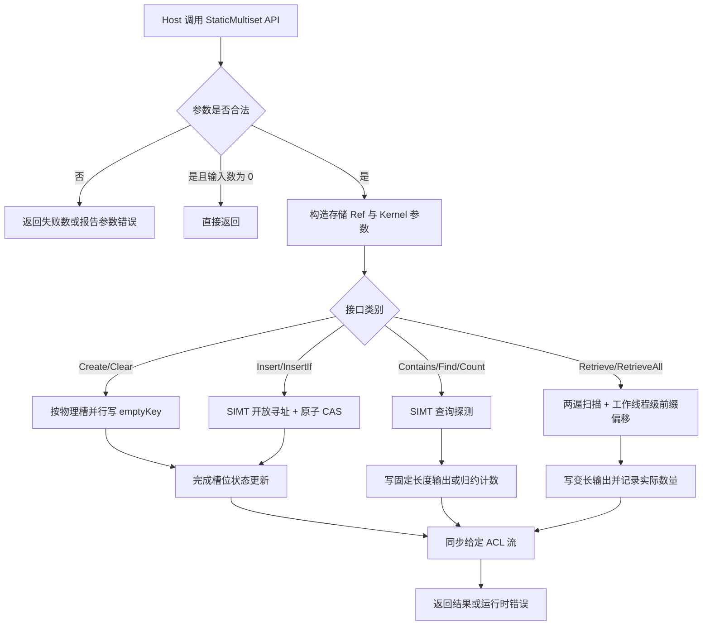
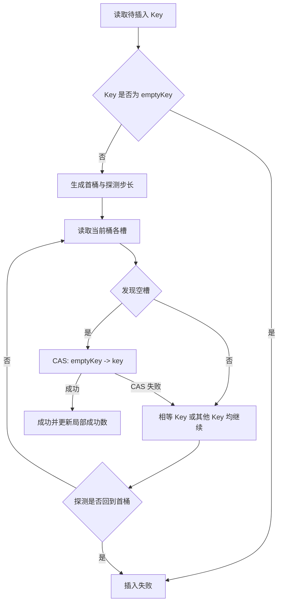
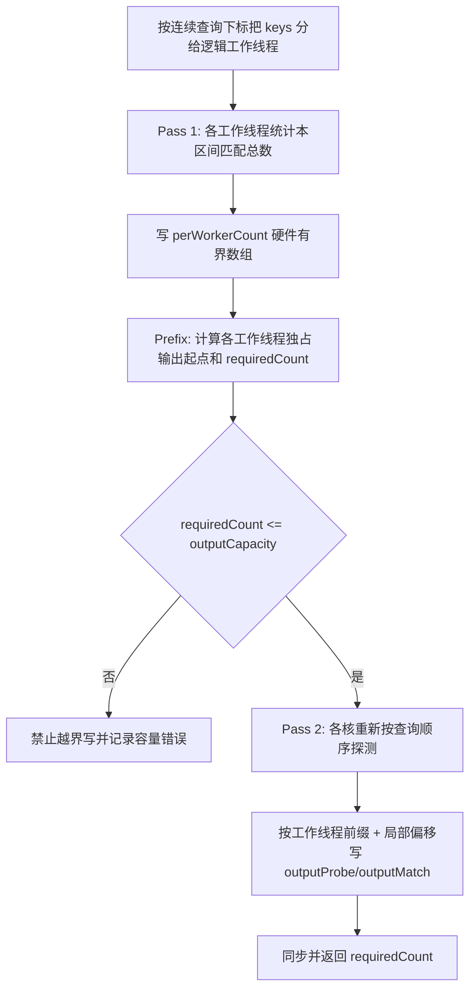

# static_multiset 容器设计文档

## 需求背景（required）

### 需求来源

本设计来源于《static_multiset 容器开发任务书》。任务要求参考 NVIDIA cuCollections 的 `cuco::static_multiset`，在 Atlas 950 系列及后续支持 SIMT 能力的昇腾产品上，以 Ascend C 和 C++ 实现静态容量、多值集合语义的 `StaticMultiset` 容器，并遵循 `ops-collections` 的纯头文件工程模式。

### 背景介绍

`static_multiset` 是容量在创建后固定、允许同一 Key 重复出现的无序关联容器。与 `static_set` 不同，重复 Key 不会被去重：每次成功插入都占用一个独立槽位，查询、计数和检索必须保留 multiplicity（同一 Key 的出现次数）。

任务目标不是新增传统 ACLNN 单算子，而是在 `ops-collections` 中新增可被 Host 侧批量调用、也可通过轻量 Ref 在 Device 侧访问的容器。工程交付路径如下：

```text
ops-collections/
├── include/
│   ├── static_multiset.h
│   ├── static_multiset_ref.h
│   └── detail/static_multiset/
│       ├── kernels.h
│       ├── static_multiset.inl
│       └── static_multiset_ref.inl
├── tests/static_multiset/
└── tests/performance/static_multiset/
```

参考对象包括：

- cuCollections `include/cuco/static_multiset.cuh` 与 `static_multiset_ref.cuh`：接口语义、多值集合行为和开放寻址方法；
- `ops-collections` 的 `StaticSet`、`OpenAddressingImpl`、`OpenAddressingRefImpl`、`BucketStorage`、探测策略、哈希函数和 Kernel 启动工具：工程结构和 Ascend C 实现基础；
- 任务书附带的 `static_multiset` 功能与性能测试：最终接口形式、边界行为及验收口径。

### 现状与差距

现有 `StaticSet` 已具备静态桶存储、双重哈希探测、SIMT 批量插入/查询、ACL 流管理和 I32/I64 原子更新基础，但其插入路径在遇到相等 Key 时返回“重复”，不会再占用新槽；`Count` 也只返回 0 或 1。因此不能直接复用 `StaticSetRef` 的语义。

本任务需要补齐以下差异：

| 能力 | `StaticSet` 现状 | `StaticMultiset` 目标 |
| --- | --- | --- |
| 重复键插入 | 相等 Key 视为重复，停止插入 | 相等 Key 继续探测，占用新的空槽 |
| Count | 仅返回存在性 0/1 | 返回完整 multiplicity |
| CountEach | 无逐查询 multiplicity 输出 | 每个查询输出 `uint64_t` 计数 |
| CountEachOuter | 无 | 未命中输出 1，命中输出真实计数 |
| Retrieve | 无批量多匹配输出 | 为每个查询输出全部匹配项 |
| RetrieveAll | 无全量压缩输出 | 输出所有非空槽，保留重复项 |
| Size | 无持久元素数 | 扫描非空槽统计当前元素数，重复项分别计数 |
| 可重复输出 | 不涉及变长多匹配输出 | 固定容器状态下采用确定的分区和槽序输出 |

## 需求分析（required）

### 需求描述

实现 `aclco::StaticMultiset<Key>`，支持 I32、I64 Key，提供创建、销毁、清空、插入、条件插入、存在性查询、条件存在性查询、查找、条件查找、总计数、逐项计数、Outer 逐项计数、按查询检索和全量检索能力。

容器容量创建后不自动增长；每个成功插入的 Key 占一个槽。相同 Key 可重复插入，`Size`、`Count`、`CountEach`、`Retrieve`、`RetrieveAll` 均以实际槽数为准。

### 需求拆解

1. 支持 I32、I64 两种 Key，实际存储类型与输入类型一致，不进行精度转换。
2. 支持合法的空输入、重复 Key、不同 multiplicity、命中/未命中、满容量和非整桶容量。
3. 提供 Host 侧批量 API 和 Device 侧 `StaticMultisetRef`，保持 `ops-collections` 纯头文件模式。
4. 使用桶式开放寻址和 SIMT 线程并行；重复 Key 不提前终止插入。
5. `Contains`/`Find` 对每个查询产生一个结果；`Count`/`CountEach`/`Retrieve` 保留完整 multiplicity。
6. 变长检索不得越过输出容量；固定容器状态下，检索输出按确定的查询区间、探测顺序和槽顺序组织。
7. 除容器表、调用方输出和核数级工作区外，不产生与输入规模线性重复的 Device 副本。
8. 同步 API 在返回前完成给定 ACL 流上的任务，并报告运行时错误。

### 功能语义

设容器中 Key `k` 的 multiplicity 为 `M(k)`，查询序列为 `Q = [q0, q1, ..., q(n-1)]`：

- `Contains(Q)[i] = (M(qi) > 0)`；
- `Find(Q)[i] = qi`（当 `M(qi) > 0`），否则为 `emptyKey`；
- `Count(Q) = Σ M(qi)`，查询序列中的重复项分别累加；
- `CountEach(Q)[i] = M(qi)`；
- `CountEachOuter(Q)[i] = max(M(qi), 1)`；
- `Retrieve(Q)` 为每个 `qi` 输出 `M(qi)` 个 `(qi, qi)`；查询重复时，相应输出段也重复；
- `RetrieveAll()` 输出容器的全部 `Size()` 个 Key，重复 Key 输出多次。

容器是无序关联容器，不承诺按 Key 大小排序。为了满足相同容器状态下结果可重复，`Retrieve` 使用“查询下标升序、同一查询内按探测桶及桶内槽升序”的物理输出顺序；`RetrieveAll` 使用“物理槽下标升序”的输出顺序。逻辑正确性仍按无序多重集比较。

### 接口范围与 cuCollections 对应关系

| 任务接口 | C++ 载体 | cuCollections 对应语义 |
| --- | --- | --- |
| Create | `StaticMultiset` 构造函数 | `static_multiset(capacity, empty_key_sentinel, ..., stream)` |
| Destroy | `~StaticMultiset` | RAII 析构 |
| Clear | `Clear` | `clear` |
| Insert | `Insert` | `insert`；本仓返回失败数量 |
| InsertIf | `InsertIf` | `insert_if` |
| Contains | `Contains` | `contains` |
| ContainsIf | `ContainsIf` | `contains_if` |
| Find | `Find` | `find` |
| FindIf | `FindIf` | `find_if` |
| Count | `Count` | `count` |
| CountEach | `CountEach` | `count_each` |
| CountEachOuter | `CountEachOuter` | `count_each_outer` |
| Retrieve | `Retrieve` | `retrieve` |
| RetrieveAll | `RetrieveAll` | `retrieve_all` |
| 容量/大小辅助接口 | `Capacity`、`Size` | `capacity`、`size` |

## 详细设计（required）

### 算子分析

#### 数据模型

容器由长度为 `actualCapacity` 的连续 Device Key 数组构成。空槽存储创建时指定的 `emptyKey`；合法输入 Key 不得等于该保留值。一个槽只保存一个 Key，因此：

```text
Size = 非 emptyKey 槽位数
0 <= Size <= actualCapacity
M(k) = 表中满足 KeyEqual(k, slotKey) 的槽位数
```

不提供 Erase，因此不存在墓碑槽。查找从 Key 的首个探测桶开始；当前桶扫描完成后，如桶内出现空槽即可停止，表满时以探测序列回到初始桶作为终止条件。

#### 支持数据类型

| 模板类型 | dtype | 槽宽 | 原子更新 |
| --- | --- | --- | --- |
| `int32_t` | I32 | 4 Byte | 32-bit CAS |
| `int64_t` | I64 | 8 Byte | 64-bit CAS |

`Key` 需满足 `sizeof(Key) <= 8` 且可按位比较。本任务公开验收仅实例化 I32、I64。

#### 支持形状

容器批量 API 将输入视为长度为 `numInputs` 的一维连续 Device 数组，不解释高维 shape。`stencil` 与 `keys` 长度相同；`Contains`、`Find`、`CountEach`、`CountEachOuter` 输出长度为 `numInputs`；`Retrieve` 输出长度由 `Count` 决定；`RetrieveAll` 输出长度由 `Size` 决定。

#### 容量与桶组织

- 默认 `bucketSize = 5`，与 `StaticSet` 的默认桶配置一致；
- 默认探测策略为 `DoubleHashing<xxhash_32<Key>>`；
- `actualCapacity` 通过现有 `MakeValidExtent<ProbingScheme, Storage>` 计算，至少为请求容量，并满足桶宽和探测周期要求；
- 所有容量、输入数量、计数和索引在 Host/Device 边界使用 `SizeType`，默认实例为 64-bit `size_t`，避免批量场景中的隐式窄化。

### 对外算子原型

```cpp
namespace aclco {

static constexpr size_t defaultMultisetBucketSize = 5;

template <class Key,
          class Extent = Extent<size_t>,
          class KeyEqual = aclco::EqualTo<Key>,
          class ProbingScheme = aclco::DoubleHashing<aclco::xxhash_32<Key>>,
          class Storage = Storage<defaultMultisetBucketSize>>
class StaticMultiset {
 public:
  using SizeType = typename Extent::ValueType;
  using KeyType = Key;
  using ValueType = Key;

  StaticMultiset(StaticMultiset const&) = delete;
  StaticMultiset& operator=(StaticMultiset const&) = delete;
  StaticMultiset(StaticMultiset&&) = default;
  StaticMultiset& operator=(StaticMultiset&&) = default;

  // Create：兼容任务测试中的 capacity、emptyKey、stream 调用形式。
  explicit constexpr StaticMultiset(Extent capacity,
                                    Key emptyKey,
                                    aclrtStream stream = nullptr);

  // 可配置比较器、探测与存储策略的完整构造形式。
  constexpr StaticMultiset(Extent capacity,
                           Key emptyKey,
                           KeyEqual const& pred,
                           ProbingScheme const& probingScheme,
                           Storage storage,
                           aclrtStream stream = nullptr);

  // Destroy
  ~StaticMultiset();

  void Clear(aclrtStream stream);

  // 返回未插入元素数；相同 Key 的每个实例均独立尝试插入。
  SizeType Insert(void* keys, Extent keyNum, aclrtStream stream);

  template <typename StencilT, typename Predicate>
  SizeType InsertIf(void* keys,
                    StencilT* stencil,
                    Extent keyNum,
                    aclrtStream stream);

  void Contains(void* keys,
                void* outputValues,
                Extent keyNum,
                aclrtStream stream) const;

  template <typename StencilT, typename Predicate>
  void ContainsIf(void* keys,
                  StencilT* stencil,
                  void* outputValues,
                  Extent keyNum,
                  aclrtStream stream) const;

  void Find(void* keys,
            void* outputValues,
            Extent keyNum,
            aclrtStream stream) const;

  template <typename StencilT, typename Predicate>
  void FindIf(void* keys,
              StencilT* stencil,
              void* outputValues,
              Extent keyNum,
              aclrtStream stream) const;

  // 返回所有查询 Key 的 occurrence 总和。
  SizeType Count(void* keys, Extent keyNum, aclrtStream stream) const;

  // outputValues 指向 uint64_t[keyNum]。
  void CountEach(void* keys,
                 void* outputValues,
                 Extent keyNum,
                 aclrtStream stream) const;

  // 未命中查询输出 1，命中查询输出真实 multiplicity。
  void CountEachOuter(void* keys,
                      void* outputValues,
                      Extent keyNum,
                      aclrtStream stream) const;

  // 输出 query/match 对；返回实际检索数量。
  SizeType Retrieve(void* keys,
                    Extent keyNum,
                    void* outputProbe,
                    void* outputMatch,
                    Extent outputCapacity,
                    aclrtStream stream) const;

  // 输出全部非空槽；返回实际检索数量。
  SizeType RetrieveAll(void* outputKeys,
                       Extent outputCapacity,
                       aclrtStream stream) const;

  [[nodiscard]] SizeType Size(aclrtStream stream) const;
  [[nodiscard]] constexpr SizeType Capacity() const noexcept;
  [[nodiscard]] auto Ref() const noexcept;
};

}  // namespace aclco
```

条件接口保持 `ops-collections::StaticSet` 的调用形式：`Predicate` 为可在 Device 侧默认构造并调用的模板参数，需以 `COLLECTION_SIMT_DEVICE` 修饰 `operator()`；其语义对应 cuCollections 的运行时 `pred` 参数。本任务不额外扩展异步公开接口，避免在要求之外引入生命周期和错误上报差异。

### Device Ref 原型

`StaticMultisetRef` 为不拥有存储的轻量对象，按值传入 Kernel，负责单 Key 探测操作：

```cpp
template <typename Key,
          typename KeyEqual,
          typename ProbingScheme,
          typename StorageRef>
class StaticMultisetRef {
 public:
  using SizeType = typename StorageRef::SizeType;
  using ValueType = typename StorageRef::ValueType;

  COLLECTION_HOST_DEVICE explicit constexpr StaticMultisetRef(
      Key emptyKey,
      KeyEqual const& predicate,
      ProbingScheme const& probingScheme,
      StorageRef storageRef) noexcept;

  template <typename ProbeKey>
  COLLECTION_SIMT_DEVICE bool Insert(ProbeKey key) noexcept;

  template <typename ProbeKey>
  COLLECTION_SIMT_DEVICE bool Contains(ProbeKey key) const noexcept;

  template <typename ProbeKey>
  COLLECTION_SIMT_DEVICE ValueType Find(ProbeKey key) const noexcept;

  template <typename ProbeKey>
  COLLECTION_SIMT_DEVICE SizeType Count(ProbeKey key) const noexcept;

  template <typename ProbeKey, typename CallbackOp>
  COLLECTION_SIMT_DEVICE void ForEach(
      ProbeKey key, CallbackOp& callback) const noexcept;
};
```

`OpenAddressingRefImpl` 增加 `AllowsDuplicates` 策略参数，或在 `StaticMultisetRef` 内实现等价特化。必须保证 `StaticSetRef` 的既有去重语义不变。

### 参数与返回值约束

| 参数/返回值 | 类型 | 约束与语义 |
| --- | --- | --- |
| `capacity` | `Extent` | 请求容量，必须大于 0；实际容量可能向上取整 |
| `emptyKey` | `Key` | 空槽保留值，合法 Key 不得使用该值 |
| `keys` | `void*` | Device 连续数组；非零输入时类型必须与 `Key` 一致 |
| `keyNum` | `Extent` | 本次输入元素数；允许为 0 |
| `stencil` | `StencilT*` | Device 连续数组，长度等于 `keyNum` |
| `Predicate` | 模板仿函数 | `Predicate{}(stencil[i])` 可在 Device 侧调用并转为 bool |
| `outputValues` | `void*` | `Contains*` 为 `uint8_t/bool`，`Find*` 为 `Key`，计数输出为 `uint64_t` |
| `outputProbe` | `void*` | `Retrieve` 的查询 Key 输出，元素类型为 `Key` |
| `outputMatch` | `void*` | `Retrieve` 的匹配 Key 输出，元素类型为 `Key` |
| `outputCapacity` | `Extent` | 调用方输出槽数；不得小于所需输出数量 |
| `stream` | `aclrtStream` | 有效 ACL 流；同步 API 返回前完成该流上的本次任务 |
| `Insert` 返回值 | `SizeType` | 未插入数量；表满、保留 Key 或非零输入空指针均计为失败 |
| `Retrieve*` 返回值 | `SizeType` | 实际检索到的输出元素数 |

边界约定：

- `keyNum == 0` 时允许相关输入/输出指针为 `nullptr`，接口无副作用；
- 为兼容任务测试，`Insert(nullptr, N>0, ...)` 返回 `N` 且不改变容器；`InsertIf` 的缺失输入同理；
- 其他非零输入的空指针、非法流、非法输出容量由 Host 侧参数检查报告错误；
- 输入 Key 等于 `emptyKey` 时不写表，并计入插入失败数；查询该保留值时按未命中处理；
- 输出空间不足时 Kernel 不越界写，Host 侧同步后报告容量错误；
- 公开同步 API 不允许与另一个流上的容器修改操作并发，调用方需以 ACL 流顺序保证同一容器访问有序。

### 整体执行流程



### Host 侧设计

#### 生命周期

1. 构造函数校验 `capacity > 0`，计算 `actualCapacity`。
2. 通过仓内默认 Allocator 分配连续 Device 槽数组、`emptyKey` 参数存储和硬件上限级工作区。
3. 在给定流上将全部槽清为 `emptyKey`；构造接口同步该流后返回。
4. 容器禁止复制，允许移动；移动后由唯一对象持有 Device 资源。
5. 所有本任务公开操作均为同步操作，因此析构时不存在由这些接口遗留的在途 Kernel；析构释放槽数组和辅助存储且不抛异常。

#### 参数检查与分派

- 模板实例在编译期限制 Key 宽度，并仅为 I32/I64 生成验收实例；
- Host 侧先处理零长度和空指针，再下发 Kernel；
- `ContainsIf`、`FindIf`、`InsertIf` 通过 `StencilT`、`Predicate` 模板实例化，不在运行时解释谓词；
- 所有 Kernel 使用调用者传入的 `aclrtStream`；同步接口在读取 Host 返回计数前调用流同步并检查返回码；
- `Size` 按物理槽扫描非空元素，将各逻辑工作线程的 64-bit 局部计数写入工作区，再在同一流上归约并回读；`Capacity` 直接返回 Host 侧保存的实际容量。不维护持久 `size` 计数，避免 Device Ref 直接插入时 Host 元数据失真。

#### 模板分支与 TilingKey

本容器为 C++ 模板直调模式，不经过算子注册和传统 Host TilingData 下发。Key 类型、Stencil 类型、Predicate、哈希和探测策略均在编译期实例化；每个公开操作对应独立 Kernel，不需要运行时 TilingKey。运行时仅计算 `actualCoreNum`、每个逻辑工作线程的连续输入区间以及尾区间长度。

| 编译期分支 | 实例 |
| --- | --- |
| Key 宽度 | I32、I64 |
| 操作类型 | Clear、Insert、InsertIf、Contains、ContainsIf、Find、FindIf、Count、CountEach、CountEachOuter、Retrieve、RetrieveAll |
| 条件谓词 | `StencilT` + `Predicate` 模板实例 |
| 探测/存储 | `ProbingScheme` + `Storage` 模板实例 |

不存在需要由 Host 信息路由到同一 Kernel 内不同算法分支的场景，因此不规划 TilingKey，避免无意义的运行时分派。

### Kernel 侧设计

#### 线程排布

批量接口采用统一的 SIMT grid-stride 形式。每个线程从全局线程下标开始处理一个或多个输入：

```cpp
for (SizeType i = blockIdx * threadNum + threadIdx;
     i < numInputs;
     i += blockNum * threadNum) {
  // process input[i]
}
```

Host 侧根据可用 AIV 核数与输入规模决定实际核数，小输入避免启动空闲核，大输入使用可用核。每核线程数使用仓内已验证的 SIMT 启动配置，并通过 `VF_CALL` 下发；设计不引入跨线程共享哈希状态。

#### 探测规则

对查询 Key `k`：

1. 使用默认哈希得到首桶及双重哈希步长；
2. 按探测迭代器遍历桶，每桶按槽下标升序访问；
3. 查询比较固定为 `KeyEqual(queryKey, slotKey)`；
4. 扫描完当前桶后，如桶内存在空槽则终止；表满时探测回到首桶终止；
5. I32/I64 插入分别使用现有 32-bit/64-bit `AtomicCasWrap` 路径。

#### Insert 与 InsertIf

`StaticMultisetRef::Insert` 与 `StaticSetRef::Insert` 的核心区别是：相等槽既不返回失败，也不返回成功，而是继续寻找空槽。



每个逻辑工作线程在寄存器中累计成功数和失败数，循环结束后各自写入唯一的 `perWorkerCount` 记录；后续 Reduction Kernel 在同一 ACL 流上归约失败数并回读 Host。该路径不依赖 64-bit 原子加，且不会对单个全局计数器形成逐元素争用。`InsertIf` 仅在 `Predicate{}(stencil[i])` 为 true 时执行上述流程；谓词为 false 的元素既不插入，也不计失败。

达到容量后后续插入完成一次完整探测并返回失败；容器不扩容。当后续调用 `Size` 时，以槽数组的当前非空状态为真值来源。

#### Contains、Find 与条件接口

`Contains` 和 `Find` 对每个查询分配一个逻辑线程，按探测序列访问：

- 发现相等槽：`Contains` 写 true，`Find` 写槽内 Key；
- 发现空槽或完整探测结束仍未命中：`Contains` 写 false，`Find` 写 `emptyKey`；
- `ContainsIf`/`FindIf` 先执行谓词。谓词为 false 时分别写 false/`emptyKey`，不访问哈希表。

由于 multiset 中相等槽保存相同 Key，`Find` 选择任一匹配槽都产生同一值，结果确定。

#### Count 与 CountEach

`StaticMultisetRef::Count(k)` 遍历 `k` 的完整有效探测链并累计所有相等槽；扫描完当前桶后，如桶内存在空槽则返回，表满时探测一周后返回。

- `CountEach` 将每个查询的计数直接写入 `uint64_t output[i]`；
- `CountEachOuter` 写 `max(count, 1)`；
- `Count` 由每个逻辑工作线程在寄存器内累计其所处理查询的计数，写入独占的 `perWorkerCount`，再以独立 Reduction Kernel 归约 64-bit 总数，流同步后回读 Host。

计数累加使用 64-bit，避免 `numInputs × multiplicity` 超出 32-bit。

#### Retrieve

为兼顾可重复输出、边界安全和全局原子争用，`Retrieve` 采用按逻辑工作线程分区的两遍探测。逻辑工作线程数由实际核数和每核线程数决定，数量受硬件上限约束，不随输入规模线性增长：



每个逻辑工作线程负责一个连续查询区间，线程间输出区间由前缀和确定，线程内按查询下标、探测桶和桶内槽顺序写出。因此固定容器状态和固定输入下输出顺序可重复。工作区仅包含 `perWorkerCount`、`perWorkerOffset` 和总数，规模为 `O(actualCoreNum × threadsPerCore)`，由启动配置上限约束，不随 `numInputs` 线性增长。

Pass 1、Prefix、Pass 2 使用同一 ACL 流上的独立 Kernel，依赖流内顺序完成阶段间可见性，不依赖未验证的 Kernel 内跨核同步。Prefix 阶段同时产生 `requiredCount` 和容量状态；Pass 2 在容量不足时整体跳过写出，Host 同步后报告错误。

#### RetrieveAll

`RetrieveAll` 对物理槽数组做确定性压缩：

1. 将连续槽区间分给逻辑工作线程；
2. Pass 1 统计各工作线程的非空槽数；
3. 计算工作线程级前缀和，得到本次扫描的 `requiredCount`，并校验 `outputCapacity >= requiredCount`；
4. Pass 2 按物理槽下标升序写出所有非空 Key。

重复 Key 位于不同物理槽，因此会被分别输出。该方法没有逐元素全局原子分配，输出顺序按物理槽固定；三个阶段同样使用流内多 Kernel 顺序衔接。

#### Clear

`Clear` 将整个槽数组并行重置为 `emptyKey`。失败计数、检索计数和工作线程级工作区在每次使用时被覆盖，不属于容器逻辑状态。I32/I64 基线路径均可使用合并的 32-bit/64-bit SIMT 连续写；若实现阶段采用现有 SIMD `Duplicate + DataCopy` 快速路径，必须先确认目标架构对相应 Key 宽度的支持，未验证的 I64 SIMD 路径不得替代基线路径。

### 并发与内存一致性

- 单个批量 Insert 内，不同线程通过原子 CAS 竞争空槽；普通读取不得替代 CAS；
- CAS 失败后必须重新读取并继续探测，包括 CAS 赢家写入相同 Key 的情形；
- 同一 ACL 流内的批量操作按流顺序执行；公开同步 API 返回后，后续 Host 调用可观察到完整状态；
- 本任务不支持对同一容器跨流并发修改，也不支持修改 Kernel 与查询 Kernel 同时执行；
- 查询阶段只读槽数组；`Size`、`RetrieveAll` 及其他计数接口都以当前槽状态为唯一真值来源，不依赖 Host 缓存元素数。

### 关键接口依据

| 接口/工具 | 设计用途 | 依据 | 结论 |
| --- | --- | --- | --- |
| `AscendC::Simt::VF_CALL` | 启动 SIMT VF | CANNBot `ascendc-simt-best-practices` 与仓内 `detail/open_addressing/kernels.h` | 沿用仓内调用模式 |
| `GetBlockIdx/GetBlockNum/GetThreadIdx/GetThreadNum` | 全局线程索引与工作分区 | CANNBot SIMT 线程排布规范与仓内现有 Kernel | 支持 grid-stride 和连续区间分配 |
| `AtomicCasWrap` | I32/I64 空槽占用 | 仓内 `utility/atomic_cas_wrap.h` 及 `OpenAddressingRefImpl` | 复用已存在的 32/64-bit 路径 |
| 流内 Reduction/Prefix Kernel | Insert/Count/Size 计数归约与 Retrieve 偏移 | CANNBot 跨核同步约束及仓内 Kernel 启动模式 | 阶段间使用同一 ACL 流，不在单 Kernel 内假设全核屏障 |
| `MakeValidExtent` | 计算桶宽和探测策略兼容容量 | 仓内 `extent.h`/`detail/extent/extent.inl` | 直接复用，不另写容量算法 |
| `aclrtSynchronizeStream` | 同步接口完成与错误检查 | 仓内 `OpenAddressingImpl` | 返回 Host 结果前同步并检查返回码 |

设计只依赖上述仓内已有接口。可选的 I64 SIMD Clear 快速路径未标记为已验证，必须在实现阶段查阅目标 CANN 文档或做最小编译穿刺后才能启用。

### 资源与内存预算

| 资源 | 大小 | 生命周期 | 说明 |
| --- | --- | --- | --- |
| Key 槽数组 | `actualCapacity × sizeof(Key)` | 容器生命周期 | 唯一与容量线性相关的内部存储 |
| emptyKey Device 参数 | `sizeof(Key)` | 容器生命周期 | Kernel 读取保留值 |
| 操作返回计数 | `2 × sizeof(uint64_t)` | 容器生命周期内复用 | 归约结果与容量状态 |
| `perWorkerCount` | `maxWorkerNum × 2 × sizeof(uint64_t)` | 容器生命周期内复用 | Insert 成功/失败、Count/Size 归约、Retrieve/RetrieveAll Pass 1 |
| `perWorkerOffset` | `actualCoreNum × threadsPerCore × sizeof(uint64_t)` | 容器生命周期内复用 | 确定性压缩起点 |
| 显式 UB Buffer | 0 Byte（SIMT 基线路径） | - | 插入/查询直接访问 GM，线程局部状态驻留寄存器 |

若 Clear 在实现阶段启用 SIMD 快速路径，其双缓冲 tile 满足：

```text
2 × tileElements × sizeof(Key) <= 运行时可用 UB
```

tile 长度按目标平台运行时查询值计算，不在设计中硬编码 UB 容量。除调用方输出外，不分配 `O(numInputs)` 中间数组。

### 文件与模块划分

| 文件 | 职责 |
| --- | --- |
| `include/static_multiset.h` | 对外类模板、同步批量 API、生命周期与辅助接口声明 |
| `include/static_multiset_ref.h` | Device 非拥有 Ref 与单 Key 操作声明 |
| `include/detail/static_multiset/static_multiset.inl` | Host 侧参数检查、存储管理、Kernel 下发、同步和返回值实现 |
| `include/detail/static_multiset/static_multiset_ref.inl` | 允许重复键的插入、查找、计数和遍历实现 |
| `include/detail/static_multiset/kernels.h` | SIMT VF、外层 Kernel、Retrieve 两遍流程与工作线程级前缀逻辑 |
| `tests/static_multiset/` | I32/I64 功能、边界、异常与确定性测试 |
| `tests/performance/static_multiset/` | 任务书规定的 44 个性能实例 |

`OpenAddressingRefImpl` 若增加 `AllowsDuplicates` 模板参数，默认值必须保持 false，确保 `StaticSet`、`StaticMap` 既有行为和 ABI 使用方式不发生变化；若无法做到无影响，则将重复语义封装在 `detail/static_multiset/`，不修改公共开放寻址实现。

### 支持平台

| 目标产品 | 涉及勾选 |
| --- | --- |
| Atlas 950 系列产品 | √ |
| 后续支持 Ascend C SIMT 能力的昇腾产品 | √ |

### 算子约束限制

- Key 仅支持 I32、I64；
- `capacity` 必须为正数，创建后不自动增长；
- `emptyKey` 是保留值，不可作为合法 Key 插入；
- 输入和输出为 Device 侧连续内存，非零长度时不得为空；
- 条件接口的 `stencil` 长度必须与 Key 数量一致；
- 不提供 Erase、Rehash、动态扩容和跨流并发修改；
- 逻辑上是无序容器，不承诺按 Key 值排序；确定性顺序仅针对固定物理容器状态；
- 构建工具链与运行环境遵循任务书和目标仓库当前要求。

## 可维可测分析

### 可维护性分析

- 复用现有 Extent、BucketStorage、哈希、探测、Allocator、ACL 错误检查与启动工具，避免建立第二套基础设施；
- 将“允许重复”设为显式策略，StaticSet 与 StaticMultiset 的差异集中在 Ref 插入、Count 和变长检索路径；
- Host 批量接口、Device Ref、Kernel 三层职责清晰，便于后续增加异步接口或扩展 dtype；
- 所有变长输出均有显式 `outputCapacity`，把内存安全约束固化到接口；
- 计数统一使用 64-bit，减少规模扩展时的类型分叉。

### 正确性不变量

实现和评审阶段逐条检查以下不变量：

1. 任何槽仅能从 `emptyKey` 通过 CAS 变为合法 Key；Clear 之外不反向修改。
2. 一次成功 CAS 恰好将一个空槽变为合法 Key；`Size` 通过扫描非空槽得到，失败、跳过和保留 Key 不改变槽状态。
3. 重复 Key 不走 StaticSet 的 duplicate 提前返回路径。
4. 对任意 Key，`CountEach[k]` 等于 Retrieve 为该查询写出的元素数。
5. `Count(Q)` 等于 `CountEach(Q)` 各项之和。
6. `RetrieveAll` 返回值等于 `Size`，且输出多重集等于全部非空槽多重集。
7. `Clear` 后 `Size == 0`，所有查询未命中，且容器可再次插入。
8. 所有变长写入均先确定或守卫输出偏移，不发生越界。

### 测试设计

功能测试使用任务书附带的 1258 个展开用例，覆盖 I32/I64 和以下维度：

| 测试类别 | 覆盖内容 |
| --- | --- |
| 生命周期 | 最小/非整桶/大容量 Create，反复 Destroy，重复 Clear，Clear 后再插入 |
| Insert | occupancy 0.1/0.5/0.9，multiplicity 1/2/4/8，满容量与超容量，空输入与空指针 |
| 条件接口 | stencil 全 false、全 true、奇偶混合，谓词 false 的输出默认值 |
| 查询 | 命中率 0/0.1/0.5/1，重复查询、命中/未命中混合 |
| multiplicity | 1/2/4/8/1024，Count/CountEach/Retrieve 交叉核对 |
| Outer 语义 | 未命中为 1，命中保持真实计数 |
| 变长输出 | 精确容量、零输出、输出容量不足、返回数量一致性 |
| 确定性 | 固定容器状态与输入重复调用，逐元素比较输出；逻辑结果再做多重集比较 |
| 保留值 | 插入 `emptyKey` 失败且容器不变，查询按未命中处理 |
| 类型边界 | I32/I64 最小/最大合法 Key（排除 `emptyKey`）和大计数累加 |

测试 Oracle 使用 `std::unordered_multiset` 或排序后的 Host 多重集；`Retrieve` 同时校验 `outputProbe[i] == outputMatch[i]`、每个查询的输出次数和总返回数。

### 精度标准/性能标准

本容器只进行整数存储、哈希、相等比较和计数，不涉及浮点误差。正确性标准为 I32/I64 结果与 cuCollections 多值集合语义及 Host Oracle 完全一致。

性能验收统一采用：

```text
StaticMultiset 时延 <= 任务书标杆时延 / 0.4
```

关键基线与允许时延如下：

| 接口 | I32 标杆/允许时延（ms） | I64 标杆/允许时延（ms） | 场景 |
| --- | --- | --- | --- |
| Create | 4.152062 / 10.380155 | 8.740130 / 21.850325 | Capacity=100000000 |
| Destroy | 4.360688 / 10.901720 | 8.580200 / 21.450500 | Capacity=100000000 |
| Insert | 8.098100 / 20.245250 | 8.392043 / 20.980108 | NumInputs=100000000，Occupancy=0.5 |
| RetrieveAll | 0.660264 / 1.650660 | 1.016854 / 2.542135 | NumInputs=100000000，Occupancy=0.5 |
| Contains | 3.855939–4.580408 / 9.639848–11.451020 | 4.000158–4.755204 / 10.000395–11.888010 | MatchingRate=1–0.1 |
| Find | 4.332860–4.977099 / 10.832150–12.442748 | 4.571797–5.251019 / 11.429493–13.127548 | MatchingRate=1–0.1 |
| Count | 4.196007–4.684470 / 10.490018–11.711175 | 4.508944–5.010463 / 11.272360–12.526158 | MatchingRate=0.1–1 |
| CountEach | 4.874588–5.407013 / 12.186470–13.517533 | 5.054034–5.596096 / 12.635085–13.990240 | MatchingRate=0.1–1 |
| CountEachOuter | 5.265664–5.788201 / 13.164160–14.470503 | 5.443966–5.980948 / 13.609915–14.952370 | MatchingRate=0.1–1 |
| Retrieve | 8.770419–10.457202 / 21.926048–26.143005 | 9.133619–10.845923 / 22.834048–27.114808 | MatchingRate=0.1–1 |

完整性能用例按任务书逐行执行，共 44 个实例。本设计阶段不写入实验结果。

### 性能设计

| 瓶颈 | 设计措施 |
| --- | --- |
| 随机 GM 访问 | 桶内连续槽访问；默认负载率场景使用双重哈希避免长聚集 |
| Insert 原子争用 | 槽位更新只使用必要的 CAS；成功/失败数先在寄存器聚合，再写独占工作区归约 |
| Count 全局归约 | 每线程处理多个查询并局部累加，以硬件有界的中间计数 + Reduction Kernel 得到 64-bit 总数 |
| Retrieve 输出分配 | 硬件有界工作线程级 Count + Prefix，避免每个匹配项竞争单一全局计数器 |
| RetrieveAll 压缩 | 连续物理槽分区、两遍扫描、工作线程级前缀，保持合并读写 |
| Clear 带宽 | I32/I64 连续合并写；经目标 API 验证后可启用 SIMD tile 快速路径 |
| 小输入启动开销 | 根据输入规模裁剪实际 AIV 核数；零输入 Host 直接返回 |

方案的主要风险是高 occupancy 或极高 multiplicity 导致探测链变长。验收性能场景 occupancy 为 0.5、multiplicity 为 1；泛化测试中的高 multiplicity 优先保证语义正确。实现阶段如性能不足，应先以 Profiling 数据验证探测长度、GM 吞吐和原子占比，再调整桶宽、线程数或压缩流程，不能改变多值集合语义。

### 兼容性分析

`StaticMultiset` 为新增容器，不修改既有公开类名和调用方式。若复用 `OpenAddressingRefImpl`，新增策略参数使用保持现状的默认值，确保 `StaticSet`/`StaticMap` 的去重、插入返回值、查找和计数行为不变。新增头文件不会改变现有用户的包含依赖。

### 风险与对策

| 风险 | 影响 | 对策 |
| --- | --- | --- |
| 重复 Key 被误判为 duplicate | Size、Count、Retrieve 丢失 multiplicity | `AllowsDuplicates` 独立策略；高 multiplicity 专项测试 |
| CAS 失败后错误退出 | 并发插入丢元素 | CAS 失败一律重新探测；只以成功 CAS 判插入成功 |
| 高负载下提前遇空/错误终止 | 查询漏计 | 无 Erase 前提下验证首空终止不变量；表满使用整周终止 |
| 32-bit 计数溢出 | Count/Size 错误 | Host/Device 全链路使用 64-bit SizeType/计数器 |
| Retrieve 原子输出顺序不稳定 | 重复执行输出顺序变化 | 工作线程级两遍扫描和前缀偏移，不做逐元素全局抢占 |
| 输出容量不足 | Device 越界 | 输出写入前校验或边界守卫，Host 同步后报告错误 |
| 修改通用开放寻址影响既有容器 | 回归风险 | 默认 `AllowsDuplicates=false`；必要时把特化限制在 static_multiset 目录 |
| I64 Clear 快速路径能力未确认 | 编译或运行失败 | 使用 SIMT 64-bit 连续写作为基线，验证后再启用 SIMD 路径 |
| 跨流并发导致读写竞争 | 状态不一致 | 本任务接口契约明确禁止同一容器跨流并发修改/查询 |

### 设计核验清单

- [x] 任务书要求的 14 类生命周期与操作能力均有接口映射；
- [x] I32/I64、重复 Key、multiplicity、空输入、容量边界均有明确语义；
- [x] Host 批量 API、Device Ref 和 detail 实现路径符合纯头文件工程模式；
- [x] 插入算法明确区分 StaticSet 和 StaticMultiset；
- [x] Count、CountEach、CountEachOuter 的数学语义一致；
- [x] Retrieve/RetrieveAll 有输出容量保护和确定性组织方式；
- [x] 内存预算仅含容器槽、常数计数与核数级工作区；
- [x] SIMT 线程排布、CAS、流同步和错误边界已说明；
- [x] 性能标准逐项承接任务书 0.4 倍标杆要求；
- [x] 文档仅包含设计与验收口径，不写入实验结果。
