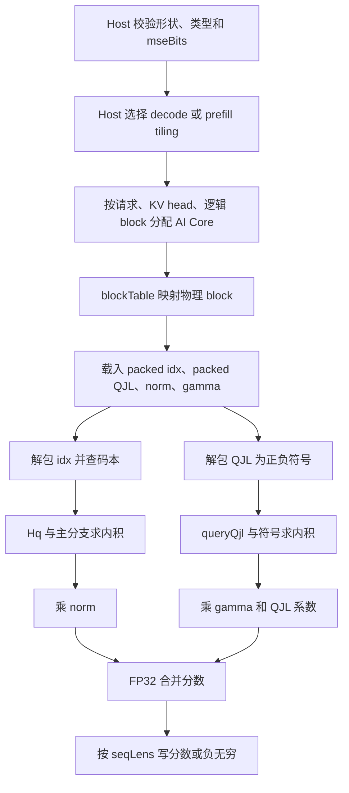
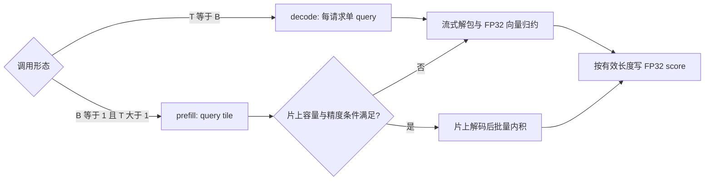

# TurboQuantAttentionScore 算子设计

# 需求背景（required）

## 需求来源

社区任务 `turbo_quant_attention_score` 要求在标准 MHA/GQA 的注意力分数阶段，直接读取 TurboQuant 编码的 Paged Key cache，输出可交给后续 softmax 的分数。本设计以任务书、随附 `op.json`、`case.json` 和 `golden.py` 为功能依据，参考社区设计文档模板组织章节。

## 背景介绍

全精度 Key cache 按每个 Key、每个 KV head 保存 `head_dim` 个半精度元素。TurboQuant 将其拆成主量化索引、QJL 残差符号、Key 范数和残差范数。直接从压缩布局计算分数，可以避免在全局内存中展开完整 Key cache。

本算子接收已经完成旋转的 `Hq` 和投影后的 `S(Hq)`。旋转矩阵乘法、QJL 投影、Value cache 解码、softmax 和 Value 聚合均由上下游负责；本设计不覆盖 MLA。

## 现有输入与参考行为

随附 `op.json` 定义 8 个输入、1 个输出和 `mse_bits` 属性，`case.json` 覆盖 4K/32K/128K decode 与 4K/32K prefill。`golden.py` 定义了下述可复现的编码约定：

- `block_size=128`，当前用例的 `head_dim=qjl_dim=128`；`mse_bits` 支持 2、3、4，默认 3。
- 主量化索引与 QJL 符号位均按字节内低位优先（LSB first）排列。QJL 位 `0` 对应 `-1`，位 `1` 对应 `+1`。
- 主量化码本由 bit 数决定，不作为运行时输入；码本取值与随附 `golden.py` 的 `CENTROIDS` 常量一致。
- 输出第三维为本次调用的最大有效 KV 长度；`seq_lens` 以外的位置写入 `-∞`。

任务书允许 `key_cache_norm`、`key_cache_gamma` 为 FP16 或 BF16，而随附 `op.json` 目前仅列出 BF16。设计目标覆盖两者；工程注册时须使 `op.json`、Host 校验和实际支持类型一致。

# 需求分析（required）

## 需求描述

对 query token `t`、query head `h`、缓存位置 `i`，令 `r=num_q_heads/num_kv_heads`、`g=floor(h/r)`，计算：

\[
\begin{aligned}
u_{t,h,i} &= \sum_{d=0}^{D-1} \operatorname{float}(q^{\mathrm{rot}}_{t,h,d})\,C_b(I_{i,g,d}),\\
v_{t,h,i} &= \sum_{j=0}^{J-1} \operatorname{float}(S(Hq)_{t,h,j})\,(2Q_{i,g,j}-1),\\
\operatorname{score}_{t,h,i} &= \operatorname{float}(x_{i,g})u_{t,h,i}
 + \frac{\sqrt{\pi/2}}{J}\operatorname{float}(\gamma_{i,g})v_{t,h,i}.
\end{aligned}
\]

其中 `I` 为解包后的 `mse_bits` 位索引，`C_b` 为对应码本，`Q` 为解包后的 QJL 位，`x` 为 Key 范数，`γ` 为残差范数。累加和最终输出采用 FP32；公式中没有额外的 `1/sqrt(D)` 缩放，与随附 golden 保持一致。

## 需求拆解

1. 通过 `block_table` 将逻辑 KV 位置映射到物理 block，支持每个请求独立的 `seq_lens`。
2. 解包 2/3/4 bit 主量化索引，查码本并计算主分支；解包 QJL 位，以实数 query 投影做符号加减归约。
3. 按 GQA 分组共享一个 KV head；`Hq=Hkv` 时自然退化为 MHA。
4. decode 优先使用直接流式向量路径；单请求多 query 的 prefill 可在块内复用解码后的 Key，并评估 Cube 批量内积路径。
5. 将输出写为 `[num_q_tokens, num_q_heads, max_kv_len]` 的 FP32 张量，短序列尾部写 `-∞`。

# 详细设计（required）

## 算子分析

### 接口与算子原型

计划注册的算子名为 `TurboQuantAttentionScore`，对外提供两阶段 aclnn 接口。下列为拟实现的原型，具体声明需在工程化时与算子注册生成结果核对：

```cpp
aclnnStatus aclnnTurboQuantAttentionScoreGetWorkspaceSize(
    const aclTensor *queryRotated, const aclTensor *queryQjl,
    const aclTensor *keyCacheIdx, const aclTensor *keyCacheQjl,
    const aclTensor *keyCacheNorm, const aclTensor *keyCacheGamma,
    const aclTensor *blockTable, const aclTensor *seqLens,
    int64_t mseBits, aclTensor *attnScores,
    uint64_t *workspaceSize, aclOpExecutor **executor);

aclnnStatus aclnnTurboQuantAttentionScore(
    void *workspace, uint64_t workspaceSize,
    aclOpExecutor *executor, aclrtStream stream);
```

| 参数 | 类型 | 形状 | 说明 |
| --- | --- | --- | --- |
| `queryRotated` | BF16 | `[T,Hq,D]` | 已旋转的 query |
| `queryQjl` | BF16 | `[T,Hq,J]` | 已投影的 query |
| `keyCacheIdx` | UINT8 | `[P,128,Hkv,ceil(D*b/8)]` | 主量化编码 |
| `keyCacheQjl` | UINT8 | `[P,128,Hkv,ceil(J/8)]` | QJL 残差编码 |
| `keyCacheNorm` | FP16/BF16 | `[P,128,Hkv]` | Key 范数 |
| `keyCacheGamma` | FP16/BF16 | `[P,128,Hkv]` | 残差范数 |
| `blockTable` | INT32 | `[B,M]` | 逻辑 block 到物理 block 的映射 |
| `seqLens` | INT32 | `[B]` | 每个请求的有效 KV 长度 |
| `mseBits` | INT64 属性 | 标量 | `b∈{2,3,4}`，默认 3 |
| `attnScores` | FP32 | `[T,Hq,L]` | `L=max(seq_lens)`；短序列无效位置为 `-∞` |

`P` 为物理 block 数，`M` 为每请求表容量。输出由调用方按已知最大有效长度 `L` 预分配；Host 不从设备侧 `seq_lens` 同步读回以推导形状。调用方保证 `L=max(seq_lens)`、`M≥ceil(L/128)`，且被引用的物理 block 编号在 `[0,P)` 内。若集成环境不能在调用前提供 `L`，应由上游传入等价的 host 侧长度元数据，不能隐式读取设备数据并造成同步。

当前任务包按 `D=J=128` 实现与验收。`T=B` 表示每请求一个 decode query；`B=1` 时允许 `T≥1` 个 query 共享同一段 KV cache（prefill）。因接口中没有 token 到请求的映射，`B>1 且 T≠B` 不属于本原型的定义域。`Hq/Hkv` 必须为正整数。输入须为连续 ND 布局，且各 cache 的前三维完全一致。

### 位编码与码本

对维度 `d`，主分支位偏移为 `p=d*b`，从 `byte=floor(p/8)` 开始读取足够的字节后取 `((word >> (p mod 8)) & (2^b-1))`。3 bit 索引可能跨字节，尾部不得越界读取。QJL 符号为 `2*((packed[j/8] >> (j mod 8)) & 1)-1`。对于 `D=J=128`，单个 Key 的索引分别占 32/48/64 字节，QJL 占 16 字节。

| `mse_bits` | 码本 `C_b`（按索引顺序，数值取自任务 golden） |
| --- | --- |
| 2 | `[-0.1335033178, -0.04002048075, 0.04002048075, 0.1335033178]` |
| 3 | `[-0.19020693, -0.1187859178, -0.06682205945, -0.02166347019, 0.02166347019, 0.06682205945, 0.1187859178, 0.19020693]` |
| 4 | `[-0.2414890379, -0.1828317791, -0.1429702938, -0.1109927073, -0.08325428516, -0.05802082643, -0.03428063914, -0.01134236995, 0.01134236995, 0.03428063914, 0.05802082643, 0.08325428516, 0.1109927073, 0.1429702938, 0.1828317791, 0.2414890379]` |

默认路径以 FP32 常量码本和 FP32 累加对齐 golden。若 Cube 路径使用 BF16/FP16 临时解码矩阵，须单独核对其舍入误差，不预设与 FP32 路径完全等价。QJL 项是实数与符号向量的内积，不能用两个符号 bit 向量的 popcount 替代。

### 数据流



逻辑位置 `i` 的物理地址为 `physical=blockTable[b,i/128]`、`offset=i%128`。输出地址为 `(t*Hq+h)*L+i`，每个 `(t,h,i)` 只由一个核写入，无跨核归约或原子操作。未使用的 `blockTable` 槽位不会访问。

## 算子实现

### Host 侧设计

Host 检查张量维数、dtype、连续性、相互匹配的 cache 形状、`b∈{2,3,4}`、`Hq%Hkv==0`、`D=J=128`、`T/B` 关系以及输出形状。`seqLens` 和 `blockTable` 的逐值合法性属于运行时输入契约；Kernel 根据 `seqLens` 限制有效 block 访问，调用方须提供有效映射。

Tiling 数据包含 `T/B/P/Hq/Hkv/L/M/b`、每组 query head 数、每任务逻辑 block 范围、query tile 大小、Key tile 大小、尾块长度和工作区大小。以 `(batch, kvHead, logicalBlock, queryTile)` 为基本任务，按总任务数与平台可用核数均匀分配，尾任务通过边界掩码处理。`B>1` 时每个 query 对应同编号请求；`B=1` 时所有 query tile 访问第 0 个请求。

初始 tiling 采用 128 个 Key 为一块：decode 的 query tile 为 1，prefill 的 query tile 以 16 为候选并受片上容量约束。Host 基于实际平台提供的 UB/L1/L0 容量和核数计算可行 tile；容量不满足时缩小 query tile 或 Key 子块，不在文档中假设固定的片上可用容量。`L` 大于有效长度的输出位置由 Kernel 显式填充 `-∞`。零长度序列及空输出不在当前任务包的支持范围。

### Kernel 侧设计

decode 路径将一个物理 Key block 的压缩数据分批搬入片上存储，按维度流式解包和查表。每个 KV head 对其对应的 GQA query head 复用一次 Key 编码，分别执行 FP32 主分支和 QJL 符号分支归约，再乘范数、合并并写出分数。符号分支按位选择 `+queryQjl[j]` 或 `-queryQjl[j]`，不生成全局内存中的符号矩阵。

prefill 路径让一个 query tile 复用同一 Key tile。候选实现是在片上展开当前 Key tile 的主量化值与 QJL 符号，分别计算两个 `Q_tile × K_tile^T`，然后逐列乘 `norm`、`gamma` 并合并。Cube 路径只在格式转换、片上容量和精度满足约束时启用；否则复用向量路径，以正确性覆盖全部任务形状。任何路径都不将完整反量化 Key cache 写入全局内存。



### 缓冲区与边界

单个 Key tile 至少需要 packed idx `128×48=6144` 字节（3 bit）、packed QJL `128×16=2048` 字节、两份 BF16/FP16 范数共 `512` 字节；按 FP32 临时展开主分支和 QJL 符号分别为 `128×128×4=65536` 字节。为避免两份 64 KiB 展开矩阵和双缓冲叠加超过片上预算，向量路径采用分维流式解包，Cube 路径按可用容量选择更小 Key 子块，并复用生命周期不重叠的缓冲。具体 UB/L1/L0 分配需由实现时的资源查询和编译检查确定。

最后一个逻辑 block 只处理 `min(128,seqLens[b]-128*logicalBlock)` 个有效位置。对 `i≥seqLens[b]` 且 `i<L` 写 `-∞`，不读取无效物理 block。`L` 与 128 不整除时仍写满输出有效地址范围；不写越界。多请求共享同一物理 block 允许重复读取，但不同输出区间无写冲突。

### 性能与存储分析

以 `D=J=128`、BF16 全精度 Key 为基准，每个 Key/KV head 占 256 字节。压缩 Key 加两项半精度范数在 2/3/4 bit 时分别占 `32+16+4=52`、`48+16+4=68`、`64+16+4=84` 字节，Key cache 理论压缩比分别为约 `4.92×/3.76×/3.05×`。这些数字仅针对 Key cache，不包括 Value cache、block table、输出分数或临时工作区。

decode 主要受压缩数据读取、解包和 FP32 归约影响；按一个 KV head 复用 GQA 组的 query，并将码本保留在片上以减少重复读取。prefill 主要受大量输出写回和重复使用同一 Key tile 影响，因此优先沿 query 维分块复用已解码 Key。是否启用 Cube 路径、tile 大小以及双缓冲，均以工程实现的容量与数值核验为准，不将理论压缩比推断为实测延迟收益。

# 支持硬件

| 硬件 | 开发环境 | 设计状态 |
| --- | --- | --- |
| Atlas 800T A2 | Ascend C、CANN 9.1.0+ | 目标平台；本文为设计，尚无上板结果 |

# 算子约束限制

- 仅支持标准 MHA/GQA 的 Key 分数计算，不支持 MLA、Value 解码、softmax、Value 聚合、旋转或 QJL query 投影。
- 当前任务包约束 `block_size=128`、`head_dim=qjl_dim=128`、`mse_bits∈{2,3,4}`；运行时编码必须与上述位序和码本完全一致。
- `T=B` 或 `B=1`；接口未提供任意多请求 prefill 的 token 到请求映射，也未提供 query 位置，因此不执行 causal mask。
- 输出要求调用方提供准确的 `L=max(seq_lens)` 与足够的 `blockTable` 容量；无效缓存位置以 `-∞` 填充。
- 任务书的全精度 `Q @ K^T` 是量化效果的对照，不是本算子的逐元素精度 golden；本算子逐元素计算以随附 TurboQuant `golden.py` 为准。

# 可维可测分析

## 精度标准与验证口径

| 项目 | 设计中的核对方法 | 来源 |
| --- | --- | --- |
| 算子逐元素一致性 | 对照随附 `golden.py`，覆盖 2/3/4 bit、跨字节索引、GQA/MHA、尾块和 `-∞` 掩码；FP32 输出按任务用例阈值判定 | `golden.py`、`case.json` |
| 注意力分布 | 与全精度路径经 softmax 后的权重比较，KL 散度目标 `<0.01` | 任务书 |
| 生成质量 | 联合下游算子评估 PPL 增长 `<1%`；本算子设计阶段不产生该结果 | 任务书 |
| decode 性能 | 同 shape、同平台、同计时范围下，含反量化的分数计算延迟目标不超过全精度路径 `1.2×` | 任务书 |
| Key cache 存储 | 按编码字节数核算；默认 3 bit 的理论压缩比约 `3.76×` | 编码布局与任务书 |

## 可观测性与风险

Host 的错误信息应区分 dtype、shape、bit 数、GQA 分组和输出长度错误。Kernel 排查时按逻辑 block、物理 block、KV head、query head 和首个错误位置定位主分支、QJL 分支或尾部掩码。关键设计风险包括：3 bit 跨字节解包、码本舍入导致的数值偏差、Cube 路径片上缓冲容量，以及 FP32 输出在长序列 prefill 下的写回成本。本文仅定义验证方法与风险，不记录尚未执行的实验结果。

# 兼容性分析

这是新增算子，不修改已有注意力算子的接口或缓存格式。其输入必须由采用上述 TurboQuant 编码约定的上游产生；输出可作为后续 softmax 的 FP32 分数输入。若未来扩展到其它 `head_dim`、`qjl_dim`、bit 位序或任意多请求 prefill，应同时更新接口契约、golden 与 tiling，不能将本设计的固定维度假定直接外推。
