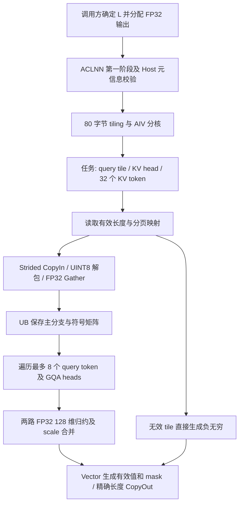

# TurboQuantAttentionScore 算子设计文档

# 需求背景（required）

## 需求来源

9 月社区任务《turbo_quant_attention_score 算子开发》，采用 ACLNN 算子工程，目标硬件为 Atlas 800T A2、软件为 CANN 9.1.0 及以上，目标目录为 `ops-transformer/experimental/attention/turbo_quant_attention_score`。

## 背景介绍

TurboQuant 将旋转空间中的 Key 编码为低比特主量化索引与一比特 QJL 残差符号，并保存每个 Key 的 norm 和 gamma。本算子在 UB 中按小块解码，计算主分支分数并叠加 QJL 残差修正，不在 GM 中生成完整解码 Key。

输入 query 已完成旋转和 QJL 投影。本算子只输出 attention score；旋转、量化编码、softmax、Value 解码和聚合由调用链其他部分完成。支持标准 MHA/GQA，不覆盖 MLA。

附件 Golden 使用 FP32 centroid 和实数 QJL query。本实现保持 FP32 码本、乘法和归约，QJL 为实数 query 与 `{-1,+1}` 的点积，没有将其替换为两个符号位向量的 popcount。

# 需求分析（required）

## 需求描述

实现分页 TurboQuant attention score，支持 2/3/4bit 主量化、128 维主 query、128 维 QJL 和 128 token 的物理页。输出为 FP32，请求有效长度之外的位置为负无穷。

任务书允许 norm、gamma 各自使用 FP16 或 BF16；实际注册四种组合，包括两个混合方向。附件 `op.json` 仅列出的 BF16/BF16 组合仍保持支持。任务书中 Prefill 32K 未填写 head_dim，按附件 `case.json` 的 128 执行。

## 需求拆解

1. 固定编码位序、FP32 码本、分页寻址和 GQA 映射，与附件数学语义一致。
2. 提供自动生成的 ACLNN 两阶段接口、Host 元信息校验、80 字节 tiling 和 Ascend C kernel。
3. Decode 沿 KV 长度分块并行；单请求 Prefill 每块复用最多 8 个 query token 和对应 KV head 的全部 GQA heads。
4. 使用有界 UB，不申请解码用 GM workspace，输出寻址使用 64 位整数。
5. 覆盖附件五个完整 shape，以及位宽、scale 类型、分页、尾部、空输出和非法元信息。
6. 分开报告算子公式精度、量化质量、设备时延、输入压缩量和应用峰值内存。

# 详细设计（required）

## 算子分析

### 符号与输入输出

定义 `T=num_q_tokens`、`B=batch`、`Hq=num_q_heads`、`Hkv=num_kv_heads`、`G=Hq/Hkv`、`P=num_blocks`、`M=max_blocks_per_seq`、`D=128`、`S=128`、`m=mse_bits`、`L=max(seq_lens)`。

| 参数 | 方向 | 数据类型 | ND shape | 含义 |
| --- | --- | --- | --- | --- |
| query_rotated | 输入 | BF16 | `[T,Hq,128]` | 预旋转 query |
| query_qjl | 输入 | BF16 | `[T,Hq,128]` | 实数 QJL 投影 |
| key_cache_idx | 输入 | UINT8 | `[P,128,Hkv,16*m]` | 主量化编码 |
| key_cache_qjl | 输入 | UINT8 | `[P,128,Hkv,16]` | 残差符号编码 |
| key_cache_norm | 输入 | FP16/BF16 | `[P,128,Hkv]` | Key L2 范数 |
| key_cache_gamma | 输入 | FP16/BF16 | `[P,128,Hkv]` | 原尺度残差范数 |
| block_table | 输入 | INT32 | `[B,M]` | 逻辑页到物理页的映射 |
| seq_lens | 输入 | INT32 | `[B]` | 请求有效 KV 长度 |
| attn_scores | 输出 | FP32 | `[T,Hq,L]` | Attention score |
| mse_bits | 属性 | int | 标量，默认 3 | 仅支持 2、3、4 |

Kernel 消费连续 ND 存储。注册声明 `AutoContiguous()`，测试输入显式构造为连续张量；kernel 自身不解释任意 storage stride，也不做广播。两个 query shape 相同，所有 cache 的前三维一致，`Hq % Hkv == 0`。

请求映射为：`B=1` 时所有 query token 属于请求 0；`B>1` 时要求 `T=B`，token t 属于请求 t。接口未提供多请求 Prefill 的 query 累积长度或映射，因此不支持该场景。

### 数学公式

对输出元素 `(t,h,k)`，令 `b=0 if B==1 else t`、`hk=floor(h/G)`。若 `k>=seq_lens[b]`，输出 `-inf`；有效位置计算：

```text
physical = block_table[b, k // 128]
offset = k % 128
idx[d] = unpack_m(key_cache_idx[physical,offset,hk], d)
sign[d] = 2 * unpack_bit(key_cache_qjl[physical,offset,hk], d) - 1

main = sum_d float(query_rotated[t,h,d]) * centroid_m[idx[d]]
residual = sum_d float(query_qjl[t,h,d]) * sign[d]
score = float(norm[physical,offset,hk]) * main
      + (sqrt(pi/2)/128) * float(gamma[physical,offset,hk]) * residual
```

系数以 FP32 常量 `0.009791516697777348f` 保存。输出不额外乘 `1/sqrt(128)`，不引入 causal mask。128 维归约的加法顺序可以与 Torch Golden 不同，按验收比较规则检查结果。

### 编码规则与码本

编码低位优先。2bit 每字节取位移 0、2、4、6；4bit 每字节取位移 0、4。3bit 每三个字节组成一个 24bit word，再解出 8 个索引：

```text
w = byte[3*j] + (uint32(byte[3*j+1]) << 8)
              + (uint32(byte[3*j+2]) << 16)
idx[8*j+r] = (w >> (3*r)) & 7, r=0..7
```

QJL 每字节按位 0 到位 7 解出 8 个符号，0 对应 -1，1 对应 +1。FP32 码本取自附件 Golden：

```text
2bit:
[-0.1335033178, -0.04002048075, 0.04002048075, 0.1335033178]

3bit:
[-0.19020693, -0.1187859178, -0.06682205945, -0.02166347019,
  0.02166347019, 0.06682205945, 0.1187859178, 0.19020693]

4bit:
[-0.2414890379, -0.1828317791, -0.1429702938, -0.1109927073,
 -0.08325428516, -0.05802082643, -0.03428063914, -0.01134236995,
  0.01134236995, 0.03428063914, 0.05802082643, 0.08325428516,
  0.1109927073, 0.1429702938, 0.1828317791, 0.2414890379]
```

## 算子实现

### 实现方案



#### 3.2.1 Host 侧设计

**ACLNN 接口。** CANN 9.1 工程生成 `aclnnTurboQuantAttentionScoreGetWorkspaceSize` 与 `aclnnTurboQuantAttentionScore`。第一阶段接收八个输入、位宽属性和预分配输出，返回 workspace 大小和执行器；第二阶段在给定 stream 上执行。已验证实际 GetWorkspaceSize、launch、同步和输出比较。

**动态输出合同。** `L=max(seq_lens)` 依赖 tensor 内容。此版本不注册 InferShape，调用方根据请求调度元数据确定 L，分配 `[T,Hq,L]`；Host 从 `GetOutputShape(0)` 获取 L。这条调用路径已上机验证。Host 不将分页容量 `M*128` 当作 L，也不读取 device 长度做 D2H 同步。

Host 可以检查 `0<=L<=M*128`，不能证明 L 等于实际最大长度。调用方必须保证该等式，并在执行期间保持 `seq_lens` 不变。若调度器只有 device 长度，应在调用前完成长度获取和输出分配，相关开销应计入应用端到端时间。该 ACLNN 合同不等价于框架图模式的数据依赖自动推形。

**元信息校验。** 检查八个输入及输出描述、rank、ND format、dtype 组合、具体维度、cache/query shape 一致性、128 维约束、位宽、GQA 整除关系、`B=1` 或 `B=T`、输出 `[T,Hq,L]`、分页容量和平台资源。维度不能超过 INT32 最大值；逐维乘积和字节容量检查 INT64 可表示范围。另检查 `(Hkv-1)*(16*m)` 不超过 UINT32 最大值，避免将 packed cache 源行间隔截断到 `DataCopyExtParams::srcStride`。要求 `T,Hq,Hkv,B>0`；允许 L=0，此时任务数为 0，kernel 不写输出。L>0 时要求存在物理 cache 页。

**Device 值的责任。** 合法输入满足 `0<=seq_lens[b]<=M*128`，有效位置引用的物理页位于 `[0,P)`。Host 不验证这些 device 数值。Kernel 对负长度按无有效位置处理，跳过完全无效 tile 的页表访问；遇到越界物理页时跳过 cache 访问，并把该 tile 输出为 `-inf`。这是访问保护，不是非法参数报错机制；当前没有 device assert 或错误码上报。过长长度、错误 L 和非法分页不是受支持输入，调用端及测试入口负责数值约束校验。

**任务划分。** 固定 KV tile 大小 `Nt=32`，为 128-token 物理页的因数，不跨页。`B=1 && T>1` 时 `Qt=queryTile=8`，其他场景 Qt=1。

```text
K = ceil(L / 32)
Q = ceil(T / Qt)
totalTasks = Q * Hkv * K
blockDim = min(AIV核数, max(1, totalTasks))

task = blockId, blockId + blockDim, ...
kvTile = task % K
kvHead = (task / K) % Hkv
tokenStart = (task / (K * Hkv)) * Qt
queryCount = min(Qt, T-tokenStart)
```

每个任务解码同一 KV head 的最多 32 个 Key，然后遍历 `queryCount*G` 个 query 向量。归约在一个核内完整执行，不跨核归约，不使用原子加。任务输出切片互不重叠，长序列通过 KV tile 提供 Decode 并行度。

**Tiling ABI。** POD 定义（`turbo_quant_attention_score_tiling.h`）固定为 80 字节：

| 类型 | 按内存顺序排列的字段 | 字节数 |
| --- | --- | ---: |
| 8 个 UINT64 | `numQTokens,numQHeads,numKvHeads,numBlocks,maxBlocksPerSeq,batch,maxKvLen,totalTasks` | 64 |
| 4 个 UINT32 | `mseBits,tileTokens,scaleType,queryTile` | 16 |

Kernel 用 `GET_TILING_DATA_WITH_STRUCT` 读取 POD。`scaleType` 的位 0/位 1 分别记录 norm/gamma 是否为 FP16；实际类型由 `DTYPE_KEY_CACHE_NORM`、`DTYPE_KEY_CACHE_GAMMA` 模板参数确定。TILING KEY 固定为 0；位宽和 query tile 是运行时字段，四种 scale dtype 组合由注册和构建系统生成对应二进制。

Host 要求至少 160 KiB UB；每核 `InitBuffer` 总量为 144,768 字节。`workspace[0]=0`，没有算法 GM workspace；已测 case 的 ACLNN workspace 返回值也是 0。

#### 3.2.2 Kernel 侧设计

**初始化及索引。** `Init` 绑定 GM tensor、申请固定 UB、初始化 FP32 码本。`InitIndices` 用 `CreateVecIndex<int32_t>` 生成 0 到 4095 的向量，通过 ShiftLeft、ShiftRight、Add/Muls 生成 Gather 偏移；临时复用 phase/product 缓冲，不新增常驻 UB。

含 `phases=2^p` 个位移组时，phase-major 到 `[32,128]` 的 Gather 字节偏移为：

```text
i = row*128 + dim
offset[i] = 4 * ((i % phases) * (4096/phases) + i/phases)
```

2/3/4bit 分别使用 phases=4/8/2，QJL 使用 phases=8。查表偏移均为字节单位并保持 4 字节对齐。

**分页及搬入。** tile 起始 KV 位置为 k，`physical=block_table[b,k/128]`；固定 KV head 的 cache 行编号为 `(physical*128+k%128)*Hkv+kvHead`，GM 地址计算使用 64 位整数。有效 token 数同时受 seq_len、L 和 32 限制。

固定 head 的相邻 packed token 在 GM 上相隔 `Hkv*C` 字节。`DataCopyPad` 块长为 C，源块间隔为 `(Hkv-1)*C` 字节，UB 每行占 64 字节。Host 要求 `(Hkv-1)*(16*mse_bits)<=UINT32_MAX`，避免 `DataCopyExtParams::srcStride` 截断；主编码宽度最大，该检查同时覆盖 QJL 和 scale 搬运。2bit/3bit/4bit/QJL 的 C 分别为 32/48/64/16，UB 目标额外 stride 分别为 1/0/0/1 个 32 字节块。先清零 UB，再搬入真实有效行，不读取无效 cache token。

norm/gamma 分别搬入：每行取 2 字节，源间隔为 `(Hkv-1)*2` 字节，UB 行按 32 字节对齐。Cast 到 FP32 后按每 16 个元素提取一个 scale，得到两个 32 元素向量。

**解包与查表。** Packed 字节先数值转换 `UINT8 -> FP16 -> INT32`，0..255 的所有值均可精确表示。3bit 用 Gather 提取三组字节，左移 8/16 位并相加得到 24bit word；2/4bit 直接取 widened byte。使用 A2 支持的 scalar shift 操作整个向量，不依赖逐元素 shift-count API。

FP32 centroid Gather 的偏移使用以下三步，不能省略最后的独立左移：

```text
v = uint32(word) << (32 - m*(r+1))
idx = v >> (32-m)
byteOffset = idx << 2
decoded = Gather(fp32Centroids, byteOffset)
```

QJL 三步为 `left(31-r) -> right(31) -> left(2)`，随后 Gather FP32 `[-1,+1]`。每个分支先写 phase-major 数据，再按预计算偏移一次 Gather 成 `[32,128]` 行主序。主分支和符号矩阵保留在 UB，供任务内全部 query 复用。

**点积与归约。** 每次加载一个主 query 和一个 QJL query，BF16 转 FP32。每个 `[32,128]` 矩阵分成前后两个 64 维段，用两个 `Mul` 广播同一 query 到 32 个 Key；逐元素相加两个半段，再调用 `WholeReduceSum(mask=64,repeat=32,srcRepStride=16)` 得到 32 个分数。两路分别乘 norm、gamma，QJL 路再乘固定系数，最后相加。乘积临时区在两路间复用。

**输出与同步。** 输出 UB 完全由 Vector 操作生成。有效数为 32 时复制分数；否则 `Duplicate(-inf)` 后用 `Adds(score,0,valid)` 覆盖有效前缀。使用深度为 1 的 VECOUT 队列和精确字节数的 `DataCopyPad` 搬出，不用 scalar SetValue 混写输出。PipeBarrier 明确区分搬入、转换、查表、计算和输出依赖；输入为单缓冲，没有实现双缓冲或 Cube/Vector 协同。

#### 3.2.3 Prefill 复用

单请求 Prefill 的任务为 `(queryTokenTile,kvHead,kvTile)`。packed Key、FP32 主分支、符号、norm/gamma 只准备一次，供最多 `8*G` 个 query 向量使用。query 仍逐个加载和计算，因此 Qt=8 不增加 UB，也不产生 GM staging。最后一个 query tile 按真实 token 数执行，T=9/17 用例覆盖该尾部。

当前完整使用 FP32 Vector，不降低 centroid 精度，不注册 Cube 分支。后续新增计算路径需要重新验证精度、资源使用和性能。

#### 3.2.4 UB、Workspace 与内存

每核固定分配如下，对应源码 `InitBuffer`：

| 区域 | 字节数 |
| --- | ---: |
| Packed 原始字节 | 2,048 |
| 字节转换 FP16 缓冲 | 4,096 |
| INT32 转换、word、work 三个缓冲 | 24,576 |
| phase、主分支、符号、乘积四个 FP32 `[32,128]` 缓冲 | 65,536 |
| 主分支与 QJL 行重排索引 | 32,768 |
| 主分支/QJL 字节索引 | 10,240 |
| 两个 query 的 BF16 和 FP32 缓冲 | 1,536 |
| scale 搬入、转换及最终 norm/gamma | 3,328 |
| 两路 score | 256 |
| scale Gather 索引 | 128 |
| FP32 码本与符号表 | 128 |
| 单槽输出队列 | 128 |
| **合计** | **144,768** |

Host 检查平台 UB 不小于 160 KiB，不根据序列长度增加 UB。算法 workspace 为零，ACLNN 查询值在已测用例中也为零。输入、输出和运行时其他内存仍由调用方分配，零 workspace 不等于零显存增量。

每个 Key/head 的压缩存储包含两个 16bit scale，不含分页表、query 和输出：

| mse_bits | 主编码 | QJL | norm+gamma | 合计 | 相对 256 B BF16 Key |
| --- | ---: | ---: | ---: | ---: | ---: |
| 2 | 32 B | 16 B | 4 B | 52 B | 4.92x |
| 3 | 48 B | 16 B | 4 B | 68 B | 3.76x |
| 4 | 64 B | 16 B | 4 B | 84 B | 3.05x |

这些是理论 Key cache 压缩比，不是整个 Attention 或应用峰值显存压缩比。最大附件 Prefill 输出为 `512*32*32768*4=2,147,483,648` 字节，即 2 GiB；测试分块比较，避免同时物化多份完整 CPU Golden。

## 支持硬件

Atlas 800T A2。

## 算子约束限制

- head_dim、qjl_dim、block_size 均为 128；mse_bits 为 2/3/4。
- query 为 BF16；norm/gamma 独立选择 BF16 或 FP16，支持全部四种组合。
- 支持 MHA、整数 GQA、单请求 Prefill 和 `T=B` 的多请求 Decode；不支持 MLA、多请求 Prefill、广播及 kernel 内任意 stride。
- 保证精度的输入域要求 query、norm、gamma 为有限值，FP32 中间乘法、归约、缩放和结果不溢出；norm/gamma 语义上非负。有限 BF16 输入本身不能保证 FP32 不溢出。NaN/Inf 传播和溢出行为不是本版已保证功能，Host 不检查这些 device 数值。
- 调用方保证 `L=max(seq_lens)`、有效物理页合法、输入/输出无非法别名，执行期间输入和分页元数据不变。访问保护不能替代该合同。
- 分页可乱序、可合法共享物理页；kernel 跳过无效位置的页表和 cache。附件原 Golden 可能先访问再 mask，因此调用原 Golden 时应为其可能读取的 padding 表项提供合法值。
- 当前交付验证 ACLNN eager 调用，未声明框架图模式自动推导数据依赖 L。

# 可维可测分析

## 精度标准/性能标准

| 验收项 | 标准 | 实际口径 |
| --- | --- | --- |
| 分数公式 | 附件 `err_threshold=[0.001,0]` | 全输出逐元素分块比较，失败点数为 0 |
| Mask | 有效长度外为 `-inf` | 独立检查位置和符号，拒绝 NaN |
| Attention 分布质量 | KL <0.01 | 需真实 KV、编码链路和 softmax 口径；未验证 |
| 生成质量 | PPL 增长 <1% | 需配套量化算子、模型和数据集；未验证 |
| Decode 时延 | 不超过全精度参考 1.2 倍 | 分开报告设备区间、Host 调用区间和给定参考 |
| 显存收益 | 目标为降低 3x 以上 | 分开报告理论 cache 比、实际输入/输出/workspace，不替代应用峰值 |

比较器依照本工作区 AscendOpTest：`abs(expected)<1` 时要求绝对误差不超过 0.001；否则要求 `abs(actual-expected)/(max(abs(actual),abs(expected))+1e-9)<=0.001`。允许错误比例为 0。近零值使用绝对误差，不能将最大相对误差直接与 0.001 比较，也不能替换为统一 `allclose(atol=rtol=0.001)`。无效位置比较 `-inf` mask，不执行 `inf-inf`；有效位置不接受非有限结果。

小用例采用独立 NumPy 位流解码和 FP64 内积；大用例采用禁用 HF32 的 Torch NPU FP32 分块 Golden。两种参考分别标记，不把 FP32 Golden 报告成 FP64 真值。原始附件 Golden 的直接验证由 `check_supplied_golden.py`单独记录。

### 最终代码的附件五例

五例均为 `B=1,Hq=32,Hkv=8,D=128,m=3`，主输入和 scale 为 BF16。每例执行 20 次预热和 100 次测量，完整一次调用生成所有输出，再逐元素对照参考。

| 用例 | T | L | 输出大小 | 任务书 Full-QK 参考 μs | 最终设备区间中位数 μs | 最大绝对误差 |
| --- | ---: | ---: | ---: | ---: | ---: | ---: |
| gqa_decode_kv4k | 1 | 4096 | 0.5 MiB | 1501.634 | 332.880 | 1.4305e-06 |
| gqa_decode_kv32k | 1 | 32768 | 4 MiB | 9278.507 | 2408.630 | 1.6689e-06 |
| gqa_decode_kv128k | 1 | 131072 | 16 MiB | 35681.69 | 9901.970 | 1.9073e-06 |
| gqa_prefill_kv4k | 512 | 4096 | 256 MiB | 75984.253 | 48008.440 | 2.3842e-06 |
| gqa_prefill_kv32k | 512 | 32768 | 2 GiB | None | 384350.220 | 2.8610e-06 |

五例全部通过，返回 workspace 为 0；见 官方用例原始记录（`final_official_results.json`）。ACL Event 区间可能包含 Host 发射空隙，不称为 profiler 单 kernel 时间。三个 Decode 均低于任务书给定参考的 1.2 倍门槛；给定数字并非本机复测的融合 FlashAttention。

最终包还通过 28 个扩展 NPU 用例，参照独立 NumPy 位流解码与 FP64 内积，见 扩展记录（`final_extended_results.json`）。33 个独立 NPU 用例共比较 609,406,974 个输出元素，失败点为 0，最大绝对误差 2.86102294921875e-6。5 个官方用例又逐元素通过未修改的附件 Golden，源码校验值与逐例记录见 原始 Golden 对照（`supplied_golden_results.json`）。

Host 检查 22/22 通过：1 个合法 control 和 21 个非法元信息拒绝，见 Host 记录（`final_host_results.json`）。三个 uint32 源步长溢出用例仅构造大 shape 描述，实际 backing buffer 为小尺寸；即使 GetWorkspaceSize 意外接受，也只判失败而绝不启动 kernel。非法元信息通过的判据为真实 GetWorkspaceSize 返回非零，不计脚本提前拒绝或进程异常。

同一 910B2 环境另外完成三项 Decode 的 Torch Paged Full-QK 参考计时，每例 warmup=20、repeat=100，见 完整基线记录（`full_qk_baseline_results.json`）。其设备区间中位数依次为 4128.840、30865.399、126000.031 μs。它包含每轮分页 gather、BF16→FP32、FP32 einsum、mask、输出分配与 score 写出；ACLNN 使用预分配输出。两个 Event 都可能包含 Host dispatch 间隙，不能将此 Torch 基线称为融合 FlashAttention 或据此完成融合路径最终验收。

Host/P95、全部样本、分配账目与未验证项统一见 最终验证汇总（`validation_summary.md`） 和 最终结构化结果（`final_results.json`）。复现步骤见 `README.md`。

### 用例补充

`case_manifest.json`提供固定种子和输入描述，当前包含 5 个附件 shape 与 28 个扩展 case。

| 类别 | 覆盖内容 |
| --- | --- |
| 编码 | 2/3/4bit、3bit 跨字节、全部 centroid code、全零/全一 |
| QJL | 全部 256 种符号字节、实数 query 正负混合 |
| 分页 | 乱序页、共享页、无效页不读、127/128/129 和 255/256 边界 |
| 请求/head | MHA、整数 GQA、多请求不等长和零长度、单请求 Prefill |
| Query tile | T=9/17，多个 Qt=8 完整 tile 和尾 tile |
| Scale | BF16/BF16、FP16/FP16、两个混合方向、零 norm/gamma |
| 输出 | 零 query、独立分支、近零误差、空输出、非对齐行、2 GiB 输出 |
| Host 负例 | dtype/rank/shape、位宽、GQA、请求映射和输出容量不合法 |

附件没有打包十个引用的 block_table/seq_lens 文件。测试使用固定种子生成满足 shape/长度约束的数据，保留附件原件；生成数据不冒充缺失原始数据。

## 兼容性分析

新增算子不改变已有 Attention 接口。默认 3bit、BF16 query 与附件一致；四种 scale dtype 组合覆盖任务书允许类型。POD 用静态断言固定为 80 字节，Host/kernel 同步发布；运行时字段与二进制 entry key 分离。固定 shape 约束和调用方 L 合同见前文。
