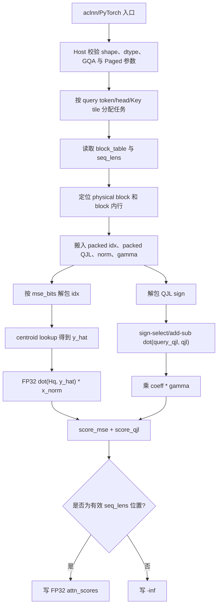
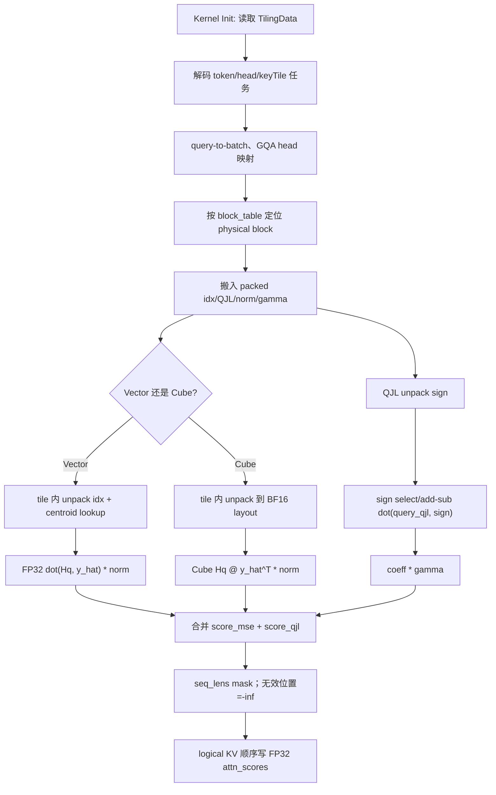

# turbo_quant_attention_score 算子设计方案

> 文档状态：方案设计稿
> 目标仓库：`cann/ops-transformer`
> 目标目录：`experimental/attention/turbo_quant_attention_score`
> 目标硬件：Atlas 800T A2
> 验收软件：CANN 9.1.0+
> 开发模式：aclnn 算子工程化开发 + Ascend C

本文依据任务书和本地设计文档 Checklist 编写。任务书中关于代码仓、算力申请、账号邀请、PR、测试附件命名和环境获取的内容属于交付流程要求；算子公式、接口、约束、精度和性能指标属于本设计的功能输入。文中不会把流程要求当作算子语义，也不会把相关 TurboQuant 算子实现冒充为本算子的 TBE 现状。

## 一、需求背景

### 1.1 需求来源

本需求来源于 9 月社区任务 `turbo_quant_attention_score`

任务目标是在标准 MHA/GQA Attention 的 score 阶段直接消费 TurboQuant 编码的 Key cache：主量化分支只在旋转空间中按需解码，QJL 分支使用符号向量内积修正，不生成完整反量化 Key 到 GM。算子不覆盖 MLA，不负责量化 Value cache 解码和 value aggregation。

任务书指定的交付与评审入口为：

- 算子设计文档 PR：`https://gitcode.com/cann/cann-competitions/tree/master/04_tasks/01_community-task-2026/tasklist` 对应任务目录。
- 算子代码目标仓：`https://gitcode.com/cann/ops-transformer/tree/master/experimental/attention`。
- 设计文档 PR 标题：`【社区任务】turbo_quant_attention_score 算子设计文档`。
- PR 需完成 CLA，并按仓库流程执行 `/compile` 构建检查。

### 1.2 背景介绍

#### 1.2.1 turbo_quant_attention_score 算子实现优化

标准 score 计算需要对每个 query 与所有有效 Key 做点积。若先将量化 Key 完整反量化到原空间，会产生：

1. `max_kv_len × num_kv_heads × head_dim` 的中间数据搬运和写回；
2. Paged KV cache 下按物理 block 重排带来的额外访存；
3. QJL 残差分支不必要的逐元素反量化；
4. decode 场景中小矩阵计算无法摊薄的 kernel 启动和 GM 带宽开销。

本算子利用 TurboQuant 的旋转空间表达，直接计算：

\[
score_i = score_{mse,i}+score_{qjl,i}
\]

\[
score_{mse,i}=x_{norm,i}\cdot\langle H_q,\operatorname{dequant}(idx_i)\rangle
\]

\[
score_{qjl,i}=\frac{\sqrt{\pi/2}}{qjl\_dim}\cdot\gamma_i\cdot
\langle S(H_q),qjl_i\rangle
\]

其中 `Hq` 和 `query_qjl` 由调用方在每个 decode step 预计算：

```text
Hq       = H @ q
query_qjl = S @ Hq
```

算子只返回 score，不执行 softmax、V matmul、value aggregation 或逆旋转。

#### 1.2.2 相关实现现状分析

##### 1.2.2.1 参考源码、算子信息库和数据类型

本任务是新增的 standard MHA/GQA score 算子。当前未发现与其输入协议、Paged cache 布局和 QJL 公式完全一致的历史 TBE 算子，因此 Checklist 中“现有 TBE 源码”和“TBE 算子信息库”按“不适用”处理，不能用其他 Attention 算子替代。

任务书明确的数据类型和布局如下：

| 数据 | dtype | 逻辑 shape/布局 | 说明 |
| --- | --- | --- | --- |
| `query_rotated` | `bfloat16` | `[num_q_tokens, num_q_heads, head_dim]` | 已完成旋转的 `Hq` |
| `query_qjl` | `bfloat16` | `[num_q_tokens, num_q_heads, qjl_dim]` | `S(Hq)` |
| `key_cache_idx` | `uint8` | `[num_blocks, 128, num_kv_heads, ceil(head_dim*mse_bits/8)]` | bit-packed 主量化编码 |
| `key_cache_qjl` | `uint8` | `[num_blocks, 128, num_kv_heads, ceil(qjl_dim/8)]` | bit-packed QJL 符号编码 |
| `key_cache_norm` | `float16`/`bfloat16` | `[num_blocks, 128, num_kv_heads]` | Key 向量 L2 范数 |
| `key_cache_gamma` | `float16`/`bfloat16` | `[num_blocks, 128, num_kv_heads]` | 原尺度残差范数 |
| `block_table` | `int32` | `[max_batch, max_blocks_per_seq]` | logical block 到 physical block 映射 |
| `seq_lens` | `int32` | `[max_batch]` | 每个请求有效 KV 长度 |
| `attn_scores` | `float32` | `[num_q_tokens, num_q_heads, max_kv_len]` | score 输出，供后续 softmax 使用 |

任务书没有明确给出以下三个协议字段，必须在实现前冻结：

1. `dequant_table` 是固定 TurboQuant 码本还是运行时输入；
2. 每个 packed byte 内 bit 的低位/高位顺序，以及 QJL 中 bit 到 `{-1,+1}` 的映射；
3. `num_q_tokens` 与 `max_batch` 在批量 prefill 时的 query-token 到 batch 映射。

本方案不猜测这三项的值，见 §2.3.2 和 §3.4 的接口冻结门禁。默认实现假设使用固定版本码本和低位优先打包；若编码侧不是该协议，必须通过版本化属性或新增输入显式区分。

##### 1.2.2.2 任务书参考实现逻辑描述

对 query token `t`、query head `hq` 和逻辑 Key 位置 `s`：

1. 根据 `block_table[b, floor(s/128)]` 查找 physical block；在 block 内位置为 `s % 128`。
2. 从 `key_cache_idx` 对应行按 `mse_bits` 解包 `head_dim` 个索引。
3. 使用 TurboQuant centroid table 将索引映射为 BF16/FP32 计算值 `y_hat`。
4. 计算 `dot_mse = dot(Hq[t,hq,:], y_hat)`，再乘 `key_cache_norm`。
5. 从 `key_cache_qjl` 解包符号向量 `qjl_i`。该分支是实数 `query_qjl` 与 `{-1,+1}` 向量的内积，使用符号选择、向量加减或等价 SIMD 优化；不得按两个 sign bit-vector 的 popcount 等价实现。
6. 计算 `dot_qjl = dot(query_qjl[t,hq,:], qjl_i)`，再乘 `sqrt(pi/2)/qjl_dim` 和 `key_cache_gamma`。
7. 将两个分支以 FP32 相加，写入 `attn_scores[t,hq,s]`。
8. `s >= seq_lens[b]` 的输出位置写为 `-inf`，避免后续 softmax 把 padding 当成有效 Key；实际输出范围只包含有效缓存 Key。

##### 1.2.2.3 参考实现流程图



## 二、需求分析

### 2.1 外部组件依赖

| 依赖 | 用途 | 设计约束 |
| --- | --- | --- |
| CANN 9.1.0+ | aclnn 注册、tiling、Ascend C 编译和运行 | 最终以验收环境的实际版本为准；本机没有 NPU，不宣称编译/运行通过 |
| Atlas 800T A2 | 目标硬件 | 任务书指定的唯一验收目标；最终以实际 `soc_version` 映射确认 A2 产品配置 |
| Ascend C 9.1.0-beta.1 API 索引 | 静态 API 约束核对 | 使用本地 `docs/ascendc_api_ref_9_1_0_beta_1_01_ai/api_constraints.jsonl` 核对 DataCopy、Vector、Mmad/Matmul、同步等接口 |
| `ops-transformer` | 算子代码和 baseline | 性能 baseline 为标准 FlashAttention 的 score 阶段或任务书给出的 Paged Full-QK baseline |
| TurboQuant 编码器/码本 | 生成 `key_cache_idx`、`key_cache_qjl` 和对应 norm/gamma | 编码协议、centroid 版本和 bit 顺序必须与本算子锁定 |
| PyTorch/torch_npu | 可选 Python 入口和端到端 Attention 联测 | Python 仅做参数适配，不复制 kernel 逻辑 |
| ACL/AscendOpTest 或仓内测试框架 | 功能、精度、性能和负例验证 | CPU golden 用于协议验证，不能替代 NPU 验收 |

### 2.2 内部适配模块

建议目标目录结构如下，最终以 ops-transformer 同类 Attention 算子规范为准：

| 模块 | 建议路径 | 主要职责 |
| --- | --- | --- |
| 算子定义和 shape/type infer | `op_host/` | 原型注册、输入输出描述、参数校验 |
| Tiling | `op_host/` | 任务切分、tile 选择、tilingKey、workspace 和 blockDim |
| Kernel | `op_kernel/` | Paged 访问、bit unpack、码本 lookup、QJL sign dot 和 score 写回 |
| aclnn | `op_api/` 或仓内统一 aclnn 目录 | 两段式 `GetWorkspaceSize/Execute` 接口 |
| Python 扩展 | `torch_extension/` | Python schema、Meta 推导、launcher 和错误映射，可选 |
| UT/功能测试 | `tests/` | infer、tiling、CPU 协议 golden、NPU 精度/性能/负例 |
| README | 算子目录根目录 | 接口、限制、构建、运行和结果复现说明 |

### 2.3 需求模块设计

#### 2.3.1 Ascend C 算子原型

任务书给出的用户可见输入输出保持不变。建议 aclnn 采用标准两段式接口，算子名暂定为 `TurboQuantAttentionScore`：

```cpp
aclnnStatus aclnnTurboQuantAttentionScoreGetWorkspaceSize(
    const aclTensor *queryRotated,
    const aclTensor *queryQjl,
    const aclTensor *keyCacheIdx,
    const aclTensor *keyCacheQjl,
    const aclTensor *keyCacheNorm,
    const aclTensor *keyCacheGamma,
    const aclTensor *blockTable,
    const aclTensor *seqLens,
    int64_t mseBits,
    int64_t qjlDim,
    const aclTensor *attnScores,
    uint64_t *workspaceSize,
    aclOpExecutor **executor);

aclnnStatus aclnnTurboQuantAttentionScore(
    void *workspace,
    uint64_t workspaceSize,
    aclOpExecutor *executor,
    aclrtStream stream);
```

`mse_bits` 和 `qjl_dim` 既可由正式接口作为属性传入，也可由输入 shape/固定编码协议推导；为了避免 shape 只改变而属性未同步，第一版建议作为显式属性纳入 executor key。`block_size=128` 为固定内部协议，不开放为任意属性。

输出 shape 由输入推导：

```text
[num_q_tokens, num_q_heads, max_kv_len]
max_kv_len = block_table.shape[1] * 128
```

如仓库接口要求显式 `max_kv_len`，则将其作为只读属性，并校验不超过 `max_blocks_per_seq*128`。输出采用 FP32，便于后续 softmax，且不因输入的 BF16 精度再次截断。

#### 2.3.2 Ascend C 算子相关约束和待冻结协议

相对任务书原型，当前设计明确以下限制或缺口：

1. 不支持 MLA、latent K/V 共享、quantized Value cache 解码、softmax、V matmul、value aggregation、dropout 和 backward。
2. 仅支持 `query_rotated`、`query_qjl` 为 BF16；`key_cache_norm` 与 `key_cache_gamma` 为 FP16 或 BF16，二者 dtype 必须一致。
3. `key_cache_idx` 和 `key_cache_qjl` 仅作为 `uint8` packed payload 读取，不支持按 byte 展开后直接当作数值 Key。
4. `block_size` 固定为 128；`block_table` 为每个 batch 的 logical-to-physical block 映射，block id 必须在 cache 分配范围内。
5. GQA 要求 `num_q_heads % num_kv_heads == 0`，`kv_head = q_head / (num_q_heads / num_kv_heads)`。
6. 任务书只定义 decode 时 `num_q_tokens=batch_size`，prefill 的 token-to-batch 映射未定义。第一版只承诺：decode 一 token 一请求，或 batch=1 的 prefill；若要支持批量 prefill，必须新增 `cu_seqlens_q`/`query_batch_ids` 之一。
7. 码本输入没有出现在任务书接口表中。第一版可使用固定版本只读 centroid table；若 TurboQuant 码本随模型/配置变化，必须在 API 冻结前增加 `dequant_table` 输入，不能静默使用错误码本。
8. bit 顺序和 sign 映射必须与压缩侧协议一致。本文默认 byte 内低位优先；QJL 默认 `bit=0 -> -1`、`bit=1 -> +1`，均需由编码侧确认。
9. `mse_bits`、`head_dim`、`qjl_dim` 的最大范围受 packed row 长度、UB 容量、bit unpack 临时空间和代码本 lookup 实现约束；未确认硬件上限前不在接口层宣称任意大维度。

## 三、需求详细设计

### 3.1 使能方式

1. aclnn 用户先调用 `aclnnTurboQuantAttentionScoreGetWorkspaceSize`，获得 workspace 大小和 executor，再调用 `aclnnTurboQuantAttentionScore`。
2. PyTorch 入口建议命名为 `torch.ops.npu.turbo_quant_attention_score`，只负责创建 FP32 输出和调用 aclnn；不在 Python 中展开 packed cache。
3. 算子作为独立 score 算子与上层 softmax、V matmul 串联；上层必须使用 `seq_lens` 对齐的有效范围或消费本算子写出的 `-inf` 尾部。
4. 首次编译、算子加载和缓存建立不计入性能计时；性能报告需区分 aclnn 总耗时和 kernel 耗时。

### 3.2 需求总体设计

本算子采用“Paged 读取 + tile 内按需解码 + Vector 主路径，满足批量条件时切换 Cube 路径”的设计：

1. Host 解析 `num_q_tokens`、`num_q_heads`、`num_kv_heads`、`head_dim`、`qjl_dim` 和 `max_kv_len`，检查 GQA、block table 容量和 packed row 长度。
2. Kernel 以 query token/head 和连续 Key tile 为基本任务单元，每个任务只写自己负责的 score 区间，不使用跨核 atomic 累加。
3. 主量化分支在 UB/L1 中完成 bit unpack、centroid lookup 和 BF16/FP32 dot；解码结果不写回 GM。
4. QJL 分支按 sign 选择 query 的正/负值执行加减归约；不得转为两个 bit vector 的 popcount。
5. decode 小批量使用 Vector 路径减少 Cube 准备和重排开销；prefill 或任务数足够大时，按 Key tile 将多个 query 的主分支内积批量化为矩阵乘法，QJL 分支仍可保持 Vector sign-dot 以避免 sign matrix 物化。
6. 所有乘加、系数缩放和输出写回使用 FP32；输入 BF16/FP16 只影响读取和局部转换。

#### 3.2.1 Host 侧设计

##### 3.2.1.1 参数校验、query-to-batch 映射和分核策略

Host 校验顺序如下，首个非法条件返回包含参数名和实际值的错误：

1. 8 个输入和输出指针非空；rank、dtype、shape 与任务书一致。
2. `block_size=128`，`block_table` rank=2，`seq_lens` rank=1，`seq_lens.shape[0] <= block_table.shape[0]`。
3. `num_q_heads % num_kv_heads == 0`，计算 `gqa_ratio=num_q_heads/num_kv_heads`。
4. `key_cache_idx.shape[3] == ceil(head_dim*mse_bits/8)`，`key_cache_qjl.shape[3] == ceil(qjl_dim/8)`，并检查两者的 block、row、KV head 维一致。
5. `seq_lens[b]` 的逻辑约束由调用方保证，Host 只能校验 dtype 和元素数量；Kernel 对 device 上的有效长度按 `seq_lens` 读取。
6. `max_kv_len=block_table.shape[1]*128`，所有 workspace/offset 计算使用 checked arithmetic。
7. 不允许输出与输入或 workspace 非法别名；不支持原地写回 packed cache。

Query-to-batch 采用以下第一版规则：

| 场景 | 规则 |
| --- | --- |
| decode | `num_q_tokens == batch_size`，第 `t` 个 query token 对应 batch `t` |
| batch=1 prefill | 所有 query token 对应 batch 0 |
| 其他批量 prefill | 第一版拒绝；若任务扩展则新增 `cu_seqlens_q` 或 `query_batch_ids` |

设 `K_t` 为单个 Key tile 的逻辑行数，`N_k=ceil(seq_len[b]/K_t)`，主路径总任务数为：

\[
T_{vec}=\sum_{t=0}^{num\_q\_tokens-1}num\_q\_heads\cdot N_k(b(t))
\]

核 `r` 领取任务 `r, r+coreNum, ...`，每个任务负责一个 `(t,hq,keyTile)`，并写入：

```text
attn_scores[t, hq, key_start:key_end]
```

这样 score 行没有跨核写冲突。Key tile 内的 physical block 可能跨越两个 Paged block，Kernel 按 `logical_s/128` 分段读取，不能假设一个 tile 连续对应一个 physical block。

Cube 路径将任务合并为 `(queryTile, hq, keyTile)`：

\[
T_{cube}=\sum_b\left\lceil\frac{Q_b}{M}\right\rceil\cdot H_q\cdot
\left\lceil\frac{L_b}{N}\right\rceil
\]

其中 `M` 为 query tile、`N` 为 Key tile。只有当 `T_cube` 足以填满可用 Cube core，且 Paged gather/unpack 的准备开销可被矩阵乘摊薄时启用；否则使用 Vector 路径。不同 query token/head 不共享可写累加区。

##### 3.2.1.2 数据分块和 LocalMemory 优化策略

内部优先使用 32B 对齐的维度。记：

```text
Dpad      = ceil(head_dim / (32 / sizeof(bfloat16))) * (32 / sizeof(bfloat16))
Ibytes    = ceil(head_dim * mse_bits / 8)
Jbytes    = ceil(qjl_dim / 8)
Ktile     = 本次 Key tile 行数
bq        = sizeof(bfloat16)
```

初始 tile 候选如下，最终由 A2 实机 profiling 选择：

| 路径 | Query tile M | Key tile Ktile | 适用场景 |
| --- | ---: | ---: | --- |
| Vector decode | 1 | 32 或 64 | `num_q_tokens` 小、GQA decode、Paged 访问占主导 |
| Vector prefill | 8 或 16 | 64 或 128 | batch=1 prefill、避免物化 sign matrix |
| Cube batch | 16 或 32 | 64 或 128 | query/head 任务数大、D 对齐且矩阵乘收益明确 |

单个 Vector tile 的近似 UB 使用量为：

\[
U_{vec}=2\cdot K_{tile}(Ibytes+Jbytes+sizeof(norm)+sizeof(gamma))
+2\cdot(Dpad\cdot b_q+qjl\cdot b_q)
+K_{tile}\cdot(4+4)
+U_{unpack}+U_{lookup}+U_{align}
\]

说明：

- 第一项为 packed idx/QJL/norm/gamma 的双缓冲；
- 第二项为 query rotated/query qjl 的双缓冲；
- `Ktile*4+Ktile*4` 为 `score_mse` 和 `score_qjl` 的 FP32 中间；如果可证明无重叠，可原地复用；
- `U_unpack` 包含 bit mask、移位和索引临时；`U_lookup` 包含 centroid gather 的临时；
- 所有 LocalTensor 起始地址按 API 要求对齐，尾块通过 mask 或安全填充处理。

Cube tile 额外需要：

\[
U_{cube}=M\cdot Dpad\cdot b_q+K_{tile}\cdot Dpad\cdot b_q
+M\cdot K_{tile}\cdot4+U_{qjl}+U_{pipe}
\]

`Ktile*Dpad` 只存在于 L1/UB 的当前 tile，不写 GM。`U_{qjl}` 只保存 query_qjl 和 sign-dot 的局部结果，不保存完整 `M×Ktile×qjl_dim` sign 矩阵。

GM workspace 目标为 0：输入 packed cache 原地读取，输出直接写入用户提供的 FP32 `attn_scores`。如果 A2 上选用的 Matmul 模板要求额外 workspace，Host 必须按实际接口动态返回并在本节更新；不能把临时反量化 Key 作为隐式的大 workspace。

##### 3.2.1.3 tilingKey 规划策略

采用语义位编码，避免不同分支混用：

```text
bit 0..1   execution mode: 0=VectorDecode, 1=VectorPrefill, 2=CubeBatch
bit 2      norm/gamma dtype: 0=FP16, 1=BF16
bit 3..5   mse_bits code: 1..8 的编码值
bit 6      head_dim alignment class: 0=16B aligned, 1=32B/Cube preferred
bit 7      qjl_dim alignment class: 0=not byte-multiple of 32, 1=32B aligned
bit 8      GQA ratio class: 0=ratio=1, 1=ratio>1
bit 9      key tile class: 0=32/64, 1=128
bit 10     fixed-codebook protocol version
```

公式为：

```text
tilingKey = mode
          + 4 * scaleDtype
          + 8 * mseBitsCode
          + 64 * headDimClass
          + 128 * qjlDimClass
          + 256 * gqaClass
          + 512 * keyTileClass
          + 1024 * codebookVersion
```

`mse_bits`、维度和 tile 的实际数值仍写入 TilingData；tilingKey 只选择已编译的算法分支。无效组合在 Host 拒绝，不落入默认 key。若后续引入 runtime `dequant_table`，需增加 codebook storage mode 位并重新冻结 key 版本。

##### 3.2.1.4 TilingData

建议字段包括：

```text
numQTokens, numQHeads, numKVHeads, headDim, qjlDim
maxBatch, maxBlocksPerSeq, maxKvLen, blockSize
gqaRatio, mseBits, idxBytesPerRow, qjlBytesPerRow
queryBatchMode, vectorOrCubeMode, queryTile, keyTile
coreNum, taskCount, tasksPerCore, tailTasks
query strides, cache strides, blockTable stride, seqLens stride
attnScores stride and output offsets
coeff = sqrt(pi/2) / qjlDim
codebookVersion, bitOrder, signMapping
workspace offsets and byte sizes (if nonzero)
```

shape、计数和 stride 在确认上限后优先使用 32 位字段；GM 字节 offset 可能超过 4 GiB 时使用 64 位字段。所有乘法、加法和对齐计算必须先做溢出检查。

#### 3.2.2 Kernel 侧设计

##### 3.2.2.1 Kernel 实现描述

###### A. Query 和 Paged 定位

1. 根据 `blockIdx`/任务序号得到 `(token_t, q_head, key_tile_start)`。
2. 按 query-to-batch 规则得到 `b`，再计算 `kv_head=q_head/gqaRatio`。
3. 读取 `seq_lens[b]`，对超过有效长度的位置直接写 `-inf`。
4. 对每个逻辑 Key 行 `s` 计算 `logical_block=s/128`、`row=s%128`，读取 `physical_block=block_table[b, logical_block]`。
5. 计算四个 cache 输入的 GM offset；不能把 logical block id 直接当作 physical block id。

###### B. 主量化分支

1. 搬入当前 Key tile 的 packed `key_cache_idx`、`key_cache_norm`。
2. 按固定 bit order 从字节流提取 `mse_bits` 位的索引：

   ```text
   idx[d] = (packed[(d*mse_bits)/8] >> ((d*mse_bits)%8)) & ((1<<mse_bits)-1)
   ```

   若 `mse_bits` 不是 8 的因数，必须跨 byte 读取，尾部按合法 mask 处理。
3. 用只读 centroid table 做索引映射。索引必须限制在 `[0, 2^mse_bits)`，不做越界 gather。
4. 将 centroid 值转换为 BF16 或 FP32，按 `D` 维分段累加 `dot_mse`。
5. 将 `dot_mse` 乘对应 `key_cache_norm`，保留 FP32。

###### C. QJL 分支

1. 搬入 packed QJL sign row，不构造完整浮点 QJL Key。
2. 按 sign mapping 将每个 bit 映射为 `+query_qjl[d]` 或 `-query_qjl[d]`，用向量加减归约：

   ```text
   dot_qjl = sum(bit[d] == positive ? query_qjl[d] : -query_qjl[d])
   ```

3. 计算 `coeff = sqrt(pi/2)/qjl_dim`，再执行 `score_qjl=coeff*key_cache_gamma*dot_qjl`。
4. 明确禁止用 `popcount(sign_qjl xor sign_query_qjl)`，因为 `query_qjl` 是实数 BF16 向量，不是 sign bit-vector。

###### D. 合并与写回

```text
score = x_norm * dot_mse + (sqrt(pi/2)/qjl_dim) * gamma * dot_qjl
```

`score` 在 FP32 中合并，写入 `[token_t, q_head, logical_s]`。`logical_s >= seq_lens[b]` 的尾部写 `-inf`。输出写回必须使用连续的 logical KV 位置，不能按 physical block 顺序写。

###### E. Cube 批量路径

当 Host 选择 Cube key 时：

1. Vector 先将同一 Key tile 的 packed row 解码为临时 BF16 `Y_hat[Ktile,D]`，并按 Cube 需要的 layout 放到 L1/L0；临时数据不落 GM。
2. 对 query tile 执行 `Hq[M,D] @ Y_hat[Ktile,D]^T`，再按行应用 `key_cache_norm`。
3. QJL 分支不把 `qjl` sign 展开为大矩阵；采用 Vector sign-dot，或使用小 tile 的显式 `+/-query_qjl` 累加。
4. 合并两个分支并写回对应 logical score tile。

该路径只有在实际 A2 API/模板确认支持对应 BF16 乘法布局后启用。若 Mmad/Matmul 对动态 D、layout 或临时 buffer 约束无法满足，则回退 Vector 路径，不改变接口语义。

##### 3.2.2.2 Ascend C 实现流程图



##### 3.2.2.3 与 TBE 流程的差异点和原因

本任务没有可逐行对照的 TBE 源码，因此该 Checklist 条目按“不适用”处理。为便于评审，列出本方案与任务书伪代码以及相关 TurboQuant Attention 实现的差异：

| 差异点 | 本 Ascend C 设计 | 原因 |
| --- | --- | --- |
| 中间 Key | 只在 UB/L1 tile 内形成 `y_hat`，不写 GM | 避免完整反量化带来的显存和带宽开销 |
| Paged 访问 | 每个 logical row 动态查 `block_table` | 输入是 paged cache，physical block 不保证连续 |
| QJL | 实数 query 与 sign vector 做加减点积 | 任务书明确不能等价为两个 sign bit-vector 的 popcount |
| 计算路径 | decode Vector；大批量可选 Cube | decode 小矩阵适合 Vector，prefill 可利用批量矩阵乘 |
| 输出 | score 阶段 FP32，尾部写 `-inf` | 供后续 softmax；避免 padding 参与归一化 |
| MLA/Value | 不读取 Value，不做 latent absorb | 任务书只要求标准 MHA/GQA score |
| codebook | 固定版本只读表或显式 runtime table，待协议冻结 | 任务书接口未列出 dequant table，不能静默猜测 |

##### 3.2.2.4 Ascend C API 与约束检查

设计阶段候选 API 及静态核对结论如下：

- GM/LocalMemory 搬运使用 `DataCopy` 或在 A2 目标支持性确认后的 `DataCopyPad`；LocalTensor 起始地址按 32B 对齐，尾块不能把元素数直接当 block 数。
- bit unpack、加减、乘法、Cast、Reduce/归约使用 Vector API；每种 dtype 的 mask、repeat 和临时空间必须按 9.1.0-beta.1 `api_constraints.jsonl` 复核。
- Cube 路径候选为 `Mmad/Matmul`；本地约束索引显示 `Mmad` 在 Atlas A2 产品有支持记录，但矩阵布局、dtype、A/B/C 位置和 bias 版本必须按实际原型逐项核对。
- 不将 `DataCopyPad(ISASI)` 或任何带 `risk_flags` 的接口当作跨产品稳定能力；如果最终实现需要 ISASI API，必须在代码和 README 记录 A2 版本限制。
- `Gather`/表查找对 index 类型、长度和地址对齐有额外限制；若高阶 Gather 不满足 packed index 协议，使用本地 Vector 生成索引后分段查表，禁止越界读取。
- 所有 score 累加和 `coeff` 计算使用 FP32；BF16 只用于输入/局部缓存，不能用 BF16 累加替代 FP32。

### 3.3 支持硬件

| 产品 | 支持情况 | 说明 |
| --- | :---: | --- |
| Atlas 800T A2 | √ | 任务书唯一验收目标；最终需在验收环境确认具体 `soc_version` 和 A2 API 支持矩阵 |
| 其他 Atlas A2 产品 | △ | 代码可能具备可移植性，但不在本任务验收承诺内 |
| Atlas A3/A5/950 或其他产品 | × | 未纳入任务书目标，不能因静态可编译推断兼容 |

### 3.4 算子约束限制

1. 只支持标准 MHA/GQA，不支持 MLA。
2. `block_size` 固定为 128。
3. `num_q_heads % num_kv_heads == 0`；Q head 与 KV head 按 GQA ratio 映射。
4. `query_rotated`、`query_qjl` 必须为 BF16；score 为 FP32。
5. `key_cache_idx`、`key_cache_qjl` 必须为 packed `uint8`；不能输入已经展开的 centroid 或 sign float cache。
6. `key_cache_norm`、`key_cache_gamma` 仅支持 FP16/BF16，且 shape 必须与 cache 的 block/row/KV head 对齐。
7. `block_table`、`seq_lens` 必须为 INT32；其 device 端数值由调用方保证合法，非法 block id 可能导致地址越界。
8. 默认只承诺 decode 一 token 一请求和 batch=1 prefill；批量 prefill 的 query-to-batch 映射必须补充输入或属性后才能开放。
9. `mse_bits`、bit order、QJL sign mapping、codebook version 必须与 TurboQuant 编码器一致；不提供自动探测。
10. 输出 `attn_scores` 的无效尾位置写 `-inf`；调用方不得把无效尾部当成有效 Key。
11. 不支持输出与输入别名、动态 rank、任意非 contiguous packed row、越过 block table 容量的 `seq_lens`。
12. 本算子不计算旋转 `Hq` 和 `query_qjl`；调用方必须在调用前准备好这两个输入。
13. 本算子不负责 softmax、V matmul、value aggregation、KV cache 写入和量化编码。

## 四、特性交叉分析

| 交叉特性 | 影响 | 设计处理 |
| --- | --- | --- |
| MHA/GQA | 多个 Q head 共享一个 KV head | Host 计算 `kv_head=floor(q_head/gqa_ratio)`，不复制 cache |
| Paged cache | logical row 与 physical row 不连续 | 每个 tile 按 block 边界分段查 table；输出仍按 logical 顺序写 |
| decode/prefill | 任务粒度和 Cube 利用率不同 | 小任务 Vector，大任务可选 Cube，tilingKey 区分 |
| `mse_bits` | bit field 可能跨 byte | 通用跨 byte unpack；索引范围和尾部 mask 显式检查 |
| QJL sign | query_qjl 是实数 | sign-select/add-sub，禁止 popcount 等价化 |
| FP16/BF16 norm/gamma | 乘法输入精度不同 | 读入后转 FP32；dtype 写入 tilingKey |
| `head_dim/qjl_dim` 尾部 | 32B 对齐与逻辑维度不同 | `Dpad` 仅用于 LocalMemory；只对真实维度累计，尾部不参与 dot |
| `seq_lens` | 输出有固定 max KV 长度 | 真实长度内计算，尾部写 `-inf` |
| codebook 版本 | 相同 idx 在不同表下含义不同 | codebook version 进 tilingKey/README/测试 manifest |
| 动态 shape | workspace、task count、tile 变化 | 每次 GetWorkspaceSize 重新推导 tiling，不缓存可变全局状态 |
| 多 stream | block table/cache 同时读 | 算子不维护静态可写状态，遵循调用方 stream 同步 |
| 精度与性能 | FP32 累加有额外 Vector 开销 | 主量化和 QJL 可并行流水，但输出不降为 BF16 |
| 后续 softmax | invalid score 不能为 0 | 尾部写 `-inf`，并在端到端测试中验证 KL |

## 五、可维可测分析

### 5.1 精度标准/性能标准

#### 5.1.1 功能与精度

精度 golden 必须使用同一 TurboQuant 编码协议：原始 FP16/BF16 Key 先按同一 `mse_bits`、centroid、QJL bit order 和 sign mapping 生成 cache，再用 FP64/FP32 CPU 参考公式计算 score。不能用全精度 Key 直接作为本算子的唯一 golden，否则会把量化误差和 kernel 误差混为一谈。

最低精度测试项：

| 类别 | 覆盖点 |
| --- | --- |
| 公式 | 仅 MSE、仅 QJL、两分支同时存在、`gamma/norm` 非 1 |
| packed 协议 | `mse_bits=1/2/4/8`，跨 byte field，QJL 尾部不满 8 bit |
| dtype | query BF16；norm/gamma FP16、BF16 |
| layout | block table 连续、跨 physical block、尾 block、随机 block table |
| GQA | MHA ratio=1、GQA ratio>1 |
| length | `seq_len=0`、小于 128、恰好 128、跨 128、达到 max |
| query | decode 一 token/请求、batch=1 prefill，多 query tile |
| 数值 | 正负 centroid、零 norm/gamma、极小/极大 score、近零相对误差 |
| 负例 | 非法 dtype、非法 packed row、GQA 不整除、block table 容量不足、批量 prefill 未提供映射 |

与全精度 `Q@K^T` 对比时，报告以下指标：

- score 的绝对误差、相对误差、P50/P99、最大绝对误差；接近 0 的分母使用 `max(abs(golden), eps)`，避免虚高相对误差。
- softmax 后 attention weight 的 KL 散度，任务书要求 `< 0.01`。
- 端到端 PPL，配合算子 2 联合测试，任务书要求增长 `< 1%`。
- 任务书要求的“统计意义上可控”必须在报告中给出样本数、随机种子、分布和聚合方式，不能只展示单个最大误差。

本算子输出是量化 Key 近似 score，因此同时保留一组“同协议高精度 CPU golden”作为实现误差门禁；全精度 QK 作为业务目标对照。

#### 5.1.2 性能与显存

Decode 目标：包含反量化的整体 score 计算延迟不超过 Paged Full-QK baseline 的 `1.2x`，同时 KV cache 显存占用降低 `3x` 以上。任务书给出的理论默认配置压缩比约 `3.76x`，该数字是 cache payload 理论值，报告还需单独列出 block table、workspace 和其他 KV 元数据。

必测 shape：

| case | num_q_tokens | batch | kv_len | q_heads | kv_heads | head_dim | baseline(us) |
| --- | ---: | ---: | ---: | ---: | ---: | ---: | ---: |
| `gqa_decode_kv4k` | 1 | 1 | 4096 | 32 | 8 | 128 | 1501.634 |
| `gqa_decode_kv32k` | 1 | 1 | 32768 | 32 | 8 | 128 | 9278.507 |
| `gqa_decode_kv128k` | 1 | 1 | 131072 | 32 | 8 | 128 | 35681.690 |
| `gqa_prefill_kv4k` | 512 | 1 | 4096 | 32 | 8 | 128 | 75984.253 |
| `gqa_prefill_kv32k` | 512 | 1 | 32768 | 32 | 8 | 128 | TBD |

任务书中的 `gqa_prefill_kv32k` 未填写 `head_dim` 和 baseline；本设计按同表其他 case 暂以 `head_dim=128` 作为测试草案，但该 case 的正式结果必须在自测前补全，不能把 TBD 当成通过条件。

性能报告至少包含：warmup、迭代次数、设备型号、CANN 版本、频率策略、aclnn/kernel 计时边界、是否包含上游旋转预计算、是否包含输出尾部 mask，以及与 Paged Full-QK 的同等输入布局。

### 5.2 兼容性分析

- 新增 experimental 算子，不替换现有 FlashAttention/FusedInferAttentionScore，不改变既有 ABI。
- aclnn 采用标准两段式接口；已发布参数顺序不重排，新增能力通过新版本接口或新增可选属性演进。
- Python 入口与 aclnn 共用同一 Host/Kernel，不维护两套 unpack、codebook 或 QJL 公式。
- 仅承诺任务书指定的 Atlas 800T A2、CANN 9.1.0+ 组合；其他产品须重新核对 API、Cube layout、LocalMemory 和性能。
- codebook、bit order、sign mapping 和 query-to-batch 规则写入 README 与测试 manifest，防止不同压缩侧版本静默混用。
- 不承诺旧 CANN、未来未验证 codebook 或不兼容 packed layout 的二进制兼容。

### 5.3 可维护性与可定位性

- Host 日志可选输出 `tilingKey`、执行模式、tile、blockDim、gqaRatio、mseBits、codebookVersion 和 workspace 大小；默认关闭以免污染性能。
- Kernel 中将 `unpack_idx`、`unpack_qjl_sign`、`paged_offset`、`score_mse`、`score_qjl` 拆为可单测的逻辑单元。
- 所有 magic number（128、32B、`sqrt(pi/2)`、`-inf`、bit mask）集中定义并注明协议来源。
- 测试中保存原始 packed cache、codebook manifest、block table、seq_lens 和随机种子，保证错误可复现。
- 相关稀疏/MLA TurboQuant 实现只作为参考，不通过复制文件或未使用的模板扩大本算子目录。

### 5.4 验证环境限制

当前工作区运行在 macOS，未连接 Atlas 800T A2/NPU 环境，因此本文只完成静态设计、任务书和本地 Checklist 核对，不宣称 Ascend C 编译、ACL 执行、精度、性能或显存验收已通过。真实结果必须在任务书要求的 CANN 9.1.0+ A2 环境补充，并将原始日志、截图和报告作为交付证据保存。

## 六、交付与评审

### 6.1 代码与文档交付

算子代码目录建议只保留实现必需文件：

```text
experimental/attention/turbo_quant_attention_score/
├── op_host/                  # 原型、推形、校验、tiling
├── op_kernel/                # Paged unpack、dequant、QJL、Vector/Cube score
├── op_api/                   # aclnn 公共接口（按仓库规范落位）
├── torch_extension/          # 可选 Python launcher
├── tests/                    # 代表性 UT、精度/性能测试说明
├── README.md
└── CMakeLists.txt 或仓库统一构建文件
```

任务书要求的私仓 `task_submission` 交付件为：

```text
task_submission/
├── 1 自验证步骤说明.md
├── 2.1 精度自验证报告.xlsx
├── 2.2 精度自验证日志.log
├── 3.1 性能自验证报告.xlsx
├── 3.2 性能自验证日志.log
├── 4.1 内存自验证报告.xlsx
└── 4.2 内存自验证日志.log
```

设计文档 PR 与算子代码 PR 是两个不同交付动作：设计文档先提交到 `cann-competitions` 对应 tasklist，代码验收通过后再按 `ops-transformer/experimental/attention` 规范提交。README 必须说明构建、输入 cache 生成、CPU golden、NPU 精度、性能和显存测试步骤。

### 6.2 实现前必须关闭的接口门禁

以下事项来自任务书接口表的缺口，未关闭前不得冻结 aclnn ABI 或宣称完整批量 prefill 支持：

| 门禁 | 必须确认的内容 | 责任证据 |
| --- | --- | --- |
| Codebook | 固定只读 centroid 还是 runtime `dequant_table`；版本号和 dtype | TurboQuant 编码侧协议/样例 |
| Bit order | idx 的 bit endian、跨 byte 规则 | 编码器单测和 packed fixture |
| Sign mapping | `0/1` 对应 `-1/+1` 的方向 | QJL 编码器协议 |
| Query batch | 批量 prefill 的 token-to-batch 映射 | aclnn 原型或新增 `cu_seqlens_q` |
| Invalid tail | `attn_scores` 尾部是否统一写 `-inf` | softmax 联测结果 |
| Prefill baseline | `gqa_prefill_kv32k` 的 `head_dim` 和 baseline | 性能原始日志 |

## 七、CheckList 对照表

对应本地文件：`Documents/Code/cann/asctool/docs/official/设计文档CheckList.md`。

| CheckList 行 | 审核项 | 本文位置/结论 |
| ---: | --- | --- |
| 2 | PR 提交位置、CLA、`/compile` | §1.1、§6.1；流程要求与算子语义分开 |
| 3 | PR 标题 | §1.1，给出 `【社区任务】turbo_quant_attention_score 算子设计文档` |
| 4 | 需求来源 | §1.1 |
| 5 | 实现优化、TBE 源码/API 路径 | §1.2.1、§1.2.2.1；无等价 TBE，明确不适用并列出相关实现路径 |
| 6 | TBE dtype/format | §1.2.2.1；无 TBE，列出任务书规定的输入输出 dtype/shape/layout |
| 7 | TBE 实现描述 | §1.2.2.2；无 TBE，按任务书参考流程描述算法 |
| 8 | TBE 流程图 | §1.2.2.3；无 TBE，给出任务书参考流程图 |
| 9 | 外部组件依赖 | §2.1 |
| 10 | 内部适配模块 | §2.2 |
| 11 | Ascend C 算子原型 | §2.3.1，含 aclnn 两段式接口和输入输出 |
| 12 | Ascend C 相关约束/缺失功能 | §2.3.2、§3.4，并列出 codebook、bit order、query batch 三个待冻结协议 |
| 13 | 使能方式 | §3.1 |
| 14 | Host 分核策略 | §3.2.1.1，含 Vector/Cube 任务数公式和无冲突写回策略 |
| 15 | 数据分块、LocalMemory 优化 | §3.2.1.2，含 tile 候选和 UB 预算公式 |
| 16 | tilingKey 规划 | §3.2.1.3，含语义位编码公式 |
| 17 | Kernel 实现描述 | §3.2.2.1，分 Paged 定位、MSE、QJL、合并和 Cube 路径 |
| 18 | Ascend C 流程图 | §3.2.2.2 |
| 19 | Ascend C 与 TBE 差异 | §3.2.2.3；无 TBE，补充与任务书/相关实现的差异和原因 |
| 20 | 支持硬件 | §3.3，与任务书 Atlas 800T A2 一致 |
| 21 | 算子约束限制 | §3.4 |
| 22 | 特性交叉分析 | §4 |
| 23 | 精度/性能标准 | §5.1，覆盖任务书 score、KL、PPL、1.2x、3x、3.76x 和全部 shape |
| 24 | 兼容性分析 | §5.2 |

## 八、参考资料

1. 本地任务书：`Documents/Code/cann/operator_development_workspace/turbo_quant_attention_score_wsp/9月社区任务-turbo_quant_attention_score算子开发/turbo_quant_attention_score算子开发任务书.md`
2. 本地 Checklist：`Documents/Code/cann/asctool/docs/official/设计文档CheckList.md`
3. 本地 Ascend C API 约束索引：`Documents/Code/cann/docs/ascendc_api_ref_9_1_0_beta_1_01_ai/api_constraints.jsonl`
4. 相关仓内 TurboQuant 实现：`ops-transformer-dls-sage-e5-kmajor-p/experimental/attention/turbo_quant_sparse_attn_sharedkv/`
5. 相关仓内 TurboQuant MLA 实现：`ops-transformer-dls-sage-e5-kmajor-p/experimental/attention/turbo_quant_sparse_flash_attention/`
6. 目标开源仓：<https://gitcode.com/cann/ops-transformer>
7. 目标代码目录：<https://gitcode.com/cann/ops-transformer/tree/master/experimental/attention>

