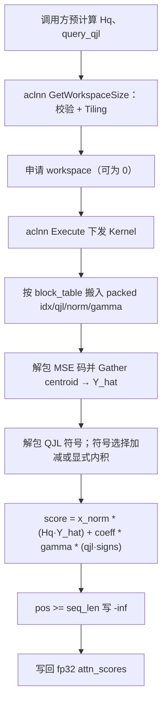
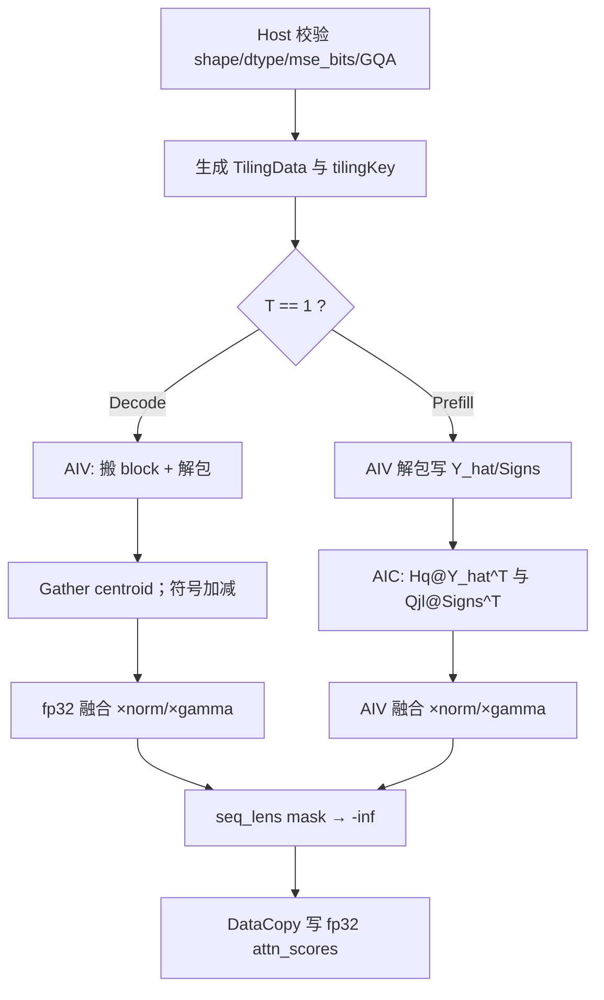

# 【社区任务】TurboQuantAttentionScore 算子设计文档

> 对应任务书：`9月社区任务-turbo_quant_attention_score算子开发/turbo_quant_attention_score算子开发任务书.md`。本文是面向 Atlas 800T A2（Ascend 910B / DAV_2201 / arch22）的开发方案，代码、测试和自测报告以任务书、`op.json`、`case.json` 和 `golden.py` 为最终验收依据。

| 项目 | 内容 |
| --- | --- |
| 任务名称 | 9 月社区任务-turbo_quant_attention_score 算子开发 |
| 提交账号/团队目录 | `jiajia26` |
| 文档路径 | `04_tasks/01_community-task-2026/tasklist/09-turbo_quant_attention_score算子开发/jiajia26/docs/design.md` |
| 目标代码仓 | `https://gitcode.com/jiajia26/ops-transformer`（fork 自 `cann/ops-transformer`） |
| 目标代码目录 | `experimental/attention/turbo_quant_attention_score` |
| 合入目录 | `experimental/attention` |
| 目标硬件 | Atlas 800T A2（`ascend910b` / DAV_2201 / arch22） |
| 验收软件版本 | CANN 9.1.0+ |
| 算子类型 | aclnn 注册调用，Ascend C Kernel |
| 文档版本 | v1.0 |

## 文档适用范围与依据

本方案覆盖公开接口 `aclnnTurboQuantAttentionScoreGetWorkspaceSize` / `aclnnTurboQuantAttentionScore`，覆盖 Paged KV Cache、MHA/GQA、`mse_bits ∈ {2,3,4}`、Decode/Prefill 以及无效 KV 位置写 `-inf`。本算子**只计算 attention score**，不覆盖 MLA，不负责 quantized Value cache 解码和 value aggregation，不执行 softmax。

方案依据如下：

1. 任务书给出的 `score = score_mse + score_qjl` 语义、Paged 布局、GQA 约束、精度/性能门槛和合入目录。
2. 任务包 `op.json`（接口签名）、`case.json`（自测 shape）和 `golden.py`（MSE centroid、3-bit 解包、QJL 符号解包、GQA einsum、`-inf` mask）。
3. `ops-transformer` master 的 `experimental/attention` 工程约定，以及仓内 `scaled_cosine_attention_score`（score-only 结构）与 `turbo_quant_sparse_flash_attention` / `turbo_quant_sparse_attn_sharedkv`（Paged `block_table`、MIX 1:2、codebook Gather）的可复用模式。
4. `04_tasks/01_community-task-2026/resources/design_template.md` 的必选章节。

> **禁止混淆**：仓内已有 TurboQuant 算子实现的是 MLA TQ4（512-d latent、16 centroid nibble、融合 softmax + V）。本任务是 128-d MHA/GQA 的 MSE 主量化 + QJL 残差 **score-only** 路径。centroid 表、打包格式、head_dim 均不得复用 TQ4 数值。

## 一、需求背景

### 1.1 需求来源

本需求来源于 2026 年 9 月 CANN 社区任务。目标是在标准 MHA/GQA attention 计算时，直接基于 TurboQuant 编码的 Key cache 计算 attention score，降低 KV 显存并控制 Decode 延迟，验收后合入 `ops-transformer/experimental/attention`。

### 1.2 背景介绍

#### 1.2.1 TurboQuantAttentionScore 实现优化

标准 FlashAttention 的 score 阶段是全精度 `Q @ K^T`。TurboQuant 不把 Key 完整反量化回原空间，而是：

1. 预旋转 query：`Hq = H @ q`（调用方完成，本算子输入 `query_rotated`）。
2. QJL 投影：`query_qjl = S @ Hq`（调用方完成，本算子输入 `query_qjl`）。
3. 对每个 cached key：解包 MSE 主量化索引并查 centroid，计算主分支内积；解包 QJL `{-1,+1}` 符号向量，计算残差修正。

```text
score[i] = score_mse[i] + score_qjl[i]
score_mse[i] = x_norm[i] * <Hq, dequant(idx[i])>
score_qjl[i] = (sqrt(pi/2) / qjl_dim) * gamma[i] * <query_qjl, signs[i]>
```

首版冻结 `head_dim = qjl_dim = 128`（与 `golden.py` 一致）。后续 softmax + V matmul 不在本算子范围内。

##### TBE 源码与算子信息库核查结论

本任务是 `ops-transformer` experimental 新增 aclnn 算子，不是已有 TBE 算子迁移。工作区 OPP 中不存在同名 `turbo_quant_attention_score` TBE 实现。正确参考对象是任务包 Golden、仓内 Paged Attention 的 Host/Kernel 组织，以及 TQ 系列的 codebook Gather / MIX 流水模式（仅模式，不复用数值）。

#### 1.2.2 现状分析

##### 1.2.2.1 当前支持的数据类型和数据格式

| 能力 | 仓内 TQ4 FA / sharedkv | 本任务目标 |
| --- | --- | --- |
| 场景 | MLA fused FA（softmax + V） | MHA/GQA **score-only** |
| head_dim | 512（+ rope 64） | **128** |
| 量化 | TQ4 16-centroid nibble | MSE `mse_bits ∈ {2,3,4}`，默认 3 |
| 残差 | 无 QJL | QJL 符号向量，`qjl_dim=128` |
| KV 布局 | 单 slot 打包（386B / 258B） | 四分量：`idx` / `qjl` / `norm` / `gamma` |
| Query | TND latent | `[T, Hq, 128]` bf16，已旋转 |
| 输出 | bf16 attention_out | **fp32** `attn_scores[T, Hq, S2]` |
| block_size | 形状推导，≤1024 | **冻结 128** |
| GQA | MLA `N2=1` | `Hq % Hkv == 0`，用例 32/8 |
| 硬件 | 910B / 910_93 | **仅 Atlas 800T A2** |

##### 1.2.2.2 参考实现与问题分析

`golden.py` 是本算子唯一数学真值：

1. **3-bit 主量化打包**：每 3 字节拼成 24-bit word，按 3-bit 步进取出 8 个码；16 组覆盖 128 维。最后一维 48 = `ceil(128*3/8)`。不能走 TQ4 的 `int4b_t` Cast。
2. **2/4-bit**：按字节内 `range(0,8,bits)` 移位掩码展开到 128 维。
3. **QJL**：每 bit → `{+1,-1}`。任务书明确禁止把该内积等价为两个 sign bit-vector 的 popcount，必须用实数内积或对 `query_qjl` 的符号选择加减。
4. **GQA**：`query.reshape(T, Hkv, G, 128)`，`G = Hq / Hkv`，对每个 KV head 广播到组内 Q heads。
5. **Paged 寻址**：`physical = block_table[b, pos // 128]`，`offset = pos % 128`。
6. **无效位置**：`pos >= seq_lens[b]` 写 `-inf`，供后续 softmax 使用。
7. **centroid**：与 TQ4 表不同，必须使用 `golden.py` 的对称 MSE 表。

需要解决的主要问题：

1. Host 不能读取 Device 上的 `seq_lens` 值；InferShape 的 `S2` 上界取 `block_table.dim1 * 128`，真实有效长度在 Kernel 内 mask。
2. Decode（`T=1`）Cube 矩阵过小，应以 Vector 内积为主；Prefill（`T=512`）应将 `Hq @ Y_hat^T` 与 `query_qjl @ signs^T` batch 化为 Cube MatMul。
3. 3-bit 解包在 A2 上没有 `int3` 类型，必须用移位/掩码显式还原。
4. 长上下文（128k）必须沿 S2 切分到多核，不能照搬仓内 SFA“S2 不跨核”的 MLA 路径。

##### 1.2.2.3 参考实现流程图



## 二、需求分析

### 2.1 外部组件依赖

| 组件 | 用途 | 运行时依赖 |
| --- | --- | :---: |
| CANN 9.1.0+、Atlas 800T A2 驱动 | 编译、Device、stream、Profiler | 是 |
| `acl/acl.h`、Ascend C headers | aclnn 两段式、Kernel launch | 是 |
| `ops-transformer` 构建与注册框架 | OpDef / InferShape / Tiling / UT | 是 |
| PyTorch / torch_npu | 测试驱动、Golden 对照 | 测试 |
| msprof / CANN Profiler | 性能证据 | 测试 |

运行时不新增第三方库。仓内 TQ4 Kernel **不链接进本算子**。

### 2.2 内部适配模块

| 模块 | 适配内容 |
| --- | --- |
| `op_host/*_def.cpp` | OpDef、输入输出 dtype/format、`mse_bits` 属性、`ascend910b` |
| `op_host/*_infershape.cpp` | 输出 `[T, Hq, maxBlocks*128]` fp32；shape/dtype/GQA/打包宽度校验 |
| `op_host/*_tiling.h/.cpp` | TilingData、分核、`s2BaseSize=128`、Decode/Prefill 路径选择 |
| `op_kernel/*.cpp` + `arch22/` | 解包、查表、内积/Cube MM、mask、写回 |
| `tests/ut/op_host` | InferShape / arch22 Tiling UT |
| `tests/` Golden / ST | 移植 `golden.py` 与 `case.json` 五条用例 |
| `README.md` | 产品矩阵、约束、复现步骤 |

### 2.3 需求模块设计

#### 2.3.1 aclnn / OpDef 原型

CANN 算子名：`TurboQuantAttentionScore`。

```text
TurboQuantAttentionScore(
    query_rotated,      # bf16  [T, Hq, 128]
    query_qjl,          # bf16  [T, Hq, 128]
    key_cache_idx,      # uint8 [Bn, 128, Hkv, ceil(128*mse_bits/8)]
    key_cache_qjl,      # uint8 [Bn, 128, Hkv, ceil(128/8)] = [Bn,128,Hkv,16]
    key_cache_norm,     # bf16  [Bn, 128, Hkv]
    key_cache_gamma,    # bf16  [Bn, 128, Hkv]
    block_table,        # int32 [B, max_blocks]
    seq_lens,           # int32 [B]
    mse_bits            # int attr, default 3, 合法 {2,3,4}
) -> attn_scores        # fp32  [T, Hq, S2]
```

公开 C API（两段式）：

```cpp
aclnnStatus aclnnTurboQuantAttentionScoreGetWorkspaceSize(
    const aclTensor *queryRotated, const aclTensor *queryQjl,
    const aclTensor *keyCacheIdx, const aclTensor *keyCacheQjl,
    const aclTensor *keyCacheNorm, const aclTensor *keyCacheGamma,
    const aclTensor *blockTable, const aclTensor *seqLens,
    int64_t mseBits, const aclTensor *attnScores,
    uint64_t *workspaceSize, aclOpExecutor **executor);

aclnnStatus aclnnTurboQuantAttentionScore(
    void *workspace, uint64_t workspaceSize, aclOpExecutor *executor,
    aclrtStream stream);
```

完整参数约定：

| 参数 | I/O | 数据类型 | 布局 / shape | 合法值域 | 异常行为 |
| --- | --- | --- | --- | --- | --- |
| `query_rotated` | 输入 | bf16 ND | `[T, Hq, 128]` | 连续；`T≥1`，`Hq≥1` | 空、dtype/format/rank/尾维非法报错 |
| `query_qjl` | 输入 | bf16 ND | 与 query 同 `[T, Hq, 128]` | 与 query 的 T/Hq 一致 | shape 不一致报错 |
| `key_cache_idx` | 输入 | uint8 ND | `[Bn, 128, Hkv, pack_idx]` | `pack_idx=ceil(128*mse_bits/8)` | 宽度或 block_size 不匹配报错 |
| `key_cache_qjl` | 输入 | uint8 ND | `[Bn, 128, Hkv, 16]` | 与 idx 的 Bn/Hkv 一致 | 宽度不为 16 报错 |
| `key_cache_norm` | 输入 | bf16 ND | `[Bn, 128, Hkv]` | 与 idx 前三维一致 | dtype/shape 不匹配报错 |
| `key_cache_gamma` | 输入 | bf16 ND | `[Bn, 128, Hkv]` | 同上 | 同上 |
| `block_table` | 输入 | int32 ND | `[B, max_blocks]` | `max_blocks≥1`；物理块号 ∈ `[0, Bn)` | 越界在 Kernel 内保护；Host 检查 rank |
| `seq_lens` | 输入 | int32 ND | `[B]` | `0 ≤ seq_len ≤ max_blocks*128` | 与 `block_table.dim0` 不一致报错 |
| `mse_bits` | 属性 | int | 标量 | **2 / 3 / 4**，默认 3 | 其它值返回不支持 |
| `attn_scores` | 输出 | fp32 ND | `[T, Hq, S2]` | `S2 = max_blocks*128`（上界） | 预分配 shape 不符报错 |

Decode 场景 `T = B`（每请求 1 个 query token）；Prefill 场景 `T` 可为 512。GQA 要求 `Hq % Hkv == 0`。`B` 取 `block_table.dim0`。当 `T == B` 时按 Decode 分核；当 `T > 1` 时按 Prefill 分核。

#### 2.3.2 Ascend C 相关约束与相对 TBE 的缺失项

同名 TBE 未确认，不声称 TBE 能力对照。首版明确**不支持**：

| 不支持项 | 说明 |
| --- | --- |
| MLA | 无 absorb、无 rope concat、无 512-d latent |
| softmax / V / 输出 attention | 只写 score |
| `head_dim ≠ 128`、`qjl_dim ≠ 128` | 与 Golden 冻结一致 |
| `block_size ≠ 128` | 与 vLLM-Ascend 当前配置一致 |
| FP16 query / FP16 output | 接口按 `op.json` 仅 bf16 in / fp32 out |
| `mse_bits` 其它取值 | 仅 2/3/4 |
| 非 Paged 连续 KV | 必须 `block_table` |
| 任意 stride / 非 ND | 全部 `AutoContiguous` |
| CPU fallback | 主计算必须在 NPU |

## 三、需求详细设计

### 3.1 使能方式

本任务是 aclnn Tensor API。调用链：

```text
aclnnTurboQuantAttentionScoreGetWorkspaceSize
  -> 申请 Device workspace（可为 0）
  -> aclnnTurboQuantAttentionScore(workspace, stream)
```

GetWorkspaceSize 完成参数校验、InferShape 一致性核对、Tiling 和 workspace 估算。Execute 只提交异步 Kernel，不隐式 `synchronize`。调用方必须保持全部输入/输出/workspace 在 stream 完成前有效。

### 3.2 需求总体设计

总体采用“Host 校验 + 单 Kernel 完成解包/内积/mask”的结构。按 `T` 选择两条已验证模板：

| 路径 | 条件 | 计算单元 | 切分 |
| --- | --- | --- | --- |
| Decode Vector | `T == 1` 或 `T == B` 且每 token 单 query | AIV 为主 | `(B, Hkv, S2_tile)` 均分到 AIV |
| Prefill MIX | `T > 1`（用例 512） | MIX AIC:AIV = 1:2 | Vector 解包 → Cube `Hq @ Y_hat^T` 与 `qjl @ signs^T` → Vector 融合 |

`s2BaseSize` 固定 128，与一个 physical block 对齐，避免块内 gather。

#### 3.2.1 Host 侧设计

Host 从 Tensor 描述读取（**不读 Device 数值**）：

```text
T, Hq          <- query_rotated
Hkv, Bn        <- key_cache_idx
B, max_blocks  <- block_table
block_size     <- key_cache_idx.dim1   // 必须 == 128
pack_idx       <- key_cache_idx.dim3   // 必须 == ceil(128*mse_bits/8)
S2             <- max_blocks * 128
G              <- Hq / Hkv
```

校验失败必须在 launch 前返回明确 aclnn 错误码，禁止把非法参数交给 Kernel 崩溃。

TilingData（建议扁平结构）：

```text
batch, numQTokens, numQHeads, numKvHeads, gSize,
headDim=128, qjlDim=128, mseBits, blockSize=128,
maxBlocksPerSeq, maxKvLen, s2BaseSize=128, mBaseSize,
usedCoreNum, packedIdxBytes, packedQjlBytes,
qjlCoeff = sqrt(pi/2) / 128
```

`qjlCoeff` 由 Host 写成 float 常量下发，Kernel 不再现场算 `sqrt`。

##### 3.2.1.1 分核策略

优先满核。工作单元：

```text
s2Tiles = ceil(maxKvLen / 128)
Decode:  work = B * Hkv * s2Tiles
Prefill: work = B * Hkv * s2Tiles * ceil(T / mBaseSize)
```

- Decode：`usedCore = min(aivNum, work)`。A2 典型 `aivNum=48`。余数分给前若干核（大核 +1 tile）。
- Prefill：`usedCore = min(aicNum, work)`。A2 典型 `aicNum=24`，每个 AIC 绑定 2 个 AIV（`GetBlockIdx()/2`）。`mBaseSize=128`（Cube M 维）。

每个核处理连续 tile 区间，避免 atomic 写 score。同一 `(b, q, h, s2)` 只由一个核写回。

小规模（`work < coreNum`）缩减 `usedCore`，避免空核 launch。

##### 3.2.1.2 数据分块和 LocalMemory 优化策略

运行时用 `PlatformAscendC::GetCoreMemSize(UB)` 取 UB，禁止把 192 KB 写死为唯一来源。下面按 DAV_2201 典型 UB=192 KB、double buffer、预留 16 KB 同步/对齐空间估算。

**Decode，1 个 KV head，S2 tile=128，G=4，mse_bits=3：**

| Buffer | 字节 | 说明 |
| --- | ---: | --- |
| Hq / query_qjl bf16 | 2 × 4 × 128 × 2 = 2 KB | 驻留 |
| packed idx ping-pong | 2 × 128 × 48 = 12 KB | |
| packed qjl ping-pong | 2 × 128 × 16 = 4 KB | |
| norm + gamma bf16 | 128 × 2 × 2 = 0.5 KB | |
| 3-bit 解包 scratch | ≤ 16 KB | 16×3 triplet → 128 codes |
| Y_hat bf16 | 128 × 128 × 2 = 32 KB | 查表结果 |
| 8-centroid fp32 | 32 B | |
| scores fp32 | 4 × 128 × 4 = 2 KB | |
| 预留 | 16 KB | |
| **合计** | **≲ 85 KB** | 低于 192 KB，可开 double buffer |

QJL 不物化 32 KB 符号矩阵：对每个 dim 做 `bit ? +qjl[d] : -qjl[d]` 累加。

**Prefill Cube（AIC）：** M=128，N=128，K=128。

- L1：A `128×128` bf16 = 32 KB，B 同 32 KB，double buffer 128 KB，典型 L1 足够。
- L0A/L0B：32 KB ping-pong。
- L0C：fp32 `128×128` = 64 KB，DAV_2201 L0C=128 KB 可容纳。
- Vector 产出的 `Y_hat` / 符号可走短 GM workspace：`preLoad=2 × usedCore × 32 KB`，24 核约 1.5 MB，远小于仓内 MLA FA 的百 MB workspace。

字节计算全程 `uint64_t`，先检查溢出再下调 `uint32_t`。

##### 3.2.1.3 tilingKey 规划策略

模板参数保持最小集合，避免无意义膨胀：

```text
ASCENDC_TPL_ARGS_DECL(TurboQuantAttentionScore,
  UINT mseBits ∈ {2, 3, 4},     # 2 bit
  BOOL isPrefill,               # T > 1
)
```

可达组合 6 个。`usedCore`、`s2Tiles`、`G`、`B` 全部进 TilingData，不进 key。未声明 `mse_bits` 在 Host 拦截，不生成 key。

若实现阶段 Decode 确认全程 Vector、Prefill 确认全程 MIX，则 `isPrefill` 同时选择计算单元，不再单开 `useCube` 位。

#### 3.2.2 Kernel 侧设计

##### 3.2.2.1 Kernel 实现描述

**阶段 A：Paged 搬入**

```text
for pos in [s2Begin, s2End):           # 一个 tile 内 128 点，可能尾块更短
    blk  = pos / 128
    off  = pos % 128
    phys = block_table[b * max_blocks + blk]
    load idx/qjl/norm/gamma at [phys, off, kv_head, :]
```

`DataCopyPad` 按 128 行整块搬 physical block，再按 `off` 窗口使用。`phys` 越界时该行 score 写 `-inf`，不读 KV。

**阶段 B：MSE 解包 + 查表**

centroid 常量表（与 `golden.py` 逐值一致）：

```text
2-bit (4):  ±0.1335033178, ±0.04002048075
3-bit (8):  ±0.19020693, ±0.1187859178, ±0.06682205945, ±0.02166347019
4-bit (16): ±0.2414890379 … ±0.01134236995   # 见 golden.py CENTROIDS[4]
```

- `mse_bits=3`：`word = b0 | (b1<<8) | (b2<<16)`，`(word >> s) & 7`，`s=0,3,…,21`。
- `mse_bits=2/4`：字节内移位掩码。4-bit 可借鉴仓内 nibble Gather **模式**，但必须换 MSE 表，禁止 TQ4 `^8` 旋转。
- `Gather` 得到 `Y_hat[s2_tile, 128]`（bf16 或 fp16 累加源）。

**阶段 C：QJL 内积**

解包 bit 后：

```text
acc = 0
for d in 0..127:
    acc += (bit[d] == 1) ? query_qjl[d] : -query_qjl[d]
```

等价于 `<query_qjl, 2*bit-1>`。使用 `Compare` + `Select` + `Add/Sub` 或 `MulAdd`，**禁止** popcount 近似。

**阶段 D：融合与 mask**

```text
score[g, t] = norm[t] * dot_mse[g, t] + qjlCoeff * gamma[t] * dot_qjl[g, t]
if (s2Begin + t) >= seq_lens[b]: score[g, t] = -inf
store fp32 attn_scores[q_index, q_head, s2]
```

GQA：`q_head = kv_head * G + g`。Decode 时 `q_index` 对应 batch token；Prefill 时 `q_index` 为该序列内 query 行。

累加在 fp32 中完成（query 从 bf16 Cast），与 Golden 的 fp32 einsum 对齐。

**阶段 E：Prefill Cube**

```text
scores_mse = (Hq_tile @ Y_hat^T) * x_norm          # M=mBase, N=128, K=128
scores_qjl = qjlCoeff * (Qjl_tile @ Signs^T) * gamma
score = scores_mse + scores_qjl
```

Vector0 写 `Y_hat`/`Signs` 到 L1 或短 GM；Cube `SetFlag/WaitFlag` 同步；`--cce-auto-sync=off`。无 MM2、无 SoftmaxFlashV2。

##### 3.2.2.2 Ascend C 实现流程图



##### 3.2.2.3 与仓内 TQ4 / 典型 FA 的差异

| 项目 | 仓内 TQ4 FA | 本算子 |
| --- | --- | --- |
| 数学 | MLA 4-bit codebook + softmax + V | MSE+QJL score，无 softmax/V |
| centroid | TQ4 16 值 | `golden.py` MSE 2/3/4-bit 表 |
| 打包 | 单 slot nibble | `idx` 48B + `qjl` 16B + 两个 scale |
| 分核 | S2 常不跨核 | **S2 按 block 跨核**，服务 128k |
| 输出 | bf16 attn_out | fp32 scores + `-inf` |
| workspace | 可达百 MB | Decode 0；Prefill ~MB 级 |

### 3.3 支持硬件

| 支持的芯片版本 | 涉及勾选 |
| --- | :---: |
| Atlas 800T A2（`ascend910b`，DAV_2201） | √ |
| Atlas 800I A2 | 不声明 |
| A3 / 910_93 | 不声明 |
| Ascend 950 / DAV_3510 | 不声明 |

Host 通过 `GetCurNpuArch()` / `GetSocVersion()` 校验。自测报告记录 CANN、驱动、SOC、Device 数、编译器。

### 3.4 算子约束限制

| 维度 | 约束 |
| --- | --- |
| 芯片 | 仅 Atlas 800T A2 |
| 格式 | 全部 ND、连续 |
| dtype | query/qjl/norm/gamma = bf16；idx/qjl packed = uint8；block_table/seq_lens = int32；out = fp32 |
| shape | `head_dim=qjl_dim=128`，`block_size=128` |
| GQA | `Hq % Hkv == 0`；MHA 即 `Hq == Hkv` |
| mse_bits | 2/3/4，默认 3 |
| Paged | 必须 `block_table`；物理块号有效 |
| 无效 KV | `pos ≥ seq_lens` 写 `-inf`，不读越界 KV |
| MLA / softmax / V | 不支持 |
| 空 tensor | `T=0` 或 `B=0` 或 `max_blocks=0` 直接成功、不 launch |
| 确定性 | 无 atomic 浮点归约；相同输入+tiling bitwise 一致 |

## 四、特性交叉分析

| 特性 | 是否涉及 | 交叉影响与处理 |
| --- | :---: | --- |
| 动态 shape | 是 | T/B/H/S2 每次 Tiling；`S2` 上界由 `max_blocks*128` 决定 |
| Paged KV | 是 | `block_table` 在 Kernel 内查物理块；与 `seq_lens` 共同决定有效区间 |
| GQA | 是 | 按 KV head 搬 KV，组内 G 个 Q 共享 Y_hat/signs |
| mse_bits | 是 | 决定 pack 宽度、centroid 表和 tilingKey |
| Decode / Prefill | 是 | 模板分支：Vector 内积 vs Cube MM |
| `-inf` mask | 是 | 必须在写回前完成，否则后续 softmax 会被 padding 污染 |
| bf16 累加 | 是 | 内积在 fp32 完成，降低 bf16 误差 |
| double buffer | 是 | packed KV 与计算重叠；Prefill 再叠 Cube |
| profiler | 是 | 分开统计搬入、解包、MM/内积、写回 |
| 显存压缩 | 是 | 相对 fp16 K：`(128*2) / (48+16+2+2) ≈ 3.76x`（3-bit 默认） |

安全性：`phys`、`off`、输出下标在 Kernel 内边界保护；Host 64 位检查后再写入 TilingData；不缓存调用方短生命周期指针。

## 五、可维可测分析

### 5.1 精度标准/性能标准

#### 5.1.1 精度标准

两条口径，不得混用：

**口径 A：与任务 Golden 同公式对照（功能正确性）**

`case.json` 给出 `err_threshold = [0.001, 0]`。实现上采用混合容差：

```text
|actual - golden| <= max(atol, rtol * |golden|)
atol = 1e-3
rtol = 1e-3
```

`-inf` 位置必须同为 `-inf`。bf16 输入先 Cast 到 fp32 再按 Golden 公式计算。

**口径 B：与全精度 `Q @ K^T` 对照（任务书 3.2）**

- score 相对误差在统计意义上可控。
- softmax 后 attention weight 与全精度版本 KL 散度 **< 0.01**。
- 端到端 PPL 增长 **< 1%**（配合算子 2，本算子单独交付时记录“待联合测试”）。

Golden 用例输入范围 `query ∈ [-1,1]`，`norm/gamma ∈ [0.1,2]`。

#### 5.1.2 性能标准

任务书 Decode：**含反量化的 score 延迟不超过全精度 FlashAttention 的 1.2 倍**，显存占用降低 **3x 以上**。

Paged Full-QK baseline（任务书，单位 us）：

| case | T | B | kv_len | Hq / Hkv / D | baseline us | 本算子目标 |
| --- | ---: | ---: | ---: | --- | ---: | --- |
| gqa_decode_kv4k | 1 | 1 | 4096 | 32 / 8 / 128 | 1501.634 | ≤ 1.2× |
| gqa_decode_kv32k | 1 | 1 | 32768 | 32 / 8 / 128 | 9278.507 | ≤ 1.2× |
| gqa_decode_kv128k | 1 | 1 | 131072 | 32 / 8 / 128 | 35681.690 | ≤ 1.2× |
| gqa_prefill_kv4k | 512 | 1 | 4096 | 32 / 8 / 128 | 75984.253 | 记录；优先 Decode 达标 |
| gqa_prefill_kv32k | 512 | 1 | 32768 | 32 / 8 / 128 | （任务书未填） | 记录 |

计时：预热 10 次、采样 30 次，报 median / P90。计时范围仅含本算子 Kernel（不含 softmax/V）。报告必须写明是否包含 Host tiling。

#### 5.1.3 内存标准

任务书 3.4 写明“不涉及”。仍记录：3-bit 理论压缩比 3.76x；workspace 字节；峰值 Device 内存。Decode 路径目标为 **用户 workspace = 0**。

### 5.2 兼容性分析

| 维度 | 方案 |
| --- | --- |
| API | 新算子，不修改既有 FA / TQ4 符号 |
| 源码 | 独立目录，CMake 自动发现；不改 TQ4 centroid |
| CANN | 9.1.0+，以 A2 工具链实际编译为准 |
| 硬件 | 仅声明 A2 |
| 数值 | 不启用未准入的近似（包括 QJL popcount） |
| 回滚 | 新目录可独立关闭，不影响仓内其它 experimental 算子 |

## 六、测试与自验设计

### 6.1 用例矩阵

| 类别 | 必测 |
| --- | --- |
| 功能 | `case.json` 五条：decode 4k/32k/128k，prefill 4k/32k，默认 `mse_bits=3` |
| 属性 | `mse_bits=2/4` 各至少 1 条 decode 短序列 |
| GQA / MHA | 32/8 与 8/8 |
| mask | `seq_lens` 非 128 对齐（例如 4097 的尾块 `-inf`） |
| 异常 | 非法 mse_bits、`Hq % Hkv != 0`、pack 宽度错误、`block_size!=128`、dtype 错误 |
| 确定性 | 同一输入连续两次 bitwise 一致 |
| 空输入 | T=0 或 B=0 成功返回 |

精度 case 与性能 case 必须在 README 中分开列出。性能 case 即上表五条（prefill_32k 无 baseline 时只记录绝对值）。

### 6.2 测试资产与执行

任务包资产：

```text
9月社区任务-turbo_quant_attention_score算子开发/
  op.json
  case.json
  golden.py
  turbo_quant_attention_score算子开发任务书.md
```

仓内测试：

```text
experimental/attention/turbo_quant_attention_score/tests/
  ut/op_host/test_turbo_quant_attention_score_infershape.cpp
  ut/op_host/arch22/test_turbo_quant_attention_score_tiling.cpp
  python/test_turbo_quant_attention_score.py    # 调 golden.calc_expect_func
```

执行（具体脚本以算子 README 为准）：

```bash
# Host UT
bash tests/ut/op_host/run.sh   # 或仓内统一 UT 入口

# ST / 精度（NPU）
python3 tests/python/test_turbo_quant_attention_score.py --case all

# 性能
msprof / 任务包约定的采集方式，输出 median us 与 baseline 比值
```

README 必须写清编译自定义算子包、`source set_env`、运行和读结果的步骤，保证验收人可复现。

### 6.3 自测报告内容

按任务书交付件：`task_submission/` 下精度/性能报告与日志。报告至少包含：case 名、shape、`mse_bits`、返回码、atol/rtol 统计、`-inf` 位置一致性、median us、与 baseline 比值、压缩比、CANN/SOC、Profiler 截图、失败项。

## 七、代码落地、里程碑与交付

### 7.1 建议目录

```text
ops-transformer/experimental/attention/turbo_quant_attention_score/
  CMakeLists.txt
  README.md
  op_host/
    CMakeLists.txt
    turbo_quant_attention_score_def.cpp
    turbo_quant_attention_score_infershape.cpp
    turbo_quant_attention_score_tiling.h
    turbo_quant_attention_score_tiling.cpp
  op_kernel/
    turbo_quant_attention_score.cpp
    turbo_quant_attention_score_common.h
    turbo_quant_attention_score_template_tiling_key.h
    arch22/
      turbo_quant_attention_score_decode.h
      turbo_quant_attention_score_prefill.h
  tests/
    ut/op_host/...
    python/...
  examples/
    test_aclnn_turbo_quant_attention_score.cpp
  docs/
    aclnnTurboQuantAttentionScore.md
```

设计文档（本文）放在：

```text
cann-ops-competitions/04_tasks/01_community-task-2026/tasklist/
  09-turbo_quant_attention_score算子开发/jiajia26/docs/design.md
```

验收材料：

```text
task_submission/
  1 自验证步骤说明.md
  2.1 精度自验证报告.xlsx
  2.2 精度自验证日志.log
  3.1 性能自验证报告.xlsx
  3.2 性能自验证日志.log
```

### 7.2 开发步骤

1. 冻结接口：按 `op.json` 落地 OpDef / InferShape / 错误码；UT 锁 shape 推导。
2. Decode Vector 路径：`mse_bits=3`，`gqa_decode_kv4k` 精度打通（含 `-inf`）。
3. 扩展 32k/128k S2 跨核切分与 double buffer。
4. 补 `mse_bits=2/4` 解包。
5. Prefill MIX：Cube 两条 GEMM + Vector 融合，打通 `gqa_prefill_kv4k`。
6. 性能：对照任务书 baseline 调 tile / 流水；确认 Decode ≤ 1.2×。
7. 文档、示例、自测报告；邀请 `Ascend-CANN`；设计文档 PR 到 `cann-ops-competitions`；代码 PR 到 `ops-transformer`。

### 7.3 交付件

| 交付件 | 内容 |
| --- | --- |
| 设计文档 | 本文，提交 `jiajia26/cann-ops-competitions` PR |
| 源码 | `jiajia26/ops-transformer` 的 `experimental/attention/turbo_quant_attention_score`，含 README |
| 自测用例及测试代码 | 覆盖 `case.json` 全部用例；README 写复现步骤 |
| 自测报告 | 精度/性能参数、对比、截图、日志 |
| 待验收代码地址 | 个人仓、分支、算子目录；已邀请 `Ascend-CANN` 为开发者 |
