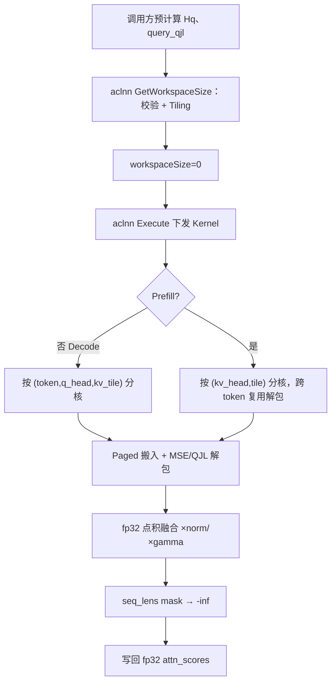

# TurboQuantAttentionScore 算子设计文档

> 对应任务书：`9月社区任务-turbo_quant_attention_score算子开发/turbo_quant_attention_score算子开发任务书.md`。  
> 数学真值与接口以任务包 `op.json`、`case.json`、`golden.py` 为准。  
> 本文描述已在 `ops-transformer` 落地的 aclnn / Ascend C 实现方案。

| 项目 | 内容 |
| --- | --- |
| 任务名称 | 9 月社区任务-turbo_quant_attention_score 算子开发 |
| 提交账号/团队目录 | `sun_king_poem` |
| 文档路径 | `04_tasks/01_community-task-2026/tasklist/09-turbo_quant_attention_score算子开发/sun_king_poem/docs/design.md` |
| 目标代码仓 | `https://gitcode.com/sun_king_poem/ops-transformer`（fork 自 `cann/ops-transformer`） |
| 目标代码目录 | `experimental/attention/turbo_quant_attention_score` |
| 合入目录 | `experimental/attention` |
| 目标硬件 | Atlas 800T A2（`ascend910b`）；同步注册 `ascend910_93` |
| 验收软件版本 | CANN 9.1.0+ |
| 算子类型 | aclnn 注册调用，Ascend C Kernel |
| 文档版本 | v1.0 |

---

# 需求背景（required）

## 需求来源

本需求来源于 2026 年 9 月 CANN 社区任务。目标是在标准 MHA/GQA attention 计算时，直接基于 TurboQuant 编码的 Key cache 计算 attention score，降低 KV 显存并控制 Decode 延迟，验收后合入 `ops-transformer/experimental/attention`。

## 背景介绍

### TurboQuantAttentionScore 实现优化

标准 FlashAttention 的 score 阶段是全精度 `Q @ K^T`。长上下文下全精度 Key cache 显存压力大。TurboQuant 将 Key 拆成：

1. MSE 主量化索引（bit-packed）
2. QJL 残差符号（bit-packed）
3. Key L2 范数 `x_norm`
4. 原尺度残差范数 `gamma`

本算子**不把 Key 完整反量化回原空间**，而是在旋转空间中按需解码主量化分支，并叠加 QJL 残差修正项。调用方预先完成：

```text
Hq = H @ q            # query 旋转 → 输入 query_rotated
query_qjl = S @ Hq    # QJL 投影 → 输入 query_qjl
```

算子输出 softmax 前的 `attn_scores`；后续 softmax + V matmul、quantized Value 解码、MLA 均不在本算子范围内。

### 功能语义

```text
score[i] = score_mse[i] + score_qjl[i]

score_mse[i] = x_norm[i] * <Hq, dequant(idx[i])>
score_qjl[i] = (sqrt(pi/2) / qjl_dim) * gamma[i] * <S(Hq), qjl_signs[i]>
```

当前用例冻结 `head_dim = qjl_dim = 128`。无效 KV 位置（`pos >= seq_lens[batch]`）写 `-inf`。

### 与仓内已有 TurboQuant 算子的差异

| 能力 | 仓内 TQ4 FA / sharedkv | 本算子 |
| --- | --- | --- |
| 场景 | MLA fused FA（softmax + V） | MHA/GQA **score-only** |
| head_dim | 512（+ rope） | **128** |
| 量化 | TQ4 16-centroid nibble | MSE `mse_bits ∈ {2,3,4}`，默认 3 |
| 残差 | 无 QJL | QJL 符号向量 |
| KV 布局 | 单 slot 打包 | 四分量：`idx` / `qjl` / `norm` / `gamma` |
| 输出 | bf16 attention_out | **fp32** `attn_scores` |
| block_size | 形状推导 | **冻结 128** |

**禁止混淆**：不得复用 TQ4 的 centroid 表、打包格式或 head_dim。本算子码本必须与 `golden.py` 的 `CENTROIDS` 逐值一致。

### 参数与接口能力

| 参数 | 输入/输出 | 数据类型 | 维度（shape） |
| --- | --- | --- | --- |
| query_rotated | 输入 | bfloat16 | `[num_q_tokens, num_q_heads, head_dim]` |
| query_qjl | 输入 | bfloat16 | `[num_q_tokens, num_q_heads, qjl_dim]` |
| key_cache_idx | 输入 | uint8 | `[num_blocks, 128, num_kv_heads, ceil(head_dim*mse_bits/8)]` |
| key_cache_qjl | 输入 | uint8 | `[num_blocks, 128, num_kv_heads, ceil(qjl_dim/8)]` |
| key_cache_norm | 输入 | float16 / bfloat16 | `[num_blocks, 128, num_kv_heads]` |
| key_cache_gamma | 输入 | float16 / bfloat16 | `[num_blocks, 128, num_kv_heads]` |
| block_table | 输入 | int32 | `[max_batch, max_blocks_per_seq]` |
| seq_lens | 输入 | int32 | `[max_batch]` |
| mse_bits | 属性 | int | 标量，默认 3，合法 `{2,3,4}` |
| attn_scores | 输出 | float32 | `[num_q_tokens, num_q_heads, max_kv_len]` |

其中 `max_kv_len = max_blocks_per_seq * 128`（InferShape 上界）；实际有效长度由 `seq_lens` 决定。

# 需求分析（required）

## 需求描述

使用 Ascend C 实现 aclnn 算子 `TurboQuantAttentionScore`，在 Paged KV Cache 上直接由 TurboQuant 编码的 Key 计算 attention score：

1. 支持 Paged 布局（`block_table` 查 physical block），`block_size = 128`。
2. 仅支持标准 MHA/GQA（`num_q_heads % num_kv_heads == 0`），不支持 MLA。
3. 主量化按 `mse_bits` 解包后查表映射到 fp32 centroid；QJL 为实数 `query_qjl` 与 `{-1,+1}` 符号向量的内积（**禁止** popcount 近似）。
4. Decode / Prefill 均可运行；精度对齐 `golden.py`；Decode 性能目标为全精度 FlashAttention score 的 **≤ 1.2×**，显存压缩 **≥ 3×**。

## 需求拆解

1. Host：OpDef / InferShape / Tiling 校验与分核参数下发。
2. Kernel：Paged 寻址、MSE 解包查表、QJL 符号解包、fp32 点积融合、`-inf` mask、写回。
3. GQA：同一 KV head 在组内 Q heads 间共享解包结果，减少重复反量化。
4. 测试：覆盖 `case.json` 五条用例 + `mse_bits=2/4` 补充用例；README 写清复现步骤。
5. 性能路线：当前 Vector 融合基线；后续将 `Hq @ Y_hat^T` / `query_qjl @ Signs^T` 升级为 Cube MatMul。

## 外部依赖

| 组件 | 用途 |
| --- | --- |
| CANN 9.1.0+、Atlas 800T A2 | 编译与 Device 运行 |
| `ops-transformer` 构建与注册框架 | OpDef / InferShape / Tiling / aclnn |
| 任务包 `golden.py` / `case.json` | 精度真值与自测 shape |
| msprof | 性能采集 |

运行时不新增第三方库；仓内 TQ4 Kernel 不链接进本算子。

# 详细设计（required）

## 算子分析

### 数学公式

```text
score = x_norm * <Hq, C[unpack(idx)]>
      + (sqrt(pi/2) / D) * gamma * <query_qjl, unpack_signs(qjl)>
```

- `C`：与 `golden.py` 一致的对称 MSE 码本（2/3/4 bit 各一套）。
- QJL：bit `0 → -1`，bit `1 → +1`，字节内低位优先。
- 无额外 `1/sqrt(D)` 缩放，与 golden 一致。
- 累加与输出均为 fp32。

### MSE 解包规则

| mse_bits | packed 末维 | 解包 |
| ---: | ---: | --- |
| 3 | 48 | reshape `(..., 16, 3)`，`word = b0\|(b1<<8)\|(b2<<16)`，`(word>>s)&7`，`s=0,3,…,21` |
| 2 / 4 | 32 / 64 | 字节内从低位起每 `bits` 位取一个 index |

### QJL 解包规则

每个 byte 的 8 bit 从低到高展开为 `head_dim` 个符号：`0 → -1`，`1 → +1`。

### Paged 寻址

```text
batchIdx = (batch == 1) ? 0 : token
logical  = kvPos / 128
offset   = kvPos % 128
phys     = block_table[batchIdx, logical]
kvHead   = qHead / groups
```

`kvPos >= seq_lens[batchIdx]` 写 `-inf`，不读无效 KV。

### 支持数据类型

| Tensor | dtype |
| --- | --- |
| query_rotated / query_qjl | BF16 |
| key_cache_idx / key_cache_qjl | UINT8 |
| key_cache_norm / key_cache_gamma | BF16 或 FP16（按 dtype 模板编译） |
| block_table / seq_lens | INT32 |
| attn_scores | FP32 |

### 支持形状与场景

- `block_size` 固定 128；`head_dim`、`qjl_dim` 与用例一致为 128。
- `batch = block_table.shape[0]`；`batch == 1` 允许 prefill（`T > 1`）；`batch > 1` 要求 `T == batch`（decode）。
- GQA：`Hq % Hkv == 0`；用例默认 `32/8`。

## 算子实现

### 使能方式（aclnn 两段式）

```cpp
aclnnStatus aclnnTurboQuantAttentionScoreGetWorkspaceSize(
    const aclTensor* queryRotated,
    const aclTensor* queryQjl,
    const aclTensor* keyCacheIdx,
    const aclTensor* keyCacheQjl,
    const aclTensor* keyCacheNorm,
    const aclTensor* keyCacheGamma,
    const aclTensor* blockTable,
    const aclTensor* seqLens,
    int64_t mseBits,
    const aclTensor* out,
    uint64_t* workspaceSize,
    aclOpExecutor** executor);

aclnnStatus aclnnTurboQuantAttentionScore(
    void* workspace,
    uint64_t workspaceSize,
    aclOpExecutor* executor,
    aclrtStream stream);
```

当前用户 workspace 为 **0**；调用方仍应使用第一段返回的 `workspaceSize`。GetWorkspaceSize 完成校验与 Tiling；Execute 只异步下发 Kernel。

### 工程目录

```text
experimental/attention/turbo_quant_attention_score/
├── CMakeLists.txt
├── README.md
├── docs/
│   ├── aclnnTurboQuantAttentionScore.md
│   └── design.md
├── examples/
│   └── test_aclnn_turbo_quant_attention_score.cpp
├── op_host/
│   ├── turbo_quant_attention_score_def.cpp
│   ├── turbo_quant_attention_score_infershape.cpp
│   ├── turbo_quant_attention_score_tiling.h
│   └── turbo_quant_attention_score_tiling.cpp
├── op_kernel/
│   ├── turbo_quant_attention_score.cpp
│   ├── turbo_quant_attention_score_impl.hpp
│   └── turbo_quant_attention_score_tiling_def.h
└── tests/
    ├── pytest/          # 精度 / 性能脚本与 golden
    └── ut/              # op_host / op_kernel / op_api
```

### Host 侧设计

#### InferShape

- 输出 `[T, Hq, maxBlocks * 128]`，dtype = float32。
- Host **不读取** Device 上的 `seq_lens` 数值；有效长度在 Kernel 内 mask。
- 校验 rank、`block_size==128`、各 cache 前三维一致、`block_table` 与 `seq_lens` 的 batch 一致。

#### Tiling 策略

从 `PlatformAscendC` 读取 AIV 核数与 UB 容量（`GetUbBlockSize` 取对齐字节，不硬编码）：

| 字段 | 含义 |
| --- | --- |
| numTokens / numQHeads / numKvHeads / headDim | 运行时维度 |
| blockSize / numBlocks | 固定 128 / cache 块数 |
| idxPackedBytes / qjlPackedBytes | packed 末维 |
| maxBatch / maxBlocksPerSeq / maxKvLen | paged 与输出宽 |
| kvTile | 按 UB 预算反推；Decode 上限 64，Prefill 上限 32 |
| usedCoreNum | 见分核 |
| mseBits / groups / qjlCoeff / ubBlockSize | 属性与派生量 |

`qjlCoeff = sqrt(pi/2) / headDim` 由 Host 下发，Kernel 不再现场算 `sqrt`。

##### 1. 分核策略

优先满核，小规模缩减避免空核：

```text
numKvTiles = ceil(maxKvLen / kvTile)

Decode / 多 batch：
  totalUnits = (T * Hq) * numKvTiles
  usedCoreNum = min(totalUnits, aivCoreNum)
  工作单元按 blockIdx 跨步遍历 (token, q_head, kv_tile)

Prefill（T > 1 且 batch == 1）：
  totalUnits = Hkv * numKvTiles
  usedCoreNum = min(totalUnits, aivCoreNum)
  核内对该 (kv_head, tile) 遍历全部 T 个 query 行
```

同一 `(token, q_head, kv_pos)` 只由一个核写回，无 atomic 浮点归约。

##### 2. 数据分块与 UB

- Query / query_qjl：按行搬入 UB，Cast 为 fp32 常驻。
- KV：按 `kvTile` 连续逻辑位置成批搬入 packed idx/qjl 与 norm/gamma；物理块通过 `block_table` 解析。
- Prefill 额外缓存当前 tile 的 `dequant` / `signs`，供多 token 复用，避免重复解包。
- UB 预算按约 80% 可用空间反推 `kvTile`；放不下最小 tile 时 Host 直接失败。

##### 3. tilingKey

| tilingKey | mse_bits |
| ---: | ---: |
| 0 | 2 |
| 1 | 3 |
| 2 | 4 |

非法 `mse_bits` 在 Host 拦截，不生成 key。Decode / Prefill 由 TilingData 中的维度派生，不单独占 key 位。

### Kernel 侧设计

总体流程：`Init`（绑 GM、分配 UB、写入 centroid / 符号 LUT）→ `Process`（分核循环）。

#### 计算流程

```text
对每个分配到的 (token, q_head[, kv_tile])：
  1. 搬入 Hq、query_qjl，Cast → fp32
  2. 对 tile 内每个有效 kvPos：
     a. phys = block_table[batchIdx, kvPos/128]
     b. unpack MSE idx → Gather centroid → Y_hat
     c. unpack QJL → signs ∈ {-1,+1}
     d. score_mse = x_norm * ReduceSum(Hq * Y_hat)
     e. score_qjl = qjlCoeff * gamma * ReduceSum(query_qjl * signs)
     f. score = score_mse + score_qjl
  3. kvPos >= seq_len → 写 -inf
  4. DataCopy 写回 fp32 attn_scores
```

#### GQA 共享优化

当 `groups >= 2` 时，仅组内 base `qHead` 负责解包；`groups >= 4` 时一次处理 4 个 sibling head（`ProcessKvShared4`），`groups == 2` 时两两共享（`ProcessKvShared2`），避免对同一 KV 重复反量化。

#### QJL 优化

预建 256×8 的符号 LUT，按 packed byte 查表展开，配合向量 `Mul + ReduceSum`；语义仍是实数内积，**不是** popcount。

#### 同步

使用 `PipeBarrier<PIPE_V>` 与 `HardEvent`（`MTE2_S`、`V_S`、`S_V`、`S_MTE3`）保证标量解包、向量点积与 GM 搬运依赖正确。

#### Prefill 路径

`isPrefill = (numTokens > 1 && maxBatch == 1)`：按 `(kv_head, tile)` 分核，解包一次后对全部 query token 复用 `Y_hat` / `signs`，降低解包开销。

#### Cube 加速路线（后续）

任务书给出的批量内积：

```text
scores_mse = (Hq @ Y_hat^T) * x_norm
scores_qjl = coeff * (query_qjl @ Signs^T) * gamma
```

当前交付为 **Vector Core 融合基线**（用户 workspace = 0）。性能 profiling 显示达标关键是将上述两条 GEMM 迁到 Cube，并把 bit-unpack 与 Cube 流水重叠。该路线作为后续优化，不改变对外接口与数学契约。

### 总体流程图



## 支持硬件

| 支持的芯片版本 | 涉及勾选 |
| --- | :---: |
| Atlas 800T A2（`ascend910b`） | √ |
| Atlas A3 / `ascend910_93` | √（已注册；验收以任务书 A2 为准） |
| Ascend 950 等 | × |

## 算子约束限制

| 维度 | 约束 |
| --- | --- |
| 布局 | 全部 ND、连续 |
| block_size | 必须为 128 |
| attention 类型 | 仅 MHA/GQA，不支持 MLA |
| GQA | `Hq % Hkv == 0` |
| mse_bits | 仅 2 / 3 / 4，默认 3 |
| batch / token | `batch>1` 时 `T==batch`；`batch==1` 允许 `T>1` |
| 无效 KV | `pos ≥ seq_lens` 写 `-inf` |
| 输出范围 | 不含 softmax / V aggregation |
| QJL 实现 | 禁止 popcount 近似 |
| workspace | 当前用户侧为 0 |

# 可维可测分析

## 精度标准/性能标准

| 验收标准 | 描述 | 标准来源 |
| --- | --- | --- |
| 功能精度 | 与 `golden.py` 同公式对照：`\|actual-golden\| ≤ max(1e-3, 1e-3·\|golden\|)`；`-inf` 位置一致 | `case.json` err_threshold |
| 相对全精度 | score 相对误差统计可控；softmax 后 KL **< 0.01**；联合 PPL 增长 **< 1%** | 任务书 3.2 |
| Decode 性能 | 含反量化的 score 延迟 ≤ 全精度 FA 的 **1.2×** | 任务书 3.3 |
| 显存 | 占用降低 **3× 以上**；默认 3-bit 理论压缩约 **3.76×** | 任务书 3.3 |
| 内存专项 | 任务书 3.4 标明不涉及；仍记录 workspace 与峰值显存 | 任务书 3.4 |

### 自测 shape（任务书 / case.json）

| case | T | B | kv_len | Hq / Hkv / D | Paged Full-QK baseline (us) | 用途 |
| --- | ---: | ---: | ---: | --- | ---: | --- |
| gqa_decode_kv4k | 1 | 1 | 4096 | 32 / 8 / 128 | 1501.634 | 精度 + 性能 |
| gqa_decode_kv32k | 1 | 1 | 32768 | 32 / 8 / 128 | 9278.507 | 精度 + 性能 |
| gqa_decode_kv128k | 1 | 1 | 131072 | 32 / 8 / 128 | 35681.690 | 精度 + 性能 |
| gqa_prefill_kv4k | 512 | 1 | 4096 | 32 / 8 / 128 | 75984.253 | 精度 + 性能记录 |
| gqa_prefill_kv32k | 512 | 1 | 32768 | 32 / 8 / 128 | （任务书未填） | 精度 + 性能记录 |

补充：`mse_bits=2/4` 各至少 1 条短 decode；`seq_lens` 非 128 对齐的尾块 `-inf`；非法参数（pack 宽度、`Hq%Hkv!=0`、非法 mse_bits）应在 Host 失败。

计时：预热 ≥10 次、采样 ≥30 次，报 median；范围仅含本算子 Kernel。

## 兼容性分析

| 维度 | 方案 |
| --- | --- |
| API | 新算子，不修改既有 FA / TQ4 符号 |
| 源码 | 独立目录，可独立关闭 |
| 数值 | 码本与解包严格对齐 golden，不启用未准入近似 |
| 硬件声明 | 验收主路径 Atlas 800T A2 |

# 测试与交付

## 测试资产

```text
任务包：
  op.json / case.json / golden.py / 任务书

仓内：
  tests/pytest/test_precision.py、golden.py、case.json
  tests/ut/op_host、op_kernel、op_api
  examples/test_aclnn_turbo_quant_attention_score.cpp
```

## 验收交付件（任务书）

| 序号 | 交付件 | 说明 |
| --- | --- | --- |
| 1 | 算子设计文档 | 本文；PR 合入 `cann-ops-competitions` 本路径 |
| 2 | 自测用例及测试代码 | 覆盖全部自测 case；README 说明复现步骤 |
| 3 | 自测报告 | 精度/性能参数、对比、截图、日志 |
| 4 | 待验收代码地址 | 个人仓分支与算子目录；邀请 `Ascend-CANN` 为开发者 |

`task_submission/` 按任务书模板组织精度/性能报告与日志（内存项不涉及时可说明原因）。

## 合入规范

验收通过后向 `cann/ops-transformer` 的 `experimental/attention` 提交 PR，目录仅保留 `op_host` / `op_kernel` / `docs` / `examples` / `tests` 等规范内容，遵循仓内 [CONTRIBUTING.md](https://gitcode.com/cann/ops-transformer/blob/master/CONTRIBUTING.md)。

# 参考资料

1. 任务书与任务包 `op.json` / `case.json` / `golden.py`
2. [Ascend C 算子开发文档](https://www.hiascend.com/document/detail/zh/CANNCommunityEdition/850/opdevg/Ascendcopdevg/atlas_ascendc_map_10_0002.html)
3. [算子设计文档模板](https://gitcode.com/cann/cann-ops-competitions/blob/master/04_tasks/01_community-task-2026/resources/design_template.md)
4. [ops-transformer experimental 样例](https://gitcode.com/cann/ops-transformer/tree/master/experimental)
5. TurboQuant 论文（算法背景；编码细节以 golden 为准）
