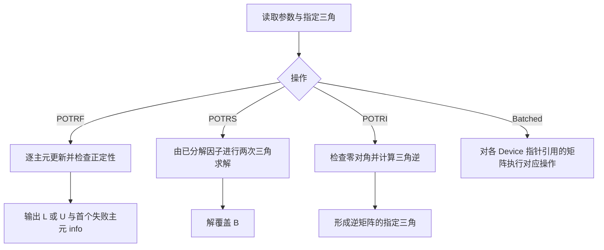
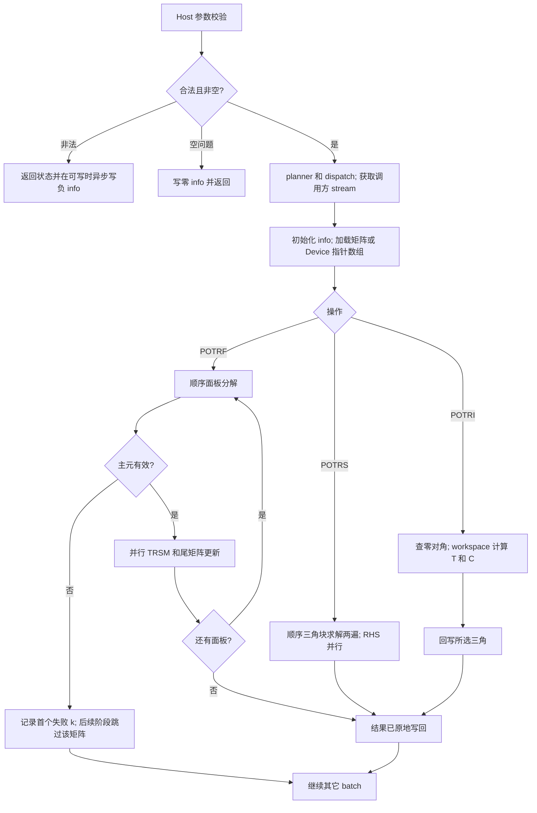

# 【社区任务】Cpotrf、Cpotrs、Cpotri、CpotrfBatched、CpotrsBatched 算子设计文档

版本：v1.0；编写日期：2026-09-28；目标硬件：Ascend 950PR（Atlas 950）；状态：开发方案，尚未实现或完成板卡验证。

本文依据任务书设计五个接口及两个 bufferSize 查询，五接口整体交付。任务书中的提交、邀请账号、申请算力等内容作为后续交付要求记录，本次仅生成方案，不执行外部提交或环境申请。下文“拟定”参数是实现起点，不是性能结论。

## 一、需求背景

### 1.1 需求来源

通过社区任务补齐 ops-solver 的单精度复数 Hermitian 正定矩阵分解、求解、求逆和批量能力。输入输出遵循 CUDA legacy 接口形态，NPU 计算采用 AscendC/CATLASS，不在运行时依赖 CUDA，不允许 CPU fallback。

### 1.2 背景介绍

#### 1.2.1 实现优化目标与参考路径

任务书明确 ops-solver 当前没有对应复数 Cholesky 原型，属于新实现。公开接口目标为 `include/cann_ops_solver.h`、`include/cann_ops_solver_common.h`；计算目录拟为 `src/cpotrf/`、`src/cpotrs/`、`src/cpotri/`、`src/cpotrf_batched/`、`src/cpotrs_batched/`。

本工作区检索未发现 `cann_ops_solver.h`；在线 GitCode 头文件读取未成功。因此不能宣称已核验目标仓的现行 handle 结构、状态枚举或构建注册机制。开发开始时固定 ops-solver commit，并读取 README、CONTRIBUTING、上述两个头文件及已有 solver 的 host/test 实现，完成工程适配。

TBE 源文件路径及文件名：不适用，任务不是既有 TBE 算子迁移；TBE 算子信息库路径及文件名：不适用，未获得对应条目，不能虚构 `impl/cpotrf.py` 或信息库文件。ACLNN 对照：不适用，本任务明确要求 Host C API 直调。以上处理对应 CheckList 第 5–8、11–13、17、19 行，不代表遗漏检查项。

#### 1.2.2 现状分析

| 项目 | 已知现状 | 本次目标 |
| --- | --- | --- |
| TBE dtype/format | 无本任务对应实现及信息库可对照 | COMPLEX64、列主序、合法 lda/ldb padding |
| TBE 实现逻辑/流程图 | 不适用，无源码可据以绘制 | 给出数学参考流程及独立 AscendC 流程 |
| 单矩阵 | 待新增 | POTRF、POTRS、POTRI 与 workspace 查询 |
| 批量 | 待新增 | Device 指针数组，不要求矩阵连续 |
| 框架基础设施 | 任务要求复用现有 handle/stream | 不新建平行 handle 管理体系 |

数学参考：LOWER 为 A₀=LLᴴ，UPPER 为 A₀=UᴴU。POTRS 先后进行两次三角求解；POTRI 先求三角逆再形成 Hermitian 乘积。上标 H 必须同时转置和共轭，不能用普通转置替代。A₀ 表示原始正定矩阵，F 表示输入/输出因子，C 表示逆矩阵，避免验收公式混用 A。

下图为数学参考流程，**不是 TBE 源码流程图**。



## 二、需求分析

### 2.1 外部组件依赖

| 组件 | 用途 | 版本与核验要求 |
| --- | --- | --- |
| CANN、ACL、AscendC 编译器、驱动 | host runtime、kernel 编译和执行 | CANN ≥9.0.0，且与固定 ops-solver README 配套；不能据最低版本断言所有版本均支持所选 API |
| CATLASS | 候选 FP32 分块 GEMM 加速 | 固定 commit，先验证 950PR 数据类型、累加精度、布局和同步能力 |
| NumPy/SciPy LAPACK | 测试侧 COMPLEX128 golden、FP32 CPU 残差基线 | 不进入产品运行依赖；记录版本与线程配置 |
| CUDA/cuSolver | 独立 GPU 性能参照 | 记录 GPU、CUDA/cuSolver 版本；NPU 库不链接 CUDA |
| msprof、仓内测试框架 | kernel 耗时与功能验证 | 固定 profiler 版本及输出字段 |

### 2.2 内部适配模块

复用 `aclsolverCreate/Destroy/SetStream/GetStream`、现有错误处理、导出符号及构建体系。新增复数公共类型、fill mode、五个 host 入口、两个 workspace 查询、公共复数算术/索引/分块组件及测试。状态统一使用 `aclsolverStatus_t`；如仓内仍为 `aclError`，需显式转换表、兼容层和旧接口回归，不能直接强制转换枚举值。

### 2.3 需求模块设计

#### 2.3.1 AscendC 算子原型与公开 C ABI

须在 `cann_ops_solver_common.h` 中补充：

```
typedef struct {
    float real;
    float imag;
} aclFloatComplex;

typedef enum {
    ACLSOLVER_FILL_MODE_LOWER = 0,  /* 下三角，对齐 CUBLAS_FILL_MODE_LOWER */
    ACLSOLVER_FILL_MODE_UPPER = 1   /* 上三角，对齐 CUBLAS_FILL_MODE_UPPER */
} aclsolverFillMode_t;
```

公开计算接口如下。

```
aclsolverStatus_t aclsolverCpotrf_bufferSize(
    aclsolverHandle_t handle,
    aclsolverFillMode_t uplo,
    int n,
    aclFloatComplex *A,
    int lda,
    int *Lwork);

aclsolverStatus_t aclsolverCpotrf(
    aclsolverHandle_t handle,
    aclsolverFillMode_t uplo,
    int n,
    aclFloatComplex *A,
    int lda,
    aclFloatComplex *Workspace,
    int Lwork,
    int *devInfo);

aclsolverStatus_t aclsolverCpotrs(
    aclsolverHandle_t handle,
    aclsolverFillMode_t uplo,
    int n,
    int nrhs,
    const aclFloatComplex *A,
    int lda,
    aclFloatComplex *B,
    int ldb,
    int *devInfo);

aclsolverStatus_t aclsolverCpotri_bufferSize(
    aclsolverHandle_t handle,
    aclsolverFillMode_t uplo,
    int n,
    aclFloatComplex *A,
    int lda,
    int *Lwork);

aclsolverStatus_t aclsolverCpotri(
    aclsolverHandle_t handle,
    aclsolverFillMode_t uplo,
    int n,
    aclFloatComplex *A,
    int lda,
    aclFloatComplex *Workspace,
    int Lwork,
    int *devInfo);

aclsolverStatus_t aclsolverCpotrfBatched(
    aclsolverHandle_t handle,
    aclsolverFillMode_t uplo,
    int n,
    aclFloatComplex *Aarray[],
    int lda,
    int *infoArray,
    int batchSize);

aclsolverStatus_t aclsolverCpotrsBatched(
    aclsolverHandle_t handle,
    aclsolverFillMode_t uplo,
    int n,
    int nrhs,
    aclFloatComplex *Aarray[],
    int lda,
    aclFloatComplex *Barray[],
    int ldb,
    int *info,
    int batchSize);
```

参数名、顺序、含义、Device/Host 归属不得擅自增删或调换。维数类型与对标 CUDA legacy API 一致，使用 `int`（32-bit）。


公开头文件以 `#ifdef __cplusplus` 包裹 `extern "C"`，确保 C 编译器可包含。检查 `sizeof(aclFloatComplex)==8`、real/imag 偏移 0/4、`sizeof(int)==4`；对齐按目标 ABI 复核，不盲目强化调用者指针对齐。Lwork 是 COMPLEX64 元素数，不是字节数；查询返回的 `int *Lwork` 位于 Host，Workspace、矩阵、info、批量指针数组位于 Device。

#### 2.3.2 能力范围与约束

| 接口 | 输入/输出 | 最低覆盖范围 | info |
| --- | --- | --- | --- |
| Cpotrf | 指定三角 A 原地变为 F | n=1…4096，LOWER/UPPER | 0、-i、首个非正定主元 k |
| Cpotrs | F 只读，n×nrhs 的 B 原地变为 X | n=1…4096，nrhs=1…128 | 0/-i |
| Cpotri | F 原地变为 C 的指定三角 | n=1…4096 | 0/-i、首个零对角 k |
| CpotrfBatched | Device Aarray 中各矩阵原地分解 | n=1…4096，batchSize=1…1000000 | 每矩阵 0/k，参数错写 infoArray[0]=-i |
| CpotrsBatched | Device Aarray 只读，各 B 原地求解 | 同上，nrhs=1 | 一个标量 0/-i |

地址为 `base + row + col*ld`（复数元素），有效区为 n 行；不得读写 padding。反三角可被 POTRF 用作工作区，测试不要求其保持原值；POTRS 的输入因子保持只读。POTRI 只保证指定三角结果，对角虚部写 +0。批量矩阵可分散分配，共用 lda/ldb，但不是连续三维张量。禁止 broadcast，不要求图融合。按本次标量参数生成 tiling，不需要图级 shape infer。

除上述 COMPLEX64、列主序和接口范围外，不承诺 COMPLEX128、实数重载、行主序、strided-batch 或批量多 RHS。没有 TBE 功能差集可列，范围以任务书为准。不同 batch 的可写矩阵不得重叠，A/B/workspace 不得发生会破坏输入的别名；这是调用前置条件，公开裸指针接口无法完整检测分配范围或 dtype。超出最低规模范围的支持随资源和整数溢出检查决定，不静默截断。

## 三、需求详细设计

### 3.1 使能方式

使用 ops-solver Host C API → 获取调用方 stream → 标量参数校验与 dispatch → `<<<...>>>` 启动 AscendC/CATLASS kernel。不是 ACLNN 两段式，不新增 PyTorch 接口。Host 不直接调用 `__aicore__` 函数，不回读矩阵做计算，不为检查 info 引入同步。

bufferSize 在 Host 做纯尺寸计算、不读取 A 内容、不下发计算；计算接口正常返回仅表示成功提交，数值 info 在调用方 stream 完成后可见。失败的分解/求逆通过 Device info 报告，不能承诺异步数值失败同步反映为 Host 返回码。

### 3.2 需求总体设计

#### 3.2.1 Host 侧设计

**参数校验与错误优先级。** 按公开参数顺序检查可验证的标量与外层空指针，返回第一个非法参数；序号不计 handle。Host 非法参数返回 `ACLSOLVER_STATUS_INVALID_VALUE`，在有效 handle/stream 和可写 info 存在时排入轻量写 info kernel。空 handle 或空 info 时不能承诺写回；runtime/下发失败映射到仓内相应状态并保留错误原因，不伪装成数值失败。

| 接口 | 不计 handle 的参数序号 |
| --- | --- |
| potrf / potri | uplo=1,n=2,A=3,lda=4,Workspace=5,Lwork=6,devInfo=7 |
| bufferSize | uplo=1,n=2,A=3,lda=4,Lwork=5 |
| potrs | uplo=1,n=2,nrhs=3,A=4,lda=5,B=6,ldb=7,devInfo=8 |
| potrfBatched | uplo=1,n=2,Aarray=3,lda=4,infoArray=5,batchSize=6 |
| potrsBatched | uplo=1,n=2,nrhs=3,Aarray=4,lda=5,Barray=6,ldb=7,info=8,batchSize=9 |

校验 n/nrhs/batchSize 非负、uplo 为 0/1、lda/ldb≥max(1,n)、非空问题的数据指针有效、Lwork 不小于查询需求。所有乘积和地址偏移先提升到 uint64_t/size_t，检查乘法及对齐溢出，再检查返回 Lwork≤INT_MAX。

空问题先保留枚举、负数和 leading dimension 的合法性检查，再快速成功；n=0 的查询返回 Lwork=0。单矩阵 info 写 0；potrfBatched 在 n=0、batchSize>0 时写满 infoArray 为 0，batchSize=0 时无元素可写；potrsBatched 的标量 info 仍写 0。暂定非空 batched solve 必须 nrhs=1，包括拒绝 nrhs=0；与任务书泛化“nrhs=0 成功”有冲突，详见 §6.2，需冻结测试口径后定稿。

Device 指针数组由 kernel 读取，Host 只校验数组基址，不搬回数组进行遍历。任意非法 Device 地址、分配长度、实际 dtype 无法从 C 裸指针自动可靠判定；不作全量地址合法性保证。数组内 NULL 检测可作为 device 诊断路径，但无法既保持全异步又立即给 Host 返回 INVALID_VALUE；该差异列入 §6.2，不能暗中同步。

##### 3.2.1.1 分核策略

单矩阵依赖沿面板顺序推进，面板内部主元串行，剩余行及尾块并行。设面板宽 b、尾矩阵 tile 数 Ntask，使用 G=min(可用核数,Ntask)，核 c 按 task=c,c+G,… 处理独占输出 tile。禁止多个核以浮点原子加累积同一 tile。POTRS 按 RHS tile 和剩余行块分核，同一三角方向的主元块保持依赖顺序。

小批量矩阵每个 AIV/协作线程块独占一个矩阵，按 batchId=c+tG 静态循环；小矩阵的 n≤64 为首轮候选阈值。n=128 不强行塞进 UB，使用 GM 流式分块；更大批量矩阵以有限 wave 处理并在 wave 内按 (batchId,tileId) 展开任务。batchSize=1000000 不生成等数量 host kernel launch，也不分配 batch×n² 额外 workspace。

##### 3.2.1.2 数据分块和内存优化策略

初选 b=32/64，POTRS RHS tile r=min(nrhs,16/32)，最终以编译资源报告和 950PR 测量选择。片内复数拆成实部/虚部 FP32（SoA）参与计算，GM 维持两个相邻 float 的 AoS ABI。尾 tile 用 mask 和精确有效长度，不能以对齐搬运覆盖 padding 或邻近分配。

定义 align(x,a)=ceil(x/a)×a，e=8 字节/复数，D=SIMT cache 字节数（纯 SIMD 为 0），R=8192 字节保守预留，S=辅助区保守预算 16384 字节。AIV 双缓冲输入 tile、复数输出/累加 tile 的初始预算：

`M_UB = 2*align(e*b*b,32) + 2*align(e*b*b,32) + align(e*b*b,32) + S`

约束 `M_UB + D + R <= 262144`。b=64 时 M_UB=180224；混编若 D=65536，再加 R 恰为 253952 字节，余量仅 8192，新增队列/栈必须重新核算，超限改用 b=32。该预算只适用于所述 tile 方案，不适用于整矩阵驻留。

小矩阵完整驻留候选预算 `align(8*n*n,32)+2*align(8*n,32)+S+D+R`；n=64、D=65536 时为 123904 字节。n=128 即使容量看似可容纳，也须计入算法额外 tile 和寄存器压力后再决定。POTRS 工作块需额外 `align(8*b*r,32)`，不能沿用 POTRF 容量判据。

Cube 候选路径的 FP32 实矩阵子乘法预算分别计算：双缓冲 L1 为 `2*align(4*b*k,32)+2*align(4*k*b,32)`；L0A/B 各按所选片尺寸和 512B 对齐；L0C FP32 累加 `align(4*b*b,64)`（多个并行累加器需逐份计入）。容量取平台查询，不硬编码核数。复数四次实乘采用串行复用或计入全部缓冲，不能只算一次乘法后并行开四份。

GM workspace 采用保守、可解释的公开上界：POTRF 预留 `align(8*n*n,256)+align(16*n*b,256)+align(4096,256)` 字节，用于可选打包矩阵、双面板及控制区；POTRI 预留 `2*align(8*n*n,256)+align(16*n*b,256)+align(4096,256)` 字节，分别保存三角逆 T、结果 C 和面板暂存。查询 Lwork=ceil(bytes/8)，查询和执行共享同一 planner。即使选中不需要全部空间的路径，也返回该上界，禁止 kernel 使用查询以外的空间。

POTRS 无公开 workspace，首版直接在 B 上进行分块三角求解，tile 暂存用 LocalMemory；批量 POTRF/POTRS 首版每矩阵独占核心，以 GM 原地更新和片内 tile 实现，不依赖隐含巨量分配。优化路径若需内部缓冲，必须先落实异步生命周期和有界 wave，不能调用后立刻释放仍被 stream 使用的内存。

输入占用公式：单矩阵 A 为 `8*lda*n`；B 为 `8*ldb*nrhs`；批量 A 为 `batchSize*8*lda*n`，B 为 `batchSize*8*ldb*nrhs`，另加指针数组及 info。测试输入不超过任务书的 4G 上限，并记录 GB/GiB 口径；总设备内存还需加 workspace、输入副本、输出及 runtime 余量。

##### 3.2.1.3 tilingKey 规划策略

本工程使用内部 dispatch key，不注册 ACLNN tiling 模板。拟定编码 `key=op | (upper<<4) | (path<<5) | (tail<<8)`：op=0/1/2/3/4 分别代表五个接口；upper=0/1；path=0 为空问题，1 为独核/驻留，2 为流式分块，3 为经验证的 Cube 加速；tail 表示 n 或 RHS 不整除 tile。错误返回路径在 dispatch 前处理。

选路顺序：空问题 → 批量小矩阵且驻留预算通过 → 通用分块 → 仅当 API/精度/性能门禁通过时启用 Cube。key 所含路径仅描述结构，b/r/有效尾长另存；tiling 数据包括 n,nrhs,lda,ldb,batchSize,b,r,blockDim,waveBase,waveCount,workspaceOffset 和版本。相同 shape、环境、配置选择固定路径，调优不在运行中随机搜索。

#### 3.2.2 Kernel 侧设计

##### 3.2.2.1 实现描述

**复数基础。** (a+ib)(c+id)=(ac−bd)+i(ad+bc)，共轭为 (a,−b)。点积的共轭方向随公式选择，固定归约树及 tile 累加顺序。对角主元以 FP32 实数检查并求 sqrt，输出虚部 +0。首版用 FP32 实虚算术，默认不启用 fast-math/FTZ；TF32/降精度 Cube 不能未经精度验证直接替代 FP32。

**POTRF。** LOWER 在面板 j 内计算 d=Re(A[j,j])−Σ|L[j,k]|²，d≤0 时写 info=j+1 并停止该矩阵；正常写 L[j,j]=sqrt(d)，L[i,j]=(A[i,j]−Σ L[i,k]conj(L[j,k]))/L[j,j]。分块实现分解 A11、求 L21=A21*inv(L11ᴴ)、更新 A22←A22−L21*L21ᴴ。UPPER 使用 U11、U12=inv(U11ᴴ)*A12、A22←A22−U12ᴴ*U12。局部失败主元转换为全局 1-based 下标；保留之前已完成列，后续工作读取失败状态后跳过写回。

首版按同一 stream 分别下发 panel/TRSM/update，阶段边界提供跨核依赖，Host 不回读 info；后续阶段 kernel 在入口检查状态并跳过已失败矩阵。面板成功时不反复清零 info。只有证明同步正确且降低开销后，才融合成多核常驻 kernel，不能用无界自旋模拟全局栅栏。

**POTRS。** LOWER 解 LY=B，再解 LᴴX=Y；UPPER 解 UᴴY=B，再解 UX=Y。正向/反向主元块顺序固定，RHS 列可并行；结果只覆盖 B 的有效区，A 不变。输入因子由调用方保证有效，POTRS 不再次做正定性检查，也不输出正值 info。

**POTRI。** 先按固定顺序或确定性最小下标归约查找零对角，有零则 info=k 并跳过后续计算。LOWER 求 T=L⁻¹、C=TᴴT；UPPER 求 T=U⁻¹、C=TTᴴ。在 workspace 完成 T 和 C 后仅拷回所选三角，避免覆盖仍被后续计算使用的因子。三角逆可以分块对单位阵作三角求解，候选优化为分块 TRTRI+LAUUM；两者均 O(n³)，选择依据是依赖、数据复用和板卡实测。

**Batched。** kernel 从 Device 数组加载各矩阵地址；每个矩阵独立执行上述算法并独立提前停止。potrfBatched 每个矩阵唯一写 infoArray[i]；potrsBatched 的 scalar info 只由初始化/参数诊断路径写一次，不能让各 batch 竞争写 0 覆盖错误。矩阵间不进行数值归约。

**访存、同步和确定性。** AIV 路径 GM→UB→Reg→UB→GM；Cube 路径 GM→L1→L0A/B→L0C→Fixpipe→GM，不使用 3510 删除的 GM→L0A/B 或 L1→GM 直通。DMA/计算/复用缓冲前显式建立完成依赖。未来混编路径额外核对 SIMT cache 与 SIMD UB 的可见性；不把 volatile 当作栅栏。相同配置下固定归约顺序、输出 tile 所有者和处理顺序，不使用无序浮点原子加；重复测试恢复原始输入而非对上次输出再次运算。

##### 3.2.2.2 AscendC 实现流程图



##### 3.2.2.3 与 TBE 流程的差异点和原因

无对应 TBE 源码，无法做源码级流程一致性结论。相对数学参考，AscendC 增加 Host 校验、workspace 规划、核间任务分配、tile 搬运、info 初始化与失败屏蔽；原因分别是 ABI 契约、LocalMemory 限制、并行性能和异步执行。分块改变浮点求和顺序，因此用任务书容差及残差复核，不能要求与 CPU 逐位一致；本实现自身重复运行仍须 bit-wise 一致。

### 3.3 支持硬件与 API 核验

仅承诺 Ascend 950PR，SOC_ARCH=dav-3510，不以 950DT 或 A2/A3 测试代替。普通 SIMD 使用 `--npu-arch=dav-3510`；实际使用 SIMT 才添加 `--enable-simt`。本机没有已证明可用的 Ascend 编译/NPU 环境，本次未编译或跑板。

本次资料根为 `asc-devkit-cy/`，已读取 `docs/zh/guide/programming_guide/advanced_programming/hardware_implementation/architecture_spec/npu_arch_3510.md`，验证核分离、数据通路及存储模型。它是规划资料，不替代目标 CANN 版本验收。

实施前按 `docs/ascendc_api_ref_9_1_0_beta_1_01_ai/api_constraints.jsonl` 与目标版本文档建立精确 API 证据表：

| 候选能力 | 文档/声明/实现/测试检索入口（相对 asc-devkit） | 当前状态 |
| --- | --- | --- |
| 数据搬运及尾块 | docs/zh/api/SIMD-API/basic_api/data_move_guide/；include/basic_api/；impl/basic_api/dav_3510/；tests/api/basic_api/ascendc_case_ascend950pr_9599/ | 精确重载、dtype、对齐待实现前核验 |
| FP32 Reg 运算/归约 | docs/zh/api/SIMD-API/basic_api/reg_vector_compute/；include/basic_api/reg_compute/；impl/basic_api/reg_compute/dav_3510/；tests/api/reg_compute_api/ | 同上；不得假定直接复数向量指令支持 |
| Cube/Matmul | docs/zh/api/SIMD-API/adv_api/cube_compute/；include/adv_api/matmul/；impl/adv_api/；tests/api/adv_api/ | FP32 计算模式与 CATLASS policy 未锁定 |
| SIMT 指针数组 | docs/zh/api/SIMT-API/；include/simt_api/；impl/simt_api/；tests/api/simt_api/ | 候选优化，不是首版前置依赖 |

每条最终证据须细化到文件、API/重载、架构分支、dtype、存储位置、对齐、mask/repeat 边界和最小测试。没有核验前不写成“已支持”。

### 3.4 算子约束限制

所有 n、nrhs、batchSize 公开类型为 int32，内部寻址使用 64 位；workspace 生命周期覆盖异步完成，禁止错误单位或不足空间。仅输入指定三角参与计算，不能依赖另半三角的有效值。合法输入为有限复数和实对角 Hermitian 语义；非有限值的验收行为待 §6.2 冻结，不能通过把 NaN 比较结果当成功来放行。跨 stream 并发要求不同输出和 workspace；同一 handle 的并发 SetStream 行为以仓内契约为准，不新增隐式全局状态。

## 四、特性交叉分析

| 交叉特性 | 风险 | 设计与验证 |
| --- | --- | --- |
| UPPER × 复数 | 漏共轭导致看似合理的错误结果 | 非零虚部、非对称实虚数据，分别检验 UᴴU 和 LLᴴ |
| padding × 尾块 | DMA 超范围或覆盖 padding | lda/ldb +8/+32，tile±1，guard sentinel |
| batch × 非正定 | 一矩阵失败中止整个 batch | 混合成功/失败输入，逐矩阵检查 info 和结果 |
| 原地 × 异步 | 覆盖未使用数据或过早释放 | POTRI 独立 T/C，stream 完成前保持所有 buffer |
| 多核 × 确定性 | 浮点归约次序不固定 | 唯一 tile 所有者与固定归约；重复原始输入 |
| stream × 内部缓存 | 错流或跨调用共享 workspace | 非默认流、双 handle 独立流并发，无全局 scratch |
| 大 batch × 内存 | 中间空间随 batch*n² 爆炸 | GM 原地/有限 wave；按输入 4G 约束构造最大范围 |
| ABI × C/C++ | 布局或符号不兼容 | C 头文件编译、C++ 链接和符号检查 |
| dynamic shape × dispatch | 缓存旧 n/ld 或错误 key | 同一 handle 连续切换大小、uplo、padding |
| 图融合/broadcast | 与任务目标不符 | 本任务不要求，不声明支持 |

## 五、可维可测分析

### 5.1 精度标准/性能标准

#### 5.1.1 精度判据

以任务书为主：COMPLEX128 CPU golden；实部、虚部分别满足 `abs(actual-golden)≤2^-16+2^-10*abs(golden)`，matched_ratio≥0.99，另验最大绝对误差门限 `1e-2 or 32*ULP`。`or` 的具体聚合方式及 ULP 基准需与验收脚本统一；不能由开发者选择较容易通过的规则。只比较所选三角（POTRF/POTRI）或有效 B（POTRS），每个 batch 独立判定。

逐元素不通过时按 LAPACK 残差复核，ε 暂按任务书 2^-23，复数绝对值取模，1-范数为最大列绝对值和，计算先升 COMPLEX128。CPU 同精度参考值来自同 case 实测，不能以 NPU 输出反向生成阈值。

| 接口 | 残差 ratio | 阈值 |
| --- | --- | --- |
| potrf / batched | ‖recon−A₀‖₁/(n‖A₀‖₁ε)，LOWER recon=LLᴴ，UPPER recon=UᴴU | max(5*ratio_cpu,3*ratio_cpu_mean) |
| potrs / batched | max_j ‖B₀j−A₀Xj‖₁/(‖A₀‖₁‖Xj‖₁ε) | max(5*ratio_cpu,3*ratio_cpu_mean) |
| potri | ‖I−A₀C‖₁/(n‖A₀‖₁‖C‖₁ε) | max(5*ratio_cpu,0.1) |

非批量 mean 按该算子测试集统计；批量 mean 仅按当前 case 中各矩阵统计，不跨 case。POTRS 用实现实际输入对应的 A₀、B₀ 升精度；POTRI 的 C 从指定三角共轭补全。POTRI 任务书将 A 描述为因子存在数学歧义，本文公式使用原矩阵 A₀；需要用因子定义参考时先重建 A₀，不能直接计算 F*C 与 I 的差。零分母、非有限 ratio 不判为通过，单独记录空问题/异常规则。

#### 5.1.2 测试矩阵与证据

当前附件 `cases.json` 数量：cpotrf 143、cpotrs 174、cpotri 143、cpotrfbatched 154、cpotrsbatched 154，共 768 条；这里统计的是各文件条目数，不声称等于去重后的 canonical 数量。实施时逐项关联 `package/canonical_cases.json`、`cases/index.json`、`bench_result.json` 与性能基线，不只跑任务书列出的 12 个例子。

| 类别 | 覆盖内容 | 判定 |
| --- | --- | --- |
| 正常链路 | potrf；potrf→potrs；potrf→potri；两批量接口 | 数值与 info 双验证；求解/求逆还单测给定因子 |
| shape | n=0/1、2 的幂、幂−1、b±1、4096；nrhs=0/1/8/32/128 | 边界及尾块正确 |
| batch | 0/1/8/128/1024/3000，性能原始规模，1000000 采用小 n | 在 4G 输入上限内分别覆盖边界，不构造全范围笛卡尔积 |
| 分布 | 正定组中均匀/正态各半，BᴴB+nI；对角占优；另加非正定组 | 固定种子，保留实际 COMPLEX64 输入 |
| info | 首/中/末失败主元、POTRI 零对角、混合 batch | 首个 1-based k；负序号逐参数核对 |
| 非法参数 | uplo、负维度、非法 ld、空外层指针、Lwork 不足/负数、nrhs=2 batched | status 与可写 info 一致，无越界下发 |
| 存储 | LOWER/UPPER、lda/ldb 最小值与 +8/+32、分散 Device 指针 | padding sentinel、只读 A 不变 |
| 空问题 | n=0、普通 potrs nrhs=0、batchSize=0 | 快速返回和 info；冲突项按冻结口径 |
| 确定性 | 同输入同流串行至少 10 次 | 恢复输入后输出有效区及 info bit-wise 一致 |
| stream | 非默认流、两独立 handle/流、连续变 shape | 无默认流误用或状态串扰 |
| 极值 | 病态但正定、很小/很大有限值、NaN/Inf | 分开数值误差与输入契约；非有限口径先确认 |
| 工程 | C ABI、导出符号、安装后调用、资源泄漏 | 编译/运行日志及版本 |

完整矩阵放在功能/系统测试，不机械生成大量低价值 UT；基础 UT 选一个代表用例，Host 参数表可由同一数据驱动测试覆盖。CPU 仅用于 golden 和测试，不可冒充 NPU 实现或板卡结果。

#### 5.1.3 性能门禁与优化路线

每个 case 满足 `T_GPU/T_NPU≥0.35`，即 `T_NPU≤T_GPU/0.35`；不能以全局平均速度代替逐 case 门禁。下表由任务书给定 GPU 毫秒值换算，NPU 均待测。

| 编号 | 接口/规格 | GPU ms | NPU 上限 ms |
| --- | --- | ---: | ---: |
| P-01 | potrf n=1024 LOWER | 0.79 | 2.257143 |
| P-02 | potrf n=4096 UPPER | 6.7918 | 19.405143 |
| P-03 | potrf n=2048 LOWER | 1.5434 | 4.409714 |
| P-04 | potrs n=1024 nrhs=1 UPPER | 0.2235 | 0.638571 |
| P-05 | potrs n=4096 nrhs=32 LOWER | 2.9488 | 8.425143 |
| P-06 | potrs n=2048 nrhs=8 LOWER | 1.0867 | 3.104857 |
| P-07 | potri n=1024 LOWER | 1.4534 | 4.152571 |
| P-08 | potri n=4096 UPPER | 17.8843 | 51.098000 |
| P-09 | potrfBatched n=32 batch=102774 LOWER | 2.9648 | 8.470857 |
| P-10 | potrfBatched n=128 batch=46256 LOWER | 18.1601 | 51.886000 |
| P-11 | potrsBatched n=32 batch=99659 nrhs=1 LOWER | 1.5953 | 4.558000 |
| P-12 | potrsBatched n=128 batch=45897 nrhs=1 LOWER | 6.0311 | 17.231714 |

精确判定使用未舍入数值。profiler 每次只采一个 case；记录预热数、迭代数（附件示例为 25，最终按用例）、shape、uplo、ld、stream、版本及所有 kernel 名。每次迭代恢复原始输入，恢复拷贝、分配和 bufferSize 不计入计算耗时；POTRS/POTRI 不计前置 POTRF。若一次接口下发多个 kernel，先按 invocation 汇总该调用所有计算阶段耗时，再跨调用求平均，不能只选最快子 kernel 或把所有阶段混在一起求均值。多阶段与官方口径需验收方确认，并另存逐 kernel 明细和事件包络时间。

任务书 msprof 示例引号不完整，拟使用如下命令形态（路径、二进制名、过滤选项以实际仓库为准，不代表已执行）：

```bash
msprof op --application="${BUILD_DIR}/test/${op}/${op}_test" --output="./prof_${op}"
```

从 `OPPROF_*/OpBasicInfo.csv` 提取 `Task Duration(us)`，以完整 case 键关联 `bench_result.json`、`gpu_baseline.csv` 或包内 `perf_baseline.json`，缺基线标记缺失，不编造。调优先看面板串行、尾矩阵 GEMM、内存带宽、launch 占比；小 batch 优先驻留与合并调度，大矩阵优先块大小与 FP32 GEMM。首版多阶段性能不预先保证达标，达不到门禁须继续优化，不以正确性替代性能验收。

### 5.2 兼容性分析

新增接口不删除既有符号；公共类型/枚举与仓内定义查重，避免 ABI 重定义。补充 C/C++ 编译链接测试、handle 创建销毁、stream 设置读取及已有 solver 回归。CANN 9.0.0 是最低要求，最终支持范围以匹配 README 的实测组合发布；9.1.0-beta.1 离线 API 索引不能证明 9.0.0 可编译。只宣称 950PR 验证，接口不自动扩展到其它芯片。

### 5.3 可维护性与诊断

公共层集中管理复数运算、列主序索引、planner 和 status 映射，各接口只保留必要入口与算法；避免复制五套构建系统。调试记录 dispatch key、b/r、workspace 字节数、case ID、首个失败主元；默认关闭逐元素打印。保留编译器资源报告、精度失败输入、CPU golden、NPU 输出和 profiler 原文件，以版本和输入哈希关联。内存无性能门禁不等于允许越界或泄漏。

## 六、实施计划、风险与交付

### 6.1 分阶段开发与退出条件

| 阶段 | 开发内容 | 退出条件 |
| --- | --- | --- |
| M0 契约冻结 | 固定 ops-solver/CANN/CATLASS 版本，核验 ABI、API 和 §6.2 | 参数/精度/空问题/计时口径有一致记录 |
| M1 基础能力 | 复数、索引、planner、status/info、C ABI、stream | 参数边界、padding、空问题及最小板卡用例通过 |
| M2 单矩阵 | POTRF→POTRS→POTRI、LOWER/UPPER、workspace | 三接口全量精度和 info 通过，无越界 |
| M3 批量 | Device 指针数组、矩阵独立状态、百万小矩阵 | 两批量全量功能、确定性、内存边界通过 |
| M4 优化 | tile 扫描、驻留、候选 Cube/融合 | 950PR 全性能 case ≥0.35×GPU，保持精度 |
| M5 交付 | 文档/测试/报告/代码及 PR 材料 | 五接口整体证据完整，评审问题关闭 |

### 6.2 已识别差异与处理原则

| 编号 | 事实/冲突 | 本方案处理与关闭条件 |
| --- | --- | --- |
| D1 | 任务书 rtol=2^-10、atol=2^-16、ε=2^-23；已读 cpotrf/cpotri `package/verify_accuracy.py` 为 rtol=atol=2^-13、ε=2^-24 | 保存两版来源，验收负责人冻结版本；未统一前双轨报告，不以某一版通过声称验收通过 |
| D2 | POTRF 残差统一写 FFᴴ，不适用于存储为 U 的 UPPER | 使用 UᴴU；脚本已体现此差异，评审确认数学修正 |
| D3 | POTRI 残差将 A 描述为因子，但 I−AC 需要原矩阵 | 明确 A₀，保留实际因子及原矩阵，确认 golden 输入来源 |
| D4 | 空问题 nrhs=0 成功与非空 batched nrhs≠1 报错冲突 | 暂按批量专属约束处理；n=0/batch=0 放宽，验收方确认交叉优先级 |
| D5 | 任务书称不提供性能脚本，但附件包含 `package/verify_perf.py` | 作为辅助比较器，不能替代 NPU 测试二进制及 msprof 原始证据 |
| D6 | Device 内层非法指针要求立即返回错误与无 Host 同步冲突 | 区分 host 可校验参数、device 诊断、调用方有效地址前置条件；冻结错误契约 |
| D7 | 输入有限值约束与 INF/NAN 验收规则并存 | 冻结非有限行为及 info，不能默认 NaN 为正定成功 |
| D8 | 裸指针 API 没有 dtype/shape 元信息 | 只校验显式尺寸与可验证指针；不能声称检测实际分配 dtype/长度 |
| D9 | 最大误差 `1e-2 or 32*ULP` 与脚本动态 max 规则 | 固定 ULP 对象、统计粒度和零/非有限规则；验收前逐项对齐 |
| D10 | 多 kernel 调用的“平均单次 kernel 耗时”易被误算 | 保存调用级总量和逐 kernel 原值，确认与 GPU avg_ms 可比 |
| D11 | ops-solver 当前源码/README 未取得 | 取得指定 commit 后核对状态码、handle、构建和依赖，不能把规划目录视为已存在 |

这些差异不阻止开发方案编写，但属于实现/验收冻结项；本次没有修改任务书、校验包或原始基线。

### 6.3 工程文件与交付清单

拟更新 `include/cann_ops_solver.h`、`include/cann_ops_solver_common.h`；新增五个 `src/` 目录及对应 `test/`，接口文档为 `docs/zh/cpotrf.md`、`cpotrs.md`、`cpotri.md`、`cpotrf_batched.md`、`cpotrs_batched.md`，同步 `docs/api_list.md` 和 README。最终文件布局依目标仓规范，不为每个辅助函数增加独立工程。

设计文档以 PR 提交到 cann-competitions 的 `04_tasks/01_community-task-2026/tasklist` 对应任务位置（具体子目录取得任务条目后确认），不是 issue；标题使用本文标题形式，签署 CLA 并在 PR 评论 `/compile` 触发构建。代码向 ops-solver 提交同一 PR 或一组关联 PR，五接口不能拆分验收。本次未创建这些 PR。

验收资料包括个人仓链接、分支、commit、算子目录、五接口 README、清晰区分的精度/性能用例、自验证步骤、输入输出及截图、环境版本、原始日志。根据任务书，后续在个人仓邀请 Ascend-CANN 开发者并创建 `task_submission/`；这些外部操作由实际提交阶段执行。

```text
task_submission/
  1 自验证步骤说明.md
  2.1 精度自验证报告.xlsx
  2.2 精度自验证日志.log
  3.1 性能自验证报告.xlsx
  3.2 性能自验证日志.log
  4.1 内存自验证报告.xlsx
  4.2 内存自验证日志.log
```

任务书内存“不做要求”，但模板列出内存报告/日志：保留项目并说明无性能门禁，报告实际分配量及越界/泄漏检查；无实测必须标记未执行，不能填写通过。设计文档评审、全量 950PR 自验和关联代码 PR 就绪后方可申请整体验收。

## 七、设计文档 CheckList 逐项覆盖

“覆盖”仅表示本方案处理了检查项，不等于代码已通过、PR 已提交或硬件已验证。

| 原表行号 | 审核项 | 本文位置 | 覆盖状态/说明 |
| --- | --- | --- | --- |
| 2 | PR 提交位置、CLA、/compile | §6.3 | 已规划，外部提交未执行 |
| 3 | PR 标题格式 | 文档标题、§6.3 | 已覆盖 |
| 4 | 1.1 需求来源 | §1.1 | 已覆盖 |
| 5 | TBE 源码和信息库路径（含文件名）、ACLNN 核对 | §1.2.1 | 不适用并说明理由；给出实际 solver 目标头文件 |
| 6 | TBE dtype/format | §1.2.2、§2.3.2 | TBE 不适用；任务类型/布局明确 |
| 7 | TBE 实现逻辑 | §1.2.2 | 无对应源码，不虚构 |
| 8 | TBE 实现流程图 | §1.2.2 | 不适用；提供明确标识的数学参考图 |
| 9 | 外部组件依赖 | §2.1 | 已覆盖版本核验条件 |
| 10 | 内部适配模块 | §2.2 | 已覆盖 |
| 11 | 算子原型及对齐 | §2.3.1 | 五计算接口、两查询及公共类型完整 |
| 12 | 相对 TBE 缺失功能/约束 | §2.3.2 | TBE 不适用；明确任务能力边界 |
| 13 | 使能方式 | §3.1 | 按任务要求使用 C API 直调 |
| 14 | host 分核策略 | §3.2.1.1 | 已覆盖单矩阵与批量 |
| 15 | 分块与 LocalMemory 公式 | §3.2.1.2 | UB/cache/预留、L1/L0、GM workspace |
| 16 | tilingKey 条件 | §3.2.1.3 | 编码、选路、参数及空问题 |
| 17 | kernel 实现与参考一致性 | §3.2.2.1 | 五接口算法、同步、失败及确定性 |
| 18 | AscendC 流程图 | §3.2.2.2 | 已覆盖 |
| 19 | 与 TBE 差异及原因 | §3.2.2.3 | 无 TBE 对照；解释相对数学流程差异 |
| 20 | 支持硬件 | §3.3 | 950PR，未声称实测 |
| 21 | 算子约束 | §3.4、§2.3.2 | 已覆盖 |
| 22 | 特性交叉分析 | 第四章 | 已覆盖 |
| 23 | 精度/性能标准 | §5.1 | 任务专属阈值替代不适用的 TBE 基准；记录冲突 |
| 24 | 兼容性分析 | §5.2 | ABI、依赖版本、已有接口回归 |

## 八、参考资料与核验记录

- 任务书：[Atlas950 Cholesky 五接口任务书](../../../operator_development_workspace/Cholesky_wsp/9月社区任务-单精度复数Cholesky分解、求解和批量接口(950)/Atlas950_Cpotrf_Cpotrs_Cpotri_CpotrfBatched_CpotrsBatched_task_doc.md)。本方案主要需求依据，未将其中工作流指令视为本次执行授权。
- CheckList：[设计文档CheckList.md](../official/设计文档CheckList.md)，逐项覆盖第 2–24 行。
- 模板：工作区 `cann-ops-competitions/04_tasks/01_community-task-2026/resources/design_template.md`，已读；在线同名模板读取失败，采用本地版本并按 CheckList 补齐特性交叉分析。
- 对标接口：[NVIDIA cuSolver 官方文档](https://docs.nvidia.com/cuda/cusolver/index.html)，2026-09-28 可访问；任务契约以给定 legacy 接口为准，开发时需冻结 CUDA/cuSolver 版本。
- 目标仓：[ops-solver](https://gitcode.com/cann/ops-solver)，本次未取得其现行头文件，不作源码实现已核对声明。
- 精度规范：[CANN 实验精度标准](https://gitcode.com/cann/opbase/blob/master/docs/zh/ops_precision_standard/experimental_standard.md)，待与任务附件版本共同冻结，本文具体阈值直接来自任务书及本地脚本实读。
- 附件已检查各算子 `cases.json` 条目数，以及 cpotrf/cpotri 的 `package/verify_accuracy.py` 常量和残差实现；未运行附件脚本、未生成精度或性能通过结论。

本次核验仅限文档结构、原型保留、CheckList 行覆盖、静态公式和性能上限换算；编译、仿真、NPU 精度/性能、CLA、PR 构建均未执行。
