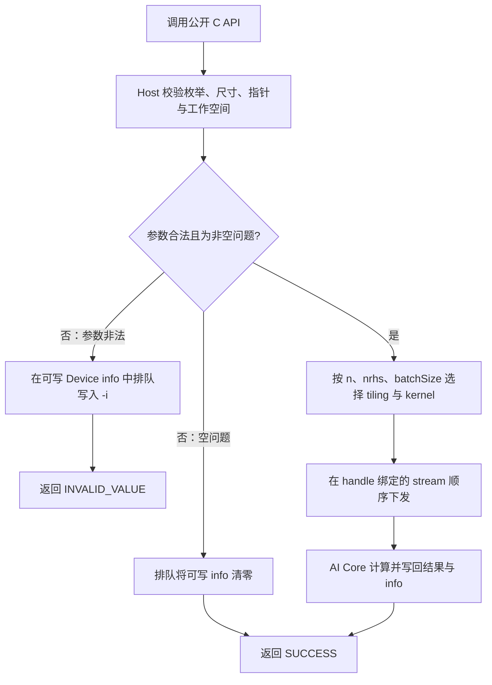
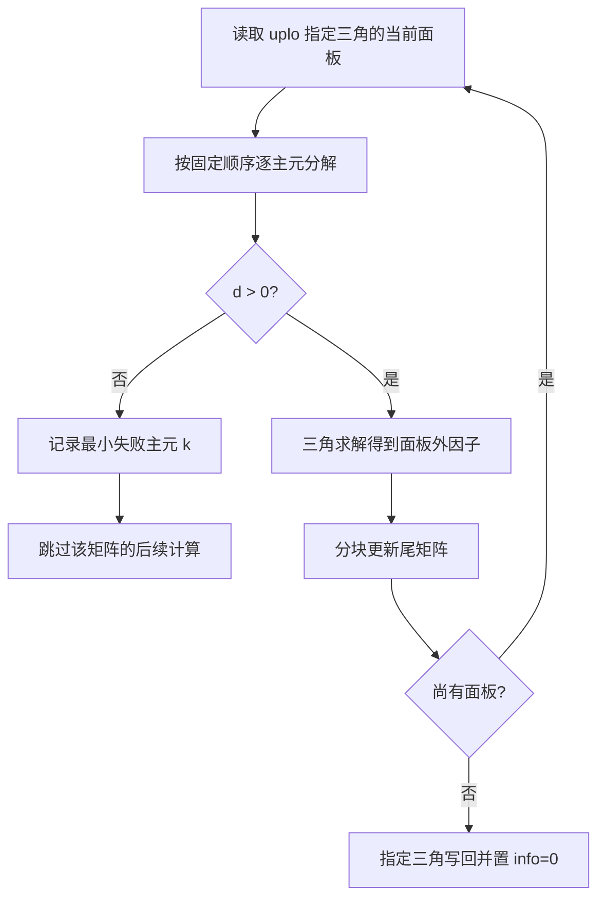

# 单精度复数 Cholesky 分解、求解、求逆及批量接口设计

# 需求背景（required）

## 需求来源

本设计对应 Atlas 950PR 社区任务《单精度复数 Cholesky 分解、求解和批量接口》。交付对象为 `cann/ops-solver` 的五个公开接口：`aclsolverCpotrf`、`aclsolverCpotrs`、`aclsolverCpotri`、`aclsolverCpotrfBatched`、`aclsolverCpotrsBatched`，以及分解和求逆各自的工作空间查询接口。五个计算接口共同构成一次完整的设计交付。

## 背景介绍

Hermitian 正定矩阵可分解为三角因子与其共轭转置的乘积。该因子既能用于重复求解线性方程，也能用于构造逆矩阵。批量接口处理 Device 上的矩阵指针数组，适合大量彼此独立的小矩阵。目标仓库已有 handle 与 stream 管理、`aclsolverStatus_t`，但尚无本任务所需的复数 Cholesky 原型。

本设计采用 `ops-solver` Host C API 直调 Ascend C/CATLASS Kernel 的工程模式。Host 负责参数校验、工作空间规模计算和异步下发；矩阵运算在 Ascend 950PR AI Core 上完成。

# 需求分析（required）

## 需求描述

输入与输出均为单精度复数，实部和虚部各占一个连续的 `float`。矩阵按列主序存储，仅 `uplo` 指定的三角部分具有输入和输出语义。对于 `LOWER`，`A=L·Lᴴ`；对于 `UPPER`，`A=Uᴴ·U`。分解原地覆盖 `A` 的指定三角；求解原地覆盖 `B`；求逆原地覆盖 `A` 的指定三角。未指定的另一半三角不保证保留。

单矩阵支持 `n=1…4096`；求解支持 `nrhs=1…128`；批量支持 `batchSize=1…1000000`，批量求解仅支持 `nrhs=1`。零阶、零右端项或零批次按相应接口的空问题规则成功返回。`lda` 和 `ldb` 必须允许大于实际行数的 padding。输入不支持广播。

## 需求拆解

| 部分 | 交付语义 | 关键约束 |
| --- | --- | --- |
| `Cpotrf` | Hermitian 正定分解，首个失败主子式写入 `devInfo` | 上下三角、原地、工作空间查询 |
| `Cpotrs` | 使用已分解因子求解 `A·X=B` | `nrhs` 可大于 1，因子只读 |
| `Cpotri` | 使用已分解因子形成 `A⁻¹` | 上下三角、原地、工作空间查询、零对角检查 |
| `CpotrfBatched` | 独立分解每个矩阵 | Device 指针数组，逐矩阵 `infoArray[i]` |
| `CpotrsBatched` | 独立求解每个矩阵的一列右端项 | Device 指针数组，标量 `info`，`nrhs=1` |

## 对外接口与类型

公共类型放在 `include/cann_ops_solver_common.h`；七个函数声明放在 `include/cann_ops_solver.h` 的 `extern "C"` 区域，C 和 C++ 均可包含。尺寸参数与对标的 cuSOLVER legacy 接口一致，使用 32 位 `int`。下面的声明是本任务的完整公开原型，参数顺序不变。

```c
typedef struct {
    float real;
    float imag;
} aclFloatComplex;

typedef enum {
    ACLSOLVER_FILL_MODE_LOWER = 0,
    ACLSOLVER_FILL_MODE_UPPER = 1
} aclsolverFillMode_t;

aclsolverStatus_t aclsolverCpotrf_bufferSize(
    aclsolverHandle_t handle, aclsolverFillMode_t uplo, int n,
    aclFloatComplex *A, int lda, int *Lwork);

aclsolverStatus_t aclsolverCpotrf(
    aclsolverHandle_t handle, aclsolverFillMode_t uplo, int n,
    aclFloatComplex *A, int lda, aclFloatComplex *Workspace,
    int Lwork, int *devInfo);

aclsolverStatus_t aclsolverCpotrs(
    aclsolverHandle_t handle, aclsolverFillMode_t uplo, int n, int nrhs,
    const aclFloatComplex *A, int lda, aclFloatComplex *B, int ldb,
    int *devInfo);

aclsolverStatus_t aclsolverCpotri_bufferSize(
    aclsolverHandle_t handle, aclsolverFillMode_t uplo, int n,
    aclFloatComplex *A, int lda, int *Lwork);

aclsolverStatus_t aclsolverCpotri(
    aclsolverHandle_t handle, aclsolverFillMode_t uplo, int n,
    aclFloatComplex *A, int lda, aclFloatComplex *Workspace,
    int Lwork, int *devInfo);

aclsolverStatus_t aclsolverCpotrfBatched(
    aclsolverHandle_t handle, aclsolverFillMode_t uplo, int n,
    aclFloatComplex *Aarray[], int lda, int *infoArray, int batchSize);

aclsolverStatus_t aclsolverCpotrsBatched(
    aclsolverHandle_t handle, aclsolverFillMode_t uplo, int n, int nrhs,
    aclFloatComplex *Aarray[], int lda, aclFloatComplex *Barray[],
    int ldb, int *info, int batchSize);
```

| 参数组 | 所在内存与含义 |
| --- | --- |
| `handle`、`uplo`、`n`、`nrhs`、`lda`、`ldb`、`Lwork` 值、`batchSize` | Host 标量；`handle` 复用仓库已有 stream 绑定 |
| `Lwork` 指针 | `_bufferSize` 写入的 Host `int`，单位为 `aclFloatComplex` 元素 |
| `A`、`B`、`Workspace`、`devInfo`、`infoArray`、`info` | Device 内存；`Workspace` 由调用方按查询结果分配 |
| `Aarray`、`Barray` | Device 上连续存放的指针数组；每个元素指向独立的 Device 矩阵，并非连续的三维张量 |

列主序元素地址为 `A[row + col * lda]` 和 `B[row + col * ldb]`，`0 ≤ row < n`。`Aarray[i]` 的矩阵步长同样为 `lda`。`aclFloatComplex` 的布局为两个连续 FP32，与 `cuComplex` 的数据布局对齐；实现时用编译期断言验证大小和偏移。

现有仓库把 `aclsolverFillMode_t` 定义在 `cann_ops_solver.h` 的 C++ 类型区域。接入时将该定义移到公共头文件并删除旧位置的重复定义；公共头文件使用 C 可接受的标准头。现有依赖 `std::complex` 的旧接口保留在 C++ 条件编译区域，新接口与 handle 接口保持 C ABI。新接口统一返回 `aclsolverStatus_t`，不沿用旧算子的 `aclError` 返回类型。

# 详细设计（required）

## 算子分析

### 数学公式与操作顺序

设 `H` 表示共轭转置。下三角分解的块式计算为：

```text
A11 = L11·L11ᴴ
L21 = A21·L11⁻ᴴ
A22 ← A22 − L21·L21ᴴ
```

上三角取共轭转置的对偶形式：`A11=U11ᴴ·U11`，`U12=U11⁻ᴴ·A12`，`A22←A22−U12ᴴ·U12`。块内逐主元计算实数 `d = Re(Akk) − Σ|Lkj|²`（上三角取对偶索引），要求 `d>0`；写 `sqrt(d)` 到对角，虚部写零。最早失败的 1-based 主元 `k` 写入 `info`，此前已完成的因子部分保留。

求解采用两次三角求解：

| `uplo` | 第一步 | 第二步 |
| --- | --- | --- |
| LOWER | `L·Y=B` | `Lᴴ·X=Y` |
| UPPER | `Uᴴ·Y=B` | `U·X=Y` |

求逆先由三角求解得到 `T⁻¹`，再形成指定半三角：LOWER 为 `L⁻ᴴ·L⁻¹`，UPPER 为 `U⁻¹·U⁻ᴴ`。写回时对角虚部置零；因子对角为零时写首个 1-based 下标到 `devInfo`，停止后续写回。

### 数据范围与可观察结果

输入 Hermitian 正定矩阵的对角具有实数语义，非指定半三角不读取。`potrs` 与 `potri` 的因子应来自同一 `uplo` 下成功的 `potrf`；`potrsBatched` 的每个因子应来自对应的成功批量分解。`potrs` 的 `devInfo`、`potrsBatched` 的 `info` 只报告参数错误，不重新定义正定性判定。相同输入与同一 stream 上的串行调用使用固定归约顺序，输出及 `info` 要逐位一致。

## 算子实现

### 总体调用流程



Host 端按 API 中除 `handle` 外的参数顺序给出 `-i`，其中 `_bufferSize` 无 Device `info` 可写。`handle` 为空时直接返回既有的句柄错误状态。Host 可判定的非法参数返回 `ACLSOLVER_STATUS_INVALID_VALUE`；同步可获知的 Kernel 下发错误映射到相应 `aclsolverStatus_t`，异步执行错误由调用方同步 stream 时通过运行时状态获知。数值上的非正定与零对角属于成功下发后的 Device `info>0`，不把该结果误作 Host 参数错误。为避免强制 Host 同步，Device 内容相关的检查由 Kernel 写入 `info`；同步调用方的 stream 后读取结果。

### Host 侧设计

1. 先检查 `handle`、`uplo`、`n`、`nrhs`、`batchSize`、`lda/ldb` 及必需的状态输出指针。`lda`、`ldb` 至少为 `max(1,n)`；若矩阵实际参与计算，再检查对应 Device 指针非空。`potrsBatched` 在 `n>0` 且 `batchSize>0` 时要求 `nrhs=1`。负数维数始终非法。
2. `potrf` 与 `potri` 通过 `_bufferSize` 给出保守、确定的 `Lwork=n*n` 个复数元素；`n=0` 时为零。该容量用于稳定保存一个紧凑 `n×n` 工作矩阵或三角逆，计算接口要求 `Lwork` 不小于查询值。所有长度、字节数和地址偏移先在 64 位整数中计算，确认不超过 `INT_MAX` 的 `Lwork` 和设备地址范围后再转换。
3. `A` 与 `Workspace` 不允许重叠；`potrs` 的只读因子 `A` 与输出 `B` 不允许重叠。工作空间的有效区按实际 `n` 使用，不将 `lda` padding 当作可写临时区。
4. `potrfBatched`、`potrsBatched` 无公开工作空间参数。小矩阵中间量尽量驻留单核本地存储；大矩阵采用原地分块更新。批量指针数组在 Device 上由 Kernel 读取，Host 不解引用，也不逐矩阵同步。
5. 所有初始化、检查与计算 Kernel 进入 `aclsolverGetStream` 返回的调用方 stream。Kernel 之间依赖同一 stream 的执行顺序，不做无必要的 Host 同步。空问题不访问空的矩阵或指针数组；单矩阵 `devInfo` 和批量求解的标量 `info` 置零。批量分解在 `batchSize=0` 时没有可写的 `infoArray` 元素，不发起写入；在 `n=0` 且 `batchSize>0` 时逐元素写零。

### Kernel 侧设计

复数乘加明确拆为实数运算：`(a+ib)(c+id)=(ac−bd)+i(ad+bc)`，共轭时仅改变虚部符号。面板的平方根、复数除法和三角回代在 FP32 中执行，尾部更新由 Ascend C/CATLASS 的可用 FP32 矩阵计算路径完成；实现时验证所选路径的 FP32 累加与硬件支持，不依赖隐式降精度。块宽由 Host 根据 `n` 和 AI Core 本地存储容量选择，优先 32/64/128 列的可装载块，尾块按实际列数处理。

本地存储按候选 tile 宽 `b`、右端项子块宽 `r` 做预算。以下是设计上限，不预设未核实的 950PR UB 容量；实现时从平台信息取得可用容量 `U`，只选择满足预算的 `b/r`，否则继续缩小 tile。

| 本地对象 | 最大占用 |
| --- | ---: |
| 三个复数 `b×b` 输入/输出 tile | `24b²` 字节 |
| 两个 FP32 `b×b` 累加 tile | `8b²` 字节 |
| 两个复数 `b×r` 右端项/临时 tile | `16br` 字节 |
| 队列、对齐和标量暂存预留 | `R` 字节，由实际 Kernel 布局确定 |
| **选择条件** | **`32b²+16br+R ≤ U`** |

小矩阵的单核路径同样按该条件分 tile；“单核处理一矩阵”不意味着把整个矩阵一次放进 UB。由本地存储和实际 API 对齐约束共同决定 `b`，不能仅凭矩阵阶数使用固定阈值。



每个面板包含确定的“分解 → 求解 → 更新”阶段。跨核依赖通过同一 stream 上的顺序 Kernel 边界表达；同一输出元素只由一个核写入，避免浮点原子加法造成不确定性。上三角采用索引与共轭变换的对偶路径，不从未指定的半三角读取数据。面板内发现非正定后，更新 Kernel 根据该矩阵的 `info` 跳过后续写入，保持最早错误位置与已完成因子。

`potrs` 的两次三角求解按依赖方向分块推进，列间的多个 `nrhs` 独立并行，同一列内部按固定顺序累加。`potri` 先用工作空间构造 `T⁻¹`，再以不覆盖输入的方式形成逆矩阵指定半三角并写回 `A`。两者在入口初始化 `info=0`；`potri` 在三角求逆前检查零对角，首个零对角下标覆盖成功状态。

### 批量调度

```mermaid
flowchart LR
    A[Device 指针数组] --> B[按 batch 下标分配工作]
    B --> C{矩阵规模}
    C -- 小矩阵 --> D[单核处理一或多矩阵]
    C -- 大矩阵 --> E[按矩阵及面板分块并行]
    D --> F[各矩阵独立写回 A 或 B]
    E --> F
    F --> G[potrfBatched 写 infoArray[i]]
    F --> H[potrsBatched 写标量 info]
```

对小矩阵，按矩阵分配 AI Core，减少多次启动；对大矩阵，复用单矩阵的面板与尾部更新路径，并在每个阶段以矩阵下标和 tile 下标映射工作。内部可按硬件最大网格规模对一个 API 调用分段下发，始终保持完整的调用语义。`Aarray[i]`、`Barray[i]` 独立寻址；`infoArray[i]` 仅由第 `i` 个分解写入，某矩阵失败不影响其他矩阵。`potrsBatched` 不把 `info` 当成逐矩阵数组，其合法调用写一个零值。

### 状态、边界与异常

| 场景 | 返回值与 Device 状态 |
| --- | --- |
| 合法分解或求逆 | `ACLSOLVER_STATUS_SUCCESS`；`devInfo=0`，数值失败则为首个 `k>0` |
| 合法单矩阵求解 | `ACLSOLVER_STATUS_SUCCESS`；`devInfo=0` |
| 合法批量分解 | `ACLSOLVER_STATUS_SUCCESS`；逐矩阵 `infoArray[i]=0` 或 `k>0` |
| 合法批量求解 | `ACLSOLVER_STATUS_SUCCESS`；标量 `info=0` |
| 非法非句柄参数 | `ACLSOLVER_STATUS_INVALID_VALUE`；可写时单矩阵 `devInfo=-i`、批量分解 `infoArray[0]=-i`、批量求解 `info=-i` |
| `n=0`、单矩阵 `nrhs=0` 或 `batchSize=0` | 空问题成功；单矩阵和批量求解的标量状态置零，批量分解仅对实际存在的状态元素写零，不访问矩阵 |

参数 `i` 不计 `handle`，因此 `potrf` 的 `uplo/n/A/lda/Workspace/Lwork/devInfo` 对应 1～7；`potrs` 的 `uplo/n/nrhs/A/lda/B/ldb/devInfo` 对应 1～8；`potri` 与 `potrf` 相同；`potrfBatched` 的 `uplo/n/Aarray/lda/infoArray/batchSize` 对应 1～6；`potrsBatched` 的 `uplo/n/nrhs/Aarray/lda/Barray/ldb/info/batchSize` 对应 1～9。`_bufferSize` 的 `Lwork` 是 Host 输出，不写 Device 错误码。

### 性能优化方案

- 小矩阵批量按矩阵并行、减少每个矩阵的下发开销；大矩阵采用面板分解和分块尾部更新，使主要算量进入 FP32 矩阵计算路径。
- 面板与右端项按本地存储容量分块，尽可能复用已搬入的数据；保留列主序 `lda/ldb` 寻址，不为了性能牺牲 padding 语义。
- `potrs` 的多个右端项共享因子 tile；`potri` 在工作空间内保存三角逆，避免因原地覆盖而额外复制整个输入。
- 调度阈值和块宽依据 950PR 的 AI Core/本地存储资源选取，固定同一规格的计算顺序。性能目标为任务书逐 case 的 NPU 平均 Kernel 耗时不超过对应 GPU 数据的 `1/0.35`，此处不预设实测结论。

## 支持硬件

| 目标硬件 | 实现方式 |
| --- | --- |
| Ascend 950PR（Atlas 950） | ops-solver Host C API 直调 Ascend C/CATLASS AI Core Kernel |

## 算子约束限制

仅支持 COMPLEX64、列主序、Hermitian 正定输入；`potrs`/`potri` 以成功分解的因子为前提。`lda/ldb ≥ max(1,n)`，无需等于 `n`。批量输入是 Device 指针数组；不支持广播、连续三维张量替代指针数组，也不要求图融合。超出任务范围的尺寸不得静默截断。

# 可维可测分析

## 精度标准与验证设计

设计阶段不填写测试结果。实现后的验证应覆盖 LOWER/UPPER、`lda/ldb` padding、最小规模、空问题、非默认 stream、非正定首个主元、求逆零对角、批量中个别失败矩阵，以及 `potrsBatched` 的 `nrhs=2` 报错。相同输入在同一 stream 串行重复执行，输出和 `info` 必须逐位一致。

数值 golden 使用 COMPLEX128 参考计算。COMPLEX64 的实部、虚部分别按 `rtol=2⁻¹⁰`、`atol=2⁻¹⁶`、匹配比例不低于 `0.99` 与任务书给定的最大绝对误差限（`1e-2` 或 `32×ULP`）判定；逐元素未通过时，按任务书定义的 LAPACK 归一化残差复核。非正定 `info` 必须精确匹配 1-based 下标。性能验证按任务书给出的同 shape、同 dtype、同列主序 GPU 基线和 NPU Kernel 平均耗时比较。

## 兼容性分析

新增七个 C ABI 符号。把已有的 `aclsolverFillMode_t` 移入公共头文件时保持枚举名称和值不变，避免重复定义；既有 C++ 算子原型与行为不在本设计范围内修改。状态码使用仓库已有的 `aclsolverStatus_t`。需要在实现阶段用 C 编译器检查公开头文件可包含性，并用 C++ 编译器检查既有接口兼容性。

## 参考依据

- 《Atlas 950 单精度复数 Cholesky 分解、求解和批量接口任务书》（本任务提供的任务书）
- [ops-solver 仓库与现有公共接口](https://gitcode.com/cann/ops-solver)
- [cuSOLVER legacy Cholesky 接口说明](https://docs.nvidia.com/cuda/cusolver/index.html#cuSolverDN-legacy-api)
