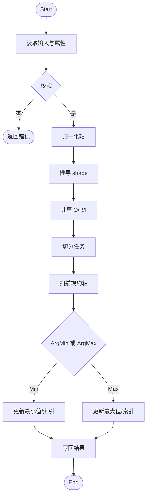
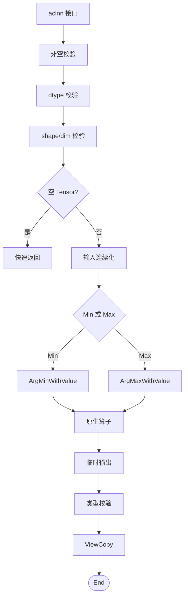
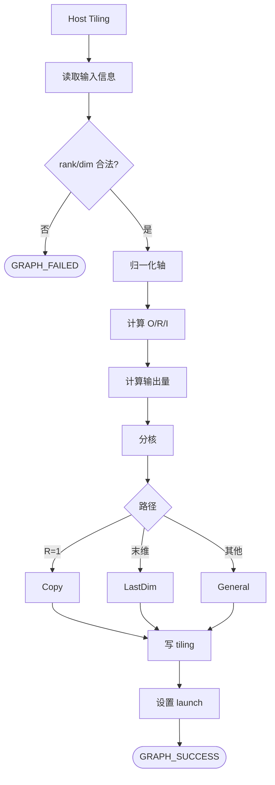
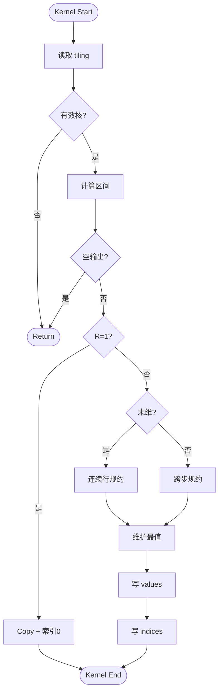

# MinDim&MaxDim 算子设计文档

## 一、需求背景

### 1.1 需求来源

社区任务 `20260529-6` 要求参考昇腾版本内置 `aclnnMinDim` 与 `aclnnMaxDim` 算子，在昇腾 NPU 上基于 Ascend C 编程语言实现功能一致的原生算子，完成算子设计、开发、测试和验收交付。`aclnnMinDim` 的原 TBE 实现对应内部 `ArgMinWithValue`，`aclnnMaxDim` 的原 TBE 实现对应内部 `ArgMaxWithValue`。

### 1.2 背景介绍

#### 1.2.1 算子目标

`MinDim` 与 `MaxDim` 是按指定维度做规约并同时返回数值与索引的算子。设输入 `self` 的秩为 `r`，逻辑 shape 为

$$
\mathbf{S}=(S_0,S_1,\ldots,S_{r-1})
$$

参数 `dim` 指定规约轴，`keepdim` 指定输出是否保留规约轴。对归一化后的规约轴

$$
a=\begin{cases}
dim+r, & dim < 0 \\
dim, & dim \ge 0
\end{cases}
$$

输出 `out` 保存每个输出位置沿 `a` 轴得到的最小值或最大值，输出 `indices` 保存对应最值在规约轴上的 `INT32` 索引。相同最值出现多次时，索引按内置 TBE 语义对齐，设计实现采用首次出现的最值位置作为返回索引。

本次设计目标如下：

1. 功能语义与任务环境内置 TBE `ArgMinWithValue` / `ArgMaxWithValue` 保持一致。
2. 对外提供 `aclnnMinDim` 与 `aclnnMaxDim` 两段式接口，支持 `dim`、`keepdim`、非连续 Tensor 与输出 ViewCopy。
3. 原生算子工程交付 `ArgMinWithValue` 与 `ArgMaxWithValue` 的 Host 定义、InferShape、Tiling 与 AiCore Kernel。
4. 支持任务书要求的 `FLOAT16`、`FLOAT`、`BFLOAT16`、`INT16` 四类输入 dtype，输入与 value 输出 dtype 一致，索引输出 dtype 为 `INT32`，format 为 `ND`，rank 范围为 `[1, 8]`。
5. 当前设计适配任务书要求的 Atlas A2 训练系列产品/Atlas A3 系列产品。

#### 1.2.2 TBE 基线来源说明

本任务以内置 TBE 算子作为功能、精度与性能对齐基线。设计分析参考路径如下：

| 基线层次 | 直接路径 | 作用 |
| --- | --- | --- |
| TBE Kernel 实现层 | `/usr/local/Ascend/ascend-toolkit/latest/opp/built-in/op_impl/ai_core/tbe/impl/ops_legacy/dynamic/arg_min_with_value` | 查看任务书指定 TBE 主体实现与公共调度结构 |
| 算子原型层 | `/usr/local/Ascend/ascend-toolkit/latest/opp/built-in/op_graph/inc/ops_proto_math.h` | 核对内部 `ArgMinWithValue` / `ArgMaxWithValue` 的输入、输出与属性定义 |
| 算子信息库层 | `/usr/local/Ascend/ascend-toolkit/latest/opp/built-in/op_impl/ai_core/tbe/config/ascend910b/aic-ascend910b-ops-info-legacy.json` | 核对任务书指定算子信息库中的注册条目、dtype、format、动态 shape/rank 能力与 reduce slice pattern |

外部 `aclnnMinDim` / `aclnnMaxDim` 接口与内部 `ArgMinWithValue` / `ArgMaxWithValue` 的职责不同：`aclnn` 接口层负责参数校验、非连续输入规整、输出 ViewCopy 与执行器组装；内部原生算子负责连续 ND Tensor 上的按维度规约。设计文档按这两层分别描述。

#### 1.2.3 TBE 算子现状分析

内置 TBE 的 `ArgMinWithValue` 与 `ArgMaxWithValue` 均属于带 value 输出的 arg reduce 类算子。其基本语义为：输入 `x` 按 `dimension` 属性指定的轴做最小值或最大值规约，同时输出 `indice` 与 `values`。其中 `indice` 是最值在规约轴上的索引，`values` 是最值本身。

结合任务书要求，本文交付范围如下：

| 层次 | 输入 dtype | `indices` dtype | `out` / `values` dtype | format | rank |
| --- | --- | --- | --- | --- | --- |
| `aclnnMinDim` / `aclnnMaxDim` | `FLOAT16`、`FLOAT`、`BFLOAT16`、`INT16` | `INT32` | 与 `self` 一致 | `ND` | `[1, 8]` |
| 内部 `ArgMinWithValue` / `ArgMaxWithValue` | `FLOAT16`、`FLOAT`、`BFLOAT16`、`INT16` | `INT32` | 与 `x` 一致 | `ND` | `[1, 8]` |

参数/属性约束如下：

| 属性 | 类型 | 约束 |
| --- | --- | --- |
| `dim` / `dimension` | `INT64` | 取值范围为 `[-rank, rank)`，Host 侧归一化到 `[0, rank)` |
| `keepdim` / `keep_dims` | `BOOL` | `false` 时输出 rank 为输入 rank 减 1；`true` 时输出 rank 与输入一致且规约轴维度为 1 |

TBE 基线可抽象为三步：

1. 根据 `dimension` 将输入拆成 `outerSize`、`reduceSize`、`innerSize`。
2. 遍历 `outerSize * innerSize` 个输出元素，每个输出元素沿 `reduceSize` 扫描并更新当前最值与索引。
3. 将最值写入 `values` / `out`，将索引写入 `indice` / `indices`。

TBE 基线语义流程如下：

## 二、需求分析

### 2.1 外部组件依赖

不引入新的第三方组件，复用 CANN 社区任务已有的算子编译框架、`aclnn` 两段式接口、`opdev` / `l0op` 接口、Host Tiling 与 Ascend C Kernel 运行环境。

### 2.2 内部适配模块

| 模块 | 计划文件 | 设计职责 |
| --- | --- | --- |
| API 文档 | `docs/aclnnMinDim.md`、`docs/aclnnMaxDim.md` | 说明两段式接口、参数、返回值、约束与示例 |
| `aclnn` 接口层 | `op_api/aclnn_min_dim.cpp`、`op_api/aclnn_max_dim.cpp` | 参数校验、dtype 校验、shape 校验、非连续输入 Contiguous、输出 ViewCopy、执行器组装 |
| 原生调用层 | `op_api/argmin_with_value.cpp`、`op_api/argmax_with_value.cpp` | 将 `aclnn` 路径调度到内部 `ArgMinWithValue` / `ArgMaxWithValue` AiCore 算子 |
| Host 定义 | `op_host/arg_min_with_value_def.cpp`、`op_host/arg_max_with_value_def.cpp` | 注册输入输出、属性、dtype/format、动态 shape/rank 与 AICore 配置 |
| Shape 推导 | `op_host/arg_common_base_infershape.cpp` | 按 `dim` 与 `keepdim` 推导 `indices` 与 `values` 输出 shape |
| Tiling 层 | `op_host/arg_with_value_tiling.cpp` | 计算规约三元组、分核策略、UB 规划和 tiling key |
| Kernel 数据 | `op_kernel/arg_with_value_tiling_data.h` | 定义 Kernel 侧所需 tiling 字段 |
| Kernel 入口 | `op_kernel/arg_min_with_value_apt.cpp`、`op_kernel/arg_max_with_value_apt.cpp` | 按 dtype 与 Min/Max 模式进入 Ascend C Kernel |
| 测试与样例 | `examples/`、`tests/` | 覆盖接口调用、功能正确性、非连续 Tensor、边界 shape 与性能对比 |

### 2.3 需求模块设计

#### 2.3.1 `aclnnMinDim` 算子原型

| 名称 | 类别 | 数据类型 | format | shape | 说明 |
| --- | --- | --- | --- | --- | --- |
| `self` | 输入 | `FLOAT16`、`FLOAT`、`BFLOAT16`、`INT16` | `ND` | `[1, 8]` 维 | 待计算的输入 Tensor，支持非连续 Tensor |
| `dim` | 输入参数 | `INT64` | - | 标量 | 指定规约维度，范围为 `[-self.dim(), self.dim())` |
| `keepdim` | 输入参数 | `BOOL` | - | 标量 | 是否保留规约轴 |
| `out` | 输出 | 与 `self` 一致 | `ND` | 与 `keepdim` 推导结果一致 | 最小值输出，支持非连续 Tensor |
| `indices` | 输出 | `INT32` | `ND` | 与 `out` 一致 | 最小值索引输出，支持非连续 Tensor |

#### 2.3.2 `aclnnMaxDim` 算子原型

| 名称 | 类别 | 数据类型 | format | shape | 说明 |
| --- | --- | --- | --- | --- | --- |
| `self` | 输入 | `FLOAT16`、`FLOAT`、`BFLOAT16`、`INT16` | `ND` | `[1, 8]` 维 | 待计算的输入 Tensor，支持非连续 Tensor |
| `dim` | 输入参数 | `INT64` | - | 标量 | 指定规约维度，范围为 `[-self.dim(), self.dim())` |
| `keepdim` | 输入参数 | `BOOL` | - | 标量 | 是否保留规约轴 |
| `out` | 输出 | 与 `self` 一致 | `ND` | 与 `keepdim` 推导结果一致 | 最大值输出，支持非连续 Tensor |
| `indices` | 输出 | `INT32` | `ND` | 与 `out` 一致 | 最大值索引输出，支持非连续 Tensor |

#### 2.3.3 内部 `ArgMinWithValue` / `ArgMaxWithValue` 原型

内部原生算子与 `aclnn` 对外接口的输出顺序不同，原生算子输出顺序为 `indice` 在前、`values` 在后：

| 名称 | 类别 | 数据类型 | format | shape | 说明 |
| --- | --- | --- | --- | --- | --- |
| `x` | 输入 | `FLOAT16`、`FLOAT`、`BFLOAT16`、`INT16` | `ND` | `[1, 8]` 维 | 连续 ND 输入 Tensor |
| `dimension` | 属性 | `INT64` | - | 标量 | 规约轴 |
| `keep_dims` | 属性 | `BOOL` | - | 标量 | 是否保留规约轴 |
| `indice` | 输出 | `INT32` | `ND` | 与 `values` 一致 | 最值索引 |
| `values` | 输出 | 与 `x` 一致 | `ND` | 按 `dimension` 和 `keep_dims` 推导 | 最值输出 |

#### 2.3.4 设计范围与约束

| 类别 | 约束项 | 约束内容 |
| --- | --- | --- |
| 验收范围 | 功能对齐基线 | 以内置 TBE `ArgMinWithValue` / `ArgMaxWithValue` 为准 |
| 验收范围 | 适配硬件 | Atlas A2 训练系列产品/Atlas A3 系列产品 |
| dtype | 输入与 value 输出 | `FLOAT16`、`FLOAT`、`BFLOAT16`、`INT16` |
| dtype | 索引输出 | `INT32` |
| format | 输入输出 | `ND` |
| rank | 输入 | `[1, 8]` |
| shape | 输出 | `keepdim=false` 时删除规约轴；`keepdim=true` 时规约轴维度置为 1 |
| 非连续 Tensor | `self` / `out` / `indices` | `aclnn` 接口层支持，内部原生算子按连续 ND 输入设计 |
| 规约轴 | `dim` | 范围为 `[-rank, rank)` |

## 三、需求详细设计

### 3.1 使能方式

本设计面向 Ascend C 原生算子工程与 `aclnn` 两段式接口直调场景。

| 上层调用/工具链 | 状态 |
| --- | --- |
| `aclnn` 直调 | 支持 |

### 3.2 需求总体设计

整体链路分为四层：

1. `aclnn` 接口层：完成参数校验、空 Tensor 处理、非连续输入连续化、输出形状校验与 ViewCopy。
2. L0 原生调用层：创建 `ArgMinWithValue` / `ArgMaxWithValue` 临时输出，并将 AiCore 任务加入执行器。
3. Host Tiling 层：读取 shape、dtype、`dim`、`keepdim` 和平台信息，推导规约三元组和分核参数。
4. AiCore Kernel 层：按 tiling 数据完成规约计算并写回 `indice` 与 `values`。

整体策略图如下：

### 3.2.1 Host 侧设计

#### 3.2.1.1 接口校验与规整策略

`aclnnMinDim` 与 `aclnnMaxDim` 第一段接口执行以下校验与规整：

1. 校验 `self`、`out`、`indices`、`workspaceSize`、`executor` 非空。
2. 校验 `self` dtype 在 `FLOAT16`、`FLOAT`、`BFLOAT16`、`INT16` 范围内。
3. 校验 `out` dtype 与 `self` 一致，`indices` dtype 为 `INT32`。
4. 校验 `self`、`out`、`indices` rank 不超过任务书范围，`dim` 在 `[-rank, rank)` 内。
5. 根据 `keepdim` 推导期望输出 shape，并校验 `out` 与 `indices` shape 与推导结果一致。
6. 空 Tensor 在基础参数合法时快速返回。
7. 非连续 `self` 通过 `Contiguous` 规整后进入内部 `ArgMinWithValue` / `ArgMaxWithValue`。
8. 非连续 `out` 与 `indices` 通过临时连续输出和 `ViewCopy` 写回。

#### 3.2.1.2 Shape 推导

设输入 rank 为 `r`，归一化后的规约轴为 `a`。当 `keepdim=false` 时，输出 shape 为：

$$
(S_0,\ldots,S_{a-1},S_{a+1},\ldots,S_{r-1})
$$

当 `keepdim=true` 时，输出 shape 为：

$$
(S_0,\ldots,S_{a-1},1,S_{a+1},\ldots,S_{r-1})
$$

`indices` 与 `out` / `values` shape 完全一致。`values` dtype 与输入一致，`indices` dtype 固定为 `INT32`。

#### 3.2.1.3 Tiling 策略

Host Tiling 将输入按规约轴拆成三个逻辑量：

$$
outerSize = \prod_{i=0}^{a-1} S_i
$$

$$
reduceSize = S_a
$$

$$
innerSize = \prod_{i=a+1}^{r-1} S_i
$$

输出元素总数为：

$$
totalOutput = outerSize \times innerSize
$$

分核主轴选择输出元素空间，即每个 AICore 负责一段连续的输出元素区间。设平台可用 AIV 核数为 `coreNum`，则：

$$
realCoreNum = \min(coreNum,\max(totalOutput,1))
$$

$$
blockFactor = \left\lceil \frac{totalOutput}{realCoreNum} \right\rceil
$$

$$
tailBlockFactor = totalOutput - blockFactor \times (realCoreNum - 1)
$$

Tiling 数据写入 Kernel 侧所需字段：

| 字段 | 含义 |
| --- | --- |
| `outerSize` | 规约轴之前所有维度的乘积 |
| `reduceSize` | 规约轴长度 |
| `innerSize` | 规约轴之后所有维度的乘积 |
| `totalOutput` | 输出元素总数 |
| `realCoreNum` | 实际参与计算的 AICore 数 |
| `blockFactor` | 普通核输出元素数 |
| `tailBlockFactor` | 尾核输出元素数 |
| `tilingKey` | Kernel 分支标识，区分 copy、last-dim、general reduce 等路径 |

Host-Tiling-Kernel 流程如下：

### 3.2.2 Kernel 侧设计

#### 3.2.2.1 统一索引模型

Kernel 按输出线性下标 `outOffset` 工作。输出下标可拆为：

$$
outerIndex = \left\lfloor \frac{outOffset}{innerSize} \right\rfloor
$$

$$
innerIndex = outOffset \bmod innerSize
$$

沿规约轴第 `k` 个候选元素在输入中的线性地址为：

$$
inputOffset = (outerIndex \times reduceSize + k) \times innerSize + innerIndex
$$

Kernel 初始化 `bestValue = x[inputOffset(k=0)]`，`bestIndex = 0`，随后遍历 `k=1..reduceSize-1`。`MinDim` 在候选值更小时更新，`MaxDim` 在候选值更大时更新；候选值与当前最值相等时不更新，从而保留首次出现的索引。

#### 3.2.2.2 Kernel 路径

Kernel 侧按照 shape 结构选择三类主路径：

| 路径 | 触发条件 | 设计说明 |
| --- | --- | --- |
| Copy 路径 | `reduceSize == 1` | 输出值等于输入值，索引全部为 0，避免进入通用规约循环 |
| LastDim 路径 | `innerSize == 1` | 每个输出元素对应输入上一整段连续规约行，适合按行搬入 UB 后规约 |
| General 路径 | `innerSize > 1` | 规约轴不是末维，输入候选之间存在 `innerSize` stride，按输出 tile 遍历规约轴并维护最值与索引 |

不同 dtype 的比较策略如下：

| dtype | 比较策略 | 输出策略 |
| --- | --- | --- |
| `FLOAT` | 可直接按 `FLOAT` 比较 | `values` 写回 `FLOAT`，`indices` 写回 `INT32` |
| `FLOAT16` | 计算时可转为 `FLOAT` 比较或使用硬件规约能力，保证与 TBE 默认精度阈值对齐 | `values` 写回 `FLOAT16` |
| `BFLOAT16` | 计算时按可用向量能力转为 `FLOAT` 比较，避免 BF16 标量比较差异扩大 | `values` 写回 `BFLOAT16` |
| `INT16` | 按整数数值顺序比较，可转为 `FLOAT` 做中间比较但输出保留原始 `INT16` 值 | `values` 写回 `INT16` |

Kernel 计算流程如下：

#### 3.2.2.3 性能优化策略

1. `reduceSize==1` 单独走 Copy 路径，避免无意义规约。
2. `innerSize==1` 的末维规约优先按完整行搬入 UB，减少 strided 访存和地址计算。
3. 对小 `reduceSize`、大 `outerSize` 的场景，尽量让一个核处理多行，降低小规约维度下的 kernel 内固定开销。
4. 对非末维规约，按输出连续 tile 组织，使同一个 `k` 下的 `innerSize` 方向尽可能连续搬运。
5. 半精度与 BF16 在中间比较时控制 cast 与同步范围，避免为每个输出元素单独触发小粒度向量操作。
6. 输出 `indices` 固定 `INT32`，内部避免不必要的 `INT64` 临时索引写回。

### 3.3 支持硬件

| 支持的芯片版本 | 涉及勾选 |
| --- | --- |
| Atlas A2 训练系列产品/Atlas A3 系列产品 | √ |

### 3.4 算子约束限制

1. 支持 `FLOAT16`、`FLOAT`、`BFLOAT16`、`INT16` 输入 dtype，`out` dtype 与 `self` 一致。
2. `indices` dtype 固定为 `INT32`。
3. 支持 `ND` format。
4. 输入 rank 支持 `[1, 8]`。
5. `dim` 范围为 `[-self.dim(), self.dim())`。
6. `keepdim=false` 时输出 rank 为输入 rank 减 1；`keepdim=true` 时输出 rank 与输入一致且规约轴维度为 1。
7. `self`、`out`、`indices` 支持非连续 Tensor，非连续场景由 `aclnn` 接口层通过连续化和 ViewCopy 适配。
8. `ArgMinWithValue` / `ArgMaxWithValue` 内部原生路径以连续 ND Tensor 为输入。

## 四、特性交叉分析

`MinDim` 与 `MaxDim` 的特性交叉主要集中在 dtype、规约轴位置、输出 shape、非连续 Tensor 和边界 shape 上：

| 交叉维度 | 设计关注点 | 应对策略 |
| --- | --- | --- |
| `dim` 正负表达 | 同一规约轴可能有正轴和负轴两种表示 | Host 侧统一归一化到 `[0, rank)` |
| `keepdim` true/false | 输出 rank 和 shape 不同 | InferShape 统一推导，接口层校验 out/indices shape |
| 末维规约 | 输入规约段连续，适合批量搬入和行内规约 | LastDim 路径专门处理 |
| 非末维规约 | 候选值之间有 stride，地址计算更复杂 | General 路径按 `outerIndex/innerIndex/k` 映射输入地址 |
| `reduceSize==1` | 输出等于输入切片，索引恒为 0 | Copy 快速路径 |
| 小 reduce × 大输出 | 全核参与但单行工作量小，固定开销占比高 | 按输出元素均匀切核并批处理多行 |
| 大 reduce | 单个输出元素规约量大，UB 容量与循环次数成为瓶颈 | 按行或分段规约，必要时多次搬入并合并最值 |
| `FLOAT16` / `BFLOAT16` | 低精度类型比较和输出 dtype 需要分离 | 中间比较按可用路径转为 `FLOAT`，输出保留原 dtype |
| `INT16` | 整数比较和浮点 dtype 路径不同 | 保持数值顺序比较，输出原始 `INT16` 值 |
| 非连续输入 | 逻辑 view 与物理连续存储不一致 | `aclnn` 层先 Contiguous，再进入原生算子 |
| 非连续输出 | 用户输出 Tensor 可能有 stride | 先生成连续临时结果，再 ViewCopy 写回 |
| 相同最值 | 多个位置具有相同最小值或最大值 | 比较时仅在严格更优时更新，保留首次出现索引 |

## 五、可维可测分析

### 5.1 验收标准与验证口径

| 验收项 | 标准 | 说明 |
| --- | --- | --- |
| 功能标准 | 与任务环境内置 TBE 功能一致 | 合法输入下 `aclnnMinDim` / `aclnnMaxDim` 两段式接口可正常执行 |
| 精度标准 | 满足 AscendOpTest 默认阈值 | 浮点按默认容差评估，`INT16` 与 `indices` 逐元素精确比对 |
| 性能标准 | 所有核参与计算场景下性能不低于原 TBE 的 95% | 以任务环境内置 TBE 计时为基线 |
| 小 shape 例外 | 10us 以下场景若相差 3us 内，按任务书例外条款提供分析 | 需要保留性能数据和分析结论 |
| 泛化标准 | 覆盖合法泛化输入 | 包括 dtype、rank、dim、keepdim、非连续 Tensor、不同规约轴位置 |

### 5.2 验证矩阵

| 验证项 | 典型场景 | 验证方式 / 产出 |
| --- | --- | --- |
| dtype 覆盖 | `FLOAT16`、`FLOAT`、`BFLOAT16`、`INT16` | 参考内置 TBE 输出 values / indices 设计自验证对比 |
| rank 覆盖 | `1` 到 `8` 维 | 构造不同 rank 的合法输入 |
| dim 覆盖 | 正轴、负轴、首维、中间维、末维 | 校验 shape 推导、数值和索引 |
| keepdim 覆盖 | `true`、`false` | 校验输出 rank 与规约轴维度 |
| shape 覆盖 | `reduceSize=1`、小 reduce、大 reduce、小输出、大输出、非 32B 对齐 shape | 覆盖 Copy、LastDim、General 路径 |
| 非连续 Tensor | 非连续 `self`、非连续 `out`、非连续 `indices` | 验证 Contiguous 与 ViewCopy |
| 边界场景 | 单元素、含 1 维度、高 rank、空 Tensor 合法场景 | 校验接口返回和输出 |
| 非法输入 | dtype 不支持、indices dtype 错误、dim 越界、输出 shape 不匹配、rank 超限 | 校验错误码与报错路径 |
| 性能场景 | all-core 大输出、多 dtype、末维/非末维规约 | 输出 custom 与 TBE 的性能对比表 |

### 5.3 兼容性分析

本设计与内置 TBE 的正式语义保持一致：输入 `self` 为 `ND` Tensor，按 `dim` 指定维度做最小值或最大值规约，输出 `out` 保存最值，输出 `indices` 保存最值索引；`keepdim` 控制输出 shape 是否保留规约轴。`aclnn` 接口层兼容连续与非连续 Tensor，内部原生算子在连续 ND Tensor 上完成计算。任务书范围外 dtype、rank、format 或 shape 关系由接口层和 Host 侧校验拒绝。
