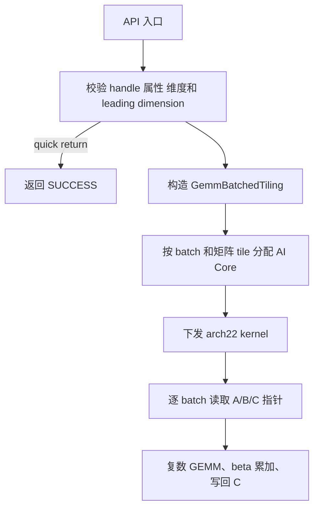

# aclblasCgemmBatched 算子设计文档

| 项目 | 内容 |
| --- | --- |
| 任务 | 算子实操工坊-广州站 `aclblasCgemmBatched`（A2/A3） |
| 作者 | lunhao2023 |
| 邮箱 | 2085127827@qq.com |
| 目标仓库 | `cann/ops-blas` |
| 目标目录 | `blas/gemm_batched/`、`test/gemm_batched/cgemm_batched/arch22/` |
| 目标产品 | Atlas 800I A2/A3（arch22） |

## 一、需求背景

`aclblasCgemmBatched` 是单精度复数的批量通用矩阵乘法接口，对标 cuBLAS
`cublasCgemmBatched`。它为每个 batch 从设备侧指针数组读取 A、B、C 矩阵，执行

```text
C[i] = alpha * op(A[i]) * op(B[i]) + beta * C[i]
```

本任务使用 Ascend C/CATLASS 实现 A2/A3 kernel，并接入 ops-blas 已有的句柄式
BLAS 调用链；公共接口沿用 `include/cann_ops_blas.h`，不增加产品私有 API。

### 1.1 需求拆解

1. 支持 complex64 的 N/T/C × N/T/C 九种转置组合和 uniform batch。
2. 支持列主序、独立设备指针数组、任意合法 leading dimension 及运行时 m/n/k。
3. 对齐 cuBLAS/Netlib 的 quick return、alpha/beta 特例和状态码语义。
4. 在 A2/A3 上提供可泛化的精度实现和满足任务书基线的性能路径。

## 二、需求分析

### 2.1 接口与数据布局

```cpp
aclblasStatus_t aclblasCgemmBatched(
    aclblasHandle_t handle, aclblasOperation_t transa,
    aclblasOperation_t transb, int m, int n, int k,
    const aclblasComplex* alpha,
    const aclblasComplex* const Aarray[], int lda,
    const aclblasComplex* const Barray[], int ldb,
    const aclblasComplex* beta,
    aclblasComplex* const Carray[], int ldc, int batchCount);
```

`aclblasComplex` 使用 `cann_ops_blas_common.h` 的定义，实部和虚部均为 float，
设备内存为 real/imag 交错的 8-byte complex64。矩阵为列主序，所有 batch 共享
m、n、k、lda、ldb、ldc 与转置属性。

### 2.2 数学语义

| 属性 | 语义 |
| --- | --- |
| `ACLBLAS_OP_N` | `X` |
| `ACLBLAS_OP_T` | `X^T`，不共轭 |
| `ACLBLAS_OP_C` | `X^H`，转置并对虚部取反 |

`transa=N` 时 A 的逻辑形状为 m×k，否则为 k×m；`transb=N` 时 B 为 k×n，
否则为 n×k；C 为 m×n。物理地址分别按 `row + col * ld{a,b,c}` 计算。复数
乘法按两个 float 分量计算，累加器保持 float32。

### 2.3 参数与边界约束

| 参数 | 合法性要求 |
| --- | --- |
| handle | 非空，否则 `ACLBLAS_STATUS_HANDLE_IS_NULLPTR` |
| transa/transb | 仅 N、T、C，否则 `ACLBLAS_STATUS_INVALID_VALUE` |
| m/n/k/batchCount | 均不小于 0，负值返回 INVALID_VALUE |
| lda | N 时 `>= max(1,m)`，T/C 时 `>= max(1,k)` |
| ldb | N 时 `>= max(1,k)`，T/C 时 `>= max(1,n)` |
| ldc | `>= max(1,m)` |
| alpha/beta | 不能为空 |
| Aarray/Barray/Carray | `batchCount>0` 时不能为空 |

`m==0`、`n==0` 或 `batchCount==0` 为合法 quick return，返回 SUCCESS 且不访问
指针数组。`k==0` 或 alpha 为 `(0,0)` 时跳过乘法，逐 batch 执行
`C[i]=beta*C[i]`；beta 为零时直接写零，为 `(1,0)` 时保留 C。beta 为零时
调用方无需初始化 C。不同 batch 的 C 矩阵不得重叠，重叠行为未定义。

## 三、总体实现方案

### 3.1 调用链

Host API 从 handle 取得 stream，完成参数校验和 tiling 构造，再通过 Ascend C
kernel 直调接口向该 stream 下发任务。设备侧指针数组由 kernel 按 batch 索引
读取，API 保持异步语义。



### 3.2 Host tiling

`GemmBatchedTilingData` 包含 m、n、k、lda、ldb、ldc、batchCount、transa/transb、
alpha/beta 分量、batch/core 分配信息和 M/N/K tile 大小，host/kernel 共用固定
宽度字段。切分优先沿 batch 均分；batch 少于可用核数时，沿 N（必要时 M）切分
同一 batch。tile 根据 UB 容量和 8-byte 元素大小计算，容纳 A、B、C 累加器和
双缓冲；尾块使用实际长度，不读取 padding。

### 3.3 Kernel

Kernel 采用 Init/Process 两阶段：Init 计算当前 core 的 batch/tile 范围并取得
矩阵基址；Process 执行以下步骤：

1. **CopyIn**：按列主序搬运 A/B tile；T/C 用对应的转置索引，C 额外对虚部取反。
2. **Compute**：以 complex64 逻辑元素做 tile 乘加，K 循环复用 tile，累加器为
   float32 分量，双缓冲重叠搬运与计算。
3. **Epilogue**：beta=0 不读 C，beta=1 直接累加，其他 beta 做一次复数缩放。
4. **CopyOut**：只写有效 M/N 区域的 C 列主序位置。

alpha=0 或 k=0 走 scale/zero 专用路径；alpha=1、beta=0 的性能场景走 fast path。
T 与 C 通过 tiling key 区分，避免在热循环中重复判断共轭。

建议 tiling key 编码 `transa*3+transb`，并以独立 bit 标记 alpha_zero、beta_zero、
beta_one。尺寸和地址始终放在 tiling data 中，未特化组合回退到通用复数路径。

## 四、目录与测试工程

```text
blas/gemm_batched/
├── CMakeLists.txt
├── op_host/gemm_batched.cpp
├── op_host/gemm_batched_tiling.h
└── arch22/gemm_batched.cpp
test/gemm_batched/cgemm_batched/arch22/
├── CMakeLists.txt
├── README.md
├── cgemm_batched_test.cpp
└── cgemm_batched_test.csv
```

Host 复用 ops-blas 的 handle、stream、状态码和公共 complex 类型，不重复声明 API。
测试由 CSV 驱动 C++ GTest，使用 Netlib/cblas 对每个 batch 单独调用 cgemm 生成
golden。

## 五、测试与验收

### 5.1 功能与精度

覆盖 N/T/C 的 9 种组合、小尺寸、非对齐尺寸、leading dimension padding、多个
batch、m/n/k 为零、alpha/beta 特殊值、非法枚举、负维度、非法 leading dimension、
空指针及 Inf/NaN。实部和虚部分别按 `rtol=2^-10`、`atol=2^-16`、匹配率 0.99、
最大绝对误差 `1e-2`（或 32 ULP）校验；alpha=0 的 scale 路径做精确校验。

任务书提供的 `cgemm_batched_test.csv`、`verify_accuracy.py` 和
`verify_performance.py` 作为基础自测入口。比较时只检查每个 C 的逻辑 m×n 区域，
不将 ldc padding 纳入结果。

### 5.2 性能

在 Atlas 800I A2（910B3）和 A3 上 warmup 后有效采样至少 50 次。N/N、
alpha=(1,0)、beta=(0,0) 的目标平均耗时（微秒）为：256³×32 不高于 342.44，
512³×16 不高于 1462.32，1024³×8 不高于 5018.64，2048³×4 不高于 18032.75。
报告记录 SoC、CANN 版本、输入布局、warmup/采样次数、精度和平均耗时。

## 六、支持硬件与限制

| 芯片 | 支持 |
| --- | --- |
| Atlas 800I A2 / A3 | 是，arch22 |

仅支持列主序、uniform batch 和 complex64；不支持广播、非连续 stride、batch
间 C 重叠或动态 shape。算子不额外申请 workspace，异步行为遵循 handle 绑定的
stream。

## 七、风险与兼容性

复数乘加的累加顺序会影响末位浮点结果，因此按任务书阈值判定而非 bit-exact。
A2/A3 的 UB 和核数差异由平台查询及 tile 计算屏蔽；公共接口、状态码和参数顺序
与现有 ops-blas 声明保持兼容，其他产品线可继续复用。

### 7.1 兼容性分析

这是 ops-blas 的新 batched GEMM 实现，不改变已有 BLAS 算子 ABI、公共类型或
句柄生命周期。由于新增实现只在 `blas/gemm_batched/` 注册，已有产品和其他
GEMM 接口不受影响；未来产品可复用 host API，并按 SoC 增加自己的 arch 目录。

### 7.2 可维可测分析

所有运行时参数均在 host 侧校验，非法输入可通过状态码单测验证；转置、边界和
特殊标量均有独立 CSV case。kernel 的 batch 分配、tile 大小和尾块均由 tiling
data 显式记录，便于在 Ascend C dump 中定位。精度采用 Netlib golden，性能采用
固定 warmup 和超过 50 次有效采样，结果可由任务书提供的 Python 脚本复现。
