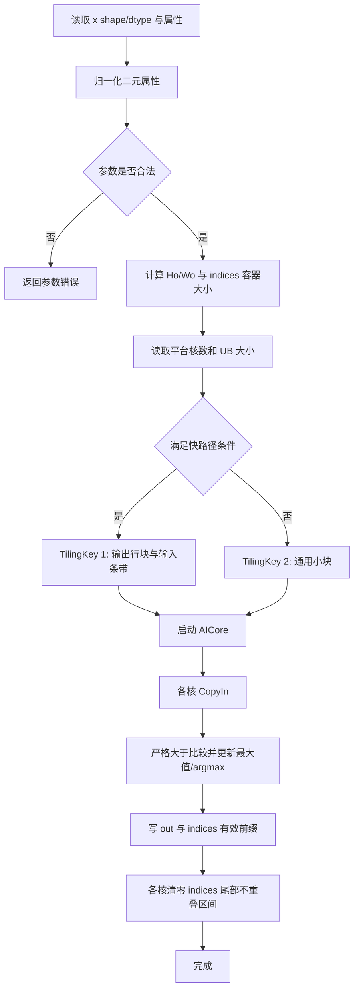

# MaxPool2dWithMask 算子设计文档

## 一、需求背景（required）

### 1.1 需求来源

通过 CANN 社区任务完成 `MaxPool2dWithMask` 算子的 Ascend C 实现，补充 `ops-nn` 在 Atlas 800T A2 与 Atlas 300V Pro 上的二维最大池化及索引输出能力。实现目录规划为 `experimental/pooling/max_pool2d_with_mask`。

### 1.2 背景介绍

`MaxPool2dWithMask` 对 NCHW/ND 输入的最后两个空间维执行二维最大池化，同时输出最大值和对应输入平面的绝对线性下标。`indices` 的逻辑数据为 `int32` argmax，但为了兼容既有接口，其物理 Tensor 类型为 `INT8`，并使用规定的四维容器承载连续索引字节流。

本任务需要支持：

- Atlas 800T A2：`FLOAT16`、`FLOAT`、`BFLOAT16`；
- Atlas 300V Pro：`FLOAT16`、`FLOAT`；
- 3 维 `C,H,W` 与 4 维 `N,C,H,W` 输入；
- `kernelSize`、`stride`、`padding` 的长度归一化；
- `ceilMode=false/true`；
- `dilation=1`；
- 确定性计算及相同最大值时选择行优先遍历遇到的第一个元素。

### 1.3 现有实现分析

既有实现可能因产品系列而选择不同的索引编码路径。设计上不依赖内置算子的 `indices` 存储细节，而是以任务给定的 golden 为准，在两个平台统一生成连续的小端 `int32` argmax 字节流，并显式清零容器尾部。内置实现仅作为数值与性能的对照基线，索引布局需单独核验。

## 二、需求分析（required）

### 2.1 需求描述

使用 Ascend C 实现泛化的 `MaxPool2dWithMask`：对每个 `(N,C)` 输入平面执行二维最大池化，将最大值写入 `out`，将最大值在原始 `H*W` 平面中的绝对下标写入 `indices` 的连续字节前缀，并将 `indices` 的剩余字节清零。

### 2.2 算子原型

| 参数名 | 输入/输出 | 描述 | 数据类型 | 数据格式 | 维度/长度 | 非连续 Tensor |
| --- | --- | --- | --- | --- | --- | --- |
| x | 输入 | 待池化 Tensor | FLOAT16、FLOAT；A2 额外支持 BFLOAT16 | NCHW、ND | 3 或 4 维 | 支持框架连续化后的输入 |
| kernelSize | 属性 | 池化窗口 | INT64 | - | 长度 1 或 2，元素大于 0 | - |
| stride | 属性 | 窗口移动步长；为空时等于 kernelSize | INT64 | - | 长度 0、1 或 2，元素大于 0 | - |
| padding | 属性 | H/W 两侧对称 padding | INT64 | - | 长度 1 或 2，`0 <= p <= kernel/2` | - |
| dilation | 属性 | 窗口内元素步幅 | INT64 | - | 长度 1 或 2，仅支持 1 | - |
| ceilMode | 属性 | 输出尺寸是否向上取整 | BOOL | - | 标量 | - |
| out | 输出 | 最大池化结果 | 与 x 一致 | NCHW、ND | 3 或 4 维 | 支持 |
| indices | 输出 | 连续小端 `int32` argmax 字节流及零填充尾部 | INT8 | NCHW、ND | 3 或 4 维容器 | 不支持 |

3 维输入按隐式 `N=1` 处理，输出恢复为 3 维；4 维输入保持 NCHW。

### 2.3 需求拆解

1. Host 侧完成输入维度解析、属性归一化、合法性校验和输出形状计算。
2. 同时支持 A2 和 310P，并根据平台 UB 容量、核数及数据类型生成 tiling。
3. Kernel 侧实现严格大于比较，保证相同最大值选择第一个位置。
4. `out` 直接写回被选中的输入值，避免额外算术导致精度损失。
5. `indices` 前 `4*N*C*Ho*Wo` 字节按输出扁平顺序保存小端 `int32` 绝对下标，其余字节全部为 0。
6. 为常用小窗口提供向量化快路径，为合法但不适合快路径的输入提供通用兜底路径。
7. 覆盖任务包全部 153 个用例，并补齐 `ceilMode=true`、长度 1/空属性、非方形参数、重复最大值和非法参数等场景。
8. A2 性能不低于 TBE 基线的 95%；310P 完成功能精度验收并满足任务书的参考性能要求。

## 三、详细设计（required）

### 3.1 算子分析

#### 3.1.1 数学公式

对四维输入，池化结果定义为：

$$
out[n,c,oh,ow] = \max_{0 \le kh < k_H,\ 0 \le kw < k_W}
x[n,c,oh\cdot s_H-p_H+kh,ow\cdot s_W-p_W+kw]
$$

仅比较坐标落在 `[0,H)` 与 `[0,W)` 内的元素。`dilation` 当前只支持 1，因此公式中未额外展开 dilation。

未修正的输出空间尺寸为：

$$
H_o=R\left(\frac{H+2p_H-d_H(k_H-1)-1}{s_H}\right)+1
$$

$$
W_o=R\left(\frac{W+2p_W-d_W(k_W-1)-1}{s_W}\right)+1
$$

其中 `ceilMode=false` 时 $R=\lfloor\cdot\rfloor$，`ceilMode=true` 时 $R=\lceil\cdot\rceil$。当向上取整后的最后一个窗口起点落入右侧或下侧 padding 时，按以下规则回退：

$$
(H_o-1)s_H \ge H+p_H \Rightarrow H_o=H_o-1
$$

$$
(W_o-1)s_W \ge W+p_W \Rightarrow W_o=W_o-1
$$

最大值的绝对空间下标为：

$$
argmax = ih\cdot W+iw
$$

令 $M=N\cdot C\cdot H_o\cdot W_o$，第 $g$ 个扁平输出元素的 `argmax` 写入 `indices` 全局扁平地址的 `[4g,4g+4)`。`indices` 容器形状为：

$$
[N,C,k_Hk_W,(\lceil H_oW_o/16\rceil+1)\cdot2\cdot16]
$$

3 维输入时去掉最前面的 N 维。

#### 3.1.2 支持数据类型

| 数据类型 | A2 | 310P | Kernel 比较类型 |
| --- | --- | --- | --- |
| FLOAT16 | √ | √ | FLOAT16 或 FLOAT32 中间比较 |
| FLOAT | √ | √ | FLOAT32 |
| BFLOAT16 | √ | × | 转 FLOAT32 比较，输出保留原 BFLOAT16 值 |

池化输出来自原始输入的选择，不进行数值运算。即使比较时使用 FLOAT32 中间类型，最终也从对应输入位置复制原始值到 `out`。

#### 3.1.3 支持形状

- 3 维：`[C,H,W]`；
- 4 维：`[N,C,H,W]`；
- 所有维度均需为正，且元素总数、输出元素数和字节偏移不得溢出 `int64`；
- 输出 `Ho`、`Wo` 必须大于 0；
- 单个 `(N,C)` 平面的绝对下标必须能由 `int32` 表示，即 `H*W <= INT32_MAX`。

### 3.2 算子实现

#### 3.2.1 Host 侧设计

Host 侧分为参数处理、形状推导、策略选择和 tiling 生成四个步骤。

**属性归一化与校验**

1. `kernelSize=[k]` 扩展为 `[k,k]`。
2. `stride=[]` 取归一化后的 `kernelSize`；`stride=[s]` 扩展为 `[s,s]`。
3. `padding=[p]`、`dilation=[d]` 分别扩展为二元组。
4. 校验长度、正值、padding 上限、`dilation=(1,1)`、输入 rank、dtype 和平台支持关系。
5. 使用 `int64` 进行输出形状和容器字节数计算，每一步做溢出检查。

**逻辑任务编号**

定义扁平输出编号：

```text
g = (((n * C + c) * Ho + oh) * Wo + ow)
```

Host 侧把 $M=N\cdot C\cdot H_o\cdot W_o$ 个输出元素划分给有效核。优先按 `(N,C,oh)` 行块切分，使同一核处理相邻 `ow`，便于连续搬运和连续写回；当 `N*C` 足够大时优先按平面切分，避免不同核读取相同输入行。

**TilingKey 规划**

| TilingKey | 场景 | 说明 |
| --- | --- | --- |
| 1 | 快路径 | `dilation=1`，窗口和输入条带可在 UB 内分块，覆盖任务热点 `2x2/3x3/7x7`、stride 1/2 |
| 2 | 通用路径 | 合法但窗口较大、边界复杂或快路径 UB 条件不满足 |

**UB 规划**

快路径需要以下局部缓冲：

- 两份输入条带缓冲，用于 double buffer；
- 最大值缓冲 `maxBuf`；
- 候选值缓冲 `candidateBuf`；
- 比较 mask 缓冲 `cmpBuf`；
- `int32` 下标缓冲 `indexBuf/candidateIndexBuf`；
- 输出搬出缓冲和尾部清零缓冲。

设单次处理 `tileOw` 个连续输出位置，则需要的输入宽度近似为：

$$
tileInputW=(tileOw-1)s_W+k_W
$$

Host 根据平台 UB 大小和 dtype 字节数，从对齐到 32 字节的候选 `tileOw` 中选择最大可用值，并为尾块记录真实长度。若连续多行可放入 UB，则一次搬入 `tileOh` 对应的输入条带以复用重叠窗口；否则退化为单输出行处理。

**分核策略**

- `blockDim=min(platformCoreNum, taskBlockCount)`；
- 大小核切分：前 `remainder` 个核多处理一个任务块；
- 单个任务块不跨 `(N,C)` 平面，避免索引基址和边界判断复杂化；
- 当输出很小时减少启动核数，降低多核调度开销。

**TilingData 主要字段**

```text
N, C, H, W, Ho, Wo
kH, kW, sH, sW, pH, pW
totalOutElements, totalIndicesBytes, validIndexBytes
blockTaskStart, blockTaskCount, tileOh, tileOw
inputTileElements, outputTileElements
dtypeKey, platformKey, tailElements
```

#### 3.2.2 Kernel 侧设计

Kernel 采用 `Init -> Process -> CopyIn -> Compute -> CopyOut` 结构。

**快路径**

1. `CopyIn` 将当前输出 tile 对应的有效输入条带搬入 UB；上下左右越界区域不从 GM 读取，通过有效范围和比较 mask 排除。
2. `Compute` 按 `kh`、`kw` 的行优先顺序遍历窗口。
3. 第一个有效候选初始化 `maxBuf` 与 `indexBuf`；后续候选使用严格 `candidate > max` 比较生成 mask。
4. 使用 `Select` 同时更新最大值与 `int32` 绝对下标。严格大于保证相同最大值不覆盖先前结果。
5. BFLOAT16 在 A2 上转 FLOAT32 进行比较；最终通过 `indexBuf` 对应位置选择原始输入值写入 `out`。
6. `CopyOut` 将连续最大值写入 `out`，并把 `indexBuf` 作为 `int32` 数据写入 `indices + 4*g`。

任务热点的窗口较小，循环次数分别为 4、9、49；候选比较在 `ow` 维向量化。stride 1/2 场景通过一次搬入连续条带复用相邻窗口数据，减少 GM 重复访问。

**通用路径**

当输入条带无法按快路径放入 UB 时，按更小的输出块甚至单个输出元素处理。对每个输出位置计算有效的 `kh/kw` 范围，分段搬入窗口并完成严格最大值归约。该路径优先保证全部合法参数的正确性，避免仅适配公开用例。

**`indices` 写入与清零**

`indices` 虽声明为 `INT8`，但有效前缀按 `int32` 访问并写入：

```text
validIndexBytes = 4 * N * C * Ho * Wo
tailBegin       = validIndexBytes
tailEnd         = totalIndicesBytes
```

Pooling 任务仅写 `[0, validIndexBytes)`；各核再按不重叠区间分担 `[tailBegin, tailEnd)` 的清零任务。有效前缀与清零尾部地址完全不重叠，因此不需要核间同步，也不会发生清零覆盖索引的竞态。头尾非 32 字节对齐部分使用安全尾块搬运。

**流水与同步**

- 输入条带采用 double buffer，使 GM 搬入与上一 tile 的向量计算重叠；
- `out` 与 `indices` 使用独立输出队列；
- UB 缓冲按 32 字节对齐；
- 只在同一 pipe 的生产/消费边界使用必要的 EnQue/DeQue，同一 tile 内避免额外同步。

### 3.3 运行流程



### 3.4 支持硬件

| 产品 | SoC 配置 | 支持 dtype |
| --- | --- | --- |
| Atlas 800T A2 | ascend910b | FLOAT16、FLOAT、BFLOAT16 |
| Atlas 300V Pro | ascend310p | FLOAT16、FLOAT |

算子定义分别注册 `ascend910b` 与 `ascend310p` 配置。Host 侧不硬编码核数和 UB 大小，均从平台信息获取。

### 3.5 算子约束限制

- `kernelSize` 长度为 1 或 2，元素大于 0；
- `stride` 长度为 0、1 或 2，元素大于 0；
- `padding` 长度为 1 或 2，且 `0 <= padding <= kernelSize/2`；
- `dilation` 长度为 1 或 2，仅支持 1；
- 输入暂不支持 NaN 和负无穷；
- `indices` 非连续输出不支持；
- 310P 不支持 BFLOAT16；
- 310P 在 `ceilMode=true` 时遵循任务书列出的推理产品 stride 限制；
- `H*W` 不得超过 `INT32_MAX`，总元素数和输出字节数不得溢出 `int64`。

## 四、可维可测分析

### 4.1 精度标准

`out` 按生态算子开源精度标准使用混合容差逐元素比较：

| dtype | rtol | atol | required matched ratio | max abs error limit |
| --- | --- | --- | --- | --- |
| FLOAT16 | 2^-9 | 2^-9 | 0.99 | 1e-1 或 32 ULP |
| BFLOAT16 | 2^-6 | 2^-6 | 0.99 | 1e0 或 32 ULP |
| FLOAT32 | 2^-10 | 2^-16 | 0.99 | 1e-2 或 32 ULP |

由于本算子的 `out` 是原输入值的选择，正常有限输入还应争取逐元素精确一致。任务包另给出 `rtol=0.001, atol=0.001`，自测同时按更严格的任务用例阈值执行。`indices` 不使用浮点容差，按完整 INT8 容器逐字节精确比较，包括有效 `int32` 前缀与全零尾部。

### 4.2 测试覆盖

任务包共 153 个用例：A2 执行全部用例；310P 执行其中 FP16/FP32 共 103 个用例，BF16 明确标记为平台不支持。

补充测试覆盖：

- 3D/4D、FP16/FP32/BF16 与 ND/NCHW；
- kernel/stride/padding/dilation 长度 1，stride 为空；
- `ceilMode=true/false` 及最后窗口回退；
- 非方形窗口、步长和 padding；
- 重复最大值时首元素索引；
- 尾块不足 16、输出不足一个 data block、较大输出；
- 非连续 `out`；
- 非法属性、310P BF16、NaN/-Inf 和非连续 `indices` 的负向校验。

### 4.3 性能标准与验证方法

- A2：同环境、同输入、同卡比较 TBE/内置基线与 Ascend C 实现，性能达到基线的 95% 以上；
- 小 shape：若绝对耗时低于 100us 但相对差距超过 30%，提供流水和 Simulation 分析；
- 310P：完成精度验收，耗时以 A2 的 5 倍为参考；超过参考 30% 的 shape 给出平台带宽、核数、指令或切分差异分析；
- 每组数据先预热，再重复执行，记录最小值、中位数和波动；测试前记录卡上其他进程；
- 性能用例覆盖公开 shape 的小、中、大规模，并单独统计 `2x2`、`3x3`、`7x7` 三类窗口。

性能优化重点：

1. `(N,C,oh)` 行块分核，保证 GM 连续访问；
2. 输入条带复用相邻窗口重叠数据；
3. `ow` 维向量比较与选择；
4. double buffer 隐藏 GM 搬入时延；
5. 输出很小时减少 blockDim；
6. `out`、索引前缀与尾部清零使用互不重叠的批量搬运。

### 4.4 可维护性

- Host 属性归一化、形状计算、溢出校验拆分为独立函数并配置单元测试；
- 快路径和通用路径共享下标定义及边界规则，防止语义分叉；
- tiling 字段使用明确的单位后缀或注释区分元素数与字节数；
- 平台差异仅集中在算子注册、dtype 开关和平台 tiling 参数中；
- 日志输出 tilingKey、blockDim、tile 大小和关键形状，便于问题定位。

### 4.5 兼容性分析

本算子作为 `experimental/pooling/max_pool2d_with_mask` 新增，不修改现有生产目录实现，不影响已有算子 ABI。对 A2 与 310P 统一采用任务规定的连续 `int32` argmax 字节语义，消除两个平台内置路径的 `indices` 行为差异。后续从 experimental 转正时，可在保持 op 原型和输出布局不变的前提下继续增加专用 tiling 或优化 kernel。
