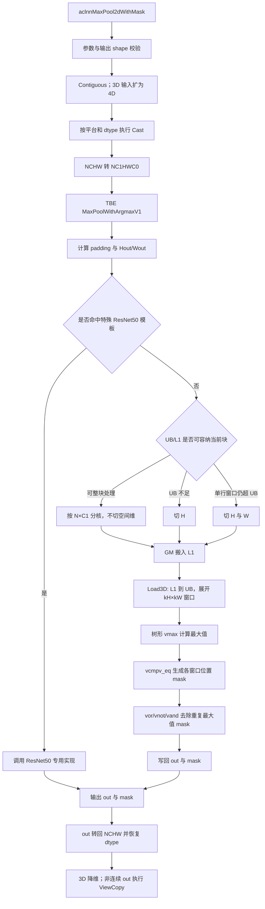
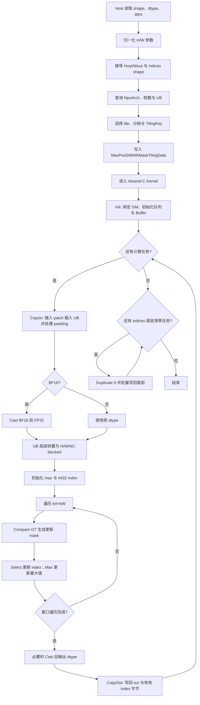

# MaxPool2dWithMask 算子设计文档

## 1. 需求背景（required）

### 1.1 需求来源

本任务来自 2026 年 9 月 CANN 社区任务。目标是在 `ops-nn` 开源仓中，基于 Ascend C 实现与 `aclnnMaxPool2dWithMask` 功能一致的 `MaxPool2dWithMask` 算子，支持泛化 shape、3D/4D 输入、`ceilMode`、padding 和 mask/indices 输出，并以原 TBE 实现作为功能与性能基线。

设计依据如下：

- 任务书：`MaxPool2dWithMask_task_doc.md`；
- 算子原型：`max_pool2d_with_mask_op.json`；
- 随任务提供的 153 个用例：`max_pool2d_with_mask_cases.json`；
- 随任务提供的参考真值：`max_pool2d_with_mask_golden_func.py`；
- 官方接口说明：[aclnnMaxPool2dWithMask](https://www.hiascend.com/document/detail/zh/CANNCommunityEdition/latest/API/aolapi/context/ops-nn/aclnnMaxPool2dWithMask.md)；
- 原 TBE 实现：`/usr/local/Ascend/ascend-toolkit/latest/opp/built-in/op_impl/ai_core/tbe/impl/ops_legacy/max_pool_with_argmaxv1.py`；
- 当前 ACLNN 适配链路：`pooling/max_pool3d_with_argmax_v2/op_api/aclnn_max_pool2d_with_indices.cpp`；
- 当前内部算子原型：`pooling/max_pool3d_with_argmax_v2/op_graph/max_pool_with_argmax_v1_proto.h`。

### 1.2 背景介绍

#### 1.2.1 算子功能

`MaxPool2dWithMask` 对输入张量的每个通道独立执行二维最大池化，输出池化最大值 `out` 和记录最大值位置的 `indices`。输入支持 `[C,H,W]` 和 `[N,C,H,W]`；3D 输入在内部等价为 `N=1` 的 4D 输入。

对输出位置 `(n,c,oh,ow)`，窗口左上角为：

$$
h_{start}=oh\times s_H-p_H,\qquad w_{start}=ow\times s_W-p_W
$$

窗口内合法输入位置为：

$$
ih=h_{start}+kh\times d_H,\qquad iw=w_{start}+kw\times d_W
$$

其中 `0≤kh<kH`、`0≤kw<kW`，且仅当 `0≤ih<H`、`0≤iw<W` 时参与最大值比较；越界位置按负无穷处理。

#### 1.2.2 原 TBE/ACLNN 实现现状

历史 TBE 路径的主要执行链路为：

1. 将非连续输入转换为连续 Tensor；
2. 3D 输入先扩为 4D；
3. 根据平台和 dtype 执行必要的 Cast；
4. 将 NCHW 转为 NC1HWC0；
5. 调用 TBE `MaxPoolWithArgmaxV1`；
6. 将 `out` 从 NC1HWC0 转回 NCHW，并 Cast 回原 dtype；
7. `indices` 使用 TBE 生成的自定义 one-hot mask 存储；
8. 3D 输出降维，非连续 `out` 通过 `ViewCopy` 写回。

TBE 核心实现仅直接处理 NC1HWC0/FP16 路径。它先按 UB、L1 容量决定不切分、切 H 或同时切 H/W，再通过 `Load3D` 将滑窗展开到 UB，使用树形 `vmax` 求最大值，使用 `vcmpv_eq` 生成窗口位置 mask，并用 `vor/vnot/vand` 消除重复最大值对应的后续 mask，以保证相同最大值时选择第一个位置。

当前 `ops-nn` 的 A2 ACLNN 代码对非 `1×1` 窗口还存在一条经 `MaxPool3DWithArgmaxV2` 生成 int32 argmax、再直接复用 `indices` 存储地址的分支。任务附件中的 golden 与该分支的字节布局一致；本节流程图专门描述任务要求对比的原 TBE 路径。

#### 1.2.3 TBE 实现流程图



#### 1.2.4 现有链路的优化空间

- NCHW 与 NC1HWC0 之间的格式转换会增加额外搬运和 workspace；
- FP32/BF16 在部分平台需要经过 Cast，可能增加开销；
- TBE 调度隐藏了分核和 UB 切分细节，不利于针对常见 `2×2/3×3/7×7` 窗口做显式特化；
- 小 shape 下，格式转换和多算子调度的固定开销占比高；
- 新 Ascend C 实现可以直接在 ND/NCHW 上完成池化和索引生成，减少中间格式转换。

当前公开 ACLNN 文档和源码中，310P 的 mask 接口仅登记 FLOAT；任务附件的原型同时列出 FLOAT16/FLOAT/BFLOAT16，并只明确 BFLOAT16 限 A2。因此本设计按任务附件在 310P 登记 FLOAT16 与 FLOAT，在 A2 登记三种 dtype；这是相对当前 ACLNN 注册表的明确扩展点。

### 1.3 契约基线与提交前确认项

官方接口将 `indices` 描述为“自定义 mask 值”，历史 TBE 实现生成的是按窗口位置展开的 one-hot bit mask。任务书及随任务提供的 golden 则进一步指定为“int32 argmax 的 INT8 字节容器”。本设计以任务附件和当前 A2 ACLNN 分支作为本次社区验收基线，采用以下语义：

- 每个 `(n,c,oh,ow)` 生成一个相对于该通道输入平面的绝对索引 `ih*W+iw`；
- 索引类型为 `int32`，按小端字节序写入 `indices` 的 INT8 存储；
- int32 索引按 `N,C,Hout,Wout` 顺序展平，其全部字节连续写入整个 `indices` 容器的起始区域；“每通道独立”指索引值均以各自通道的 `H×W` 平面为原点，不表示每通道字节流分别从 `[n,c,...]` 切片起始处写入；
- 相同最大值按 `kh`、`kw` 行优先顺序选择第一个位置；
- 容器中未承载有效 int32 索引的区域写 0。

容器容量必须满足：

$$
N\times C\times k_H\times k_W\times maskW \ge 4\times N\times C\times H_{out}\times W_{out}
$$

约去 `N×C` 后即 `kH*kW*maskW >= 4*Hout*Wout`。`kH*kW≥2` 时该式恒成立；`1×1` 窗口并不总成立，例如 `Hout*Wout≥25` 的部分 shape 已无法容纳完整 int32 字节流。

> **提交前必须确认**：任务属性允许 `1×1` 窗口，但既定 mask shape 在部分 `1×1` shape 下无法承载每个输出一个 int32 的 argmax，且当前 ACLNN 的 `1×1` 分支仍走历史 one-hot mask 语义。任务方需明确是限制此类 shape、调整 `indices` shape，还是为 `1×1` 保留历史 mask 语义。在确认前，Host 必须执行容量校验，禁止越界写入。

## 2. 需求分析（required）

### 2.1 需求描述

使用 Ascend C 实现 `MaxPool2dWithMask`，功能覆盖原接口合法输入场景，并满足：

1. 支持 3D `[C,H,W]` 和 4D `[N,C,H,W]`；
2. 支持 FLOAT16、FLOAT，Atlas 800T A2 额外支持 BFLOAT16；
3. `kernelSize/stride/padding/dilation` 支持长度 1 或 2，其中 `stride` 额外支持空数组并回退为 `kernelSize`；
4. `dilation` 当前仅支持 1；
5. 支持 `ceilMode=false/true`；
6. `out` 与输入 dtype 和逻辑格式一致；
7. `indices` 为 INT8 容器，shape 和存储语义与任务约定一致；
8. 默认确定性计算；
9. Atlas 800T A2 性能不低于 TBE 的 95%；Atlas 300V Pro 按任务书基准验收。

### 2.2 外部组件依赖

| 外部依赖 | 使用位置 | 作用 |
| --- | --- | --- |
| GE/GERT 注册与推导接口 | Host 侧 | 算子定义、InferShape、InferDataType、Tiling 注册 |
| `PlatformAscendC` | Host 侧 | 运行时获取 NPU 架构、与 kernel 类型匹配的核数、UB 容量 |
| Ascend C Kernel API | Kernel 侧 | `GlobalTensor`、`TPipe`、`TQue`、`TBuf`、`DataCopyPad`、`Compare`、`Select`、`Max`、`Cast` |
| ACLNN 两段式接口 | API 层 | 参数校验、连续化、非连续输出回写、workspace 与执行器管理 |
| 原 TBE 实现 | 设计基线 | 核对 padding、ceil、tie、mask 与性能基准 |

### 2.3 内部适配模块

| 模块 | 建议文件 | 职责 |
| --- | --- | --- |
| 算子原型 | `op_graph/max_pool2d_with_mask_proto.h` | 定义输入、输出、属性与约束 |
| Host 定义 | `op_host/max_pool2d_with_mask_def.cpp` | 注册 A2/310P dtype、format 与 kernel 配置 |
| Shape 推导 | `op_host/max_pool2d_with_mask_infershape.cpp` | 推导 `out` 与 `indices` shape |
| Tiling | `op_host/max_pool2d_with_mask_tiling.cpp` | 参数归一化、分核、UB 规划、TilingKey 选择 |
| Tiling 数据 | `op_host/max_pool2d_with_mask_tiling.h` | 定义 Host/Kernel 共享的 TilingData |
| Kernel | `op_kernel/max_pool2d_with_mask.cpp/.h` | 完成直接 NCHW 最大池化与索引写出 |
| ACLNN 适配 | 复用现有 API 层或新增适配 | 处理非连续 Tensor、3D/4D 视图和两段式接口 |

### 2.4 需求拆解

1. **接口层**：对齐 ACLNN 两段式原型及任务 JSON 中的内部算子原型；
2. **Host 侧**：完成属性归一化、参数校验、shape 推导、平台识别、分核和 UB 切分；
3. **Kernel 侧**：直接处理 NCHW/ND，输出最大值与确定性 argmax；
4. **泛化**：常见窗口走特化路径，其他合法窗口走通用路径；
5. **可维护性**：TilingData 字段语义单一，禁止硬编码核数或 UB 容量；
6. **可测试性**：最大值输出与索引容器分别验证，补足任务用例未覆盖的 `ceilMode=true` 等场景。

## 3. 详细设计（required）

### 3.1 算子分析

#### 3.1.1 对外 ACLNN 函数原型

```cpp
aclnnStatus aclnnMaxPool2dWithMaskGetWorkspaceSize(
    const aclTensor   *self,
    const aclIntArray *kernelSize,
    const aclIntArray *stride,
    const aclIntArray *padding,
    const aclIntArray *dilation,
    bool               ceilMode,
    aclTensor         *out,
    aclTensor         *indices,
    uint64_t          *workspaceSize,
    aclOpExecutor     **executor);

aclnnStatus aclnnMaxPool2dWithMask(
    void          *workspace,
    uint64_t       workspaceSize,
    aclOpExecutor *executor,
    aclrtStream    stream);
```

#### 3.1.2 内部 Ascend C 算子原型

内部算子名和属性名以任务提供的 `max_pool2d_with_mask_op.json` 为准：

```cpp
REG_OP(MaxPool2dWithMask)
    .INPUT(x, TensorType({DT_FLOAT16, DT_FLOAT, DT_BF16}))
    .OUTPUT(out, TensorType({DT_FLOAT16, DT_FLOAT, DT_BF16}))
    .OUTPUT(indices, TensorType({DT_INT8}))
    .REQUIRED_ATTR(kernelSize, ListInt)
    .REQUIRED_ATTR(stride, ListInt)
    .REQUIRED_ATTR(padding, ListInt)
    .REQUIRED_ATTR(dilation, ListInt)
    .ATTR(ceilMode, Bool, false)
    .OP_END_FACTORY_REG(MaxPool2dWithMask)
```

Kernel 入口设计为：

```cpp
extern "C" __global__ __aicore__ void max_pool2d_with_mask(
    GM_ADDR x,
    GM_ADDR out,
    GM_ADDR indices,
    GM_ADDR workspace,
    GM_ADDR tiling);
```

#### 3.1.3 输入、输出与属性

| 名称 | 类别 | dtype | format | shape/取值 | 说明 |
| --- | --- | --- | --- | --- | --- |
| `x/self` | 输入 | FLOAT16/FLOAT/BFLOAT16 | 3D ND；4D NCHW | `[C,H,W]` 或 `[N,C,H,W]` | 待池化张量 |
| `kernelSize` | 属性 | LIST_INT | - | 长度 1/2，值 > 0 | 池化窗口；长度 1 时复制到 H/W |
| `stride` | 属性 | LIST_INT | - | 长度 0/1/2，值 > 0 | 空数组时等于 `kernelSize` |
| `padding` | 属性 | LIST_INT | - | 长度 1/2，`0≤p≤k/2` | H/W 两侧对称 padding |
| `dilation` | 属性 | LIST_INT | - | 长度 1/2，当前仅为 1 | 窗口内采样间隔 |
| `ceilMode` | 属性 | BOOL | - | false/true | 输出 shape 使用 floor/ceil |
| `out` | 输出 | 与输入一致 | 与输入一致 | `[C,Ho,Wo]` 或 `[N,C,Ho,Wo]` | 最大池化结果 |
| `indices` | 输出 | INT8 | 与输入逻辑维数一致 | 见下文 | int32 argmax 的字节容器 |

#### 3.1.4 属性归一化

Host 侧统一将列表属性解析为 H/W 二元组：

```text
pair([a])    = (a, a)
pair([a,b])  = (a, b)
stride([])   = kernelSize
```

得到 `kH/kW`、`sH/sW`、`pH/pW`、`dH/dW`。3D 输入统一映射为 `N=1`，Kernel 内使用相同的 4D 坐标计算，输出时恢复 3D 逻辑 shape。

#### 3.1.5 输出 shape 计算

有效窗口大小：

$$
kH_{eff}=d_H\times(k_H-1)+1,\qquad kW_{eff}=d_W\times(k_W-1)+1
$$

`ceilMode=false`：

$$
H_{out}=\left\lfloor\frac{H+2p_H-kH_{eff}}{s_H}\right\rfloor+1
$$

$$
W_{out}=\left\lfloor\frac{W+2p_W-kW_{eff}}{s_W}\right\rfloor+1
$$

`ceilMode=true`：

$$
H_{out}=\left\lceil\frac{H+2p_H-kH_{eff}}{s_H}\right\rceil+1
$$

$$
W_{out}=\left\lceil\frac{W+2p_W-kW_{eff}}{s_W}\right\rceil+1
$$

为与 PyTorch/TBE 边界语义一致，ceil 后需执行末窗修正：

```text
if ((Hout - 1) * sH >= H + pH) Hout--;
if ((Wout - 1) * sW >= W + pW) Wout--;
```

`indices` 的逻辑 shape 为：

$$
maskW=\left(\left\lceil\frac{H_{out}W_{out}}{16}\right\rceil+1\right)\times2\times16
$$

```text
4D: [N, C, kH*kW, maskW]
3D: [C, kH*kW, maskW]
```

#### 3.1.6 最大值与索引语义

对每个输出位置，按 `(kh,kw)` 行优先遍历合法窗口元素：

```text
best = -INF
bestIndex = 0
for kh in [0, kH):
  for kw in [0, kW):
    ih = oh*sH - pH + kh*dH
    iw = ow*sW - pW + kw*dW
    if valid(ih, iw) and x[ih,iw] > best:
      best = x[ih,iw]
      bestIndex = ih*W + iw
```

使用严格 `>` 更新可保证相同最大值时保留行优先的第一个位置。任务约束不支持 NaN 和 `-Inf`，因此 padding 的 `-Inf` 不会与合法输入产生歧义。

按任务 golden 的全局连续语义，容器存储布局为：

```text
totalContainerBytes = N * C * kH * kW * maskW
totalValidBytes     = N * C * Hout * Wout * sizeof(int32_t)

indicesFlat[0 : totalValidBytes]
    = little_endian_int32(bestIndex.reshape(N,C,Hout,Wout).flatten())
indicesFlat[totalValidBytes : totalContainerBytes] = 0
```

其中每个 `bestIndex[n,c,...]` 仍只以本通道输入平面为基准计算 `ih*W+iw`。

### 3.2 实现方案

#### 3.2.1 Host 侧设计

##### 3.2.1.1 参数校验与 shape 推导

Host 侧依次完成：

1. 校验输入输出指针、rank、dtype、format；
2. 校验输入为 3D/4D，C/H/W 均大于 0；
3. 归一化 `kernelSize/stride/padding/dilation`；
4. 校验窗口、步长大于 0，`0≤padding≤kernelSize/2`，`dilation=1`；
5. 推导 `Hout/Wout`，执行 ceil 末窗修正，并校验输出维度大于 0；
6. 校验 `out` 与 `indices` 的 dtype、format、shape；
7. 以 64 位整数校验 `4*N*C*Hout*Wout <= indicesStorageBytes`，容量不足时返回参数错误，等待第 1.3 节契约确认后再按最终约定调整；
8. 对动态 shape 在运行时重新计算 TilingData。

非连续输入由 ACLNN 层先执行 `Contiguous`；非连续 `out` 由 ACLNN 层在 Kernel 输出连续结果后执行 `ViewCopy`。Kernel 不逐元素解析外部 stride，从而保留批量搬运能力。

##### 3.2.1.2 平台参数获取

禁止硬编码核数和 UB 容量。Host 侧通过 `PlatformAscendC` 获取：

- 当前 `NpuArch`；
- 与注册 kernel 类型匹配的可用核数：Vector-only 路径优先 `GetCoreNumAiv()`；若 310P 构建注册为 AI Core，则使用 `GetCoreNumAic()`/`GetCoreNum()`；获取后必须校验非 0；
- `GetCoreMemSize(CoreMemType::UB)` 返回的实际可用 UB；
- 需要时获取 L1 容量与系统 workspace 信息。

典型值仅用于解释设计：DAV_2201（A2）UB 为 192 KB，DAV_2002（310P）UB 为 256 KB；实际 Tiling 始终使用运行时查询值。

##### 3.2.1.3 分核策略

计算任务以连续 NC 平面组和输出 H 块 `(ncTile,ohTile)` 为基本单元：

```text
ncTiles        = ceil((N * C) / tileNC)
tilesPerPlane = ceil(Hout / tileOH)
computeTaskNum = ncTiles * tilesPerPlane
blockDim       = min(coreNum, computeTaskNum + zeroTaskNum)
```

- 优先沿 `N*C` 分核，保证不同通道完全独立且 GM 访问连续；
- 当 `N*C` 小于可用核数时，再沿输出 H 切分，提高大空间 shape 的并行度；
- 同一计算任务负责连续的输出行，输入 patch 包含窗口重叠区域；
- `indices` 有效头部按 `N,C,Hout,Wout` 的全局线性区间由计算任务写入；
- 整个容器 `[totalValidBytes,totalContainerBytes)` 的无效尾部作为独立 `zeroTask` 分段清零，且与有效头部地址不重叠，不需要跨核同步；
- 任务按商和余数分配给各核，前 `remainder` 个核多处理一个任务，避免大小核数据越界。

##### 3.2.1.4 UB 切分策略

定义：

```text
inputTileH = (tileOH - 1) * sH + kHeff
inputTileW = (tileOW - 1) * sW + kWeff
inPitch    = align_up(inputTileW * sizeof(Tcalc), 32)
outElems   = tileNC * tileOH * tileOW
vecElems   = align_up(outElems * sizeof(Tcalc), 256) / sizeof(Tcalc)
maxBytes   = align_up(vecElems * sizeof(Tcalc), 32)
idxBytes   = align_up(vecElems * sizeof(int32_t), 32)
maskBytes  = align_up(ceil(vecElems / 8), 32)
```

其中 `Tcalc` 为 Kernel 比较类型：FP32/FP16 走原类型；BF16 在 UB 中无损转换为 FP32 比较，结果再转回 BF16。`vecElems` 为使用 count 模式 Vector API 时的 256B 对齐长度；使用 mask/repeat 模式时只处理有效 lane，并为最后一个 repeat 提供 tail mask。Host 从较大的 `tileOH/tileOW/tileNC` 开始搜索，直到以下预算不超过实际 UB 减去安全预留：

```text
totalUB = 2 * inputQueueBytes
        + inputTransposeBytes
        + maxBytes
        + bestIndexBytes
        + candidateIndexBytes
        + 2 * outQueueBytes
        + 2 * indexQueueBytes
        + compareMaskBytes
        + validMaskBytes
        + zeroBufferBytes
```

所有项均按实际 dtype 和对齐后尺寸计入，禁止仅统计队列而遗漏常驻的最大值、最优索引等工作区。所有 UB 起始地址按 32 字节对齐；优先按 64 字节 pitch 组织多行搬运，以提高 DMA 突发效率。主体对齐块使用 `DataCopy`，非对齐行和尾块使用 `DataCopyPad`。

##### 3.2.1.5 Buffer 规划

| Buffer | 类型 | 数量 | 用途 | 复用关系 |
| --- | --- | ---: | --- | --- |
| `xQueue` | `TQue<VECIN>` | 2 | GM→UB 输入 patch，Double Buffer | - |
| `xCalcBuf` | `TBuf<VECCALC>` | 1 | BF16→FP32，并将 NCHW patch 局部转置为 H/W/NC-blocked 计算布局 | 计算完成后可复用为零填充缓冲 |
| `outQueue` | `TQue<VECOUT>` | 2 | 最大值输出，Double Buffer | - |
| `idxQueue` | `TQue<VECOUT>` | 2 | int32 索引输出，Double Buffer | - |
| `maxBuf` | `TBuf<VECCALC>` | 1 | 当前 tile 最大值 | 计算完成后作为输出转置源 |
| `idxBuf` | `TBuf<VECCALC>` | 1 | 当前最优 int32 索引 | - |
| `idxUpdateBuf` | `TBuf<VECCALC>` | 1 | 当前窗口位置的候选索引 | 可与转置临时区复用 |
| `cmpGtBuf` | `TBuf<VECCALC>` | 1 | 严格大于比较 mask | - |
| `validMaskBuf` | `TBuf<VECCALC>` | 1 | padding/尾块有效元素 mask | 无 padding 路径不分配 |

三条 TQue 均使用 `depth=1`，并由 `InitBuffer(..., 2, size)` 开启 Double Buffer；共占用 6 个 queue buffer/event 配额，未超过 A2/310P 的 8 个上限。TBuf 不参与 EnQue/DeQue。

##### 3.2.1.6 TilingKey 规划

| TilingKey | 场景 | 策略 |
| ---: | --- | --- |
| 1 | `kH=kW=1`、无 padding且容器容量校验通过 | 直接搬运值并生成线性索引；其他 `1×1` shape 在契约确认前报错 |
| 2 | 常见小窗口、无 padding | `2×2/3×3/7×7` 编译期展开，省略边界判断 |
| 3 | 常见小窗口、有 padding 或 ceil 尾窗 | 编译期展开，增加有效区 mask |
| 4 | 其他合法窗口、无 padding | 通用 `kh/kw` 循环 |
| 5 | 其他合法窗口、有 padding 或 ceil 尾窗 | 通用循环与边界 mask |

dtype 由构建系统生成的 `DTYPE_X/ORIG_DTYPE_X` 编译期宏选择，不在运行时重复分支。A2 与 310P 使用相同语义，tile 大小和核数由平台查询结果决定。

##### 3.2.1.7 TilingData 设计

| 字段组 | 主要字段 | 说明 |
| --- | --- | --- |
| 输入 shape | `n,c,h,w,is3D` | 统一后的 4D 信息 |
| 窗口属性 | `kH,kW,sH,sW,pH,pW,dH,dW,ceilMode` | 归一化后的属性 |
| 输出 shape | `hOut,wOut,maskW,totalContainerBytes,totalValidBytes` | 输出与全局字节流布局 |
| 分核 | `blockDim,computeTaskNum,zeroTaskNum,tasksPerCore,tailTasks` | 核间任务分配 |
| 单 tile | `tileNC,tileOH,tileOW,inputTileH,inputTileW` | 核内切分 |
| Buffer | `inputQueueBytes,inputTransposeBytes,maxBytes,bestIndexBytes,candidateIndexBytes,outQueueBytes,indexQueueBytes,compareMaskBytes,validMaskBytes` | 完整 UB 初始化参数 |
| 尾块 | `tailOH,tailOW,lastTaskElems,zeroTailBytes` | 非整除场景 |
| 平台 | `npuArch,ubSize` | 调试与架构分支依据，不硬编码 |

#### 3.2.2 Kernel 侧设计

##### 3.2.2.1 Init 阶段

1. 从 TilingData 读取 shape、窗口、分核和 Buffer 参数；
2. 绑定 `x/out/indices` 的 `GlobalTensor`；
3. 根据 `block_idx` 计算本核的计算任务和清零任务区间；
4. 初始化 `TPipe`、输入/输出双缓冲队列和计算 Buffer；
5. BF16 路径将 `Tcalc` 设为 FP32，其余路径使用原 dtype。

##### 3.2.2.2 CopyIn 阶段

1. 根据 `(ncStart,ohStart,owStart)` 计算连续 `tileNC` 个平面的输入 patch 有效 H/W 范围；
2. 对无 padding 的完整对齐块使用批量 `DataCopy`；
3. 对非对齐、边界或尾块使用 `DataCopyPadExtParams`；
4. padding 区填充 dtype 对应负无穷；
5. BF16 路径先在 UB 内无损 Cast 为 FP32；
6. 将若干连续 `(n,c)` 平面的 patch 搬入后，在 UB 内通过 `TransDataTo5HD`/等价 16×16 局部转置形成 `[inputTileH,inputTileW,ncAlign]` 布局；这只是 UB 内部计算重排，不产生 GM 级 NC1HWC0 中间张量；
7. 多行输入尽量使用一次二维搬运，避免逐元素 `GlobalTensor::GetValue`；
8. `EnQue/DeQue` 保证 MTE2→Vector 的同步，并通过 Double Buffer 与上一 tile 的计算重叠。

##### 3.2.2.3 Compute 阶段

Kernel 在 UB 中将候选值按“NC-blocked、输出 W 为 repeat”组织。UB 局部转置后，同一空间位置的 `tileNC` 个通道位于连续 lane；对固定 `(kh,kw)`，相邻输出 W 的候选起点间隔为 `sW*ncAlign`，可由 Vector API 的 repeat stride 表达。这样无需对 GM 做逐元素或列方向 strided 搬运。

若 repeat stride 超过 `uint8_t` 可表达的 255，Host 缩小 `tileNC/tileOW`；仍无法表达时 Kernel 将 `tileOW` 拆为单 repeat 循环。`tileOH/tileOW` 对应的 repeat 总数超过 255 时也分批调用。计算流程为：

1. 使用第一个合法窗口位置初始化 `maxBuf` 和 `idxBuf`；
2. 对后续窗口位置构造绝对索引 `ih*W+iw`；
3. `Compare(CMPMODE::GT)` 得到严格大于 mask；
4. `Select` 在 mask 为真时更新 `idxBuf`；
5. `Max` 更新 `maxBuf`；
6. padding 路径将无效位置从比较 mask 中清除；
7. BF16 路径在 FP32 中比较，写回前 Cast 为 BF16；该转换对来自 BF16 输入的最大值是无损的；
8. 同一 Vector pipe 内的依赖使用细粒度 `PipeBarrier<PIPE_V>`，跨 MTE/Vector 阶段由队列事件同步。

##### 3.2.2.4 CopyOut 与容器清零

- 将 NC-blocked 的 `maxBuf/idxBuf` 在 UB 内转回 `[tileNC,tileOH,tileOW]` 顺序，再分别进入 `outQueue/idxQueue`；
- `out` 按 NCHW 连续空间使用 `DataCopy/DataCopyPad` 写回；
- `idxBuf<int32_t>` 直接重解释为 INT8 字节，按 `N,C,Hout,Wout` 的全局线性偏移写入整个容器的有效头部；OH/OW 分块造成的非连续段通过多 block DMA 或分段 `DataCopyPad` 写出；
- `zeroTask` 仅覆盖整个容器 `[totalValidBytes,totalContainerBytes)`，不覆盖计算任务写入的有效区域；
- 非连续 `out` 由 ACLNN 层 `ViewCopy` 完成，`indices` 不支持非连续 Tensor。

##### 3.2.2.5 API 边界约束

- `DataCopyPad` 统一使用 `DataCopyExtParams`/`DataCopyPadExtParams<T>`；`blockLen` 单位为字节，`blockCount≤4095`、`blockLen≤2097151`，超限时分批；
- GM↔UB 的 UB 侧起始地址始终 32B 对齐；仅在长度严格 32B 对齐时使用 `DataCopy`；
- `Compare` 的 count 模式按 256B 补齐，补齐 lane 置为负无穷并由有效 mask 隔离；mask/repeat 模式显式处理 tail；
- `Max/Select/Compare` 等 repeat 参数均限制在 255 以内，超过时分批；repeat stride 也在 `uint8_t` 范围内；
- 生产路径不使用 `GlobalTensor::GetValue/SetValue`；所有 GM 偏移、shape 乘积和字节长度使用 64 位整数。

##### 3.2.2.6 Ascend C 实现流程图



##### 3.2.2.7 Ascend C 与 TBE 流程差异

| 差异点 | TBE 实现 | Ascend C 设计 | 原因 |
| --- | --- | --- | --- |
| 计算格式 | GM 级先转 NC1HWC0 | 外部保持 ND/NCHW，仅在 UB 内做小块 NC-blocked 重排 | 减少 GM TransData 和 workspace 开销，同时让 stride>1 的候选可向量化 |
| 调度 | TIK/TBE 内部按 UB/L1 隐式组织 | Host 显式分核、UB 切分 | 便于平台泛化和可维护性 |
| 空间切分 | 不切、切 H、切 H/W | 按 `(N,C,OH tile)` 统一任务化 | 直接匹配 NCHW 通道独立语义 |
| 最大值计算 | Load3D + 树形 `vmax` | 候选向量 `Compare+Select+Max` | 同步维护最大值和 int32 索引 |
| 索引输出 | 历史 TBE one-hot bit mask | 任务约定的全局连续 int32 argmax 字节流 | 以任务 golden 与当前 A2 ACLNN 分支为准 |
| tie 处理 | 比较后去重 mask | 严格 `GT`，保留首次最大值 | 语义相同，逻辑更直接 |
| BF16 | ACLNN 前后 Cast | Kernel UB 内无损升为 FP32 比较 | 避免额外算子调度 |
| 非对齐搬运 | TIK `data_move`/Load3D | `DataCopyPad` + 对齐快路径 | 覆盖任意 W 和尾块 |

### 3.3 支持硬件

| 支持的芯片版本 | FLOAT16 | FLOAT | BFLOAT16 |
| --- | :---: | :---: | :---: |
| Atlas 800T A2 | √ | √ | √ |
| Atlas 300V Pro（Ascend 310P） | √ | √ | × |

### 3.4 算子约束限制

1. 输入仅支持 3D/4D；
2. 3D 使用 ND，4D 使用 NCHW；
3. `kernelSize` 长度为 1/2，元素均大于 0；
4. `stride` 长度为 0/1/2，空数组时等于 `kernelSize`；
5. `padding` 长度为 1/2，满足 `0≤padding[i]≤kernelSize[i]/2`；
6. `dilation` 长度为 1/2，当前仅支持 1；
7. 输入不支持 NaN、`-Inf`；
8. `out` dtype/format/shape 必须与推导结果一致；
9. `indices` dtype 必须为 INT8，shape 必须与推导结果一致，且不支持非连续 Tensor；
10. 在任务方明确 `1×1` 契约前，int32 有效字节数不得超过 `indices` 容器总字节数；
11. Atlas 推理系列在 `ceilMode=true` 时保留任务书列出的 stride 限制；
12. 所有 shape 乘法、字节偏移和容器大小使用 64 位无符号整数计算，并检查溢出。

## 4. 特性交叉分析

| 特性 | 设计处理 |
| --- | --- |
| 3D/4D | 3D 内部增加 N=1，输出恢复 3D |
| 动态 shape | Host 运行时重新推导 shape 与 TilingData |
| dtype | FP16/FP32；A2 额外 BF16→FP32 比较 |
| 列表长度 1/2 | Host 归一化为 H/W 二元组 |
| 空 stride | 回退为 `kernelSize` |
| padding | CopyIn 填 `-Inf`，Compute 使用有效 mask |
| ceilMode | ceil 公式后执行末窗修正 |
| 相同最大值 | 严格 GT 更新，选择行优先第一个位置 |
| 非连续 Tensor | ACLNN 层 Contiguous/ViewCopy；Kernel 处理连续张量 |
| 确定性 | 每个输出仅由一个任务写入，无原子操作和跨核归约 |
| 小 shape | k=1/常见小窗口专用 TilingKey，减少通用循环开销 |
| 大 shape | 沿 N×C×OH tile 多核切分，输入/输出双缓冲 |
| 非 32B 对齐 | 主体走对齐快路径，边界走 `DataCopyPad` |

## 5. 可维可测分析

### 5.1 精度标准/性能标准

| 验收标准 | 设计目标 | 标准来源 |
| --- | --- | --- |
| `out` 精度 | 最大值来自输入，不做算术；目标为与 CPU golden 逐元素一致 | 生态算子开源精度标准、任务书 |
| `indices` 精度 | 全局连续 int32 索引字节流与容器尾部逐字节一致 | 任务书与随任务 golden |
| 确定性 | 重复执行结果完全一致；tie 固定选择首个最大值 | 任务书 |
| A2 性能 | 整体性能不低于 TBE 的 95% | 任务书 |
| 310P 性能 | 参考 A2(910B3) 耗时的 5 倍；超过基准 30% 时提供分析 | 任务书 |
| 小 shape | 若 100 μs 以下场景相对 TBE 劣化超过 30%，需提供仿真图和原因分析 | 任务书 |

本设计稿不执行实验，因此不填写任何实测数据或“已达标”结论。

### 5.2 随任务用例覆盖情况

随任务提供 153 个用例，已覆盖：

- 3D 与 4D 输入；
- FLOAT16/FLOAT/BFLOAT16；
- `2×2/s2/p0`、`3×3/s2/p1`、`3×3/s1/p1`、`7×7/s2/p3`；
- 从小 shape 到大 `N/C/H/W`；
- 多种非 16 对齐 C 值。

静态核验表明，153 个用例的 `indices` 容器均能容纳全局 int32 字节流，容量不足用例数为 0；最小剩余空间为 192 字节。随任务用例未包含 `1×1` 窗口，因此第 1.3 节的容量契约问题不会被现有用例暴露，仍需单独确认。

现有用例主要为 `ceilMode=false`，设计阶段已识别以下必须补充的泛化场景：

1. `ceilMode=true` 及末窗修正；
2. `stride=[]`；
3. 各属性长度为 1；
4. 非方形 `kernel/stride/padding`；
5. `Hout=1` 或 `Wout=1`；
6. 输入宽度和输出字节数非 32B 对齐；
7. padding 占窗口大部分的边界场景；
8. 多个相同最大值，验证首个索引；
9. 全负数、最小有限值、正负零；
10. 非连续 `out`；
11. `C>1` 时全局连续 indices 字节流的通道顺序与通道内索引原点；
12. `1×1` 窗口的可容纳与不可容纳边界；
13. 非法 dtype/rank/shape/属性和整数溢出保护。

### 5.3 后续测试设计（不在本次文档任务中执行）

#### 5.3.1 功能与精度

- `out` 按任务 golden/CPU 参考逐元素比对；
- 将 `indices` 容器的全局有效头部按 little-endian `int32` 解码，再 reshape 为 `N,C,Hout,Wout`，与 CPU argmax 精确比对；
- `[totalValidBytes,totalContainerBytes)` 无效尾部要求全 0；
- 对 FP16/FP32/BF16 分别覆盖常见路径与通用路径；
- 重复运行同一用例验证确定性。

#### 5.3.2 性能

- 使用同一输入、同一 stream、相同预热和统计口径对比 Ascend C 与 TBE；
- 分别统计 ACLNN 整体耗时和 Kernel 耗时，区分格式转换收益与 Kernel 本体收益；
- 覆盖小 shape、典型网络 shape、大空间 shape、N×C 大而 H/W 小的 shape；
- 对性能未达标场景从核利用率、GM 带宽、MTE/Vector 流水、UB 利用率和尾块占比分析。

### 5.4 兼容性分析

- 外部 ACLNN 两段式函数签名保持不变；
- 输入输出 dtype、逻辑格式、shape 推导与任务书保持一致；
- 新实现移除内部 NC1HWC0 转换，但不改变用户可见的 ND/NCHW 接口；
- 非连续 Tensor 仍由 ACLNN 层兼容；
- `indices` 按任务 golden 使用全局连续字节流；`1×1` 容量不足场景需在提交前完成第 1.3 节所述契约确认；
- 新算子不依赖硬编码核数或 UB 容量，可随同架构不同 SKU 自适应。
