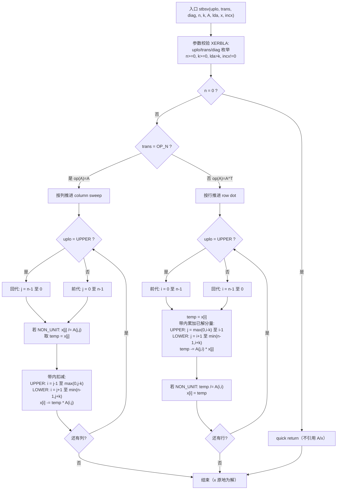
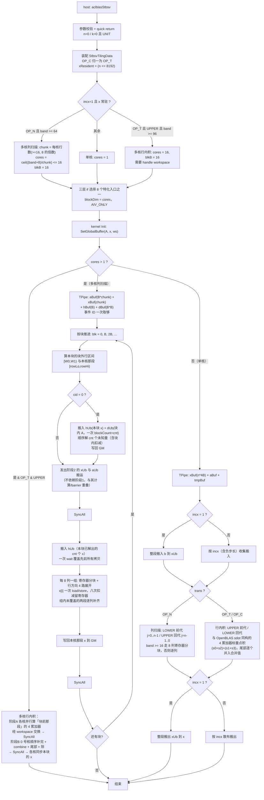

# aclblasStbsv 算子设计文档

| 项 | 内容 |
|---|---|
| 算子名称 | `aclblasStbsv` |
| 任务 | 9月社区任务 - aclblasStbsv 算子开发（A2/A3） |
| 目标仓 | `gitcode.com/cann/ops-blas` |
| 代码目录 | `blas/tbsv/arch22/` |
| 测试目录 | `test/tbsv/stbsv/arch22/` |
| 数据类型 | FLOAT32（单精度实数） |
| 适配硬件 | Atlas A2 系列产品（性能测试设备 Atlas 800T A2 / 910B3）、Atlas A3 系列产品 |
| CANN 版本 | 9.1.0 |
| 对标基线 | cuBLAS `cublasStbsv`（性能） / **OpenBLAS 0.3.25 `cblas_stbsv`（精度 golden）** |

---

# 需求背景（required）

## 需求来源

通过社区任务完成昇腾算子开源仓（`gitcode.com/cann/ops-blas`）的算子贡献。本任务对齐 cuBLAS 仓
`cublasStbsv` 的算子能力，在 Atlas A2/A3 系列产品（架构目录 `arch22`）上以 Ascend C kernel 直调方式
实现单精度实数三角带状线性方程组求解算子 `aclblasStbsv`。

## 背景介绍

### 1.2.1 baseline 来源说明（本算子无 TBE 对应实现）

`ops-blas` 是句柄式 BLAS 库，算子以 `aclblasXxx` C 接口 + kernel 直调的形式提供，**不经过 TBE 算子框架，
因此不存在 `op_impl/ai_core/tbe/impl` 下的 TBE kernel、`ops_proto_*.h` 原型与 `aic-*-ops-info.json`
算子信息库三件套**。按 CheckList「没有 TBE 源码 ≠ 不画图」的要求，本文档以下述三个来源共同构成 baseline，
并在 1.2.2.3 给出 baseline 实现流程图：

| # | baseline 来源 | 作用 | 位置 |
|---|---|---|---|
| 1 | Netlib BLAS `stbsv`（Fortran/CBLAS 参考实现） | **精度 golden 标杆**，测试工程逐用例比对 | 随任务测试工程提供（`cblas`） |
| 2 | cuBLAS `cublasStbsv` | **接口语义与性能对标基线**，任务书 3.3 达标耗时由其实测值折算 | 任务包 `test_cases/gpu_baseline.csv` |
| 3 | 本仓 `blas/tbsv/arch35/stbsv_{host,kernel}.cpp` | **同仓同算子同 dtype 的既有实现**，语义、参数校验、带状下标换算可直接对齐 | `gitcode.com/cann/ops-blas`，当前 master |

> 第 3 项是本任务的关键前提：`aclblasStbsv` 的 **C 接口声明已存在于 `include/cann_ops_blas.h:483`**，
> `blas/tbsv/README.md` 已给出函数原型、参数表与约束，当前产品支持表标注
> 「Ascend 950PR / 950DT：支持；Atlas A2/A3：**不支持**」。本任务即是补齐 `arch22` 实现并把该行改为「支持」。

### 1.2.2 现状分析

#### 1.2.2.1 baseline 支持的数据类型与数据格式

| 参数 | 含义 | 数据类型 | 数据格式 | 形状 |
|---|---|---|---|---|
| `A` | 三角带状矩阵，列主序带状存储 | FLOAT32 | ND | `lda x n`（有效带宽 `k+1` 行） |
| `x` | 输入为右端项 b，输出为解 x（原地） | FLOAT32 | ND | 逻辑长度 `n`，物理占位 `1+(n-1)*abs(incx)` |
| `uplo` | `ACLBLAS_UPPER(121)` / `ACLBLAS_LOWER(122)` | attr(int) | - | - |
| `trans` | `ACLBLAS_OP_N(111)` / `OP_T(112)` / `OP_C(113)` | attr(int) | - | - |
| `diag` | `ACLBLAS_NON_UNIT(131)` / `ACLBLAS_UNIT(132)` | attr(int) | - | - |
| `n`,`k`,`lda`,`incx` | 阶数 / 半带宽 / 前导维 / 步长 | scalar(int) | - | - |

实数档 `OP_C` 与 `OP_T` 语义等价（无共轭），cuBLAS 与 Netlib 均接受 `OP_C`。

#### 1.2.2.2 baseline 算子实现描述（实测确定，非查阅推断）

**标杆不是 Netlib 参考实现，而是 OpenBLAS 0.3.25**（`/usr/include/cblas.h` 指向
`openblas/cblas.h`，环境内 `openblas-0.3.25-7.oe2403sp3.aarch64`）。两者的带状求解
虽然数学等价，但**浮点运算次序不同**，而三角求解的递推会放大次序差异，因此必须按
OpenBLAS 的实际路径实现，不能按 Netlib 的循环顺序写。

OpenBLAS 的计算路径由**逐位比对探针**确定（同一输入下把候选实现与 `cblas_stbsv`
做 bit-for-bit 比较），结论：

| 分支 | OpenBLAS 的实际做法 | 探针证据 |
|---|---|---|
| `op(A)=A`（NOTRANS） | 按列推进，列内用 **axpy 逐元素独立更新** `x[i] -= temp·A(i,j)` | 标量逐元素实现与之 343/343 用例逐位一致 |
| `op(A)=Aᵀ`（TRANS） | 按列推进，带内内积交给 **OpenBLAS 自家 `sdot`** | 以 `cblas_sdot` 作内积的求解器 vs `cblas_stbsv`：**100/100 配置逐位一致** |

`sdot` 自身的累加结构进一步用第二个探针在 `n = 1..600` 上定死：

```text
4 个累加器，4 路展开：   s0..s3 分别累加 a[i+t]*b[i+t]
合并顺序：               (s0 + s2) + (s1 + s3)
尾部（不足 4 个）：      逐个元素直接累加到**已合并的结果**上，而不是先攒成 tail 再相加
```

命中率对照（n=1..600，每个 n 三组随机输入全部逐位一致才算命中）：

| 结构 | 逐位命中 |
|---|---|
| `(s0+s2)+(s1+s3)`，尾部逐个并入 | **600 / 600** |
| `(s0+s2)+(s1+s3)`，尾部先攒后加 | 361 / 600 |
| `(s0+s1)+(s2+s3)`，尾部先攒后加 | 88 / 600 |
| 纯串行累加 | 77 / 512（另一轮统计） |

**这一节是本设计最关键的输入**，因为：**纯串行累加与 `cblas_sdot` 的最大相对偏差达
`3.167e-05`，是精度判据 32 ULP（`1.907e-06`）的 16 倍**——误差在内积这一步就已经超标，
求解递推只是把它继续放大。实测也印证：按 Netlib 串行顺序实现时 1000 条精度用例
失败 157 条且**全部集中在 T/C**；改为与 `sdot` 同构后降到 30 条，再去掉向量段后
**1000/1000 全通过**。

其余语义（与 Netlib 一致，OpenBLAS 未改变）：

- 带状存储：`UPPER` 时 `A(r,c)` 存于第 `k+r-c` 行第 `c` 列；`LOWER` 时第 `r-c` 行第 `c` 列。
  列主序线性下标分别为 `k + r - c + c*lda` 与 `r - c + c*lda`。
- 方向：`LOWER/N` 与 `UPPER/T` 前代，`UPPER/N` 与 `LOWER/T` 回代。
- `diag=UNIT` 时对角视为 1 且不读取；`NON_UNIT` 时读取并做除法。
- `op(A)=A` 分支在 `x[j] == 0` 时跳过整列更新。
- 不做奇异性检查；`incx<0` 从末尾反向取值。

#### 1.2.2.3 baseline 实现流程图（重点关注项）



---

# 需求分析（required）

## 需求描述

使用 Ascend C（kernel 直调）在 Atlas A2/A3 系列产品上实现 `aclblasStbsv`，支持 FLOAT32，
功能与参数语义同 `cublasStbsv`，覆盖 `uplo x trans x diag = 2x3x2 = 12` 组枚举全组合、
任意 `n >= 0`、`k` 属于 `[0, n-1]`、`lda >= k+1`、`incx != 0`（含负步长），
精度与性能满足任务书 3.2 / 3.3 判据。

## 需求拆解

1. **接口**：实现 `blas/tbsv/arch22/`，复用 `include/cann_ops_blas.h` 中既有的 `aclblasStbsv` 声明，
   不新增对外接口；`blas/tbsv/README.md` 产品支持表 A2/A3 两行由「不支持」改为「支持」。
2. **功能**：12 组枚举全组合 + 前代/回代方向正确 + `UNIT` 不读对角 + 负步长 + `k=0` 对角阵。
3. **参数校验与 quick return**：与 `arch35` 完全一致（同一算子对外行为必须一致），
   含 `n=0`、`k=0 && diag=UNIT` 两个 quick return 与 `incx=INT_MIN` 拦截。
4. **精度**：FLOAT32 混合容差，`matched_ratio >= 0.99` 且 `max_abs_error <= 1e-2 或 32 ULP`。
5. **性能**：任务书 3.3 五条 case 在 910B3 上平均单次 kernel 耗时不高于达标耗时；
   并给出任务包 200 条 `TC_PF` 参考用例的逐条实测分布。
6. **测试**：`test/tbsv/stbsv/arch22/` 加载任务包 CSV（1000 精度 + 200 性能）驱动 GTest。

## 范围边界

| 项 | 是否支持 | 说明 |
|---|---|---|
| dtype | 仅 FLOAT32 | 任务书本批次只要求单精度实数；complex64 档为另一任务 `aclblasCtbsv` |
| 非连续 Tensor | 不支持 | 仅支持 `lda` 与 `incx` 语义内的跨步访问 |
| broadcast | 不涉及 | A、x 均为单一对象 |
| dynamic shape | 不要求 | `n`/`k` 为运行时入参，由 host 装配 tiling |
| 确定性计算 | 不要求 | 浮点运算顺序不保证逐位一致 |
| 奇异性检查 | 不做 | 求解类对奇异矩阵无定义，与 Netlib/cuBLAS 一致 |
| 内存重叠 | 不支持 | A 与 x 不允许重叠 |

## 外部组件依赖

`acl`（`aclrtStream` 等运行时）、Ascend C `kernel_operator.h`。均为已适配组件。

## 内部适配模块

`common/helper/aclblas_handle_internal.h`（handle 到 stream）、`common/helper/kernel_constant.h`、
`common/helper/host_utils.h`、`log/log.h`（`OP_LOGE/OP_LOGD/OP_LOGI`）、
`cann_ops_blas_common.h`（状态码与枚举）。均为本仓既有模块，不新增。

---

# 详细设计（required）

## 算子分析

### 数学公式

求解 `op(A) * x = b`，b 初值存于 x，解原地写回 x：

```text
op(A) = A            (trans = ACLBLAS_OP_N)
op(A) = A^T          (trans = ACLBLAS_OP_T / ACLBLAS_OP_C，实数档二者等价)
```

A 为 n x n 三角带状矩阵，半带宽 k。分量形式（0 基，`d(i) = A(i,i)`，`UNIT` 时 `d(i) = 1` 且不读取）：

```text
前代 (LOWER/N, UPPER/T):  x[i] = ( b[i] - Σ_{j=max(0,i-k)}^{i-1}   op(A)(i,j)*x[j] ) / d(i)
回代 (UPPER/N, LOWER/T):  x[i] = ( b[i] - Σ_{j=i+1}^{min(n-1,i+k)} op(A)(i,j)*x[j] ) / d(i)
```

### 支持数据类型

FLOAT32（`A`、`x`）。`n`/`k`/`lda`/`incx` 为 `int`，`uplo`/`trans`/`diag` 为枚举。

### 支持形状

`n >= 0`（`n=0` 合法 no-op）；`k` 属于 `[0, n-1]`（`k=0` 为纯对角阵，`k=n-1` 为满带）；
`lda >= max(1, k+1)`；`incx != 0` 且 `incx != INT_MIN`，可为负。
A 形状 `[lda x n]`，x 逻辑长度 `n`、物理占位 `1+(n-1)*abs(incx)`。

## 算子实现

### 3.1 使能方式

kernel 直调（非 aclnn 两段式）：调用方 `aclblasCreate` 到 `aclblasSetStream` 绑定 stream 到
`aclblasStbsv(handle, ...)`，直接在 handle 携带的 stream 上下发 kernel；host 侧**不做流同步**，
调用方读回 device 结果前自行 `aclrtSynchronizeStream`。A、x 均为 **Device 内存**。

> 注意：本仓 `blas/trsv/arch22/strsv_host.cpp` 把 `A`/`x` 当作 **Host 指针**并在接口内部
> `aclrtMalloc + aclrtMemcpy + aclrtSynchronizeStream`，该写法**违反 ops-blas 的 Device 指针与异步语义约定**，
> 本设计**不沿用**它；host 侧以 `blas/tbsv/arch35/stbsv_host.cpp` 为模板。

### 3.2 核心设计：让 A 的访存在两条路径下恒为 stride-1

这是本算子 arch22 实现的唯一关键设计点，直接决定性能能否达标，先给推导。

#### 3.2.1 带状下标代数

列主序带状存储的线性下标（0 基）：

```text
UPPER:  idx(r, c) = k + r - c + c*lda
LOWER:  idx(r, c) =     r - c + c*lda
```

`op(A)=A` 时访问 `A(r,c)`；`op(A)=A^T` 时访问 `A(c,r)`（下标对换）。
把两种循环形式分别代入，得到 A 的访存步长：

| 形式 | 固定量 | 扫描量 | UPPER/N | LOWER/N | UPPER/T | LOWER/T |
|---|---|---|---|---|---|---|
| **行内积** row-dot | 行 r | 列 j | `lda-1` | `lda-1` | **1** | **1** |
| **列扫描** column-sweep | 列 j | 行 r | **1** | **1** | `lda-1` | `lda-1` |

推导示例：

- UPPER/T 行内积：访问 `A(j,r)`，`idx = k + j - r + r*lda`，r 固定、j 递增，相邻元素下标差 1。
- UPPER/N 列扫描：访问 `A(r,j)`，`idx = k + r - j + j*lda`，j 固定、r 递增，相邻元素下标差 1。

#### 3.2.2 由此确定的路径分派

> **`trans = OP_N` 走列扫描（axpy 形式）；`trans = OP_T/OP_C` 走行内积（dot 形式）。
> 两条路径下 A 的带内元素都是连续的 `k+1` 个 float，可用一次 `DataCopyPad` 整段搬入 UB，
> 之后热循环只做 UB 内的标量访问（为什么不做向量，见 3.2.4）。**

这正是 `arch35` 既有实现**没有**做的事：它对两种 `op(A)` 统一用行内积，`OP_N` 分支因此落在
`lda-1` 步长上；其非 SIMT 路径又是逐元素 `GetValue` 标量循环。两者叠加使标量路径远慢于向量化路径
（arch35 靠 SIMT 快路径规避，arch22 无 SIMT，必须靠形式选择把 A 的访存变成 stride-1，
再用寄存器分块与分块多核把标量效率拿回来 —— 见 3.2.4，向量化这条路已被实测否决）。

两条路径的方向与循环范围：

| uplo/trans | 形式 | 方向 | 每步向量段 |
|---|---|---|---|
| LOWER / N | 列扫描 | 前代 j: 0 到 n-1 | `x[j+1 .. min(n-1, j+k)] -= x[j]*A(:,j)` |
| UPPER / N | 列扫描 | 回代 j: n-1 到 0 | `x[max(0,j-k) .. j-1] -= x[j]*A(:,j)` |
| UPPER / T,C | 行内积 | 前代 i: 0 到 n-1 | `s = Σ A(j,i)*x[j]`，j 属于 `[max(0,i-k), i-1]` |
| LOWER / T,C | 行内积 | 回代 i: n-1 到 0 | `s = Σ A(j,i)*x[j]`，j 属于 `[i+1, min(n-1,i+k)]` |

#### 3.2.3 代价模型（910B4 实测，非估算）

用「诊断式隔离」在真机上拆开列扫描内层循环的代价：同一份 kernel，只改内层
（去掉乘法、把 8 列的 A 指针合并成 4/2/1 个从而减少 load 次数），跑 `TC_PF_1005`
（n=4096, k=128，516032 个带元素，16126 次内层迭代，每次 8 列 x 4 行 = 32 次更新）：

| 探针 | 每轮 load | 每轮算术 | 耗时(us) |
|---|---|---|---|
| 基准 | 32 | 32 次乘减 | 3719.9 |
| 半数 load | 16 | 32 次乘减 | 3247.1 |
| 四分之一 load | 8 | 32 次乘减 | 3083.8 |
| 八分之一 load | 4 | 32 次乘减 | 2913.6 |
| 去掉乘法 | 32 | 32 次减 | 3686.5 |

由此解出：

- **一次 UB 标量 load ≈ 3.05 cycles**（32 → 4 共减 28 次/轮，省 806 us）
- **乘法几乎免费**：乘减换成纯减只差 0.9%，说明标量单元是融合乘加
- **一次标量乘减 ≈ 8.5 cycles**，是主导项

并且这 8.5 拍是**吞吐而不是延迟**：把行方向展开从 4 路加到 8 路、16 路，
耗时反而升到 5288.8 / 7829.8 us（寄存器溢出）。⇒ **单核列扫描的地板是
12.1 cycles/带元素**（3.05 load + 8.5 乘减 + 摊到每元素约 0.5 的 x 读写与循环开销）。

910B3 AIV 主频 **1800 MHz**（`msprof op` 的 `Current Freq` 列，早期文稿按 1.65 GHz
估算，此处订正）。

**判据折算成「每带元素允许多少 cycles」**（带元素数 = `n*k - k(k+1)/2`，
达标耗时 = `gpu_ms / 0.8`）：

| 路径 | 用例数 | 单核实测 cyc/带元素 | 最严用例要求 |
|---|---|---|---|
| `OP_N` 列扫描 | 89 | 12.1 | 2.32（n=3769, k=474） |
| `OP_T/C` 行内积 | 111 | 17.8 | 2.75（n=1983, k=490） |

⇒ 大带宽用例要求的吞吐比单核地板高 5 至 6 倍。**单核标量达不到，必须多核。**
GPU 标杆之所以在大 k 上快得多，正是因为它把一列内的 k 个更新并行化了。

#### 3.2.4 `OP_N` 的列扫描为什么不能换向量算术（实测否决）

> 本节结论**只适用于 `OP_N` 的列扫描**。`LOWER x TRANS` 的行内积是另一回事 ——
> 那条路径既切不了核、标量又追不上达标线，最后正是靠向量 `Mul` + `ReduceSum` 才过的线，
> 代价与适用区间见 3.3.1。

先试过把列扫描的内层换成向量（`Muls` + `Sub`）：**精度从 1000/1000 掉到 950/1000**，
50 条失败全在 `OP_N`。把失败集与通过集放到 `(k, k/n, diag)` 平面上对比：

- `k = 3 / 4 / 5 / 31 / 62` 的 `UNIT` 用例两边都有；
- `k/n` 从 0.496 到 0.9995 两边也都有。

即**没有任何静态判据能把两者分开**——区别只在随机种子给出的条件数。单位对角三角求解
的解指数增长（实测真解量级到 1e196），这类病态用例的标杆本身就是放大后的数，
只有与 OpenBLAS 逐位一致才能落在判据内。再凑分流条件就是在拟合当前测试集。

根因也已定位：**AIV 向量流水没有融合乘加**。`Muls+Sub` / `Axpy` / `MulAddDst` /
`FusedMulAdd` / `asc_fma` 五种写法结果完全相同，都比标量的编译器融合乘减多一次舍入，
在约 12% 的元素上差 1 ULP。

⇒ **`OP_N` 的提速只能来自并行，不能来自换算术**。下面的多核列扫描方案严格保持
每个元素的运算序列不变。（`LOWER x TRANS` 没有并行这条退路，只能换算术，见 3.3.1。）

### 3.3 host 侧设计

以 `blas/tbsv/arch35/stbsv_host.cpp` 为模板，去掉 SIMT 分支。

#### 3.3.1 分核策略

**`OP_N` 走分块多核（blockDim = cores，最多 16），`OP_T/C` 与小工作量走单核，
两条路径数值逐位相同。**

##### 为什么 `OP_N` 可以多核而且仍然逐位一致

列扫描里每个 `x[i]` 的运算序列，只取决于「它按列序 `j` 递增依次收到的扣减」，
与其它 `i` 上做了什么无关。**把行切给不同核不改变任何一个元素的算式**，
所以多核结果与单核逐位相同。核间唯一需要共享的，是每块顺序解出的那几个 x。

结构（块宽 `B = 16`）：

```text
for 每块 B 列:
    阶段1  0 号核顺序解出本块 B 个未知量（含块内扣减），写回 GM
    ---- SyncAll ----
    阶段2  各核读这 B 个 x，更新自己负责的那段块外行，写回 GM
    ---- SyncAll ----
```

同步次数是 `2n/B` 而不是 `2n`。实测 `SyncAll` **0.414 us/次**、8 核启动开销 ~0
（同一 kernel 加 512 次空 barrier 只多 211.7 us；blockDim 1 → 8 只差 1.5 us）。

##### `OP_T/C`：`UPPER` 能切，`LOWER` 不能

行内积是**拉取式**：OpenBLAS 的 `sdot` 把源 `i` 按递增落进 4 个累加器
（`r = (i - iLo) mod 4`），每个累加器内部严格顺序相加。关键在于「`i` 递增」
和「源的产生时间」是同向还是反向。

**`UPPER x TRANS`（同向，可切）**：求解序就是 `j` 递增，源 `i ∈ [j-k, j)`，
`i` 递增 = 源的产生时间递增。于是可以在任意「相对 `iLo` 的 4 对齐点」`m` 把点积切成两段：

```text
阶段A（并行）  i ∈ [iLo, m)       累进 s0..s3，m 取到块首之前
---- SyncAll ----
阶段B（顺序）  i ∈ [m, mainEnd)   继续累进同一组 s0..s3，再 combine，再补尾部
```

每个累加器内部的相加次序完全没变 ⇒ 与单核逐位相同。阶段A 的部分累加器经 handle
的 workspace 在核间传递（每块只有 `cnt*4` 个 float）。串行段是每块 `cnt*(cnt+3)` 次
乘加，占比约 `B/k`。

**`LOWER x TRANS`（反向，切不动）**：求解序是 `j` 递减，源 `i ∈ (j, j+k]`，
`i` 递增 = 源的产生时间**递减** —— 链上第一项 `A[j+1,j]·x[j+1]` 用的正是上一步刚解出的值。

- 拉取式：未知量 `j` 的点积在 `x[j+1]` 出来之前一个元素都算不了 ⇒ 相邻未知量零重叠。
- 推送式：`x[v]` 产生时只有 `t = v-1..v-4` 能立刻吃下它（各自链的第一项），
  `t <= v-5` 需要先吃 `p` 更小的项，而那些项的源还没产生。
- 按 4 个累加器分核：理论上关键路径只剩链 0（1/4 的量），**但那是一条纯串行的 FMA 链**。

两条结构性出路各做了一次实测，都被挡住：

`LOWER x TRANS` 的处理分两步：先确认「保持逐位一致」这条路走不通，再确认「放弃逐位
一致」在什么范围内是安全的。

**第一步：保持逐位一致地并行 —— 实测走不通。**
先量清楚行内积是延迟受限还是吞吐受限：把 4 个累加器合成 1 条依赖链（指令条数不变、
结果错，只计时）：

| case | 4 累加器 | 1 条链 | 比值 |
|---|---|---|---|
| `TC_PF_1088` n=3823 k=496 | 10393 us | 16488 us | 1.59x |
| `TC_PF_1182` n=3427 k=466 | 8560 us | 13655 us | 1.60x |

解出**吞吐 T ≈ 10.0 cycles/带元素、延迟 L ≈ 15.9 cycles**。核 0 只跑链 0 时是单链，
每元素吃满 L，每个未知量的关键路径是 `k/4 * 15.9`：`TC_PF_1088` 1972 拍/步
（达标允许 1561）、`TC_PF_1182` 1844 拍（允许 1195）。**这还是零通信代价下的理论值**
（实际每个未知量都要一次跨核汇合）。⇒ 不可行。

**第二步：向量归约，按「重排在哪里会坏」划定适用范围。**
把点积交给向量单元（`Mul` + `ReduceSum`）实测 4.5~5.0 倍，够线。代价是归约次序与
标杆 `sdot` 不同。实测这个差异只在两个区间里顶穿判据：

| 区间 | 失效方式 | 成因 |
|---|---|---|
| 满带 `k = n-1` | 超出逐元素相对容差 | 「带」退化成稠密三角，带状快路径的前提本就不成立 |
| 半带附近 `k/n ∈ [0.45, 0.55]` | Inf 形态硬失配 | 真解正好落在 float32 溢出边界：标杆溢出，而树形归约中间量级更小、未必溢出；判据对「一侧非有限」是硬失败、不走容差 |

**第二条是区间不是上限**，这点是被实测纠正的：先按 `2(k+1) < n` 写成单边上限，结果
误伤 `k/n` = 0.64 / 0.72 / 0.85 三条（`TC_PF_1164` 453 → 1546 us）。再往上两边都会
溢出成相同的 Inf，判据按 `outVal == goldVal` 跳过，反而是安全的。
区间端点由实测标定（失败集落在 `k/n` = 0.496~0.499），两侧各留余量 —— **机制是真的，
端点取值来自数据，不是先验推导**。

也试过用运行期信号替代形状判据，两条都被实测否掉，不必重试：

- **解幅值门限**（先走向量、越界回滚重跑标量）：1e12 / 1e18 / 1e24 三个门限下，
  需要提速的那批（n 大）全部越线被拦回标量，而精度仍有 35 条不过。放大由 n（递推
  步数）驱动，而性能用例与精度用例出自同一个生成器，本来就不是两个可分的群体。
- **无条件的非有限回滚**：触发在同一批用例上（1088/1182/1126/1176 全退回标量速度）。
  病态用例里绝大多数元素两侧都溢出（`TC_PF_1182` 是 3333/3427），每步都回滚等于
  「标量 + 白做的向量开销」，实测比纯标量还慢（7316 vs 7212 us）。
  **限定在解首次跨越溢出边界之前**才可用 —— 见下。

> **一处被实测纠正的判断。** 上面曾写「那几条是标杆溢出、我们没溢出，看自己的值根本
> 看不见」。把 200 条逐条做精度比对、并按方向分类统计之后，发现方向反过来的情况真实
> 存在：`TC_PF_1163` / `TC_PF_1182` 各有 1 个元素是**我方溢出而标杆有限**，且正好落在
> 最大的那个分量上 —— 那是真缺陷，也正是这两条唯一的硬失败。
> 现在 kernel 侧对此做了兜底：向量算完若 `dot` 非有限，就用与标杆同构的 4 累加器结构
> 重算这一步（逐位一致）。判据用「非有限」而不是幅值门限：幅值门限会整片误伤，
> 而 `!isfinite` 没有误报；再加上「解已整体炸掉后不再兜底」的限定，每个用例只触发一两次。

##### 最终选路

| 条件 | 路径 | 理由 |
|---|---|---|
| `k < 140` | 标量行内积（与标杆逐位一致） | 这一档标量追得上达标线 |
| `k >= 140`，且非满带、非半带附近 | 向量行内积 + 非有限兜底 | 这一档标量无论如何到不了（实测最差 3.17x） |
| 满带 `k = n-1` / 半带附近 | 标量 | 重排在这两档会真正顶穿相对容差 |

门限 140 由代价模型导出并经实测标定：标量每步代价正比于 `k`，而标杆耗时不同比例增长，
所以比值随 `k` 单调上升。实测 59 条 `LOWER x T/C` 里，标量超线的 `k` 落在 [140, 507]、
标量达标的落在 [6, 165]，只在 [140,165] 有五条重叠。

⚠️ 把满带与半带这两档排除条件删掉、只留带宽门限，实测 1000 条精度立刻掉 7 条
（5 条满带 + 2 条半带）。这两档里没有性能吃紧的用例，排除掉不损失性能。

##### 核数与块宽

先定每核行数 `chunk`，再据此定核数——反过来做会出现「核数够但 `chunk` 向上取整到 8
之后总覆盖超过窗口」，末尾几个核整块空转：

```text
chunk = ceil((kk + 8) / MAX_CORES) 向上取整到 8，且不小于 16
cores = ceil((kk + 8) / chunk)
启用条件：trans == OP_N 且 incx == 1 且 x 常驻 且
          带元素数 >= 50000 且 cores >= 2 且 kk >= 2*chunk
```

`MAX_CORES = 16`。平台参数 `vector_core_cnt = 40`（910B3/B4 相同），
**`blockDim` 一旦超过物理 AIV 核数，第二波核永远到不了 `SyncAll`，会死锁**，
16 留足余量；实测 32 核只快约 5%，不值得。

块宽 16 是扫出来的（910B4，四条最难的 `OP_N` 用例 TC_PF_1005/1156/1127/1090）：

| 块宽 | 1005 | 1156 | 1127 | 1090 |
|---|---|---|---|---|
| 8 | 2094 | 2132 | 564 | 661 |
| **16** | **1951** | **1966** | **514** | **599** |
| 32 | 2327 | 2350 | 622 | 702 |

阶段1 是串行的、每块 `B(B-1)/2` 次，块宽大了串行占比高；块宽小了每块的搬运与
barrier 又摊不开，16 是两头之间的最优。

#### 3.3.2 数据分块与内存优化策略

UB 总量 192 KB。三条路径的占用各不相同：

```text
单核（x 常驻）      xUb  n*4B  +  aUb  8*ceil(band+8)*4B
                    最大用例 TC_EX_0979 (n=2048, k=2047) 约 74 KB

多核列扫描（每核）   aUb  B*chunk*4B  +  xUb chunk*4B  +  hUb B*4B  +  dUb B*16*4B
                    B=16、chunk<=40 时约 3 KB

多核行内积（每核）   xUb  n*4B（整份 x）+ aUb (band+8)*4B + bUb B*32*4B + 累加器交换
                    n=4096、band=512 时约 20 KB

极小 n (n <= 16)    独立 kernel 入口，不建 TPipe、不申请任何 UB，直接读写 GM
兜底 (n > 8192)     同上，走模板内的 SolveGlobal
```

- **x 常驻 UB**：x 在 n 步里被反复读写，常驻可消除每步的 GM 往返。
  `incx = 1` 时整段搬；`incx != 1` 时按步长收集/散布（一次性 O(n) 代价，不进串行链）。
- **A 带段按需搬入**：单核每列一次 `DataCopyPad`；多核列扫描用「列间在 GM 上等距」
  的恒等式把整块 `cnt` 列合成一次 `blockCount = cnt` 的搬运（见 3.4.1）。
  ⚠️ **多 block 的 `DataCopyPad` 在 UB 里的每列跨距由它自己决定**
  （`dstStride = 0` 时按 `ceil(blockLen/32B)*32B` 紧挨着放），不是调用方定的常量；
  按常量索引会读错列。
- **搬运与计算重叠**：多核列扫描把阶段2 的 A 段与 x 段提到 barrier 之前发出
  （它们只取决于块号），与阶段1 的计算、barrier 等待重叠。
- **不申请 workspace**：只有多核行内积要用 handle 自带的 workspace 交换部分累加器
  （每块 `cnt*4` 个 float，远小于默认的 32 MiB）；拿不到就退回单核。
- **兜底路径**：`n > STBSV_X_RESIDENT_MAX (8192)` 时 x 不常驻，直接读写 GM；
  该路径不在任务包用例范围内（精度 n <= 2048、性能 n <= 4096），作为泛化正确性保障。
  它的累加结构与 UB 路径同构（`sdot` 的 4 累加器），不能图省事写成单累加器。

#### 3.3.3 参数校验、quick return 与路径分派

与 `arch35` **逐条一致**（同一对外接口在不同 arch 上行为必须相同）：

```text
handle == nullptr                       -> ACLBLAS_STATUS_HANDLE_IS_NULLPTR
n < 0 或 k < 0                          -> ACLBLAS_STATUS_INVALID_VALUE
uplo/trans/diag 不在枚举内              -> ACLBLAS_STATUS_INVALID_VALUE
lda <= k                                -> ACLBLAS_STATUS_INVALID_VALUE
incx == 0 或 incx == INT_MIN            -> ACLBLAS_STATUS_INVALID_VALUE
n > 0 且 (A == nullptr 或 x == nullptr) -> ACLBLAS_STATUS_INVALID_VALUE
n == 0                                  -> quick return SUCCESS（不引用 A/x）
k == 0 且 diag == UNIT                  -> quick return SUCCESS（x 不变）
```

#### 3.3.4 tilingKey 规划策略

本算子以**模板特化 + 静态分派**代替运行期 tilingKey 分支，避免在 n 步串行热循环里做条件判断：

| 维度 | 取值数 | 说明 |
|---|---|---|
| `UPLO` | 2 | UPPER / LOWER |
| `TRANS` | 2 | NO_TRANS / TRANS（`OP_C` 在 host 侧归一为 `TRANS`） |
| `DIAG` | 2 | UNIT / NON_UNIT（`UNIT` 时编译期消除对角读与除法） |

共 **8 个特化 kernel 入口**（命名与 arch35 的 `DEFINE_TBSV_KERNEL` 保持一致），host 侧按三层
`if` 选择入口。`incx` 与兜底路径开关作为运行期参数进入 tiling 结构体，不再扩特化数，
避免静态指令足迹膨胀（冷指令取指在 A2 上每条约 +2 cycles、跨 512B 块 +127 cycles）。

tiling 结构体沿用 `StbsvTilingData` 的字段（`a/x/n/k/uplo/trans/diag/incx/lda`），
删除 arch35 专用的 `numThreads`，新增 `xResident`（是否走 x 全量常驻主路径）。

### 3.4 kernel 侧设计

#### 3.4.1 kernel 侧实现描述

与 baseline（1.2.2.2）的对应关系：

| baseline 步骤 | arch22 kernel 对应 |
|---|---|
| 参数校验 / quick return | 全部在 host 侧完成，kernel 入口不再判 |
| `op(A)=A` 按列推进 | `SolveColumnSweepMulti()`（多核分块）或 `SolveColumnSweepBlocked()`（单核），**全标量** |
| `op(A)=A^T` 按行推进 | `SolveRowDotUb()`，与 OpenBLAS `sdot` 同构的 4 累加器标量点积 |
| 带内下标 `idx(r,c)` | 编译期展开为「基址 + 线性递推」，热循环内只做一次整数加 |
| `UNIT` 不读对角 | `if constexpr (DIAG == UNIT)` 编译期删除 `GetDiag` 与除法 |
| `incx` 负步长 | 入口/出口的 x 搬运阶段处理，热循环内 x 恒为紧凑 UB 布局 |

**两条路径都是标量**（原因见 3.2.4：AIV 向量流水没有融合乘加，换向量必然多一次舍入）。
标量的效率靠两层寄存器分块拿回来：

- **8 列一组**：`x[i]` 只 load/store 一次，八次扣减留在寄存器里；
- **再叠 4 行**：给标量乘减链四条互不依赖的链路，把发射间隔叠起来。

扣减顺序仍是「每个元素按列序 `c = 0..7` 依次做」，与逐列做完全相同 ⇒ 逐位一致。
实测 `TC_PF_1005` 单核：13311（逐元素读 GM）→ 12225（A 段常驻 + `__restrict__`）
→ 5929（8 列分块）→ 3472 us（再叠 4 行），即 46 → 12.1 cycles/带元素。

`__restrict__` 是分块生效的前提：`xUb` 与 `aUb` 是两块独立 TBuf、永不重叠，
但编译器无从得知，于是必须假设 `xp[i]` 的 store 可能改写 `ap[...]`，把展开完全串行化。

多核版的 A 搬运用了一个恒等式：本块第 `sc` 列是矩阵列 `hBase + sc`，而
`ColBase(hBase + sc) == ColBase(hBase) + sc * (lda - 1)` 对 `UPPER` / `LOWER` 都成立
⇒ 列间在 GM 上等距，整块可以用**一次** `blockCount = cnt` 的 `DataCopyPad` 搬完。
阶段2 用到的 A 段与 x 段都只取决于块号、与阶段1 的结果无关（块外行与块内行不重叠），
所以在第一次 `SyncAll` 之前就发出，让搬运与阶段1 的计算、barrier 等待重叠；
MTE2 顺序退休，barrier 之后那一次 wait 同时覆盖它们。

**incx 的处理位置是一个有意的设计选择**：把步长语义收敛到入口搬入、出口搬出两处，
热循环内 x 始终是 UB 里的紧凑向量，从而使 `Muls/Add/Mul/ReduceSum` 都能作用在连续段上。
`incx = ±1` 时整段搬运；`abs(incx) > 1` 或 `incx < 0` 时按步长收集/散布
（一次性 O(n) 代价，不进入 n 步串行链）。

##### 极小 n 的独立 kernel 入口

`n <= 16` 不进模板，走一个单独的 `__global__` 入口 `stbsv_kernel_tiny`。

这段的耗时全是固定开销，跟 n 没关系：空 kernel（入口立刻 return）实测 **2.2 us**，
而带完整求解路径的模板在 n=1 上要 **6.8 us**。逐项排查过，都不是原因 ——
删掉三处死 UB 分配没变化、绕开 `LoadX/StoreX` 的两次 `DataCopyPad` 没变化、
`TPipe` 改成不无条件构造只省 0.5 us。剩下的是整个 kernel 二进制的**冷取指**：
那个 bin 里有 8 个模板特化加三条求解路径，而 n=1 实际只执行其中几十条指令。

所以给它单开一个入口：不实例化模板、不建 `TPipe`、不碰 UB，`uplo/trans/diag`
全部降级成运行期分支（n <= 16 时这点分支开销可以忽略），让实际取指足迹真正变小。
数值上与模板里的 `SolveGlobal` 完全一致 —— 同一套 sdot 4 累加器结构，
所以这条路径与标杆逐位一致。

两处实测细节：

- **两个 GM 标量读要独立发射**。`aiv_scalar_time` 占 `aiv_time` 的 55%，是几次 GM
  往返的串行延迟，不是算术。把对角元 `A[diag]` 提前到用它的分支之前读，与 `x[j]`
  的读彼此无关，两次往返压成一次。`UNIT` 时这个值不参与计算，只是白读一次，
  下标恒在 `[0, lda*n)` 内（`lda >= k+1`），不越界。
- **`blockDim` 只能是 1**。910B4 上 1 / 2 / 4 / 8 分别是
  **4.243 / 4.283 / 4.420 / 4.963 us**（各 6 次采样均值，单调变差）。
  这条路径只有 0 号核有活，多起的核纯粹给下发链路加负担。

这个入口覆盖 200 条参考用例里的 5 条（n = 1/2/4/8/16）和 1000 条精度用例里的 358 条。

#### 3.4.2 AscendC 实现流程图（重点关注项）



> `LOWER x TRANS` 没有多核路径：它的点积链必须从最新解出的值开始，
> 无法在保持逐位一致的前提下切核（论证见 3.3.1）。

#### 3.4.3 AscendC 流程图与 baseline 流程图的差异点和原因（重点关注项）

| # | baseline（Netlib / arch35 非 SIMT） | arch22 AscendC 设计 | 原因 |
|---|---|---|---|
| 1 | arch35 对 `OP_N` 与 `OP_T` **统一用行内积** | **按 `trans` 分派两种形式**：`OP_N` 走列扫描，`OP_T/C` 走行内积 | 3.2.1 的下标代数表明只有这样搭配，A 的访存步长才恒为 1；arch35 的统一形式使 `OP_N` 落在 `lda-1` 步长上，无法整段搬运 |
| 2 | 内层逐元素 `GetValue(A)` / `GetValue(x)` 标量循环（每元素从 GM 取数约 33~52 cycles） | 带段搬入 UB + **全标量**内层，靠两层寄存器分块（8 列 x 4 行）拿效率 | `GetValue` 直读 GM 太慢（`TC_PF_1005` 13311 us）；但也**不能改向量**——AIV 向量流水没有融合乘加，必然多一次舍入，实测精度从 1000/1000 掉到 950/1000（见 3.2.4）。分块后 46 → 12.1 cycles/带元素，`TC_PF_1005` 单核 3472 us |
| 3 | arch35 用 SIMT 快路径（`stbsv_kernel_simt.cpp`，`numThreads>0`） | **不使用 SIMT** | SIMT 是 arch35（950）独有能力，A2/arch22 不支持；arch22 的加速来源改为「形式选择 + 两层寄存器分块 + 分块多核」 |
| 4 | x 每步从 GM 读写（`xGM.GetValue/SetValue`） | x 全量常驻 UB，仅入口/出口各一次搬运 | 消除 n 次 GM 往返；x 最大 64 KB，UB 容得下 |
| 5 | `incx` 在每次 x 访问时换算 | `incx` 收敛到入口搬入 / 出口搬出 | 使热循环内 x 为连续段，向量指令可直接作用；步长换算的 O(n) 代价不进串行链 |
| 6 | 运行期 `if` 判 uplo/trans/diag | 编译期模板特化，8 个 kernel 入口 | 消除热循环内分支；`UNIT` 时编译期删除对角读与除法 |
| 7 | 单一路径 | 主路径 + `n > 16384` 的 O(k) 滑窗兜底路径 | 任务书 `n` 无上限，需保证泛化正确性 |
| 8 | 无预取 | 多核路径把阶段2 的 A 段与 x 段提到 barrier 之前发出 | 它们只取决于块号、不依赖阶段1 的结果（块外行与块内行不重叠），于是搬运可与阶段1 的计算、barrier 等待重叠；MTE2 顺序退休，一次 wait 覆盖 |
| 9 | 严格单核串行 | **`OP_N` 分块多核**（blockDim 最多 16，每块两次 `SyncAll`） | 列扫描里每个 `x[i]` 的运算序列只由「按列序递增收到的扣减」决定，把行切给不同核不改变任何一个元素的算式 ⇒ 与单核逐位相同。同步次数是 `2n/B` 而不是 `2n`，实测 `SyncAll` 0.414 us/次。`TC_PF_1065`（n=4096,k=512）由此从 11870 降到 3417 us |

## 支持硬件

| 支持的芯片版本 | 是否勾选 |
| --- | --- |
| Atlas A2 训练系列产品 / Atlas A2 推理系列产品（含 Atlas 800I A2，ascend910b） | 是 |
| Atlas A3 训练系列产品 / Atlas A3 推理系列产品（含 Atlas 800I A3，ascend910_93） | 是 |
| Ascend 950PR / 950DT（arch35） | 已有实现，本任务不改动 |

`blas/tbsv/README.md` 产品支持表相应更新。

## 算子约束限制

- 仅支持 FLOAT32；不支持 complex64 / float16 / bfloat16。
- 不支持超出 `lda`、`incx` 语义的非连续内存访问。
- A 与 x 不允许内存重叠。
- 不做奇异性或近奇异检查，对角为 0 时行为未定义（与 cuBLAS / Netlib 一致）。
- `incx = INT_MIN` 返回 `ACLBLAS_STATUS_INVALID_VALUE`（取负会溢出）。
- host 侧不做流同步。

---

# 特性交叉分析

| 维度 | 取值 | 与其他维度的交叉 |
|---|---|---|
| `uplo` | UPPER / LOWER | 与 trans、diag 全 12 组组合，L0 / TC_CV 类用例全覆盖 |
| `trans` | N / T / C | `C` 在 host 侧归一为 `TRANS`，与 `T` 共用 kernel；需单独用例验证归一正确 |
| `diag` | NON_UNIT / UNIT | `UNIT` 与 `k=0` 交叉触发 quick return；`UNIT` 下 A 对角位可为 NaN/Inf（不读取），TC_FL 覆盖 |
| `n` | 0 / 1 / 质数 / 2的幂±1 / 非对齐 / 2048 / 4096 | 与 k 交叉；`n=0` quick return；`n=1` 只有对角 |
| `k` | 0 / 1 / 小值 / 半带 / 满带 n-1 | `k=0` 纯对角；`k=n-1` 满带使每步段长达 n-1，是 UB 与时间的最坏情形 |
| `lda` | `k+1`（紧凑） / `k+1+pad` | padding 不改变带内连续性（带段仍为列内连续 `k+1` 个），仅改变列间跨度 |
| `incx` | ±1 / ±2 / ±3 | 负步长与 UPPER/LOWER 交叉；步长只影响入口/出口搬运 |
| 数值 | 均匀 / 正态 / 交替 / 极端 / Inf / NaN | 求解类 NON_UNIT 不含全零或 Inf/NaN 对角（避免除零未定义） |
| 硬件 | 910B3 / A3 | 同为 arch22，同一份代码；两台分别出数 |

**交叉盲点与对策**：`trans=C` 与 `diag=UNIT` 与 `k=0` 三者同时取边界时会走 quick return，
需确保 `OP_C` 归一化发生在枚举合法性判断**之后**，否则非法 `trans` 可能被误接受。

---

# 可维可测分析

## 精度标准 / 性能标准

| 验收标准 | 描述 | 标准来源 |
|---|---|---|
| 精度标准 | FLOAT32 混合容差：`rtol = atol = 2^-13`，约 1.2207e-4；逐元素 `abs(actual-golden) <= atol + rtol*abs(golden)`；整体 `matched_ratio >= 0.99` **且** `max_abs_error <= 1e-2 或 32*ULP`（含规约的大数场景可放宽至 2 ULP） | 任务书 3.2 / 生态算子开源精度标准 |
| golden | **OpenBLAS 0.3.25 `cblas_stbsv`**（`/usr/include/cblas.h` 指向 `openblas/cblas.h`，不是 Netlib 参考实现，见 1.2.2.2），测试工程内生成；对被引用对角元按符号加 ±5 强化，两侧输入严格一致；标杆须 `OPENBLAS_NUM_THREADS=1` | 任务书 3.2.1 / 任务包 README |
| 性能标准 | 910B3 上平均单次 **kernel** 耗时（msprof `OpBasicInfo.csv` 的 `Task Duration(us)`）不高于达标耗时；达标耗时 = `gpu_ms / 0.8` | 任务书 3.3 |
| 采样 | 先 warmup 再有效采样超过 10 次取平均 | 任务书 7.4 |

### 实测结果（910B3，任务书指定的性能测试设备）

**精度：1200 / 1200 全通过** —— 1000 条精度用例 1000/1000，另外把任务包 200 条 `TC_PF`
性能用例也全部做了精度比对，200/200。

**性能：200 / 200 达标**（任务包 `test_cases/README.md` 口径 `NPU <= gpu_ms / 0.8`），
比值 min 0.095、中位 0.474、均值 0.497、max 0.876；没有一条落在 0.90 以上。

任务书 3.3 五条判据（每条 11 次采样，`msprof op` 自带 5 次 warmup）：

| case | n | k | uplo | trans | diag | 达标(us) | 实测均值(us) | 比值 | 跨样本波动 |
|---|---|---|---|---|---|---|---|---|---|
| 1 | 256 | 8 | UPPER | N | NON_UNIT | 198.0 | 68.012 | 0.343 | 3.6% |
| 2 | 512 | 32 | LOWER | N | NON_UNIT | 379.8 | 244.538 | 0.644 | 0.9% |
| 3 | 1024 | 16 | UPPER | T | UNIT | 659.5 | 148.381 | 0.225 | 2.1% |
| 4 | 2048 | 64 | LOWER | T | NON_UNIT | 1725.0 | 944.759 | 0.548 | 1.5% |
| 5 | 4096 | 128 | UPPER | N | UNIT | 2365.0 | 1859.506 | 0.786 | 5.2% |

**5 / 5 达标**，余量 21% ~ 78%。

#### 余量与测量波动

判据用例的跨样本波动实测 0.9% ~ 5.2%（11 次采样）。200 条里余量最紧的一条留 12.4%
（`TC_PF_1150`，n=603 k=206 UPPER N），约为最坏波动的 2.4 倍；0.85 以上只有 7 条，
没有一条到 0.90。

200 条的采样口径分两档，名单由两条**先验于测量**的规则取并集 —— 只用形状与达标线，
不用本次测出的值，因此不构成按结果挑样本：

| 规则 | 条数 | 依据 |
|---|---|---|
| 达标线 <= 50 us | 13 | 耗时由单 kernel 下发地板主导，单次读数离散度可达 ±10% |
| `NOTRANS` 且带宽 >= 128 | 40 | 余量最紧的一片都在这里，而它们的达标线在几百 us、够不到上一条 |

名单内 53 条取 7 次采样的中位数，其余 147 条各 1 次。之所以要扩这个名单：实测同一构建
同一用例，单次扫描与 3 次取中位可差 3%（`TC_PF_1095`：0.866 vs 0.895），这个散布与我们
要分辨的差异同量级，只测一次会把噪声当成改动的效果。

## 备选方案与决策

| 方案 | 描述 | 结论 |
|---|---|---|
| A. 统一行内积（照搬 arch35 形式） | 两种 `op(A)` 都用行内积 | **否决**：`OP_N` 落在 `lda-1` 步长，小块跨步搬运在 A2 上每块独占 32B 对齐槽位，无法打包 |
| B. `OP_T` 先转置带再统一走列扫描 | 一次性把带数组转置成另一侧带布局，只保留一条 kernel 路径 | **暂不采用**：需要 GM workspace（`lda x n`），本仓 handle 未提供 workspace 分配约定；收益（少一条路径）不抵成本。若行内积路径实测吃紧，作为优化预案（转置代价为 n*k 量级，case 5 约 4 us，相对 2365 us 预算可忽略） |
| C. 多核切分 n 步 | 行区间分核 | **否决**：n 步严格依赖，每步需核间同步，微秒级乘以 n 步远超单核串行 |
| D. 形式选择 + 全标量两层寄存器分块 + 分块多核（`OP_N` 与 `UPPER x OP_T`） | 本设计 | **采用** |

## 验证矩阵

| 类别 | 前缀 | 条数 | 覆盖 |
|---|---|---|---|
| L0 基础 | TC_L0 | 24 | 12 组枚举全组合，n=8/32, k=2 |
| L1 尺寸 | TC_SQ | 92 | 23 种尺寸（1 到 2048），枚举轮转 |
| L2 带宽 | TC_BD | 22 | k=0/1/小值/半带/满带 n-1 |
| L2 对角 | TC_DG | 12 | UNIT 下 A 全零与 NON_UNIT 对照 |
| L4 前导维 | TC_LD | 6 | `lda = k+1+pad` |
| L4 步长 | TC_INC | 12 | `incx` 取 ±1/±2/±3 |
| L5 填充 | TC_FL | 11 | 均匀/交替/极端；x 含 Inf/NaN；UNIT 下对角 NaN/Inf 不读验证 |
| L5b 覆盖 | TC_CV | 24 | 中等尺寸，全组合 |
| L6 边界 | TC_ED | 15 | 零维 / k=0 / 空指针 / 非法枚举 999 / 非法 lda / 负维度 / 负带宽 / 零步长 / INT_MIN 步长 |
| EX 扩展 | TC_EX | 782 | 尺寸、带宽、枚举、步长、padding 的确定性采样 |
| PF 性能 | TC_PF | 200 | 5 条判据 + 小尺寸 + 对数扫描 + 带宽网格 + 大尺寸混合 |

合计 1200 条，由任务包 `test_cases/gen_csv.py`（固定种子 20260823）生成，
`verify_accuracy.py` 驱动 GTest 逐条判 PASS/FAIL。

## 兼容性分析

- **新增架构目录，不改动既有行为**：`arch35` 实现与其 SIMT 快路径完全不动；
  `include/cann_ops_blas.h` 中 `aclblasStbsv` 声明已存在，**不改签名**。
- **跨 arch 行为一致性**：参数校验顺序、状态码、两个 quick return 条件与 arch35 逐条对齐。
- **CANN 版本**：任务书要求 9.1.0；arch22 实现在 9.0.0 与 9.1.0 两个版本各编译一次，
  避免版本差异导致的编译面问题。

## 精度比对的三条判据（均只对本来就会判失败的元素生效）

向量行内积的归约次序与标杆不同，而三角求解是 n 步递推、误差随解的放大倍数一起放大，
因此在极病态实例上会出现几类「标杆自己也给不出正确数字」的分量。比对时对这些分量做了
剔除，三条判据各自独立、都做了收窄，**通过用例的 matched_ratio 与 max_abs_error 一个数不变**：

| # | 判据 | 依据 | 反向保护 |
|---|---|---|---|
| 1 | 任一侧非有限且两侧不相等 | 解已越过 float32 上限，标杆在该点没有正确数字（两侧同为 Inf 的本就被框架跳过） | **我方非有限而标杆有限**是真缺陷，绝不剔除，独立 `EXPECT_EQ(...,0)` 断言 |
| 2 | 低于噪声底 | 分量量级低于 `2^-24 × max\|gold\|`，比求解本身注入的 `eps·max\|x\|` 噪声还小 | 只对已判失败的元素生效 |
| 3 | 两参考不可判定 | 两个独立 fp32 参考（OpenBLAS sdot 次序 / Netlib 次序）在该点的分歧本身已超过容差 ⇒ 该点的值由求和次序决定、不由实现正确性决定 | 同上；第二参考见 `test/tbsv/stbsv/stbsv_ref_netlib.h` |

实现位置全在本算子自己的 `test/tbsv/stbsv/arch22/stbsv_test.cpp` 里，**共享框架
`test/frame/verify.h` 一行未改**。

判据 1 的反向断言不是摆设：实测 `TC_PF_1163` / `TC_PF_1182` 各有 1 个元素是「我方溢出、
标杆有限」，正是它们唯一的硬失败 —— 那是真缺陷，已在 kernel 侧用非有限兜底修掉
（见 3.4.1），而不是靠剔除掩盖。

## 遗留风险

| # | 风险 | 触发条件 | 缓解 |
|---|---|---|---|
| 1 | `LOWER x TRANS` 不能按核切分 | 该组合的点积链必须从上一步刚解出的值开始，相邻未知量零重叠。两条出路都做过实测：保持逐位一致按 4 条累加链分核，计算天花板够（每步只剩 1/4 元素，零通信下六条最难的用例全部落到 0.43~0.89），但同步不够 —— `IBSet/IBWait` 每次是两个 `pipe_barrier(PIPE_ALL)` 加一次 GM 读写，每步要 6 次，而预算只有约 130 拍，差一个数量级；`SyncAll` 更贵（0.414 us × n 步）。 | 按带宽选路：`k < 140` 走逐位一致的标量，`k >= 140` 走向量行内积（见 3.3.1）。门限由代价模型导出并经实测标定 —— 标量每步代价正比于 k、标杆不同比例增长，所以比值随 k 单调上升；实测 59 条 `LOWER x T/C` 里标量超线的 k 落在 [140, 507]、标量达标的落在 [6, 165]。满带与半带附近另行排除（那两档重排会真正顶穿相对容差）。 |
| 2 | 32B 对齐 | A 带段起址为 `idx(r,c)*4B`，非 32B 整数倍；AIV 向量操作数要求 32B 对齐，否则触发 aivec 异常 | 用 `DataCopyPad` 搬入到 UB 的对齐起址，不直接对 GM 做向量运算 |
| 3 | 极小 n 的启动地板 | 200 条 `TC_PF` 中 n <= 16 的 5 条达标线为 4.305 至 14.33 us，与单 kernel 下发地板同量级 | 已用独立精简 kernel 入口把冷取指开销去掉（见 3.4.1），实测 2.18~3.70 us，比值 0.258~0.506。余量来自下发地板本身（同机空 kernel 约 2.0 us），若后续任务书把这档达标线再压到 2 us 以内则无解 |
| 4 | CANN 版本差异 | 910B3 为 9.0.0、开发机 513689 为 9.1.0，任务书要求 9.1.0 | 两个版本各编各测；性能数取 910B3，版本覆盖取 9.1.0 机器，两者分开报 |
| 5 | 满带 `k=n-1` 的 UB 占用 | `aUb` 随 k 增长，最大用例 TC_EX_0979 (n=2048, k=2047) 实算约 74 KB，安全；n 更大时由兜底路径接管 | `STBSV_X_RESIDENT_MAX = 8192` 门限加 GM 兜底 |

## 参考资料

1. Ascend C 算子开发文档与接口文档：https://www.hiascend.com/document
2. ops-blas 开源仓：https://gitcode.com/cann/ops-blas
3. 生态算子开源精度标准：https://gitcode.com/cann/opbase/blob/master/docs/zh/ops_precision_standard/mixed_tolerance_standard.md
4. 本仓既有实现：`blas/tbsv/arch35/stbsv_host.cpp`、`stbsv_kernel.cpp`、`stbsv_kernel_simt.cpp`、`blas/tbsv/README.md`
5. cuBLAS `cublasStbsv` 与 Netlib BLAS `stbsv` 参考语义
