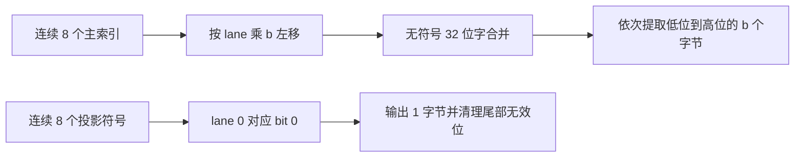
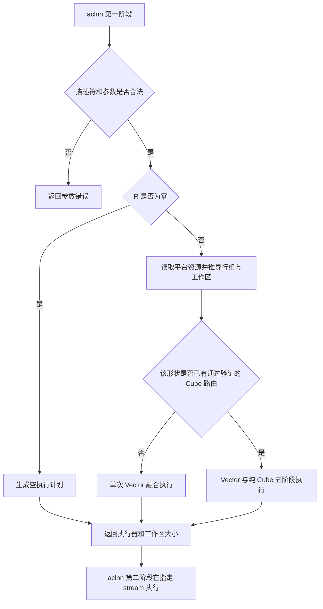
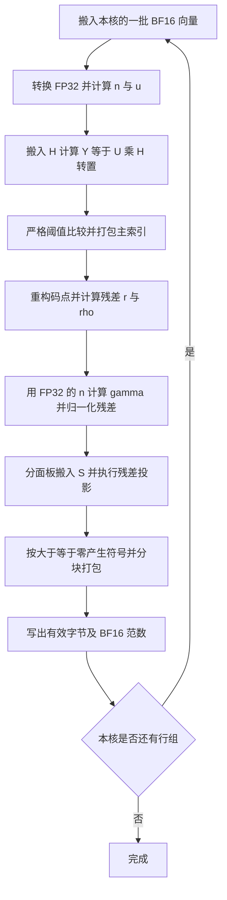

# KvCacheTurboQuant 算子设计

# 需求背景（required）

## 需求来源

本设计承接社区任务《kv_cache_turbo_quant 算子开发任务书》，以随任务提供的 `op.json`、`golden.py` 和 `case.json` 确定可执行接口、编码规则及基础用例。目标是在 Atlas 800T A2 上使用 Ascend C 实现标准 MHA/GQA 场景的在线 KV 向量压缩，通过 aclnn 两段式接口调用。

本文交付算子设计及后续验证方案，不包含算子实现、实验数据或性能达标结论。

## 背景介绍

### 业务场景

长上下文推理中，KV cache 容量随 token 数增长。每个 BF16、128 维 KV head 占 256 字节，低位宽编码可以降低持续驻留的缓存容量。任务采用 TurboQuant 的旋转、标量主量化和 QJL 残差符号编码思路；默认主量化占 3 bit/channel，残差符号占 1 bit/channel，另保存两个 BF16 范数。

算子每次接收 K 或 V 中的一种，返回四个独立张量。上层按需分别调用 K、V 编码，并保存所使用的旋转矩阵、投影矩阵和位宽信息。算子不负责分页缓存寻址、历史缓存搬迁、attention 计算或反量化。

### 参考实现现状分析

`golden.py` 在 FP32 中完成范数、旋转、阈值比较、残差归一化和高斯投影，再将范数转换为 BF16。PyTorch eager 路径包含多次算子调用、中间张量分配及打包操作；Ascend C 实现的优化重点是减少这些开销，复用矩阵数据及片上中间结果。

任务书给出了矩阵和范数类型的扩展描述，而随附 `op.json` 的实际签名固定为 BF16 KV、FP32 矩阵和 BF16 范数。本设计先完整实现该签名，矩阵 BF16 和范数 FP16 不作为已支持能力。

### 功能分析

对每个 token 的每个 KV head 独立编码，不跨 token/head 归约。两个矩阵供所有向量共享；没有通用的 Tensor 广播语义。默认 `head_dim=128`、`qjl_dim=128`、`mse_bits=3` 时，四个输出合计 68 字节/head，约为原始 BF16 向量容量的 1/3.76。

# 需求分析（required）

## 需求描述

实现 `KvCacheTurboQuant` 编码算子，支持 2/3/4 bit 主编码，默认 3 bit。统一固定维度的主码本、比较边界和低位优先打包方式；所有有效输出字节必须具有确定的含义，不能依赖未初始化内存。

标准 MHA/GQA 中的 KV head 可直接使用该接口。MLA 的低秩联合 latent 与独立 RoPE 分支不属于普通 KV head，本设计不将二者拼接后作为普通向量处理。混合 3.5-bit、channel 分组和 outlier 位宽分配不在本算子范围内。

## 需求拆解

| 需求 | 设计承接 |
| --- | --- |
| 在线编码、固定矩阵 | 矩阵由调用者提供并在缓存生命周期内保持一致；不在 kernel 内生成随机数 |
| 主量化与 QJL | 使用任务码本，先旋转量化，再对归一化残差做投影 |
| 2/3/4 bit | 三组静态码本及位打包专用分支 |
| BF16/FP32 接口 | 三输入、四输出、一个整数属性，见下文原型 |
| 多核与片上复用 | 按完整向量行组分核，投影不在 K 维跨核拆分 |
| 小规模调用 | 融合 Vector 路径减少启动和中间落盘 |
| prefill 吞吐 | 规划 FP32 Cube 投影路径，保留 Vector 正确性路径；性能选择须以后续实测为依据 |
| 精度和边界 | 保留严格阈值比较、零值符号、范数舍入及位序；分别验证编码与应用误差 |
| 提交内容 | 本阶段仅 `docs/design.md`，不提交实验报告或占位实现代码 |

# 详细设计（required）

## 算子分析

### 符号与支持形状

令 `T=num_tokens`、`Hkv=num_kv_heads`、`D=head_dim=128`、`Q=qjl_dim`、`b=mse_bits`、`R=T*Hkv`。`H` 表示旋转矩阵，`S` 表示 QJL 矩阵，避免与 head 数混淆。

| 参数 | 方向 | 数据类型 | ND 形状 | 约束 |
| --- | --- | --- | --- | --- |
| kv_vectors | 输入 | BF16 | `[T,Hkv,128]` | `T>=0`，`4<=Hkv<=32` |
| rotation_matrix | 输入 | FP32 | `[128,128]` | 有限值、正交矩阵，按行连续 |
| qjl_matrix | 输入 | FP32 | `[Q,128]` | `Q>0`；默认用例 `Q=128` |
| mse_bits | 属性 | int64 | 标量 | `{2,3,4}`，算子属性默认值 3 |
| quant_idx | 输出 | UINT8 | `[T,Hkv,16*b]` | 每个 head 独立打包 |
| quant_qjl | 输出 | UINT8 | `[T,Hkv,ceil(Q/8)]` | 最后一个字节未使用的高位清零 |
| quant_norm | 输出 | BF16 | `[T,Hkv]` | 输入范数 |
| quant_gamma | 输出 | BF16 | `[T,Hkv]` | 原尺度残差范数 |

`Q` 从矩阵第一维推导，不新增属性。非 128 的正整数 `Q` 沿投影输出维分块处理，仍使用 128 维主码本；不把 QJL 维度变化误当成 KV head 维度变化。除空输入外，所有张量须具有足够存储空间。元素数量及字节数乘法均需检查溢出。

### 数学公式与 golden 对齐

将 `[T,Hkv,128]` 视为 `[R,128]`。以下对一行列向量 `x` 描述，计算均使用 FP32，`eps=1e-30` 为 FP32 常量：

```text
n = sqrt(sum_i x[i]^2)
u = x / max(n, eps), if n > 0; otherwise u = 0
y = H @ u
threshold[k] = FP32((centroid[k] + centroid[k+1]) * 0.5)
idx[i] = count_k(y[i] > threshold[k])
y_hat[i] = centroid[idx[i]]
r = y - y_hat
rho = sqrt(sum_i r[i]^2)
gamma = n * rho
v = r / max(rho, eps), if rho > 0; otherwise v = 0
z = S @ v
qbit[j] = 1, if z[j] >= 0; otherwise 0
quant_norm = BF16(n)
quant_gamma = BF16(gamma)
```

行主序批量写法为 `Y=U @ H^T`、`Z=V @ S^T`，两次投影都转置右操作数。保留残差归一化与 clamp：虽然正比例缩放在实数域不改变符号，但浮点边界、极小值和零残差行为必须对齐 `golden.py`。

码本取自任务随附 `CENTROIDS`，下表是非负半边；完整码本由其负数逆序与正数正序拼接，并在使用前转换为 FP32：

| b | 正半边码本 |
| --- | --- |
| 2 | `0.04002048075, 0.1335033178` |
| 3 | `0.02166347019, 0.06682205945, 0.1187859178, 0.19020693` |
| 4 | `0.01134236995, 0.03428063914, 0.05802082643, 0.08325428516, 0.1109927073, 0.1429702938, 0.1828317791, 0.2414890379` |

阈值先由已转换为 FP32 的相邻码点相加，再乘 FP32 的 0.5，避免用双精度预计算后一次舍入改变边界。恰好落在阈值上的元素进入较低编号桶；投影恰好为零（含正负零）时符号位为 1。BF16 输出采用最近偶数舍入，`gamma` 必须由 FP32 的 `n` 计算，不能先把 `n` 截断为 BF16 再参与乘法。

### 边界行为

| 场景 | 定义 |
| --- | --- |
| `x=0` | `n=0,u=0,y=0`，所有主索引为 `2^(b-1)-1`；码本没有零，因此残差一般非零，QJL 仍按矩阵投影计算；`norm=gamma=0` |
| `rho=0` | `v=0,gamma=0`，所有有效 QJL 位为 1；尾字节无效位保持 0 |
| `0<n<eps` 或 `0<rho<eps` | 分母使用 `eps`，不替换成无条件单位化 |
| 输入或矩阵含 NaN/Inf | 不在有效输入域内，不定义可用于验收的编码结果 |
| 大有限输入 | 有效输入须保证 FP32 平方归约、中间运算和输出范数不溢出；不声称覆盖 BF16 全数值范围 |
| `T=0` | 返回形状正确的空输出，用户工作区为零，无计算 kernel 启动 |
| 非法 shape/type/属性 | 在 Host/aclnn 校验阶段返回参数错误，不启动 kernel |

矩阵正交性和高斯分布是调用者的数据契约，不在每次在线编码时拷回 Host 检验。H 可为规范化 Hadamard 或预生成的随机正交矩阵；S 使用固定的独立标准高斯样本。功能编码不要求 kernel 判断这些统计属性，但论文相关质量结论依赖对应前提。

### 位打包与物理布局

每连续 8 个主索引组成一个无符号 32 位字。所有移位均在 `uint32` 内完成，`b=4` 时最大左移 28 位：

```text
word = OR_lanes(uint32(idx[8*g+lane]) << (lane*b)), lane=0..7
quant_idx[g*b+k] = (word >> (8*k)) & 255, k=0..b-1

quant_qjl[g] = OR_lanes(uint32(qbit[8*g+lane]) << lane), lane=0..7
```

QJL 尾组超过 Q 的 lane 视为 0。每个 head 的字节流重新从第 0 位开始，不跨 head 合并。主编码的 3-bit 模式每 8 维占 3 字节，允许单个索引跨字节；不能按“一字节放两个 3-bit 索引”实现，否则会改变存储格式。



四个输出分别连续存储，不能把每行实际存储补成对齐后的长度。UB 中的对齐空隙不计入对外张量。

| b，Q=128 | 主编码 | QJL | 两个 BF16 范数 | 合计字节/head | bit/channel | 相对 BF16 压缩比 |
| --- | ---: | ---: | ---: | ---: | ---: | ---: |
| 2 | 32 | 16 | 4 | 52 | 3.25 | 4.92x |
| 3 | 48 | 16 | 4 | 68 | 4.25 | 3.76x |
| 4 | 64 | 16 | 4 | 84 | 5.25 | 3.05x |

一般容量公式为 `16*b + ceil(Q/8) + 4` 字节/head。以上为缓存有效载荷比值，不含共享 H/S、分配器对齐、分页元数据和编码时临时工作区。默认的“3+1 bit”不是论文混合平均 3.5-bit 模式。

### 编码消费约定

主重构为 `x_mse = n * H^T * centroid(idx)`。QJL 字节解包成 `s_j=2*qbit_j-1` 后，若 S 元素独立服从 `N(0,1)`，用于内积估计的重构可写为：

```text
x_hat = H^T * (n*centroid(idx) + gamma*sqrt(pi/2)/Q * S^T*s)
ip_hat(q,x) = n * dot(H*q, centroid(idx))
              + gamma*sqrt(pi/2)/Q * dot(S*(H*q), s)
```

此处 n、gamma 在实际解码时来自 BF16 输出。QJL 无偏性是在理想算术、未舍入范数、非零范数未触发 clamp，且 S 与待编码残差独立的前提下，对随机 S 的期望性质；不能推导为固定 S 对每个 query 的相对误差保证。S 若采用其他缩放，解码系数也必须相应调整。此消费约定用于说明编码含义和规划验证，不增加 decode 或 attention 算子交付。

## 算子实现

### 对外算子原型

以下为拟实现的 aclnn C 接口；名称、参数顺序与三输入四输出的算子定义对应。`mseBits` 在 C 调用时显式传入，默认 3 是算子属性语义。

```cpp
aclnnStatus aclnnKvCacheTurboQuantGetWorkspaceSize(
    const aclTensor *kvVectors,
    const aclTensor *rotationMatrix,
    const aclTensor *qjlMatrix,
    int64_t mseBits,
    const aclTensor *quantIdx,
    const aclTensor *quantQjl,
    const aclTensor *quantNorm,
    const aclTensor *quantGamma,
    uint64_t *workspaceSize,
    aclOpExecutor **executor);

aclnnStatus aclnnKvCacheTurboQuant(
    void *workspace,
    uint64_t workspaceSize,
    aclOpExecutor *executor,
    aclrtStream stream);
```

第一阶段检查描述符、类型、rank、形状、连续性、属性、设备一致性及输出容量，完成推导和执行计划；第二阶段在指定 stream 上异步执行。输出描述符虽然使用 `const aclTensor*`，其底层数据是写入目标。输入和输出不允许重叠，四个输出之间也不允许重叠。矩阵内容可在不同调用之间更换，但同一批已编码缓存必须关联其原矩阵。

本设计首先支持连续 ND，不隐式增加非连续输入拷贝。必要的非连续转连续由调用者完成，并在后续性能口径中单独说明。成功返回 `ACLNN_SUCCESS`；空指针、非法类型/shape/位宽和工作区不足按仓库 aclnn 错误处理规范返回错误，不自行分配一套错误码。

### 实现方案

#### Host 侧设计

**形状推导与执行路径。** 固定 D=128；推导 `R`、Q、主输出行长 `Bi=16*b` 和 QJL 行长 `Bq=ceil(Q/8)`。所有计数与地址计算使用经溢出检查的 64 位整数。通过平台信息获取 AIV/AIC 数量、UB/L1/L0 容量，不把某个 A2 型号的核数写死。

规划两条路径：Vector 融合路径作为完整功能基线和小 R 路径；大 R 候选使用分阶段 FP32 Cube 投影。默认验证入口为 Vector 路径。在 Cube 通过同一 golden、边界及性能验证前，不依据未经测量的 token 阈值自动启用；启用后由 Host 中经过验证的形状路由表选择，不扩展对外属性。



**分核。** 每核拥有完整的行组，不拆分单行的范数或投影归约。为避免相邻核心写入同一 32 字节输出块，行组大小设为：

```text
L = lcm(32/gcd(Bi,32), 32/gcd(Bq,32), 16)
G = ceil(R/L)
C = min(G, availableAivCores)
q = floor(G/C), rem = G mod C
groups(c) = q + (c < rem)
startGroup(c) = c*q + min(c,rem)
```

因为范数每行 2 字节，L 至少为 16；Q=128 时 L=16，一般 Q 下最多为 32。不同核心负责的主码、QJL 和范数区间起点均满足 32 字节边界。最后不足 L 的行只归属最后一个有效核心，按真实有效长度写回。`R=8` 时使用一个核处理该行组，接受利用率较低以避免额外压紧 kernel 和跨核短写竞争。

**Tiling 参数。** 包括 `R,Q,b,Bi,Bq,L,usedCoreNum,groupsPerCore,extraGroups,tileRows,matrixPanelRows,qjlPackChunkBytes,route`，以及 Cube 路径的两套矩阵乘 tiling 数据和工作区偏移。小尾块由起止行和 R 计算，不预设所有核心数据量相同。

| TilingKey 规划 | 路径 | 位宽 | 说明 |
| --- | --- | --- | --- |
| 102 / 103 / 104 | Vector | 2 / 3 / 4 | 同一主流程，码本与主码打包专用化 |
| 202 / 203 / 204 | Cube 候选 | 2 / 3 / 4 | 同一算子的多 kernel 执行计划；仅在验证后启用 |

Q 的矩阵尾块、行尾块和空输入均有显式处理，不按 Q 创建大量编译分支。空输入不进入上述计算 key。

#### Kernel 侧设计：Vector 融合路径

整个流程采用 A2 支持的 SIMD 内存矢量计算 API，不使用 Ascend 950 专属 Regbase/SIMT 指令。沿 128 维执行 FP32 乘法与归约，范数和两次投影均不通过 BF16/HF32 中间值近似。



1. **CopyIn 与归一化：** 输入队列按整批行搬入，Cast 为 FP32；逐行计算平方和及平方根，按 golden 的零值和 clamp 规则除法。中间 n 保持 FP32。
2. **旋转：** H 的一行与一条 u 做 128 元素点积，产生一个 y 分量；矩阵行数据在当前 tile 的多条 u 之间复用。128 维不进行跨核 K 切分，避免跨核归约和原子操作。
3. **量化：** 对 3/7/15 个阈值进行严格大于比较，累计为桶编号；从固定码本重构。可以采用等价的静态二分搜索，但必须保留所有阈值相等时落入低桶的规则。先完成主码打包，再释放主索引缓冲。
4. **残差：** y 缓冲原位复用为 r，再归一化成 v。计算 gamma 时读取 FP32 n。矩阵 H 在全部旋转完成后释放，同一矩阵缓冲改用于 S 面板。
5. **QJL：** 每个 S 面板处理 16 个投影方向，最后面板只计算有效行。符号在最多 256 个方向的分块中组装成最多 32 字节/向量，不为任意 Q 申请全量片上 Z。每个打包块重新清零，尾字节按 Q 屏蔽。
6. **CopyOut：** 主码、QJL 和两个范数各写入自己的连续张量；QJL 分块按目标行 stride 写入。采用支持精确字节长度的 GM 搬运，UB padding 不写回。输入/输出队列的切换和矩阵面板覆盖均遵守生产者完成后消费者使用的同步顺序。

QJL 的 UB 输出按每行固定 32 字节槽位组织。令当前分块的字节偏移为 `byteOffset`，`validBytes=min(32,Bq-byteOffset)`，则 UB→GM 搬运使用 `blockCount=有效行数`、`blockLen=validBytes`、`srcStride=0`、`dstStride=Bq-validBytes`，GM 起点为 `startRow*Bq+byteOffset`。其中源 stride 单位是 32 字节块，目标 stride 单位是字节；短块的 UB 行起点仍相隔 32 字节。因此 Q=128 的 16 字节行和 Q=257 的最后 1 字节块都不能按紧凑短行直接套用该多块搬运。若 Q 很大而目标 stride 超出搬运字段范围，改为逐行单块搬运，以 64 位 GM 地址定位。主码和两个范数分别在 UB 紧凑排列，按连续有效总字节数搬出；必要时拆分满足 API 长度限制。

**片上缓冲预算。** 定义 `A32(x)=ceil(x/32)*32`，tile 行数 M 是 L 的倍数。以下为容量上界，所有独立 buffer 的起点均 32 字节对齐：

| 缓冲 | 字节数 | 生命周期与复用 |
| --- | ---: | --- |
| 矩阵 arena | 65536 | 旋转阶段保存完整 H；之后复用为两份 `16*128*4=8192` 字节 S 面板 |
| BF16 输入双缓冲 | `2*A32(256*M)` | 当前 tile 与下一 tile 输入 |
| FP32 u | `A32(512*M)` | 旋转结束后可释放 |
| FP32 y/r/v | `A32(512*M)` | 三阶段原位复用 |
| UINT32 主索引 | `A32(512*M)` | 主打包和重构完成后可释放 |
| n、rho、gamma | `3*A32(4*M)` | 保留 FP32 标量直到输出转换完成 |
| 输出双缓冲 | `2*(A32(64*M)+A32(32*M)+2*A32(2*M))` | 按最大主码、32 字节 QJL 分块和两个 BF16 数组预算 |
| 点积乘积及归约 | `512+32` | 逐行复用；128 个 FP32 乘积和归约临时区 |
| 码本与阈值 | 128 | 最大 16 个码点与 15 个阈值 |
| 临时区预留 | 8192 | 比较 mask、Cast、位打包重排及辅助操作；实现时按真实分配细化 |

对 `M` 为 16 的倍数，合计 `U(M)=74400+2260*M` 字节。若平台可用 UB 为 192 KiB，`Q=128,L=16,M=48` 时为 182880 字节，约 93.0%；`M=64` 会超限，故不能选择。`L=32` 时最大候选为 M=32。M 表示分配容量，实际有效行数为 `m=min(M,本核剩余行数)`；例如 R=8 时可分配 M=16，仅搬运、计算和写回 8 行。小任务的分配容量只需覆盖向上取整到 L 的本核行数，不为了填满 UB 减少可用核心。

Host 从满足预算的 L 倍数中选择最大 M；如果新增 API 临时区使预算增大，必须重新减小 M。8192 字节预留是设计预算，不代表所有 API 实际用量已实测。同步事件、队列深度、临时缓冲的每一项实际申请均须计入实现时预算；不允许把 H 和 S 两份完整矩阵与该预算同时常驻。

**同步与尾部。** 输入搬运完成后才能执行 Cast/归约，矢量计算完成后才能读取标量结果或发送输出搬运；输出传输完成后才能复用相应队列。矩阵 arena 从 H 改作 S 前，必须等待全部 H 读操作结束。行尾不读越界输入；Q 尾面板和 bit 尾均按有效数处理。不存在跨核共享中间结果，因此本路径不需要核间屏障。

#### 大规模优化：纯 Cube 与 Vector 分阶段路径

两次稠密投影的工作量约为 `2*R*128*(128+Q)` FLOP；默认 Q=128 时为 `65536*R`。大 R 下逐点积的 Vector 路径可能受归约指令与发射开销限制，因此规划以下五阶段实现，而非把 Vector 的性能外推为 prefill 已达标：

| 阶段 | 执行单元 | 输入到输出 | 同步边界 |
| --- | --- | --- | --- |
| 1 | AIV | X → FP32 U，保留 FP32 n 并输出 BF16 norm | 同 stream 下一 kernel |
| 2 | 纯 AIC | `U[R,128] * H^T[128,128]` → FP32 Y | 完成后再执行残差阶段 |
| 3 | AIV | Y → idx、FP32 V、BF16 gamma | 使用阶段 1 的 FP32 n |
| 4 | 纯 AIC | `V[R,128] * S^T[128,Q]` → FP32 Z | 完成后再打包符号 |
| 5 | AIV | Z → bit-packed QJL | 只写有效输出字节 |

Host 使用 A2 Matmul 高阶 API 生成 FP32 输入、FP32 输出、右矩阵转置、K=128 的 tiling。沿 M/N 划分完整输出块，不做跨核 split-K。AIC 数量独立于 AIV 数量；每个 Cube tile 的 L1/L0A/L0B/L0C 占用、尾块及 API 工作区由矩阵乘 tiling 约束校验。

两个纯 Cube kernel 显式禁用 HF32，Host 侧数学模式与 Device 侧 `SetHF32(false,0)` 配对。此接口只能用于纯 Cube 路径，不能在 Vector/Cube 混合 kernel 中直接套用。禁止为提高吞吐静默把 H、S 或中间向量转换为 BF16。即便关闭 HF32，Cube 与 eager 的归约顺序也可能不同，仍须验证量化边界、投影符号和 BF16 范数结果。

用户工作区规划为两块可复用矩阵区和一块范数区：

```text
WA = align(4*R*128)          // 先 U，阶段 3 后复用为 V
WB = align(4*R*max(128,Q))   // 先 Y，阶段 4 后复用为 Z
WN = align(4*R)             // n 的 FP32 保存区
Wuser = WA + WB + WN
Wtotal = Wuser + Wsystem    // 系统/API 工作区另行查询，偏移按其契约对齐
```

`align` 按实际 kernel/API 要求取至少 32 字节的地址对齐，并用 64 位计算。默认最大给定用例 `R=16384,Q=128` 时，三块有效载荷合计 16842752 字节，约 16.06 MiB，尚未包含 API 工作区及额外对齐。该空间是编码时峰值开销，不混入 68 字节/head 的持久缓存比值。

五个 kernel 在同一 stream 顺序执行，以 kernel 完成边界保证 GM 中间量可见；不让 AIV 直接访问另一核心的 UB/L0。该路径中的 AIV 阶段只保留自己需要的行缓冲，不申请 Vector 融合路径的 H arena；AIC 阶段资源单独由 Matmul tiling 检查。跨阶段复用 WA/WB 必须遵守表中最后一次读取的生命周期。

#### A2 API 使用依据

API 来源为 CANN 官方 `asc-devkit` 文档，核对产品支持和数据类型；以下是设计选择依据，并非编译/运行验证记录。

| 操作 | 拟采用接口或机制 | 需要落实的约束 |
| --- | --- | --- |
| 平台资源 | `PlatformAscendC` 的 AIV/AIC 核数、内存容量查询 | 使用实际设备信息，查询失败应返回错误 |
| BF16 与 FP32 转换 | `Cast` | BF16→FP32 精确扩展；FP32→BF16 最近偶数舍入 |
| 点积及范数 | FP32 `Mul`、`ReduceSum`，随后平方根/除法 | 单行 count=128，地址及临时区按对应 API 要求设置 |
| 量化比较 | 浮点比较生成 mask，再累计桶编号 | 主阈值用 GT，QJL 用 GE；不能交换边界规则 |
| 位打包 | UINT32 移位/逻辑组合，再提取字节 | A2 支持的操作数类型；不假定存在 UINT8 矢量移位 |
| 精确输出搬运 | `DataCopyPad` 的 UB→GM 变体 | `blockLen` 是有效字节数；源 stride 与目标 stride 的单位须分别按接口核对 |
| 投影优化 | A2 Matmul 高阶 API、纯 Cube `SetHF32` | FP32、右矩阵转置、禁 HF32；资源 tiling 和精度另验 |
| 流水 | `TQue` / `TPipe` 与必要事件 | 队列完成关系和标量/矢量间依赖显式处理 |

### 工程组织与性能优化

未来实现落入 `ops-transformer/experimental/attention/kv_cache_turbo_quant/`，按仓库现行 aclnn 算子规范组织 `op_api`、`op_host`、`op_kernel`、`docs` 和测试目录。当前设计文档 PR 提交到社区任务仓的团队 `docs/design.md`，不把两个仓库的职责混用。

优化依次关注启动次数、矩阵复用、归约和打包开销，再评估 Cube 路径。小 R 优先融合；大 R 比较 Vector 与五阶段 Cube 的总延迟，并核算工作区峰值。规范化 Hadamard 的快速变换仅为后续可选方向：当前接口允许任意正交矩阵，不能仅凭 shape 将所有 H 替换成快速 Hadamard 变换。

## 支持硬件

| 目标 | 说明 |
| --- | --- |
| Atlas 800T A2 | 使用 A2 对应能力，平台核数及内存容量运行时查询 |
| 开发环境 | 按任务要求使用 CANN 9.1.0 及以上环境和 Ascend C，具体 API 以目标环境匹配头文件为准 |

## 算子约束限制

固定 KV head 维度为 128，支持 4～32 个 KV head、2/3/4 bit 主量化及正整数 Q。输入为连续 ND、有效有限数值，矩阵在一次调用内只读。无输入输出别名、无原地编码、无通用广播。当前仅实现任务 `op.json` 声明的类型组合；其他矩阵/范数类型、MLA、混合位宽和融合 attention 均不隐含支持。

# 可维可测分析

## 精度标准/性能标准

| 验收项 | 标准与口径 | 来源与状态 |
| --- | --- | --- |
| 编码一致性 | 逐个 UINT8 输出精确比较；BF16 norm/gamma 按给定用例零容差检查 | `golden.py`、`case.json`；计划验证 |
| 向量重构 | 任务要求 `MSE / ||x||² < 0.05` | 任务书；MSE 是否含除以 D 需锁定定义 |
| 内积估计 | 相对误差 95th percentile `<0.1` | 任务书；query 数据、近零分母口径需锁定 |
| 算子加速 | 等价 PyTorch eager reference 对比，encode 加速 `>=10x` | 任务书；待后续设备实测 |
| prefill 吞吐 | 编码服务速率不低于模型 KV 生成速率 | 任务书；须在指定模型、batch 和上下文长度下独立验证 |

编码一致性和应用质量是两类检查。离散边界敏感，不能因为重构误差较小就允许任意 bit 不一致，也不能因为均为 FP32 就宣称逐位相同。给定 case 的 norm/gamma 为零容差，这是实现风险项；后续应定位归约顺序、平方根、除法和舍入差异，不自行放宽阈值。

为避免掩盖指标差异，规划同时报告 `NMSE=sum((x_hat-x)^2)/sum(x^2)`，以及任务文字直译的 `mean((x_hat-x)^2)/sum(x^2)=NMSE/D`，正式验收口径需与任务方一致。分别报告主重构 `x_mse` 和带 QJL 的 `x_hat`，不能在二者之间择优替换。QJL 旨在纠正内积偏差，不承诺每条向量的欧氏重构误差都更低。

内积误差使用未量化的 FP32 q，按前述消费公式计算。对 `dot(q,x)=0` 的样本，相对误差无定义；需单列数量及绝对误差。接近零的分母同时报告绝对误差及分母分布，不静默加 epsilon 或删除样本后声称达标。零向量单独做确定性检查，不纳入除以其范数的比值。固定 S 下的随机独立 query 可能难以达到相对误差 P95 门槛，质量要求必须绑定明确的数据集与 query 分布。

### 基础用例覆盖

以下 baseline 为任务书给出的参考值，不是本设计的实测结果。右列仅按 `baseline/10` 推导对应延迟目标。

| 用例 | `[T,Hkv,D]` | b | Q | 任务 baseline（μs） | 10x 对应上限（μs） |
| --- | --- | ---: | ---: | ---: | ---: |
| gqa_decode_b1 | `[1,8,128]` | 3 | 128 | 1491.676 | 149.1676 |
| gqa_decode_b64 | `[64,8,128]` | 3 | 128 | 1552.784 | 155.2784 |
| gqa_prefill_t2048 | `[2048,8,128]` | 3 | 128 | 3855.422 | 385.5422 |
| gqa_mse2_t2048 | `[2048,8,128]` | 2 | 128 | 3607.963 | 360.7963 |
| gqa_mse4_t2048 | `[2048,8,128]` | 4 | 128 | 5286.502 | 528.6502 |

### 后续测试设计

| 类别 | 规划覆盖 |
| --- | --- |
| 主码本 | 三种位宽全部桶、阈值相等/两侧邻近值、最大编号、3-bit 跨字节 |
| 范数与符号 | 零输入、极小有效值、零残差、投影零值/两侧邻近值、BF16 舍入边界 |
| Shape 与尾部 | Hkv=4/32，空 T，行数不能均分核心，Q=1/7/8/9/127/128/129/257 的面板、字节及打包块尾部 |
| 矩阵语义 | 规范化 Hadamard、固定随机正交 H、非对称 H 与 S 用于识别转置方向错误；相同矩阵重复调用 |
| 输出安全 | 四个输出的实际字节长度、尾部守护区、跨核相邻行、QJL 无效位清零 |
| 接口负例 | 非法 rank/D/Hkv/Q/b/dtype、非连续输入、别名、空指针、溢出尺寸与工作区不足 |
| 路由等价 | 所有启用路径分别对 golden；Cube 关闭 HF32后仍单独验证离散边界 |

现有 `case.json` 引用了 `data/rotation_matrix.bin` 和 `data/qjl_matrix.bin`，本地任务包未随附这两个文件，也没有给定应用质量测试的 query 数据。后续实验前须取得原矩阵文件或经任务方确认的生成方式、种子及缩放，并固定数据记录；不能把 `value_range` 的均匀随机填充当成正交 H 或标准高斯 S。

性能实验计划采用同一设备、同一输入、同一 H/S 和同一 b，完成预热后重复计时并报告分布；区分设备端 encode 总时间与含 Host 执行计划的端到端时间。Cube 路径的全部五阶段必须计入 encode 时间。排除数据生成、编译、磁盘读取和验证回拷；eager 与算子使用一致的同步、计时范围。最终 10x 判定应基于同环境重测的等价 eager，任务书参考值用于对照，不跨环境拼接加速比。

本阶段不执行上述测试，也不输出性能截图、自测日志或虚构通过率。

## 兼容性分析

这是新增算子，输出格式由本设计明确固定。上层缓存元数据需关联 D、Q、b、H/S 标识和码本约定；矩阵或位宽改变后不能继续按旧参数消费缓存。K、V 可以采用不同的矩阵配置，但必须分别保存关联关系。四张量输出不自动兼容现有 INT8 cache、分页布局或 attention kernel，需要后续集成侧按消费契约适配。

## 参考资料

- 用户提供的任务书、`golden.py`、`op.json`、`case.json`：接口、码本、用例和验收要求的直接依据。
- [社区任务提交规范](https://gitcode.com/cann/cann-competitions/blob/master/04_tasks/01_community-task-2026/README.md)与[设计模板](https://gitcode.com/cann/cann-competitions/blob/master/04_tasks/01_community-task-2026/resources/design_template.md)。
- [TurboQuant 论文](https://arxiv.org/abs/2504.19874)：算法背景；本文编码细节以任务 golden 为准。
- [CANNBot Tiling 设计](https://gitcode.com/cann/cannbot-skills/blob/master/ops/ascendc-tiling-design/SKILL.md)与[NPU 架构资料](https://gitcode.com/cann/cannbot-skills/blob/master/ops/npu-arch/SKILL.md)：用于资源、切分和边界检查。
- [Ascend C 官方 API 文档](https://gitcode.com/cann/asc-devkit/tree/master/docs/zh/api)：类型转换、归约、数据搬运和矩阵乘接口依据。
- [ops-transformer 贡献指南](https://gitcode.com/cann/ops-transformer/blob/master/CONTRIBUTING.md)：后续实现的工程组织依据。
