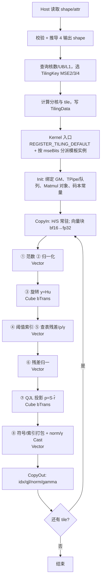

# KvCacheTurboQuant 算子设计文档

> 任务：2026 年 9 月 CANN 社区任务——KvCacheTurboQuant 算子开发（Ascend C / aclnn，Atlas 800T A2）
> 目标仓库：`cann/ops-transformer` → `experimental/attention/kv_cache_turbo_quant/`
> 提交形式：`cann-competitions` 仓库 `04_tasks/01_community-task-2026/tasklist/` 任务目录下 `docs/design.md`（以 PR 形式评审）
> 版本：v1.0｜日期：2026-09-23

---

## 1. 需求背景（required）

### 1.1 需求来源

本任务来自 2026 年 9 月 CANN 社区任务：实现面向标准 MHA/GQA KV cache 的在线向量量化压缩（Encode）算子。设计依据：

| 输入 | 文件 | 用途 |
| --- | --- | --- |
| 任务书 | `kv_cache_turbo_quant算子开发任务书.md` | 需求、验收标准、交付要求 |
| 接口定义 | `op.json` | 输入/输出/属性（权威） |
| 评测用例 | `case.json`（5 例） | shape、数据类型、`err_threshold`（权威） |
| 精度真值 | `golden.py`（`calc_expect_func`） | 评测期望值生成函数（唯一真值） |
| 算法来源 | TurboQuant 论文（arXiv:2504.19874）及后续评议（arXiv:2604.19528、arXiv:2606.21448） | 算法机制与位宽口径 |
| 数值实验 | 针对 `golden.py` 语义的复现实验（§1.2.5，方法随文说明） | 码本来源、打包布局、边界语义、翻转率、精度可达性 |
| 流程要求 | 任务书 §4/§5 | 设计文档 → 自测用例/报告 → 代码 PR 合入 `ops-transformer` |

### 1.2 背景介绍

#### 1.2.1 算子功能与存储格式

vllm-ascend 现有 KV cache 压缩方案为 INT8 静态量化（C8：per-channel scale+offset，压缩率 2x）与 LSH 哈希（KVComp：用于稀疏选择，不压缩存储）。本任务实现 TurboQuant 方案的 **Encode 部分（aclcnn 算子）**：输入 KV 向量，输出统一 3-bit MSE 主编码 + 1-bit QJL 残差编码及两个标量，量化在推理期在线完成。

以 `head_dim=128`、`mse_bits=3` 为例的存储格式（任务书 §2.3）：

| 组件 | 摊销 bit/channel | 总 bit（d=128） | 物理存储 | 说明 |
| --- | ---: | ---: | ---: | --- |
| `quant_idx`（主量化） | 3.000 | 384 | 48 B | bit-packed |
| `quant_qjl`（残差符号） | 1.000 | 128 | 16 B | bit-packed |
| `quant_norm`（向量范数） | 0.125 | 16 | 2 B | bf16 scalar |
| `quant_gamma`（残差范数） | 0.125 | 16 | 2 B | bf16 scalar |
| **合计** | **4.250** | **544** | **68 B** | vs 原始 256 B/head，压缩比 3.76x |

论文的 3.5 bit/channel 为 outlier/non-outlier 通道分组混合精度的平均位宽，不在首版范围内；首版为统一位宽（`mse_bits ∈ {2,3,4}`，默认 3）。

#### 1.2.2 相关实现对照

`ops-transformer` 的 `experimental/attention/` 下已有相关算子，场景与本任务的关系如下：

| 既有算子 | 场景与范围 | 与本任务的关系 |
| --- | --- | --- |
| `turbo_quant_sparse_flash_attention` | MLA、4-bit 码本、反量化融合在 attention 内（decode 侧） | 接口形态与功能范围不同（本算子为独立 Encode，输出编码与标量） |
| `turbo_quant_sparse_attn_sharedkv` | 同上（sharedkv 变体） | 同上 |
| `compressor` / `quant_compressor` | KV 压缩前处理，支持 Atlas A3/950，HIFP8 路线 | 目标平台与数据格式不同 |
| `scaled_cosine_attention_score` | 纯 Vector、单 kernel 的简单算子 | 本算子目录骨架与构建文件组织参照其结构（§2.3） |

本算子的功能定位：面向标准 MHA/GQA、主量化位宽可配置（`mse_bits` 2/3/4）、支持 Atlas 800T A2 的在线 Encode 算子；不含 Decode（精度验证所需的 Decode 在自测代码中以 Python 实现）。

#### 1.2.3 算法流程（两阶段量化，8 步）

输入向量 $x \in \mathbb{R}^{d}$（$d=128$），$b=\texttt{mse\_bits}$，码本电平表 $\mathbf{c}^{(b)}$（见 3.1.5）：

$$
\begin{aligned}
n        &= \lVert x\rVert_{2} \\[2pt]
u        &= \frac{x}{\max\left(n,\;10^{-30}\right)} \\[2pt]
y        &= H\,u \\[2pt]
\mathrm{idx}_{j} &= \sum_{k=1}^{\,2^{b}-1}\mathbb{1}\!\left[\, y_{j} \;>\; \tfrac{1}{2}\left(c_{k}+c_{k+1}\right) \right] \\[2pt]
\hat{y}  &= \mathbf{c}\left[\,\mathrm{idx}\,\right] \\[2pt]
r        &= y-\hat{y}, \qquad \rho = \lVert r\rVert_{2} \\[2pt]
\gamma   &= n\,\rho \\[2pt]
\tilde{r} &= \frac{r}{\max\left(\rho,\;10^{-30}\right)} \\[2pt]
\mathrm{qjl}_{i} &= \mathbb{1}\!\left[\, \left(S\,\tilde{r}\right)_{i} \;\ge\; 0 \right]
\end{aligned}
$$

| 数学符号 | 含义 | 数学符号 | 含义 |
| --- | --- | --- | --- |
| $x$ | 输入向量（`kv_vectors`，bf16，计算前转 fp32） | $\hat{y}$ | 主重构（旋转空间） |
| $n$ | 输入向量 L2 范数 → `quant_norm` | $\rho$ | 单位尺度残差范数 |
| $u$ | 单位球面向量 | $\gamma$ | 原尺度残差范数 → `quant_gamma` |
| $H$ | 正交旋转矩阵（`rotation_matrix`，输入） | $\tilde{r}$ | 归一化残差 |
| $y$ | 旋转空间坐标，$y=Hu$；`golden.py` 中实现为 `unit @ rotation.T`，即 $y_j=\sum_i H_{j,i}u_i$ | $S$ | QJL 高斯投影矩阵（`qjl_matrix`，输入） |
| $\mathrm{idx}$ | 主量化索引 → `quant_idx`（bit-packed） | $\mathrm{qjl}$ | 残差符号位 → `quant_qjl`（bit-packed） |

#### 1.2.4 数值语义要求（依据 `golden.py` 的复现实验）

以下四条语义由复现实验确认（方法：以独立脚本复算 `golden.py` 的运算符语义与边界样本）：

1. **判定方向不对称**：索引判定为**严格大于** `>`；QJL 判定为 `>=`（$S\tilde{r}$ 分量为 0 时计 1）。
2. **零向量与零残差**：范数与残差范数经 `max(·, 1e-30)` 截断（与 `golden.py` 的置零分支等价）；全零向量 $u=0 \Rightarrow \mathrm{idx} = 2^{b-1}-1$（2/3/4-bit 分别为 1/3/7）；残差为 0 时 `qjl` 位全 1。
3. **位打包布局**：每 8 通道一组、组内 LSB 优先、跨字节小端（详见 3.1.6）；基准向量 `88 C6 FA`(3bit) / `10 32 54 76`(4bit) / `4D`(1bit)。
4. **bf16 输出一次舍入**：`quant_norm`/`quant_gamma` 全程 fp32 计算，写回前做一次 bf16 舍入。

#### 1.2.5 设计输入：数值实验与耗时构成

以下数值由设计前完成的复现实验得到（代码路径：旋转以 fp32 矩阵乘执行后按 §1.2.3 流程量化）：

1. **索引翻转率（fp32 累加顺序敏感性）**：同一随机数据分别以 fp32 与 fp64（高精度参考）累加执行旋转后量化，2,097,152 个坐标中索引不一致 1 个（≈4.8e-7）。该量级表明：fp32 累加顺序差异带来的索引不一致率为 1e-7 量级；若评测要求逐位全等，则该要求与浮点实现方式的约束需先对齐（见 1.3）。
2. **精度可达性（按论文 Algorithm 1/2 反量化式统计，40,000 组随机样本）**：

   | mse_bits | relMSE（仅主量化） | relMSE（含 QJL） | 内积误差 p95（分母 ‖q‖‖x‖） | 内积误差 p95（分母 $\lvert\langle q,x\rangle\rvert$） |
   | ---: | ---: | ---: | ---: | ---: |
   | 2 | 0.116 | 0.413 | — | — |
   | 3 | 0.034 | 0.121 | 0.032 / 0.060 | 2.262 / 4.260 |
   | 4 | 0.0093 | 0.033 | — | — |

   （内积列为"仅主量化 / 含 QJL"两组；分母为 $\lvert\langle q,x\rangle\rvert$ 时，$q$、$x$ 独立随机导致分母近似零化，比值分布发散。）
3. **耗时构成**：任务书基线的 T=1 用例 1491.676 µs、T=64 用例 1552.784 µs（向量数 ×64，耗时差 61.108 µs），耗时以固定开销（小算子下发与设备同步）为主；t2048 用例计算量约 1.07 GFLOP（两次 $2\times16384\times128\times128$ 规模的矩阵乘）。

### 1.3 契约基线与提交前确认项

**契约基线**：评测期望值由 `golden.py:calc_expect_func` 生成（`case.json` 的 `expect_func` 字段）。本设计的正确性基线为复刻 `golden.py` 的数值语义（§1.2.4）。

**待确认项**（已通过 issue 提交主办方：[cann/ops-transformer#5627](https://gitcode.com/cann/ops-transformer/issues/5627)，含实测数据）：

1. **输出比对规则**：`case.json` 中 `quant_idx`/`quant_qjl`（uint8 位打包）的 `err_threshold=[0,1e-5]`、`quant_norm`/`quant_gamma`（bf16）的 `err_threshold=[0,0]` 的具体判定方式——是否按《生态算子开源精度标准》的整体判定（matched_ratio ≥ 0.99）？`err_threshold` 两数是否为 rtol/atol、是否要求全元素满足？（依据：fp32 累加顺序差异实测索引翻转率 ≈4.8e-7，见 §1.2.5。）
2. **MSE 精度口径**：任务书 §3.2 的"量化-反量化后的向量重构误差"按"仅主量化重构（MSE-only）"还是"含 QJL 残差项的完整反量化"统计？该口径决定 2/3-bit 用例的达标结论（实测数据见 §1.2.5）。
3. **内积误差口径**：任务书 §3.2 公式分母为 $\lvert\langle q,x\rangle\rvert$。当 $q$、$x$ 为独立随机向量时该比值分布发散（实测 p95≈2.26）；分母改为 $\lVert q\rVert\lVert x\rVert$ 时 3-bit 实测 p95 为 0.032（仅主量化）/0.060（含 QJL）。需确认评测时 $q$ 的构造方式或指标实现口径。
4. **零向量边界（按 golden 复刻说明）**：全零向量量化索引 $=2^{b-1}-1$（2/3/4-bit 对应 1/3/7），本实现严格按 `golden.py` 复刻；如评测预期与此不同请指出。

**处理策略**：答复前，自测报告对 MSE 与内积指标按两种口径同时输出（含 matched_ratio/翻转率统计）；该事项不改变实现范围与接口设计。

**接口实现范围（依据 `op.json`/`case.json` 收窄）**：任务书描述 `rotation_matrix`/`qjl_matrix` 支持 float32/bfloat16，`op.json` 与全部用例仅提供 float32，首版仅实现 fp32 矩阵输入；`quant_norm`/`quant_gamma` 任务书描述 float16/bfloat16，实际接口为 bfloat16，首版仅实现 bf16 输出。

---

## 2. 需求分析（required）

### 2.1 需求描述

使用 Ascend C 实现 `KvCacheTurboQuant`（aclnn 工程化交付，随 `ops-transformer` 仓合入），需求项：

1. 输入：`kv_vectors [T,H,128]`（bf16）、`rotation_matrix [128,128]`（fp32）、`qjl_matrix [128,128]`（fp32）；属性 `mse_bits ∈ {2,3,4}`（默认 3）；
2. 输出：`quant_idx`（uint8，bit-packed，长度 `128·b/8`）、`quant_qjl`（uint8，16 B）、`quant_norm`/`quant_gamma`（bf16，`[T,H]`）；
3. 数值语义与 `golden.py` 一致（§1.2.4、§3.1.5、§3.1.6）；
4. 在线量化，无训练/校准步骤（码本、$H$、$S$ 由外部给定，推理期固定）；
5. 精度与性能满足任务书 §3.2/§3.3（口径问题见 §1.3 与 §5.1）；
6. 仅支持标准 MHA/GQA KV cache；不支持 MLA；不做 3.5-bit 混合精度模式；
7. 确定性：逐向量独立计算，无原子操作与跨核归约，重复执行结果一致；
8. 可维护性：TilingData 字段语义单一；不使用硬编码核数/UB 容量；
9. 可测试性：自测代码覆盖全部随任务用例并提供可复现步骤；打包与零向量等关键语义以单测固化。

### 2.2 外部组件依赖

| 外部依赖 | 使用位置 | 作用 |
| --- | --- | --- |
| GE 算子注册接口（`OpDef`/`OP_ADD`、InferShape/InferDataType 注册） | Host 侧 | 算子原型、形状/类型推导、Tiling 注册 |
| `PlatformAscendC` | Host 侧 | 运行时查询 NpuArch、核数、UB/L1 容量 |
| Ascend C Kernel API（`GlobalTensor`、`TPipe`、`TQue`、`TBuf`、`DataCopyPad`、`Cast`、`Mul`、`ReduceSum`、`Sqrt`、`Adds`、`Muls`、`Maxs`、`Mins`、`Axpy`、`BlockReduceSum`、`WholeReduceSum`、`Brcb` 等） | Kernel 侧 | 范数、归一化、量化、残差、打包 |
| Matmul 高阶 API（fp32 输入/累加） | Kernel 侧 | 两次 $d\times d$ 批量矩阵乘（$Hu$、$S\tilde r$） |
| CANN 9.1.0+ 工具链 | 构建 | 算子编译与打包 |
| 评测系统（`case.json` + `golden.py`） | 验收 | 期望输出生成、比对与计时 |

### 2.3 内部适配模块（交付文件）

文件组织参照 `scaled_cosine_attention_score` 的目录粒度；op_host 参与编译的 Tiling 文件名包含 `_tiling`（仓库编译系统要求）：

| 模块 | 文件（`experimental/attention/kv_cache_turbo_quant/`） | 职责 |
| --- | --- | --- |
| 算子原型 | `op_graph/kv_cache_turbo_quant_proto.h` | 输入/输出/属性声明 |
| 算子定义 | `op_host/kv_cache_turbo_quant_def.cpp` | `OpDef` 注册（dtype/format/AICore 配置） |
| 形状推导 | `op_host/kv_cache_turbo_quant_infershape.cpp` | 推导 4 个输出 shape；属性校验 |
| Tiling | `op_host/kv_cache_turbo_quant_tiling.cpp` | 参数校验、分核、UB/L1 预算、TilingKey 选择 |
| Tiling 数据 | `op_host/kv_cache_turbo_quant_tiling.h` | Host/Kernel 共享 TilingData 与 CompileInfo |
| Kernel 入口 | `op_kernel/kv_cache_turbo_quant.cpp` | `extern "C" __global__ __aicore__` 入口、TilingKey 分发 |
| Kernel 实现 | `op_kernel/kv_cache_turbo_quant_impl.hpp` | 模板实现（按 `mse_bits` 实例化） |
| Kernel Tiling 结构 | `op_kernel/kv_cache_turbo_quant_tiling_def.h` | Kernel 侧 TilingData 结构 |
| 构建/文档/示例 | `CMakeLists.txt`、`README.md`、`docs/aclnnKvCacheTurboQuant.md`、`docs/design.md`（本文）、`examples/test_aclnn_kv_cache_turbo_quant.cpp` | 仓库规范要求 |
| 测试 | `tests/ut/op_host/…`、`tests/ut/op_kernel/…`（含 golden 对拍） | UT 与精度冒烟 |

### 2.4 需求拆解

1. **接口层**：对齐 `op.json` 原型与 aclnn 两段式接口；输出长度由属性推导（`128·b/8`）；
2. **Host 侧**：参数/属性校验、shape 推导、平台参数查询、按向量分核、UB/L1 切分、TilingKey（2/3/4 bit 三分支）；
3. **Kernel 侧**：单 kernel 实现 8 步数据流；两次 $d\times d$ 变换由 Cube 承担，其余运算由 Vector 承担；
4. **泛化**：`mse_bits` 三分支以模板实例编译期隔离；任意 `T`/`H`；尾块处理；
5. **数值正确性**：fp32 全程；零向量/零残差路径按 §1.2.4；打包字节序按 §3.1.6；
6. **性能**：单次下发、批量矩阵乘、向量化打包；若旋转矩阵为 Hadamard 结构，预留 FWHT 优化路径（§4）；
7. **可维护/可测试**：字段语义单一、无硬编码；打包/零向量单测锁定；自测材料按任务书 §4 交付。

---

## 3. 详细设计（required）

### 3.1 算子分析

#### 3.1.1 对外 ACLNN 函数原型

```cpp
aclnnStatus aclnnKvCacheTurboQuantGetWorkspaceSize(
    const aclTensor   *kvVectors,
    const aclTensor   *rotationMatrix,
    const aclTensor   *qjlMatrix,
    int64_t            mseBits,
    aclTensor         *quantIdx,
    aclTensor         *quantQjl,
    aclTensor         *quantNorm,
    aclTensor         *quantGamma,
    uint64_t          *workspaceSize,
    aclOpExecutor    **executor);

aclnnStatus aclnnKvCacheTurboQuant(
    void          *workspace,
    uint64_t       workspaceSize,
    aclOpExecutor *executor,
    aclrtStream    stream);
```

命名与 `op.json` 的算子名 `KvCacheTurboQuant` 一致；aclnn 接口按仓库规范由算子原型生成。

#### 3.1.2 内部 Ascend C 算子原型

```cpp
namespace ops {
class KvCacheTurboQuant : public OpDef {
public:
    explicit KvCacheTurboQuant(const char *name) : OpDef(name)
    {
        this->Input("kv_vectors").ParamType(REQUIRED).DataType({ge::DT_BF16})
            .Format({ge::FORMAT_ND}).AutoContiguous();
        this->Input("rotation_matrix").ParamType(REQUIRED).DataType({ge::DT_FLOAT})
            .Format({ge::FORMAT_ND}).AutoContiguous();
        this->Input("qjl_matrix").ParamType(REQUIRED).DataType({ge::DT_FLOAT})
            .Format({ge::FORMAT_ND}).AutoContiguous();
        this->Output("quant_idx").ParamType(REQUIRED).DataType({ge::DT_UINT8}).Format({ge::FORMAT_ND});
        this->Output("quant_qjl").ParamType(REQUIRED).DataType({ge::DT_UINT8}).Format({ge::FORMAT_ND});
        this->Output("quant_norm").ParamType(REQUIRED).DataType({ge::DT_BF16}).Format({ge::FORMAT_ND});
        this->Output("quant_gamma").ParamType(REQUIRED).DataType({ge::DT_BF16}).Format({ge::FORMAT_ND});
        this->Attr("mse_bits").AttrType(OPTIONAL).Int(3);

        OpAICoreConfig config;   // 其余标志位对齐仓库模板
        this->AICore().AddConfig("ascend910b", config);
    }
};
OP_ADD(KvCacheTurboQuant);
} // namespace ops
```

Kernel 入口：

```cpp
extern "C" __global__ __aicore__ void kv_cache_turbo_quant(
    GM_ADDR kvVectors, GM_ADDR rotationMatrix, GM_ADDR qjlMatrix,
    GM_ADDR quantIdx, GM_ADDR quantQjl, GM_ADDR quantNorm, GM_ADDR quantGamma,
    GM_ADDR workspace, GM_ADDR tiling);
```

- 按仓库惯例使用 `REGISTER_TILING_DEFAULT(optiling::KvCacheTurboQuantTilingData)`，单一 TilingKey（`0`），kernel 侧按 `mseBits` 分派到 `KvCacheTurboQuant<2/3/4>` 模板实例；
- 核类型按 MIX（AIC + AIV）注册；码本与输出长度以模板参数在编译期确定，kernel 内不引入运行时分支。

#### 3.1.3 输入、输出与属性（以 `op.json`/`case.json` 为准）

| 名称 | 类别 | dtype | format | shape / 取值 | 说明 |
| --- | --- | --- | --- | --- | --- |
| `kv_vectors` | 输入 | bfloat16 | ND | `[T, H, 128]` | 待量化 KV 向量 |
| `rotation_matrix` | 输入 | float32 | ND | `[128,128]` | 正交旋转矩阵 $H$（推理期固定） |
| `qjl_matrix` | 输入 | float32 | ND | `[128,128]` | QJL 投影矩阵 $S$（推理期固定） |
| `mse_bits` | 属性 | int | - | 2 / 3 / 4，默认 3 | 主量化位宽 |
| `quant_idx` | 输出 | uint8 | ND | `[T, H, 128·b/8]` → 32/48/64 B | 主量化索引（bit-packed） |
| `quant_qjl` | 输出 | uint8 | ND | `[T, H, 16]` | 残差符号位（bit-packed） |
| `quant_norm` | 输出 | bfloat16 | ND | `[T, H]` | 输入向量 L2 范数 |
| `quant_gamma` | 输出 | bfloat16 | ND | `[T, H]` | 原尺度残差范数 |

#### 3.1.4 输出 shape 推导（infershape）

校验：`kv_vectors` 维度 3 且末维 = 128；两个矩阵 `[128,128]`；`mse_bits ∈ {2,3,4}`；`T ≥ 1`、`H ≥ 1`。输出：

```
quant_idx:   [T, H, head_dim * mse_bits / 8]    # 128*b/8 为整除结果
quant_qjl:   [T, H, head_dim / 8]               # = 16
quant_norm:  [T, H]
quant_gamma: [T, H]
```

`head_dim` 首版固定 128（与码本尺度绑定，见 3.1.5），其他取值报参数错误。

#### 3.1.5 数值语义（与 `golden.py` 等价）

**码本电平表**（转录自 `golden.py: CENTROIDS`；复现实验表明其等于标准正态 Lloyd-Max 最优重建电平整体缩放 $1/\sqrt{128}$，去尺度后与经典表偏差 <1e-3）：

| mse_bits | 电平（fp32，升序） |
| --- | --- |
| 2 | −0.1335033178, −0.04002048075, +0.04002048075, +0.1335033178 |
| 3 | −0.19020693, −0.1187859178, −0.06682205945, −0.02166347019, +0.02166347019, +0.06682205945, +0.1187859178, +0.19020693 |
| 4 | −0.2414890379, −0.1828317791, −0.1429702938, −0.1109927073, −0.08325428516, −0.05802082643, −0.03428063914, −0.01134236995, +0.01134236995, +0.03428063914, +0.05802082643, +0.08325428516, +0.1109927073, +0.1429702938, +0.1828317791, +0.2414890379 |

判决边界 $m_k=\tfrac{1}{2}(c_k+c_{k+1})$（$k=0..2^{b}-2$），索引判定按严格大于累加：

```
idx_j = Σ_k 1[ y_j > m_k ]
```

该形式与"最近电平、平局取低"等价（码本关于原点对称）；实现需保持同一比较方向（零向量等边界样本的判定结果依赖该方向）。

**计算精度**：`kv_vectors` 读入后转 fp32，全流程 fp32（含两次矩阵乘累加）；4 个输出写回时各做一次 dtype 转换（bit 打包 / bf16 舍入）。

**边界路径**：

- $n=0$（全零向量）：$u=0 \Rightarrow y=0 \Rightarrow \mathrm{idx}=2^{b-1}-1$；$\rho=0 \Rightarrow \tilde r=0 \Rightarrow S\tilde r=0 \Rightarrow \mathrm{qjl}$ 全 1；
- $\rho=0$（非零向量落在电平上）：同上，`qjl` 全 1；
- 截断常数 $10^{-30}$ 用于 `max` 防除零；$x=0$ 时 $x/\max(n,10^{-30})=0$，与 `golden.py` 的 where 分支结果一致。

#### 3.1.6 位打包布局（bit-packed）

每 8 通道一组（组内 LSB 优先、跨字节小端）：

```
word   = Σ_{i=0..7} val_i · 2^(i·b)              # 8 个 b-bit 值 → b 字节
byte_k = ⌊ word / 2^(8k) ⌋ mod 256,  k = 0..b-1
```

`head_dim=128` → 16 组定长输出。基准向量（用于单测）：

| 场景 | 组内值 | 输出字节 | 校验 |
| --- | --- | --- | --- |
| 3 bit | [0,1,2,3,4,5,6,7] | `88 C6 FA` | word=0xFAC688 |
| 4 bit | [0,1,2,3,4,5,6,7] | `10 32 54 76` | word=0x76543210 |
| 1 bit（qjl） | [1,0,1,1,0,0,1,0] | `4D` | word=0x4D |

### 3.2 实现方案

#### 3.2.1 Host 侧设计

##### 3.2.1.1 参数校验与推导

1. 校验 3 个输入、4 个输出的指针、rank、dtype、format 与推导 shape 一致（输出 dtype：`quant_idx`/`quant_qjl` = uint8、`quant_norm`/`quant_gamma` = bf16）；
2. 校验 `kv_vectors` 末维 = 128、矩阵为 `[128,128]`、`T ≥ 1`、`H ≥ 1`；
3. 校验 `mse_bits ∈ {2,3,4}`，计算 `idxBytesPerVector = 128·b/8 ∈ {32,48,64}`；
4. 计算 `numVectors = T·H`；shape 乘积与字节偏移以 64 位无符号整数计算并检查溢出；
5. 非连续输入由框架 `AutoContiguous` 处理；输出为连续张量。

##### 3.2.1.2 平台参数获取

通过 `PlatformAscendC` 查询：NpuArch（ascend910b）、与 MIX 核匹配的可用核数（作为 blockDim 上限）、UB 容量（A2 典型 192 KB，以查询值为准）、L1 容量（矩阵缓存预算，§3.2.1.4）。核数与容量不在代码中写死。

##### 3.2.1.3 分核策略

- 计算粒度：一个 (token, head) 向量为一个 128 维任务单元，不切分向量内部；
- `blockDim = min(20, ceil(T·H / 16))`，每核行数按 16 对齐：`rowsPerCore`、`alignedRows = rowsPerCore × blockDim`；t2048（16384 行）与 b64（512 行）都是 **20 核**，b1（8 行）只有 **1 核**（其 10x 目标 149.2 µs，§5.1）；
- 内核声明 `MIX_AIC_1_2`：`blockDim` 为 AIC 数，AIV 数为 2×blockDim；**一个 AIV 负责 `rowsPerCore / 2` 行**，AIV 侧 `GetBlockIdx()` 是全局 AIV 序号（0..2·blockDim−1），服务它的 AIC = `GetBlockIdx() / 2`（实测语义见 `docs/evidence/repro/2026-09-23_kctq_mix122_probe/`）；
- workspace 行域按连续区间划分，每 AIV 占 `aivRowStride = rowsPerCore / 2` 行；tiling 的单核 M 取**每 AIV 行数**，因此框架的 M 循环与 AIV 行数对齐、最后一格按尾块收尾（不足 `baseM` 的部分不会写成整块，不越入相邻 AIV 的行）；
- 核内按 **8 行一批**流水（`KCTQ_BATCH_ROWS = 8`），余数作为尾批处理；
- 计算为逐向量独立，不涉及跨核通信与 workspace 归约。

##### 3.2.1.4 UB / L1 布局与 Buffer 规划

约束：两个 128×128 fp32 矩阵共 **128 KB**（64 KB + 64 KB），参与每个向量的计算。L1/L0 由高阶 Matmul（KFC 服务端）自行管理（A/B 的 L1 驻留与 L0A/L0B/L0C），本算子不手工切 L1；UB 布局（按**单 AIV**计，实测口径）：

```
arenaBuf_       76 KB   # 19 × 4 KB 切片：idx/残差 4 份 parity、掩码、prim、
                         # reduce work、fold 输出、打包字 4 份、行缓冲 4 份、
                         # 两个 scratch、除数
mmLocalWsBuf_    8 KB   # Matmul 局部 workspace（本平台实测未使用，见自测报告）
权重表 3 份      12 KB   # 打包 lane 权重（低位/高位/qjl）
inQue_           2 KB   # 输入 tile（bf16 → fp32）
scalarBuf_       3 KB   # 每行标量（norm/ρ/γ，16 fp32 间距）与归约工作区
bf16Buf_         1 KB   # norm/γ 的 bf16 落盘暂存（4 份 parity）
offsetBuf_       8 KB   # 3bit 流式打包的 Gather 偏移表（2 × 128 × uint32）+ 除数广播表（8 × 128 × uint32）
合计 ≈ 110 KB / 192 KB（以运行时查询值为准），不含框架自身在 UB 顶部的消息/环缓冲。
```

矩阵在核内首载后于 tile 循环中复用；Host 在 Tiling 阶段核算并留安全余量。

##### 3.2.1.5 TilingKey 规划

**单 TilingKey（`0`）**：2/3/4 bit 共用一份二进制，`mseBits` 随 TilingData 传递，kernel 侧按 `mseBits` 分派到 `<2>/<3>/<4>` 三个模板实例（码本、电平增量与比较段数随模板参数编译期展开）。不使用 `TILING_KEY_IS` 三分支：未在 kernel json 登记的 key 会直接报 `Cannot find tilingKey[N] in kernel json`，且单 key 可减少编译产物与编译时间。

| TilingKey | mse_bits | `quant_idx` 长度 | 码本 | kernel 侧分派 |
| ---: | :---: | ---: | --- | --- |
| `0` | 2 / 3 / 4（属性） | 32 / 48 / 64 B | 4 / 8 / 16 电平（3 / 7 / 15 段） | `mseBits == 2 ? <2> : (mseBits == 4 ? <4> : <3>)` |

##### 3.2.1.6 TilingData 设计

| 字段组 | 主要字段 | 说明 |
| --- | --- | --- |
| 规模 | `totalRows, usedCoreNum, rowsPerCore, alignedRows` | `totalRows = T·H`；按行分核，`rowsPerCore` 按 16 对齐 |
| 属性 | `mseBits` | 唯一分派依据（与 `quant_idx` 长度一致性自检） |
| 行域 | `aivRowStride` | 每 AIV 在 workspace 中占的行数（= `rowsPerCore / 2`；tiling 单核 M 同值，框架据此对尾块收尾） |
| GEMM | `cubeTiling`（`TCubeTiling`） | 单 AIV 视图的 `(rowsPerAIV × 128) × (128 × 128)` fp32 GEMM（`baseM = 128`、`baseN = baseK = 128`） |
| 输出 | `headDim, idxBytesPerRow, qjlBytesPerRow` | 128 / `headDim·b/8`（32/48/64 B）/ 16 B |
| workspace | `wsU, wsY, wsR, wsP, wsNorm, wsBytes` | 字节偏移；四个 fp32 中间矩阵 + 每行 norm（fp32），均按 `usedCoreNum × 2 × aivRowStride` 行布局 |

#### 3.2.2 Kernel 侧设计

##### 3.2.2.1 Init 阶段

1. `CopyTilingData` 读取 TilingData；绑定 7 个输入输出 `GlobalTensor`；
2. 初始化 `TPipe`、输入队列（double buffer）与中间 `TBuf`；
3. 初始化 Matmul 对象（MIX：`REGIST_MATMUL_OBJ`；A 矩阵来自片上、B 矩阵来自 GM/L1，使用 **bTrans=true** 表达 $u @ H^{\top}$ 与 $\tilde r @ S^{\top}$；fp32 输入与累加。仓库已有 fp32 Matmul 先例：`chunk_gated_delta_rule` 的 `MatmulType<..., float>`、`common/op_kernel/matmul.h` 的 float 特化）；
4. 校验 `mseBits ∈ {2,3,4}` 并据此分派模板实例（`<2>/<3>/<4>`）；载入码本/边界常量表。

##### 3.2.2.2 CopyIn 阶段

1. 矩阵 $H$/$S$：每核装载一次，进入 L1/UB 常驻；
2. 向量块：`[tileVectors, 128]` bf16 以 `DataCopyPad` 搬入 UB 并 `Cast` 升 fp32；
3. `EnQue/DeQue` 保证 MTE2→Vector 同步；尾块以 `DataCopyPadExtParams` 处理。

##### 3.2.2.3 Compute 阶段（8 步映射）

| 步 | 操作 | 数学形式 | 实现要点 |
| --- | --- | --- | --- |
| ① | 范数 | $n=\sqrt{\sum x_j^2}$ | `Mul` + **批量行和**（`BlockReduceSum`（8 元素块和）+ `WholeReduceSum`（每行一个 repeat））+ `Sqrt`（fp32）；行和属长延迟指令，**消费前必须显式 `V_S` 完成同步**（`PipeBarrier<PIPE_V>` 只约束发射序） |
| ② | 归一化 | $u=x\cdot\frac{1}{\max(n,10^{-30})}$ | 标量 max/倒数后 `Muls`；$n=0$ 时结果自然为 0 |
| ③ | 旋转 | $y=Hu$ | Cube Matmul（bTrans）；M=tileVectors、K=N=128 |
| ④ | 主量化索引 | $\mathrm{idx}=\sum_k \mathbb{1}[y>m_k]$ | **不使用 `Compare`**：用阶跃函数 `stepGt(x) = clamp(x·2^40 − 1, 0, 1)`（`Adds`→`Muls`→`Adds`→`Maxs`→`Mins` 五步）生成 0/1 掩码后累加（`Add`）；b=2/3/4 对应 3/7/15 段。严格 GT 由 `−1` 偏置给出，2^40 缩放把比较误差压到远小于 fp32 在该量级下的可分辨差；掩码同时供 ⑤ 复用 |
| ⑤ | 查表与残差 | $\hat y=\mathbf c[\mathrm{idx}]$；$r=y-\hat y$；$\rho=\sqrt{\sum r^2}$；$\gamma=n\cdot\rho$ | **不用 `Gather`**：初值取 $c[0]$，逐段 `Axpy(prim, mask_k, Δ_k)`（$\Delta_k=c[k]-c[k-1]$，与 ④ 的掩码复用），舍入后与 golden 查表逐位一致；`Sub`、`Mul`+批量行和（同上）、`Sqrt`、`Mul`（$\gamma$）；除数 $\max(\rho,10^{-30})$ 用 `Maxs` 向量截断（与标量 `max` 位级等价）+ 一次 `Gather`（按行广播到 128 lane，偏移表按字节）求得，取代“标量回读 + 8×`Duplicate`”的跨流水往返 |
| ⑥ | 残差归一 | $\tilde r=r\cdot\frac{1}{\max(\rho,10^{-30})}$ | 标量 max/倒数后 `Muls`；$\rho=0$ 时结果为 0 |
| ⑦ | QJL 投影 | $p=S\tilde r$ | Cube Matmul（bTrans），同 ③ |
| ⑧ | 符号与打包 | $\mathrm{qjl}=\mathbb{1}[p\ge 0]$ | 阶跃函数 `stepGe(x) = clamp(x·2^40 + 1, 0, 1)`（不用 `Compare`，与 ④ 同思路、偏置取 +1）→ 每 8 通道加权折叠成一个字节（§3.2.2.4）；`quant_norm`/`quant_gamma` 一次 bf16 `Cast` |

- ③/⑦ 的 Cube 与 Vector 交替由 Matmul 接口（KFC 客户端/服务端）同步。**四个中间矩阵全程经用户 workspace 中转**：AIV 把归一化结果 $u$ 写入 `wsU`（AIC 从 GM 读 A 操作数），**AIC 的 C tile 由 Cube 的 fixpipe 直出写入 `wsY`/`wsP`**（`GetTensorC` 以 GM 为目标、`enSequentialWrite = true`，不经客户端 UB 暂存、无客户端回写），量化/QJL 阶段从 GM 读回；残差 $r$ 由 AIV 写回 `wsR`（每向量 u/y/r/p 各一次 512 B 写或读，t2048 规模约 4 × 8 MB/轮）。**v1.0 设想的“L0C→UB 片上直通优先”没有实现**，也不再有 `matmulPath` 双路径标志：统一按相位结构（先整段 GEMM、再整段向量）经 GM 交接。实测该交付路径的开销已在自测报告中量化（C 直出后两个 GEMM 相位合计 138 → 33 µs，t2048 b=3）；**“把 C tile 留在 UB、按行组融合相位”的做法已被实机否定**，不作为后续方向；
- 所有步骤均为逐向量独立运算，不涉及跨核归约与原子操作；
- ④ 的比较次数随 `mse_bits` 编译期展开。

##### 3.2.2.4 打包与 CopyOut

- **索引打包（b=2/3/4）**：按 8 通道分组、组内 LSB 优先小端（§3.1.6）。向量化路径为**加权归约折叠**：组内 lane 权重取 $2^{b\\cdot l}$，一次 `BlockReduceSum`（mask=64、`dstRepStride=1`，每 32B 块一个和、每 repeat 的 8 个和连续写入）即得 < 2^24、fp32 精确的 word，再按位宽分路搬出——1bit 走 `float→half→uint8`；4bit 原生 32 位（低/高半字 `ShiftLeft(16)+Add` 合并）；2bit 走字节半字 + int16 域 `ShiftLeft(8)+Add` 合并；**3bit 走流式打包**：由于 3 字节/chunk 与 `DataCopyPad` 的 UB 侧 32B 块步进粒度不兼容（`Cast` 也无法窄化到 3 字节容器），改为 `Gather`（先取 +1 chunk 视图，偏移表按**字节**）配合掩码版 `Adds/ShiftLeft/ShiftRight` + `Or` 把 4 chunk 合并成 3 word，再 `Gather` 做 3/4 压缩，整批 384 B 连续、单块 `DataCopyPad` 搬出（开销由子 32B 块数主导：128 段×3B/批 实测约 8.7 µs/批，改单块后该相位提速 1.90x）。**掩码+移位（uint16 中间态）方案已被实机否定**：mask 版向量 API 在 `calCount` 小于 64 时会静默丢弃第 9 个 chunk 起的数据，且 `Cast` 不支持 int32→int8/uint8；打包正确性以 §3.1.6 基准向量单测锁定；
- **符号打包（1-bit）**：`p>=0` 比较生成位掩码，8 位压紧为字节（16 B/向量），以 `4D` 基准单测锁定；
- **CopyOut 三路**：`quant_idx`（`numVectors × 32/48/64 B` 连续段）、`quant_qjl`（`numVectors × 16 B` 连续段）、`quant_norm`/`quant_gamma`（bf16 标量流）批量写出（`DataCopyPad` 处理非 32B 对齐尾段）；
- 输出地址偏移以 64 位整数计算。

##### 3.2.2.5 API 边界约束

- `DataCopyPad` 使用 `DataCopyExtParams`/`DataCopyPadExtParams<T>`；`blockLen` 单位为字节，`blockCount ≤ 4095`、`blockLen ≤ 2097151`，超限分批；
- GM↔UB 的 UB 侧地址 32B 对齐；仅在长度严格对齐时使用 `DataCopy`；
- Vector repeat 参数 ≤ 255，超限分批；`Compare`/`Select` count 模式按 256B 补齐并隔离补齐 lane；
- 生产路径不使用 `GlobalTensor::GetValue/SetValue`；字节偏移使用 64 位无符号并检查溢出；
- Matmul 转置方向以"单向量 fp32 逐元素对拍"锁定（$y=Hu$，非 $H^{\top}u$）。

##### 3.2.2.6 实现流程图



##### 3.2.2.7 与 PyTorch eager 基线的实现差异

| 差异点 | PyTorch eager 基线 | 本设计 |
| --- | --- | --- |
| 下发粒度 | 多个小算子依次下发并有多次同步 | 单 kernel 单次下发 |
| 范数/归一化 | 独立算子 | 与量化同一 kernel 内完成 |
| 矩阵乘 | torch matmul（小 batch） | Cube 批量矩阵乘（M=numVectors 批） |
| 量化/打包 | elementwise 算子与主机同步 | Vector 向量化与位打包，无 D2H 往返 |
| 中间张量 | 逐级落盘 | 中间结果片上流转，输出一次写出 |

（基线 T=1 与 T=64 耗时差 61.108 µs 表明固定开销在基线耗时中占主导，见 §1.2.5。）

### 3.3 支持硬件

| 支持的芯片版本 | 说明 |
| --- | --- |
| Atlas 800T A2 | 本任务目标平台；Kernel 配置 `ascend910b` |

本次设计仅声明 Atlas 800T A2；其他平台的支持范围由任务方确认后增列。

### 3.4 算子约束限制

1. 仅支持标准 MHA/GQA KV cache；不支持 MLA（任务书明确排除）；
2. `head_dim` 固定 128（与码本 $1/\sqrt{128}$ 尺度绑定）；
3. `mse_bits` 仅支持 2/3/4（默认 3）；不做 3.5-bit 混合精度模式；
4. `rotation_matrix`/`qjl_matrix` 仅 fp32（依据 `op.json`/`case.json`，§1.3）；
5. `quant_norm`/`quant_gamma` 仅 bf16 输出；
6. 输入数据不含 NaN/Inf（任务与用例未定义其行为）；
7. `T`、`H` 为正整数；任务场景 `H` 为 4~32（用例 `H=8`）；
8. 全零向量/零残差按 §1.2.4 的 golden 语义处理；
9. shape 乘积、字节偏移、打包长度以 64 位整数计算并检查溢出；
10. 计算保持确定性（逐向量独立、无原子操作）。

---

## 4. 特性交叉分析

| 特性 | 设计处理 |
| --- | --- |
| `mse_bits ∈ {2,3,4}` | TilingKey 三分支；码本/长度/比较次数编译期隔离 |
| T=1 | 同一数据流；可用核数受 `numVectors=H` 限制 |
| T=2048 | 16384 向量满核分配；核内按 tile 流水（double buffer） |
| 零向量 | 按 golden：$u=0 \Rightarrow$ idx $=2^{b-1}-1$；qjl 全 1 |
| 零残差（落电平） | $\rho=0 \Rightarrow \tilde r=0 \Rightarrow$ qjl 全 1 |
| bf16 输入 | 读入即升 fp32；输出一次舍入 |
| 非 32B 对齐输出 | `DataCopyPad` 处理行尾与整体尾段 |
| 非连续输入 | 框架 `AutoContiguous` 处理 |
| 尾块（向量数非整除） | 核间余数分配；核内尾 tile 按实际向量数处理 |
| 确定性 | 逐向量单核独立完成，无原子操作 |
| 小 shape | 单 kernel 单次下发 |
| Hadamard 结构旋转矩阵（可选优化） | 若矩阵实测呈 Hadamard 结构，③ 可用 FWHT（$O(d\log d)$）替代稠密乘；首版不启用 |

---

## 5. 可维可测分析

### 5.1 精度标准 / 性能标准

| 验收标准 | 任务书目标 | 说明 |
| --- | --- | --- |
| 相对 MSE | $MSE/\lVert x\rVert^2 < 0.05$ | 口径待确认（§1.3）；实测可达性见 §1.2.5 |
| 内积相对误差 | < 0.1（95 分位） | 分母口径待确认（§1.3） |
| 输出一致性 | — | 与 `golden.py` 逐元素对比；判定规则待确认（§1.3） |
| A2 性能 | ≥10x（5 用例） | 基线见下表（任务书给定） |
| 压缩率 | 4.25 bit/channel（3.76x） | 任务书 §2 |

性能基线（任务书给定，禁止修改）：

| case | T | H | mse_bits | eager 基线 (µs) | 10x 目标 (µs) |
| --- | ---: | ---: | ---: | ---: | ---: |
| gqa_decode_b1 | 1 | 8 | 3 | 1491.676 | 149.2 |
| gqa_decode_b64 | 64 | 8 | 3 | 1552.784 | 155.3 |
| gqa_prefill_t2048 | 2048 | 8 | 3 | 3855.422 | 385.5 |
| gqa_mse2_t2048 | 2048 | 8 | 2 | 3607.963 | 360.8 |
| gqa_mse4_t2048 | 2048 | 8 | 4 | 5286.502 | 528.7 |

预算核算（t2048）：两次批量矩阵乘合计约 1.07 GFLOP；10x 目标（385.5 µs）对应等效算力需求 ≥2.8 TFLOPS，由 Cube 承担两次矩阵乘（§3.2.2.3）、Vector 承担其余运算；核间满核均分（16384 向量）。

口径说明：任务书基线（1491.676~5286.502 µs）为 10x 判定口径；与 `golden.py` 在本机运行的单次耗时（约 3.86 ms，含主机同步开销）口径不同，两者不混用。本文档不含算子实测数据；实测结论在自测报告中按 §1.3 的口径输出。

### 5.2 随任务用例覆盖情况

| case | T | H | mse_bits | kv_vectors 值域 | 矩阵数据 | 用途 |
| --- | ---: | ---: | ---: | --- | --- | --- |
| gqa_decode_b1 | 1 | 8 | 3 | [-2,2] | `data/rotation_matrix.bin`、`data/qjl_matrix.bin`（fp32，[-1,1]/[-4,4]） | 单 token |
| gqa_decode_b64 | 64 | 8 | 3 | 同上 | 同上 | 小 batch |
| gqa_prefill_t2048 | 2048 | 8 | 3 | 同上 | 同上 | 默认位宽吞吐 |
| gqa_mse2_t2048 | 2048 | 8 | 2 | 同上 | 同上 | 2-bit 模板 |
| gqa_mse4_t2048 | 2048 | 8 | 4 | 同上 | 同上 | 4-bit 模板 |

覆盖分析：用例覆盖位宽三分支与 token 规模两端。评测用例之外，自测代码补充以下用例：

1. 全零向量（idx=1/3/7、qjl 全 1）；
2. 精确落电平的向量（$\rho=0$ 路径）；
3. 位打包基准向量（`88 C6 FA` / `10 32 54 76` / `4D`）；
4. `H ≠ 8`（如 H=4、H=32）与最小形状 T=1/H=1；
5. 向量数不整除核数的尾块；
6. 重复执行的确定性对比。

### 5.3 后续测试设计

- **V1 契约**：4 个输出 dtype/shape 与 `case.json` 全等（5 用例）；
- **V2 功能**：与 `golden.py` 逐元素对拍（5 用例 + §5.2 自补用例），输出 matched_ratio / 最大偏差 / 翻转率统计；判定给出 §1.3 两种口径的结果；
- **V3 精度**：Python 侧按论文 Algorithm 2 反量化式重建后统计 relMSE 与内积误差（分母两种口径分别输出）；
- **V4 性能**：同一输入、同一 stream、相同预热（≥3）与计次（≥10）的 A/B 计时，报告中位数与 p90；对比对象为 PyTorch eager 基线流程；未达标时按核利用率、流水重叠、打包开销、尾块占比逐项分析；
- **单测**：打包基准向量、零向量边界、infershape/属性校验、tiling 边界；
- 证据与报告按任务书 §4 的自测报告模板与目录结构整理。

### 5.4 兼容性分析

- 新算子，无历史版本兼容问题；
- aclnn 两段式接口签名按 `op.json` 生成；输入输出 dtype/format/shape 推导与 `op.json`/`case.json` 一致；
- 与任务书的 dtype 描述差异按"以 `op.json`/`case.json` 为准"收窄（§1.3）；
- 不修改既有算子；合入范围仅 `experimental/attention/kv_cache_turbo_quant/`；
- 未来位宽扩展（3.5-bit 混合模式）需增加通道分组与独立量化参数，不影响首版接口。

---

## 附：参考材料

1. 任务书：`kv_cache_turbo_quant算子开发任务书.md`
2. 接口与用例：`op.json`、`case.json`
3. 精度真值：`golden.py`（`calc_expect_func`）
4. TurboQuant 论文：arXiv:2504.19874（后续评议：arXiv:2604.19528、arXiv:2606.21448）
5. 验收口径 issue：[cann/ops-transformer#5627](https://gitcode.com/cann/ops-transformer/issues/5627)
6. 设计文档模板：[design_template.md](https://gitcode.com/cann/cann-competitions/blob/master/04_tasks/01_community-task-2026/resources/design_template.md)
7. 目标仓库：[cann/ops-transformer](https://gitcode.com/cann/ops-transformer)（`CONTRIBUTING.md`、`experimental/attention`）
