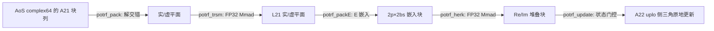

# 单精度复数Cholesky分解、求解和批量接口（950）算子设计文档

> 本文档仅覆盖设计阶段。文中所有路径阈值、性能预算和资源预算均为实现方案或待实测校准项，
> 不包含编译、精度、性能或设备实验结论；动态数值以 950PR 实测校准后同步更新本文档。

# 需求背景（required）

## 需求来源

本需求来自 2026 年 9 月 CANN 社区任务"单精度复数Cholesky分解、求解和批量接口(950)"。任务要求在
`cann/ops-solver` 仓库中，面向 Ascend 950PR，以 **ops-solver Host C API + AscendC Kernel 直调** 工程模式，
全新实现稠密 Hermitian 正定线性求解功能及批量接口，共 5 个计算接口 + 2 个 bufferSize 接口：

| NPU 交付接口 | 对标 CUDA 接口 |
|---|---|
| `aclsolverCpotrf` / `aclsolverCpotrf_bufferSize` | `cusolverDnCpotrf` / `cusolverDnCpotrf_bufferSize` |
| `aclsolverCpotrs` | `cusolverDnCpotrs` |
| `aclsolverCpotri` / `aclsolverCpotri_bufferSize` | `cusolverDnCpotri` / `cusolverDnCpotri_bufferSize` |
| `aclsolverCpotrfBatched` | `cusolverDnCpotrfBatched` |
| `aclsolverCpotrsBatched` | `cusolverDnCpotrsBatched` |

五接口作为同一社区任务一并交付，不允许拆分验收；验收硬件为 Ascend 950PR；功能、精度、性能均须在 950PR 上出结果。

## 背景介绍

### Cholesky 分解与求解族

Hermitian 正定矩阵的 Cholesky 分解 `A = L·Lᴴ`（LOWER）或 `A = Uᴴ·U`（UPPER）是稠密线性求解的基础路径：
分解一次后，`Cpotrs` 以两次三角回代求解 `A·X = B`，`Cpotri` 以三角求逆 + Hermitian 三角乘得到 `A⁻¹`。
相比 LU 分解，Cholesky 无需选主元、计算量减半，且正定性由 `info = k`（第 k 阶顺序主子式不正定）显式报告。
批量接口面向大批独立小矩阵（指针数组寻址），是图神经网络、贝叶斯推断等场景的高频原语。

### ops-solver 仓现状

`ops-solver` 已有 `cgetrf`/`sgetrf`（LU）、`cgetri`/`sgetri`（求逆）、`cgetri_batched`/`cmatinv_batched`（批量求逆）、
`cheevj`（特征分解），**无任何 Cholesky 原型，本任务全新实现**。仓内可直接复用的公共设施：

| 公共设施 | 现状 | 本任务动作 |
|---|---|---|
| `aclsolverStatus_t`（12 个状态码） | `cann_ops_solver_common.h` 已有 | 直接沿用 |
| `aclsolverFillMode_t`（LOWER=0/UPPER=1） | `cann_ops_solver.h` 已有（cheevj 引入） | 直接沿用 |
| `aclsolverCreate/Destroy/SetStream/GetStream` | 已有，handle 内部仅含 stream | 直接沿用 |
| `aclFloatComplex` | **不存在** | 按任务书在 common 头新增（两连续 FLOAT32，C 可调用） |
| 五个计算接口 + 2 个 bufferSize | **不存在** | 本任务新增 |

需要注意：现有 `cgetrf` 原型为 Host 指针 + 内部 H2D/D2H + `lda == n` 限制；本任务接口为
**Device 指针 + 合法 lda padding（禁止要求 `lda == n`）+ `aclsolverStatus_t` 返回**，
仅可参考其工程形态（Host 校验、kernel_do 下发、测试工程结构），不能沿用其数据通路。

### 950PR 平台与复数计算事实

- Ascend 950PR（`arch35` / DAV_3510）Cube 具备 FP32 输入/累加的 Mmad 数据流（fp32 路径 K 维基线 8、
  fixpipe C0=8）；complex64 以 AoS（real/imag 交错）存储，**不能直接当作 FP32 实矩阵送入 Cube**，
  须先经 AIV 解交错/打包为实数块嵌入（见"算子分析"）。
- 同族先例：`ops-blas` 的 `aclblasStrsm`（arch35）已验证"小规模 AIV 直解 + 对角 panel 求解 + Cube FP32
  尾部 GEMM 更新"的分层可行；`aclblasCtrsm`（950 社区任务）给出了完整的复数实数块嵌入方案，本设计与其保持方法一致。
- DAV_3510 UB 约 248 KiB；核数（AIC/AIV）一律运行时查询，不硬编码。

# 需求分析（required）

## 需求描述

在 `include/cann_ops_solver.h` / `cann_ops_solver_common.h` 中新增公共类型与 7 个接口声明，在
`src/cpotrf/`、`src/cpotrs/`、`src/cpotri/`、`src/cpotrf_batched/`、`src/cpotrs_batched/` 实现 Host 调度与
Device Kernel。接口语义、参数顺序、列主序解释、原地输出、info 语义与异常行为与任务书指定的
cuSolver DN legacy API 口径一致。核心计算全部在 AI Core 完成，禁止 CPU fallback。

## 接口原型（与任务书逐字一致，参数不得增删调换）

```c
/* cann_ops_solver_common.h 新增（C 可调用） */
typedef struct {
    float real;
    float imag;
} aclFloatComplex;

/* aclsolverFillMode_t 已存在：ACLSOLVER_FILL_MODE_LOWER=0 / ACLSOLVER_FILL_MODE_UPPER=1 */

/* cann_ops_solver.h 新增 */
aclsolverStatus_t aclsolverCpotrf_bufferSize(aclsolverHandle_t handle, aclsolverFillMode_t uplo,
    int n, aclFloatComplex *A, int lda, int *Lwork);

aclsolverStatus_t aclsolverCpotrf(aclsolverHandle_t handle, aclsolverFillMode_t uplo,
    int n, aclFloatComplex *A, int lda, aclFloatComplex *Workspace, int Lwork, int *devInfo);

aclsolverStatus_t aclsolverCpotrs(aclsolverHandle_t handle, aclsolverFillMode_t uplo,
    int n, int nrhs, const aclFloatComplex *A, int lda,
    aclFloatComplex *B, int ldb, int *devInfo);

aclsolverStatus_t aclsolverCpotri_bufferSize(aclsolverHandle_t handle, aclsolverFillMode_t uplo,
    int n, aclFloatComplex *A, int lda, int *Lwork);

aclsolverStatus_t aclsolverCpotri(aclsolverHandle_t handle, aclsolverFillMode_t uplo,
    int n, aclFloatComplex *A, int lda, aclFloatComplex *Workspace, int Lwork, int *devInfo);

aclsolverStatus_t aclsolverCpotrfBatched(aclsolverHandle_t handle, aclsolverFillMode_t uplo,
    int n, aclFloatComplex *Aarray[], int lda, int *infoArray, int batchSize);

aclsolverStatus_t aclsolverCpotrsBatched(aclsolverHandle_t handle, aclsolverFillMode_t uplo,
    int n, int nrhs, aclFloatComplex *Aarray[], int lda,
    aclFloatComplex *Barray[], int ldb, int *info, int batchSize);
```

与 cuSolver 的差异仅在：命名前缀 `aclsolver`/`cusolverDn`、`aclFloatComplex`/`cuComplex`、
`aclsolverFillMode_t`/`cublasFillMode_t`（枚举值 0/1 对齐）。维数类型为 `int`（32 位）。

## 参数与语义（要点表）

列主序地址：`A(row, col) = A[col * lda + row]`，`B(row, col) = B[col * ldb + row]`。

| 约束 | 口径 |
|---|---|
| 值域 | `n >= 0`、`nrhs >= 0`、`batchSize >= 0`；`lda/ldb >= max(1, n)` |
| 数据指针 | A/B/Workspace/Aarray/Barray/info 均为 **Device 指针**；Host 只传标量、枚举、handle |
| 原地 | potrf 就地覆盖 uplo 侧三角（另一半可作 workspace 破坏，只验收 uplo 侧）；potrs 输出 X 原地覆盖 B；potri 输出覆盖 uplo 侧三角；对角元保持实数语义（输出对角虚部为 +0） |
| 非法参数 | 返回 `ACLSOLVER_STATUS_INVALID_VALUE`，且 devInfo/info 可写时写入 `-i`（-1、-2、-4…按 cuSolver 参数序）；非法 uplo 枚举同口径 |
| 空问题 | `n==0 || nrhs==0 || batchSize==0` 成功返回，不读取数据、不申请资源、不下发计算 kernel |
| potrsBatched | 仅支持 `nrhs==1`；`nrhs != 1` 且 `n>0` 且 `batchSize>0` 时必须报错（`info=-5`）；空问题可放宽 |
| info 正值 | potrf：`info = k`，k 为最小不正定顺序主子式阶数，分解止于第 k 行，前 k-1 列因子已算出；potrfBatched 逐矩阵写 `infoArray[i]`，其余矩阵照常；potri：因子第 k 阶顺序主子式为零时 `info = k`；potrs/potrsBatched 仅 0/-i（无正定性概念） |
| batched 寻址 | `Aarray[i]`/`Barray[i]` 为 Device 指针数组元素，每个矩阵独立 `lda × n` 列主序，**不要求连续布局** |
| 规模下限 | potrf/potri：`n ∈ [1, 4096]`；potrs：`nrhs ∈ [1, 128]`；batched：`batchSize ∈ [1, 1000000]`；用例输入驻留 ≤ 4GB |
| 确定性 | 相同输入、相同 stream 串行多次执行，输出（含 info）bit-wise 一致 |

## 数学语义

```text
Cpotrf  : uplo=LOWER: A = L·Lᴴ ; uplo=UPPER: A = Uᴴ·U （仅处理 uplo 侧，原地覆盖）
Cpotrs  : A · X = B （A 为已分解因子，X 原地覆盖 B；uplo 与分解时一致）
Cpotri  : A⁻¹ · A = I （输入为三角因子，输出为 Hermitian 逆的 uplo 侧三角）
CpotrfBatched : 对 i = 0..batchSize-1，A[i] = L[i]·L[i]ᴴ，infoArray[i] 独立报告
CpotrsBatched : 对 i = 0..batchSize-1，A[i]·X[i] = B[i]（nrhs=1，X[i] 原地覆盖 B[i]）
```

复数乘法与共轭：`x·y = (xr·yr − xi·yi) + i·(xr·yi + xi·yr)`，`conj(x) = xr − i·xi`；
复数除法采用比例缩放形式避免 `yr²+yi²` 溢出/下溢：

```text
if |yr| >= |yi|: r = yi/yr; d = yr + yi·r; x/y = ((xr + xi·r)/d) + i·((xi − xr·r)/d)
else           : r = yr/yi; d = yi + yr·r; x/y = ((xr·r + xi)/d) + i·((xi·r − xr)/d)
```

## 需求拆解与范围

| 模块 | 设计范围 |
|---|---|
| 公共 API | `aclFloatComplex` 类型 + 7 个接口声明，C 可调用（extern "C" 区域） |
| Host | 校验、路径选择、Tiling、bufferSize 计算、同 stream 顺序下发、错误码与 info 填写 |
| Device | 无阻塞 panel 分解/求逆、复数打包（解交错/E-S 嵌入）、FP32 Cube GEMM/HERK、结果合并回写、info 状态传播、批量指针寻址 |
| 构建与文档 | 接入仓内 `build.sh --ops=<op>` 收集规则；5 篇 docs/zh 文档 + api_list + README 更新 |
| 测试 | 仓内 test 工程 5 套 + 社区自测任务包接入（145 精度例 + 3 info 契约例 × 5 算子） |

不在本任务范围内：其他数据类型（fp64/fp16/bf16）、broadcast、图融合、多卡、CPU fallback、
`potrsBatched` 的 `nrhs > 1`（按 cuSolver 口径不支持，报错）。

## 代码架构选型

整体为同一 stream 上的多 Kernel 分块流水，以 Kernel 边界表达 panel 依赖，
AIV 与 AIC 各自独占输出阶段，避免跨核 flag 协议和多 writer 风险（同 aclblasCtrsm 方法）：

| 子问题 | 选型 | 原因 |
|---|---|---|
| 小规模 / 对角 panel / 批量小矩阵 | AIV（矢量核）复数直算 | 三角依赖强，矢量直算延迟低；批量按矩阵粒度铺满 AIV |
| 大规模尾部更新（HERK / GEMM） | AIC（Cube）FP32 实数嵌入 Mmad | 更新已化为矩阵乘；复数乘经实数块嵌入一次 Mmad 完成，全路径不降 FP16 |
| 打包、合并、三角回写、info 门控 | AIV 辅助 Kernel | 规则搬运与 AoS/平面布局转换；读写区域两两不相交 |

复数尾部更新的两条候选路径（与 aclblasCtrsm 同款取舍）：

| 方案 | AIC 次数 / 临时结果 | 取舍 |
|---|---|---|
| 四次实 GEMM + AIV 合并 | 4 次 / 4 个 p×q 块 | 公式直观，但 launch 与临时块多 |
| **实数块嵌入（选定）** | 1 次 / 1 个嵌入块 | 复制实数布局换取更少的 AIC launch 与结果块数，且只使用现有 FP32 MMAD，不改变误差路径 |

# 算子分析

## 复数到实数的块嵌入

对复矩阵 `U = Ur + i·Ui`（`p×k`）、`V = Vr + i·Vi`（`k×q`）：

```text
E(U) = [ Ur  −Ui ]  (2p×2k)      S(V) = [ Vr ]  (2k×q)      E(X) = [ Xr  −Xi ]
       [ Ui   Ur ]                      [ Vi ]             Xi   Xi   Xr ]  (2p×2k)

E(U)·S(V) = [ Re(UV) ]  (2p×q)        E(X)·E(X)ᵀ：左上 = Re(XXᴴ)，左下 = Im(XXᴴ)
            [ Im(UV) ]
```

- 一般复 GEMM（TRSM 面板更新、potrs/potri 尾部更新）：`E(U)·S(V)` 一次 FP32 Mmad 得实/虚堆叠块，AIV 合并回写；
- Hermitian 积（potrf 尾部 `L21·L21ᴴ`、lauum 对角块）：`E(X)·E(X)ᵀ` 一次 FP32 Mmad，无需转置打包，
  左上块为实部、左下块为虚部，天然满足 Hermitian 结构（右上 = −(左下)ᵀ）；
- 共轭转置读（`X11ᴴ`、`L21ᴴ` 等）由 AIV 打包 Kernel 在生成 E/S 操作数时完成（读三角 + 取负虚部 + 转置寻址），
  不产生独立的转置 Kernel。

## aclsolverCpotrf：分块右视 Cholesky

以 LOWER 表述（UPPER 为镜像处理，同一组 Kernel 参数化）。将 A 按块大小 nb 划分，逐步：

```text
① panel：对角块 A11(j:j+nb) 无阻塞复数 Cholesky          —— AIV panel kernel
   逐列：d = scaled_div(A(jj,jj) − dot)；列内 dot 线程并行、块内同步
   顺带产出 X11 = inv(L11)（供②）与 E(X11ᴴ)（供②的 Cube 操作数）
   失败（d 非正/零）→ 写全局 info = j+kk（1-based）并置 device 状态
② panel 更新（TRSM）：L21 = A21 · X11ᴴ                  —— pack + Cube GEMM
   A21 为块列下方 (n−j−nb)×nb 原始数据；pack 解交错为实/虚平面，
   Cube 一次 Mmad 完成嵌入乘，结果保持实/虚平面布局供③复用
③ 尾部更新（HERK）：A22 ← A22 − L21·L21ᴴ                —— packE + Cube + update
   E(L21)·E(L21)ᵀ 一次 Mmad；update kernel 只回写 uplo 侧三角，
   对角强制实部；读到 info 状态非 0 则整体 no-op
```

正确性：`L21·L11ᴴ = A21 ⟹ L21 = A21·(L11⁻¹)ᴴ = A21·X11ᴴ`；`A22 − L21·L21ᴴ` 保持 Schur 补的 Hermitian 正定性。

**非正定传播**：panel kernel 将 `info = k > 0` 与失败标志写入 device 状态缓冲；其后所有 kernel 读状态决定 no-op，
全程不做 host readback（保持异步与确定性）；前 k−1 列因子保留，符合"分解止于第 k 行"语义。

**direct 快路径**：`n ≤ 阈值`（初版 128，实测校准）单 AIV kernel 一次完成无阻塞分解，
批量接口的小矩阵路径复用同核函数（按矩阵粒度分核）。

## aclsolverCpotrs：两遍分块三角求解

```text
前代 L·Y = B：for j = 0..n step nb:
  ① AIV 面板前代：Y_j = X_jj·B_j（nb×nrhs 逐列前代，nrhs 列间并行）
  ② Cube 更新：B_below ← B_below − L21·Y_j（E·S 嵌入 GEMM）
回代 Lᴴ·X = Y：块序反向、操作数按共轭转置读取，步骤同构（同一组 kernel，内部模式参数区分）
```

**direct 快路径**：`n ≤ 128 或 nrhs ≤ 4`（初版，实测校准）单 AIV kernel 完成两遍求解，
P-04（n=1024, nrhs=1，预算 0.64ms）以此路径覆盖——单核直算约 3.4e7 实数 flops，远低于预算，
多 kernel 流水的 launch 开销在该场景不可接受，故 direct 路径为必选项。大 nrhs 按 chunk 切分
（E(L21) 操作数对同一面板的全部 chunk 复用）。

## aclsolverCpotri：trtri + lauum 两阶段

对标 LAPACK `zpotri = ztrtri + zlauum`：

```text
阶段一 trtri（X = inv(L) 原位，块序自下而上）：
  for j = K−1 … 0:
    ① AIV 无阻塞三角求逆：X_jj = inv(L_jj)（逐列缩放复数除法；对角元按位为零 → info = j+kk）
    ② T = L21·X_jj （Cube E·S GEMM，L21 为原始块列，T 入 Workspace）
    ③ X21 = −X22·T （Cube E·S GEMM，X22 为已求好的尾块逆，只读其下三角）
   数学核验：inv(L) 分块式 X21 = −inv(L22)·L21·inv(L11)，自下而上保证 X22 先于②③就绪

阶段二 lauum（C = Xᴴ·X 的 uplo 侧三角，逐块列自上而下）：
  C 块列 j = Σ_{k≥j} X 块列参与共轭乘积累加（对角块 HERK 型 E·Eᵀ，非对角块 E·S GEMM 型），
  在 Workspace 条带内完整累加后一次性写回 A 的同块列——读写在块列粒度分离，无原位冲突
```

`_bufferSize` 声明的 Workspace 覆盖：trtri 的 T 块 + lauum 的块列累加条带（约 `2·n×nb` 复数量级），
host 纯计算，不下设备。

## 批量接口

- **指针寻址**：tiling 下发 batch 区间，kernel 从 GM 指针数组读取各矩阵基址；矩阵间无布局耦合。
- **potrfBatched**：
  - `n ≤ 阈值`（覆盖 n=32/64 及更小）：单 AIV kernel，矩阵粒度分核，每核串行处理多个矩阵
    （n=32、batch≈10 万时约 40 核 × 每核数千矩阵，P-09 预算 8.47ms 内可达）；
    n=128 类（P-10）可按列块跨核协作（初版阈值，实测校准）；
  - `n > 阈值`：与单矩阵相同的分块流水，但每步 kernel 内部将 batch 维作为外层并行维
    （batch×块 2D 分核），全 batch 共享一轮 kernel 序列；每矩阵独立 info 门控，非正定矩阵被跳过、其余照常。
- **potrsBatched**：nrhs=1，单 AIV kernel 每矩阵完成前代 + 回代两遍（中间解驻留 UB），
  矩阵粒度分核；n=32（P-11，预算 4.56ms）与 n=128（P-12，预算 17.23ms）按每核 flops 估算均在预算内；
  泛化上限内大 n 小 batch 亦由该路径覆盖（n=4096 单矩阵约 5.4e8 实数 flops，单核毫秒级）。

## 确定性分析

- tiling 仅由 `(n, nrhs, batchSize, uplo)` 决定，与数据无关；
- 归约树固定：panel 列内 dot、批量分核、GEMM K 维切分顺序全部确定，无 atomics、无数据依赖分支；
- kernel 不读取未初始化的 Workspace 区域（有效计算范围之外的填充不参与归约）；
- 非正定 info 为确定性计算的确定结果。满足任务书 bit-wise 一致要求。

# Host/Tiling 设计

## Host 侧校验顺序（冻结）

校验顺序固定如下（同时满足错误码、no-op 与"info 可写时写 -i"语义）：

```text
1. handle == nullptr                        → ACLSOLVER_STATUS_HANDLE_IS_NULLPTR
2. uplo 枚举非法                            → INVALID_VALUE
3. n < 0 / nrhs < 0 / batchSize < 0         → INVALID_VALUE
4. devInfo/info/infoArray/Lwork 指针为空     → INVALID_VALUE（按参数表为绝对约束，含空问题）
5. 空问题（n==0 || nrhs==0 || batchSize==0） → SUCCESS，不检查 lda/数据指针、不下发 kernel
6. potrsBatched：nrhs != 1                  → INVALID_VALUE（info=-5）
7. lda/ldb < max(1,n) 等值域                 → INVALID_VALUE
8. 数据/Workspace 指针为空（对应规模非 0）    → INVALID_VALUE
9. 计算 Tiling 与 bufferSize 口径，向 handle stream 顺序下发 kernel → SUCCESS（异步语义）
```

第 2~4、6~8 步命中且 info 类指针非空时：向 stream 追加一个 AIV 填充 kernel 异步写 `-i`（-1/-2/-4/-5 按
cuSolver 参数序），不做 host 同步。所有元素数、字节数、GM 偏移先扩宽为 64 位再乘加；任何溢出或平台查询失败
返回仓内可诊断状态码，不继续下发。

## 路径选择阈值（初版，待 950PR 实测校准）

| 接口 | 条件 | 路径 |
|---|---|---|
| Cpotrf | `n ≤ 128` | direct（单 AIV kernel） |
| Cpotrf | 其他 | blocked，`nb = 128`（尾块取 min） |
| Cpotrs | `n ≤ 128 或 nrhs ≤ 4` | direct（单 AIV kernel，两遍） |
| Cpotrs | 其他 | blocked，`nb = 128`，nrhs 按 chunk 切分 |
| Cpotri | 全范围 | trtri + lauum 两阶段分块（`nb = 128`） |
| CpotrfBatched | `n ≤ 64` | direct，矩阵粒度分核 |
| CpotrfBatched | `64 < n ≤ 128` | direct，可选列块跨核协作 |
| CpotrfBatched | `n > 128` | 跨 batch 分块流水（`nb = 64`） |
| CpotrsBatched | 全范围 | direct，矩阵粒度分核（两遍求解） |

## TilingData（Host/Device 共用 POD，固定宽度）

| 结构 | 核心字段 |
|---|---|
| `CpotrfTilingData` | `uplo, n, lda, nb, numPanels, directMode, coreNum, matsPerCore(批量)` |
| `CpotrsTilingData` | `uplo, n, nrhs, lda, ldb, nb, rhsChunk, coreNum, mode(前代/回代)` |
| `CpotriTilingData` | `uplo, n, lda, nb, numPanels, phase(trtri/lauum)` |
| `CpotrfBatchedTilingData` | `uplo, n, lda, batchSize, nb, matsPerCore, batchBegin, batchEnd` |
| `CpotrsBatchedTilingData` | `uplo, n, lda, ldb, batchSize, matsPerCore, batchBegin, batchEnd` |
| `CpotGemmTilingData` | `m, n, k, tileM, tileN, tileK, srcStride/dstStride`（Cube 块级，M/N 候选与 L1/L0 容量校验联动） |

## 分核策略

- **核数一律运行时查询**（host 侧平台接口 / device 侧 `GetBlockNum/GetBlockIdx`），禁止写死；
- panel/direct：矩阵或块粒度铺满 AIV，余量分给前几个核，不做再平衡；
- Cube GEMM：M/N 二分，在 `块数 ≤ AIC 数` 约束下取最大划分；**K 维不跨核**，避免跨核归约；
- 批量：batch 维外层、块维内层 2D 切分；单核任务数最多差 1；
- 多 kernel 流水之间依赖由同 stream 顺序表达，kernel 内部仅块内同步。

## bufferSize 口径

- `Cpotrf_bufferSize`：`Lwork = f(n, nb)`（块列打包条带 + TRSM 结果块，复数量级 `2·n×nb`），host 纯计算，
  不下设备、不读取 A、与数据内容无关；
- `Cpotri_bufferSize`：在 potrf 基础上增加 lauum 块列累加条带（同量级）；
- `Workspace` 指针为空且 `Lwork > 0` → `INVALID_VALUE`（任务书口径）。

## 工程落点

```text
include/cann_ops_solver_common.h            # +aclFloatComplex
include/cann_ops_solver.h                   # +7 个接口声明
src/cpotrf/{cpotrf_host.cpp, cpotrf_kernel.cpp, cpotrf_blocked_kernel.cpp}
src/cpotrs/{cpotrs_host.cpp, cpotrs_kernel.cpp, cpotrs_blocked_kernel.cpp}
src/cpotri/{cpotri_host.cpp, cpotri_kernel.cpp, cpotri_blocked_kernel.cpp}
src/cpotrf_batched/{cpotrf_batched_host.cpp, cpotrf_batched_kernel.cpp}
src/cpotrs_batched/{cpotrs_batched_host.cpp, cpotrs_batched_kernel.cpp}
src/utils/complex_pack.h                    # E/S 嵌入打包/合并公共模板（头文件内联，仅此 1 个共享件）
test/cpotrf|cpotrs|cpotri|cpotrf_batched|cpotrs_batched/
    {CMakeLists.txt, <op>_test.cpp, data/{gen_data.py, verify_result.py}, README.md}
docs/zh/cpotrf.md … cpotrs_batched.md       # 5 篇 + docs/api_list.md + README.md 接口表更新
```

批量算子的 kernel 复用单矩阵同族模板（batch 维参数化），不复制粘贴展开，控制文件数量符合仓内评审要求。

# Kernel 设计

## Kernel 清单

| Kernel | 核型 | 职责 |
|---|---|---|
| `potrf_direct_kernel` | AIV | n≤阈值单矩阵 / 批量小矩阵无阻塞 Cholesky（含批量 infoArray 写入） |
| `potrf_panel_kernel` | AIV | 对角块无阻塞分解 + 产出 X11 与 E(X11ᴴ)，失败写状态 |
| `potrf_pack_kernel` | AIV | 当前面板块列 A21 解交错打包为实/虚平面 |
| `potrf_trsm_kernel` | AIC | L21 = A21·E(X11ᴴ)，FP32 Mmad |
| `potrf_packE_kernel` | AIV | L21 实/虚平面 → E(L21) 块嵌入（符号重排） |
| `potrf_herk_kernel` | AIC | E(L21)·E(L21)ᵀ，FP32 Mmad |
| `potrf_update_kernel` | AIV | A22 活动三角减去复数块，对角置实，状态门控 no-op |
| `potrs_direct_kernel` | AIV | 单矩阵两遍三角求解（前代+回代，中间解驻留 UB） |
| `potrs_panel_kernel` | AIV | 面板前代/回代（nb×nrhs，模式参数区分） |
| `potrs_pack/gemm/update_kernel` | AIV/AIC | 尾部更新 E·S 打包、FP32 GEMM、合并回写 |
| `potri_invpanel_kernel` | AIV | 无阻塞三角求逆（缩放除法，零对角 → info=k） |
| `potri_pack/gemm_kernel` | AIV/AIC | trtri 两步 GEMM 与 lauum 块列累加（E·S / E·Eᵀ） |
| `potri_writeback_kernel` | AIV | 块列条带写回 uplo 侧三角，对角置实 |
| `potrf_batched_direct/potrs_batched_direct` | AIV | 批量直解（指针数组寻址、矩阵粒度分核） |
| `param_fill_kernel` | AIV | host 检出的非法参数向 device info 异步填 `-i` |

UPPER 与 LOWER 由 tiling 参数化同一组 kernel（索引映射转置），不维护两套实现。

## 无阻塞 panel 伪代码（potrf，LOWER）

```text
load active triangle of A11 to UB (non-active left as workspace, not read)
X11 ← I
for kk = 0 .. nb−1:                       # 列内依赖串行
    (sr, si) = parallel_dot(col kk, rows 0..kk−1, X11)   # 线程分段累加 + 树形归约
    d  = A(kk,kk) − (sr, si)
    if d 非正（实部 ≤ 0 或 |虚部| 非零越限）: write status(k = j+kk+1); break
    L(kk,kk) = sqrt_scaled(d)             # 缩放形式开方保精度
    X(kk,kk) = inv_scaled(d)
    rows kk+1..nb−1 并行: 前代消元（复数缩放除法）
    block_sync()
emit X11、E(X11ᴴ) to Workspace            # 供② Cube 操作数，一次打包全程复用
```

## 复数打包与更新流程



打包/合并 Kernel 采用二维逻辑 tile，每个输出元素只有一个 writer；完整对齐块批量搬运，
非 32B 对齐尾段用受保护的搬运接口；任何填充不得进入有效 GEMM 范围或触及非活动三角、padding 区。

## Cube FP32 GEMM 数据流与容量校验

沿用 arch35 既有 FP32 tensor_api 数据流（`CopyGM2L1 → CopyL12L0A/B → Mmad → CopyL0C2GM`），
L1/L0A/L0B 双缓冲、L0C 跨 K chunk 累加。tile 候选在 host 侧用平台查询值逐项校验
（`m0=alignUp(tileM,16)`、`n0=alignUp(tileN,16)`、`k0=alignUp(tileK,8)`）：

```text
aL1 = m0·k0·4B; bL1 = k0·n0·4B; aL0 = m0·k0·4B; bL0 = k0·n0·4B; cL0 = m0·n0·4B
2·(aL1 + bL1) + headroom ≤ queriedL1Bytes
2·aL0 ≤ queriedL0ABytes; 2·bL0 ≤ queriedL0BBytes; cL0 ≤ queriedL0CBytes
```

候选不满足则降级到下一档；全部失败返回可诊断错误，不使用越界 tiling。

## 同步与生命周期

| 边界 | 设计 |
|---|---|
| Host 阶段间 | 校验 → 打包 → panel → GEMM → 更新在同一 stream 顺序下发，kernel 边界即依赖边界 |
| SIMT panel 内 | 每次 dot 归约与 pivot 写回后块内同步 |
| AIC L1/L0 | 双缓冲 HardEvent 配对，循环结束完整 drain |
| info 状态 | panel/inverse kernel 单点写，后续 kernel 只读；不做 host readback |
| Workspace | 每次调用自足（不依赖上次调用残留），合法输入下不读取未定义区域 |
| 多 stream | 无进程级可变全局 scratch；handle 仅携带 stream |

## 批量 Kernel 指针寻址

tiling 下发 `[batchBegin, batchEnd)` 区间；kernel 内按块循环从 GM 指针数组读取 `Aarray[i]` 基址，
矩阵数据访问全部经基址 + `col·lda + row` 偏移（64 位中间量）。矩阵间地址独立，无相邻假设。

# 硬件与约束

## 支持硬件

| 芯片版本 | 支持状态 |
|---|---|
| Ascend 950PR（arch35 / DAV_3510） | 支持，本任务唯一验收目标（`--soc=ascend950`） |
| 其他产品 | 不声明支持；公共 API 保持产品线共享，能力以平台查询为准 |

## 平台能力与资源

- Cube FP32 Mmad（K 基线 8、fixpipe C0=8）、AIV 约 248 KiB UB（以目标版本平台查询与编译器分配报告为准，
  不写成跨产品常量）；
- AIC/AIV 核数运行时查询；n=4096 的 potrf 需要约 4.7 TFLOPS 有效 FP32 吞吐（0.35× 门禁折算），
  依赖 Cube 路径与 tiling 质量，属实现期重点校准项；
- 批量大 batch 用例（如 n=128、batch=46256，输入驻留 GB 量级）为带宽敏感型，tiling 以指针复用与
  块内驻留减少 HBM 往返。

## 算子约束限制

| 约束 | 说明 |
|---|---|
| 数据类型 | 仅 COMPLEX64（`aclFloatComplex`），布局 AoS real/imag |
| 存储 | 列主序，仅支持 lda/ldb 表达的列间 padding，禁止要求 `lda == n` |
| 原地 | potrf/potri 覆盖 uplo 侧三角，对角实数语义；potrs 覆盖 B |
| 三角引用 | 只读 uplo 指定三角；另一半可作为 workspace 被破坏，验收只比 uplo 侧 |
| 空问题 | 合法 no-op，不读数据、不分配、不下发计算 kernel（info 指针为空仍按参数表报错） |
| 正定性 | potrf/potrfBatched 报告最小不正定阶 k；potri 报告零对角阶 k；potrs 不检查 |
| 异步 | SUCCESS 表示已提交至 handle stream；Host 读回前须同步 |
| 确定性 | 同输入同 stream 重复执行 bit-wise 一致（固定归约树） |
| 依赖 | 不依赖 CUDA；核心计算全部在 AI Core，禁止 CPU fallback |

# 可维可测分析

## 精度标准

golden 以 complex128（NumPy/SciPy `cholesky/cho_solve/inv`，即 zpotrf/zpotrs/zpotri）为单标杆；
COMPLEX64 按实部、虚部分别作 FLOAT32 混合容差判定（任务书 3.2.1）：

| 指标 | 阈值 |
|---|---|
| rtol | 2⁻¹⁰ ≈ 9.77e-4 |
| atol | 2⁻¹⁶ ≈ 1.53e-5 |
| required_matched_ratio | 0.99 |
| max_abs_error_limit | 1e-2 或 32×ULP |

逐元素：`|actual − golden| ≤ atol + rtol·|golden|`；matched_ratio 与 max_abs_error 双门同过才判该用例通过。
不通过时按任务书 3.2.2 LAPACK 残差复核：

```text
potrf : ratio = ‖F·Fᴴ − A‖₁ / (n·‖A‖₁·ε)          ≤ max(5·ratio_cpu, 3·ratio_cpu_mean)
potrs : ratio = max_j ‖B_j − A·X_j‖₁/(‖A‖₁·‖X_j‖₁·ε) ≤ max(5·ratio_cpu, 3·ratio_cpu_mean)
potri : ratio = ‖I − A·C‖₁ / (n·‖A‖₁·‖C‖₁·ε)      ≤ max(5·ratio_cpu, 0.1)
ε = 2⁻²³ ≈ 1.19e-7（COMPLEX64）；批量逐矩阵判定，ratio_cpu_mean 取 case 内 batch 均值
```

精度设计保障：全路径 FP32 计算（Cube L0C FP32 累加 / 矢量 FP32），不降 FP16、不用 3-mul 技巧，
panel 除法一律缩放形式——误差路径与 cuSolver/LAPACK 同族；固定归约树同时满足确定性要求。

info 正值下标单独验证：每算子 3 个 info 契约用例（非正定/奇异因子/非法参数），只比 info 与 `k_expected`。

## 性能标准

对标 GPU 数据（cuSolver，同 shape/dtype/列主序/同预热计时口径），门禁 **T_NPU ≤ T_GPU数据 / 0.35**：

| 编号 | 接口 | 规格 | GPU (ms) | NPU 预算 (ms) |
|---|---|---|---|---|
| P-01 | Cpotrf | n=1024, LOWER, lda=n | 0.79 | 2.26 |
| P-02 | Cpotrf | n=4096, UPPER, lda=n | 6.7918 | 19.40 |
| P-03 | Cpotrf | n=2048, LOWER, lda=n | 1.5434 | 4.41 |
| P-04 | Cpotrs | n=1024, nrhs=1, UPPER | 0.2235 | 0.64 |
| P-05 | Cpotrs | n=4096, nrhs=32, LOWER | 2.9488 | 8.43 |
| P-06 | Cpotrs | n=2048, nrhs=8, LOWER | 1.0867 | 3.10 |
| P-07 | Cpotri | n=1024, LOWER | 1.4534 | 4.15 |
| P-08 | Cpotri | n=4096, UPPER | 17.8843 | 51.10 |
| P-09 | CpotrfBatched | n=32, batch=102774, LOWER | 2.9648 | 8.47 |
| P-10 | CpotrfBatched | n=128, batch=46256, LOWER | 18.1601 | 51.89 |
| P-11 | CpotrsBatched | n=32, batch=99659, LOWER | 1.5953 | 4.56 |
| P-12 | CpotrsBatched | n=128, batch=45897, LOWER | 6.0311 | 17.23 |

**统计口径声明**：多 kernel 实现的性能统计对象为该接口一次调用所下发全部 kernel 的 Device 侧执行时长，
经 msprof `OpBasicInfo.csv` 按 kernel 名汇总求和后取 30 次采样中位数（`msprof op --kernel-name
--warm-up --launch-count 30`，预热不含首编译，不含 H2D/D2H 与造数）；该口径与任务书"NPU 平均单次 kernel
耗时"的对应关系以本节为准，验收时按同口径执行。direct 单 kernel 接口（P-04 等）天然无歧义。
上表预算为设计期折算，最终以 950PR 实测校准并回填自测报告。

## 验证计划（未执行）

使用 ops-solver 仓测试工程（`test/<op>/<op>_test`，`bash build.sh --soc=ascend950 --ops=<op> --run`）
+ 社区自测任务包（每算子 145 精度例 + 3 info 契约例；批量包含 A0 抽样槽位映射与余槽 bit-wise 一致性两层判定；
`verify_accuracy.py` 退 0 为通过）。覆盖维度：

| 类别 | 覆盖点 |
|---|---|
| 基础功能 | potrf；potrf+potrs；potrf+potri；potrfBatched；potrsBatched |
| uplo | LOWER/UPPER 全组合（含 blocked 与 direct 两侧、UPPER 镜像穿刺） |
| padding | lda/ldb 等于最小合法值及 +8/+32 padding；padding 区与 guard 不变性 |
| info | 成功 0；非正定 k（含面板内非首列失败、批量部分矩阵失败）；非法参数 -i |
| 批量边界 | batchSize=1；n=1；nrhs=1 合法；potrsBatched nrhs=2 报错；指针数组非连续布局 |
| 空问题 | n=0 / nrhs=0 / batchSize=0 成功返回且不触碰数据 |
| 确定性 | 合法用例重复执行 bit-wise 一致（含 info） |
| 流 | 非默认 stream 下结果正确、顺序依赖成立 |
| 输入构造 | 对角占优、随机 Hermitian 正定（BᴴB + nI，均匀/正态各半）、非正定构造 |
| 边界规模 | 2 的幂与 2 的幂−1、面板边界 ±1、路径阈值两侧 |

参数错误期望：handle 空返回 `HANDLE_IS_NULLPTR`；其余非法返回 `INVALID_VALUE` 且可写 info 时写 `-i`；
空问题在 info 指针合法前提下 SUCCESS。

## 静态设计核验

| 检查项 | 结论 |
|---|---|
| 接口原型/参数序/维数类型与任务书逐字对齐 | 已对齐（`aclFloatComplex` + int32 + Device 指针） |
| 校验顺序、空问题、info 契约 | 已冻结（含"info 指针为空一律报错"的显式取舍，待评审确认） |
| 多核唯一 writer | panel/打包/合并/回写按不相交区域切分；批量按矩阵/块 2D 切分 |
| 复数实数嵌入 | E·S / E·Eᵀ 单 Mmad 方案，共轭转置由打包承担，不降 FP16 |
| 资源预算 | L1/L0 校验式 + Workspace 量级声明，数值待平台查询校准 |
| 性能可行性 | P-02/P-04/P-10 等关键 case 的 flops/预算折算已列，路径阈值待实测 |
| 实验状态 | 未编译、未跑精度、未跑性能；所有动态阈值待 950PR 数据校准后回填本文档 |

# 兼容性分析

`aclFloatComplex` 与 7 个接口为纯新增，不修改现有 `cgetrf/cgetri/cheevj/cmatinv_batched` 等签名与行为
（现有接口继续使用 `std::complex<float>`）；`aclsolverFillMode_t`/`aclsolverStatus_t`/handle 设施直接复用。
公开头文件保持 C 可调用（extern "C" 区域）。内部模式枚举、TilingData、device 状态缓冲均不暴露 ABI。
合入后同步更新 `docs/api_list.md`、`README.md` 算子表与 5 篇 `docs/zh/<op>.md`。

# 风险与对策

| 风险 | 影响 | 对策 |
|---|---|---|
| arch35 Cube FP32 路径调优经验有限 | P-02 类大 n case 不达 0.35× | 以 ops-blas Strsm/Ctrsm arch35 既有 FP32 数据流为事实源；msprof 逐 kernel 归因；nb/tile 实测校准 |
| 嵌入布局/共轭转置/UPPER 镜像写错 | 精度整体错误 | 中间态 golden（打包块单独比对）；LOWER/UPPER、前代/回代逐一穿刺 |
| info=k 跨 kernel 传播出错 | 非正定语义/批量部分失败错误 | 状态缓冲单点写多读；info 契约用例专项覆盖 |
| P-04 预算极小（0.64ms） | 多 kernel launch 开销不可接受 | direct 单 kernel 路径为必选项，随 M2 首批实现并实测 |
| 大 batch 用例带宽受限 | P-10/P-12 接近预算 | 块内驻留 UB、指针复用、必要时列块跨核协作；实测后调路径阈值 |
| 统计口径歧义（多 kernel 求和 vs 单 kernel） | 性能验收争议 | 本文"性能标准"节显式声明口径并留证，提交时与验收方对齐 |
| 950PR 环境就绪时间 | 里程碑依赖 | 设计/公共件/矢量路径先行，arch35 交叉编译保编译通过；真机到位后集中校准 |

# 参考资料

1. 本任务任务书：`Atlas950_Cpotrf_Cpotrs_Cpotri_CpotrfBatched_CpotrsBatched_task_doc.md`（接口/精度/性能/交付口径唯一真值）。
2. NVIDIA cuSolver DN legacy API：<https://docs.nvidia.com/cuda/cusolver/index.html>。
3. ops-solver 仓：<https://gitcode.com/cann/ops-solver>（重点 `include/`、`src/cgetrf/`、`src/cheevj/`、`src/cmatinv_batched/`、`test/`、`build.sh`）。
4. 生态算子开源精度标准：<https://gitcode.com/cann/opbase/blob/master/docs/zh/ops_precision_standard/experimental_standard.md>。
5. 同族先例设计（方法一致性参照）：ops-blas `aclblasCtrsm`/`aclblasStrsm`（arch35）设计与实现；
   `cann-ops-competitions` 任务 `08-22-aclblasCtrsm-950` 设计文档。
6. LAPACK `zpotrf/zpotrs/zpotri/ztrtri/zlauum` 语义参考：<https://www.netlib.org/lapack/>。
7. CANN 社区设计模板：<https://gitcode.com/cann/cann-competitions/blob/master/04_tasks/01_community-task-2026/resources/design_template.md>。
8. CATLASS：<https://gitcode.com/cann/catlass>；ops-nn `mat_mul_v3`（arch35）调度参考。
