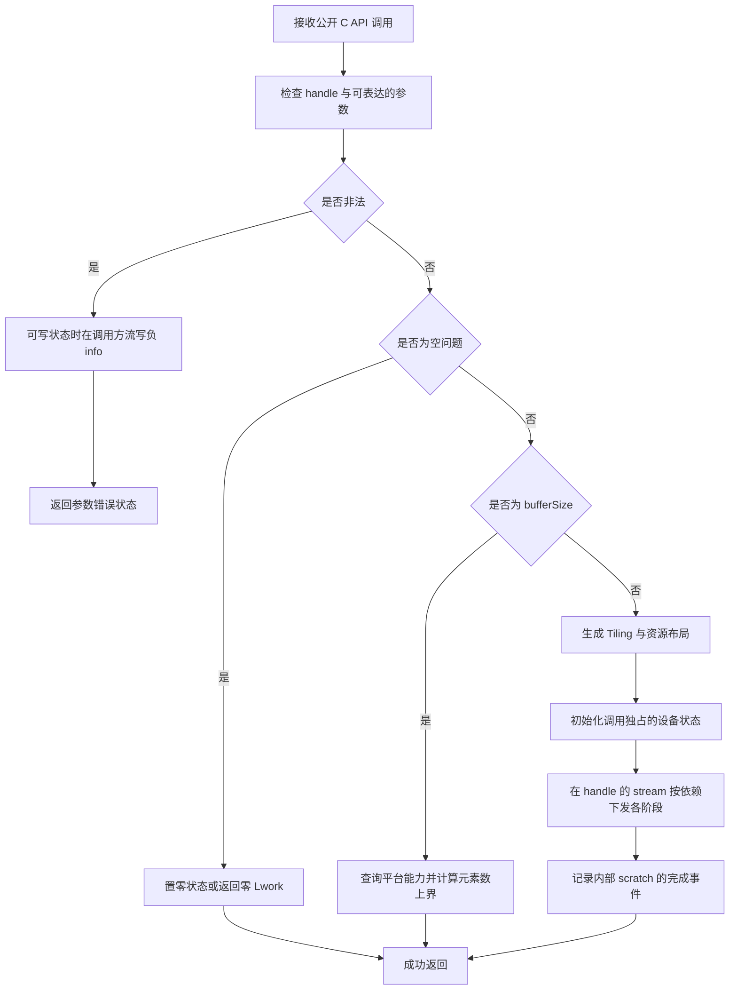
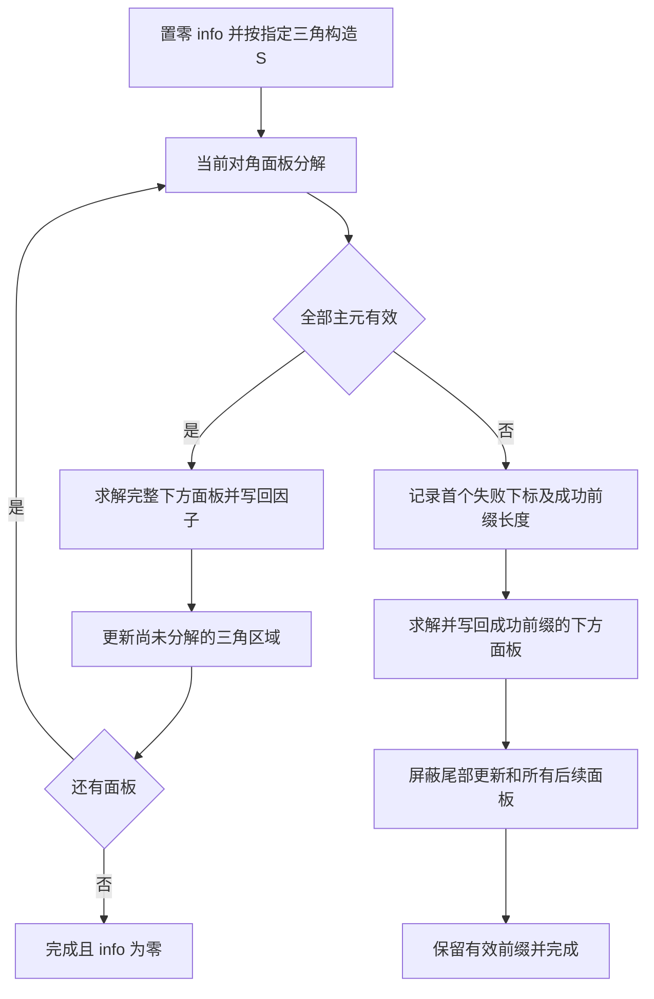
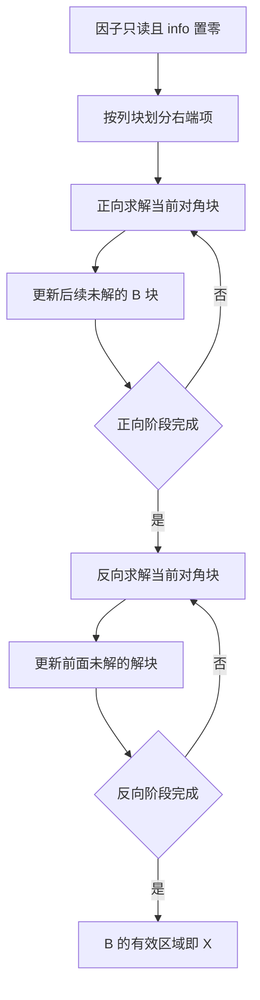
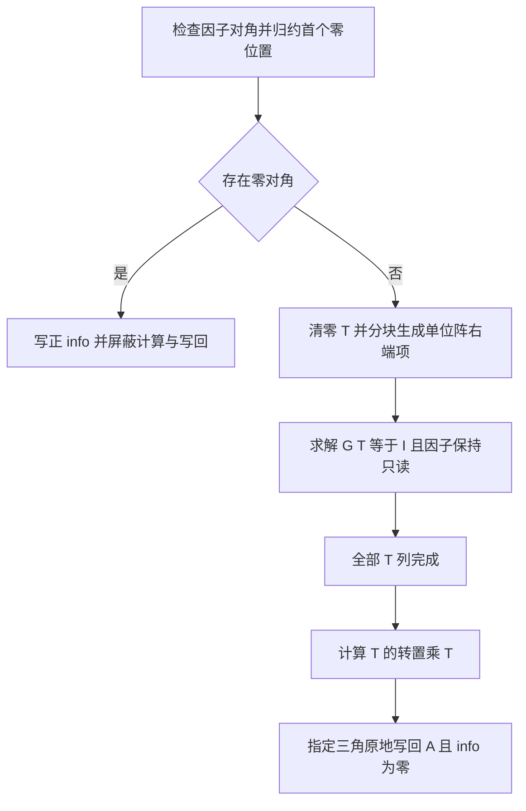
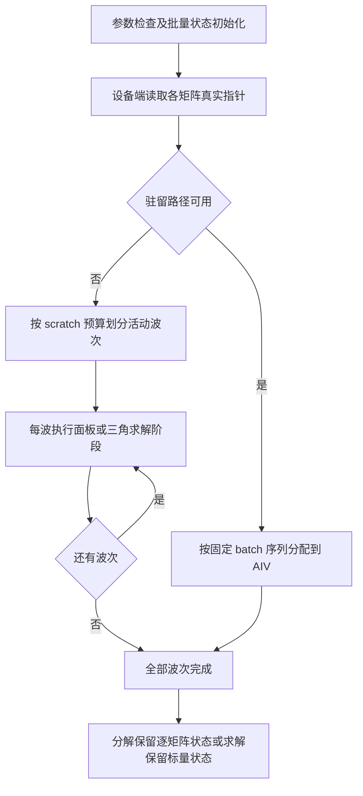

# Atlas 950 单精度实数 Cholesky 分解、求解和批量接口设计

# 需求背景（required）

## 需求来源

本设计依据项目任务包中的《Atlas 950 单精度实数 Cholesky 分解、求解和批量接口任务书》编写，覆盖 `aclsolverSpotrf`、`aclsolverSpotrs`、`aclsolverSpotri`、`aclsolverSpotrfBatched`、`aclsolverSpotrsBatched`，以及分解、求逆对应的工作空间查询接口。五个计算接口属于同一任务，统一设计与交付。

设计文档按照 [社区设计模板](https://gitcode.com/cann/cann-competitions/blob/master/04_tasks/01_community-task-2026/resources/design_template.md) 组织。设计文档评审进入 `cann/cann-competitions`；后续实现进入 [ops-solver](https://gitcode.com/cann/ops-solver)。本文仅描述设计、约束和验证方法，不包含实现代码、自测报告或实验结果。

## 背景介绍

### 应用与工程模式

实对称正定矩阵的 Cholesky 分解将一次分解转化为可重复使用的三角因子，适用于正定线性方程求解和逆矩阵计算。批量接口服务于大量相互独立的同阶问题，能够利用矩阵间并行降低小矩阵的调度成本。

采用 ops-solver 的 Host C API 与 Ascend C/CATLASS Kernel 直调模式。Host 负责参数、布局跨度、资源和启动计划；矩阵分解、三角求解、逆矩阵构造均在 NPU AI Core 完成。计算使用 handle 绑定的调用方 stream。

### 当前工程能力与复用边界

当前 ops-solver 公开头文件提供 `aclsolverCreate`、`aclsolverDestroy`、`aclsolverSetStream`、`aclsolverGetStream` 和 `aclsolverStatus_t`，未提供本任务的 Cholesky 计算接口。

`aclsolverFillMode_t` 已在 `include/cann_ops_solver.h` 定义。实现时将同一枚举移入 `include/cann_ops_solver_common.h`，原头文件继续通过 include 暴露它，避免重复定义和枚举值变化。

现有 LU Host 实现包含 Host 数据搬运、`lda == n` 限制和流同步。这些行为不满足本任务的 Device 指针、列主序 padding 和异步执行要求。本任务复用 handle 管理、状态类型与构建基础设施，重新设计 Cholesky 的参数检查、内存寻址及计算流水。

# 需求分析（required）

## 需求描述

实现单精度实数正定矩阵分解、基于因子的求解与求逆，保持任务书给出的参数顺序、32 位维数类型、原地输出方式、工作空间单位和错误信息语义。接口行为参考 [cuSOLVER Cholesky 接口](https://docs.nvidia.com/cuda/cusolver/index.html#cusolverdn-t-potrf)。

| 能力 | 输入 | 输出 | 必须保留的语义 |
| --- | --- | --- | --- |
| Spotrf | 实对称正定矩阵的指定三角 | 原地 Cholesky 因子；标量 `devInfo` | 首个非正定主子式下标；失败前有效列 |
| Spotrs | Cholesky 因子和多列右端项 | 解原地覆盖 B；标量 `devInfo` | 因子只读；`info` 只报告参数错误 |
| Spotri | Cholesky 因子 | 对称逆矩阵的指定三角；标量 `devInfo` | 零对角对应的首个下标 |
| SpotrfBatched | Device 指针数组 | 各矩阵原地因子；逐矩阵 `infoArray` | 各矩阵独立失败、独立完成 |
| SpotrsBatched | Device 因子指针数组和右端项指针数组 | 各解原地覆盖 B；标量 `info` | 非空问题仅 `nrhs = 1`；不返回逐矩阵正定性状态 |

## 需求拆解

| 编号 | 需求 | 设计落实 |
| --- | --- | --- |
| R1 | FLOAT32，LOWER/UPPER，列主序与 padding | 统一逻辑下三角视图；64 位地址计算；有效区域掩码 |
| R2 | 正确的公开原型与状态返回 | 七个 API；复用 `aclsolverStatus_t`；明确参数编号 |
| R3 | Device 数据、工作空间与 info | Host 不解引用矩阵、指针数组和 info；设备状态写入 Kernel |
| R4 | 最大阶数 4096，多右端项 128 | 小矩阵驻留路径和分块路径；完整尾块覆盖 |
| R5 | 批量规模至少覆盖 30000 | 小矩阵按 batch 分核；大矩阵按资源预算分波执行 |
| R6 | 批量指针数组语义 | 每个 batch 从 Device 数组读取真实基址，无连续布局假设 |
| R7 | 异步执行与确定性 | 同一 stream 分阶段有序启动；固定归约顺序；无浮点原子累加 |
| R8 | 精度与性能验收 | 设计验证矩阵和计时范围；不提前宣称达标 |

批量性能附件包含超过 30000 的 case，因此 30000 是支持下限，不作为固定拒绝阈值。Host 使用 `int` 接收 batchSize，在地址及内存预算计算中提升为 64 位。任务书的输入数据占用不超过 4 GiB 是验证用例的构造限制，不转换为任意矩阵布局的固定算子限制。

# 详细设计（required）

## 算子分析

### 数学公式

令 `A₀` 表示分解前的对称矩阵，`F` 表示输入或输出的三角因子，避免将原矩阵与因子混用。

```text
LOWER: A₀ = L Lᵀ
UPPER: A₀ = Uᵀ U

Spotrs:
  LOWER: L Y = B，Lᵀ X = Y
  UPPER: Uᵀ Y = B，U X = Y

Spotri:
  LOWER: T = L⁻¹，C = Tᵀ T = A₀⁻¹
  UPPER: T = (Uᵀ)⁻¹，C = Tᵀ T = A₀⁻¹
```

对批量接口，分别在每个 `Aarray[q]` 上执行相同公式；SpotrsBatched 的 `Barray[q]` 为单列右端项。Spotrs 和 Spotri 的调用方应先检查分解状态，失败因子不能直接作为合法输入。

### 支持数据类型、形状与布局

| 对象 | 数据类型 | 物理容量/逻辑区域 | 存储与位置 |
| --- | --- | --- | --- |
| A、各 `Aarray[q]` | FLOAT32 | `lda × n` / `n × n` 指定三角 | Device，列主序 |
| B、各 `Barray[q]` | FLOAT32 | `ldb × nrhs` / `n × nrhs` | Device，列主序 |
| Workspace | FLOAT32 工作空间载体 | `[Lwork]`，单位为 float 元素 | Device |
| `devInfo`、`info` | INT32 | `[1]` | Device |
| `infoArray` | INT32 | `[batchSize]` | Device |
| `Aarray`、`Barray` | Device 地址数组 | `[batchSize]` | 数组本身和被指向数据均在 Device |
| handle、uplo、维数、跨度、输入 Lwork | 句柄/枚举/INT32 | 标量 | Host 值 |
| 查询接口的 `Lwork` | `int*` | `[1]` | Host 输出指针 |

设计覆盖 `n ∈ [1,4096]`，Spotrs 的 `nrhs ∈ [1,128]`，批量接口至少覆盖 `batchSize ∈ [1,30000]`，并处理合法空问题。`lda`、`ldb` 均须满足 `≥ max(1,n)`。

列主序元素地址为 `base + i + j × ld`。所有乘加先在 64 位无符号域检查溢出，再计算字节跨度；禁止先以 32 位相乘后转换类型。padding 行不参与数学计算，也不写回。

### 统一三角视图

定义逻辑下三角因子 G：LOWER 时 `G = L`，UPPER 时 `G = Uᵀ`。其元素地址为：

```text
G(i,j), i ≥ j:
  LOWER: A[i + j × lda]
  UPPER: A[j + i × lda]
```

分解前的逻辑对称输入也只由指定侧构造。内部需要完整块时镜像指定侧，绝不使用未指定三角作为有效输入。UPPER 通过块视图转置或局部重排复用数学流程，无须 Host 转置。

Spotrf 的未指定三角可按对标约定被破坏，调用方不得依赖；本方案仍使用独立工作空间，简化依赖。Spotri 只承诺指定侧输出有效。Spotrs 两种接口均保持因子所有元素只读，B 仅覆盖有效行。

## 算子实现

### 公开算子原型

以下为拟增加的公开声明，不表示已经实现。枚举位于公共头文件，七个函数声明位于 `include/cann_ops_solver.h` 的 C linkage 区域。

```c
typedef enum {
    ACLSOLVER_FILL_MODE_LOWER = 0,
    ACLSOLVER_FILL_MODE_UPPER = 1
} aclsolverFillMode_t;

aclsolverStatus_t aclsolverSpotrf_bufferSize(
    aclsolverHandle_t handle,
    aclsolverFillMode_t uplo,
    int n,
    float *A,
    int lda,
    int *Lwork);

aclsolverStatus_t aclsolverSpotrf(
    aclsolverHandle_t handle,
    aclsolverFillMode_t uplo,
    int n,
    float *A,
    int lda,
    float *Workspace,
    int Lwork,
    int *devInfo);

aclsolverStatus_t aclsolverSpotrs(
    aclsolverHandle_t handle,
    aclsolverFillMode_t uplo,
    int n,
    int nrhs,
    const float *A,
    int lda,
    float *B,
    int ldb,
    int *devInfo);

aclsolverStatus_t aclsolverSpotri_bufferSize(
    aclsolverHandle_t handle,
    aclsolverFillMode_t uplo,
    int n,
    float *A,
    int lda,
    int *Lwork);

aclsolverStatus_t aclsolverSpotri(
    aclsolverHandle_t handle,
    aclsolverFillMode_t uplo,
    int n,
    float *A,
    int lda,
    float *Workspace,
    int Lwork,
    int *devInfo);

aclsolverStatus_t aclsolverSpotrfBatched(
    aclsolverHandle_t handle,
    aclsolverFillMode_t uplo,
    int n,
    float *Aarray[],
    int lda,
    int *infoArray,
    int batchSize);

aclsolverStatus_t aclsolverSpotrsBatched(
    aclsolverHandle_t handle,
    aclsolverFillMode_t uplo,
    int n,
    int nrhs,
    float *Aarray[],
    int lda,
    float *Barray[],
    int ldb,
    int *info,
    int batchSize);
```

### Host 侧设计：参数与状态

先检查 handle，再依据合法维数判断空问题及各参数是否必需，收集标量、必要指针和工作空间的非法参数编号，并取最小编号报告。空问题判定不消除非法枚举、负维数或短 leading dimension。写状态前单独确认状态指针可写；handle 不参与负下标计数。

| 接口 | 非 handle 参数编号（按顺序） |
| --- | --- |
| Spotrf_bufferSize / Spotri_bufferSize | uplo=1，n=2，A=3，lda=4，Lwork=5 |
| Spotrf / Spotri | uplo=1，n=2，A=3，lda=4，Workspace=5，Lwork=6，devInfo=7 |
| Spotrs | uplo=1，n=2，nrhs=3，A=4，lda=5，B=6，ldb=7，devInfo=8 |
| SpotrfBatched | uplo=1，n=2，Aarray=3，lda=4，infoArray=5，batchSize=6 |
| SpotrsBatched | uplo=1，n=2，nrhs=3，Aarray=4，lda=5，Barray=6，ldb=7，info=8，batchSize=9 |

合法空问题仍检查枚举、非负维数和 leading dimension。Spotrs 的 `n=0` 或 `nrhs=0`、分解/求逆的 `n=0`、批量的 `n=0` 或 `batchSize=0` 快速成功；不会访问不需要的数据或 workspace。单个状态输出仍要求可写并置零；SpotrfBatched 在 `n=0、batchSize>0` 时清零全部状态，在 `batchSize=0` 时没有状态元素可写，允许空数组。

SpotrsBatched 的 `nrhs<0` 始终非法；`n>0 且 batchSize>0` 时只有 `nrhs=1` 合法，`nrhs=0/2` 均报告 `-3`。这是批量单右端项约束，不套用普通 Spotrs 的零右端项规则。

查询函数检查 Host 输出 `Lwork` 指针，只计算资源上界，不读取 A 的内容，不启动矩阵计算。空问题输出 `Lwork=0`。非空计算必须满足 `Lwork ≥ 查询值`；不足报告 `-6`，所需工作空间非零而指针为空报告 `-5`。

| 条件 | C API 返回值 | Device info |
| --- | --- | --- |
| 校验与下发成功 | `ACLSOLVER_STATUS_SUCCESS` | 完成后为 0 或数学失败下标 |
| 空 handle | `ACLSOLVER_STATUS_HANDLE_IS_NULLPTR` | 没有可靠 stream，不写状态 |
| 非法枚举、维数、跨度或必要空指针 | `ACLSOLVER_STATUS_INVALID_VALUE` | 有合法 handle 和可写 info 时，流内写 `-i` |
| 内部资源申请失败 | `ACLSOLVER_STATUS_ALLOC_FAILED` | 不承诺新的数学状态 |
| 目标架构不支持 | `ACLSOLVER_STATUS_ARCH_MISMATCH` | 不下发计算 |
| 启动/运行时调用失败 | `ACLSOLVER_STATUS_EXECUTION_FAILED` | 不把未完成值解释为数学失败 |
| 分解非正定 / 求逆零对角 | 已成功异步下发时仍为 `SUCCESS` | 正下标 k |

错误信息通过轻量 AI Core 状态 Kernel 写入，禁止 Host 直接执行 `*devInfo=...`。SpotrfBatched 的调用级参数错误在数组可写且有元素时仅写 `infoArray[0]=-i`；无元素或 info 为空时只返回状态。

原始 C 指针不携带 dtype、shape、分配长度和排布描述符，Host 无法仅由 `float*` 识别错误强转或行主序缓冲。这些由调用方保证；Host 核验原型可表达的维数、跨度、必要指针和溢出。Device 指针数组中的地址由 Kernel 读取，不能宣称 Host 已逐项核验其有效性。可识别的空子指针在计算前置检查中写对应负 info 并跳过相关访问；任意悬空地址的安全识别不在该 C 原型的能力范围内。

### Host 侧设计：流程与异步资源



公开 Workspace 的所有权属于调用方，必须保持有效直到 stream 完成。Spotrs 和批量接口未暴露 Workspace，其临时资源由 handle 内部管理：新增私有 scratch 记录及完成事件，不改变公开句柄类型。

同一 stream 的串行调用允许按流依赖复用 scratch；切换 stream 后，旧记录保持占用，只有完成事件已结束才可跨流复用。事件未结束时申请另一槽位，避免在正常调用中等待旧流。释放发生在已完成记录回收或 handle 销毁阶段；销毁前等待仍占用的内部资源属于必要生命周期处理，不在计算路径中逐次同步。

内部池有容量上限，申请失败返回资源错误，不通过强制全设备同步腾出资源。调用方不得并发修改同一 handle 的 stream；不同 handle 的状态、指针检查临时区和 scratch 独立。

Host 预先下发已知数量的分块阶段，各 Kernel 读取 Device 失败状态决定执行或跳过。Host 不为每个面板回读 info，不同步等待正定性检查。数学错误在调用方正常同步后由 Device info 观察。

### Host 侧设计：Tiling、分核与 Buffer

定义面板宽度 b、矩阵乘块 `(M,N,K)`、右端项块宽 r、向量分片长度 v、实际可用 AIC/AIV 核数 P。平台查询获得核数与 UB/L1/L0 容量，不硬编码硬件核数。Tiling 使用普通直调参数结构，不依赖 GE shape 推断。

| 路径 | 选择条件 | 任务归属 |
| --- | --- | --- |
| 小矩阵驻留 | `n≤128` 且 UB 预算满足 | 单矩阵一个 AIV；批量每个 AIV 循环处理固定 batch 序列 |
| 分块分解 | 不满足驻留条件 | 对角面板单一 owner；面板下方按行块；尾部按三角输出块 |
| 单右端项求解 | `nrhs=1` | 单问题沿三角依赖推进；批量优先矩阵间并行 |
| 多右端项求解 | `nrhs>1` | 独立 RHS 列块；块间更新按输出块分核 |
| 分块求逆 | 非驻留问题 | 单位阵 RHS 列块求 T；Gram 按三角输出块分核 |

初始候选 `b=64`、`M=N=64`、`K=32`、`r≤64`，属于资源可行的设计起点。编译分支和资源检查失败时缩小至合法分块；最终性能阈值需要后续 950PR 数据决定。驻留条件同时受容量约束，不仅依据 n。

批量驻留路径使用 `q=coreId+t×P` 的固定映射，最后一轮通过 `q<batchSize` 判定。分块路径将合法输出 tile 展平成固定编号，各核负责 `tileId=coreId+t×P`；每个输出元素只有一个 owner。跨核不拆分同一输出的 K 归约。

| 内存层次 | 用途 | FLOAT32 预算 |
| --- | --- | --- |
| UB 驻留分解 | 有效矩阵、列向量、归约暂存 | `4×(n²+4×align(n,8))+Umeta ≤ Uavailable` |
| UB 驻留求解/三角逆 | 有效因子、一个 RHS 列块、归约暂存 | `4×(n²+n×r+4×align(n,8))+Umeta ≤ Uavailable` |
| UB 面板路径 | 对角块、两路向量、归约/重排复用区 | `4×b²+16×v+Umeta ≤ Uavailable` |
| UB 后处理 | 原输出块、乘积块或重排复用区 | `8×M×N+Umeta ≤ Uavailable` |
| L1 矩阵乘 | A/B 两级输入缓冲 | `2×4×(M×K+K×N) ≤ L1available` |
| L0A / L0B | 两级计算输入 | 分别 `2×4×M×K`、`2×4×K×N` |
| L0C | FP32 累加结果 | `4×M×N ≤ L0Cavailable` |

`Uavailable` 为平台容量扣除必需框架占用后的实际可分配值；`Umeta` 包含状态、索引和所选 API 临时区。v 从预算剩余量向下对齐计算，并限制在当前有效行数以内；r 同时受 RHS 容量预算约束。小矩阵求逆仍将 T 写入独立 GM 工作空间，待因子读取全部完成后复用 UB 作 Gram 分块，不能按单份 n² 的预算同时常驻因子、T 和完整 C。归约区与转置区在生命周期不重叠时复用同一缓冲，避免重复申请。条件允许时增大 v 或输出块提高 UB 利用；小问题仅分配实际需要的容量。

尾块采用真实尺寸 `min(blockSize,remaining)`，搬入内部块时对无效乘加区域补零，写回仅覆盖有效元素。padding 行不搬入也不写出；不能假设补齐后的矩阵满足原问题的正定性。

逻辑 TilingKey 由算子类型、驻留/分块、LOWER/UPPER、RHS 单列/多列组成，只区分实际需要的模板分支。n、lda、ldb、batch 起止、面板偏移和有效尾块尺寸通过 Tiling 数据传入，不为每个 shape 生成模板。

### Host 侧设计：工作空间

工作空间查询与计算共用一套布局函数。令 `np=align(n,16)`、`R(x)=align(x,128)`，R 的单位是 float 元素。内部起点向上对齐至 512 字节，查询额外预留最多 127 个 float 的首部间隙，不向公开接口增加超出 float 自然对齐的基址约束。c 表示调用状态、面板有效前缀、整数归约和后端临时空间折合的 float 元素数。

```text
Wpotrf = 127 + R(np²) + R(np×b) + R(P×M×N) + R(c)
Wpotri = 127 + R(np²) + R(np×b) + R(P×M×N) + R(c)

Device 字节数 = sizeof(float) × W
查询输出 Lwork = W
```

| 区域 | Spotrf 用途 | Spotri 用途 | 生命周期 |
| --- | --- | --- | --- |
| `np²` | 指定侧构造的 Schur 矩阵 S | 三角逆 T，未使用区域置零 | 完整调用 |
| `np×b` | 连续面板和转置重排 | 单位阵 RHS 列块/求解暂存 | 面板阶段间复用 |
| `P×M×N` | 每核乘积写回区 | 每核 Gram 乘积写回区 | 每个更新阶段复用 |
| c | 失败状态、有效前缀、整数候选、适配器额外区 | 同左 | 初始化至末次 Kernel 完成 |

即使小路径无需全部区域，查询也可返回该保守上界，使路径选择不导致低估。使用 64 位检查每个区域、累加和字节转换；超过公开 `int Lwork` 表达范围时返回参数错误，不截断。查询上界应覆盖实现支持的分块候选和后端适配器额外需求，不能在调用方按查询值分配后因切换块大小而增大需求。

Spotrs 内部临时量按活动 RHS 块及核数分配，避免无必要的 n² 因子副本。SpotrfBatched 大矩阵路径为 g 个活动矩阵配置 S 和独立状态，不为全部 batch 申请 n² 工作空间。

设单个分块问题临时字节数为 Q、单次池预算为 Wbudget，则 `g=min(batchSize,max(1,floor(Wbudget/Q)))`，前提是池能容纳一个问题。各波依次覆盖 `[q0,min(q0+g,batchSize))`，同一 stream 上前波最后使用结束后下一波才复用。小矩阵驻留路径直接读取 Device 指针数组，不分配整批矩阵副本。

### Kernel 侧设计：Spotrf

采用分块右视 Cholesky。以下均针对逻辑下三角 G，UPPER 的读写通过三角视图映射。

在当前面板起点 j，将已更新的 S 划分为对角块 `S11`、下方面板 `S21`、尾部 `S22`：

```text
G11 = chol(S11)
G21 G11ᵀ = S21              // 右侧三角求解
S22 = S22 - G21 G21ᵀ       // 三角范围 SYRK / GEMM 更新
```

对角块在 AIV 上按列递增分解；每列使用固定归约树计算平方和、相减、平方根和除法。若当前 Schur 主元 `d≤0`，写入 `k=j+localColumn+1`，记录有效前缀 r，停止该面板的后续分解。合法有限输入发生的数值溢出不得通过截断或加入对角扰动伪装成功。

失败面板仍对其已完成的 r 列执行前缀 `S21(:,0:r)` 三角求解，并通过三角视图写回原 A；只有 r=0 时跳过。这保证逻辑 G 的前 k−1 列在矩阵底部也已形成因子，避免只完成失败对角块内部的前缀；UPPER 存储中对应 U 的前 k−1 行。前缀求解仅读取 r×r 成功因子，不读取失败对角。失败后的尾部更新与后续面板由 Device 状态屏蔽。



小矩阵路径在一个 AIV 内完成同一列递推，支持每列检查和全局下标直接报告。大矩阵更新按指定三角输出块并行；对角 tile 写回时再次施加三角掩码。

### Kernel 侧设计：Spotrs

以 `G= L` 或 `G=Uᵀ` 统一实现 `G Y=B` 和 `Gᵀ X=Y`。两个阶段分别正向、反向遍历对角块，块内使用 AIV 三角求解，块外使用矩阵乘或向量更新。

```text
正向：Yj = Gjj⁻¹ Bj
      Bi = Bi - Gij Yj，i>j

反向：Xj = Gjj⁻ᵀ Yj
      Yi = Yi - Gjiᵀ Xj，i<j
```

同一阶段中，已解块只读，未解块按输出行块和 RHS 列块独占更新。阶段之间用 stream 的 Kernel 边界建立依赖，因此 B 原地覆盖不会提前破坏后续输入。A 仅作为只读三角视图，不使用其未指定侧充当临时区。

`nrhs=1` 优先向量路径，避免为窄输出反复准备 Cube 数据；多 RHS 用列块并行和 FP32 GEMM 更新复用因子。正常求解不重复检查正定性，不为 Spotrs 引入正 info 语义。



### Kernel 侧设计：Spotri

先检查 G 对角是否存在零值，以每核候选下标加固定次序的整数最小值归约得到首个 k。若存在零对角，置 `devInfo=k` 并屏蔽全部求逆及写回阶段；不会在检查完成前覆盖输入。

合法因子采用“求三角逆，再作 Gram 乘积”：按列块构造单位阵 E，执行 `G T=I`，T 写入独立 Workspace。G 的读取在全部 T 计算结束前保持完整。随后计算 `C=TᵀT` 并按 uplo 写回 A；此时不再读取输入因子，原地覆盖安全。

T 的无效上三角和对齐 padding 必须先清零，Gram 不读取未初始化字节。不同 RHS 列块写不同 T 列，不相互依赖；每个 Gram 输出块负责完整 K 归约。与使用两次完整求解 `A₀C=I` 相比，这一路径保留三角结构，并将大部分末端计算转化为矩阵乘。



### Kernel 侧设计：批量接口

指针数组的读取、矩阵数据搬运和运算均在 Device 完成。每个矩阵可有独立基址及分配，不能将 `Aarray[q]` 替换为 `Aarray[0]+q×lda×n`。统一 lda/ldb 仍按当前接口约定作用于全部矩阵。

SpotrfBatched 的矩阵状态初始化为零并分别管理；失败只屏蔽当前矩阵，其他矩阵继续。大矩阵分波仍逐矩阵保留原始全局 batch 下标和 `infoArray[q]`。

SpotrsBatched 的数值流程复用单列两次三角求解。`info` 是调用级标量，由初始化 Kernel 置零，数值 Kernel 不逐矩阵竞争写零。若检查 Device 数组发现空子指针，各核只写自己的整数候选；独立归约 Kernel 按参数编号选择首个调用级错误，计算阶段读取该统一结果并跳过，避免部分矩阵提前覆盖 B。该检查只产生异步 Device 诊断；若验收要求对子指针错误也同步返回 `INVALID_VALUE`，须增加检查结果回读及必要等待，明确其性能代价，不能同时声称已经获得同步返回值且 Host 从不等待。顶层空指针等 Host 可识别错误按前述状态表同步返回。



### CATLASS 组件、同步与确定性

矩阵乘更新参考 [Ascend950 Basic Matmul](https://gitcode.com/cann/catlass/tree/master/examples/43_ascend950_basic_matmul)，选用 `Arch::Ascend950`、`BlockMmadTla` 和 TLA 布局。该官方样例使用 float 输入、float 输出，且 `useHF32=false`。本设计沿用完整 FP32 输入与 FP32 累加的配置，不为性能默认降成 FP16/BF16/HF32。

| 组件/步骤 | 设计选择 |
| --- | --- |
| 主循环 | `Gemm::MmadPingpong` 的 Ascend950 组合，关闭 HF32；块形状按预算选择 |
| 输入布局 | TLA 列主序/转置视图，保留外部 ld；需要时由 AIV 重排到连续面板 |
| 调度 | 固定输出 tile 编号，单 tile 单 owner，无跨核浮点 Split-K |
| 输出处理 | 每核 FP32 乘积暂存，后续 AIV 相减或三角散射写回 |
| 同步 | 阶段之间使用同一 stream 的 Kernel 完成顺序；核内按组件接口管理缓冲所有权 |

[Ascend950 SYRK 样例](https://gitcode.com/cann/catlass/tree/master/examples/82_ascend950_basic_syrk)提供三角 tile 调度参考，但其 BF16 输入/输出和镜像双写不直接适用于本任务。需自行实现 FP32 更新及指定侧写回；现有样例不是现成 POTRF/TRSM/POTRI 实现。

```text
依赖边                          资源完成点
Pack S → 对角面板                Pack 的 GM 写入完成
对角面板 → 下方面板求解          成功前缀与因子写入完成
下方面板求解 → 尾部更新          G21 写入完成
尾部更新 → 下一对角面板          S 的当前更新完成
三角逆 T → Gram                 所有 T 列写入完成
每波末次使用 → 下一波复用        同一 stream 的执行次序
```

将这些边明确分隔为 Kernel 阶段，避免普通多核 Kernel 中用自旋模拟全局屏障。双缓冲只在核内稳定流水中使用，前一缓冲搬出/计算完成后才能复用；尾部与失败分支必须走完整的核内资源释放流程。

确定性通过以下约束建立：面板列顺序固定；向量归约树固定；一个输出 tile 的 K 顺序固定；重复输入不依赖 batch 同伴或核调度顺序；不使用浮点 AtomicAdd；每次调用重新初始化状态和读取到的所有临时区域。保证目标是相同平台、相同编译配置、相同输入、相同 stream 串行重复结果 bit-wise 一致，不扩展为跨设备或跨编译配置完全一致。

### 性能优化方案

| 主要成本 | 设计措施 | 需后续验证的影响 |
| --- | --- | --- |
| 小矩阵多次启动 | 驻留 Kernel 内融合分解/两次求解；一个核循环处理多个 batch | 启动成本及尾轮负载 |
| 大矩阵 O(n³) 更新 | 分块后以 FP32 Cube 更新承担主要乘加 | 计算效率与面板串行占比 |
| 非连续列主序跨度 | 面板局部重排、成块搬运；避免整矩阵反复转置 | 搬运开销和 padding 访问效率 |
| 多 RHS 因子重复读取 | RHS 列块并行并复用当前因子块 | nrhs=1/8/32/128 的路径分界 |
| 逆矩阵写回 | T 完成后按三角 tile 输出 | n² 临时量与写回带宽 |
| 大 batch 临时内存 | 小矩阵直接处理；大矩阵按波复用 scratch | 波次数、内存峰值和吞吐 |

性能优化不得改变接口、有效三角、首个失败下标和确定性要求。分块大小、驻留阈值与波预算为设计参数，本文不给出实测最优值。

### 后续工程集成位置

```text
ops-solver/
├── include/cann_ops_solver_common.h   # 公共三角枚举
├── include/cann_ops_solver.h          # 七个公开函数声明
├── src/utils/                        # 私有布局、校验、Tiling、scratch 生命周期工具
├── src/spotrf/                       # 分解及查询 Host、Kernel
├── src/spotrs/                       # 单矩阵求解
├── src/spotri/                       # 求逆及查询
├── src/spotrf_batched/               # 批量分解
├── src/spotrs_batched/               # 批量求解
└── docs/zh/                          # 后续 API 使用文档
```

共享件只承载实际复用的三角视图、分块求解及更新组件，按仓库既有构建方式接入，不为每个接口复制一套运行时或 handle 实现。本次文档提交不创建这些实现目录。

## 支持硬件

| 硬件 | 设计范围 |
| --- | --- |
| Ascend 950PR（Atlas 950） | 本任务目标；Ascend950 / DAV_3510 对应的 AI Core 路径 |
| 其他产品 | 本任务不承诺支持；运行时检查目标能力 |

工具链、驱动与 CATLASS 依赖须使用目标 ops-solver 和所选组件已验证的配套环境，具体依据各仓 README。硬件核数和片上容量以实际平台查询值为准。

## 算子约束限制

1. 输入必须是 FLOAT32 列主序 Device 数据；不支持广播。batch 是同阶矩阵的 Device 指针数组，接口未提供逐矩阵不同 lda/ldb。
2. 数学有效输入使用有限值；Spotrf 允许有限的非正定矩阵以验证正 info。NAN/INF 不通过替换为零、取绝对值或对角扰动转为正定输入，特殊值的最终判定按任务指定精度规则确认。
3. Spotrs 需要成功分解的因子；Spotri 的正 info 对应因子零对角，不重新报告原矩阵非正定性。
4. 各批量问题之间的可写矩阵区域应相互独立，B 与因子和指针数组不得发生读写冲突；公开 Workspace 不得与 A、B、info 重叠。
5. 输入、输出、Device 指针数组及公开 Workspace 的有效期覆盖异步执行完成；调用方不能在流完成前释放或改写这些数据。
6. 同一 handle 的 stream 修改与计算调用由调用方串行组织。内部资源耗尽应返回分配失败，不通过隐式全设备同步掩盖。

# 可维可测分析

## 精度标准/性能标准

| 验收标准 | 设计判据 | 标准来源 |
| --- | --- | --- |
| 数值精度 | FLOAT64 golden；指定三角或 X 的有效元素；按混合容差及残差复核 | 本项目任务书 §3.2、指定生态精度规范 |
| 错误信息 | info 与期望整型下标完全一致；批量分解逐矩阵判断 | 任务书接口契约 |
| 确定性 | 相同输入同 stream 串行重复的有效输出与 info bit-wise 一致 | 任务书确定性要求 |
| 性能 | 每个 case 的完整计算 Kernel 时间 `T_NPU ≤ T_GPU/0.35` | 任务书 §3.3 和附件 GPU 基线 |

按任务书列出的混合容差，逐元素满足 `abs(actual-golden) ≤ 2^-16 + 2^-10×abs(golden)`；同时 matched_ratio 不小于 0.99，最大绝对误差满足任务规定的硬上限。只统计有效三角或有效 RHS 元素，不统计 padding 和无承诺的非存储三角。

残差使用真实传给实现的 FP32 数据升为 FP64 算术，使用矩阵/向量 1 范数。F 为成功分解因子，C 为指定三角镜像补全的逆矩阵：

```text
分解：LOWER 用 ‖L Lᵀ-A₀‖₁ / (n ‖A₀‖₁ ε)
      UPPER 用 ‖Uᵀ U-A₀‖₁ / (n ‖A₀‖₁ ε)

求解：max_j ‖B₀,j-A₀ Xj‖₁ / (‖A₀‖₁ ‖Xj‖₁ ε)

求逆：‖I-A₀ C‖₁ / (n ‖A₀‖₁ ‖C‖₁ ε)
```

分解、求解的任务书复核阈值为 `max(5×ratio_cpu,3×ratio_cpu_mean)`；批量逐矩阵判断，mean 按任务书在当前 case 内取值。求逆阈值为 `max(5×ratio_cpu,0.1)`。非正定分解 case 只比失败下标和有效前缀，不对不存在的完整因子计算成功残差。

### 任务材料中需要统一的判据

静态读取附件可见下列差异，不能通过实验结果反推或自行替换任务要求：

| 项目 | 任务书口径 | 包内脚本口径/问题 | 设计处理 |
| --- | --- | --- | --- |
| FLOAT32 容差 | rtol=`2^-10`，atol=`2^-16` | `verify_accuracy.py` 使用二者均 `2^-13` | 后续报告分别标明，不混合为单一通过结论 |
| 残差 ε | `2^-23` | 脚本 `EPS32=2^-24` | 同一 ratio 与阈值使用同一 ε；正式验收需确认 |
| 最大绝对误差的 ULP | 文字给出固定限与 32 ULP | 脚本在对应 golden 数值处取 ULP | 保留所用计算定义，待验收口径明确 |
| Spotri 残差中的 A | 参数说明将 A 描述为输入因子 | 脚本实际使用分解前 A32 的对称矩阵 | 数学上应为 A₀；若仅保存因子，应先重建 A₀ |

求逆残差不能把三角因子 F 直接当作 A₀ 乘 C；否则正确逆矩阵也可能被错误判定。上述差异是任务材料一致性问题，不是算子接口变更。实现前评审应固定正式判据；本文保留任务书目标和可追溯差异，不虚构已获验收方确认。

### 验证设计

以下是后续实现的验证计划，本次不执行编译、造数、精度或性能实验。

| 维度 | 计划覆盖 | 主要验证目标 |
| --- | --- | --- |
| 规模与尾块 | n=0/1/2/31/32/63/64/65/127/128/129/1024/4096 | 驻留边界、面板和乘加尾块 |
| 三角模式 | LOWER 与 UPPER；未指定侧填入无关哨兵 | 只使用指定侧；转置公式正确 |
| leading dimension | ld=n、n+1、n+8；padding 哨兵 | 列主序跨度、padding 不读写 |
| RHS | 0/1/8/32/128；批量非空 nrhs=0/2 | 普通空问题和批量单列拒绝语义 |
| batch | 0/1/8/128/1024/30000 及附件更大规模 | 不同基址、非连续分配、波尾、核尾 |
| 非正定分解 | 失败点 1、块内、块边界、末列 | 最小正 info；前 k−1 列完整 |
| 批量混合状态 | 部分失败，其余正定 | 逐矩阵隔离，不受同伴影响 |
| 奇异求逆 | 首个/多个零对角 | 首个 k；检查完成前不覆盖因子 |
| 参数错误 | 非法枚举、负维数、短 ld、空必需指针、短 Lwork | 返回状态与负参数编号 |
| 数据所有权 | 因子、padding、pointer table 的哨兵 | 只读区域与原地覆盖范围 |
| 异步资源 | 同流连续调用、切流未完成、多个 handle | scratch 不提前释放或跨流污染 |
| 确定性 | 恢复相同输入后串行重复；修改历史 scratch 内容 | 输出与 info 不依赖未初始化数据 |

性能计时按一次公开计算调用关联其全部 Kernel：初始化、必要布局转换、面板、求解、更新、状态归约和写回均计入，不能只挑最大的矩阵乘 Kernel。bufferSize 不计入计算 Kernel 时间；Spotrs/Spotri 的先行 Spotrf 也不计入，但本接口自身的必要准备必须计入。用多 Kernel 的 duration 总和得到一次调用的 Kernel 总耗时，按相同迭代口径取平均，并另保留事件测得的流时间供解释启动间隔。

GPU 参考值使用附件 `bench_result.json` 与 `gpu_baseline.csv`，按接口、n、uplo、nrhs、lda、ldb、batchSize 关联。每一项独立检查，不以整体均值替代失败 case；性能结论需由后续 950PR 实测取得。

## 兼容性分析

新增 Cholesky 函数采用 `aclsolverStatus_t`，不引入 `aclError` 兼容计算原型。现存 LU 等函数的返回类型、参数和实现不因本次新增而修改。

三角枚举迁移只改变定义位置，枚举名和值保留，包含 `cann_ops_solver.h` 的既有调用方继续可见。需在后续实现中检查公共头文件单独包含、两头文件同时包含和现有使用该枚举的接口，防止重定义。

handle 仍为不透明类型，内部 scratch 和事件记录不暴露给调用方；创建、销毁和流管理接口保持公开签名。新资源要求在销毁时正确排空；stream 切换行为需要覆盖生命周期验证。

Host 层只依赖与任务匹配的现有 handle、状态和直调机制。CATLASS 仅提供可核验的矩阵乘组件，本任务自行编写面板分解、三角求解、状态控制及三角写回。涉及特殊值、附件判据和 Device 子指针错误的同步返回语义，在实现评审时明确边界，避免声称原始指针接口具有无法获取的类型元数据。

## 设计核验依据

本方案由任务书数学与接口契约独立推导。使用本地克隆的 [cannbot-skills](https://gitcode.com/cann/cannbot-skills) 中 `npu-arch`、`ascendc-tiling-design`、`ops-precision-standard`、`catlass-op-design` 的平台、分核、Buffer 及精度检查要点进行静态核验；参考官方 CATLASS 组件源码确认完整 FP32 的 950 组装路径。静态核验不替代后续编译和真机验证。

设计文档的提交位置依据 [社区提交规范](https://gitcode.com/cann/cann-competitions/blob/master/04_tasks/01_community-task-2026/README.md)，为当前任务目录下的 `kekooooooo/docs/design.md`。上述官方仓库链接当前对应实际仓名 `cann-ops-competitions`，应以已核验的上游和个人 fork 为 PR 目标。本次仅交付这一份设计文档。
