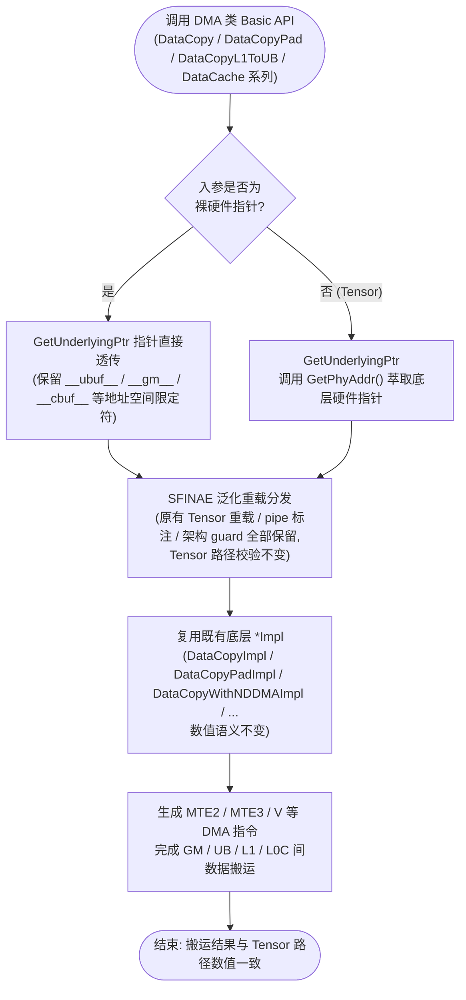

# 【社区任务】Ascend C Basic API 指针化扩展（DMA · 数据搬运 / 缓存）设计文档


## 一、需求描述

### 1.1 需求来源

- **任务来源**：9 月社区任务《Ascend C Basic API 优化实现（搬运类接口扩展）》，任务书见 `basic_api_optimize_dma.md`；总述见 `basic_api_optimize.md`。
- **交付目标**：asc-devkit 开源仓 `master` 分支 `include/basic_api` 与 `impl/basic_api` 目录，样例改造提交至 `examples/01_simd_cpp_api/03_basic_api/`，测试提交至 `tests/api/basic_api/`。
- **面向硬件**：Ascend 950 系列产品（`dav-2201` 架构）；CANN 9.0.0 ~ 9.1.0；`ccec` 或毕昇 ASC 编译器。
- **不注册 GE / aclnn 算子**：本任务为 Basic API层扩展，不涉及 Host 侧算子适配。

### 1.2 需求分析

**现状**：DMA 类 Basic API（DataCopy / DataCopyPad / DataCopyL1ToUB / DataCache 系列等，共 5 个 API 名称、44 个重载签名）的对外入参固定为 `LocalTensor<T>` / `GlobalTensor<T>`。开发者在纯指针编程范式（静态 Tensor 编程 / C 风格 Kernel）下，必须先构造 Tensor 或手动调用 `GetPhyAddr()` 并做地址空间强转才能完成搬运（现有官方样例 `data_copy_gm2ub_nddma`、`data_copy_gm2ub_slice`、`data_copy_l0c2gm` 均为此写法），接口冗余且易错。

**目标范式**：

```cpp
__ubuf__ float xPtr[blockLength];
AscendC::DataCopy(xPtr, x + offset, blockLength);   // 指针直传
AscendC::DataCopy(xLocal, xGm, blockLength);        // 原 Tensor 写法保持不变
```

**实现原理**：现有实现层（`kernel_operator_data_copy_intf_impl.h` 等）的最终形态已经是「Tensor 校验 → `(__ubuf__/__gm__ PrimT<T>*)xxx.GetPhyAddr()` 强转 → 调用 `*Impl` 底层实现」。因此指针化扩展的本质是**打开入参门**：在模板封装层通过统一的指针萃取函数 `GetUnderlyingPtr`（与 VECTOR 分册共用实现）将指针与 Tensor 两条路径收敛到同一套底层 `*Impl`，数值语义天然一致，不改动任何 `*Impl` 实现。

**改造范围（本册边界）**：仅任务书 2.4 接口清单（腾讯文档总表类型码 **D**）所列 DMA 接口，含 GM/UB/L1 间 DataCopy、DataCopyPad、DataCopyL1ToUB 及 DataCache 系列；不改动 VECTOR / CUBE 分册文件，不变更 `*Impl` 数值语义。

## 二、方案设计

### 2.1 接口内部实现

**计算路径**：不涉及新的计算，仅数据搬运（MTE2/MTE3/V 等 pipe 上的 DMA 指令）。整体实现流程：



**地址空间覆盖**：底层指令通路涉及 `__ubuf__` / `__gm__` / `__cbuf__` / `__cc__` / `__ca__` / `__cb__` 各存储层级间的搬运。

**核心机制 1 —— 指针萃取函数**（新增，与 VECTOR 册共用，置于 `impl/basic_api/kernel_utils_base.h` 或新建 `kernel_ptr_utils.h`）：

```cpp
template <typename U>
__aicore__ inline auto GetUnderlyingPtr(const U& val) {
    if constexpr (Std::is_pointer_v<U>) {
        return val;                 // 已是 __ubuf__/__gm__/__cbuf__ 等硬件指针：直接透传
    } else {
        return val.GetPhyAddr();    // LocalTensor / GlobalTensor：萃取底层硬件指针
    }
}
```

`LocalTensor::GetPhyAddr` 返回 `PrimType*`，`GlobalTensor::GetPhyAddr` 返回 `__gm__ PrimType*`（见 `kernel_tensor.h:157/267`），地址空间限定符在 `auto` 返回类型下完整保留，萃取过程零运行时开销（编译期分支），满足「不引入与输入规模线性相关的额外 Device 内存拷贝」的内存要求。

**核心机制 2 —— Tensor 判定 trait**（新增）：

```cpp
template <typename T> struct IsTensor : Std::false_type {};
template <typename T> struct IsTensor<LocalTensor<T>> : Std::true_type {};
template <typename T> struct IsTensor<GlobalTensor<T>> : Std::true_type {};
```

**核心机制 3 —— 泛化重载与编译期路径分发**（对清单内每个签名逐条改造）：

```cpp
// 原 Tensor 签名（保留，实现一字不动，保证兼容性）：
template <typename T>
__aicore__ inline __inout_pipe__(MTE2) void DataCopy(
    const LocalTensor<T>& dst, const GlobalTensor<T>& src, const uint32_t count);

// 新增泛化签名（SFINAE 排除 Tensor 组合，避免与原重载冲突）：
template <typename T, typename U,
          typename Std::enable_if<!IsTensor<T>::value || !IsTensor<U>::value, bool>::type = true>
__aicore__ inline __inout_pipe__(MTE2) void DataCopy(const T& dst, const U& src, const uint32_t count)
{
    DataCopyImpl(GetUnderlyingPtr(dst), GetUnderlyingPtr(src), count);
}
```

**指针路径的校验策略**：原实现的 `CheckDataCopyTensor` / `CheckBasicDataCopyTypeSupport` 等校验依赖 Tensor 携带的 position / size 元信息，裸指针无法提供。设计决策为：
- Tensor 路径：全部原有校验保持不变；
- 指针路径：类型支持类校验（如 `CheckBasicDataCopyTypeSupport<T>`）以 `remove_pointer_t` 后的元素类型继续执行；依赖 Tensor 元信息的运行时校验（地址对齐、越界）在指针路径跳过，由调用方保证合法性（与裸指针编程惯例一致）。该取舍将在接口注释中明示。

**改造中逐条保持不变的属性**：
- `__inout_pipe__(MTE2 / MTE3 / V)` pipe 标注；
- 架构宏 guard（`__NPU_ARCH__ == 2201 / 3510 / 5102 / 5161 / ...`）；
- 类型转换重载的 `Std::enable_if` 数值约束（float→half、int32→int8 等），指针路径改为对 `remove_pointer_t<T>` 判定；
- 参数结构体（`DataCopyParams` / `Nd2NzParams` / `Dn2NzParams` / `SliceInfo[]` / `MultiCopyParams` / `DataCopyCO12DstParams` / `DataCopyExtParams` 等）完全不动。


### 2.2 接口设计

**Kernel 侧接口**：对外 API 名称、个数、参数结构均不变，仅入参类型由固定 Tensor 泛化为「Tensor 或对应地址空间指针」。以代表性签名为例（完整 44 个签名清单以任务书 2.4 总表为准，逐条同构改造）：

| 签名（简化） | 原 dst 类型 | 原 src 类型 | 扩展后 dst / src 可选类型 | pipe |
| --- | --- | --- | --- | --- |
| DataCopy(dst, src, count) | LocalTensor\<T\> | GlobalTensor\<T\> | `__ubuf__ T*` / Tensor | MTE2 |
| DataCopy(dst, src, count) | GlobalTensor\<T\> | LocalTensor\<T\> | `__gm__ T*` / Tensor | MTE3 |
| DataCopy(dst, src, DataCopyParams) | LocalTensor\<T\> | GlobalTensor\<T\> | 同上组合 | MTE2 |
| DataCopy(dst, src, Nd2NzParams) | LocalTensor\<T\> | GlobalTensor\<T\> | `__cbuf__ T*`（L1）/ `__ubuf__ T*` 与 `__gm__ T*` | MTE2 |
| DataCopy(dst, src, dstSliceInfo[], srcSliceInfo[], dimValue) | LocalTensor\<T\> | GlobalTensor\<T\> | `__ubuf__ T*` 与 `__gm__ T*` | MTE2/MTE3 |
| DataCopy(dst, src, DataCopyCO12DstParams) | GlobalTensor\<T\> | LocalTensor\<U\> | `__gm__ T*` 与 `__cc__ U*`（L0C） | MTE3 |
| DataCopy\<T, dim, config\>(dst, src, MultiCopyParams) | LocalTensor\<T\> | GlobalTensor\<T\> | `__ubuf__ T*` 与 `__gm__ T*`（NdDma） | — |
| DataCopyPad(dst, src, copyParams, padParams) | LocalTensor\<T\> | GlobalTensor\<T\> | `__ubuf__ T*` 与 `__gm__ T*` | MTE2 |
| DataCopyPad(dst, src, DataCopyExtParams) | GlobalTensor\<T\> | LocalTensor\<T\> | `__gm__ T*` 与 `__ubuf__ T*` | MTE3 |
| DataCopyL1ToUB(dst, src, count) | LocalTensor\<T\> | LocalTensor\<T\> | `__ubuf__ T*` 与 `__cbuf__ T*` | — |
| DataCachePreload / DataCacheCleanAndInvalid | GlobalTensor / LocalTensor | — | `__gm__ T*` / `__ubuf__ T*` 等 | — |

**Kernel 接口约束说明**：
1. 指针入参须携带正确地址空间限定符（`__ubuf__` / `__gm__` / `__cbuf__` / `__cc__` / `__ca__` / `__cb__`），普通 C++ 指针（无地址空间）不在支持范围；
2. 指针路径的对齐、越界、dst/src 不可重叠等约束由调用方保证（等价于 Tensor 路径校验的程序员责任子集）；
3. 同一调用中指针与 Tensor 可混合使用（如 `DataCopy(__gm__ T* dst, LocalTensor<T> src, count)`）；
4. 类型转换类重载（float→half 等）的源/目标元素类型约束在指针路径下等价适用。

**Host 侧接口**：无变更。本任务不涉及 Host 侧 API、Tiling 结构与临时空间查询接口。

### 2.3 测试用例设计

**测试策略**：基于官方样例与 `test-cases/` 既有工程改造，每个用例同时保留 Tensor 调用（基线）与指针调用（受测路径），双路输出与 golden 数据三方比对。

| 级别 | 用例 | 覆盖接口 | 覆盖点 |
| --- | --- | --- | --- |
| L0 | data_copy_gm2ub_slice 改造 | DataCopy(SliceInfo[]) ×2 | GM↔UB 双向切片；指针直传 + Tensor 基线对比 |
| L0 | data_copy_pad_gm2ub_ub2gm 改造 | DataCopyPad ×3 | 非 32B 对齐搬运、pad 值填充、双向 |
| L1 | data_copy_gm2l1 改造 | DataCopy(Nd2Nz/Dn2Nz/Nz2Nz) | GM→L1 格式转换三种模式 |
| L1 | data_copy_ub2l1 改造 | DataCopy UB→L1 | Mmad 前置搬运场景 |
| L1 | data_copy_l0c2gm 改造 | DataCopy(Nd2NzParams)、DataCopy(DataCopyCO12DstParams) | L0C→GM 随路量化/NZ2ND/ReLU；`__cbuf__`/`__cc__` 地址空间 |
| L1 | data_copy_gm2ub_nddma 改造 | DataCopy\<T,dim,config\>(MultiCopyParams) | 950 NdDma：Padding/Transpose/Broadcast/Slice 5 场景 |
| L2 | DataCache 系列 | DataCachePreload / DataCacheCleanAndInvalid | GM/UB 指针路径 |
| L2 | 回归 | 全部既有 Tensor 用例 | `tests/api/basic_api` 回归，验证零破坏 |

**精度测试参数**：
- 数据取值范围 [-100, 100]；
- Shape 覆盖 `1`、`32`、`1024`、`2048`（矩阵类按 M/K/N 等价缩放）；
- 数据类型按各接口支持范围选取（half / float / int8_t / int32_t 等）；
- 判定标准：生态算子开源精度标准（实验标准），指针路径与 Tensor 路径相同输入下结果须同时达标且互相一致（bit 级一致预期，因两者收敛到同一 `*Impl`）。


## 三、可维可测

### 3.1 精度标准 / 性能标准

| 验收项 | 标准 | 来源 |
| --- | --- | --- |
| 指针路径精度 | 生态算子开源精度标准（实验标准），Shape 1/32/1024/2048、数值域 [-100,100] 全通过 | https://gitcode.com/cann/opbase/blob/master/docs/zh/ops_precision_standard/experimental_standard.md |
| Tensor 路径回归 | `tests/api/basic_api` 既有用例全部通过（零破坏） | 任务书 2.4 兼容性约束 |
| 性能 | 无硬性指标；报告说明无明显回退 | 任务书 3.3 |
| 内存 | 无随输入规模线性增长的额外 Device 拷贝（编译期类型适配） | 任务书 3.4 |

### 3.2 兼容性分析

- **对外行为**：全部为「新增重载」式扩展，原有 Tensor 签名、SFINAE、pipe 属性、架构 guard 逐条保留，存量 Kernel 源码无需任何修改，二进制行为不变；
- **实现层**：不修改任何 `*Impl` 底层实现与参数结构体；新增代码集中在模板封装层与公共萃取头；
- **仓库边界**：仅改动本册 DMA 接口相关文件，不触碰 VECTOR / CUBE 分册文件，避免姊妹任务 PR 冲突；
- **产品支持**：Ascend 950 系列（`dav-2201`）；其他架构（3510/5102 等）下新泛化重载随原签名的架构 guard 同步生效，不改变各架构原支持范围；
- **风险项**：`MultiCopyParams` 架构 guard 与 950 样例的匹配问题（见 2.1 待确认项），若需扩展 guard 将单列说明并申请评审确认。

## 附录 A：改造文件清单

| 文件 | 改动类型 | 内容 |
| --- | --- | --- |
| `impl/basic_api/kernel_utils_base.h`（或新建 `kernel_ptr_utils.h`） | 新增 | `GetUnderlyingPtr`、`IsTensor`（与 VECTOR 册共用） |
| `include/basic_api/kernel_operator_data_copy_intf.h` | 修改 | DataCopy / DataCopyPad / DataCopyL1ToUB / NdDma 系列新增泛化声明 |
| `impl/basic_api/kernel_operator_data_copy_intf_impl.h` | 修改 | 对应新增泛化实现，收敛到既有 `*Impl` |
| `include/basic_api/kernel_operator_cache_intf.h` | 修改 | DataCache 系列新增泛化声明 |
| `impl/basic_api/kernel_operator_cache_intf_impl.h` | 修改 | 对应新增泛化实现 |
| `tests/api/basic_api/` | 新增/修改 | 指针路径用例（双路对比） |
| `examples/01_simd_cpp_api/03_basic_api/` | 修改 | 搬运类样例迁移为指针写法 |
