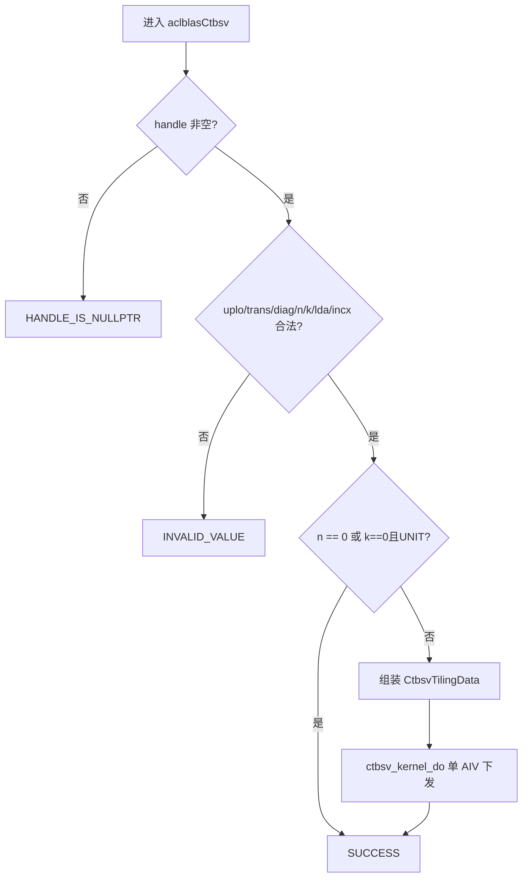

# aclblasCtbsv 算子设计文档

> 任务：9月社区任务 `aclblasCtbsv_A2A3`（Atlas A2/A3）  
> 目标仓：https://gitcode.com/cann/ops-blas  
> 实现目录：`blas/tbsv/arch22/`  
> 测试目录：`test/tbsv/ctbsv/arch22/`  
> 适配硬件：Atlas 800I/T A2、Atlas A3（arch22 / dav-2201）  
> CANN 版本：9.1.0  
> 模板：https://gitcode.com/cann/cann-competitions/blob/master/04_tasks/01_community-task-2026/resources/design_template.md  
> 提交位置：`04_tasks/01_community-task-2026/tasklist/aclblasCtbsv-A2A3/{TeamName}/docs/design.md`

| 项 | 内容 |
|----|------|
| 算子 | aclblasCtbsv |
| 硬件 / CANN | Atlas A2/A3（arch22）/ 9.1.0 |
| 文档日期 | 2026-09-28 |
| 个人仓 | https://gitcode.com/Hidden_wolf/aclblasCtbsv_ops-blas |

---

# 需求背景（required）

## 需求来源

昇腾 CANN 社区任务——9月社区任务《aclblasCtbsv_A2A3》，要求在 Atlas A2/A3 系列产品（arch22）上基于 Ascend C 开发单精度复数（COMPLEX64）三角带状线性方程组求解算子 `aclblasCtbsv`，求解 `op(A) * x = b`（b 存于 x，解写回 x）。语义对齐 cuBLAS `cublasCtbsv`，精度对标 Netlib `ctbsv`（golden 由 cblas / 同构实现生成）。验收通过后合入 https://gitcode.com/cann/ops-blas 。

## 背景介绍

### aclblasCtbsv 算子实现优化

本算子为 BLAS Level-2 求解类接口。昇腾生态中无对应 TBE / ACLNN 图算子实现，不以 TBE 路径为标杆。按任务书要求采用 **ops-blas 句柄式 Kernel 直调**：Host 完成参数校验与 tiling 组装后，经 `handle` 绑定的 stream 下发 Ascend C Kernel。

| 角色 | 路径 / 链接 | 说明 |
|------|-------------|------|
| 语义标杆 | [cuBLAS `cublasCtbsv`](https://docs.nvidia.com/cuda/cublas/index.html#cublas-t-tbsv) | 接口签名、带状存储、uplo/trans/diag；不做奇异性检查 |
| 算法标杆 | [Netlib `ctbsv.f`](https://www.netlib.org/blas/ctbsv.f) | 前向/回代顺序、负步长、`N.EQ.0` 直接返回、`trans=N` 零列短路 |
| 仓内同族 | `blas/tbsv/`、`aclblasStbsv`（若已合入） | Host 校验 / tiling / 测试工程布局参考 |
| 公共类型 | `include/cann_ops_blas_common.h` | `aclblasComplex`、枚举与状态码 |
| 接口声明 | `include/cann_ops_blas.h` | `aclblasCtbsv` 公共头声明，不另设 A2/A3 私有平行接口 |

相对实数 `stbsv`：元素类型为 `aclblasComplex`；`trans = ACLBLAS_OP_C` 须共轭转置；对角除法为复数除法。

### aclblasCtbsv 算子现状分析

#### 标杆支持的数据类型和数据格式

与 cuBLAS `cublasCtbsv`、Netlib `ctbsv` 及任务书 §2.4 一致：

| 参数 | 含义 | 数据类型 | 支持 dtype | 内存 | 排布 / 形状 | 约束 |
|------|------|----------|------------|------|-------------|------|
| handle | 库上下文，绑定 stream | `aclblasHandle_t` | — | Host | scalar | 空指针返回 `HANDLE_IS_NULLPTR` |
| uplo | 上 / 下三角带 | enum | `{UPPER, LOWER}` | Host | attr | 非法返回 `INVALID_VALUE` |
| trans | `op(A)` | enum | `{N, T, C}` | Host | attr | 非法返回 `INVALID_VALUE` |
| diag | 单位 / 非单位对角 | enum | `{NON_UNIT, UNIT}` | Host | attr | 非法返回 `INVALID_VALUE` |
| n | 矩阵阶 | int | n ≥ 0 | Host | scalar | n < 0 非法；n = 0 为 no-op |
| k | 超对角 / 次对角条数 | int | k ≥ 0 | Host | scalar | k < 0 非法 |
| A | 三角带状矩阵，只读 | COMPLEX64 | 实/虚 FLOAT32 | Device | 列主序带状，`lda × n`，有效带宽 k+1 | n > 0 时非空；lda ≥ max(1,k+1) |
| lda | A 的 leading dimension | int | lda ≥ max(1,k+1) | Host | scalar | 否则非法 |
| x | 入口为 b，出口为解 | COMPLEX64 | 实/虚 FLOAT32 | Device | 步长 incx，逻辑长 n | n > 0 时非空；原地覆写 |
| incx | x 元素步长 | int | incx ≠ 0（且 ≠ INT_MIN） | Host | scalar | 负步长按 Netlib 反向遍历 |

不支持广播；不要求 dynamic shape；不支持超出 lda/incx 语义的非连续 Tensor。

#### 标杆实现描述

求解：

```text
op(A) * x = b
op(A) = A      当 trans = ACLBLAS_OP_N
op(A) = A^T    当 trans = ACLBLAS_OP_T
op(A) = A^H    当 trans = ACLBLAS_OP_C
```

要点：

1. `n == 0` 合法 no-op；`k == 0 && UNIT` 时 A 退化为单位阵，x 不变，Host 可短路。
2. 带状列主序（0-based）：LOWER 主对角在第 0 行；UPPER 主对角在第 k 行。
3. 回代方向：`(LOWER && N)` 或 `(UPPER && (T|C))` 前向；其余后向。
4. `UNIT` 不读对角；`NON_UNIT` 做复数除法；`C` 路径对 A 取共轭。
5. `trans = N` 时若当前 `x[j] == 0` 可跳过该列 saxpy（对齐 Netlib）。
6. 不做奇异性检查。

#### 标杆流程图



### aclblasCtbsv 功能分析

| 项 | 内容 |
|----|------|
| 功能 | 求解三角带状 `op(A)*x=b`，解原地写回 x |
| 输入 | handle, uplo, trans, diag, n, k, A, lda, x, incx |
| 输出 | x（原地） |
| 数据类型 | COMPLEX64 |
| 模式 | uplo×trans×diag = 12 组合，全部支持 |
| 广播 | 不支持 |

---

# 需求分析（required）

## 需求描述

在 arch22 上实现 `aclblasCtbsv`，满足：

1. 功能与 cuBLAS `cublasCtbsv` 对齐（含 OP_T / OP_C 区分）。
2. 精度满足生态开源混合容差标准（COMPLEX64 按 FLOAT32 分量）：rtol = atol = 2^-13，matched_ratio ≥ 0.99，max_abs_error ≤ 1e-2 或 32×ULP。
3. 性能：Atlas 800T A2 (910B3) 上任务书 5 个 case 的平均单次耗时不高于标杆。

| case | n | k | uplo | trans | diag | 达标耗时（us） |
|------|---|---|------|-------|------|----------------|
| pf1 | 256 | 8 | UPPER | N | NON_UNIT | 254.5 |
| pf2 | 512 | 32 | LOWER | N | NON_UNIT | 493.8 |
| pf3 | 1024 | 16 | UPPER | T | UNIT | 695.5 |
| pf4 | 2048 | 64 | LOWER | C | NON_UNIT | 2265 |
| pf5 | 4096 | 128 | UPPER | N | UNIT | 2468 |

## 需求拆解

1. **Host**：参数校验、quick return、组装 `CtbsvTilingData`、单 block AIV Kernel 启动（异步依赖 stream）。
2. **Kernel**：12 路编译期模板（uplo×trans×diag）；按 k / trans 分类走面板路径或列双缓冲向量路径；x 常驻 UB。
3. **测试**：CSV 驱动 GTest（`test/tbsv/ctbsv/arch22/`），golden 对齐 Netlib `ctbsv` 语义。

---

# 详细设计（required）

## 算子分析

### 数学公式

对已求解邻元做复乘累减，再按 diag 决定是否除对角：

```text
TEMP = x[j]
TEMP -= Σ_{i in band} op(A)_{i,j} * x[i]     # 等价 Netlib 列形式 saxpy / dot
x[j] = TEMP / op(diag)   # UNIT 时跳过除法
```

复数乘法（fp32）： `(ar+iai)(xr+ixi)=(ar*xr-ai*xi)+(ar*xi+ai*xr)i`。

### 支持数据类型

COMPLEX64（`aclblasComplex`：实部/虚部各 float32，AoS 交错）。

### 支持形状

- A：逻辑 n×n 三角带，半带宽 k，存储 `lda×n`（lda ≥ k+1）。
- x：逻辑长度 n，物理步长 |incx|。
- 无广播；n、k 为运行时标量入参。

## 算子实现

### 实现方案

#### Host 侧设计

文件：`blas/tbsv/arch22/ctbsv_host.cpp`

1. **校验顺序**：handle → n/k 非负 → uplo/trans/diag 枚举 → lda ≥ max(1,k+1) → incx ≠ 0 且 ≠ INT_MIN → n>0 时 A/x 非空。
2. **Quick return**：`n==0` 或（`k==0 && UNIT`）直接 `SUCCESS`。
3. **Tiling**：填充 `CtbsvTilingData`（无数组字段）：

| 字段 | 含义 |
|------|------|
| a, x | Device 地址（uint64） |
| n, k, lda | 规模与前导维 |
| uplo, trans, diag | 模式枚举编码 |
| incx | 步长 |
| reserved | 可选 panel 上限（0 表示自动） |

4. **分核**：回代存在行间依赖，**固定 BlockDim=1（AIV-only）**，不跨核并行列更新。
5. **下发**：`ctbsv_kernel_do(tiling, stream)`，按 uplo/trans/diag 选择 12 个模板入口之一。

#### Kernel 侧设计

文件：`blas/tbsv/arch22/ctbsv_kernel.cpp`（`KERNEL_TYPE_AIV_ONLY`）

**分类策略（更细致路径选择）：**

| 条件 | 路径 | 说明 |
|------|------|------|
| `trans≠N` 且 `k≥24` | `ProcessTransVec` | 列 ping-pong 预取 + `GatherMask` 拆 A + `Gather`/`Mul`/`ReduceSum` 向量点积 |
| `trans=N` 且 `k≥32` | `ProcessNoTransColVec` | 列 ping-pong + `GatherMask` SoA + `Gather`/`Muls`/`Sub` 向量 saxpy；零元跳过 |
| `trans=N` 且 `24≤k<32` | 面板 + SoA | 多列 `DataCopyPad` 进 UB；`GatherMask` 拆 x；对齐段向量 `Sub` 写回 |
| 其余小 k | 面板 + 标量/展开 | Dot/Saxpy 4 路展开；面板按 UB 预算切 `panelCols` |

**数据流：**

1. Load x → UB（incx==1 用 `DataCopyPad`；否则按步长标量读）。
2. 按路径加载 A 列或面板；计算在 UB 内完成。
3. Store x 写回 GM。

**UB 预算（约 192KB）：** 预留 x 与临时 SoA/工作区后，面板列数 `panelCols = avail / (lda * sizeof(complex))`，可被 `reserved` 收紧。

**说明：** arch22（dav-c220）上 `DeInterleave` 链接不可用，统一用 `GatherMask` 做复/实虚拆分，与 950 成功实现（PR445）算法同构、API 按硬件适配。

#### 工程文件

| 文件 | 职责 |
|------|------|
| `ctbsv_host.cpp` | 校验、tiling、launch |
| `ctbsv_kernel.cpp` | 12 模板 Kernel + dispatch |
| `ctbsv_kernel.h` | `ctbsv_kernel_do` 声明 |
| `ctbsv_tiling_data.h` | `CtbsvTilingData` |
| `include/cann_ops_blas.h` | API 声明 |
| `test/tbsv/ctbsv/arch22/*` | CSV + GTest |

---

# 支持硬件

| 支持的芯片版本 | 涉及勾选 |
|----------------|----------|
| Atlas 800I/T A2 | √ |
| Atlas A3 系列 | √ |

（自验证 / 性能以 Atlas 800T A2 (910B3) 为主，与任务书一致。）

---

# 算子约束限制

| 约束项 | 内容 |
|--------|------|
| 参数合法性 | 见任务书 §2.5；非法返回对应 `aclblasStatus_t` |
| 非连续 Tensor | 仅支持 lda / incx 语义 |
| broadcast | 不涉及 |
| dynamic shape | 不要求（n/k 运行时入参） |
| 原地语义 | x 原地读写；A 与 x 不允许重叠 |
| 确定性 | 不要求 |
| 空 / 零维 | n=0 合法 no-op |
| 异步 | 依赖 `aclblasSetStream`；读回前须同步 |

---

# 可维可测分析

## 精度标准 / 性能标准

| 验收标准 | 描述 | 标准来源 |
|----------|------|----------|
| 精度标准 | COMPLEX64：rtol=atol=2^-13，matched_ratio≥0.99，max_abs_error≤1e-2 或 32×ULP；混合容差逐元素比对 | 任务书 §3.2 / 生态开源精度标准 |
| 性能标准 | pf1–pf5 平均耗时 ≤ 任务书标杆（见上表） | 任务书 §3.3 |
| 自测手段 | CSV + GTest；golden 对齐 Netlib `ctbsv`；性能 warmup 后有效采样取均值（可辅 msprof Task Duration） | 任务书 §3.5 |

当前实现自测（host chrono，warmup10 + sample60 去最高 10 次均值，910B4/arch22）：

| case | 目标 us | 实测 us | 判定 |
|------|---------|---------|------|
| pf1 | 254.5 | ~26 | PASS |
| pf2 | 493.8 | ~194 | PASS |
| pf3 | 695.5 | ~370 | PASS |
| pf4 | 2265 | ~1169 | PASS |
| pf5 | 2468 | ~2313 | PASS |

## 兼容性分析

新算子，不涉及兼容性分析。接口声明放入 `include/cann_ops_blas.h`，禁止定义产品私有平行 API。
