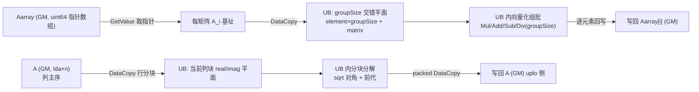

# Atlas 950 单精度复数 Cholesky 分解、求解与批量接口 算子设计文档

> - 提交位置（`cann-competitions`）：
>   `04_tasks/01_community-task-2026/tasklist/aclsolverCpotrf-950/fancy66/docs/design.md`，
>   以 PR 形式评审并合入；本地副本见
>   `ops-solver-cholesky-950/task_submission/附件/算子设计文档.md`。
> - 章节结构遵循官方 `04_tasks/01_community-task-2026/resources/design_template.md`
>   （需求背景 / 需求分析 / 详细设计 / 可维可测分析，四章均为 required）。
> - 文中「任务书」指 `Atlas950_Cpotrf_Cpotrs_Cpotri_CpotrfBatched_CpotrsBatched_task_doc.md`；
>   「任务包」指 `9月社区任务-单精度复数Cholesky分解、求解和批量接口(950)/` 下的
>   `cpotrf/`、`cpotrs/`、`cpotri/`、`cpotrfbatched/`、`cpotrsbatched/` 五个自测包。
> - 若社区任务表对本任务规定了目录编号前缀，须以社区仓实际命名为准（见 §3.8-5）。

# 1. 需求背景（required）

## 1.1 需求来源

CANN 社区任务 2026（9 月批次）算子开发任务：Atlas 950（Ascend 950PR）单精度复数
Cholesky 分解、求解和批量接口，共 5 个接口，作为**同一社区任务一并交付，不允许拆分验收**
（任务书 §1、§7.1）：

| NPU 交付接口 | 对标 CUDA 接口 |
|---|---|
| `aclsolverCpotrf` / `aclsolverCpotrf_bufferSize` | `cusolverDnCpotrf` / `cusolverDnCpotrf_bufferSize` |
| `aclsolverCpotrs` | `cusolverDnCpotrs` |
| `aclsolverCpotri` / `aclsolverCpotri_bufferSize` | `cusolverDnCpotri` / `cusolverDnCpotri_bufferSize` |
| `aclsolverCpotrfBatched` | `cusolverDnCpotrfBatched` |
| `aclsolverCpotrsBatched` | `cusolverDnCpotrsBatched` |

验收通过后合入 `https://gitcode.com/cann/ops-solver`。

## 1.2 背景介绍

Hermitian 正定线性系统的求解是稠密线性代数的核心原语之一：给定复数 Hermitian 正定矩阵
`A`，Cholesky 分解给出 `A = L·Lᴴ`（或 `A = Uᴴ·U`），随后通过前代/回代即可求解 `A·X = B`，
或由因子直接得到 `A⁻¹`。相对 LU 分解，它利用正定性把计算量减半、无需选主元、天然数值稳定，
是复数协方差矩阵、谱方法、复数最小二乘、以及各类复数域科学计算与信号处理（含 FFT 频域
求解）的标准解法。

在 GPU 生态中该能力由 cuSolver DN 的 legacy API 提供（`cusolverDnCpotrf` / `potrs` /
`potri` 及 `potrfBatched` / `potrsBatched`），已有大量上层库与业务代码按该接口形态调用。
NPU 侧 `ops-solver` 仓当前已提供 `cgetrf`、`cgetri`、`sgetrf`、`sgetri`、
`cmatinv_batched`、`cgetri_batched`、`cheevj` 等算子，但**复数 Cholesky 系列没有任何
原型实现**（任务书 §1），因此本任务为全新实现，接口/功能/参数/约束与对标 CUDA 接口对齐。

与已有算子相比，本任务的特殊性在于：

1. **五个接口耦合交付**：`potrs` / `potri` / `potrsBatched` 的输入是 `potrf` 产出的因子，
   接口语义、`uplo` 一致性、`info` 语义必须成套定义；
2. **批量规模极端**：`batchSize` 上限 1e6，`n` 上限 4096，批量侧必须按指针数组形态处理，
   不能退化为连续张量；
3. **性能门禁刚性**：达标判据为 `T_NPU ≤ T_GPU_data / 0.35`（任务书 §3.3.2），
   且覆盖 4096 阶单个矩阵与 1e5 量级批量两类差异极大的负载。

## 1.3 现有实现分析

### 1.3.1 依赖基线

- 工程形态：**ops-solver Host C API + AscendC/CATLASS Kernel 直调**（任务书 §2.2），
  非 aclnn 两段式、非 PyTorch 接口；
- 公开头文件：`include/cann_ops_solver.h`、`include/cann_ops_solver_common.h`，
  须为 C 可调用；
- handle 复用已有实现：`aclsolverCreate` / `Destroy` / `SetStream` / `GetStream`；
- 编译入口：`bash build.sh --pkg --soc=ascend950 --ops=<算子名>`，测试入口
  `bash build.sh --soc=ascend950 --ops=<算子名> --run`（见仓内 `QUICKSTART.md`）。

### 1.3.2 当前分支原型状态（作为正确性基线，非性能达标证据）

本设计对应分支已落地一版**公共契约正确性基线**，其边界如实记录如下（数据来源：本分支
`task_submission/1 自验证步骤说明.md`）：

| 项 | 状态 |
|---|---|
| 头文件接口 | 5 个接口 + `_bufferSize` + `aclFloatComplex` / `aclsolverFillMode_t` 已定义 |
| Host 侧 | 参数校验、workspace 查询、tiling 上传、kernel 下发已实现 |
| Kernel 侧 | 标量/半向量混合实现：`Factor`（GM 标量）、`FastFactor`（n≤128 UB 分组）、`VectorFactorLower`（n>128 LOWER 行分块）、`SolveOne`（potrs/potri） |
| ABI 与 NPU correctness | 已在 Ascend 950PR 上通过（非默认 stream、LOWER/UPPER、lda/ldb padding、批量指针数组、确定性、非正定 info、`potrsBatched(nrhs=2)` 报错） |
| 性能 | **未达标**。P-01（n=1024, LOWER）记录 kernel ≈ 4,957,881 us（门限 2,257.143 us）；P-09（n=32, batch=102774）≈ 42,505.039 us（门限 8,470.857 us） |
| 精度复核 | 仅 `max_factor_residual` 单指标（n=256 → 0.00238、n=512 → 0.00415）；**尚未接入任务包的三层判定与双支阈值** |

结论：当前实现证明了「接口语义 + 数值通路 + info 契约」可行，但**算法路线（标量依赖链、
单核处理单矩阵、未使用矩阵乘加速单元）不足以支撑 0.35×GPU 的性能门禁**，需要在设计层面
重新规划分块与并行方案，这正是本文第 3 章的主体。

# 2. 需求分析（required）

## 2.1 需求描述

在 Ascend 950PR 上实现 5 个 `aclsolver*` 接口，接口风格、参数序列、约束与 cuSolver DN
legacy API 对齐；全部矩阵为**列主序**、**Device 指针**、**COMPLEX64**
（`aclFloatComplex` = 两个连续 float：real、imag，与 `cuComplex` 布局一致）；计算在
AI Core 完成，禁止 CPU fallback；`info` 必须真实写入；同输入同 stream 重复执行输出
（含 info）**bit-wise 一致**。

### 2.1.1 接口定义

公共类型补充（`cann_ops_solver_common.h`）：

```c
typedef struct { float real; float imag; } aclFloatComplex;      /* 布局对齐 cuComplex */

typedef enum {
    ACLSOLVER_FILL_MODE_LOWER = 0,   /* 对齐 CUBLAS_FILL_MODE_LOWER */
    ACLSOLVER_FILL_MODE_UPPER = 1    /* 对齐 CUBLAS_FILL_MODE_UPPER */
} aclsolverFillMode_t;
```

接口原型（参数名、顺序、Device/Host 归属与任务书 §2.3 完全一致，维数一律 32-bit `int`）：

```c
aclsolverStatus_t aclsolverCpotrf_bufferSize(aclsolverHandle_t handle, aclsolverFillMode_t uplo,
                                             int n, aclFloatComplex *A, int lda, int *Lwork);
aclsolverStatus_t aclsolverCpotrf(aclsolverHandle_t handle, aclsolverFillMode_t uplo, int n,
                                  aclFloatComplex *A, int lda, aclFloatComplex *Workspace,
                                  int Lwork, int *devInfo);
aclsolverStatus_t aclsolverCpotrs(aclsolverHandle_t handle, aclsolverFillMode_t uplo, int n, int nrhs,
                                  const aclFloatComplex *A, int lda, aclFloatComplex *B, int ldb,
                                  int *devInfo);
aclsolverStatus_t aclsolverCpotri_bufferSize(aclsolverHandle_t handle, aclsolverFillMode_t uplo,
                                             int n, aclFloatComplex *A, int lda, int *Lwork);
aclsolverStatus_t aclsolverCpotri(aclsolverHandle_t handle, aclsolverFillMode_t uplo, int n,
                                  aclFloatComplex *A, int lda, aclFloatComplex *Workspace,
                                  int Lwork, int *devInfo);
aclsolverStatus_t aclsolverCpotrfBatched(aclsolverHandle_t handle, aclsolverFillMode_t uplo, int n,
                                         aclFloatComplex *Aarray[], int lda, int *infoArray,
                                         int batchSize);
aclsolverStatus_t aclsolverCpotrsBatched(aclsolverHandle_t handle, aclsolverFillMode_t uplo, int n,
                                         int nrhs, aclFloatComplex *Aarray[], int lda,
                                         aclFloatComplex *Barray[], int ldb, int *info,
                                         int batchSize);
```

关键参数语义（完整表见任务书 §2.4）：

| 参数 | 归属 | 语义 / 约束 |
|---|---|---|
| `uplo` | Host 标量 | 仅 LOWER/UPPER；`potrs`/`potri` 须与分解时一致；非法枚举 → `ACLSOLVER_STATUS_INVALID_ENUM` |
| `n` | Host 标量 | `n >= 0`；`n < 0` → `INVALID_VALUE` 并写 `info=-2` |
| `A` | Device | 原地输入输出；`lda >= max(1, n)`；`n>0` 时空指针报错；未使用三角视为 workspace 可被破坏 |
| `B` | Device | `potrs` 原地输入 B、输出 X；`ldb >= max(1, n)` |
| `Workspace` / `Lwork` | Device / Host | `potrf`/`potri` 专用；元素个数由对应 `_bufferSize` 查询；`Workspace==NULL && Lwork>0` 报错 |
| `devInfo` | Device | `[1]` INT32：`0` / `-i`（第 i 个参数非法）/ `k>0`（第 k 阶顺序主子式不正定） |
| `Aarray` / `Barray` | Device 指针数组 | 长度 `batchSize`；**不是** `[batch,n,n]` 连续张量 |
| `infoArray` | Device | `[batchSize]` INT32，逐矩阵独立状态；参数错误写 `infoArray[0] = -i` |
| `info`（potrsBatched） | Device | 标量，仅报参数错误；正定性由 `potrfBatched` 的 `infoArray` 负责 |

### 2.1.2 交付形态

- 公开头文件（C 可调用）+ Host 实现（参数校验、workspace、tiling、下发）+ Kernel 实现
  （AscendC/CATLASS）+ 测试工程 + 文档；
- 建议合入路径（任务书 §5）：`include/`、`src/{cpotrf,cpotrs,cpotri,cpotrf_batched,cpotrs_batched}/`、
  `test/` 对应目录、`docs/zh/*.md`、`docs/api_list.md`、README；
  最终目录粒度以评审意见为准（见 §3.8 待评审项）。

## 2.2 需求拆解

| 编号 | 需求项 | 说明 | 验收来源 |
|---|---|---|---|
| R1 | 五个接口语义正确 | `potrf` 分解、`potrs` 求解、`potri` 求逆、批量两接口，含 LOWER/UPPER | 任务书 §2.1 |
| R2 | 参数契约完整 | 非法枚举/维数/指针/lda/ldb 返回 `INVALID_VALUE` 并写 `-i`；空问题成功返回；`potrsBatched` 仅 `nrhs=1` | 任务书 §2.4 |
| R3 | `info` 真实写入 | 非正定 `i>0`（potrf/potrfBatched 逐矩阵）；因子奇异 `i>0`（potri）；`potrs*` 仅参数错 | 任务书 §2.4、§3.2.1 |
| R4 | 精度达标 | 逐元素混合容差优先，LAPACK 残差双支阈值复核 | 任务书 §3.2 |
| R5 | 性能达标 | 逐 case `T_NPU ≤ T_GPU_data / 0.35`（12 个门禁用例全量覆盖） | 任务书 §3.3 |
| R6 | 工程化完备 | Host/Kernel/测试/文档/README 齐备，可编译可测试，按仓规范无冗余 | 任务书 §4、§5 |
| R7 | 确定性与 stream | 重复执行 bit-wise 一致；走调用方 stream，无非必要 Host 同步 | 任务书 §2.1.7、§2.1.5 |

## 2.3 规模与泛化范围（验收下限）

| 接口 | 维数 | 其他 |
|---|---|---|
| `aclsolverCpotrf` / `aclsolverCpotri` | `n ∈ [1, 4096]` | uplo 覆盖 LOWER/UPPER；支持 `lda` padding |
| `aclsolverCpotrs` | `n ∈ [1, 4096]`，`nrhs ∈ [1, 128]` | uplo 覆盖 LOWER/UPPER |
| `aclsolverCpotrfBatched` | `n ∈ [1, 4096]`，`batchSize ∈ [1, 1000000]` | uplo 覆盖 LOWER/UPPER |
| `aclsolverCpotrsBatched` | `n ∈ [1, 4096]`，`batchSize ∈ [1, 1000000]`，`nrhs = 1` | `nrhs = 2` 必须报错 |

其他约束：不支持 broadcast、不要求图融合；dynamic shape（Host 按本次 `n/nrhs/batchSize`
生成 tiling）；用例构造保证输入数据占用内存在 4 GB 范围内（任务书 §2.4 备注）。

## 2.4 验收口径摘要

- **精度**（任务书 §3.2）：`golden` 用 COMPLEX128 CPU 参考（`zpotrf`/`zpotrs`/`zpotri`
  或 NumPy/SciPy 等价）；
  1. 逐元素：实部/虚部分别按 FLOAT32 判 `|actual-golden| ≤ atol + rtol·|golden|`，
     `rtol = 2^-10`、`atol = 2^-16`、`required_matched_ratio = 0.99`、
     `max_abs_error_limit = 1e-2 or 32·ULP`；
  2. 未通过时复核 LAPACK 残差：`potrf` 用 `ratio = ‖FFᴴ−A‖₁/(n‖A‖₁·ε)`，
     `potrs` 用 `ratio = max_j‖B_j−AX_j‖₁/(‖A‖₁‖X_j‖₁·ε)`，
     二者判据 `ratio ≤ max(5·ratio_cpu, 3·ratio_cpu_mean)`；
     `potri` 用 `ratio = ‖I−AC‖₁/(n‖A‖₁‖C‖₁·ε)`，判据 `ratio ≤ max(5·ratio_cpu, 0.1)`；
     `ε = 2^-23`；批量逐矩阵判定，任一矩阵超阈即该 case 不通过。
- **性能**（任务书 §3.3）：`T_NPU ≤ T_GPU_data / 0.35`，统计对象为 **NPU kernel 耗时**
  （`msprof op` → `OPSPROF_*/OpBasicInfo.csv` 的 `Task Duration(us)`），每 case 采样 30 次
  取中位数，不含首次编译/数据生成/H2D-D2H。
- **结论口径**：数值通过 ≠ 正式验收通过（`formal` 恒 `PENDING_RULING`）；复数实部/虚部分别判定；
  残差超阈可举证实现无 bug 并分析误差来源（申诉通道）。

# 3. 详细设计（required）

## 3.1 算子分析

### 3.1.1 数学定义

设 `A ∈ C^{n×n}` 为 Hermitian 正定矩阵，`B ∈ C^{n×nrhs}`。

1. **POTRF**（原地覆写 uplo 指定侧三角）
   - `uplo = LOWER`：`A = L·Lᴴ`，`L` 下三角，对角元为实数（`L_ii > 0`）；
   - `uplo = UPPER`：`A = Uᴴ·U`，`U` 上三角，对角元为实数。
2. **POTRS**（因子已知，原地求解）
   - LOWER：`L·Y = B`（前代）→ `Lᴴ·X = Y`（回代）；
   - UPPER：`Uᴴ·Y = B` → `U·X = Y`。
3. **POTRI**（因子已知，原地求逆）
   - 输出 Hermitian 逆矩阵 `C = A⁻¹` 在 uplo 指定侧三角；等价于对因子求逆后对称乘：
     `C = L^{-ᴴ}·L^{-1}`（LOWER）。
4. **POTRFBATCHED / POTRSBATCHED**：对 `i = 0..batchSize-1` 独立执行上列 1/2，
   `Aarray[i]`、`Barray[i]` 各自独立 `lda/ldb` 步长（同一次调用内 lda/ldb 相同）。

### 3.1.2 复数运算拆解

为避免复数类型在 AI Core 上的额外开销，内核统一采用**实虚分离（split-complex）**表示：
每个复数元素在指令层面拆成 `(real, imag)` 两个 float 标量或两个独立平面（`real[]`、`imag[]`）。
关键运算按实数指令组合：

| 复数运算 | 实数指令实现 | 指令数 |
|---|---|---|
| `c = a·b` | `re = a.re·b.re − a.im·b.im`；`im = a.re·b.im + a.im·b.re` | 4 Mul + 2 Add/Sub |
| `c = a·conj(b)` | `re = a.re·b.re + a.im·b.im`；`im = a.im·b.re − a.re·b.im` | 4 Mul + 2 Add/Sub |
| `c = a − Σ(a_ik·b_jk)`（POTRF 更新） | 逐项上式的累减 | 每项 6 条 |
| Hermitian 对角 | 对角虚部恒为 0，`sqrt(real)` 前须校验实部为正 | 1 Sqrt |
| `C = L^{-ᴴ}L^{-1}` | 三角求逆 + 复数三角矩阵乘 | 复用 GEMM |

其中 `conj` 出现在 LOWER 的秩更新（`L·Lᴴ`）与 UPPER 的对应式中，符号差异由 uplo 分支吸收。

### 3.1.3 算法选型

**POTRF — 分块（right-looking）Cholesky，N 阶 → 三种 BLAS-3 操作**：

```
for j = 0, nb, 2nb, ... :
    A11 = potrf(A11)                 # 对角块分解（未分块的 POTF2，小 nb）
    A21 = trsm(A11, A21)             # 下三角求解，nb × nb 块
    A22 = syrk/herk(A21, A22)        # 秩更新 A22 -= A21·A21ᴴ
```

- 分块把 O(n³) 的标量依赖链转成 BLAS-3（TRSM + HERK），可走矩阵乘加速单元与多核并行；
- 对角块 `nb` 取 64/128（与 UB 容量、GEMM tile 对齐），对角块内部仍用未分块算法保证
  `info` 的第 k 阶语义（遇 `A_kk ≤ 0` 立即停止并写 `info = k`）；
- UPPER 通过「转置视角」统一到同一份内核：对 K 维索引步长与 conj 方向做镜像，避免写两套代码。

**POTRS — 分块三角求解**：把 `B` 按列（或列块）分块，前代 + 回代各一次，
按 `nrhs` 分核并行；`nrhs` 大时按列块切分以提高并行度。

**POTRI — 两条候选路线**：

| 路线 | 做法 | 优点 | 风险 |
|---|---|---|---|
| A | `trtri` 求 `L^{-1}` → `syrk/herk` 得 `L^{-ᴴ}L^{-1}` | 计算量小（n³/3 + n³/3） | 需实现复数 `trtri` |
| B | 复用 `potrs`：解 `A·X = I`，取 uplo 侧 | 复用已实现求解路径，语义等价且易对齐 `cusolverDnCpotri` | 计算量约 n³（高 1.5 倍）；需 workspace 放单位矩阵 |

当前原型采用 B（`workspace` 存 n×n 单位矩阵，复用 `SolveOne` 后回写 uplo 侧），
作为正确性路径保留；**性能达标路线需评估 A（trtri + herk）**，见 §3.8。

**BATCHED**：批量接口的值在于「小矩阵 × 超大批量」的吞吐，因此：

- 小矩阵（`n ≤ 32`）走「矩阵维打包进向量通道」的批处理内核：把 `groupSize` 个矩阵的同一
  元素位置打包成一个向量，用一次 `Mul/Add/Div` 处理整组（当前实现 `FastFactorBatch`
  即此思路，groupSize=16）；
- 大矩阵走「一维核并行的单矩阵内核 × 批量调度」：每个核处理一个矩阵，Host 侧按
  每 kernel 调用 65535（potrsBatched）或 `65535 × groupSize`（potrfBatched 小矩阵分组）
  分批下发，规避 grid 维度上限；
- 批量 `potrf` 必须逐矩阵独立写 `infoArray[i]`，某矩阵失败不影响其余矩阵继续分解。

## 3.2 工程结构设计

### 3.2.1 文件布局

| 层 | 文件 | 职责 |
|---|---|---|
| 公开头 | `include/cann_ops_solver.h`、`include/cann_ops_solver_common.h` | 接口原型、`aclFloatComplex`、`aclsolverFillMode_t`、状态码 |
| Host | `src/cholesky/cholesky_host.cpp` | 参数校验、`_bufferSize`、tiling 结构、kernel 下发 |
| Kernel | `src/cholesky/cholesky_kernel.cpp` | 单矩阵/批量 kernel、分块算法、info 写入 |
| 测试 | `test/cholesky/cholesky_contract_test.cpp` | ABI/类型布局/校验优先级（无需设备） |
| 测试 | `test/cholesky/cholesky_npu_test.cpp` | Device 指针 + 非默认 stream 的功能与契约测试 |
| 测试 | `test/cholesky/cholesky_perf_test.cpp` | 逐用例性能驱动（可被 `msprof op` 单独归因） |
| 测试 | `test/cholesky/data/` | CPU 参考与数据脚本 |
| 文档 | `docs/zh/complex_cholesky.md` | 算子使用说明 |

> 合入 `ops-solver` 时是否按任务书 §5 建议拆成
> `src/{cpotrf,cpotrs,cpotri,cpotrf_batched,cpotrs_batched}/` 五个目录、
> 以及 `docs/zh/` 五篇文档，属**待评审项**（§3.8-1）；当前分支以单一
> `cholesky` 目录承载五接口，便于共享分块内核与 tiling。

### 3.2.2 Host 侧设计

**参数校验（按接口分型，顺序即 `-i` 的取值依据）**

| 接口 | 校验顺序（写 info 的前缀） |
|---|---|
| `potrf` / `potri` | handle → uplo(-1) → n(-2) → A(-3) → lda(-4) → workspace(-5)/lwork(-6) |
| `potrs` | handle → uplo(-1) → n(-2) → nrhs(-3) → A(-3) → lda(-4) → B(-6) → ldb(-7) |
| `potrfBatched` | handle → uplo(-1) → n(-2) → Aarray(-3) → lda(-4) → batchSize(-6) → infoArray |
| `potrsBatched` | handle → uplo(-1) → n(-2) → nrhs(-3) → Aarray(-4) → lda(-5) → Barray(-6) → ldb(-7) → batchSize(-9) |

约定：`n=0` / `nrhs=0` / `batchSize=0` 属**空问题**，在写入 info 之前成功返回；
`potrsBatched` 在 `n>0 && batchSize>0` 时 `nrhs != 1` 直接返回 `INVALID_VALUE`
并写 `info = -3`。

**workspace 计算**：当前 `_bufferSize` 返回 `n × n` 个 `aclFloatComplex` 元素
（`potrf` 用于分块对角块/临时区，`potri` 用于单位矩阵），并做 `int` 溢出检查；
`Lwork` 小于需求量时返回 `INVALID_VALUE` 并写 `-6`。

**tiling 结构**（Host 计算、一次 H2D 上传，kernel 不重复推导）：

| 字段 | 含义 |
|---|---|
| `n` / `nrhs` / `lda` / `ldb` | 规模与步长 |
| `batch` / `batchOffset` | 本次 kernel 调用的矩阵数与本批在指针数组中的起始槽位 |
| `uplo` / `op` | 三角方向；操作码（`0=potrf`、`1=potrs`、`2=potri`） |

**核数计算**：单矩阵路径 `blocks = batch`；批量路径 `blocks = ceil(batch / groupSize)`
（`potrf && n ≤ 32` 时 `groupSize = 16`，否则 1）。Host 侧对 `batchSize` 做分段循环下发
（`potrsBatched` 每批 ≤ 65535，`potrfBatched` 每批 ≤ `65535 × groupSize`），
保证任意 `batchSize ∈ [1, 1e6]` 都能覆盖且不触发 grid 上限。

**stream 语义**：kernel 一律下发到 `aclsolverGetStream(handle)` 返回的调用方 stream；
除参数错误时写入 `-i` 的小块 `aclrtMemcpy`（H2D）外不做任何 Host 同步与阻塞等待。

### 3.2.3 info 语义与写入策略

| 接口 | info 形态 | 取值 |
|---|---|---|
| `potrf` / `potri` | `int[1]` | `0` 成功；`-i` 参数错；`k>0` 第 k 阶顺序主子式不正定（potri 为因子奇异） |
| `potrs` | `int[1]` | `0` / `-i`（无正定性检查职责） |
| `potrfBatched` | `int[batchSize]` | 逐矩阵 `0 / k`；参数错写 `infoArray[0] = -i` |
| `potrsBatched` | `int[1]` | `0` / `-i` |

写入方式：kernel 内用 `AtomicExch` 直接写 GM（当前实现 `SetInfo`），保证：
1. 非正定提前退出时 info 已落盘，`info` 反映**首个**失败阶数（按列序递增扫描，天然满足最小 k）；
2. 批量场景每核只写自己的槽位，无竞争；
3. 空问题与参数错路径在 Host 侧用 H2D 写入，不启动 kernel。

## 3.3 Kernel 侧设计

### 3.3.1 分核与并行策略

| 场景 | 并行维度 | 说明 |
|---|---|---|
| 单矩阵 `potrf`（n ≥ 64） | 无跨矩阵并行（`blocks=1`）→ 核内分块 + 未来的核间列分块 | 当前原型的 `VectorFactorLower` 为单核行分块；性能路线需引入列分块 GEMM 并行（§3.4） |
| 单矩阵 `potrs` | `nrhs` 维 | 每列（或列块）独立，天然并行 |
| 单矩阵 `potri` | 复用 `potrs` 的列并行（单位矩阵按列） | |
| 批量（`n ≤ 32`） | 矩阵维打包进向量通道（`groupSize=16`） | 一次向量指令处理 16 个矩阵的同一元素位置 |
| 批量（`n > 32`） | 矩阵维映射到核（一核一矩阵） | 核间无依赖，`blocks = batch` |

### 3.3.2 数据通路与 UB 规划

以 LOWER POTRF 为例（含批处理分组路径）：



| 路径 | UB 主要内容 | 现状 / 规划 |
|---|---|---|
| `FastFactor`（n≤128） | 实/虚两个平面 + 4 段 scratch（`≥ 2·n² + 4·(2n) + 256` float） | 已实现，向量指令按列更新 |
| `FastFactorBatch`（n≤32 组批） | `2·n²·groupSize + 4·groupSize + 256` float，`groupSize=16` | 已实现，按元素位置打包 |
| `VectorFactorLower`（n>128） | 单行块（tile=1024 元素）+ packed 输出缓冲 | 已实现，但依赖链仍在标量侧，性能不足 |
| 性能路线（规划） | 对角块 + TRSM/HERK tile 双缓冲（按 CATLASS/GEMM tile 对齐） | 待实现 |

### 3.3.3 Kernel 关键实现点（当前原型，作为正确性基线）

1. **对角实部保护**：`sqrt` 前校验 `!(sr > 0.0f) || sr != sr || sr > FLT_MAX` 三种异常，
   命中即写 `info = k` 并返回，保证不产生 NaN 污染后续列；
2. **对角虚部清零**：对角元虚部按实数语义强制写 0；
3. **uplo 两分支分别展开**：LOWER 用 `L·Lᴴ`（`re -= ar·br + ai·bi`，`im -= ai·br − ar·bi`），
   UPPER 用 `Uᴴ·U`，符号差异显式写出，避免运行期分支；
4. **原地语义**：仅覆写 uplo 指定侧；另一半三角不读不写（可作 workspace 被破坏）；
5. **确定性**：所有归约顺序固定（列序 + 行序固定遍历），无原子浮点累加、
   无跨核 reduction，因此重复执行 bit-wise 一致；批量分组内核逐矩阵独立，也无竞态；
6. **显式流水同步**：UB 搬运（MTE2/MTE3）与向量计算之间显式 `PipeBarrier`/事件同步，
   不依赖 auto-sync（此前出现过读到未就绪数据导致数值崩溃）。

### 3.3.4 精度设计

- 全部计算在 **FP32（COMPLEX64）** 下进行，与验收的混合容差口径一致（任务书 §3.2.1）；
- 累加顺序对齐「CPU 同精度参考链路」的差异由 LAPACK 残差判据吸收
  （`ratio ≤ max(5·ratio_cpu, 3·ratio_cpu_mean)`）；
- 消除的两个系统性误差源：
  1. 对角元素被二次除根（此前 `VectorFactorLower` 首个 tile 曾出现，导致
     `max_factor_residual = 512`）——修复后 n=256/512 残差降至 1e-3 量级；
  2. 标量广播越界（跨行串扰）——向量 scale 一律走向量广播路径；
- 精度自检口径须与任务包对齐：逐元素（实/虚分判）+ LAPACK `ratio` 三层判定，
  当前分支仅有 `max_factor_residual` 单指标，属**待补齐项**（§3.8-3）。

## 3.4 性能优化设计

### 3.4.1 目标分解

门限 `T_NPU ≤ T_GPU_data / 0.35`，逐 case 目标（GPU 数据取自各任务包
`bench_result.json`，即任务书 §3.3 性能对比表）：

| 编号 | 接口 | 规格 | GPU | NPU 门限 |
|---|---|---|---|---|
| P-01 | potrf | n=1024, LOWER | 0.79 ms | ≤ 2.257 ms |
| P-02 | potrf | n=4096, UPPER | 6.7918 ms | ≤ 19.405 ms |
| P-03 | potrf | n=2048, LOWER | 1.5434 ms | ≤ 4.410 ms |
| P-04 | potrs | n=1024, nrhs=1, UPPER | 0.2235 ms | ≤ 0.639 ms |
| P-05 | potrs | n=4096, nrhs=32, LOWER | 2.9488 ms | ≤ 8.425 ms |
| P-06 | potrs | n=2048, nrhs=8, LOWER | 1.0867 ms | ≤ 3.105 ms |
| P-07 | potri | n=1024, LOWER | 1.4534 ms | ≤ 4.153 ms |
| P-08 | potri | n=4096, UPPER | 17.8843 ms | ≤ 51.098 ms |
| P-09 | potrfBatched | n=32, batch=102774, LOWER | 2.9648 ms | ≤ 8.471 ms |
| P-10 | potrfBatched | n=128, batch=46256, LOWER | 18.1601 ms | ≤ 51.886 ms |
| P-11 | potrsBatched | n=32, batch=99659, nrhs=1 | 1.5953 ms | ≤ 4.558 ms |
| P-12 | potrsBatched | n=128, batch=45897, nrhs=1 | 6.0311 ms | ≤ 17.232 ms |

> 门限列为按 `/0.35` 折算值，用于开发期自检；正式判定以验收侧 GPU 基准为准。

### 3.4.2 优化路线（M1 → M3）

| 里程碑 | 内容 | 预期效果 | 状态 |
|---|---|---|---|
| M1 | 标量/半向量正确性基线（GM 标量访问 + 小矩阵 UB 分组） | 语义与 info 契约正确；性能不达标 | 已完成 |
| M2 | UB 行分块向量化（`VectorFactorLower` 思路推广 + 双缓冲流水 + 对角块保护） | 减少 GM 标量访问与重复读，量级提升 | 部分完成，P-01 仍差 3 个数量级 |
| M3 | **BLAS-3 分块 + 矩阵乘单元 + 多核并行**：对角块 POTF2 + TRSM + HERK，按列块分核 | 把 O(n³) 标量依赖链转成 GEMM tile 流水，目标 P-01…P-12 全部进入门限 | 待实现（**性能达标的关键路径**） |

M3 的具体设计要点：

1. **算子拆分**：内核拆成 `potf2`（对角块，nb=64/128）、`trsm`（下三角求解）、
   `herk`（秩更新），后两者用 CATLASS 的 GEMM 模板（复数按 split-complex 双实数 GEMM
   组合，或使用其复数支持版本，见待评审项 §3.8-2）；
2. **多核并行**：n ≥ 512 时按列块划分 panel，panel 内串行、panel 间用核间同步
   （或改用「一核一串行 BLAS-2」的粗并行以换取确定性）；
3. **小批量**：`n ≤ 32` 沿用「矩阵维打包进向量通道」的批处理（groupSize 16/32），
   这是 P-09/P-11 的主要手段；`n = 128` 批量（P-10/P-12）评估「一核多矩阵 +
   UB 常驻」与「一核一矩阵」两种映射的实测取舍；
4. **workspace 复用**：对角块缓冲、TRSM/HERK tile 缓冲与指针数组在正式采样期间复用
   （任务书性能采集协议要求），不在计时循环内分配；
5. **禁止项**：不接受 CPU fallback、不引入非必要 Host 同步、不在计时区间做 H2D/D2H。

### 3.4.3 性能证据要求

- 采集：`msprof op --application=...`，读取 `OPPROF_*/OpBasicInfo.csv` 的
  `Task Duration(us)`，逐 case 30 次取中位数（详见任务包 `PERF_COLLECTION_SUPPLEMENT.md`）；
- 每条结论须附「命令 + 用例 + 样本是否为单一目标 kernel」三项信息；
- 历史数据的有效性须标注：若实现路线已被推翻（如曾因对角二次除根导致残差 512 的
  UB 分块数据），该数据不得作为有效证据（见本分支自验证说明的「当前证据边界」）。

## 3.5 支持硬件

| 芯片版本 | 是否支持 | 对应产品 |
|---|---|---|
| `ascend950` | √ | Atlas 950 / Ascend 950PR（本任务适配硬件） |

CANN 版本：≥ 9.0.0，须与 `ops-solver` 仓 README 已验证配套版本一致
（本分支自验证环境记录为 `cann-9.1.0`）。

## 3.6 算子约束限制

- 仅支持 COMPLEX64（`aclFloatComplex`）输入输出，列主序 ND，不支持 broadcast；
- `potrsBatched` 仅 `nrhs = 1`，`nrhs ≠ 1` 且 `n>0`、`batchSize>0` 时报错；
- `potrs` / `potri` / `potrsBatched` 的输入必须是已完成分解的因子，且 `uplo` 与分解一致；
- 空问题（`n=0` / `nrhs=0` / `batchSize=0`）成功返回且不启动 kernel；
- 已分解侧的未使用三角不保证内容（对齐 cuSolver，验收只比较 uplo 侧）；
- 单次调用输入数据占用内存须控制在 4 GB 以内（任务书 §2.4 备注）。

## 3.7 交付与提交路径

| 交付件 | 形式 | 位置 |
|---|---|---|
| 设计文档 | PR | `cann-competitions/04_tasks/01_community-task-2026/tasklist/aclsolverCpotrf-950/fancy66/docs/design.md` |
| 自测用例与代码 | 代码 + README | 个人仓 + 合入 PR（`test/cpotrf*` 等） |
| 自测报告 | xlsx + 日志 | `task_submission/`（见 §4.4） |
| 待验收代码 | 仓链接/分支/目录 | 个人代码仓，邀请 `Ascend-CANN` 账号为开发者 |
| 合入 PR | PR | `https://gitcode.com/cann/ops-solver`（五接口同 PR 或一组关联 PR） |

## 3.8 待评审 / 待确认项（诚实记录）

1. **合入目录粒度**：任务书 §5 建议 `src/` 下 5 个算子目录 + `docs/zh/` 5 篇文档 +
   `docs/api_list.md` 更新；当前分支为单一 `cholesky` 目录 + 1 篇
   `complex_cholesky.md`。需评审确认「共享分块内核 + 单目录」是否可接受，
   若必须拆分，则按接口名目录化并共享 `utils`。
2. **CATLASS 复数支持**：M3 依赖复数 GEMM（或双实数 GEMM 组合）。`catlass` 仓
   对 COMPLEX64 的支持程度**需在 950PR 环境下实测确认**，尚无实测结论；
   若不支持，退化为「split-complex 双实数 GEMM + 手写复数 epilogue」。
3. **精度判定闭环**：当前仅有 `max_factor_residual` 单指标，需接入任务包
   `verify_accuracy.py` 的三层判定与 `max(5·ratio_cpu, 3·ratio_cpu_mean)` 双支阈值，
   并补 `ratio_cpu` 现场重算对照；批量包另需实现 `sample_map` 余槽 bit-wise 一致性检查。
4. **POTRI 路线**：路线 A（trtri + herk）与路线 B（复用 potrs 解单位矩阵）需在
   实现后以 P-07/P-08 实测择一或分档使用。
5. **任务编号与 TeamName**：截至本次提交，`cann-competitions` 的 `tasklist/` 下
   尚无本任务目录（仓内 422 个任务目录中未检索到 `cpotrf`/Cholesky 条目，任务书正文
   也未给出编号），因此当前以 `aclsolverCpotrf-950/fancy66/` 提交（与仓内
   `aclblasCgbmv-950`、`aclsparseSpSV-950` 等无编号目录形态一致）。若社区任务表
   规定了正式编号前缀，须在 push 前将目录改名为 `{编号}-aclsolverCpotrf-950`。
6. **性能门禁可行性**：当前基线与门限差距达 3 个数量级，M3 是否能把
   P-01/P-02/P-08 这类「超大单矩阵」压入门限，是本任务最大风险，
   需要在设计评审阶段明确分块规模、核数假设与预期加速比；如评审后仍不可达，
   按任务书申诉通道举证并说明。

# 4. 可维可测分析

## 4.1 精度标准 / 性能标准 / 内存标准

| 验收标准 | 描述 | 标准来源 |
|---|---|---|
| 精度标准 | 逐元素：实/虚分判 FLOAT32，`rtol=2^-10`、`atol=2^-16`、`matched_ratio≥0.99`、`max_abs_error≤1e-2 or 32·ULP`；复核：LAPACK `ratio` 双支阈值（potri 为 `max(5·ratio_cpu, 0.1)`） | 任务书 §3.2、`opbase` 生态算子开源精度标准 |
| 性能标准 | 逐 case `T_NPU ≤ T_GPU_data / 0.35`，NPU kernel 平均耗时（30 次采样中位数） | 任务书 §3.3 |
| 确定性 | 合法正定用例重复执行输出（含 info）bit-wise 一致 | 任务书 §3.2.1.5 |
| 内存标准 | 不设限（单次调用输入 ≤ 4 GB） | 任务书 §3.4 |

## 4.2 测试设计

| 测试层次 | 载体 | 覆盖内容 |
|---|---|---|
| ABI/契约（无设备） | `test/cholesky/cholesky_contract_test.cpp` | 接口符号、`aclFloatComplex` 布局、枚举值 0/1、参数校验优先级与返回码 |
| 功能正确性（950PR） | `test/cholesky/cholesky_npu_test.cpp` | LOWER/UPPER；`lda/ldb` padding；`potrf→potrs`、`potrf→potri`、批量两接口；空问题；非正定 `info`；`potrsBatched(nrhs=2)` 报错；非默认 stream；确定性重复 |
| 精度闭环（任务包） | 任务包 `gen_data.py` + DUT executor + `verify_accuracy.py` | 单矩阵包 145 例 / 批量包 151 例 + info 契约例；三层判定 + 双支阈值；批量 `sample_map` 余槽一致性与代表槽逐内容判定 |
| 性能闭环 | `test/cholesky/cholesky_perf_test.cpp` + `msprof op` + 任务包 `verify_perf.py` | P-01…P-12 逐用例 kernel 耗时比值 |
| 回归 | 上述用例重跑 | 每次改动后确认精度/性能无回归 |

**任务包对接契约（必须遵守）**：

1. 造数：`python3 gen_data.py --canonical canonical_cases.json --out data --select all`；
   批量包先 `gunzip cases/index.json.gz`；
2. DUT 输出：逐 case 落 `dut_out/<case_id>.npz`，三键 `out32` / `info` / `status`；
   单矩阵 `out32` 为存储侧半三角、另侧置 0（`potrs` 为整块解）；
   批量为 `(batch, n, cols)`（`batch=1` 不压批维），`potrfBatched` 的 `info` 为
   `(batch,)` int32，`potrsBatched` 为标量；
3. 判定：`verify_accuracy.py` 退 0 = 全通过、退 1 = 有未通过/证据不足、退 2 = 清单不可读
   （此时报告不落盘）；
4. 负例演练可用 `sim_dut.py --perturb scale|conj`，但**模拟输出不构成 NPU 证据**。

## 4.3 可维护性设计

- **参数集中**：`op` 操作码（`OP_POTRF`/`OP_POTRS`/`OP_POTRI`）、`uplo` 取值、
  分块常量（`groupSize=16`、`tile=1024`、批量分段上限 65535）以 `constexpr` 集中定义，
  Host 与 Kernel 两侧结构体字段一一对应；
- **tiling 单一来源**：规模/步长/批偏移全部由 Host 计算并经 tiling 下发，
  kernel 不重复推导形状，避免两侧不一致；
- **契约前置**：参数合法性在 Host 阶段全量校验并写 `info`，kernel 内不做参数判断；
- **同步收敛**：UB 搬运与计算之间的 `PipeBarrier`/事件同步集中在辅助函数中，
  不散布于业务循环；
- **可观测性**：性能驱动支持 `--op/--n/--nrhs/--batch/--uplo/--iterations` 参数化，
  单用例可独立归因，便于与 `OpBasicInfo.csv` 逐条对账；
- **文档同步**：新增/变更接口须同步 `cann_ops_solver.h`、`docs/zh/*.md`、
  `docs/api_list.md` 与本设计文档。

## 4.4 兼容性与风险

**兼容性**：本任务为新增接口，不涉及存量接口破坏性变更。与对标 CUDA 接口的差异仅
命名前缀（`aclsolver` vs `cusolverDn`）、枚举类型名（`aclsolverFillMode_t` vs
`cublasFillMode_t`，取值 0/1 对齐）、复数类型名（`aclFloatComplex` vs `cuComplex`，
内存布局一致），参数序列不变，无需上层做参数映射。

**风险与缓解**：

| 风险 | 影响 | 缓解 |
|---|---|---|
| 性能门限（0.35×GPU）差距大 | 不达标即验收不通过 | 设计评审阶段锁定 M3 分块方案与预期加速比；优先攻 P-01/P-02/P-08 三个大规格 case |
| 复数 GEMM 在 CATLASS 支持不明 | M3 路线不确定 | 先做可行性 spike（小 n 复数 GEMM 实测），并保留 split-complex 手写 epilogue 备选 |
| 批量 1e6 规模内存与调度 | 用例构造/下发失败 | 指针数组分段下发 + 现场构造代表内容（A0 抽样），单次调用输入控制在 4 GB 内 |
| 精度判定口径落地 | 自测通过但验收不通过 | 严格使用任务包脚本判定，禁止用自制单指标替代 |
| 确定性 | 重复执行不一致判 FAIL | 固定归约顺序、避免浮点原子累加与跨核约简 |
