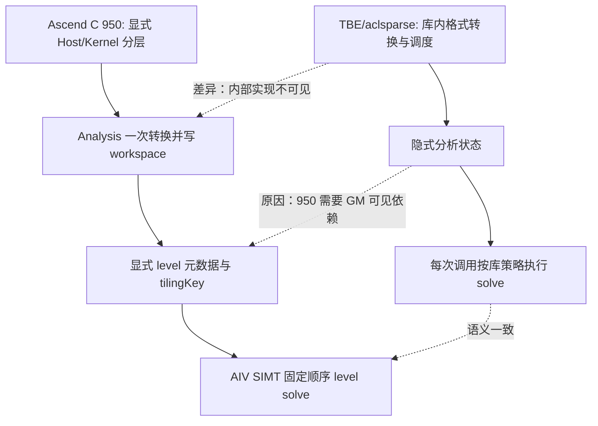

# aclsparseSpSV（Ascend 950）算子设计文档

## 一、需求背景

### 1.1 需求来源

本设计文档用于 2026 年社区任务 `aclsparseSpSV 算子开发（A5/950）`，目标是在 `ops-sparse` 中补齐 Ascend 950 的稀疏三角向量求解能力，并以可复现的测试、性能和精度证据交付。

### 1.2 背景介绍

#### 1.2.1 aclsparseSpSV 实现优化

SpSV 在推理、图优化和稀疏线性代数中用于求解三角系统 `op(A)·Y = alpha·X`。一次 descriptor 通常经历 create → bufferSize → analysis → solve（可多次）→ updateMatrix → solve → destroy；如果每次 solve 都重新转换稀疏格式或重建依赖关系，会造成显著的启动和访存开销。本任务将分析结果固化在 externalBuffer，并在 950 上以 AIV SIMT 执行 level-by-level substitution，使同一稀疏模式可以低成本重复求解。

本任务的三条 TBE/公共实现参考路径如下。SpSV 是 aclsparse legacy 接口，CANN 9.1 中没有名为 `spsv` 的独立 Python TBE kernel，因此按任务书采用 aclsparse/cuSPARSE baseline 管线对照；路径用于核对原型、算子注册和可复用的稀疏格式处理约定：

1. Kernel 实现检索根：`/usr/local/Ascend/ascend-toolkit/latest/opp/built-in/op_impl/ai_core/tbe/impl/`（未发现独立 `spsv` 目录；格式转换和三角求解由 aclsparse 公共实现承载）。
2. 算子原型：`/usr/local/Ascend/ascend-toolkit/latest/opp/op_graph/inc/ops_proto_sparse.h`（若发行版将原型归并到公共头，则对应 `ops_proto_math.h`；以安装包实际存在的 sparse 原型声明为准）。
3. 算子信息库：`/usr/local/Ascend/ascend-toolkit/latest/opp/op_impl/ai_core/tbe/config/ascend950/aic-ascend950-ops-info.json`（用于确认 DAV_3510 的注册和 dtype 约束；不存在独立条目时以 aclsparse 接口定义为准）。

#### 1.2.2 aclsparseSpSV 现状分析

##### 1.2.2.1 TBE/公共实现支持的数据类型和数据格式

任务书要求 `ACL_FLOAT`（FP32）和 `ACL_COMPLEX64`，索引统一 I32、base 0/1，矩阵格式为 CSR、CSC、COO、SLICED_ELL；支持 LOWER/UPPER、UNIT/NON_UNIT、N/T/H、Host/Device pointer mode，以及 GENERAL/DIAGONAL 两类 values 更新。Ascend C 路径与该接口矩阵保持一致，非任务书声明的 dtype 不在支持范围内。

##### 1.2.2.2 TBE/公共实现逻辑

baseline 在 `bufferSize` 阶段计算分析所需空间，在 `analysis` 阶段校验 descriptor、把输入格式规范化为可求解的三角 CSR 并建立依赖 level；`updateMatrix` 替换全部或对角 values 并使相关状态失效/刷新；`solve` 按 level 顺序完成前代或回代，并根据 N/T/H 选择原矩阵、转置或共轭转置。Host/Device alpha 只改变标量读取位置，不改变求解顺序。该生命周期是 Ascend C 实现的语义基线。

##### 1.2.2.3 TBE/公共实现流程图

```mermaid
flowchart LR
  A[bufferSize] --> B[校验 handle/矩阵/向量/dtype]
  B --> C[analysis: 格式与 index base 规范化]
  C --> D[建立三角 CSR、diagPtr、依赖 level]
  D --> E{updateMatrix}
  E -->|GENERAL/DIAGONAL| F[更新 values 并刷新分析状态]
  E -->|无更新| G[复用 analysis 状态]
  F --> H[solve: level 顺序三角替换]
  G --> H
  H --> I[vecY = op(A)^-1 alpha vecX]
```

## 二、需求分析

### 2.1 外部组件依赖

- CANN 9.1.0 及后续配套版本、Ascend 950PR/DAV_3510 驱动和运行时。
- `ops-sparse` 的公开 `aclsparse` handle、稀疏矩阵 descriptor、稠密向量 descriptor 和 stream 抽象。
- aclnn/aclsparse 异步调用约定及 C++ 编译、UT/ST 测试框架。
- 验收使用的 GPU baseline Event、NPU profiler 和任务书提供的 `performance_cases.json`，不引入 CPU 求解作为运行时依赖。

### 2.2 内部适配模块

- 共享层：公开接口声明、参数/属性校验、descriptor 生命周期、pointer mode 和错误码。
- arch35 Host 层：`ops-sparse/sparse/spsv/arch35/` 中的 BufferSize、Analysis、Solve、UpdateMatrix tiling 与 workspace 绑定。
- arch35 Kernel 层：AIV SIMT 的格式规范化、依赖分析、level solve 和确定性更新。
- 测试层：`ops-sparse/test/spsv/arch35/` 的 C++ UT/ST 与 `ops-sparse/test_cases/aclsparseSpSV_testCase/` 的端到端、性能、精度和内存脚本。

### 2.3 需求模块设计

#### 2.3.1 Ascend C 算子原型

公开接口逐字沿用任务书：

```c
aclsparseStatus_t aclsparseSpSV_createDescr(aclsparseSpSVDescr_t *spsvDescr);
aclsparseStatus_t aclsparseSpSV_destroyDescr(aclsparseSpSVDescr_t spsvDescr);
aclsparseStatus_t aclsparseSpSV_bufferSize(aclsparseHandle_t handle, aclsparseOperation_t opA, const void *alpha, aclsparseConstSpMatDescr_t matA, aclsparseConstDnVecDescr_t vecX, aclsparseDnVecDescr_t vecY, aclDataType computeType, aclsparseSpSVAlg_t alg, aclsparseSpSVDescr_t spsvDescr, size_t *bufferSize);
aclsparseStatus_t aclsparseSpSV_analysis(aclsparseHandle_t handle, aclsparseOperation_t opA, const void *alpha, aclsparseConstSpMatDescr_t matA, aclsparseConstDnVecDescr_t vecX, aclsparseDnVecDescr_t vecY, aclDataType computeType, aclsparseSpSVAlg_t alg, aclsparseSpSVDescr_t spsvDescr, void *externalBuffer);
aclsparseStatus_t aclsparseSpSV_solve(aclsparseHandle_t handle, aclsparseOperation_t opA, const void *alpha, aclsparseConstSpMatDescr_t matA, aclsparseConstDnVecDescr_t vecX, aclsparseDnVecDescr_t vecY, aclDataType computeType, aclsparseSpSVAlg_t alg, aclsparseSpSVDescr_t spsvDescr);
aclsparseStatus_t aclsparseSpSV_updateMatrix(aclsparseHandle_t handle, aclsparseSpSVDescr_t spsvDescr, void *newValues, aclsparseSpSVUpdate_t updatePart);
```

输入输出、dtype、format、shape、index base、pointer mode、fill/diag、N/T/H 和更新属性均与任务书 2.4 对齐。BufferSize/Analysis 允许 vecX/vecY 描述符为 NULL；Solve 要求描述符和值指针有效。Y 可以与 X 共用同一 Device values 指针原地求解。

#### 2.3.2 Ascend C 算子相关约束

Ascend C 只承诺任务书声明的 FP32/complex64、I32 索引和四种稀疏格式；不支持的 dtype、非二维方阵、非法 index、非法 enum 或不满足对齐/容量的 workspace 返回明确错误码。输入 pattern 在 Analysis 到异步 Solve 完成前不可变；UpdateMatrix 只能在 descriptor 绑定的 pattern 上做 GENERAL 或 DIAGONAL 更新。NON_UNIT 缺失/零对角的 INF/NAN 传播遵循接口定义。未排序坐标走确定性规范化路径，不依赖 CPU fallback。

## 三、需求详细设计

### 3.1 使能方式

通过 aclsparse 两段式异步调用使能：Host `bufferSize/analysis` 完成校验和 tiling，随后 kernel 在 handle 绑定的 stream 上提交；`solve` 只读取已绑定的 workspace 和分析元数据。externalBuffer 在 Analysis 至最后一次异步 Solve 完成前保持有效，完成后才释放。

### 3.2 需求总体设计

#### 3.2.1 host 侧设计

##### 3.2.1.1 分核策略

Analysis 先计算每个 row 的依赖深度和 `levelPtr/levelRow`。当 `m ≤ 256` 或最大 level 宽度较小时使用单 block，避免跨核同步和 launch 开销；大矩阵按 level 宽度切分到多个 block，每个 block 处理连续 row 段，level 之间执行一次全局可见同步。分核数为 `min(56, max(1, ceil(levelWidth / rowsPerBlock)))`，其中 56 为 Ascend 950 可用 AIV 数；单行超长时按非零段切分并在行内累加。

##### 3.2.1.2 数据分块和内存优化策略

workspace 首地址 512B 对齐，数组起始位置 64B 对齐；CSR 的 rowPtr、colInd、values、diagPtr、levelPtr、levelRow 和 permutation 分区存放。每个 block 的 UB 临时区满足

`UB_bytes = 2 × (tileNnz × sizeof(value) + tileNnz × sizeof(I32) + tileRows × sizeof(I32)) + scratch ≤ 192 KiB`。

`tileNnz = floor((192 KiB - scratch) / (2×sizeof(value)+2×sizeof(I32)))`，再向下取 32B 可搬运粒度；complex64 以 8B 元素计量。连续 CSR 段优先 DataCopy，COO/CSC/SELL 仅在 Analysis 做一次转换，Solve 阶段只读有效 CSR 和 level 元数据，避免重复 Gather 与格式判断。

##### 3.2.1.3 tilingKey 规划策略

tilingKey 由 dtype、opA、format/base、矩阵规模和单/多 block 路径共同决定：FP32 与 complex64 分离；N、T、H 分离（H 对 complex64 标记 conjugate）；CSR base0 的连续快路径与其它格式的规范化路径分离；`m≤256` 选择单 block，大规模选择多 block。非法组合在 Host 阶段拒绝，不生成无效 binary。

#### 3.2.2 kernel 侧设计

##### 3.2.2.1 kernel 侧实现描述

Analysis kernel 将 CSR/CSC/COO/SLICED_ELL 和 base 1 输入转换为 zero-based CSR，生成 `diagPtr`、`validCount`、`levelPtr`、`levelRow` 及可选 permutation；T/H 路径在转换时交换 row/column，complex64 H 对 values 做共轭。Update kernel 按 GENERAL 全量替换或 DIAGONAL 定位替换 values，并刷新与 values 相关的元数据。Solve kernel 逐 level 读取 X 和已完成的 Y，执行 `y_i = (alpha*x_i - Σ a_ij*y_j) / a_ii`（UNIT 时省略除法），每个 level 内按固定 row 顺序更新，保证重复执行 bitwise deterministic。

##### 3.2.2.2 Ascend C 实现流程图


##### 3.2.2.3 Ascend C 与 TBE/公共实现差异及原因



| 环节 | TBE/公共实现 | Ascend C 950 | 原因 |
|---|---|---|---|
| 格式处理 | 库内部按调用需要转换 | Analysis 一次性写入 workspace CSR | 暴露生命周期，避免每次 Solve 重复转换 |
| 依赖调度 | 库内部调度不可见 | 显式 `levelPtr/levelRow`，level 间同步 | 950 AIV 多核需要可控的依赖可见性 |
| 小规模求解 | 实现相关 | 单 block | 消除 launch 和跨核同步固定开销 |
| 大规模求解 | 实现相关 | 多 block + level 同步 | 利用 56 AIV 并行处理宽 level |
| H 语义 | 库内部共轭转置 | 转换阶段显式 conjugate | 保证 complex64 结果和确定性顺序 |
| 更新 | 库内部刷新分析 | GENERAL/DIAGONAL 明确标记并刷新状态 | 复用 descriptor 且避免陈旧 metadata |

### 3.3 支持硬件

目标为 Ascend 950PR（DAV_3510，CANN 9.1）。该芯片提供 56 个 AIV 和 28 个 AIC；SpSV 的不规则依赖和标量除法采用 AIV SIMT，不使用 Cube/AIC。实现不依赖 A2/A3 特有指令，公共 Host 层保持可在任务书要求的配套版本上编译。

### 3.4 算子约束限制

- A 必须为二维三角方阵，索引 I32，format 为 CSR/CSC/COO/SLICED_ELL，base 为 0 或 1。
- 仅支持 FP32 与 complex64，A/X/Y/alpha/computeType 必须匹配；complex64 的 H 等价于共轭转置。
- alg 使用公开 DEFAULT；fill/diag 只接受 LOWER/UPPER 与 UNIT/NON_UNIT 合法组合。
- Analysis 到异步 Solve 完成期间 descriptor、pattern、向量描述符和 externalBuffer 不得被修改或释放；Solve 不接受 NULL vecX/vecY。
- 未排序、重复、空行、m/nnz 边界和零/缺失对角按确定性路径及接口错误/INF/NAN 规则处理。

## 四、特性交叉分析

测试交叉覆盖 dtype（FP32/complex64）× format（CSR/CSC/COO/SELL）× base（0/1）× op（N/T/H）× fill/diag × pointer mode（Host/Device）× alias（原地/非原地）× shape（小规模、长行、空行、大规模）。complex64 H、未排序坐标和 GENERAL/DIAGONAL 更新均有专项用例；不支持 dtype 和非法 shape 只验证错误码，不纳入性能声明。

## 五、可维可测分析

### 5.1 精度标准与性能标准

精度使用任务书 CPU Golden：FP32 中间计算采用 float64，complex64 采用 complex128，最终按 FP32 `rtol=2^-10`、`atol=2^-16`、A=1e-2 及逐元素 ULP 规则比较；实部和虚部分别判定，整体匹配率不低于 0.99。该高精度仅用于离线对比，NPU 执行没有 CPU fallback。重复执行检查 bitwise deterministic。

性能按 GPU Event 阶段耗时 / NPU 同调用范围总耗时计算，预热 10 次、正式采样 30 次，所有声明 dtype 的倍率目标 ≥0.3。真机结果来自 DevEnv_907601 的 Ascend950PR/CANN 9.1：性能 206/206 PASS，精度 200/200 PASS；完整逐 case CSV 随验收材料提供。

| case | GPU median (us) | NPU median (us) | ratio | result |
|---|---:|---:|---:|---|
| P-01-base0 | 40458.531 | 97990.292 | 0.4129 | PASS |
| P-01-base1 | 40413.695 | 98067.017 | 0.4121 | PASS |
| P-02-base0 | 93850.750 | 217021.622 | 0.4324 | PASS |
| P-02-base1 | 94739.203 | 212717.255 | 0.4454 | PASS |
| P-03-base0 | 222887.562 | 524214.569 | 0.4252 | PASS |
| P-03-base1 | 220676.516 | 522300.629 | 0.4225 | PASS |

### 5.2 兼容性分析

代码、测试和文档位置分别为 `ops-sparse/sparse/spsv/arch35/`、`ops-sparse/test/spsv/arch35/` 和 `ops-sparse/test_cases/aclsparseSpSV_testCase/`。验收 CSV 为 `performance_full_comparison_final_20260913.csv`、`spsv_npu_performance_full206_final_20260913.csv`、`accuracy_results_full200_final_20260913.csv`；报告同步记录 workspace、峰值内存、Profiler、CANN/驱动/SOC 信息。README 提供编译、环境和复现命令，失败项只按实际结果记录，不通过删除日志改变状态。

## 六、交付与验证

- 实现分支：`LiJianhao2/ops-sparse:ljh-spsv-950`。
- 设计文档分支：`LiJianhao2/cann-ops-competitions:ljh-spsv-950-design`。
- C++ UT/ST 覆盖参数、dtype、shape、layout、stride、device、异常、输出、alias/in-place 和 stream 异步语义。
- 标准测试使用任务书 `performance_cases.json`，并保留 profiler 和内存采集原始证据。
- Analysis 至 Solve 的 descriptor、参数和 externalBuffer 一致性，以及 UpdateMatrix 后复用状态均有生命周期测试。

## 七、基线接口流程补充

baseline 的 analysis/update/solve 由 aclsparse/cuSPARSE 库内部完成，GPU Event 仅包围任务书规定的调用阶段；Ascend C 显式拆分同样的阶段并在 workspace 中保存依赖元数据。两条管线共享同一方程、属性和精度判定规则，差异仅限调度、格式转换可见性和硬件执行引擎。
