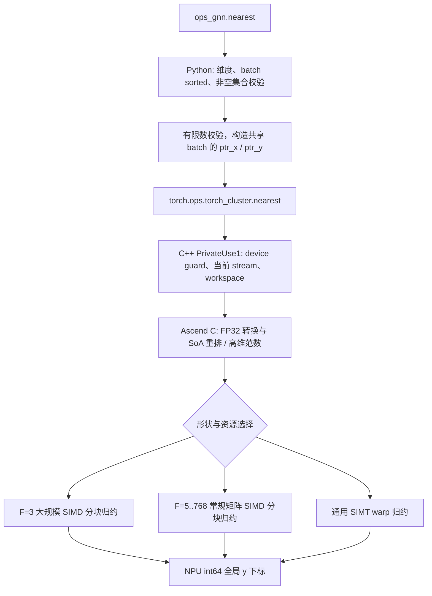

# nearest算子设计文档

| 项目 | 内容 |
| --- | --- |
| 文档版本 | V1.0，正式提交评审版本 |
| 日期 | 2026-09-08 |
| 队名 | CianEnv |
| 提交账号 | CenYangtze |
| 任务 | CANN训练营北京邮电大学专场，nearest算子开发(950) |
| 目标实现仓 | cann/ops-gnn |
| 开发分支 | CenYangtze/bupt-nearest：feat/nearest-950pr |
| 设计范围 | PyTorch接口、C++ Host、Ascend C arch35 Kernel、精度与性能验证 |

# 需求背景（required）

## 需求来源

北京邮电大学 CANN 训练营 [nearest算子开发(950)](https://www.hiascend.com/activities/task-center/details/718ae9ad67ad47b4b82e5d366f6aa2f5) 任务。需求基准为该任务的 nearest 算子开发任务书，目标硬件为 Ascend 950PR。上游代码基线为 `cann/ops-gnn@2a6922c46accd89a94aa464a36558c0efddeffc6`。

本文按 [社区设计模板](https://gitcode.com/cann/cann-ops-competitions/blob/master/04_tasks/01_community-task-2026/resources/design_template.md) 编写，按 [讨论帖285“三、任务参与流程”](https://gitcode.com/org/cann/discussions/285#tid-77501f53280c4cd1b747834a1ee099d0) 提交设计评审，并参考 [讨论帖39：社区任务流程及注意事项](https://gitcode.com/org/cann/discussions/39)。模板与流程读取日期为 2026-09-08，来源提交见 `artifacts/nearest/source_versions.json`。

本文为V1.0正式提交评审版本。实现已完成实机设计验证，数据、源码校验值与完整测试结论见[自测报告](https://gitcode.com/CenYangtze/bupt-nearest/blob/b425364853d8151d4187662a231b474aa4f95225/docs/experiment/design/nearest/自测报告.md)。设计评审和社区验收结论以组织方反馈为准，本地自测不等同于验收通过。

## 背景介绍

### nearest 算子现状

`torch_cluster.nearest` 为图神经网络点集聚类提供 1-NN 分配。输入每个 x 点在同 batch 的 y 点中选取最近点，输出 y 的全局下标。它不涉及图像缩放或插值。原 PyTorch 接口在 CPU 使用 scipy vq，在 CUDA 使用自定义 Kernel。ops-gnn 基线没有 nearest 实现，需要新增 Ascend C Kernel、C++ Host、dispatcher 注册、Python 接口和自测。

### 功能分析

| 参数 | 含义 | 数据类型 | 形状与约束 |
| --- | --- | --- | --- |
| x | 待分配点 | NPU float16 / float32 | [N,F]，或 1D [N]；F>0 |
| y | 候选中心 | 与 x 相同 dtype、设备 | [M,F]，或 1D [M]；N>0 时 M>0 |
| batch_x | x 所属图 | 可选 NPU int64 | [N]，非负、非降序 |
| batch_y | y 所属图 | 可选 NPU int64 | [M]，非负、非降序 |
| cluster | 最近 y 的全局下标 | NPU int64 | [N] |

不提供 batch 时视为 batch 0；两侧非空 batch 集合必须相同；支持有间隙的标签、不同 batch 的点数不均衡、非连续点坐标。1D 输入转换为 [点数,1]。x 为空时输出为空；非空 x 配空 y 抛 ValueError。

# 需求分析（required）

## 需求描述

实现 `ops_gnn.nearest(x, y, batch_x=None, batch_y=None)`，NPU 路径调用 `torch.ops.torch_cluster.nearest(x,y,ptr_x,ptr_y)`，不使用 CPU/scipy 计算最近邻。返回值与任务正文指定的 CPU/scipy 单标杆逐下标一致，平局取最小全局 y 下标。

## 需求拆解

1. Ascend 950PR / arch35，CANN≥9.1.0、PyTorch≥2.7 和配套 torch_npu。
2. 支持 FP16、FP32 和可选 int64 batch，覆盖 TC-01～TC-08。
3. Python 层检查 sorted 和非空 batch 集合，构造 CSR ptr，保持全局下标。
4. Ascend C 完成坐标转换、距离计算、归约；Host 负责校验、资源查询与当前流发射。
5. 36 个性能点逐项满足 `reference_ms / npu_ms >= 0.45`；计时包括整个 Python 接口，warmup=20、iter=100。
6. 提供代码、设计文档、可复现测试及自测报告，并列明社区提交材料和截图命令。

### 外部组件与内部适配模块

运行时依赖 PyTorch、torch_npu、CANN runtime、Ascend C 和平台资源查询接口。SciPy、NumPy、pytest 仅用于测试；openpyxl 用于生成报告。内部模块为 ops-gnn 共享库、Python 导出和 CMake 源码发现机制。任务指定 PyTorch/Kernel 直调，不要求 ACLNN、TBE 或 GE 入图，因而不新增 aclnn 接口、op_graph、infershape 或 GE tilingKey 注册。

Ascend C 原型为 `LaunchNearest(x,y,ptr_x,ptr_y,workspace,out,is_half,tiling,stream)`；外部接口仍为任务书规定的四参数 Python API。无第三方 CPU 计算进入 NPU 执行路径。

### 精度口径冲突及处理

原附件 `nearest_cpu()` 在 FP16 下对差值、平方和逐维累加分别舍入到 FP16；平局按 `(j % 1024, j // 1024)` 选择。任务正文指定的 CPU/scipy 路径先转 FP32，平局选择首个最小值。两者无法对所有输入同时成立。

本设计依据任务书正文§8采用 CPU/scipy 单标杆口径，原附件及 SHA256 保存在 `test/nearest/official/`，不修改其断言。两个可复现反例见 `artifacts/nearest/semantic_audit.json`：跨1024平局选 1 或1024、FP16逐步舍入反例选1或0。该差异作为本次设计评审的明确确认项。未修改附件实测34/42通过、8项FP16失败，不将该结果表述为附件全部通过。

# 详细设计（required）

## 算子分析

### 数学公式

对 x_i 所属 batch b，令 y 的范围为 `[ptr_y[b],ptr_y[b+1])`：

\[
cluster_i=\operatorname*{argmin}_{j\in b}\sum_{f=0}^{F-1}(x_{if}-y_{jf})^2.
\]

输出索引为全局 j。因平方根单调，NPU 不计算平方根。

### 数值计算

SciPy 1.18.0 `_vq.pyx` 的实现分为 F<5 和 F≥5 两种路径：前者直接逐维计算平方差，后者按 `(-2 dot(x,y) + norm(x)) + norm(y)` 计算。FP16 坐标先无损转换到 FP32。范数按特征顺序累加，平方与加法分别舍入；SIMT 以 `volatile float square` 阻止编译器融合，构建同时设置 `-ffp-contract=off`。NPU 不输出距离，只用计算距离比较下标。

精度基准固定为本机 SciPy 1.18.0 wheel 内的 OpenBLAS 0.3.31.dev、SkylakeX 核。实测并结合 BLAS 源码检查了两条 TN 点积路径：

- 常规矩阵：FP32 FMA 顺序累加；K 剩余量≥896时取448一块，448<K<896时先取 `ceil(K/2)`，之后处理余量。每块以 FMA 将 `-2*dot` 加入距离。
- 小矩阵：F≥32、每batch `N_b*M_b≤1200` 且 `N_b*M_b*F≤1000000` 时，使用16条交错FMA链。每4点主体按相邻lane归约，双方均处于不足4点的尾部时按对应另一加法树归约。该条件是固定标杆的计算路径条件，所有坐标仍在NPU完整计算。

两条路径随后都严格计算 `(distance + norm_x) + norm_y`。这些舍入细节是整数下标严格对齐所需；更换 BLAS 版本、CPU 架构或参考矩阵分块方式，不能承诺接近平局数据仍逐下标一致。参考实现本身在消减严重时也可能产生与实数欧氏距离不同的结果。

高维 scipy 内部使用 CPU BLAS，BLAS 版本和归约顺序会影响极近候选的下标；验证固定当前 scipy 版本并记录软件环境。NPU 点积不调用 CPU BLAS，不存在按测试数据、随机种子、输入地址或计时模式缓存答案的逻辑。单纯数学等价不能代替下标一致性测试。

### 支持数据类型和形状

FP16 / FP32 输入，int64 输出与 batch。功能测试覆盖 F=1/3/16/19/32/64/128/256/768、非方形 N/M、1D、非连续和尾块。Host 使用64位计算存储偏移、分配大小；N、M、F 各自不超过 INT32_MAX，超过时明确报错。资源允许范围内动态处理输入形状。

## 算子实现

### 实现方案

#### 3.2.1 host侧设计

Python 校验 batch 的 dtype、长度、设备和非降序，精确比较非空标签集合。仅 batch 元数据允许复制至 Host；坐标 x/y 始终留在 NPU。共同标签压缩为连续的 CSR 段，避免为极大稀疏标签分配巨大数组。无 batch 的常见路径用空 optional ptr 表示 `[0,N]` 和 `[0,M]`。

Python 定义 dispatcher schema（已有 torch_cluster schema 时复用），C++ 通过 `TORCH_LIBRARY_IMPL(torch_cluster, PrivateUse1, ...)` 注册执行函数。通过当前设备 guard 和 `c10_npu::getCurrentNPUStream()` 发射，输出及临时空间由 PyTorch 管理，不创建私有 stream，workspace 不跨调用共享。有限数归约结果作为一个布尔值读取到Host，batch 元数据复制也会同步；正式性能包含这些 Python 校验开销。

平台资源通过 `PlatformAscendCManager` 查询，AIV 核数不硬编码。SIMD 发射前检查 UB 可用量；不足时保留通用路径。形状、ptr dtype/长度和workspace大小在 Host 检查，内核对 ptr 范围做防越界保护。

直调分派替代 GE tilingKey：`tile_y>0` 选择通用高维SIMD；否则 F=3、无batch、N≥4096且UB≥110592 B选择三维SIMD；其余选择SIMT。分派参数放入标准C++结构体 `NearestTiling`，FP16/FP32仅在预处理入口区分。实际核数为 `min(ceil(N/tile_x), AIV核数)` 或 `min(ceil(N/16), AIV核数)`，每核grid-stride处理余下x块。

#### 3.2.2 kernel侧设计

第一阶段将 [N,F]/[M,F] 转为 FP32 SoA [F,N]/[F,M]，使一个向量或 warp 读取连续的 y 坐标。F≥5 同时从原输入计算范数。workspace 规模为 `4*((N+M)*F+N+M)` 字节，不物化完整 [N,M] 或 [N,M,F]。

通用 SIMT 使用512线程/AIV、32线程/warp，一个warp负责一个x点，各lane扫描自己的y候选。按feature顺序累加后维护局部 `(distance, global_index)`，warp shuffle归约时同时比较距离和下标。通过grid-stride循环均分x工作。batch路径二分查找ptr_x，扫描对应ptr_y区间。

F=3 大规模 SIMD 路径在 UB 保留128个x点和8192个y点，按y分块扫描。寄存器一次处理64个y候选，执行 Sub→Mul→Add，然后在线维护各lane的最小距离和索引；跨lane先归约距离，再归约具有该距离的最小索引。尾部使用有效mask，候选按全局下标递增，跨tile平局保留较早的y。

三维单buffer SIMD UB预算：x 1536字节、y 98304字节、最小距离512字节、int32索引512字节、int64输出1024字节，共101888字节。MTE2→V保证搬入完成，V→MTE2保护UB复用，V→MTE3及MTE3→V保证输出及下一轮复用有序。

F=5..768、无batch且非上述小矩阵时使用高维SIMD。x块大小为 F≤64 时64点，F≤256时32点，其余16点。以tx表示x块，ty表示y块，UB占用公式为 `4*(F+1)*(tx+ty)+16*tx`，另预留4096 B。ty取满足容量的最大2的幂，范围64～8192；不能容纳64点则回退SIMT。坐标与范数一起分块搬入，寄存器对64个候选逐特征FMA并在线归约，减少GM重复读取。

参考CPU流程为“FP32输入→直接距离或BLAS距离矩阵→逐行首个argmin”；NPU流程为“SoA重排/范数→分块距离→在线argmin”。两者差异是存储与并行方式：NPU不物化N×M矩阵，以减少显存占用，但保留固定参考的每候选计算顺序和tie-break。

### 复杂度与优化边界

计算复杂度为 `O(sum_b N_b M_b F)`；workspace为`O((N+M)F)`。多核划分在x维；y分块在核内在线归约，无跨核原子更新输出。优先优化数据重用、向量指令、分块及核利用率，不以近似top-k、降精度矩阵乘或固定半径筛选改变最邻近语义。

## 支持硬件

| 项目 | 当前实机 |
| --- | --- |
| 芯片 | Ascend950PR_9579，逻辑设备 npu:0 |
| 编译架构 | dav-3510，源码目录 arch35 |
| CANN / 驱动 | 9.1.0 / 25.7.rc1 |
| PyTorch / torch_npu | 2.7.1+cpu / 2.7.1.post8（通过NPU插件运行） |
| Python / scipy | 3.12.13 / 1.18.0 |
| AIC / AIV / UB | 28 / 56 / 253952 B（248 KiB） |
| L0A / L0B / L0C / L1 / L2 | 64 / 64 / 256 / 512 / 131072 KiB |

## 算子约束限制

不支持输入混合dtype、CPU坐标、跨设备输入、F=0、无序或负batch标签。NaN/±Inf 坐标由Python抛ValueError。极大FP32输入导致距离中间值溢出的精度不作保证；主验收值域及近邻压力值域在报告中明确。输出为离散索引，无梯度。直接使用底层dispatcher须保证ptr符合CSR契约，正常业务应使用Python接口。当前仅验证950PR，不据此声明其他芯片兼容。

## 特性交叉分析

batch与形状分派组合由SIMT统一处理，避免跨batch候选泄漏；非连续输入由Host contiguous后计算。各调用workspace独立，当前stream顺序保证转换先于搜索；原地修改输入后重调用应得到新结果。无跨核原子写，输出每行仅一个执行单元负责，故同环境同输入结果确定。当前接口没有图编译、图捕获或autograd适配承诺。

# 可维可测分析

## 精度标准/性能标准

| 验收标准 | 描述 | 来源 |
| --- | --- | --- |
| 输出正确性 | int64 cluster与CPU/scipy逐元素完全相同，不使用浮点allclose放宽 | 任务书§8 |
| batch | TC-02/03/04/07/08，检查全局下标和集合，不仅检查输出设备 | 任务书§2～6 |
| 性能 | 18组shape×2 dtype，`reference_ms / npu_ms >= 0.45`，每点分别达标 | 任务书§7 |
| 计时 | 20次warmup，100次完整Python调用，循环外同步；API内部校验的同步计入时间 | 原附件benchmark |
| 鲁棒性 | 1D、非连续、尾块、跨tile/1024平局、非默认stream、原地更新输入、稀疏batch | 任务及边界审计 |

`test/nearest/golden.py` 仅在CPU生成标杆，对每个完整batch调用scipy vq。任一轴分块均可能改变BLAS分派，因而禁止自行分块标杆；32K×32K高维参考需要约4 GiB CPU矩阵。正式用例、参数、随机种子、退出码和数据来源随报告保存。原附件测试单独运行并报告其精度语义差异。

生态精度标准适用于浮点输出的容差不能用于本算子的int64下标。值域、输入组合和特殊场景参考 [生态算子精度标准](https://gitcode.com/cann/opbase/blob/master/docs/zh/ops_precision_standard/experimental_standard.md) 补充覆盖。

## 兼容性分析

新增nearest沿用仓库CMake的Host/arch35源码发现机制和共享库装载。已有torch_cluster schema时复用；无torch_cluster安装也可使用本NPU实现。若两包共同安装，应先import torch_cluster，再import ops_gnn，避免另一包晚注册重复schema。测试覆盖已有schema场景、当前流、输入修改、导入以及已有add_sample回归。未安装真实torch_cluster包进行双包集成验证，不能将模拟schema测试宣称为该集成验证。

设计文档向competitions任务目录提交；代码按任务书向ops-gnn提交。本训练营按讨论帖285使用设计PR标题“【CANN社区任务】nearest算子设计文档”。设计PR评审通过并合入后再提交IT验收；代码贡献PR按任务书在收到验收反馈后另行提交。

## 实现与设计验证记录

设计对应的实现提交为 [`965a034d853ab26ad3eb5e10569766ae58d1b3fd`](https://gitcode.com/CenYangtze/bupt-nearest/commit/965a034d853ab26ad3eb5e10569766ae58d1b3fd)。以下实机记录保存在材料提交 [`b425364853d8151d4187662a231b474aa4f95225`](https://gitcode.com/CenYangtze/bupt-nearest/commit/b425364853d8151d4187662a231b474aa4f95225) 中，文档引用固定提交以避免后续分支更新改变证据。

| 验证项目 | 结果 | 说明 |
| --- | --- | --- |
| 公共Python接口功能与精度 | 120/120通过 | 含batch、1D、非连续、当前流、输入修改、异常和数值边界 |
| 值域与近邻数值压力 | 108/108通过 | 均匀、正态和消减明显的近邻输入 |
| 任务书性能及对应下标精度 | 36/36通过 | warmup=20、iter=100，完整Python接口计时；最低标杆/实测比值1.161≥0.45 |
| 原有导入与add_sample回归 | 3/3通过 | 检查新增注册及共享库接入 |
| 未修改原附件 | 34/42通过，8项FP16失败 | 正文与附件数值语义冲突，作为评审确认项保留 |

以上为固定环境下的设计自验证结果，未宣称组织方已审核通过或完成正式验收。

- [算子README](https://gitcode.com/CenYangtze/bupt-nearest/blob/b425364853d8151d4187662a231b474aa4f95225/csrc/npu/nearest/README.md)
- [Python接口](https://gitcode.com/CenYangtze/bupt-nearest/blob/b425364853d8151d4187662a231b474aa4f95225/python/ops_gnn/nearest.py)
- [C++ Host](https://gitcode.com/CenYangtze/bupt-nearest/blob/b425364853d8151d4187662a231b474aa4f95225/csrc/npu/nearest/op_host/nearest.cpp)
- [Ascend C Kernel](https://gitcode.com/CenYangtze/bupt-nearest/blob/b425364853d8151d4187662a231b474aa4f95225/csrc/npu/nearest/op_kernel/arch35/nearest_kernel.cpp)
- [测试用例与复现说明](https://gitcode.com/CenYangtze/bupt-nearest/blob/b425364853d8151d4187662a231b474aa4f95225/test/nearest/README.md)
- [功能精度JUnit](https://gitcode.com/CenYangtze/bupt-nearest/blob/b425364853d8151d4187662a231b474aa4f95225/artifacts/nearest/accuracy.xml)
- [数值压力记录](https://gitcode.com/CenYangtze/bupt-nearest/blob/b425364853d8151d4187662a231b474aa4f95225/artifacts/nearest/precision-stress.json)
- [36项性能及精度JSON](https://gitcode.com/CenYangtze/bupt-nearest/blob/b425364853d8151d4187662a231b474aa4f95225/artifacts/nearest/performance.json)
- [实际平台与软件环境](https://gitcode.com/CenYangtze/bupt-nearest/blob/b425364853d8151d4187662a231b474aa4f95225/artifacts/nearest/environment-current.json)
- [原附件失败记录](https://gitcode.com/CenYangtze/bupt-nearest/blob/b425364853d8151d4187662a231b474aa4f95225/artifacts/nearest/official.log)
- [正文/附件最小语义反例](https://gitcode.com/CenYangtze/bupt-nearest/blob/b425364853d8151d4187662a231b474aa4f95225/artifacts/nearest/semantic_audit.json)
- [证据校验清单](https://gitcode.com/CenYangtze/bupt-nearest/blob/b425364853d8151d4187662a231b474aa4f95225/artifacts/nearest/evidence_manifest.json)
