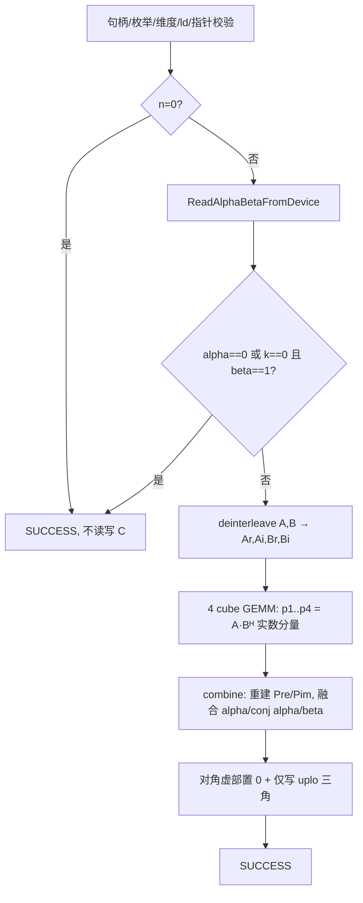

# aclblasCher2k 算子设计文档（Ascend 950PR / arch35）

> 版本记录

| 版本 | 日期 | 作者团队 | 说明 |
| --- | --- | --- | --- |
| v1.0 | 2026-09-14 | {TeamName} | 初版设计，对标 cuBLAS `cublasCher2k` / Netlib `cher2k`，基于 ops-blas `blas/herk/arch35/aclblasCherk` 与 `blas/syr2k/arch35/aclblasSsyr2k` 同族工程落地 |

> 目标目录与测试目录引用

- 算子实现：`blas/herk/arch35/`（新增 `cher2k_host.cpp`、`cher2k_kernel.cpp`、`cher2k_kernel.h`、`cherk_tiling_data.h` → 改名为 `cher2k_tiling_data.h`），与同族 `aclblasCherk` 同目录。
- 公共声明：新增于 `include/cann_ops_blas.h`（位于 `aclblasCherk` 声明之后），参数序列与 cuBLAS `cublasCher2k` 一一对应；不定义 950PR 私有平行接口。
- 测试：`test/herk/cher2k/arch35/`（`cher2k_test.cpp`、`cher2k_test.csv`、`cher2k_param.h`、`cher2k_golden.h`、`cher2k_npu_wrapper.h`、`CMakeLists.txt`、README），沿用 `test/herk/cherk` 框架。
- 设计文档 PR 目录：`04_tasks/01_community-task-2026/tasklist/09-22-aclblasCher2k-950/{TeamName}/docs/design.md`（提交时与账号确认；任务书文件夹名 `算子实操工坊-上海站-aclblasCher2k算子开发(950)` 亦可）。

---

## 需求背景（required）

### 需求来源

昇腾 CANN 社区「算子实操工坊-上海站」任务：在 Ascend 950PR（arch35，DAV_3510）上使用 Ascend C 编程语言开发单精度复数（COMPLEX64）**厄米特秩-2k 更新（Hermitian rank-2k update）** 算子 `aclblasCher2k`，完成设计、开发、测试全流程，验收通过后合入 ops-blas 开源仓（`https://gitcode.com/cann/ops-blas`）。对标基线为 cuBLAS `cublasCher2k`（语义参考 Netlib `cher2k`）。

### 背景介绍

#### 算子定位与数学定义

`aclblasCher2k` 计算一个 n×n 厄米特（Hermitian）复矩阵 C 的秩-2k 更新。给定两个 n×k（trans=N）或 k×n（trans=C）的单精度复数矩阵 A、B，以及复数标量 α、实数标量 β：

- **trans = ACLBLAS_OP_N** 时：
  `C = α·A·Bᴴ + conj(α)·B·Aᴴ + β·C`，A、B 为 n×k 矩阵；
- **trans = ACLBLAS_OP_C** 时：
  `C = α·Aᴴ·B + conj(α)·Bᴴ·A + β·C`，A、B 为 k×n 矩阵。

其中 Aᴴ 表示共轭转置（conjugate transpose），`Aᴴ[i][j] = conj(A[j][i])`。输出 C 满足厄米特性质 `C[i][j] = conj(C[j][i])`，**对角元素虚部被强制置 0**（cuBLAS 文档："The imaginary parts of the diagonal elements are assumed and set to zero"；Netlib `cher2k` 对对角取 `REAL(...)` 实现）。

> 关键数学恒等式：令 `P = A·Bᴴ`，则 `B·Aᴴ = Pᴴ`（P 的共轭转置）。因此 `C = α·P + conj(α)·Pᴴ + β·C`，结果天然厄米特。本设计正是利用 `P` 与 `Pᴴ` 互为转置，使 4 次 cube GEMM 即覆盖两个半积（见 §详细设计）。

#### 对标接口与现状分析

| 对标对象 | 说明 | 与本算子关系 |
| --- | --- | --- |
| cuBLAS `cublasCher2k` | 接口语义与参数序列基准 | 参数序列一一对应（含 alpha=复数、beta=实数） |
| Netlib `cher2k.f` | 参考实现（三角/quick-return/对角语义） | 精度 golden 由 cblas（Netlib `cblas_cher2k`）生成 |
| ops-blas `aclblasCherk`（arch35） | 同族 Hermitian 秩-k 更新（A=B，alpha=实数） | **直接工程基线**：4M 复数分解 + cube GEMM + AIV combine |
| ops-blas `aclblasSsyr2k`（arch35） | 同族实对称秩-2k（两矩阵 A、B，alpha=实数） | **两矩阵工程基线**：两 GEMM + AIV scale |
| ops-blas `aclblasSsyr2k`（头文件 L523）/ `aclblasCherk`（L546） | 已合入声明 | 确认本算子签名风格与位置；本算子当前**无声明**（greenfield） |

**现状核查结论**：`include/cann_ops_blas.h` 当前**无** `aclblasCher2k` 声明（已 grep 全仓确认），需按任务书签名新增；仓内 `blas/herk/arch35/` 仅有 `aclblasCherk` 四文件，无 `matmul_series` 子目录——故实现须置于 `blas/herk/arch35/` 并复用 `gemm/arch35/gemm_kernel.h` 的 `gemm_kernel_do`（与 `aclblasCherk` 一致），**不引入虚构的 `matmul_series` 路径**。

#### 功能分析

- 仅更新 `uplo` 指定三角（UPPER/L→ 上/下三角），另一三角不被引用、不被修改。
- 矩阵列主序（Column-Major）；复数类型 `aclblasComplex { float real; float imag; }`（见 `include/cann_ops_blas_common.h`），实部/虚部各 float32。
- 原地更新 C（输入旧值、原地覆写）；`beta=0` 时 C 不必是有效输入。

---

## 需求分析（required）

### 需求描述

在 `include/cann_ops_blas.h` 新增如下声明（位于 `aclblasCherk` 之后），与 cuBLAS `cublasCher2k` 参数序列一一对应：

```cpp
aclblasStatus_t aclblasCher2k(
    aclblasHandle_t handle,
    aclblasFillMode_t uplo,
    aclblasOperation_t trans,
    int n, int k,
    const aclblasComplex* alpha,   // 复数标量（COMPLEX64），Device 内存
    const aclblasComplex* A, int lda,
    const aclblasComplex* B, int ldb,
    const float* beta,             // 实数标量（FLOAT32），Device 内存
    aclblasComplex* C, int ldc);
```

> 与同族差异点（实现必须留意）：`aclblasCherk` 的 alpha、beta 均为**实数**；本算子 **alpha 为复数、beta 为实数**（符合 cuBLAS `cublasCher2k` 与 Hermitian 秩-2k 语义——C 对角为实数故 beta 取实数即可）。

### 需求拆解

1. 实现 `trans=OP_N` 与 `trans=OP_C` 两种语义的 Hermitian 秩-2k 更新，数学结果与 Netlib `cher2k` 一致。
2. 仅更新 `uplo` 指定三角；输出 C 满足厄米特性质，对角虚部强制置 0。
3. **精度**：实部、虚部分量分别按 FLOAT32 标准比对，rtol=2⁻¹⁰、atol=2⁻¹⁶、matched_ratio≥0.99、max_abs_error≤1e-2（或 32×ULP），golden 由 cblas（Netlib `cblas_cher2k`）生成。
4. **性能**：4 个标杆 case（COMPLEX64，Avg time）不高于任务书门槛（case1 641.43µs / case2 4157.94µs / case3 680.47µs / case4 4258.12µs）。
5. 参数合法性校验与异常返回码严格对齐任务书（含 `OP_T`→INVALID_VALUE、非法枚举→INVALID_ENUM、quick-return 语义）。
6. 工程落地：`blas/herk/arch35/` 实现 + 测试 `test/herk/cher2k/arch35/` + README 产品支持表标注 950PR 支持。
7. 接口声明放入公共头文件，可被其他产品线共用；不定义 950PR 私有平行 API。

---

## 详细设计（required）

### 算子分析

#### 数学公式（4M 复数分解）

将复数矩阵 A、B 按实部/虚部分解为实数平面：`A = Ar + i·Ai`，`B = Br + i·Bi`。定义 `P = A·Bᴴ`，则其 4 个实数分量（4M 分解）为：

- **trans = OP_N**（A、B 为 n×k）：
  - `p1 = Ar·Brᵀ`（实部₁）
  - `p2 = Ai·Biᵀ`（实部₂）
  - `p3 = Ai·Brᵀ`（虚部⁺）
  - `p4 = Ar·Biᵀ`（虚部⁻）
  - `Re(P) = p1 + p2`，`Im(P) = p3 − p4`
- **trans = OP_C**（A、B 为 k×n，计算 `Aᴴ·B`）：
  - `p1 = Arᵀ·Br`，`p2 = Aiᵀ·Bi`，`p3 = Arᵀ·Bi`，`p4 = Aiᵀ·Br`
  - `Re(P) = p1 + p2`，`Im(P) = p3 − p4`

由 `P` 重建 `C` 的上三角（`i≤j`）：记 `Pre_ij = Re(P)(i,j)`、`Pim_ij = Im(P)(i,j)`，`Pᴴ(i,j) = conj(P(j,i))` ⇒ `Pre^H_ij = Pre_ji`，`Pim^H_ij = −Pim_ji`。则

```
Re(C)(i,j) = αr·(Pre_ij + Pre_ji) − αi·(Pim_ij + Pim_ji) + β·Re(C_old)(i,j)
Im(C)(i,j) = αr·(Pim_ij − Pim_ji) + αi·(Pre_ij − Pre_ji) + β·Im(C_old)(i,j)
```

- **对角（i=j）**：`Pre_ij = Pre_ji`、`Pim_ij = Pim_ji`，故 `Im(C)(i,i) = 0` 恒成立（数学上）；由于 GEMM 浮点误差，`p3(i,i)−p4(i,i)` 非零，combine 阶段**显式将对角虚部置 0**（同 `aclblasCherk` 的 `ZeroDiagonal` 处理）。
- **厄米特保证**：对上三角 (i,j) 与下三角 (j,i) 取共轭关系，满足 `C[i][j] = conj(C[j][i])`；仅写 `uplo` 指定三角，另一三角不被引用。

#### 依赖方向与方向表

| 量 | 来自 | 去向 | 备注 |
| --- | --- | --- | --- |
| Ar, Ai, Br, Bi | A、B 经 AIV 解交织（deinterleave） | 4 个 cube GEMM | 列主序→紧凑实数平面（行步长=物理行数） |
| p1..p4 | 4 个 cube GEMM（`gemm_kernel_do`） | AIV combine | `gemm_kernel_do` 输出为 `(a·b)ᵀ`；combine 用 (i,j)↔(j,i) 索引互换同时取 P(i,j) 与 P(j,i) |
| C（上/下三角） | AIV combine（含 alpha/conj(alpha)/beta 融合 + 对角清零） | Device GM（原地） | 仅写 `uplo` 三角；LOWER 对角块需从 C_old 恢复非 uplo 部分 |

#### 支持数据类型

| 数据 | 类型 | 备注 |
| --- | --- | --- |
| A、B、C、alpha | COMPLEX64（aclblasComplex，实部/虚部各 float32） | Device 内存 |
| beta | FLOAT32（float） | Device 内存；实数标量 |
| 中间量（Ar/Ai/Br/Bi/p1..p4） | FLOAT32 | GM workspace 平面 |

#### 支持形状

- `n ≥ 0`、`k ≥ 0`（运行时入参，非编译期）；
- trans=N：`A、B` 为 n×k，`lda/ldb ≥ max(1, n)`；trans=C：`A、B` 为 k×n，`lda/ldb ≥ max(1, k)`；
- `ldc ≥ max(1, n)`；
- 不要求非连续 Tensor / 广播 / dynamic shape。

#### 参数与异常行为矩阵（校验顺序）

| 参数 | 约束 | 违反返回码 | 备注 |
| --- | --- | --- | --- |
| handle | 非空 | `ACLBLAS_STATUS_HANDLE_IS_NULLPTR`(=9) | 最先校验 |
| uplo | ∈{UPPER(121), LOWER(122)} | `ACLBLAS_STATUS_INVALID_ENUM`(=10) | 枚举取值不在集合 |
| trans | ∈{OP_N(111), OP_C(113)} | OP_T(112)→`INVALID_VALUE`(=3)；其他→`INVALID_ENUM`(=10) | **复数下 OP_T 不被支持**（与实 `ssyr2k` 不同） |
| n | ≥0 | `INVALID_VALUE`(=3) | n<0 |
| k | ≥0 | `INVALID_VALUE`(=3) | k<0 |
| lda/ldb | trans=N→≥max(1,n)；trans=C→≥max(1,k) | `INVALID_VALUE`(=3) | 前导维度不足 |
| ldc | ≥max(1,n) | `INVALID_VALUE`(=3) | |
| alpha | 非空指针 | `INVALID_VALUE`(=3) | nullptr |
| beta | 非空指针 | `INVALID_VALUE`(=3) | nullptr |
| A | n>0 且 k>0 时非空 | `INVALID_VALUE`(=3) | nullptr（k==0 时允许空） |
| B | n>0 且 k>0 时非空 | `INVALID_VALUE`(=3) | nullptr（k==0 时允许空） |
| C | n>0 且 beta≠0 时非空 | `INVALID_VALUE`(=3) | beta=0 时允许空 |

> 枚举/状态码数值已与 `include/cann_ops_blas_common.h` 逐一核对一致（OP_N=111/OP_T=112/OP_C=113/UPPER=121/LOWER=122/INVALID_VALUE=3/INVALID_ENUM=10/HANDLE_IS_NULLPTR=9），任务书口径正确。

**Quick-return（合法，返回 SUCCESS 且不读写 C）**：
- `n == 0`；
- `(alpha == (0,0) 或 k == 0) 且 beta == 1`。

> 实现需先将 Device 侧 alpha、beta 读回 Host（复用 `ReadAlphaBetaFromDevice`），再判定 `alpha==(0,0)`（实部、虚部均为 0）与 `k==0`、`beta==1` 的 fast-path。

---

### 算子实现

#### 工程结构与文件清单

```
blas/herk/arch35/
├── cherk_host.cpp              (已有, aclblasCherk)
├── cherk_kernel.cpp/.h
├── cherk_tiling_data.h
├── cher2k_host.cpp             (新增: 参数校验/Device标量读取/workspace/路径分发)
├── cher2k_kernel.cpp/.h        (新增: deinterleave(A,B) + combine 两个 AIV kernel)
└── cher2k_tiling_data.h        (新增: deinterleave/combine tiling 结构)

include/
└── cann_ops_blas.h             (新增 aclblasCher2k 声明, 位于 aclblasCherk 之后)

test/herk/cher2k/arch35/
├── cher2k_test.cpp             (新增: GTest 加载 CSV 调 aclblasCher2k)
├── cher2k_test.csv             (新增: 用例集, 含 complex alpha 列)
├── cher2k_param.h              (新增: 解析 CSV→Cher2kParam)
├── cher2k_golden.h             (新增: cblas_cher2k golden)
├── cher2k_npu_wrapper.h        (新增: NPU 调用封装)
├── CMakeLists.txt              (新增)
└── README                      (新增: 测试步骤)
```

**复用（不重复造轮子）**：`gemm/arch35/gemm_kernel.h` 的 `gemm_kernel_do`（cube 实数 GEMM，输出 `(a·b)ᵀ`）；`common/helper/syrk_host_utils.h` 的 `ReadAlphaBetaFromDevice` / `EnsureDefaultWorkspace` / `GetEffectiveWorkspace` / `GetAicCoreCount` / `GetAivCoreCount` / `GetUsedAivCoreNum` / `CeilDiv` / `CeilAlign`；`common/helper/kernel_utils.h` 的 `KERNEL_TASK_TYPE_DEFAULT(KERNEL_TYPE_AIV_ONLY)` 等。这些为 `aclblasCherk` 已验证可用设施。

#### 3.2.1 Host 侧设计

**核心难点**
1. 复数 4M 分解：把两个复数矩阵 A、B 的 `A·Bᴴ` 拆成 4 个实数 GEMM，再在 AIV 重建并融合复杂 α / conj(α) / β。
2. 三角与对角约束：仅写 `uplo` 三角、对角虚部强制 0、LOWER 对角块须从 C_old 恢复非 uplo 部分（与 `aclblasCherk` 一致）。
3. `trans=OP_C` 时 A、B 物理维度互换（k×n），deinterleave 与 GEMM 的转置映射须与 `aclblasCherk` 的 `trans→OP_T` 映射对齐。

**归一化与执行路径**
- 统一内部量：`physRowsA = (trans==N? n : k)`、`physColsA = (trans==N? k : n)`；B 同理。deinterleave 后 Ar/Ai/Br/Bi 均为 `physRowsA × physColsA` 紧凑实数平面（行步长=physRowsA）。
- 执行路径（与 `aclblasCherk` 同构）：
  1. 参数校验（见上表顺序）→ 非法立即返回对应状态码；
  2. `n==0` → 直接 SUCCESS；
  3. `ReadAlphaBetaFromDevice` 读回 alpha(real/imag)、beta；
  4. fast-path：`(alpha==(0,0) 或 k==0) 且 beta==1` → SUCCESS（不读写 C）；
  5. `skipTemp = (alpha==(0,0) 或 k==0)`：跳过 4 GEMM，combine 直接按 beta 处理 C_old（含 beta=0 时清零 uplo 三角并从 C_old 恢复非 uplo）；
  6. 否则：deinterleave(A,B) → 4 cube GEMM → combine。

**分块与 workspace**
- cube GEMM tiling：复用 `CalCherkGemmTilingData` 思路（`m=n, n=n, k=k`，`baseM/baseN/baseK`、`tileKChunk`、`c0Size` 取自 `GEMM_*` 常量），经 `ApplyColMajorSwap` + `CalcMultiCorePartition` 计算 `mBlocks/nBlocks/usedCoreNum`（cube 核数 `GetAicCoreCount`）。
- workspace 估算（对齐 512B）：
  - 解交织平面：`Ar,Ai,Br,Bi`，各 `physRowsA × physColsA × 4B`；
  - 4 个 GEMM 临时平面：`p1..p4`，各 `tempLdc × n × 4B`，`tempLdc = CeilAlign(n, GEMM_FRACTAL)`；
  - `workspaceNeed = (arBytes+aiBytes+brBytes+biBytes) + tempBytes*4`（skipTemp 时仅 C_old 路径，无需 p1..p4）；
  - 经 `EnsureDefaultWorkspace(h, workspaceNeed)` 申请（沿用默认 workspace，不单独新建）。
- AIV 核数：`usedAivCoreNum = GetUsedAivCoreNum(n, GetAivCoreCount())`；deinterleave / combine 按 `rowsPerCore = CeilDiv(n, usedAivCoreNum)` 分行。

**launch 调度（同一 stream 多次 launch，顺次依赖）**
```
cher2k_deinterleave_kernel_do(A → Ar,Ai; B → Br,Bi)   // AIV
gemm_kernel_do(Ar, Br, dP1)   // AIC  (p1 = Ar·Brᵀ)
gemm_kernel_do(Ai, Bi, dP2)   // AIC  (p2 = Ai·Biᵀ)
gemm_kernel_do(Ai, Br, dP3)   // AIC  (p3 = Ai·Brᵀ)
gemm_kernel_do(Ar, Bi, dP4)   // AIC  (p4 = Ar·Biᵀ)
cher2k_combine_kernel_do(dP1..dP4, C)                  // AIV
```
> `gemm_kernel_do(a,b,c)` 输出为 `(a·b)ᵀ`（fixpipe 转置，已为 `aclblasCherk` 验证）。combine 读取时以 `(i,j)↔(j,i)` 索引互换，即可同时取得 `P(i,j)` 与 `P(j,i)`，故 4 次 GEMM 覆盖 `A·Bᴴ` 与 `B·Aᴴ=Pᴴ` 两个半积，无需第 2 组 4 GEMM（launch 数减半，关键性能点）。trans=C 时 GEMM 的 transa/transb 映射同 `aclblasCherk`（`trans==N? OP_N:OP_T`）。

**Tiling / tilingkey**
- 无需按 Host 信息分 kernel 分支的 tilingkey（不似 Addcdiv 的 broadcast 分支）；tiling 由 `Cher2kDeinterleaveTilingData` / `Cher2kCombineTilingData` 承载（字段同 `Cherk*TilingData`，combine 增 `alphaImag` 与 `isComplexAlphaZero`）。
- combine tiling 关键字段：`n, ldc, tempLdc, rowsPerCore, alphaReal, alphaImag, betaVal, uploMode, isAlphaZero(复数零), isKZero, isBetaZero`。

#### 3.2.2 Kernel 侧设计

**索引统一形式**：所有 GM 访问按列主序 `(col, row)` 坐标 `(jBase, iBase)`，2D 分块 `SCALE_BLOCK=64`（同 `aclblasCherk`），UB 内按 `RoundUp(rows, CHERK_ARCH35_ELEMENTS_PER_BLOCK=8)` 对齐步长；复数以 `{real, imag}` 交错存储，combine 前 `DeInterleave`/后 `Interleave`。

**Phase 0 — deinterleave(A, B)（AIV-only）**
- 复用 `aclblasCherk` 的 `cherk_deinterleave_kernel` 逻辑，扩展为对 A、B 各做一次（4 个输出平面 Ar/Ai/Br/Bi）；`KERNEL_TASK_TYPE_DEFAULT(KERNEL_TYPE_AIV_ONLY)`；`Te::Copy`（2D strided `NDExtLayoutPtn`）+ `DeInterleave` 向量指令；多核按行 `rowsPerCore` 切分。

**Phase 1 — 4 个 cube GEMM（AIC）**
- 直接调用 `gemm_kernel_do(numBlocks, stream, X, Y, dPk, cubeTiling)`（X/Y∈{Ar,Ai,Br,Bi}），不携带 alpha/beta（post-scale 在 combine 完成，与 `aclblasCherk` 一致）。

**Phase 2 — combine（AIV-only，伪代码）**
```
for each 2D tile (iBase,jBase) in uplo triangle:
    if !skipTemp:
        LoadGemmResults(dP1..dP4)            # GM→UB, 2D strided
        # 重建 Pre/Pim 于 (i,j) 与 (j,i)（利用 gemm 输出转置，索引互换）
        for each (i,j) in tile:
            Pre_ij = dP1[j,i] + dP2[j,i];  Pre_ji = dP1[i,j] + dP2[i,j]
            Pim_ij = dP3[j,i] - dP4[j,i];  Pim_ji = dP3[i,j] - dP4[i,j]
            ReC = alphaR*(Pre_ij+Pre_ji) - alphaI*(Pim_ij+Pim_ji)
            ImC = alphaR*(Pim_ij-Pim_ji) + alphaI*(Pre_ij-Pre_ji)
    LoadCOld(C)                              # GM→UB, DeInterleave
    if !isBetaZero: Axpy(C_old, beta) into ReC/ImC
    if !skipTemp: ZeroDiagonalImag()         # t3(imag) 对角置 0（浮点误差）
    Interleave(ReC, ImC) → cOutBuf
    StoreUplo(cOutBuf → C)                   # 仅写 uplo 三角; LOWER 对角块恢复非 uplo 自 C_old
```
- 数学等价性：与 §数学公式完全一致；`Re(C)`、`Im(C)` 由 `alphaR/alphaI/beta` 现场融合（复数 α 的处理是相对 `aclblasCherk` 的唯一实质增量）。

**精度策略**
- 非 bit-exact：4M 分解 + cube 内 k 维累加顺序与 Netlib 逐元素串行点积不同，但均为合法 FP32 舍入；按任务书 FLOAT32 容差判定（见 §可维可测分析）。
- 对角虚部：`ZeroDiagonalImag` 显式置 0，对齐 Netlib `REAL(...)` 语义与 cuBLAS 说明。
- 厄米特对称性：由 combine 对上三角 (i,j)/(j,i) 的共轭重建保证，golden（cblas）同样路径，误差在容差内。

**边界与退化**
- `n=0`：Host 直接返回，kernel 不 launch。
- `k=0` 或 `alpha=(0,0)`：skipTemp 路径，combine 仅按 beta 处理 C_old（beta=0 清零 uplo 并从 C_old 恢复非 uplo；beta=1 原样；beta≠0,1 缩放）。
- `beta=0`：C 可为无效输入（不读 C_old 的 uplo 部分，仅从 C_old 恢复**非 uplo** 部分以保持另一三角不变）。
- 非对齐 `n/k/lda/ldb/ldc`：deinterleave/combine 按 lda/ldb/ldc 步长与 `tempLdc` 处理，尾块 `Min(SCALE_BLOCK, 余量)` 自然覆盖。

---

### 支持硬件

| 支持的芯片版本 | 涉及勾选 |
| --- | --- |
| Ascend 950PR / Ascend 950DT | √（本任务目标，arch35 / DAV_3510） |
| Atlas A3 训练/推理系列产品 | 不支持（依赖 CANN asc-devkit >= 9.1） |
| Atlas A2 训练/推理系列产品 | 不支持 |

> README（新建或并入 `blas/herk/README.md`）的「产品支持情况」表标注 950PR：支持；并注明编译/运行依赖 `ASC_DEVKIT_MAJOR>=9 && ASC_DEVKIT_MINOR>=1`（同 `aclblasCherk`）。

### 算子约束限制

- `trans` 仅支持 `OP_N` / `OP_C`；**复数下 `OP_T` 不支持**（返回 `INVALID_VALUE`），与实 `ssyr2k` 不同。
- 不要求非连续 Tensor、广播、dynamic shape、视图语义；C 原地覆写。
- 矩阵列主序；`alpha` 复数、`beta` 实数，类型签名与 cuBLAS 一致。
- 对角元素虚部强制为 0；仅 `uplo` 指定三角被更新。

---

## 可维可测分析

### 精度标准 / 性能标准

| 验收标准 | 描述 | 标准来源 |
| --- | --- | --- |
| 精度标准 | 实部/虚部分量分别按 FLOAT32：rtol=2⁻¹⁰(9.77e-4)、atol=2⁻¹⁶(1.53e-5)、matched_ratio≥0.99、max_abs_error≤1e-2（或 32×ULP） | 任务书 §3.2 + 生态算子开源精度标准 |
| 性能标准 | 4 个标杆 case 平均单次耗时（warmup 后 >50 次采样均值）不高于门槛 | 任务书 §3.3 |

**性能标杆与达标估算**

计算量（实数 FLOPs，4M 分解，每 GEMM `2·n·n·k`）：`FLOPs = 8·n²·k`。所需吞吐 = FLOPs / 门槛。

| case | uplo/trans | n | k | FLOPs(real) | 门槛(µs) | 所需吞吐(TFLOPS) |
| --- | --- | --- | --- | --- | --- | --- |
| 1 | UPPER / N | 1024 | 1024 | 8.59e9 | 641.43 | 13.4 |
| 2 | UPPER / N | 2048 | 2048 | 6.87e10 | 4157.94 | 16.5 |
| 3 | LOWER / C | 1024 | 1024 | 8.59e9 | 680.47 | 12.6 |
| 4 | LOWER / C | 2048 | 2048 | 6.87e10 | 4258.12 | 16.1 |

> 估算与余量：950 cube FP32 有效吞吐（复数64 matmul，经 4M 映射到实数 GEMM）通常处于数十 TFLOPS 量级，上述 12~17 TFLOPS 需求留有约 2~3× 余量；deinterleave + combine + 5 次 launch 的固定开销（数十 µs 级）相对数千 µs 门槛可忽略。小 n 场景（n<128）GEMM launch 固定开销占比升高，作为后续优化可加 AIV 直接复数点积回退（对标 Netlib 串行语义），首版以统一 4M+cube 路径覆盖全部 n≥1。最终以硬件实测为准。

**精度误差上限估算（FP32）**
每个输出元素 ≈ `Σ_{L=1..k}(复数 MAC)`，经 4M 拆分后每个实部分量累加 k 项，绝对误差 ≲ `k·ε·|量级|`（ε≈1.2e-7）。k=2048 时 ≲ 2.5e-4·|量级|，k=1024 时 ≲ 1.2e-4·|量级|，均落在 rtol=9.77e-4 之内；max_abs_error≤1e-2 亦满足。故 4M 分解路径在任务书 k 范围内满足精度标准（仍需 cblas golden 全量回归确认）。

### 测试设计

**框架扩展点**：复用 `test/herk/cherk` 的 CSV 驱动 GTest 框架（`csv_loader.h`、`BlasTestParamBase`、`cblas_compat.h`）。新增 `cher2k_param.h` / `cher2k_golden.h` / `cher2k_npu_wrapper.h`，mirror `cherk_*` 但增加 B、ldb、alpha 虚部、nullBeta。

**用例集（cher2k_test.csv 列）**
`case_name, description, uplo, trans, n, k, alpha_real, alpha_imag, beta, lda, ldb, ldc, fillA, fillB, fillC, expect_result, nullA, nullB, nullC, nullAlpha, nullBeta, random_seed`

- **功能/精度**：uplo∈{UPPER,LOWER} × trans∈{N,C} 正交；n/k 覆盖 0、1、小质数、2 的幂及 ±1、非对齐（如 1023/1025/2047/2049）；alpha 含 (0,0)/(1,0)/纯虚/大值/均匀[-5,5]/正态；beta 含 0/1/负值；C 按厄米特约束填充（对角虚部 0、共轭对称）。
- **quick-return**：n=0；alpha=(0,0) 且 beta=1；k=0 且 beta=1；beta=0（C 可空）。
- **负向**：nullA/nullB/nullC（n>0,k>0）/nullAlpha/nullBeta → INVALID_VALUE；trans=OP_T → INVALID_VALUE；uplo/trans 非法枚举 → INVALID_ENUM；n<0/k<0/lda/ldb/ldc 不足 → INVALID_VALUE；handle=nullptr → HANDLE_IS_NULLPTR。
- **性能**：4 个标杆 case（及 `gpu_baseline.csv` 全量），`aclrtEvent` 计时，warmup≥5 次 + 有效采样≥60 次取均值，与门槛比较（不取 GTest host wall time）。
- **INF/NAN**：任务书允许的 INF/NAN 输入用例（对齐 cublas 行为）。

**可复现口径**：golden 由 `cblas_cher2k`（cblas_compat，Netlib 复数实现）单标杆生成；比对 uplo 指定三角（含对角）实部、虚部分别按 FLOAT32 标准判定；测试 README 说明编译/运行步骤，保证验收人可复现。

**交付件（验收）**：设计文档 PR 合入截图、测试用例与测试代码（含 README）、自测报告（精度实部/虚部截图 + 性能数据截图 + 内存占用）、私仓邀请 `Ascend-CANN` 为开发者并填写代码仓链接/分支/算子目录。

### 兼容性分析

- 新算子，不影响既有 `aclblasCherk`/`aclblasSsyr2k`；声明为公共头文件新增，向后兼容（仅增不改）。
- 950PR 专用（arch35），不涉及 A2/A3；编译依赖 `ASC_DEVKIT>=9.1`，低版本自动跳过（同 `aclblasCherk`）。

### 风险与待确认项

| # | 事项 | 影响 | 处置 |
| --- | --- | --- | --- |
| 1 | 同任务另一份基线文档称共享实现位于 `blas/matmul_series/arch35/` | 该目录在 ops-blas 仓**不存在** | 本设计确认实现置于 `blas/herk/arch35/`，复用 `gemm/arch35/gemm_kernel.h`，与 `aclblasCherk` 一致 |
| 2 | 复数下 `trans=OP_T` 语义 | 实 `ssyr2k` 接受 OP_T，但复数 transpose≠conj-transpose | 严格按任务书：`OP_T→INVALID_VALUE`，仅 N/C 合法 |
| 3 | 复数 alpha 的零判定 | fast-path 与 skipTemp 依赖 | `isAlphaZero = (alphaReal==0 && alphaImag==0)`，Device 读回后判定 |
| 4 | 4M 分解浮点顺序与 Netlib 不一致 | 非 bit-exact | 任务书允许非 bit-exact；按 FLOAT32 容差 + cblas golden 全量回归确认 |
| 5 | 对角虚部浮点误差 | `p3(i,i)−p4(i,i)` 非零 | combine 显式 `ZeroDiagonalImag`（同 `aclblasCherk`） |
| 6 | 小 n 性能余量 | GEMM launch 固定开销占比 | 首版统一 4M+cube；如需再加 AIV 直接点积回退（后续优化，非基线） |
| 7 | 设计文档 PR 目录命名 | 已与 GitCode 账号 dzzw123 确认，采用任务书文件夹名 | 提交路径 `04_tasks/01_community-task-2026/tasklist/算子实操工坊-上海站-aclblasCher2k算子开发(950)/dzzw123/docs/design.md` |

---

## 附：总体流程图（mermaid）


