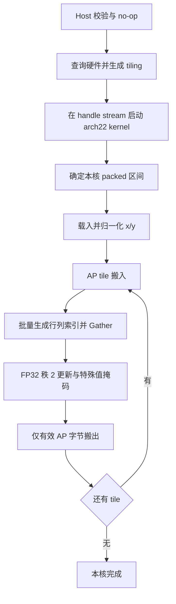

# aclblasSspr2 A2/A3 算子设计文档

| 项目 | 内容 |
| --- | --- |
| 版本 | v1.0，设计评审提交稿 |
| 编写日期 | 2026-09-11 |
| 目标 | 为 Atlas A2/A3 增加 FLOAT32 对称矩阵 packed 秩-2 更新能力 |
| 开发框架 | ops-blas，Ascend C kernel 直调，arch22 |
| 目标软件环境 | CANN 9.1.0 |
| 当前阶段 | 需求、源码基线与测试资料已核对；设计数学已作 CPU 检查；尚未实现、编译或进行 NPU 验收 |
| 主要输入 | 任务资料包中的 `aclblasSspr2_task_doc.md` 及完整 ZIP 中的任务书、测试说明、CSV 和 Python 脚本 |

本文件按社区设计模板的“需求背景—需求分析—详细设计—可维可测分析”组织，可作为后续实现和设计评审的依据。文中的“正式要求”来自本任务书；“设计决定”是本方案的实现选择；“待确认”表示资料之间存在冲突，尚不能当作已获认可的验收结论。涉及合入与测试的内容均为后续交付规划。


### 提交说明

- 贡献者：`gcw_l6gqPgyE`。
- 任务名称：算子实操工坊-北京站-aclblasSspr2算子开发(A2A3)。
- 当前任务资料未提供编号，社区已公开的任务列表也未检索到该任务；提交目录按资料包原名建立，待维护者确认正式编号后可调整。
- 本 PR 仅提交设计正文。表中 S1～S5 为原任务包中的资料名称与本地核对位置，不是仓库内的可点击附件；其要点、冲突、阈值和用例统计均已写入正文，原始包与审计记录由提交者留存。
- AI 辅助：OpenAI Codex，GPT-6，用于需求分析、方案撰写、资料核对和提交整理；尚未实现或完成 NPU 验收。

## 1. 需求背景（required）

### 1.1 需求来源与资料基线

本任务来源于“算子实操工坊-北京站-aclblasSspr2算子开发(A2A3)”资料包。独立提供的任务书与 ZIP 内任务书字节一致，SHA256 均为 `ef9d566dfa72ae4f8ef95758fb1acc2a1591ac5cc30a20ac04c0a43fd19c1cca`。

| 编号 | 资料 | 本文用途 |
| --- | --- | --- |
| S1 | 任务书（`source/aclblasSspr2_task_doc.md`，本地核对资料） | 接口、语义、硬件、精度、性能与交付要求 |
| S2 | 测试 README（`source/test_cases/README.md`，本地核对资料） | 测试组织与已有说明，冲突处单列处理 |
| S3 | 1200 条测试用例（`source/test_cases/sspr2_test.csv`，本地核对资料） | 1000 条精度/功能用例、200 条性能用例的真实参数 |
| S4 | GPU 基线 CSV（`source/test_cases/gpu_baseline.csv`，本地核对资料） | 200 条已填数值的参考基线；数据来源的原始测量记录未随包提供 |
| S5 | 生成器（`source/test_cases/gen_csv.py`，本地核对资料）、精度脚本（`source/test_cases/verify_accuracy.py`，本地核对资料）、性能脚本（`source/test_cases/verify_performance.py`，本地核对资料） | 核对分布、解析、计时和判定逻辑 |
| S6 | [社区设计模板](https://gitcode.com/cann/cann-ops-competitions/blob/8d92c7fc5100bfa0b74b7eb126961f5466927e61/04_tasks/01_community-task-2026/resources/design_template.md) | 本文结构 |
| S7 | [ops-blas 基线](https://gitcode.com/cann/ops-blas/tree/7eae2328a65753bf55cffc489253eb434ea3317e) | 当前公共接口、已有后端、测试框架及工程集成 |

S6、S7 于 2026-09-11 从官方 Git 仓库读取。ops-blas 基线提交为 `7eae2328a65753bf55cffc489253eb434ea3317e`，社区仓基线提交为 `8d92c7fc5100bfa0b74b7eb126961f5466927e61`。正式开发前应重新确认目标分支；本设计的“已有/缺少”结论均针对上述快照。

### 1.2 业务功能与计算特点

`Sspr2` 是 BLAS Level 2 的实数对称矩阵秩-2 更新。它将两个向量的对称外积累加到旧矩阵中，结果仍为对称矩阵。接口只保存指定三角，使用 `n(n+1)/2` 个 FLOAT32 元素；没有完整二维输出，也没有 `lda`、`beta`、转置或 batch 参数。

其特点是输出规模为 O(n²)、向量规模为 O(n)，不同输出元素之间没有归约依赖。实现重点是 packed 寻址、输入向量复用、连续搬运和核间负载均衡。本方案直接更新 AP，采用 AIV 矢量计算，不将问题展开为稠密矩阵乘法。

### 1.3 当前实现现状与本次增量

任务书称该接口尚未声明；实时核对的 S7 已包含相同签名及 arch35 后端，因此本次工程目标需要按实际基线调整。

| 项目 | S7 中的实际状态 | 本任务设计 |
| --- | --- | --- |
| 公共接口 | `include/cann_ops_blas.h` 已有 `aclblasSspr2` | 复用声明与 ABI，不重复定义 |
| 枚举 | `ACLBLAS_UPPER=121`、`ACLBLAS_LOWER=122` | 使用真实公共枚举；附件字符串在测试输入层转换 |
| 算子实现 | `blas/spr2/arch35/` 已有 Host、SIMT kernel、tiling | 新增 `blas/spr2/arch22/` 的 Ascend C 矢量后端 |
| 产品支持 | 现有 README 标注 950PR/950DT 支持，A2/A3 不支持 | 本任务完成后按实际验证情况更新 A2/A3 支持说明 |
| 测试组织 | 当前为 `test/spr2/`，已含 arch35 和公共参数/golden | 任务指定 `test/spr2/sspr2/arch22/`，需显式构建注册与路径协调 |
| 参数校验 | arch35 的非法 uplo 返回 INVALID_VALUE，且在 alpha=0 前检查 x/y/AP | arch22 按任务书契约设计，跨架构差异列为评审项 |

现有 arch35 使用 `simt_api/asc_simt.h`、`asc_vf_call` 等路径；它可用于核对数学语义与工程组织，不能把复制该代码视为已获得 A2/A3 实现。

## 2. 需求分析（required）

### 2.1 正式要求拆解

| ID | 要求 | 设计落点 | 验证方式 |
| --- | --- | --- | --- |
| R01 | FLOAT32，`A ← A + αxyᵀ + αyxᵀ` | §3.1、§3.6 | Netlib cblas_sspr2 全量 AP 比对 |
| R02 | UPPER/LOWER，列主序 packed，AP 原地更新 | §3.2、§3.5 | 独立索引验证、手算样例、尾部哨兵 |
| R03 | incx/incy 支持正负非零步长 | §3.3、§3.7 | 两种 uplo × 36 种步长组合 |
| R04 | n=0、alpha=0 的 no-op 与规定错误码 | §3.4 | 直接 API 测试与不写入验证 |
| R05 | handle 绑定 stream，异步直调 | §3.4、§3.9 | 同流链式调用、双流隔离、同步后读回 |
| R06 | A2/A3，arch22，CANN 9.1.0 | §3.10 | 对应产品编译和设备验证分别记录 |
| R07 | FLOAT32 精度门槛 | §4.3 | 逐元素容差、匹配比例、最大误差与特殊值分类 |
| R08 | 4 条平均耗时上限，warmup 后有效采样 >50 次 | §4.4 | 设备事件/Profiler，明确采样数及计时边界 |
| R09 | 覆盖附件全部用例并补齐缺失场景 | §4.1、§4.2 | case ID 清单及预期数与执行数核对 |
| R10 | 提供设计、代码、测试、自测报告、算子 README | §4.7 | 交付清单和可复现说明 |

**范围说明：** 当前任务仅要求 FLOAT32、Host alpha、单个实数对称 packed 矩阵，以及由 incx/incy 描述的向量步长。不增加 Device alpha、其他数据类型、batch、一般非连续 Tensor、广播或私有产品 API。`n` 是运行时参数；不需要额外图模式动态 shape 接口。

### 2.2 资料冲突与设计采用口径

| ID | 已发现的问题 | 本稿采用的设计口径 | 后续需要闭环的事项 |
| --- | --- | --- | --- |
| C01 | 任务书 §2.1 的 LOWER 下标写成 `i(i+1)/2+j`，与“列主序 packed”冲突 | 采用 `j(2n-j+1)/2+(i-j)`，详见 §3.2 | 请任务方确认文字勘误；不得按错误公式生成 golden |
| C02 | 任务书称接口尚未声明，但上游已有 | 复用公共接口，补 arch22 | 在目标分支再次核对，避免重复符号 |
| C03 | 任务书只要求非零计算时检查 x/y/AP；测试 README 与 arch35 在 alpha=0 前检查它们 | alpha=0 时不检查、不读取 x/y/AP；允许这些指针为空 | 确认 no-op 合同及与 arch35 的兼容处理 |
| C04 | “n=0 直接成功”与 alpha 非空、步长非零等条款的交叉优先级未完全写明 | 基本参数校验优先；n=0 不解引用 alpha，不启动 kernel | 确认 n=0 同时有非法参数时的返回码，详见 §3.4 |
| C05 | 任务书要求 INVALID_ENUM；arch35 与其 CPU wrapper 返回 INVALID_VALUE | arch22 以任务书为准返回 INVALID_ENUM | 公共测试层应区分平台预期，不能修改 golden 来掩盖错误 |
| C06 | 任务指定嵌套测试路径，上游使用扁平 `test/spr2/` | 本稿保留任务指定路径，通过 CMake 显式接入 | 与维护者确定最终目录；避免两套 sspr2_test 冲突 |
| C07 | 任务书出现 Atlas 800T A2 与 Atlas 800I A2 两种性能设备名称 | 性能目标按 910B3、CANN 9.1.0；报告记录真实整机型号 | 确认最终指定机型及是否可替代 |
| C08 | README 称基线为空；实际 200 条 gpu_ms 均有值 | 以实际 CSV 为事实，4 个强制门槛以任务书表格为准 | 基线原始记录和计时方法待补；禁止把文档门槛再除以 0.8 |
| C09 | 任务书要求均匀/正态各 50%；生成器 mixed 仍为均匀，alpha 为离散集合 | 为测试层补真实分布生成及统计 | 分布扩展属于完成自验所需工作 |
| C10 | 任务书内存要求“不涉及”；README 给出 Host 512MB 预算，交付表仍要求内存数据 | 不设额外正式性能门槛；报告记录内存，512MiB 作为测试工程设计预算 | 明确预算涵盖输入、输出、golden 等所有同时存活副本 |
| C11 | 任务书引用 fact_sheet §6，但包内没有该文件 | 使用本包已同步的第 4 条 n=4096 | 不恢复为 n=8192，不声称已核对缺失的 fact_sheet |
| C12 | arch35 禁止 INT_MIN 步长；任务书只禁止 0 | 64 位扩大后再求绝对值，不沿用无依据的 INT_MIN 禁令 | 极端合法跨度的 A2/A3 搬运能力需验证，见 §3.7 |

另外，任务书将 ssyr2 描述为“含 beta 的同族接口”属于说明性笔误：其接口也不含 beta。本任务的核心区别是 packed 存储；应以本任务 API 签名和公式为准，不能据此增加参数。

## 3. 详细设计（required）

### 3.1 数学语义

令 x̄、ȳ 表示根据步长解释后的逻辑向量。对于 uplo 指定三角中的 `(i,j)`：

```text
Anew(i,j) = Aold(i,j) + x̄[i] × (alpha × ȳ[j])
                        + ȳ[i] × (alpha × x̄[j])
L = n × (n+1) / 2
```

输入、乘法中间量和输出均为 FLOAT32。不采用 FP16/BF16 降精度路径。初始实现采用与参考计算相近的乘法、加法顺序；FMA 融合、重排和预缩放只能在精度回归后作为优化启用。每个 AP 元素只由一个核更新，不使用原子加法，也不需要核间归约。

### 3.2 Packed 存储与索引

所有公式均为 **0-based**。上三角第 j 列保存 `i=0..j`，下三角第 j 列保存 `i=j..n-1`。定义列起点：

```text
UPPER: SU(j) = j(j+1)/2
       k = SU(j) + i,                  0 ≤ i ≤ j < n

LOWER: SL(j) = j(2n-j+1)/2
       k = SL(j) + (i-j),              0 ≤ j ≤ i < n

SU(n) = SL(n) = L
```

LOWER 的列起点可由前 j 列的长度求和得到：`n+(n-1)+...+(n-j+1)`。因此它随 n 变化；任务书中与 n 无关的下三角公式不能表达该列主序布局。此结论与 [Netlib SSPR2](https://www.netlib.org/blas/sspr2.f) 的逐列顺序及 [CUDA 12.2 cuBLAS spr2 文档](https://docs.nvidia.com/cuda/archive/12.2.0/cublas/index.html#cublas-t-spr2) 一致，也是本设计独立推导的寻址公式。

以 `n=3` 为例：

| k | 0 | 1 | 2 | 3 | 4 | 5 |
| --- | --- | --- | --- | --- | --- | --- |
| UPPER | A00 | A01 | A11 | A02 | A12 | A22 |
| LOWER | A00 | A10 | A20 | A11 | A21 | A22 |

**可复核样例：** `A=[[1,2,3],[2,4,5],[3,5,6]]`，`x=[1,2,3]`，`y=[4,5,6]`，`alpha=0.5`，两步长均为 1。期望 UPPER 输出为 `[5,8.5,14,12,18.5,24]`，LOWER 输出为 `[5,8.5,12,14,18.5,24]`。这种非恒定样例能识别错误的下三角排列。

由 packed 位置 k 求 `(i,j)` 时，先对单调列起点 S 做整数二分，找到 `S(j)≤k<S(j+1)`，再按上式求 i。每核只在首个区间定位时进行二分，后续用列长度递推推进。基线方案不逐元素调用浮点开方，避免大尺寸舍入导致跨列寻址错误。

### 3.3 向量步长与地址安全

Host 对有符号步长先扩大为 int64，再参与计算：

```text
sx = 0                  if incx > 0
sx = -(n-1) × incx      if incx < 0
x̄[i] = x[sx + i × incx]

sy、ȳ 同理；n>0 时 Nx = 1+(n-1)×abs(int64(incx))。
```

例如 `n=3, incx=-2`、物理缓冲区为 `[x2, gap, x1, gap, x0]` 时，逻辑访问偏移依次为 `[4,2,0]`。传入的是物理缓冲区基址，不应由调用方先移动到末端后再由 kernel 二次修正。

`n(n+1)`、`j(2n-j+1)`、packed 位置、向量跨度与地址加法不能先在 32 位类型中计算。元素位置使用 int64/uint64；计算字节数与地址前做受检乘法和溢出检查，再转换为框架需要的类型。`n=0` 直接使用零长度定义，不代入 `1+(n-1)|inc|`。

公共 API 不携带实际缓冲区长度，Host 无法证明任意非空指针都足够大。调用方须提供有效、同设备、容量满足公式的内存；测试通过精确大小分配与哨兵检查验证 kernel 没有越界。检查可计算的数值溢出，不假装能校验任意悬空指针。

### 3.4 Host 侧设计

#### 3.4.1 公共接口与参数

```cpp
aclblasStatus_t aclblasSspr2(
    aclblasHandle_t handle, aclblasFillMode_t uplo, int n,
    const float* alpha, const float* x, int incx,
    const float* y, int incy, float* AP);
```

`handle/uplo/n/incx/incy` 位于 Host 侧；`alpha` 指向 Host FLOAT32 标量；`x/y` 是 Device 只读缓冲区；AP 是 Device 输入/输出缓冲区。Host 将 `*alpha` 按值复制到 tiling/launch 参数，kernel 不访问 Host alpha 指针。普通调用异步返回，调用方在读回结果前同步 handle 绑定的 stream。

#### 3.4.2 校验顺序与 quick return

本稿的明确顺序如下，其中组合优先级需要按 C03/C04/C05 完成评审：

| 顺序 | 条件 | 行为 |
| --- | --- | --- |
| 1 | handle==nullptr | HANDLE_IS_NULLPTR |
| 2 | uplo 不是 UPPER/LOWER | INVALID_ENUM |
| 3 | n<0 或 incx==0 或 incy==0 | INVALID_VALUE |
| 4 | alpha==nullptr | INVALID_VALUE |
| 5 | n==0 | SUCCESS，不解引用 alpha，不检查 x/y/AP，不发 kernel |
| 6 | 读取 Host alpha；值为 +0 或 -0 | SUCCESS，不检查或引用 x/y/AP，不发 kernel |
| 7 | x/y/AP 中存在 nullptr | INVALID_VALUE |
| 8 | 无法表示必要长度或地址范围 | INVALID_VALUE，且不能发 kernel |
| 9 | 读取 stream、硬件资源并计算 tiling | 查询/调度失败按公共状态码处理 |
| 10 | 在绑定 stream 上调用 arch22 kernel | 正常下发后返回 SUCCESS |

单独无效参数的错误码是正式要求；多个条件同时出现的优先级是设计决定。NaN/Inf alpha 不属于“非法数值参数”，不得用有限性检查拒绝任务规格允许的浮点输入。

Host 不增加每次调用的流同步、Device→Host 数据搬运或 AP 内容检查。runtime 下发阶段可检测的失败返回 `ACLBLAS_STATUS_EXECUTION_FAILED` 等已有状态；异步设备执行错误由后续同步/框架错误机制观察，不能将 Host 返回 SUCCESS 宣称为计算已经完成。

#### 3.4.3 TilingData

新增 arch22 专用 tiling 数据，采用固定宽度标量，不使用逐核分配数组：

| 字段 | 建议类型 | 用途 |
| --- | --- | --- |
| n、uplo、alpha | uint32、uint32、float | 数学参数 |
| incx、incy、startX、startY | int64 | 负步长和逻辑起点 |
| packedCount | uint64 | AP 总元素数 |
| coreCount、tileElems | uint32 | 启动核数、单次处理长度 |
| tilingKey、bufferCount | uint32 | 编译分支与单/双缓冲模式 |
| cacheElems、streamTileElems | uint32 | 向量缓存和流式窗口预算 |

字段顺序、对齐和布局由 Host/Device 共用头文件固定，使用静态断言验证尺寸。不将公共 Handle 内部结构暴露给调用方。核数使用基线已有 `GetAivCoreCount()` 或框架等效查询；UB 容量从目标平台查询，不硬编码为某个芯片的核数或容量。

### 3.5 分核、tiling 与资源预算

#### 3.5.1 Packed 连续区间分核

按照 AP 元素数量划分连续区间，避免“相同列数”造成上三角后半部/下三角前半部负载集中。对正常 32B 对齐的 AP，设 `G=ceil(L/8)`，C 为实际启动核数：

```text
groupBegin(b) = floor(b × G / C)
groupEnd(b)   = floor((b+1) × G / C)
kBegin(b)    = 8 × groupBegin(b)
kEnd(b)      = min(L, 8 × groupEnd(b))
```

其中 `C≤G`。每核负责 `[kBegin,kEnd)`，所有区间连续、无重叠且覆盖全部 AP；组数最多相差 1。一个列可以由相邻核处理不同片段，但每个元素只有一个写入者。

AP 若仅满足 FLOAT32 自然对齐而未满足 32B 对齐，按真实地址构造“首部短组—完整 32B 组—尾部短组”，再按组划分；两个短组各归单核。MTE 实际搬出范围必须等于合法字节范围。不能把每核尾部向上取整后写回，以免覆盖相邻核或 AP 边界。

每核按 B 个 packed 元素循环处理 tile，建议候选 `B∈{256,512,1024,2048}`，均为向量处理和搬运对齐长度的倍数。初始主路径采用 B=1024；最终 B 及核数由 UB 可用量和实测结果决定。

#### 3.5.2 分支与小尺寸

| tilingKey | 条件 | 路径 |
| --- | --- | --- |
| 0/1 | 小规模 UPPER/LOWER | 单核、小 tile、单缓冲，减少资源初始化成本 |
| 2/3 | 单位步长，完整 x/y 逻辑缓存可容纳 | 多核 packed 连续分片，直接缓存 x/y |
| 4/5 | 非单位步长，逻辑缓存可容纳 | 按步长搬入并压紧为 x̄/ȳ，再复用主计算 |
| 6/7 | 完整向量缓存无法容纳 | 分列段流式读取行向量，保持 AP 区间独占 |

偶数/奇数区分 UPPER/LOWER。负步长在载入阶段归一化，避免为每一种正负组合复制主计算逻辑。候选小规模分界可从 `L≤1024` 起步；这是待调优参数，不是正式输入上限。`n=4096` 只是附件性能规模上限，不能变成 API 的最大 n。

#### 3.5.3 UB 预算

缓存 x̄/ȳ 消耗 `8×alignUp(n,8)` 字节。下表中 B 表示 tile 的元素个数：

| 主 tile 缓冲区 | 预算（字节） |
| --- | ---: |
| 双缓冲 AP 输入及输出，各两份 FLOAT32 tile | 16×B |
| 4 个 FLOAT32 Gather 操作数 | 16×B |
| 行/列 uint32 字节偏移 | 8×B |
| 2 个 FLOAT32 算术临时向量 | 8×B |

采用保守上界：

```text
UB_need ≤ 8×alignUp(n,8) + 48×B + Uaux
UB_need ≤ UB_available
```

`Uaux` 包括比较掩码、向量索引构造、流水元数据、对齐空隙和 API 临时空间，初始预留至少 16KiB，并在编译/运行时核对实际峰值。以 `n=4096,B=1024` 为例，上述预算为 `32KiB+48KiB+16KiB=96KiB`，只是设计分配预算，不是设备占用实测值。

资源不满足时先减小 B 或关闭双缓冲，再选择流式路径。完整向量载入阶段的物理步长暂存区与主计算临时区按生命周期复用，峰值取两阶段最大值，不能将同时存活的 buffer 漏计。TPipe 在 kernel 入口构造后传入处理对象；不把 TPipe 放在算子类成员里。

**额外 GM workspace 目标为 0 字节。** 这指算子新增工作空间，不包括 x/y/AP 和框架 Handle 自带的默认工作空间；资源报告必须分别列出。

### 3.6 Kernel 主计算设计

#### 3.6.1 向量组织

采用固定长度、对齐 UB tile，使 AP 的一次搬入可以跨越多个 packed 列。根据 tile 内每个列段的起止位置，批量生成行/列字节偏移，使用 Gather 从逻辑 x/y 缓存形成：

```text
Xi[t] = x̄[i(t)]    Yi[t] = ȳ[i(t)]
Xj[t] = x̄[j(t)]    Yj[t] = ȳ[j(t)]
```

行索引在单个列段内连续，列索引恒定。索引生成使用“连续序列 + 常数填充 + 掩码”，按对齐的向量块处理首尾部分；只用标量计算列段元数据，不为每个 AP 元素执行 GetValue/SetValue 或标量 DMA 循环。

Gather 的源和目标 UB 基址、偏移 buffer 均保持 32B 对齐，偏移单位为字节，即 `index*sizeof(float)`。只对缓存内的局部索引转换为 uint32，不把全局 64 位 GM 地址直接截断给 Gather。可参考官方 [Gather API](https://www.hiascend.com/document/detail/en/canncommercial/850/API/ascendcopapi/atlasascendc_api_07_0092.html)；CANN 9.1.0 中具体重载、别名限制和掩码行为仍须用目标 SDK 编译确认。

#### 3.6.2 计算与特殊值

对有效且需要更新的 lane 执行：

```text
T1 = alpha × Yj
T2 = alpha × Xj
P1 = Xi × T1
P2 = Yi × T2
Tmp = APold + P1
APnew = Tmp + P2
```

普通加法不能随意写成 `APold + alpha*(Xi*Yj + Yi*Xj)`；该重排可能改变溢出、消去和 NaN/Inf 行为。对角线直接沿用同一计算路径，不用另外的 `2*alpha*x*y` 快捷式。

为贴近 Netlib 特殊值行为，保留“列向量两值同时为零时不进行本列算术更新”的判定：`Xj==0 && Yj==0` 的 lane 保留 APold。必须根据原始 Xj/Yj 生成 active mask，再执行乘法；不能先缩放后用结果是否为零来判断，也不能让 `0*Inf` 的结果覆盖原 AP。全 tile 都 inactive 时可跳过 AP 写回；混合 tile 用掩码选择保留原值。

Netlib 数值基线与 cuBLAS 在 NaN/Inf、次正规数或零列优化上的潜在差异应通过定向测试记录。若出现冲突，按任务方确认的特殊值合同冻结，不能默认“任意 NaN 都通过”或对 NaN 做清零。

#### 3.6.3 搬运与流水



CopyIn 使用 DataCopy/DataCopyPad 将有效 AP 范围搬到对齐的 UB；补齐只发生在 UB，padding 不参与有效结果。Compute 只处理有效元素；CopyOut 只写有效字节。官方 [非对齐数据处理说明](https://www.hiascend.com/developer/techArticles/20250627-1) 给出了 DataCopyPad 与矢量基址约束，适用接口仍需在目标 SDK 核对。

MTE2、Vector、MTE3 之间通过 TQue/event 建立依赖：输入完成后才可计算，计算完成后才可搬出，搬出完成前不得复用对应输出 buffer。正确性版本先用单缓冲；启用双缓冲后允许下一 tile 搬入与当前 tile 计算/搬出交叠。索引生成与 Gather 的标量/矢量依赖同样需要屏障，不能仅依靠源码顺序。

### 3.7 非单位步长与超缓存规模

**常见步长 ±1/±2/±3：** 每核分段搬入覆盖当前逻辑窗口的物理连续区间，再在 UB 中 Gather 压紧；负步长按逻辑偏移反向重排。按实际跨度选择窗口，不能为 n 个结果无条件搬入整个高步长物理缓冲区。x/y 的物理暂存区可先后复用。

**其他合法步长：** 当连续跨度放大过大时，选择带 stride 的批量搬运加 UB 压紧，按搬运指令的字段宽度、blockCount、UB 容量拆分，所有窗口基址通过 64 位计算。跨度无法由一条指令表达时必须通过合法的分解处理，不直接缩窄步长。极端 int 步长下，批量搬运能力、效率及上游禁止逐元素搬运规则是否同时可满足，需要专项原型验证；这是 C12/G0 风险，当前未声称已解决所有极端物理跨度。

**完整向量无法缓存：** 仍由单核独占其 AP 区间。按列段读取当前 xj/yj，以及该段需要的 xi/yi 窗口，形成对齐的计算 tile 后进行相同的两项更新；列标量在段内广播，行向量按需重用。AP tile 只由所有者写回，不能因为跨列窗口而产生第二个写入者。该路径空间为 O(B)，不分配 O(n²) 中间矩阵，初版以正确性为目标。

允许 x 与 y 只读别名，例如 `x==y`。AP 与 x/y 重叠的语义任务书未定义；本稿建议将其列为不保证的调用场景并请求确认，而不将 x/y/AP 一律加上互不别名的假设。普通 API 也不承诺多个 stream 并发更新同一 AP；这需要调用方建立依赖。

### 3.8 性能设计与可行性分析

读取旧 AP、写入新 AP 至少产生 `8L` 字节流量，向量、索引和片上运算另计。以充分复用列缩放结果的算法为参照，算术量约为 `4L+2n` FLOP；本稿 Gather 主路径为减少调度复杂度，可重复计算列缩放，约为 `6L` FLOP。两者均须通过实际测量判断瓶颈。

| 正式 case | AP 元素数 | AP 本体大小 | 仅 AP 读写量 | 耗时门槛 | 对应 AP 有效带宽 |
| --- | ---: | ---: | ---: | ---: | ---: |
| UPPER n=512 | 131,328 | 525,312 B | 1,050,624 B | 9.35 μs | 112.37 GB/s |
| LOWER n=2048 | 2,098,176 | 8,392,704 B | 16,785,408 B | 73.47 μs | 228.47 GB/s |
| UPPER n=4096 | 8,390,656 | 33,562,624 B | 67,125,248 B | 484.32 μs | 138.60 GB/s |
| LOWER n=4096 | 8,390,656 | 33,562,624 B | 67,125,248 B | 475.32 μs | 141.22 GB/s |

带宽按 `8L/门槛时间` 推导，属于方案分析，不是设备峰值或实测带宽。尤其 n=512 对启动延迟和 Host 资源查询敏感；单纯增加核数未必改善性能。

调优顺序为：先保证 4 个正式 case 的正确性，再比较核数与 tile 长度，随后测试双缓冲、列系数复用及连续长列段的低 Gather 开销路径。逐次记录改动前后同机、同环境耗时和全部精度回归。必要时缓存稳定的平台查询结果，但不能跨设备错误复用资源，也不能缓存每次调用的 alpha 值。

### 3.9 工程集成与可维护性

建议实现文件如下，名称属于设计建议，公共目录位置遵循任务书：

```text
include/cann_ops_blas.h                 # 已有声明，仅在必要时补充文档
blas/spr2/README.md                     # 增加 A2/A3 说明、限制和示例
blas/spr2/arch22/
    sspr2_host.cpp                     # 校验、资源查询、tiling、stream 下发
    sspr2_tiling_data.h                 # arch22 标量 tiling 合同
    sspr2_kernel.cpp                   # 入口及编译分发
    sspr2_kernel.h                     # packed tile、载入、计算、写回
test/spr2/sspr2/
    CMakeLists.txt                     # 显式接入现有扁平 test/spr2 目标
    sspr2_param.h                      # 任务 CSV 兼容和预期值
    sspr2_golden.h                     # cblas 数值基线与任务错误码合同
    arch22/
        sspr2_npu_wrapper.h
        sspr2_test.cpp
        sspr2_test.csv
        sspr2_extra_test.csv
```

当前 `test/CMakeLists.txt` 对 `--ops=sspr2` 会通过去除首字母匹配现有扁平 `test/spr2`。所以不能只放入新嵌套目录就声称已接入；需在该家族 CMake 明确按 SOC 分流，arch22 转到本任务目录，arch35 保持原有路径，且每种构建只有一个 `sspr2_test` 目标。若维护者要求改为扁平 arch22，则同步更新任务验收路径、脚本与 README，不保留重复副本。

`blas/CMakeLists.txt` 已按 `SOC_ARCH_DIRS` 选择架构源码。检查 arch22 编译源列表和导出符号，保证公共接口只定义一次，目标包中不混入 arch35 SIMT 源。构建前记录编译器、CANN、asc-devkit、实际 SoC、构建参数和代码提交。

CPU golden 的数值实现复用 `cblas_sspr2(CblasColMajor,...)`；错误码预期依据任务书独立编写。不能直接复用现有 arch35 CPU wrapper 的错误码作为新接口的真值。共用测试 helper 的修改需同时做 arch35 回归。

### 3.10 支持硬件与限制

| 项目 | 要求/设计 | 当前验证状态 |
| --- | --- | --- |
| Atlas A2 系列、910B3 | arch22，主要性能验收目标 | 未设备验证 |
| Atlas A3 系列 | arch22，功能兼容目标 | 未设备验证；需单独记录产品证据 |
| CANN 9.1.0 | 正式指定环境 | 未构建 |
| torch≥2.1.0、torch_npu≥2.1.0.post3 | 任务书测试环境要求 | 按验收环境配置；C++ 接口不依赖 Python 调用 |
| CUDA 12.2、驱动 535.104.05 | 对标 GPU 环境 | 当前仅核对文档和附件基线，未复测 GPU |
| 输入范围 | n≥0，非零有符号步长，内存足够 | 常见范围有明确方案；极端跨度见 §3.7 |
| 内存与格式 | AP packed 原地，x/y只读，Host alpha | 不提供一般视图、广播或 batch 语义 |

不能因为 arch22 源码编译成功，就将 A2/A3 的功能和性能都写成“已验证”。本设计也不对现有 arch35 后端的正确性或性能重新作出结论。

## 4. 可维可测分析

### 4.1 附件测试基线审计

实际 CSV 共 1200 条，case_name 无重复。分类如下：

| 分类 | 前缀 | 条数 |
| --- | --- | ---: |
| 基础 | TC_L0 | 4 |
| 尺寸 | TC_SQ | 46 |
| alpha 标量 | TC_AB | 16 |
| 步长 | TC_INC | 36 |
| 填充 | TC_FL | 18 |
| 中尺寸覆盖 | TC_CV | 16 |
| 边界/负向 | TC_ED | 13 |
| 扩展 | TC_EX | 851 |
| 性能 | TC_PF | 200 |

1000 条精度/功能用例中的参数错误场景验证状态码，不计作“1000 个数值精度样本”。200 条性能用例均为 `incx=incy=1`。4 条正式性能 case 的 ID 为 `TC_PF_1001` 至 `TC_PF_1004`。

附件与 S7 存在以下实际兼容问题，开发时必须先修正测试接入：

| 位置 | 实际问题 | 修正设计 |
| --- | --- | --- |
| uplo 字符串 | 附件用 `ACLBLAS_FILL_MODE_UPPER/LOWER`；S7 解析器只识别 `ACLBLAS_UPPER/LOWER`、短名等 | 显式别名转换；非法 999 保持非法，未知值不得回退 UPPER |
| 填充列 | 附件为 x_fill/y_fill/ap_fill；S7 Sspr2Param 读取 x/y/ap | 兼容两套列名；同时存在且值冲突时报错 |
| alpha 空指针 | 附件写 `null`；S7 alphaNull 仅匹配 `NULLPTR` | 显式识别 null/NULLPTR；不能经 parseFloat 默认成 1.0 |
| 测试路径/二进制 | 脚本只搜索嵌套 spr2/sspr2 或 test/sspr2；未覆盖现有扁平 test/spr2 | 根据明确 SOC 和实际构建输出选择，不凭先找到的目录决定 |
| 精度判定 | CSV 配置 MERE/MARE，不等价于任务要求的 matched_ratio/max_abs_error | 额外实现正式判据；MERE/MARE 仅保留为辅助指标 |
| 精度脚本 | 执行阶段不检查 subprocess returncode；超时可返回 0/0 并以 0 退出 | 退出码、超时、解析数、预期 case 集合任一异常即失败 |
| 性能脚本 | 解析整数 ms 的 GTest 全流程耗时；FAILED 可能变成 NO_REF | 改用结构化设备计时；执行失败优先判失败，NO_REF 不能算通过 |
| SOC 选择 | 性能脚本先找 arch35；精度脚本未知 SOC 默认 arch35 | 未知 SOC 明确失败；A2/A3 必须选择 arch22 |
| 生成器 | mixed 仍是均匀；重新生成会将基线写为空值 | 在派生输出中生成，保留 S4 原始基线，补真实正态分布 |

还需修正精度脚本的过滤串构造：正向和负向过滤用 GTest 的 `正向-负向` 格式，例如 `*TC_L0*-*TC_PF*`，避免将 `:` 插入为多余正向分支。最终以列出的实际执行 ID 检查筛选是否正确。

本次仅对这些脚本作静态分析，没有运行附件中的 build、生成或设备测试命令。缺少完整 C++ 测试工程的附件不能自行提供真实 NPU 验收结果；S7 虽有 arch35 测试，也仍需补 arch22 接入及任务专属断言。

### 4.2 测试设计与补充覆盖

| 组别 | 核心场景 | 判定重点 |
| --- | --- | --- |
| T01 基础数学 | n=1/2/3/4/8；非恒定 AP、alpha 正/负 | 手算样例、上下三角恢复后对称一致 |
| T02 packed边界 | n=7/8/9、31/32/33、63/64/65、511/512/513、4095/4096/4097 | 首末列、对角线、跨列 tile、末元素 |
| T03 步长 | UPPER/LOWER 各自覆盖 ±1/±2/±3 的全部 36 组合 | 负起点、x/y不同步长、无关间隙保持不变 |
| T04 随机分布 | alpha/x/y/AP 的均匀与正态各 50% | 记录 distribution/μ/σ/seed，不能只凭填充名称判断 |
| T05 no-op | n=0；alpha=±0；x/y/AP为空或含 NaN；alpha 本身为空的组合 | 合同返回码，无 kernel，AP按字节不变 |
| T06 负向 | 空handle、非法uplo、n<0、inc=0、非零计算空指针 | 独立参数错误及交叉优先级；无需调用 cblas 验证非法参数 |
| T07 特殊值 | x/y/AP/alpha 的 ±Inf、NaN、±0、次正规数、大值和消去 | 分类逐位置一致；零列不误传播 NaN；不忽略溢出 |
| T08 对齐 | x/y/AP 基址偏移 0..7 个 float、精确长度缓冲区 | 32B边界、尾部无越界、写前后保护区完全一致 |
| T09 流与生命周期 | 同流连续更新、前后 kernel 链接、双流独立AP、Host alpha调用后改变 | 同流顺序、设备同步成功、标量按调用时值捕获 |
| T10 分支回归 | 小规模边界、缓存可容纳边界±1、单/双缓冲、所有 tilingKey | 切换分支后数学与边界行为一致 |
| T11 地址算术 | n=1配合INT_MIN/INT_MAX步长；大n仅验证Host长度/索引计算 | 不制造 abs(INT_MIN) 溢出；不分配不可承受的假大矩阵 |
| T12 性能/内存 | 4 条强制 case + 196 条参考 case | 真实设备时间、有效数、内存和原始数据 |

附件 TC_INC 的 36 组合仅覆盖 UPPER，LOWER 扩展用例并未穷尽双非单位步长组合，因此必须显式补齐。随机分布按有效随机测试实例统计，每个随机输入字段各有一半均匀、一半正态；确定性特殊值与负向测试单独统计，避免用它们冲抵分布比例。

Golden 采用 Netlib `cblas_sspr2` FLOAT32 实现并固定库版本/构建来源。Host 为 AP 输入和 golden 保留独立副本，NPU 结果同步读回后逐元素比较，不与输出共享缓冲区。测试状态码期望不能由 NPU 实现函数自身生成。

### 4.3 精度验收

对 golden 和 actual 均为有限数的位置，定义：

```text
err[k] = abs(actual[k] - golden[k])
pass[k] = err[k] ≤ 2^-16 + 2^-10 × abs(golden[k])
matched_ratio = 通过的有限位置数 / 有限位置总数
```

正式有限数容差为 `rtol=2^-10=0.0009765625`、`atol=2^-16=0.0000152587890625`，要求 matched_ratio≥0.99，并满足最大误差限制。比较器用更高精度计算差值和统计，避免检测器自身溢出。

任务书给出 `max_abs_error_limit=1e-2 或 32×ULP`。本稿默认使用直接、较保守的 `max_abs_error≤0.01` 作为当前验收分支，同时记录 ULP。若使用 32 ULP 分支，必须先明确 ULP 的参考值、零/次正规数定义及“所有有限元素”的逐点条件并冻结比较器，不能在单条失败后临时挑选较宽口径。最新社区精度文档的 32 ULP 细节在本次未成功读取，以任务书数值为准并保留待确认项。

NaN 和 Inf 不参与普通差值运算：golden 为 NaN 时 actual 必须为 NaN；golden 为 Inf 时 actual 必须同号 Inf；有限与非有限位置不匹配直接失败。特殊值分类要求逐位置 100% 一致，不使用 0.99 掩盖；如果有限位置数为零，只有全部特殊值分类通过才可通过该部分，并将比例标为不适用。n=0 通过状态与无副作用断言判定，不出现除以零。

alpha=0 的 AP 使用字节完全一致检查，包含负零和 NaN payload；这同时避免数值比较误判 no-op。`x/y` 和 stride 间隙应保持原内容。有限输入的优化允许非 bit-exact，但最终仍须满足上述正式判据。

### 4.4 性能标准与测量方案

4 条强制门槛直接来自任务书 §3.3：

| case ID | uplo | n | incx | incy | alpha（附件取值） | 平均单次上限 |
| --- | --- | ---: | ---: | ---: | ---: | ---: |
| TC_PF_1001 | UPPER | 512 | 1 | 1 | 1.0 | 9.35 μs |
| TC_PF_1002 | LOWER | 2048 | 1 | 1 | 1.0 | 73.47 μs |
| TC_PF_1003 | UPPER | 4096 | 1 | 1 | 1.0 | 484.32 μs |
| TC_PF_1004 | LOWER | 4096 | 1 | 1 | 1.0 | 475.32 μs |

S4 前四条 gpu_ms 为 `0.007481、0.058777、0.387456、0.380256`。换算 `gpu_ms×1000/0.8` 得 `9.35125、73.47125、484.32、475.32 μs`，前两项有末位舍入差。正式判定使用任务书 `9.35/73.47/484.32/475.32`，不二次放宽，也不把 ms 与 μs 混用。196 条额外性能用例保留单独结果及基线比值；除非任务方另有明确要求，不把它们冒充这 4 条门槛。

**建议测量步骤：**

1. 固定代码、编译选项、910B3设备、CANN 9.1.0与输入seed，确认同卡没有其他测试干扰；预先分配Device内存、创建handle/stream/event。
2. 先对相同参数作精度验证，再 warmup 20 次；warmup 次数是建议默认值，可根据稳定性增加。
3. 每个有效样本先恢复 AP 到 AP0，恢复操作位于计时事件之前；在同一 stream 记录 start、调用一次 aclblasSspr2、记录 end，等待 end 完成后读取设备 elapsed time。
4. 采集 100 个成功的有效单次样本，满足正式要求“>50”。不得将超时、失败或遗漏样本按零时间计入平均值；不随意剔除慢样本。因系统干扰重测时保留原因和完整原始序列。
5. 以平均值对照门槛；另报 median/P90/min/max、采样数、warmup次数和计时工具，辅助定位稳定性。
6. 用 Profiler 抽查事件区间内确为目标 kernel，确认没有算入 CPU golden、数据初始化或 D2H。另列 Host API 端到端开销供诊断，不与设备时间混为一列。

AP 每次都会原地累加，不能 warmup 多次后直接把最终结果与“更新一次”的 golden 比较。若为小尺寸使用多次调用的分组计时来改善精度，应记录每组次数和每次输入状态；该口径不能悄悄替换单次采样。计时范围究竟按设备 API 区间还是纯 kernel 时长，需在正式性能验收前与任务方确认并与基线保持一致。

建议输出结构化记录：`case_id,uplo,n,incx,incy,alpha,device,soc,cann,commit,warmup,repeats,timing_scope,avg_us,median_us,p90_us,limit_us,verdict`，并附原始逐次时间。失败、缺失基线或缺失计时标记为 FAIL/UNVERIFIED，不能通过 `NO_REF` 绕过强制 case。

### 4.5 内存与并发分析

单次输入主体占用 `4L+4Nx+4Ny` 字节；测试还包括 AP0、golden、actual 和保护区等副本。n=4096 时 AP 本体约 32.008MiB/33.563MB，不能因单个 AP 小于512MiB就认定整个测试进程满足预算。建议顺序执行 case，及时释放派生缓冲区，并单独记录 Host RSS、Device输入/输出、算子额外workspace、Handle默认workspace与UB预算。

相同 stream 上连续调用按下发顺序运行。不同 stream 处理独立 AP 时应可并发；如果共用 x/y，它们在所有相关调用完成前保持只读和存活。AP/x/y 重叠、同一 AP 的跨流并发更新与销毁仍在使用的缓冲区不属于本稿保证场景。

### 4.6 兼容性、风险与阶段退出条件

| 阶段 | 工作 | 退出条件 |
| --- | --- | --- |
| G0 合同冻结 | 解决 LOWER 勘误、no-op优先级、架构差异、测试路径、机型/计时、ULP及极端步长口径 | 有明确设计结论和定向测试预期，不将关键冲突隐藏在实现里 |
| G1 工程接入 | 公共符号复用、arch22构建、测试CSV适配与golden接入 | 目标编译成功，测试能列出准确ID，单独非法参数测试按任务要求工作 |
| G2 正确性 | 主路径与流式路径、正负步长、特殊值、哨兵、全部附件用例 | 1000条附件精度/功能用例及补充用例全量完成，数量/状态/判据一致 |
| G3 性能 | 4条强制case调优，200条参考case采集 | 4条平均耗时逐项达标，采样>50且报告计时边界；所有失败被解释或修复 |
| G4 产品回归 | A2/A3分别验证，必要的arch35共享层回归 | 产品支持证据明确，无公共ABI/测试语义倒退 |
| G5 交付评审 | 设计、源码、测试、README、自测报告与原始记录 | 交付位置、版本与复现方法完整；之后按任务流程提交评审 |

主要技术风险为：packed 索引错误、跨核尾部覆盖、Gather/索引构造开销、极端步长搬运限制、特殊值与FMA差异、小尺寸启动开销、测试框架的静默默认值和错误通过。每项均已有对应设计措施或明确验证点；尚未实测的优化不写成“性能保证”。

兼容性策略是保持公共签名与现有 arch35 符号不变，将 A2/A3 数值实现放在 arch22。共享参数校验若要统一，会影响既有平台行为，必须先确认统一合同再补回归；不能因当前 golden 与 Host 同时存在相同错误就认定其行为符合本任务。

### 4.7 后续交付清单

| 交付物 | 应包含的内容 | 本次状态 |
| --- | --- | --- |
| 算子设计文档 | 本稿及评审修订记录 | 已编写 |
| 实现源码 | arch22 Host/kernel/tiling、公共接口集成、算子README | 尚未开发 |
| 自测工程与用例 | 全部附件case、补充case、CSV兼容、golden、GTest、可靠运行脚本 | 已设计，尚未实现 |
| 自测报告 | 参数、错误码、精度指标/截图、计时原始记录/截图、内存数据、环境和提交版本 | 尚未设备验证，不能填写通过结果 |
| 待验收代码地址 | 个人仓链接、分支、算子目录及复现步骤 | 待实现阶段确定 |
| 社区PR与正式验收 | 按任务书规定路径与流程提交 | 本 PR 提交设计评审；算子实现的合入与正式验收尚未进行 |

## 附录 A. 本次文档自检与证据边界

本稿已完成资料清单核对、独立任务书与包内副本哈希比对、1200 条 CSV 分类/唯一性检查、200 条已填基线检查、4 条门槛换算、packed 索引与分核公式的 CPU 数学检查。

数学检查在 n=1..129 上穷举上下三角索引，并检查多种核数分片与步长起点；另外抽查 n=512/2048/4096/65537/INT_MAX 的列首尾和随机位置。3×3 手算样例通过。本地数学检查脚本及机器可读审计结果由提交者留存；本 PR 只提交设计正文，不将这些检查称为算子自测结果。这些检查验证的是设计中的数学与资料一致性，不是 CANN kernel、cblas 数值或设备性能测试。

上游源代码仅作静态阅读；官方 Ascend C API 页面用于核对设计方向，所读页面版本不全是9.1.0。目标 SDK 的编译可用性、真实 UB、设备事件精度、内存越界和A2/A3性能都留待实现阶段验证。

## 附录 B. 主要参考资料

- [Netlib BLAS SSPR2 参考实现](https://www.netlib.org/blas/sspr2.f)：packed顺序、负步长、quick return及零列行为。
- [CUDA 12.2 cuBLAS spr2](https://docs.nvidia.com/cuda/archive/12.2.0/cublas/index.html#cublas-t-spr2)：任务指定对标版本的接口语义。
- [ops-blas 公共头文件（核对提交）](https://gitcode.com/cann/ops-blas/blob/7eae2328a65753bf55cffc489253eb434ea3317e/include/cann_ops_blas.h)：现有接口声明。
- [ops-blas 公共枚举（核对提交）](https://gitcode.com/cann/ops-blas/blob/7eae2328a65753bf55cffc489253eb434ea3317e/include/cann_ops_blas_common.h)：真实枚举及状态码。
- [现有 Sspr2 arch35 Host（核对提交）](https://gitcode.com/cann/ops-blas/blob/7eae2328a65753bf55cffc489253eb434ea3317e/blas/spr2/arch35/sspr2_host.cpp)：实现增量及校验差异。
- [现有 Sspr2 参数解析（核对提交）](https://gitcode.com/cann/ops-blas/blob/7eae2328a65753bf55cffc489253eb434ea3317e/test/spr2/sspr2_param.h)：附件CSV适配依据。
- [Ascend C Gather](https://www.hiascend.com/document/detail/en/canncommercial/850/API/ascendcopapi/atlasascendc_api_07_0092.html)：片上收集计算参考，具体版本待SDK核对。
- [Ascend C 非对齐数据处理](https://www.hiascend.com/developer/techArticles/20250627-1)：32B对齐与有效长度搬运设计参考。
- [社区精度标准（任务书引用）](https://gitcode.com/cann/opbase/blob/master/docs/zh/ops_precision_standard/experimental_standard.md)：本次未成功读取最新正文，精度数值取自S1，ULP细节不作已核实结论。
