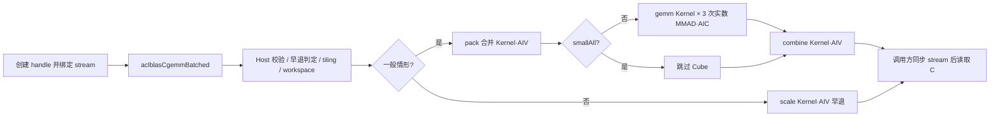
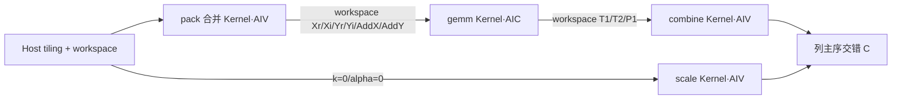
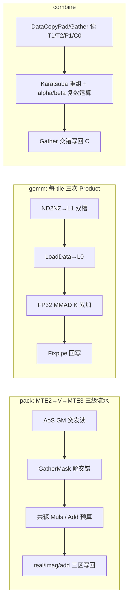

# aclblasCgemmBatched A2/A3 算子设计文档

| 项目 | 内容 |
| --- | --- |
| 算子名 | `aclblasCgemmBatched` |
| 产品支持 | Atlas 800I A2（910B3，ascend910b3）、Atlas 800T A2、Atlas A3（ascend910_9382，dav-c220） |
| CANN 版本 | 9.1.0 |
| 实现语言 | Ascend C（Kernel）+ C++（Host） |
| 仓内路径 | `ops-blas/blas/gemm_batched/arch22/` |
| 接口声明 | `ops-blas/include/cann_ops_blas.h`（既有第 433–438 行，复用不改签名） |
| 对标 API | cuBLAS `cublasCgemmBatched` / Netlib `cgemm.f` |
| 精度标准 | 生态算子开源精度标准（experimental_standard） |

---

# 一、需求背景（required）

## 1.1 需求来源

Ascend CANN 社区任务：在 Atlas A2/A3 系列产品（arch22，dav-2201/dav-c220 指令集）上，基于 ops-blas 工程（仓库：https://gitcode.com/cann/ops-blas ）使用 Ascend C 编程语言开发句柄式（handle-based BLAS）批量单精度复数矩阵乘算子 `aclblasCgemmBatched`。接口语义、参数顺序与对标接口 cuBLAS `cublasCgemmBatched` 及 Netlib `cgemm`（Netlib BLAS Fortran）保持一致，精度满足生态算子开源精度标准，性能满足任务书给定标杆。

ops-blas 仓批量矩阵乘目录 `blas/gemm_batched/` 已存在 arch35（Ascend 950 系列）版本实现，但缺少面向 Atlas A2/A3 的 arch22 版本。本次在 `blas/gemm_batched/arch22/` 新增 Host、Kernel、tiling ABI 共 5 个文件，与 arch35 同名实现并存，按产品/架构分别编译，不修改公共接口签名。

## 1.2 背景介绍

### 1.2.1 标杆算子现状

`aclblasCgemmBatched` 是 BLAS GEMM 的 complex64 批量版本：对一批同形状（uniform batch）复数矩阵逐批执行复数矩阵乘加，各批矩阵首址由设备侧指针数组独立指定，不要求批次间内存连续。正式实现位于 ops-blas：

```text
include/cann_ops_blas.h                                    # 公共 C API（arch22 不修改签名）
blas/gemm_batched/arch22/cgemm_batched_host.cpp           # Host 参数校验、tiling、workspace、stream launch
blas/gemm_batched/arch22/cgemm_batched_tiling_data.h      # Host–Kernel tiling ABI（4 个结构体）
blas/gemm_batched/arch22/cgemm_batched_kernel.h           # 4 个 kernel 的 Host 侧启动声明
blas/gemm_batched/arch22/cgemm_batched_kernel.cpp         # pack / gemm / combine / scale 四个 Kernel
blas/gemm_batched/arch22/cgemm_batched_profile_probe.h    # 精度补偿 profile 选择（生产编译为编译期常量）
test/gemm_batched/cgemm_batched/arch22/                   # CSV、GTest 与 NPU wrapper（架构相关）
test/gemm_batched/cgemm_batched/                          # gen_csv.py、verify 脚本、golden 框架（架构无关）
```

### 1.2.2 标杆支持的数据类型和数据格式

| 参数 | 参数含义 | 数据类型 | 支持数据类型 | 约束 | 形状 |
| --- | --- | --- | --- | --- | --- |
| transa / transb | 矩阵 A/B 的操作类型 | 枚举 | N / T / C | 枚举值合法 | 标量（Host 内存） |
| m | op(A) 与 C 的行数 | int | int | m ≥ 0 | 标量 |
| n | op(B) 与 C 的列数 | int | int | n ≥ 0 | 标量 |
| k | op(A) 的列数 / op(B) 的行数 | int | int | k ≥ 0 | 标量 |
| alpha | 复数乘性系数 | const aclblasComplex* | Complex FP32 | 非空指针 | 标量（Host 内存） |
| Aarray | A 矩阵指针数组 | const aclblasComplex* const[] | Complex FP32 | batchCount>0 时非空；逐批首址 | 见维度约束 |
| lda | A 的主维（复数元素） | int | int | T/C 时 lda≥k，N 时 lda≥m | 标量 |
| Barray | B 矩阵指针数组 | const aclblasComplex* const[] | Complex FP32 | batchCount>0 时非空；逐批首址 | 见维度约束 |
| ldb | B 的主维（复数元素） | int | int | T/C 时 ldb≥n，N 时 ldb≥k | 标量 |
| beta | 复数加性系数 | const aclblasComplex* | Complex FP32 | 非空指针 | 标量（Host 内存） |
| Carray | C 矩阵指针数组（原地更新） | aclblasComplex* const[] | Complex FP32 | batchCount>0 时非空；逐批首址 | ldc×n 复数矩阵 |
| ldc | C 的主维（复数元素） | int | int | ldc ≥ max(1, m) | 标量 |
| batchCount | 批次数量 | int | int | batchCount ≥ 0 | 标量 |

维度约束（列主序，物理行列）：

- transa = N：op(A) 为 m×k，A 物理大小 lda×k；transa = T/C：op(A) 为 m×k，A 物理大小 lda×m。
- transb = N：op(B) 为 k×n，B 物理大小 ldb×n；transb = T/C：op(B) 为 k×n，B 物理大小 ldb×k。
- C 物理大小 ldc×n。
- 复数元素 `aclblasComplex` 为实部、虚部交错（interleaved AoS）存储，每元素 8 字节（real float32 + imag float32）。

### 1.2.3 标杆实现描述

对标接口 cuBLAS `cublasCgemmBatched` / Netlib `cgemm` 的语义为：先校验 handle、枚举、维度、主维与指针；对 m=0、n=0、batchCount=0 做合法空返回；k=0 或零 alpha 时跳过矩阵乘仅执行 beta 缩放；否则逐批以列主序读取 op(A)/op(B)，沿 K 维以复数乘加累加，再叠加 beta*C。arch22 实现不在 Host 端做任何数值计算，而是把一次 API 调用映射为同一条 stream 上顺序提交的多个设备 Kernel：AIV 负责交错复数的解交织/重组与复数 epilogue，AIC Cube 负责 Karatsuba 3M 分解出的 3 次实数 FP32 GEMM。

### 1.2.4 标杆算子实现流程图

```mermaid
flowchart TD
    A[调用 cublasCgemmBatched / Netlib cgemm 语义] --> B{参数合法?}
    B -- 否 --> C[返回对应错误码]
    B -- 是 --> D{m=0 或 n=0 或 batchCount=0?}
    D -- 是 --> E[成功返回，不读写 Device 数据]
    D -- 否 --> F{k=0 或 alpha=(0,0)?}
    F -- 是 --> G{beta=(1,0)?}
    G -- 是 --> E
    G -- 否 --> H[逐批 C = beta*C]
    F -- 否 --> I[逐批 C = alpha*op(A)*op(B) + beta*C]
    H --> J[成功返回]
    I --> J
```

---

# 二、需求分析（required）

## 2.1 需求描述

使用 Ascend C 编程语言在 arch22（Atlas A2/A3）上实现 `aclblasCgemmBatched`，支持 complex64 的 N/T/C 全组合、列主序交错存储、任意非负 m/n/k（含非 64/非 8 对齐尾块）、主维 padding、1～1024 批 uniform batch 及设备侧指针数组寻址；通过 handle 绑定 stream 异步启动，Host 不做 `aclrtSynchronizeStream`。接口声明复用 ops-blas 仓 `include/cann_ops_blas.h` 既有签名，禁止定义产品私有平行 API。

## 2.2 需求拆解

### 2.2.1 Ascend C 算子原型

公共接口原型与 cuBLAS 参数顺序一致：

```cpp
aclblasStatus_t aclblasCgemmBatched(
    aclblasHandle_t handle,
    aclblasOperation_t transa, aclblasOperation_t transb,
    int m, int n, int k,
    const aclblasComplex* alpha,
    const aclblasComplex* const Aarray[], int lda,
    const aclblasComplex* const Barray[], int ldb,
    const aclblasComplex* beta,
    aclblasComplex* const Carray[], int ldc,
    int batchCount);
```

### 2.2.2 Ascend C 算子相关约束

1. 仅支持 Complex FP32（FP32 实部/虚部），不支持 FP16/BF16/整数复数，不支持非交错（独立实/虚数组）输入。
2. 支持 transa/transb ∈ {N, T, C} 共 9 种组合；主维允许大于逻辑维（矩阵内 padding 跨步）。
3. 支持 alpha、beta 任意复数值与 C 原地更新；覆盖 k=0、alpha=0、beta=0/1 等边界。
4. 支持 uniform batch（batchCount 1～1024，及 0 的空操作），仅矩阵首址可逐批不同；不支持逐批不同形状或转置；不支持操作数重叠语义。
5. Cube 内部实数 GEMM 全程使用 FP32 MMAD 并显式关闭 HF32，保证全 23 位尾数；不通过低精度格式换取性能。
6. 非法参数严格返回错误码，不做静默纠正；合法 no-op 可与空 Device 指针组合传递。

### 2.2.3 设计原则与非目标

| 原则 | 设计约束 |
| --- | --- |
| 单一公共接口 | 不新增 arch22 私有 API、Device alpha 模式或 int64 公共签名 |
| 正确性优先、性能不缩减语义 | 紧凑 NN 走向量/三级流水快路径，转置/非对齐走向量或标量兜底路径，任何路径都必须覆盖全部合法输入 |
| 全 FP32 精度 | 3 次实数 GEMM 均为 FP32 MMAD（HF32 DISABLE）；强消去元素以 double-float 标量重算补偿，不放宽验收阈值 |
| 无隐式同步 | API 只向绑定 stream 入队；workspace 内常量区通过同 stream 的 D2D 拷贝保证先于消费者可见，不调用同步 H2D |
| 生产零 Host BLAS 依赖 | 补偿 profile 在生产构建中是编译期常量（Q=224）；探测代码仅存在于自测构建且只探查进程内已加载映像 |
| 证据驱动分派 | tile 尺寸、核数、列组宽度均由形状与运行时平台信息决定，不读取用例名、seed 或性能基线 |

不在本次范围内：arch35 行为修改、非 FP32 复数类型、非 uniform batch、非列主序/非交错布局、操作数重叠语义。

### 2.2.4 外部组件依赖

| 组件 | 适配状态 | 用途 |
| --- | --- | --- |
| CANN 9.1.0 Ascend C / ACL runtime | 已适配 | 编译 Kernel、管理 Device 内存、在 handle 绑定 stream 上启动 Kernel |
| Atlas A2（910B3，ascend910b3） | 双服务器验收通过 | AIC 20 核 + AIV 40 核，FP32 Cube/Vector |
| Atlas A3（Ascend910_9382，ascend910_9382） | 双服务器验收通过 | 同属 arch22（dav-c220/2201） |
| cuBLAS / Netlib | 不作为生产运行时依赖 | 仅作 API/数学语义参考；测试 Golden 由链接的 Netlib `cblas_cgemm` 逐批生成 |
| OpenBLAS | 仅自测编译可选 | `-DCGEMM_BATCHED_GOLDEN_PROBE` 时经 `RTLD_NOLOAD` 探测已加载 golden 的舍入 profile；生产编译中该代码被编译剔除 |

### 2.2.5 内部适配模块

| 模块 | 仓内位置 | 适配内容 |
| --- | --- | --- |
| 公共 BLAS API | `include/cann_ops_blas.h` | 复用既有 `aclblasCgemmBatched` 声明，不改签名 |
| 句柄与 stream | `blas/common/helper/aclblas_handle_internal.h`、`host_utils.h` | 从 handle 获取绑定 stream 与默认 workspace（`EnsureDefaultWorkspace`/`GetEffectiveWorkspace`），运行时查询 AIV/AIC 核数 |
| Host 与 tiling ABI | `blas/gemm_batched/arch22/cgemm_batched_{host.cpp,tiling_data.h,kernel.h}` | 参数校验、workspace 布局、4 个 tiling 结构体、4 个 Kernel 启动封装 |
| 设备 Kernel | `blas/gemm_batched/arch22/cgemm_batched_kernel.cpp` | pack（AIV）/ gemm（AIC）/ combine（AIV）/ scale（AIV） |
| 精度补偿 profile | `blas/gemm_batched/arch22/cgemm_batched_profile_probe.h` | 生产为编译期常量（Q=224 profile）；自测构建提供位级探测 |
| 构建与测试 | `test/gemm_batched/cgemm_batched/` | CSV 参数化 GTest、NPU wrapper、独立 CPU Golden、性能 event 采样与验收脚本 |

---

# 三、详细设计（required）

## 3.1 算子分析

### 3.1.1 数学公式

逐批计算 `C = alpha * op(A) * op(B) + beta * C`。设

```text
A = Ar + j*Ai,  B = Br + j*Bi
```

直接展开（4M）需要 4 次实数矩阵乘：

```text
real = Ar*Br - Ai*Bi
imag = Ar*Bi + Ai*Br
```

实现采用 **Karatsuba 3M 分解**，仅需 3 次实数矩阵乘：

```text
P1 = (Ar + Ai) * (Br + Bi)
P2 = Ar * Br
P3 = Ai * Bi
real = P2 - P3
imag = P1 - P2 - P3
```

最终复数 epilogue：

```text
out_real = alpha_real*real - alpha_imag*imag + beta_real*C_real - beta_imag*C_imag
out_imag = alpha_real*imag + alpha_imag*real + beta_real*C_imag + beta_imag*C_real
```

**列主序到行主序 Cube GEMM 的零搬运转置等价**：令 `X = op(B)^T`、`Y = op(A)^T`、`D = C^T`，则

```text
D = X * Y        （X 为 n×k，Y 为 k×m，D 为 n×m 的行主序实数 GEMM）
```

N 情形下列主序物理存储可直接重解释为转置后的行主序矩阵（紧凑 lda 时地址完全一致），不需要物理转置；pack 阶段只负责把交错复数解成实/虚部 SoA，并处理 T/C 的逻辑转置与共轭。

### 3.1.2 支持数据类型

| 对象 | 数据类型 | 存储位置 |
| --- | --- | --- |
| alpha、beta | `aclblasComplex`（Host 标量指针，提交前读入 tiling） | Host |
| Aarray/Barray/Carray 的每个元素 | Device 指针（指针数组本身在 Device） | Device 指针数组 |
| A/B/C 矩阵元素 | `aclblasComplex`，real/imag 均为 float32、8 字节交错 | Device，C 原地读写 |
| Cube 内部工作矩阵/累加器 | float32（FP32 MMAD，HF32 关闭） | workspace（GM）/ L1/L0/CO1 |
| 补偿标量运算 | double-float（two-word：TwoSum + 4097 分裂 TwoProduct） | AIV 标量 |
| tiling 维度/偏移字段 | `uint32_t` / `uint64_t`（偏移、perBatch 用 64 位防溢出） | Host–Kernel ABI |

### 3.1.3 支持形状与布局

| 项目 | 支持范围 |
| --- | --- |
| 维度 | m、n、k 为任意非负 int；batchCount 0～1024（0 合法空操作） |
| 存储顺序 | 列主序，复数元素地址（float 下标）为 `2*(row + ld*col)` |
| 前导维 | N：lda≥max(1,m)、ldb≥max(1,k)；T/C：lda≥max(1,k)、ldb≥max(1,n)；ldc≥max(1,m)，允许 padding 跨步 |
| Cube 对齐维 | tile = (m≥128 且 n≥128 且 !band192_xTransposeOnly) ? 128 : 64；mP=align(m,tile)、nP=align(n,tile)、kP=align(k,64) |
| 输出分块 | 自适应 64×64 / 128×128 输出 tile，K 步长固定 64；padding 区写零，输出只回写 m×n 逻辑区 |
| 批量 | uniform batch，批次间共享全部形状/转置/主维参数，各批矩阵首址由设备侧指针数组独立指定 |
| 广播 | 不支持，也不适用（BLAS GEMM 语义） |

### 3.1.4 调用方式与总体架构

本算子采用 **ops-blas 句柄式 BLAS API + Ascend C Kernel 直调**，不是 ACLNN 或深度学习框架算子。调用方创建 handle 并以 `aclblasSetStream` 绑定 stream，将 Host 标量 alpha/beta 与设备侧指针数组传入；Host 完成校验、tiling 与 workspace 准备后，仅向该 stream 异步入队若干 Kernel，读回 C 前由调用方同步同一 stream。



## 3.2 算子实现

### 3.2.1 Host 侧设计

Host 侧职责：校验公共接口契约、判定早退路径、计算对齐维度与 workspace 布局、构造 4 个 tiling 结构体、在 handle 绑定 stream 上异步启动 Kernel。Host 不同步 stream，不做设备计算。

#### 3.2.1.1 参数校验与启动边界

校验顺序在 `ValidateCgemmBatchedParams` 中固定，多非法条件组合时返回首个命中条件的错误码：

| 顺序 | 条件 | 返回码 |
| --- | --- | --- |
| 1 | `handle == nullptr` | `ACLBLAS_STATUS_HANDLE_IS_NULLPTR` |
| 2 | `alpha == nullptr` | `ACLBLAS_STATUS_INVALID_VALUE` |
| 3 | `beta == nullptr` | `ACLBLAS_STATUS_INVALID_VALUE` |
| 4 | m/n/k/batchCount 任一为负 | `ACLBLAS_STATUS_INVALID_VALUE` |
| 5 | transa/transb ∉ {N, T, C} | `ACLBLAS_STATUS_INVALID_VALUE` |
| 6 | lda < max(1, 物理行数A)、ldb、ldc 主维不满足约束 | `ACLBLAS_STATUS_INVALID_VALUE` |
| 7 | batchCount>0 且 Aarray/Barray/Carray 任一为空 | `ACLBLAS_STATUS_INVALID_VALUE` |
| 8 | m==0 或 n==0 或 batchCount==0 | `ACLBLAS_STATUS_SUCCESS`（不启 Kernel、不访存） |
| 9 | k==0 或 alpha==(0,0)：beta==(1,0) 直接成功；否则提交 scale kernel | SUCCESS |
| 10 | 其余合法输入 | 构造 tiling 并提交 pack→gemm→combine，SUCCESS |

实现细节与口径：

- **零 alpha 判定** 为 `alphaR==0.0f && alphaI==0.0f` 的精确浮点比较：`-0.0` 视为零；含 NaN 的 alpha 不是零 alpha，进入复数计算路径。
- **物理行数**：`physRowsA = isTransA ? k : m`，`physRowsB = isTransB ? n : k`，主维校验在枚举校验之后进行。
- **非法枚举** 返回 `INVALID_VALUE`（与本族 batched 既有 L0 负向用例口径一致）。
- **batchCount=0** 时指针数组允许为空且不被解引用；alpha/beta 指针仍须非空但内容不被读取。
- **其余内部失败路径**：AIV/AIC 核数查询失败返回 `INTERNAL_ERROR`；常驻偏移表分配/上传失败返回 `ALLOC_FAILED`/`EXECUTION_FAILED`；workspace 按 perBatch×batchCount 做 `uint64` 溢出检查后再申请。

#### 3.2.1.2 对齐维度与自适应 Tile

**编译期常量**（`cgemm_batched_tiling_data.h`）：`CGEMM_BATCHED_CUBE_K=64`、AIV `CHUNK=1024`、pack 单块 `PACK_BLOCK_FLOATS=4096`、双缓冲半槽 `PACK_DB_FLOATS=2048`、Gather 模式表 `CGBT_PAT_MAX=1024`、fast8 组宽 8、fast8 最大 m 为 256。

**自适应 Cube Tile 选择逻辑**（Host 侧）：

```text
band192 = (m >= 129 && m <= 192 && n >= 129 && n <= 192)
xTransposeOnly = (transb != N && transa == N)     // 仅 B 侧 pack 为转置 gather

if (m >= 128 && n >= 128 && (!band192 || xTransposeOnly)):
    cubeTile = 128
else:
    cubeTile = 64
```

理由：128×128 分形 Cube 密度最高；64×64 对 [129,192] 区间 padding 比例更优（1.78x vs 1.44x），除非 B 侧单独承担转置 gather（pack 合并 launch 核静态分配，缩小 nP 会从 B 段抽核）。

**对齐维度**：

```text
mP = CeilAlign(m, cubeTile), nP = CeilAlign(n, cubeTile), kP = CeilAlign(k, 64)
xFloats = nP*kP,  yFloats = kP*mP,  tFloats = nP*mP
```

#### 3.2.1.3 Workspace 布局与批量分块

**单批 workspace 布局**（float 偏移，Karatsuba 6 输入 + 3 输出）：

```text
[Xr nP*kP][Xi nP*kP][Yr kP*mP][Yi kP*mP][AddX nP*kP][AddY kP*mP][T1 nP*mP][T2 nP*mP][P1 nP*mP]
```

| 区域 | 语义 | 偏移（float） |
| --- | --- | --- |
| Xr / Xi | X=op(B)^T 的实/虚部 | 0 / xFloats |
| Yr / Yi | Y=op(A)^T 的实/虚部 | 2xFloats / 2xFloats+yFloats |
| AddX / AddY | pack 融合预算 Xr+Xi、Yr+Yi | 2xFloats+2yFloats / 3xFloats+2yFloats |
| T1 | P2 = Xr*Yr | 3xFloats+3yFloats |
| T2 | P3 = Xi*Yi | offT1+tFloats |
| P1 | (Xr+Xi)*(Yr+Yi) | offT2+tFloats |

**单次流水线（chunk）的三段式 workspace**（各区 64 字节对齐填充）：

```text
[ 数据区 perBatch*cb ][ C0 快照区 snapCores*snapPerGroup ][ （可选）D2D 调度前导区 patternBytes ]
```

- **快照区**：仅 combine 精度补偿使用；列组宽度 `groupCols = 8`，每列槽位 `c0Slot = align8(2*m)` 个 float（m 个复数），`snapPerGroup = groupCols*c0Slot`，每核一个组槽。
- **偏移表区**（Gather 模式表）：**进程级常驻 Device 缓冲区**，约 4.26 MiB，首次调用时一次 H2D 上传，进程生命周期内不释放；每次 kernel 调用直接从独立 Device 指针读取，不进 workspace。表内容只取决于编译期 CHUNK/PAT_MAX，与形状无关。
- **keepPatternCopy 调度前导**：对 `transa=C && transb=N && Karatsuba FLOPs >= 1.5e10` 的大形状 A 共轭转置调用，保留一次 D2D 把常驻表拷到 workspace 尾部。其 ~9 us 开销 < 0.5% 体热时间，但可稳定调度流水线启动相位（实测 842³ b5 波动从 1975↔2025 us 收敛到 1945–1990 us）；小/N N/B 侧转置调用跳过此拷贝（恢复 5–19% 端到端）。

**Workspac 上限与自动分批（chunking）**：句柄默认 workspace 上限为框架常量 `ACLBLAS_MAX_WORKSPACE_SIZE = 2 GiB`，按需增长、不缩小、不跨调用释放。当 "小 padding 形状 × 超大 batchCount" 使整批 workspace 超过上限时，Host 自动把 batchCount 切成若干 `chunkBatches`，各 chunk 在同一 stream 上串行复用同一块 workspace；设备侧指针数组按 `start*sizeof(void*)` 字节平移，Kernel 内部始终使用局部批次号 [0, cb)。单批容量本身超过上限时仍尝试申请 1 批，由分配器报错。

#### 3.2.1.4 分核策略

遵循"满核优先 + 不浪费核"，统一用 `ClampCores(任务并行度, 物理核数) = min(二者)`，任务并行度为 0 时退化为 1：

| 阶段 | 任务并行度 | 处理单元/物理核 | 分块单位 |
| --- | --- | --- | --- |
| packB（X 区） | cb*nP 行 | AIV / 40 | 1 个输出行（kP 宽） |
| packA（Y 区） | cb*kP 行 | AIV / 40 | 1 个输出行（mP 宽） |
| pack 合并启动 | rowsB+rowsA 平坦行空间 | AIV / 两段核数较大者 | BlockRange 仅在合并空间切一次，再分别与两段求交 |
| gemm | cb*mTiles*nTiles 个输出 tile | AIC / 20 | 一个 64/128 输出 tile × 3 次 Product |
| combine | cb*ceil(n/8) 个（批次×列组） | AIV / min(cb*n,40) | 8 列 × ≤256 行 slab |
| scale | cb*n 列 | AIV / min(cb*n,40) | 输出列 × CHUNK |

#### 3.2.1.5 合并 Pack 段的加权分块

packB + packA 合并为一个 launch，两段占不同行域。当两段 per-row 成本不对称时（一段转置、一段不转置），使用 `CgbtWeightedCuts` 按加权分位数切核：

- **转置行权重** wReal = 4.0（实测 8×8 转置带向量路径约 4× 紧 NN 行成本）
- **冷调用填充行权重** wFill = 0.5（零模板一次性写，轻）
- **单批填充行权重** wFill = 1.0（单批填充行落同一核尾部，需平衡）

转置段内，分核边界强制落在 8 行对齐（整 8×8 转置带）和实尾行起点三者之间取成本最优点，避免碎片化的子 8 行标量路径。对称（NN/NN 或 T/T）情形退化回单一均匀 BlockRange。

#### 3.2.1.6 Tiling 数据结构（Host–Kernel ABI）

不使用编译期 TilingKey 多分支二进制；等价分派信息全部通过运行时 tiling 字段传递，保持小规格低启动开销、单一 kernel 映像。

**`CgbtPackTiling`（单段 pack）**：`perBatchFloats、offReal/offImag/offAdd、doAdd、batchCount、rows、cols、rowStride、rowsPadded、srcLd、isTrans、isConj、usedAivCores、permOff、widePermOff、zeroBypass`。

**`CgbtMergedPackTiling`**：内含 `pb`、`pa` 两段、`rowsB`/`rowsA` 平坦段边界、`weightedPack` 标志、`bb[49]`/`ab[49]` 加权分块数组。

**`CgbtGemmTiling`**：9 个区域偏移、`mP/nP/kP、tileM/tileN、mTiles/nTiles、totalTasks、usedAicCores`。

**`CgbtEpilogueTiling`**：T1/T2/P1 偏移、pack 平面偏移、`m/n/mP/ldc、alpha/beta 实虚部、hasBeta、usedAivCores、enableCorrection、k、transA/transB、lda/ldb`、快照几何 `snapOff/c0Slot/snapPerGroup`、模式表 `patternOff/patternZoneFloats/wsTotalFloats/fast8PatOff`、补偿 `corrProfile/corrMnLimit`、`directMicro` 标志。

#### 3.2.1.7 Host 侧路由

| 输入情形 | Host 行为 |
| --- | --- |
| m=0 / n=0 / batchCount=0 | 直接成功返回 |
| k=0 或 alpha=0，beta=(1,0) | 直接成功返回 |
| k=0 或 alpha=0，其他 beta | 仅提交 scale kernel（beta=0 时内部走写零分支） |
| m*n ≤ corrMnLimit (512) | 跳过 cube 与 AddX/AddY pack，combine 每元素全量重算 |
| smallAll NN 且 m≤32 且 n 非 <2 尾 | directMicro 路径：跳过 pack，combine 直接读 AoS A/B |
| 一般情形 | 每 chunk：keepPatternCopy? D2D 偏移表 → 合并 pack → gemm → combine |

#### 3.2.1.8 精度补偿 Profile 选择

补偿重算必须逐位复现宿主机 golden（Netlib/OpenBLAS 系 `cgemm`）的分块与舍入结构。`cgemm_batched_profile_probe.h` 内建两套标量 profile：

| profile | K 分块 Q | 串行尾块规则 | beta 折叠方式 | 小矩阵全量补偿上限 |
| --- | --- | --- | --- | --- |
| 0（v1 族） | 512 | 尾块向上取整到 UNROLL=4 | 两个独立非融合乘积再加减 | m*n ≤ 128 |
| 1（v2 族，生产默认） | 224 | 串行尾块取整到 UNROLL=8；m*n*k>32768 走线程化 ceil-half 尾块 | (1,0) 恒等、(0,0) 清零，其余 "一个普通乘积 + 一条 fma 折叠" | m*n ≤ 512 |

- **生产构建**（默认）：`DetectProfile()` 是返回 1 的编译期常量，对应主流发行版 reference/netlib BLAS 的通用 Q=224 分块；编译产物经 `nm/strings` 验证不含 dlopen/dlsym 与 libopenblas 字样，库对 Host BLAS 零依赖。
- **自测构建**（`-DCGEMM_BATCHED_GOLDEN_PROBE`）：用 `RTLD_NOLOAD` 取得进程内已加载的 `cblas_cgemm`（绝不从磁盘加载库），用 24 个 K 分裂/线程化阈值/beta 风格/转置共轭判别用例逐位打分，返回位匹配数更高的 profile；平分时按 `openblas_get_corename`（generic armv8/Neoverse → v2）仲裁。该代码不进入生产、不参与算子语义。
- Host 据此设置 `enableCorrection = (beta≠0) 或 (m*n ≤ corrMnLimit)`，并把 `corrProfile/corrMnLimit` 写入 tiling。

#### 3.2.1.9 Pack 填充行零写入旁路（step3-2）

pack 输出被对齐到 cube/K tile 尺寸，因此填充行（mP/m、nP/n、kP/k 之间的行）上必须写零（NaN*0 == NaN）。小规格下填充行占比极高（如 8³ 到 64³ 有 87.5% 填充）。

- **触发条件**：pack 段某侧 real 行数 ≤ 64（n≤64 或 k≤64），同一 stream + workspace + 布局签名（FNV-1a 64-bit，包含指针/stream/zoneBytes/perBatch/形状/分块/ld 等全部决定 workspace 布局的字段）命中进程级零旁路缓存 `g_zeroCache`。
- **行为**：Host 在 tiling 里置 `zeroBypass=1`，pack kernel 跳过填充行的零存储。
- **安全性**：冷调用完整执行填充行零写入（pack kernel 零模板 store），尾 flush 保证 GM 可见；同 stream 后续同签名调用跳过 store 不改变数值。不同 stream 或不同 workspace 签名天然隔离。

### 3.2.2 Kernel 侧设计

#### 3.2.2.1 Kernel 侧实现总览





#### 3.2.2.2 pack kernel（AIV，packB+packA 合并）

- 每个 UB 持有 aos、real、imag、addOut 四块缓冲；三级流水时重解释为两个等大 ping-pong 槽（每槽每平面 2048 float，aos 槽 2 倍宽），总 UB 80 KiB。
- **合并 launch** 同时处理 B 段（X=op(B)^T，rows=n）与 A 段（Y=op(A)^T，rows=k），两段共享同一 packer 实例与 flush。
- **N（连续列）路径**：固定输出行 r、沿 c 方向源地址连续，DataCopy 读交错 AoS → `GatherMask`（startPos 1→real、2→imag，与 arch22 chemm 同族 proven lane 映射）虚实分离 → 共轭时 `Muls(-1)` 处理虚部 → doAdd 时 `Add` 得 addOut → 连续写 real/imag/addOut 三区；非 8 对齐的列首/列尾用标量 GetValue/SetValue 兜底。
- **紧凑跨行成组**：满足 RowBatchable（isTrans=0 且 rowStride=cols 且 srcLd=cols 且 cols%8==0 且 cols≤4096）时，连续 G 行在源/目标均连续，按每行宽度选择三级流水（中窄列，PACK_DB_FLOATS/cols ≥ 2）或单大块（宽列，PACK_BLOCK_FLOATS/cols ≥ 2）。
- **通用 NN band（WriteNnBand）**：不满足 RowBatchable 的非转置形状（odd cols、padding 跨步），用逐行单块 DataCopyPad（strided multi-block 在非 32B 块长时不可靠）→ GatherMask 解交错 → V 复数数学 → 逐行单块 DataCopyPad 写回。
- **T/C（转置）路径**：分三级——
  1. **WriteTransposeBand16**（step4-6）：16 行 × 8 列宽 tile，strided 128B MTE2 gather（8 块 × 16 complexes）→ 4 次 64-lane Gather（R 0-7 / R 8-15 / I 0-7 / I 8-15）→ MTE3 strided store 16 行。
  2. **WriteTransposeBand**（step3-1）：8 行 × 8 列 tile，strided 64B gather → 1 次 64-lane Gather → 8 行 strided store，三级流水双槽。
  3. **WriteTransposeRect**（step3-1）：R×C（1..8 × 1..8）矩形向量化，覆盖 band 间的子 8 行/子 8 列碎片。UB 源以固定 16-float（64B）stride 打包 C 列块，Gather 结果每行落 32B 对齐的 UB 槽。
- **padding**：r≥rows 的整行复用一次零模板（Duplicate 后）分 CHUNK 写零；零旁路命中的 warm 调用整段跳过。每行 [cols,rowStride) 列按标量 lead → 8 对齐 bulk → 标量 tail 处理（PadZeroColumns）。
- **双缓冲事件配平**：MTE2→V 与 V→MTE2 复用每槽事件 ID0/ID1，V→MTE3 与 MTE3→V 复用每槽 ID2/ID3；首个槽预取不等"空闲"令牌，循环中"写回(g−1)、预取(g+1)、计算(g)"交叠，末尾回收两个方向的尾令牌；单组（groups=1）时只回收实际使用的槽 0，保证每次调用内信号量收支平衡、可按 batch 重复调用而不累积死锁。
- **批次切换**：同一批次源指针只在批次切换时 `LoadDevicePtr` 一次；Kernel 末尾对 workspace 做一次 `ENTIRE_DATA_CACHE` clean+invalid。

#### 3.2.2.3 gemm kernel（AIC，Karatsuba 3 次实数 GEMM）

- 每核以 task=bid 起步、步长 bnum 遍历 totalTasks，解码 `(batch, tileRow, tileCol)`，Cube M 方向对应 nP（D 的行）、N 方向对应 mP（D 的列）。
- 每个输出 tile 顺序执行三次 Product：`P2=Xr*Yr→T1`、`P3=Xi*Yi→T2`、`P1=AddX*AddY→P1`。
- **L1 双缓冲**：四槽在共享 L1 SRAM 连续布局（A0@0、A1@32KiB、B0@64KiB、B1@96KiB，A1/B1 为同一 SRAM 空间的分区视图，不重叠）；一轮在槽 k 上 LoadData/MMAD，同时 MTE2 向另一槽 ND2NZ 预取 k+1。
- **双向事件握手**：
  - MTE2→MTE1 按槽用 ID0/ID1（A、B 两次拷贝后只置一个 fence）
  - MTE1→M 用 ID0
  - Product/任务间以 M↔FIX 的 ID0 令牌串行 CO1 复用
  - 既保证 "MTE1 读完旧槽后 MTE2 才可覆写"，也保证 "MTE2 搬完后 MTE1 才可读"，消除同址 workspace 复用与几何翻转（B 矩阵 enTranspose）下的踩槽竞态。
- 首个 K 块 `cmatrixInitVal=true` 清零累加，后续块累加；`SetHF32Mode(HF32Mode::DISABLE)` 保证 FP32 全尾数；K 步长 64。
- Fixpipe 经 M/FIX 事件等待后按 `dstStride=mP` 回写并归还令牌；Kernel 末尾对 workspace 做 ENTIRE_DATA_CACHE clean，保证下游 AIV 可见。

#### 3.2.2.4 combine kernel（AIV）

- 按 (batch, 8 列组) 分核，总任务 `cb*ceil(n/8)`。
- **批次切换**：`LoadDevicePtr` 取 C 首址（补偿开启时还取 A/B 首址），并维护上一批 C 的 clean；Kernel 开头先对 workspace invalidate。
- **快照**：补偿开启时且 beta≠0，先把该组原始 C0 逐列经 UB 中转拷入每核快照区（snapOff + bid*snapPerGroup + 列内偏移）。
- **RunFast8 快路径**：8 列、m 为 8 对齐、beta=0 且无需快照，用 ND DataCopy 整块搬 8 列 T1/T2/P1，整块 Karatsuba 重组 + alpha 缩放（Sub/Muls/Add 7 条向量），一次整块 Gather 交错，一次 ND 写回；m>256 时按 ≤256 slab 切。
- **RunBulkTile 通用向量 Phase1**：2D 分块（tc≤8 列 × til 行 slab，til≤128），逐列单块 DataCopyPad GM↔UB（多块 strided 路径在非 32B 块长时不可靠）→ 整块 Karatsuba + alpha → beta≠0 时逐列 AosToSoa + 4 项 beta 复数叠加 → [R pad][I pad] 紧凑合并 + 单块 Gather → 逐列单块 DataCopyPad 写回。
- **RunPhase2 逐列标量补偿**：大矩阵（m*n>corrMnLimit）选择性补偿——按 alpha*P 与 beta*C0 四项幅度和判断强消去 `|q| ≤ 0.05*s`，触发则调用 `CgbtCorrectElement` 位精确重算。
- **RunPhase2Vec 小矩阵全量向量化补偿**（step4-17）：smallAll 路径（m*n ≤ corrMnLimit）每元素全量重算，沿 m 维向量化，每批次 Q-block 按 corrProfile 规则分块。
- **RunPhase2VecWide**（step4-17）：当 padM≤32 且 ≥2 输出列时，把 j=[jStart, jEnd) 所有列合并到一次 A 列 tile burst，lane 占用率提升到 100%，位级等价于逐列路径。
- **directMicro 特殊早退**（Host 侧 smallAll NN + m≤32）：combine 的 `RunPhase2Vec` 直接读 AoS A/B 首址（绕过 pack 平面），跳过大块 Phase1。

#### 3.2.2.5 scale kernel（AIV，早退）

k=0 或 alpha=0 时执行 C=beta*C：按 cb*n 列分核；beta=0 直接 Duplicate 零后写回（不读 C）；否则读 C0 AoS → AosToSoa → 复数 beta 缩放（4 Muls + 2 Add）→ merge + Gather 交错 → DataCopyPad 写回。事件配平、批次切换 clean 与 CHUNK 分块方式与 combine 常规路径一致；偏移表直接使用进程级常驻缓冲区。

#### 3.2.2.6 跨核缓存一致性

不依赖隐式跨核缓存一致性，全部显式维护：

| 时点 | 操作 |
| --- | --- |
| pack 末尾 | workspace ENTIRE_DATA_CACHE clean（+invalid），使 AIC 读到完整解交织结果 |
| gemm 末尾 | workspace ENTIRE_DATA_CACHE clean，使 AIV combine 读到 T1/T2/P1 |
| combine 开头 | workspace invalidate（丢弃陈旧缓存行，加载 gemm 产物与 D2D 偏移表） |
| combine 批次切换/末尾 | 对当前批 C 做 clean（+invalid），保证后续读者与下一批地址复用安全 |
| scale 批次切换/末尾 | 同上对 C clean |
| 补偿标量访问 | 快照读、A/B/C 标量读与写均在所属缓存行 clean/invalid 之后，并对每次标量 GM 访问前后加 PipeBarrier |

#### 3.2.2.7 精度补偿：double-float 标量重算

强消去（cancellation）是 FP32 GEMM 相对 golden 失配的主要来源。补偿分两级：

1. **触发判定**：补偿开启时先快照 C0。小矩阵（m*n ≤ corrMnLimit，生产 profile 下为 512）的 **每个元素** 直接重算；其余元素用普通非融合乘加估计两项和 q 与幅度和 s，当

```text
|q_real| ≤ 0.05 * s_real  或  |q_imag| ≤ 0.05 * s_imag
```

（s 为 alpha*P 与 beta*C0 四项幅度之和）判定为强消去，才调用重算；非强消去元素保留向量快路径结果。

2. **`CgbtCorrectElement` 位精确重算**：从快照取 C0，按 tiling 中 `corrProfile` 复现 golden 结构——先按 v1/v2 风格折叠 beta*C0；K 维按 Q=512/224 分块（含 UNROLL=4/8 串行尾块与 m*n*k>32768 的 ceil-half 线程化尾块规则）；块内 4 条串行 fmaf 链求 pR=ar*br−ai*bi、pI=ar*bi+ai*br；再按 SAVE 顺序 `cR=fma(pR,aR,cR); cR=fma(pI,-aI,cR); cI=fma(pR,aI,cI); cI=fma(pI,aR,cI)` 折叠 alpha 与 beta。所有 A/B 元素经 `CgbtFetchOp` 按 N/T/C 与列主序下标取数，C 共轭时虚部取反。

3. **double-float 原语**：`CgbtTwoSum`（Knuth two-sum）、`CgbtTwoProduct`（4097 分裂乘积）与在此之上的精确软件 `CgbtFmaf`（两字求积 + 两字求和后归并回一个 float），中间量全部 `volatile` 阻止编译器 FMA 收缩（否则补偿项恒为零）；普通路径另提供 volatile 包裹的 PlainMul/Add/Sub，对应 golden 的非融合求值。另保留无快照增量回退分支（以 cn 中 beta*C0+alpha*P_approx 替换乘积项）作为防御性实现。

#### 3.2.2.8 浮点顺序与特殊值

- Cube 路径固定 "三次实数 GEMM + 分量重组" 的 FP32 求值结构，不使用 HF32/FP16/BF16；向量 epilogue 固定 alpha 四项、beta 四项的独立 Muls/Adds 顺序，不按 alpha=1 等取值走数值捷径（早退只在 Host 端按任务书边界语义处理）。
- 有限值在 3M 重组引入的额外舍入由 Phase2 标量重算补偿；Inf/NaN 输入按 IEEE 规则在向量/标量路径自然传播。测试侧对 golden 为非有限的元素只要求 NPU 输出同样非有限（不同求和顺序下 Inf−Inf→NaN/±Inf 均合法），不比较符号与 NaN 位型；golden 有限而 NPU 非有限判失配。
- k=0 或 alpha=0 的 C=beta*C 路径对有限值与 golden 做 EXACT 位精确比对（任务书要求），beta=(0,0) 必须产生位级零。

#### 3.2.2.9 Ascend C 实现与标杆流程差异及原因

| 维度 | cuBLAS/Netlib 语义标杆 | Ascend C arch22 实现 | 差异原因与正确性约束 |
| --- | --- | --- | --- |
| 执行位置 | CPU / GPU 内部实现 | Host 异步 launch + AIV/AIC 多 Kernel 同 stream 串行 | 适配句柄与 stream；API 不在 Host 同步 |
| 复数乘法 | 标量/核内直接 4M | Karatsuba 3M：3 次 FP32 实数 GEMM + 向量重组 | 以 3/4 的 Cube 乘法数换取同等复数语义；重组舍入由 double-float 补偿回收 |
| 列主序 | 直接按列主序寻址 | 零搬运转置等价映射为行主序 D=X*Y；pack 解交错并处理 T/C | N 情形免物理转置；T/C 标量路径保证任意跨步正确 |
| K 累加顺序 | 实现相关分块（Q=512/224 等） | Cube 按 64 K 块 FP32 累加；强消去元素按 golden profile 标量重算 | 快路径保性能，补偿路径保位级一致；不放宽阈值 |
| 批量 | 逐批例行循环 | uniform 形状一次 launch 多核分发，指针数组逐批/逐组 LoadDevicePtr | 各批地址可任意分布；workspace 不足时自动 chunk 串行复用 |
| beta/alpha 边界 | 库内部 quick return | Host 路由 no-op/scale；beta=0 不读 C，beta=(1,0) 不启 Kernel | 与对标边界语义对齐并减少访存 |
| 缓存管理 | 硬件/库内部保证 | pack/gemm/combine/scale 显式 clean/invalid | AIV/AIC 不共享隐式一致性 |

### 3.3 支持硬件

| 支持的芯片版本 | 涉及勾选 | 说明 |
| --- | --- | --- |
| Atlas 800I A2 推理产品（910B3，ascend910b3） | √ | 正式验收平台，CANN 9.1.0，driver 25.5.2，AIC 20 核 / AIV 40 核 |
| Atlas 800T A2 训练产品 | √ | 同 arch22/dav-2201 指令集 |
| Atlas A3（Ascend910_9382，ascend910_9382，dav-c220） | √ | 正式验收平台，CANN 9.1.0，driver 25.5.1，同属 arch22 |

编译目标随 `build.sh --soc=ascend910b3` / `--soc=ascend910_9382` 选择（`ascend910_93*` 归 arch22）。不声明 arch35/arch20 支持。

### 3.4 算子约束限制

1. 仅支持 Complex FP32（FP32 实部/虚部），不支持 FP16/BF16/整数复数类型。
2. 矩阵为列主序、实虚部交错存储；不支持非交错（独立实/虚数组）布局输入。
3. batch 为 uniform：各批共享 m/n/k/lda/ldb/ldc/transa/transb，仅矩阵首址可不同；不支持逐批不同形状或转置。
4. 不支持操作数重叠（overlap）语义；各批次 C 矩阵之间不得重叠。
5. 维度与主维约束如 1.2.2.1 表；非法参数返回对应错误码，不做静默纠正。
6. 不涉及广播；不属于 element-wise 算子。
7. 默认 workspace 受句柄 2 GiB 常量约束；超限形状按 chunk 串行执行（不改变数值结果），单批容量仍超限时报分配错误。
8. arch22 路径仅在 Atlas A2/A3 + CANN 9.1.0 上验证；其他产品线不自动声明支持。

---

# 四、特性交叉分析

| 交叉特性 | 组合 | 设计处理与验证重点 |
| --- | --- | --- |
| 转置与布局 | N/T/C 全 9 组合 × 紧凑/主维 padding | N 走连续解交错（成组流水/大块/向量三级），T/C 走向量转置带（16×8 宽 tile / 8×8 tile / 矩形 tail）+ 标量兜底；padding 区写零且只回写逻辑区 |
| 尾块与对齐 | m/n/k 非 64 对齐、非 8 对齐、质数维 | mP/nP/kP 向上对齐；DataCopyPad + 标量 lead/tail 兜底，不为对齐访问逻辑区外数据 |
| 早退与指针 | m/n/batchCount=0 × 空指针数组；k=0/alpha=0 × 空 A/B | 先结构校验再合法成功；scale 路径 beta=0 不读 C、beta=(1,0) 不启 Kernel |
| 标量特殊值 | (0,0)/(1,0)/纯虚/一般复数 × Inf/NaN | Host 精确比较定路由；Inf/NaN 经 IEEE 自然传播，按非有限分类判定 |
| 精度补偿与规模 | beta≠0 / m*n≤512（生产）× 大规格 beta=0 | 小矩阵全量重算、大矩阵按 5% 消去判据选择性重算；fast8 仅在无需补偿时启用 |
| 批量与 workspace | 小形状×batchCount≤1024 × 2 GiB 上限 | 自动 chunk 串行复用 workspace，指针数组字节平移，Kernel 用局部批次号 |
| 性能分派与通用性 | 紧凑 NN 成组流水 / fast8 × 转置/非对齐 | 快路径不缩减合法输入范围，不满足条件自动回退通用向量/标量路径 |
| 异构与异步 | AIV 40 核 / AIC 20 核 × 同 stream 多 Kernel | 显式 clean/invalid 维护跨核可见性；Host 不同步，调用方同步绑定 stream |
| 原地更新 | beta≠0 读改写同一 C × 逐批独立首址 | 快照 C0 到 workspace 后再覆盖；每批/列组唯一写者，批次切换维护 C 的 clean |
| 小矩阵捷径 | m*n≤512 × NN × m≤32 | skipCubeSmall 跳过 cube + AddX/AddY pack；directMicro 进一步跳过 pack，combine 直读 AoS |

---

# 五、可维可测分析（required）

## 5.1 精度标准/性能标准

| 验收标准 | 描述 | 标准来源 |
| --- | --- | --- |
| 精度标准 | golden 由 Netlib `cblas_cgemm`（CblasColMajor）逐批生成，实部、虚部分别独立比对；逐元素满足 \|actual−golden\| ≤ atol + rtol*\|golden\|，rtol=2^-10（9.7656e-4）、atol=2^-16（1.5259e-5）；max_abs_error ≤ 1e-2（同时受 32×ULP 口径约束），matched_ratio ≥ 0.99（实部、虚部各自判定） | 生态算子开源精度标准（experimental_standard）、任务书 |
| 位精确特例 | k=0 或 alpha=(0,0) 的 C=beta*C 路径，有限值与 golden 按位一致（EXACT）；beta=(0,0) 为位级零 | 任务书 |
| 特殊值 | golden 非有限元素要求 NPU 同样非有限（NaN/±Inf 不判符号与位型）；单侧有限为硬失败 | 任务书 Inf/NaN 补充覆盖 |
| 性能标准 | 设备 aclrtEvent 计时，5 次 warmup + 50 次有效采样取平均；4 标杆（NN，alpha=(1,0)，beta=(0,0)）平均单次耗时不高于：256³×b32 ≤ 342.44us；512³×b16 ≤ 1462.32us；1024³×b8 ≤ 5018.64us；2048³×b4 ≤ 18032.75us | 任务书性能标杆 |

### 固定性能门槛与双服务器实测

测试工程输出机器可解析的 `[PERF] <case> avg_us=.. min_us=.. max_us=.. samples=50` 行（gtest 自身整例墙钟含 Host 填充/H2D/warmup，不得当作 kernel 延迟）。2026-09-19 生产形态二进制（profile 探测代码编译剔除）双服务器实测：

| 用例 | 规格 | 标杆(us) | A2/910B3 均值 | 占比 | A3/9382 均值 | 占比 | 判定 |
| --- | --- | --- | --- | --- | --- | --- | --- |
| TC_PF_1001 | 256³ × b32 | 342.44 | 191.18 | 55.8% | 164.79 | 48.1% | PASS |
| TC_PF_1002 | 512³ × b16 | 1462.32 | 840.17 | 57.5% | 774.23 | 52.9% | PASS |
| TC_PF_1003 | 1024³ × b8 | 5018.64 | 1960.92 | 39.1% | 1732.79 | 34.5% | PASS |
| TC_PF_1004 | 2048³ × b4 | 18032.75 | 6316.23 | 35.0% | 5370.06 | 29.8% | PASS |

精度回归（1000 条 CSV 精度用例 + 1 条 NullHandle，过滤 TC_PF）：A2、A3 均 **1001/1001 PASS，0 FAIL**；双端 worst finite maxAbsErr = 8.3008e-3（<1e-2），最低 matchedRatio = 1.0000；Inf/NaN 6 个分量组各 512 个非有限 golden、0 mismatched。原始证据留档于 `test/gemm_batched/cgemm_batched/results/`（a2/a3_accuracy_summary.txt、a2/a3_perf4_result.log）。

### 测试工程与数据流

```text
gen_csv.py 生成 1200 条 CSV
  -> C++ CSV 参数化 GTest（cgemm_batched_test，唯一 case_id）
      -> 逐批 Netlib cblas_cgemm Golden（独立 CPU 实现，不调用待测 Kernel）
      -> NPU wrapper：设备分配、H2D、构造设备侧指针数组、原参数调用、stream 同步、D2H
          -> aclblasCgemmBatched -> Host -> pack/gemm/combine(/scale) Kernel
  <- 实/虚部用例级汇总判定 + [PERF] event 计时行 + 原始日志
verify_accuracy.py / verify_performance.py 负责编译、执行与解析
```

- Golden 与待测 Kernel 完全独立：逐批调用 `cblas_cgemm`，不复用 Kernel 的索引/复乘 helper；复数实/虚部用独立随机子序列生成。
- 用例级（跨 batch）汇总：实部/虚部各自把同一 CSV 用例所有 batch 的元素汇成一个总体后再判 matched_ratio，避免 batch=1、m×n<100 时单点失配造成的小样本 "99% 悬崖"；`gen_csv.py` 对 TC_EX 扩展用例强制 m×n×batchCount ≥ 100 采样点。
- wrapper 保留物理布局与原始参数（不重排负步长、不改写主维），负向参数原样传至公共 API；性能用例使用常驻 Device buffer，采样窗口内无 H2D/golden/比对开销。

### 覆盖要求

CSV 共 1200 条（固定类别全集 + 可扩展主力类别）：

| 类别 | 前缀 | 条数 | 覆盖内容 |
| --- | --- | --- | --- |
| L0 基础 | TC_L0 | 18 | 3×3 转置组合 × 小尺寸(4,8)，batch=2 |
| L1 尺寸 | TC_SQ | 23 | 1→2048（含 1、质数 3/5/7/65、2 幂±1、非对齐）× NN |
| L2 标量 | TC_AB | 72 | 0/1/-1/复数/大值/纯虚 alpha、beta × 9 转置组合 |
| L3 batch | TC_BC | 13 | batchCount 1～1024 扫描 |
| L4 前导维 | TC_LD | 12 | 最小约束/padding × 转置组合 |
| L5 填充 | TC_FL | 6 | 均匀/全零/交替/极端/Inf/NaN |
| L5b 覆盖 | TC_CV | 72 | 中等尺寸(10~400) × 9 转置组合 |
| L6 边界 | TC_ED | 29 | 零维/零批 quick return、k=0、alpha=0、各空指针、非法枚举/主维/负维度/负 batch、特殊标量 |
| EX 扩展 | TC_EX | 755 | 尺寸×转置×标量×batch×padding 确定性采样（≥100 采样点约束，512MB Host 预算闸门） |
| PF 性能 | TC_PF | 200 | 4 条任务书标杆 + 小尺寸×大 batch + 固定 FLOPs 权衡 + 转置/矩形混合 |

### 精度判定与特殊值规则

对每个 CSV 用例的实部、虚部分开判定（不混合稀释），总体为该用例所有 batch 的分量元素：

```text
d = abs(double(o) - double(g))
element_match = d <= 2^-16 + 2^-10 * abs(double(g))
element_cap_ok  = d <= max(1e-2, 32 * ULP(g))
case_pass = (matched_count/total_count >= 0.99) AND 全部 element_cap_ok（实、虚各自成立）
```

非有限元素不计入有限 matched_ratio，按 3.2.2.8 的分类规则单独判定；EXACT 特例走位比较。除任务书阈值外，测试工程另按仓内惯例输出 MERE（阈值 2^-13）/MARE（离群倍率 10.0）报告指标，两套口径互不替代。

### 性能测量方法

性能用例在常驻 buffer 上执行：5 次 warmup 后同步，随后 50 轮 `RecordEvent(start) → 调用一次算子 → RecordEvent(stop) → 同步 → aclrtEventElapsedTime`，统计 avg/min/max；窗口内不含分配、拷贝、golden 与比对。验收脚本 `verify_performance.py` 仅以 `[PERF]` 行解析，avg_us ≤ 标杆判 PASS，无标杆用例标记 NO_REF 仅采集；并可重复运行两轮检查稳定性（实测两轮偏差均在采样抖动范围内）。

### 内存预算、结果协议与失败处理

- Host 侧单用例预算 ≤ 512 MiB（测试自定预算，非 API 尺寸上限）；Device 侧算子 workspace 受句柄 2 GiB 常量约束并自动 chunk，进程级偏移表约 4.26 MiB 常驻。
- 每次运行至少留存：用例名与完整参数、期望/实际返回码、实/虚部 matchedRatio 与 maxAbsErr 及最差点、非有限计数、性能 avg/min/max 与样本数、最终 PASS/FAIL；失败保留原始日志与复现输入。
- 运行状态区分 PASS/FAIL/NO_REF（无性能基线）等；缺失、超时、部分执行不得汇总为 ALL PASS，实际完成集合与计划集合比对。

## 5.2 兼容性分析

- 本次仅在 `blas/gemm_batched/arch22/` 与 `test/gemm_batched/cgemm_batched/arch22/` 新增文件，公共接口声明沿用 `cann_ops_blas.h` 既有 `aclblasCgemmBatched`，与 arch35 同名实现按架构分别编译，不影响其他 BLAS 算子。
- 返回码、参数顺序与边界（空维度、k=0、alpha=0、beta 取值）行为与 cuBLAS/Netlib 对齐，上层可在 arch22 产品上无缝切换。
- 仅复用句柄已有 workspace 机制（按需增长、不缩小、不跨调用释放）与新增进程级只读常量缓冲区（Gather 偏移表），不改变用户可见内存模型；生产库不引入任何 Host BLAS 依赖。

## 5.3 实现与验证状态

公共 API 复用、Host 参数校验与早退路由、workspace 布局与自动 chunk、pack 合并（紧凑成组三级流水/宽列大块/NN band/16×8+8×8 转置带/矩形 tail）、加权分块、零旁路缓存、AIC Karatsuba 3 次 FP32 GEMM（自适应 64/128 tile、L1 双槽双向握手、HF32 关闭）、combine（fast8/RunBulkTile 通用 Phase1/double-float RunPhase2 & RunPhase2Vec 选择性/全量补偿）、scale 早退、进程级偏移表、directMicro 与 skipCubeSmall 捷径、显式跨核缓存维护均已接入。

2026-09-19 在 A2（910B3，`--soc=ascend910b3`）与 A3（Ascend910_9382，`--soc=ascend910_9382`）以生产形态（探测代码编译剔除并经 nm/strings 验证）双端回归：精度 1001/1001 PASS（worst maxAbsErr 8.3008e-3、min matchedRatio 1.0、Inf/NaN 0 失配）；4 条标杆性能全部 PASS（A2 191.18/840.17/1960.92/6316.23 us，A3 164.79/774.23/1732.79/5370.06 us，分别为标杆的 29.8%～57.5%）。原始证据见 `test/gemm_batched/cgemm_batched/results/` 下 a2/a3 精度与 perf4 日志。

AI参与声明：使用 Claude Code（AI模型：Claude）辅助撰写设计文档，开发者主导设计并审核全部内容，确保设计质量与一致性。