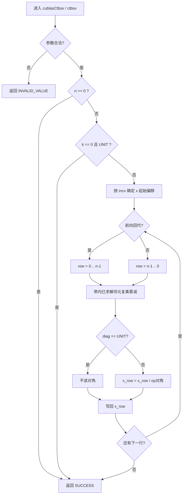
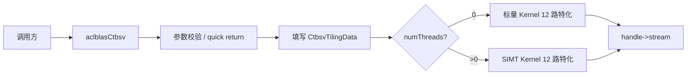
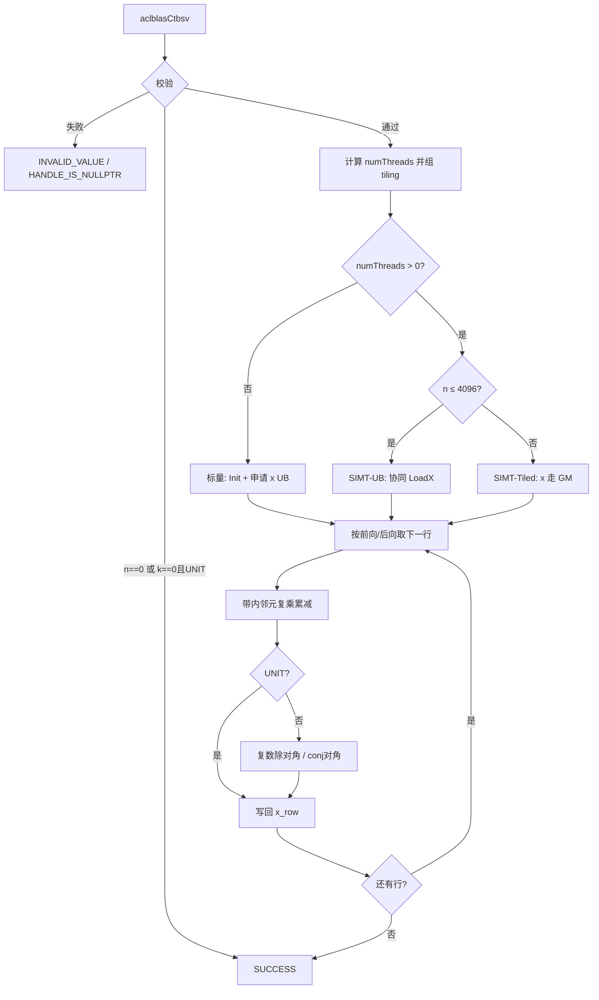

# aclblasCtbsv 算子设计文档

> 任务：算子实操工坊-杭州站-aclblasCtbsv 算子开发（950）  
> 目标仓：https://gitcode.com/cann/ops-blas  
> 实现目录：`blas/stbsv/arch35/`  
> 测试目录：`test/tbsv/ctbsv/`  
> 适配硬件：Ascend 950PR（arch35）  
> CANN 版本：9.1.0  
> 代码提交：`6f45099`（`feat/aclblas-ctbsv-950` / `master`）  
> 上游 PR：https://gitcode.com/cann/ops-blas/merge_requests/445  
> 模板：https://gitcode.com/cann/cann-ops-competitions/blob/master/04_tasks/01_community-task-2026/resources/design_template.md

| 项 | 内容 |
|----|------|
| 算子 | aclblasCtbsv |
| 硬件 / CANN | Ascend 950PR / 9.1.0 |
| 文档日期 | 2026-09-14 |
| 个人仓 | https://gitcode.com/YMH0417/ops-blas |

---

## 一、需求背景

### 1.1 需求来源

通过社区任务 / 算子实操工坊完成开源仓算子贡献：在 ops-blas 中新增单精度复数三角带状线性方程组求解接口 `aclblasCtbsv`，补齐同族实数接口 `aclblasStbsv` 的 complex64 覆盖，语义对齐 cuBLAS `cublasCtbsv` / Netlib `ctbsv`。

本算子不是 NN 图算子，不走 ACLNN / TBE 路径，按任务书要求以 **ops-blas 句柄式 BLAS + Ascend C Kernel 直调** 方式合入。

### 1.2 背景介绍

#### 1.2.1 aclblasCtbsv 算子实现优化

本算子属于 BLAS Level-2 求解类接口，昇腾生态中**不存在对应 TBE 实现**，因此不以 `/usr/local/Ascend/ascend-toolkit/latest/opp/built-in/op_impl/ai_core/tbe/impl` 或算子信息库 `tbe.dsl` 作为标杆源。标杆与参考实现如下。

| 角色 | 路径 / 链接 | 说明 |
|------|-------------|------|
| 语义标杆 | [cuBLAS `cublasCtbsv`](https://docs.nvidia.com/cuda/cublas/index.html#cublas-t-tbsv) | 接口签名、带状存储、uplo/trans/diag、不做奇异性检查 |
| 算法标杆 | [Netlib `ctbsv.f`](https://www.netlib.org/blas/ctbsv.f) | 前向 / 回代顺序、负步长、`N.EQ.0` 直接返回 |
| 仓内同族参考 | `ops-blas/blas/stbsv/arch35/stbsv_host.cpp` | Host 校验、quick return、SIMT 门槛 |
| 仓内同族参考 | `ops-blas/blas/stbsv/arch35/stbsv_kernel.cpp` | 标量回代 Kernel |
| 仓内同族参考 | `ops-blas/blas/stbsv/arch35/stbsv_kernel_simt.cpp` | SIMT 并行点积 + 树归约 |
| 公共类型定义 | `ops-blas/include/cann_ops_blas_common.h` | `aclblasComplex`、枚举与状态码 |
| 新增接口声明 | `ops-blas/include/cann_ops_blas.h` | `aclblasCtbsv` 公共头，禁止 950PR 私有平行 API |

相对 `aclblasStbsv` 的增量：元素类型由 `float` 扩展为 `aclblasComplex`；`trans=ACLBLAS_OP_C` 必须走共轭转置（实数路径下 C 与 T 等价）；Kernel 对 A 的虚部取反、对角除法改为复数除法。

#### 1.2.2 aclblasCtbsv 算子现状分析

##### 1.2.2.1 标杆算子支持的数据类型和数据格式

与 cuBLAS `cublasCtbsv` / Netlib `ctbsv` 及任务书 §2.4 一致：

| 参数 | 含义 | 数据类型 | 支持 dtype | 内存 | 排布 / 形状 | 约束 |
|------|------|----------|------------|------|-------------|------|
| handle | 库上下文，绑定 stream | `aclblasHandle_t` | — | Host | scalar | 非空 |
| uplo | 上 / 下三角带 | enum | `{UPPER=121, LOWER=122}` | Host | attr | 非法返回 `INVALID_VALUE` |
| trans | `op(A)` | enum | `{N=111, T=112, C=113}` | Host | attr | 非法返回 `INVALID_VALUE` |
| diag | 单位对角 / 非单位对角 | enum | `{NON_UNIT=131, UNIT=132}` | Host | attr | 非法返回 `INVALID_VALUE` |
| n | 矩阵阶 | int | n ≥ 0 | Host | scalar | n < 0 非法；n = 0 为 no-op |
| k | 超对角 / 次对角数 | int | k ≥ 0 | Host | scalar | k < 0 非法 |
| A | 三角带状矩阵，只读 | COMPLEX64 | 实部 / 虚部 FLOAT32 | Device | 列主序带状，数组 `lda × n`，有效 `(k+1) × n` | n > 0 时非空；lda ≥ k+1 |
| lda | A 的 leading dimension | int | lda ≥ k+1 | Host | scalar | lda < k+1 非法 |
| x | 入口为右端 b，出口为解 | COMPLEX64 | 实部 / 虚部 FLOAT32 | Device | 步长 incx，逻辑长 n | n > 0 时非空；原地覆写 |
| incx | x 元素步长 | int | incx ≠ 0 且 ≠ INT_MIN | Host | scalar | 负步长按 Netlib 反向遍历 |

不支持广播，不要求 dynamic shape，不支持超出 lda / incx 语义的非连续 Tensor。

##### 1.2.2.2 标杆算子实现描述

Netlib `ctbsv` / cuBLAS `cublasCtbsv` 求解：

```text
op(A) * x = b
```

其中入口时 `x` 存放 `b`，出口时解原地写回 `x`。`op(A)` 由 trans 决定：

- `N`：使用 A
- `T`：使用 Aᵀ，不取共轭
- `C`：使用 Aᴴ，元素取共轭

实现要点与源码逻辑一致：

1. **参数检查后 quick return**：`N.EQ.0` 直接返回；单位对角且带宽为 0 时 A 退化为单位阵，x 不变。
2. **带状列主序寻址**（1-based 文档口径，实现中转为 0-based）：
   - LOWER：主对角在数组第 1 行，`A(i,j)` 存于 `A(1+i-j, j)`，右下 k×k 不引用
   - UPPER：主对角在数组第 k+1 行，`A(i,j)` 存于 `A(1+k+i-j, j)`，左上 k×k 不引用
3. **回代方向**：
   - 前向（j = 0 → n-1）：`(LOWER && N)` 或 `(UPPER && (T 或 C))`
   - 后向（j = n-1 → 0）：其余组合
4. **每行更新**：从已求解的带内邻元做复乘累减，再按 diag 决定是否除以对角元。`UNIT` 时不读对角、视为 1；`NON_UNIT` 时做复数除法。`C` 路径对非对角元虚部取反，对角除以 `conj(diag)`。
5. **负步长**：`incx < 0` 时第 `idx` 个逻辑元的物理偏移为 `(n-1-idx)*(-incx)`，对应 Netlib 起始点 `1-(n-1)*incx`。
6. **不做奇异性检查**：对角为零时行为未定义，由调用方保证 `NON_UNIT` 对角远离零。

##### 1.2.2.3 标杆算子实现流程图



---

## 二、需求分析

### 2.1 外部组件依赖

| 依赖 | 是否适配 | 说明 |
|------|----------|------|
| CANN Runtime / ACL | 是 | `aclrtStream`、Device 内存、异步下发 |
| Ascend C | 是 | 标量 Kernel（`TPipe` / `GlobalTensor`）+ SIMT（`asc_simt` / `asc_vf_call`） |
| ops-blas handle | 是 | `aclblasCreate` / `aclblasSetStream` |
| cblas / OpenBLAS | 仅测试 | golden 使用 `cblas_ctbsv`，运行时不依赖 |
| TBE / tbe.dsl | 否 | 非 NN 图算子，无 TBE 标杆 |
| ACLNN | 否 | 任务书要求 Kernel 直调 |
| PyTorch / torch_npu | 否 | 不走框架适配 |

### 2.2 内部适配模块

| 模块 | 路径 | 作用 |
|------|------|------|
| 公共头 | `include/cann_ops_blas.h` | 新增 `aclblasCtbsv` 声明 |
| 公共类型 | `include/cann_ops_blas_common.h` | 复数类型、枚举、状态码 |
| Host | `blas/stbsv/arch35/ctbsv_host.cpp` | 校验、quick return、路径选择、组 tiling |
| 标量 Kernel | `blas/stbsv/arch35/ctbsv_kernel.cpp` | 单核串行回代 |
| SIMT Kernel | `blas/stbsv/arch35/ctbsv_kernel_simt.cpp` | 行内并行点积 + 树归约 |
| Tiling 结构 | `blas/stbsv/arch35/ctbsv_tiling_data.h` | Host → Device 参数块 |
| 常量 | `blas/common/helper/kernel_constant.h` | `SIMT_MIN_THREAD_NUM=128`，`SIMT_MAX_THREAD_NUM=2048` |
| ST 框架 | `test/tbsv/ctbsv/` | CSV + GTest + `cblas_ctbsv` golden |

与 `aclblasStbsv` 同目录族，由 `blas/CMakeLists.txt` 自动收集，不单独增加算子 CMake。

### 2.3 需求模块设计

#### 2.3.1 Ascend C 算子原型

除任务书明确不要求的能力外，接口与标杆逐参数对齐（仅元素类型由 float 扩为 `aclblasComplex`）：

```cpp
aclblasStatus_t aclblasCtbsv(
    aclblasHandle_t handle,
    aclblasFillMode_t uplo,
    aclblasOperation_t trans,
    aclblasDiagType_t diag,
    int n, int k,
    const aclblasComplex* A, int lda,
    aclblasComplex* x, int incx);
```

计算公式：

```text
op(A) * x = b
op(A) = A      当 trans = ACLBLAS_OP_N
op(A) = A^T    当 trans = ACLBLAS_OP_T
op(A) = A^H    当 trans = ACLBLAS_OP_C
```

#### 2.3.2 Ascend C 算子相关约束（相对标杆缺失 / 收窄的功能）

| 标杆能力 | 本实现 | 说明 |
|----------|--------|------|
| cuBLAS 还提供 `cublasZtbsv`（complex128） | 不支持 | 任务书仅要求 COMPLEX64 |
| 多右端 / 批量 | 不支持 | 接口为单向量 TBSV |
| 多核按行并行 | 不支持 | 回代行间存在串行依赖 |
| 超出 lda/incx 的非连续 Tensor | 不支持 | 任务书明确不要求 |
| 奇异性检测 | 不支持 | 与 cuBLAS 一致，属标杆本身缺失 |
| ACLNN / PyTorch 包装 | 不提供 | 任务书要求 Kernel 直调 |

---

## 三、需求详细设计

### 3.1 调用方式

**Kernel 直调**（ops-blas 句柄式 BLAS）：

```text
应用
  → aclInit / aclrtSetDevice / aclrtCreateStream
  → aclblasCreate + aclblasSetStream
  → aclblasCtbsv(...)          // Host 校验 + 组 tiling + 下发
  → aclrtSynchronizeStream     // 调用方同步，Host 侧不做流同步
  → 读回 x
```

不接入 ACLNN，不注册 PyTorch schema。

### 3.2 需求总体设计

整体为「Host 校验 / 路径选择 + 单 AiCore Kernel」。因 TBSV 行间有依赖，**不分多核**，只在行内用 SIMT 并行点积。



#### 3.2.1 Host 侧设计

Host 流程：

1. `handle == nullptr` → `ACLBLAS_STATUS_HANDLE_IS_NULLPTR`
2. 校验 n、k、lda、incx、uplo/trans/diag、n>0 时 A/x 非空
3. `n == 0` 或 `k == 0 && diag == UNIT` → 直接 `SUCCESS`
4. 按 n、带宽选择标量 / SIMT，填写 `CtbsvTilingData`，调用 `ctbsv_kernel_do`

`CtbsvTilingData` 字段：`a, x, n, k, uplo, trans, diag, incx, lda, numThreads`。

##### 3.2.1.1 分核策略

TBSV 第 `i` 行依赖已求解邻元，**不能按行切到多个 AiCore**。策略固定为：

- `blockDim = 1`（一个 Vector 核）
- 标量路径：核内单线程串行扫行
- SIMT 路径：核内 `numThreads` 个 SIMT 线程并行做当前行带内点积，行与行之间 `syncthreads` 后继续

不采用「满核均分 + 大小核」模型。

##### 3.2.1.2 数据分块和内存优化策略

950PR 每核 UB = 253952 B。本算子不切 A 的 tile 到多核，只在核内用 UB 缓存 x 与归约缓冲。

**有效带宽**

```text
maxBand = min(k, n - 1) + 1
```

**标量路径 LocalMemory**

```text
xUbRe  = n * sizeof(float)
xUbIm  = n * sizeof(float)
UB_scalar ≈ 8n 字节
```

`incx == 1` 时先写 UB，整行结束后再一次性 Flush 到 GM，减少逐元 GM 写；`incx != 1` 时每行直接写 GM，避免按逻辑下标 Flush 错位。

A 不整块搬入 UB：带状列主序访问跨度是 `lda`，带宽变化大，标量路径按元素 `GetValue`。

**SIMT 路径 LocalMemory**

```text
partialReSums = SIMT_MAX_THREAD_NUM * 4 = 8192 B
partialImSums = SIMT_MAX_THREAD_NUM * 4 = 8192 B
```

当 `n ≤ CTBSV_UB_X_COMPLEX(4096)` 时额外缓存 x：

```text
xUbRe = 4096 * 4 = 16384 B
xUbIm = 4096 * 4 = 16384 B
UB_simt_ub ≈ 16 KiB + 32 KiB = 48 KiB  < 248 KiB
```

当 `n > 4096` 时走 Tiled 路径：x 不进 UB，点积直接读 GM，UB 只保留 16 KiB 归约缓冲。

**SIMT 线程数**

```text
threadsForBand = CeilAlign(max(maxBand, 128), 128)
numThreads     = min(n, 2048, threadsForBand)
```

线程按 `j = jStart + threadIdx.x; j += blockDim.x` 划分当前行带内列，再对实部 / 虚部分量做树归约。

##### 3.2.1.3 tilingKey 规划策略

不使用传统 `tilingKey` 整型分支表，用两级开关达到同样效果：

| 条件 | 取值 | Kernel 分支 |
|------|------|-------------|
| `n < 128` 或 `maxBand < 64` | `numThreads = 0` | 标量 12 路 |
| `n ≥ 128` 且 `maxBand ≥ 64` | `numThreads > 0` | SIMT 12 路 |
| `uplo × trans × diag` | 编译期模板 | 12 个特化（2×3×2） |

`trans=C` 单独成特化，避免运行时在热循环里判断共轭。Host 只按枚举分发，不把 12 路编进一个巨大函数（满足门禁圈复杂度 / 函数长度约束）。

相对 `aclblasStbsv`：实数路径仅用 `n ≥ 128` 切 SIMT；复数点积更重，额外要求 `maxBand ≥ 64`，避免窄带时 SIMT 启动开销大于收益。

#### 3.2.2 Kernel 侧设计

##### 3.2.2.1 Kernel 侧实现描述

**共同语义**

- 寻址与标杆一致。UPPER 非转置：`idx = k + row - col + col*lda`；转置时交换 row/col。LOWER 非转置：`idx = row - col + col*lda`。
- x 偏移：`incx ≥ 0` 为 `idx*incx`，否则 `(n-1-idx)*(-incx)`。
- 复数按两个连续 float 存放，标量路径用 `complexIdx * 2` 访问实部 / 虚部。
- `CONJ`：非对角 `aIm = -aIm`；`NON_UNIT` 时  
  `x = (sum * conj(diag)) / |diag|²`。

**标量 Kernel（`CtbsvKernel<UPLO,TRANS,DIAG>`）**

1. `Init`：绑定 A/x 的 `GlobalTensor<float>`
2. `Process` → `ProcessRows`：申请 x 的实部 / 虚部 UB
3. 按 `kForward` 正向或反向扫行
4. `ComputeRow`：读 `x[row]`，带内邻元复乘累减，按 diag 收尾，写回

**SIMT Kernel（`CtbsvSimt`）**

1. `n ≤ 4096`：先把 x 协同载入 UB，再逐行  
   `CtbsvSimtDotPartial`（FROM_GM=false）+ `CtbsvSimtReduceFloat` × 2
2. `n > 4096`：x 留在 GM（FROM_GM=true）
3. thread 0 完成对角除法并写回 `x[row]`，`asc_syncthreads()` 后进入下一行

##### 3.2.2.2 Ascend C 实现流程图



##### 3.2.2.3 与标杆流程图的差异

| 差异点 | 标杆（cuBLAS / Netlib） | 本实现 | 原因 |
|--------|-------------------------|--------|------|
| 执行后端 | CUDA kernel / CPU Fortran | Ascend C AIV Kernel 直调 | 任务书要求合入 ops-blas，950PR |
| 并行 | 实现私有，对外不暴露 | 行间串行；行内 SIMT 点积 | 回代依赖限制多核；宽带时行内点积可并行 |
| 双路径 | 通常单一实现 | 标量 + SIMT，由 n/带宽切换 | 对齐仓内 `stbsv`，并避免窄带 SIMT 亏性能 |
| 复数存储 | `cuComplex` / `COMPLEX` | `aclblasComplex`（两 float） | 仓内公共类型 |
| 同步 | CUDA stream | `aclblasSetStream`，Host 不同步 | 与 ops-blas 其它接口一致 |
| 数据类型 | 另有 Ztbsv | 仅 COMPLEX64 | 任务书范围 |
| 模板分派 | 运行时或宏 | 12 路编译期特化 | 去掉热路径枚举分支，并通过静态检查 |

数学回代顺序、带状寻址、共轭语义、负步长、no-op 与标杆保持一致。

### 3.3 支持硬件

| 芯片 | 是否支持 | 依据 |
|------|----------|------|
| Ascend 950PR | 支持 | 任务书唯一适配硬件，arch35 |
| Ascend 950DT | 不支持 | 任务书未要求 |
| Atlas A2 / A3（arch22） | 不支持 | 任务书未要求 |

README 产品支持表标注：Ascend 950PR / 950DT 中仅 950PR 按「支持」填写实现口径；接口本身放在公共头，供其它产品线后续复用。

### 3.4 算子约束限制

- 仅 COMPLEX64，不支持 FP32 / FP64 / COMPLEX128
- 仅单右端向量，无 batched / strided-batched
- 仅单核；n、k 为运行时标量，无动态 shape 框架
- 无广播
- `lda ≥ k+1`（实现按仓内 stbsv 写成 `lda > k`）
- `incx ≠ 0` 且 `incx ≠ INT_MIN`
- 不做奇异性检查；`NON_UNIT` 时对角必须非零
- 仅引用 uplo 指定三角带
- Host 不做 stream 同步

---

## 四、特性交叉分析

| 交叉项 | 结论 |
|--------|------|
| 与 `aclblasStbsv` | 同目录、同 tiling 形状、同校验口径；Ctbsv 增加共轭与复数除法，SIMT 额外要求 `maxBand ≥ 64` |
| 与其它 BLAS 接口 | 仅共享 handle / stream / 公共头，不改现有算子控制流 |
| 与 ACLNN / 图编译 | 不注册 Op，无图融合、无 workspace 与其它算子复用 |
| 与测试框架 | 复用 `test/frame` 的 CSV + GTest；golden 为 cblas，不依赖 GPU |
| 内存别名 | A 只读，x 原地写；A 与 x 重叠时行为与 BLAS 一样未定义 |
| 线程安全 | 同一 handle / 同一 stream 上的调用由调用方串行化 |

无与卷积、归一化等 NN 算子的精度 / 格式交叉。

---

## 五、可维护性分析

### 5.1 精度标准 / 性能标准

| 验收标准 | 描述 | 来源 |
|----------|------|------|
| 精度 | COMPLEX64 按 FLOAT32 分量：rtol = 2⁻¹⁰，atol = 2⁻¹⁶，matched_ratio ≥ 0.99；max_abs_error ≤ 1e-2 或 32 ULP。golden 为 `cblas_ctbsv`，实部 / 虚部分开比对 | 任务书 §3.2，[生态算子开源精度标准](https://gitcode.com/cann/opbase/blob/master/docs/zh/ops_precision_standard/experimental_standard.md) |
| 性能 | Ascend 950PR，warmup 后有效采样 >50 次取平均；4 个典型 case 平均耗时不高于 917.5 / 1831.11 / 3753.09 / 4898.68 us | 任务书 §3.3 |
| 测试规模 | CSV 1200 条（精度 1000 + 性能 200），覆盖 uplo×trans×diag、尺寸 / 带宽、lda padding、±1/±2/±3 步长、零维 / 空指针 / 非法枚举 | 任务书 §3.5 |

自测典型性能（`ctbsv_bench`，warmup=20，repeats=100，提交 `6f45099`，2026-09-14 复测）：189.52 / 658.59 / 1356.71 / 4290.25 us，四条均低于标杆。

### 5.2 兼容性分析

- **接口兼容**：新增 API，不改变已有 `aclblasStbsv` 及其它符号。
- **ABI**：声明位于 `cann_ops_blas.h`，无 950PR 私有平行接口，后续 arch22 / 其它精度可复用同一原型。
- **行为兼容**：状态码、枚举数值、带状布局、负步长、no-op 与 cuBLAS / 仓内 stbsv 对齐。
- **版本**：针对 CANN 9.1.0 + Ascend 950PR；不承诺更低 CANN 或其它芯片。
- **文档**：`blas/stbsv/README.md` 已登记 `aclblasCtbsv` 及 950PR 支持情况。
