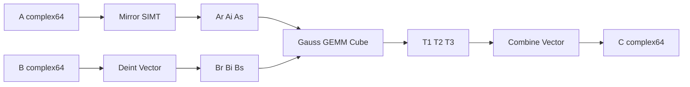

# 需求背景（required）

## 需求来源

通过算子实操工坊（杭州站）社区任务完成开源仓 `ops-blas` 的 `aclblasCtrmm` 算子贡献。任务书：aclblasCtrmm 950 算子开发，目标仓 https://gitcode.com/cann/ops-blas。

## 背景介绍

### aclblasCtrmm 算子实现优化

ops-blas 仓已有实数三角矩阵乘 `aclblasStrmm`（`blas/trmm/arch35/`），公开头文件 `include/cann_ops_blas.h` 原先无 `aclblasCtrmm` 声明。本任务在同一目录新增单精度复数接口，与 cuBLAS `cublasCtrmm` 参数一一对应，语义对齐 Netlib `ctrmm`。

参考路径：

- 仓内实数基线：`blas/trmm/arch35/strmm_*.cpp`
- 公开头文件：`include/cann_ops_blas.h`
- 精度标准：https://gitcode.com/cann/opbase/blob/master/docs/zh/ops_precision_standard/experimental_standard.md

本算子不是 TBE 迁移，而是 ops-blas 句柄式 BLAS + Ascend C kernel 直调（arch35 / DAV_3510）。

### aclblasCtrmm 标杆现状分析

| 参数 | 参数含义 | 数据类型 | 支持数据类型 | 约束 | 形状 |
| --- | --- | --- | --- | --- | --- |
| handle | 库句柄 | scalar | aclblasHandle_t | 非空 | - |
| side | A 在左/右侧 | attr | LEFT / RIGHT | 非法返回 INVALID_VALUE | - |
| uplo | 引用上/下三角 | attr | UPPER / LOWER | 非法返回 INVALID_VALUE | - |
| trans | op(A) | attr | N / T / C | 非法返回 INVALID_VALUE | - |
| diag | 单位/非单位对角 | attr | UNIT / NON_UNIT | UNIT 不读对角 | - |
| m, n | B/C 行列 | scalar | int | >=0；0 为 no-op | - |
| alpha | 复数标量 | COMPLEX64 | Host 或 Device | (0,0) 时 C 置零 | - |
| A | 三角矩阵 | COMPLEX64 | 列主序 ND | 仅引用指定三角 | LEFT: m×m；RIGHT: n×n |
| B | 输入矩阵 | COMPLEX64 | 列主序 ND | - | m×n |
| C | 输出矩阵 | COMPLEX64 | 列主序 ND | 允许 C==B | m×n |

计算公式：

- LEFT：`C = alpha * op(A) * B`
- RIGHT：`C = alpha * B * op(A)`
- `op(A) ∈ {A, Aᵀ, Aᴴ}`

标杆实现（cuBLAS / Netlib）为三角矩阵-矩阵乘，不是 TRSM 求解；对角允许为 0。cuBLAS 该接口为离席写 C，调用方把 B 地址传给 C 即可得到 BLAS 原地语义。

### 算子功能分析

输入：handle、side、uplo、trans、diag、m、n、alpha、A、lda、B、ldb、ldc  
输出：C  
支持数据类型：COMPLEX64（实部/虚部 float32）  
不支持广播。

# 需求分析（required）

## 外部组件依赖

无 TBE / ACLNN / PyTorch 依赖。运行时依赖 CANN 9.1+（acl runtime、Ascend C、tensor_api）以及 ops-blas 句柄与 workspace 管理。

## 内部适配模块

- Host：`blas/trmm/arch35/ctrmm_host.cpp`，公开符号 `aclblasCtrmm`
- Kernel：`ctrmm_mirror_kernel` / `ctrmm_deint_kernel` / `ctrmm_gemm3_kernel` / `ctrmm_combine3_kernel`
- Tiling：`ctrmm_tiling_data.h` 四个 POD 结构，仅标量
- 测试：`test/trmm/ctrmm/`，golden 为仓内 CPU `aclblasCtrmm_cpu`

## 需求描述

使用 Ascend C + tensor_api 在 Ascend 950PR 上实现 `aclblasCtrmm`，接口放入 `include/cann_ops_blas.h`，禁止 950PR 私有平行 API。精度按 FLOAT32 分量混合容差；任务书 §3.3 五个性能 case 平均单次耗时不高于标杆。

## 需求拆解

1. 声明并实现 `aclblasCtrmm`，参数语义对齐 cuBLAS `cublasCtrmm`
2. 覆盖 N/T/C、LEFT/RIGHT、UPPER/LOWER、UNIT/NON_UNIT、零维、alpha=0、padding、INF/NaN、负向用例
3. 运行时动态取核数，TilingData 不含按核数组
4. 性能不低于任务书五个 case 的标杆耗时

# 详细设计（required）

## 算子分析

### 数学公式

Gauss / Karatsuba 三乘（3M），比 4 次实数 GEMM 少一次 Cube：

```
As = Ar + Ai,  Bs = Br + Bi
T1 = Ar Br,  T2 = Ai Bi,  T3 = As Bs
abR = T1 - T2
abI = T3 - T1 - T2
C  = alpha * (abR + i abI)
```

列主序适配与 `aclblasStrmm` 相同：Host 将 GEMM 的 m↔n 对调并翻转 side，temp 中存 Cᵀ（行主序视角），combine 再写回列主序交织 complex64。

### 支持数据类型

COMPLEX64。

### 支持形状

运行时 m、n；lda/ldb/ldc 满足列主序前导维约束。不支持超出 ld 语义的非连续访问。

## 算子实现

### 实现方案

调用方式：ops-blas handle 绑定 stream，Host 直调 NPU kernel。代码：`blas/trmm/arch35/`。

#### 3.2.1 host 侧设计

##### 1. 分核策略

核数运行时 `GetAivCoreCount()` / `GetAicCoreCount()`，禁止硬编码。

- Mirror / Deint：AIV，按 A 的阶或 B 的行均分，至少 1 核
- GEMM：AIC 二维分核，在 tile 网格上最大化 `mBlocks * nBlocks <= aicCoreNum`
- Combine：AIV，按 C 的列均分

##### 2. 数据分块和内存优化策略

Cube tile：维度 <1024 用 64，否则 128，再钳到 128，避免 L0C 64 KB 槽溢出。扫参：

- 2048 RIGHT（gemm LEFT）用 tileN=64
- 2048 LEFT（gemm RIGHT）用 tileK=64

L1 512 KB ping-pong；若 `2 * (tileM*tileK + tileK*tileN) * 4 > 512KB` 则缩小 tileK。

Workspace（32 字节对齐）：3 个 A 平面 + 3 个 B 平面 + 3 个 temp。Device 侧 alpha：8 字节 D2H + stream sync 后再 launch。

LocalMemory：

- Deint：UB 上 64×64 复数块，DeInterleave + Add
- Combine：UB tile=1024，Gauss 合成后 Interleave
- GEMM：L0A/L0B 各 64 KB 对半 ping-pong；L0C 256 KB 拆成 3×64 KB 同时驻留 T1/T2/T3

##### 3. tilingKey 规划策略

不使用 tilingKey。side/uplo/trans/diag 在 Host 写入 tiling 标量，Kernel 用模板/分支派发。TilingData 只含标量，无按核数组。

#### 3.2.2 kernel 侧设计

四级流水，SIMT 与 Vector 分 kernel，避免同一 AIV kernel 混用：

1. **Mirror（AIV / SIMT）**：把三角 A 展开成紧凑 `dimA×dimA` 的 Ar/Ai/As。N 路径列并行，T/C 路径行并行。UNIT 写 1+0i 且不读对角；未引用三角写 0；C 再共轭。
2. **Deint（AIV / Vector）**：UB `DeInterleave` 把列主序交织 B 拆成 Br/Bi/Bs。
3. **Gauss GEMM（AIC / tensor_api）**：一次 kernel 算 T1/T2/T3。按三角裁剪 K 区间 `[kBegin, kEnd]`。
4. **Combine（AIV / Vector，tile=1024）**：按列拆核，UB 上合成后 `Interleave` 写回 C。

与标杆差异：标杆在 CPU/GPU 上直接做复数三角乘；本实现用 3 次实数 GEMM + 向量后处理，以适配 950PR Cube 只提供实数 MMAD。功能结果与 Netlib `ctrmm` 对齐。



## 支持硬件

| 支持的芯片版本 | 涉及勾选 |
| --- | --- |
| Ascend 950PR / Ascend 950DT | √ |
| Atlas A2 | 不支持 |
| Atlas A3 | 不支持 |

依赖 CANN / asc-devkit >= 9.1。

## 算子约束限制

- 仅 COMPLEX64、列主序、arch35
- 非法枚举返回 `ACLBLAS_STATUS_INVALID_VALUE`（与任务书/cuBLAS 口径一致）
- m=0 或 n=0：成功 no-op
- alpha=(0,0)：不引用 A/B，C 逻辑 m×n 置零
- 除 C 与 B 同指针外，不支持其它参数重叠
- 不做对角奇异性检测

# 特性交叉分析

不涉及图模式、动态 shape 广播或多芯片形态切换。仅 arch35 / COMPLEX64 / 句柄式 kernel 直调。与 `aclblasStrmm` 目录共存，接口独立。

# 可维可测分析

## 精度标准/性能标准

| 验收标准 | 描述 | 标准来源 |
| --- | --- | --- |
| 精度标准 | COMPLEX64 按 FLOAT32：rtol=2^-10，atol=2^-16，matched_ratio>=0.99，max_abs_error<=1e-2 或 32 ULP | 任务书 §3.2 / 生态精度标准 |
| 性能标准 | 五个 case 平均单次耗时（warmup 5 + 采样 55）不高于标杆 | 任务书 §3.3 |

本机自测：精度 1001/1001 PASSED；五个性能 case 全部低于标杆。

## 兼容性分析

新接口，不影响已有 `aclblasStrmm`。头文件新增声明供其它产品线共用。
