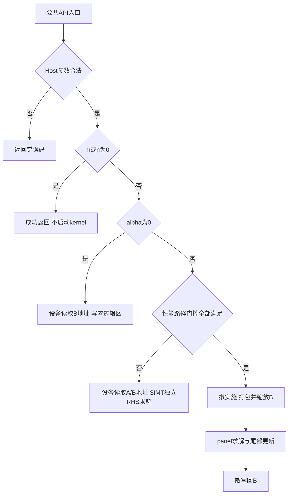

# aclblasCtrsmBatched 算子设计文档（Atlas 950PR）

# 1. 需求背景（required）

## 1.1 需求来源

需求来自任务附件 `aclblasCtrsmBatched_Atlas950PR_task_doc.md`，附件同时提供测试 CSV、生成脚本及精度/性能指导。实现目标为在 ops-blas 开源仓中增加单精度复数批量三角求解接口，代码与实数同族算子共处于 `blas/trsmbatched/arch35/`。

接口计算语义对齐 cuBLAS `cublasCtrsmBatched`，单矩阵数学参考为 Netlib `ctrsm`。Host 标量、`batchCount ≥ 1`、状态码及产品范围按本任务和 ops-blas 约束执行，不将 cuBLAS 的全部运行模式直接扩展为本算子能力。

## 1.2 背景介绍

三角求解是分解法线性系统求解中的基础步骤。批量接口用于处理多个尺寸和标志相同、存储地址独立的小型或中型系统，减少逐个矩阵调用的调度开销。

本算子处理复数三角矩阵和多个右端项，必须同时支持左乘、右乘、上下三角、原矩阵/转置/共轭转置以及单位/非单位对角。三角依赖导致求解方向内存在顺序关系，而不同 batch 与不同右端项之间可并行。

## 1.3 同族实现现状分析

ops-blas 基线提交 `7eae2328a65753bf55cffc489253eb434ea3317e` 已有 `aclblasStrsmBatched`，可参考其工程注册、handle/stream 获取、参数约束与测试结构。该基线实数 Host 实现包含将设备指针数组读回 Host 后逐批处理的逻辑。

复数版本需要独立处理以下差异：

| 差异 | 本设计处理 |
| --- | --- |
| complex64 算术 | 以 FLOAT32 分量实现复乘、复减和复除 |
| `OP_C` | 在转置寻址后对虚部取负，不能按实数转置等同处理 |
| 设备指针数组 | kernel 在 GM 中逐批读取地址，Host 不复制回指针数组 |
| 批量调度 | 将 batch 与独立右端项合并调度 |
| 原地输出 | 每个逻辑 B 元素只有一个求解任务拥有，padding 不写入 |
| 性能优化 | 保留完整 SIMT 路径，拟通过 panel 求解与复数 GEMM 更新优化大规模输入 |

# 2. 需求分析（required）

## 2.1 需求描述

对 `q ∈ [0, batchCount)`，求解下列系统并将解原地写入 `B[q]`：

- `side=LEFT`：`op(A[q]) × X[q] = alpha × B_in[q]`。
- `side=RIGHT`：`X[q] × op(A[q]) = alpha × B_in[q]`。

其中 `B_in` 表示调用前的 B，输出 `B_out=X`。批次共享所有维度、前导维和枚举；不要求矩阵在批次之间连续存储。

## 2.2 公共接口

声明加入 `include/cann_ops_blas.h`，不增加 950PR 私有平行接口：

```cpp
aclblasStatus_t aclblasCtrsmBatched(
    aclblasHandle_t handle,
    aclblasSideMode_t side,
    aclblasFillMode_t uplo,
    aclblasOperation_t trans,
    aclblasDiagType_t diag,
    int m, int n,
    const aclblasComplex* alpha,
    const aclblasComplex* const A[], int lda,
    aclblasComplex* const B[], int ldb,
    int batchCount);
```

`aclblasComplex` 复用公共头文件定义，字段为 `float real`、`float imag`，单元素 8 字节，不重新定义复数 ABI。

## 2.3 参数、形状与内存契约

以下索引均从 0 开始，设 `k = side==LEFT ? m : n`。

| 参数 | 位置/方向 | 类型与约束 |
| --- | --- | --- |
| handle | Host，输入 | 已创建句柄，携带调用 stream；空句柄返回 `HANDLE_IS_NULLPTR` |
| side | Host，属性 | `ACLBLAS_SIDE_LEFT(141)` 或 `ACLBLAS_SIDE_RIGHT(142)` |
| uplo | Host，属性 | `ACLBLAS_UPPER(121)` 或 `ACLBLAS_LOWER(122)` |
| trans | Host，属性 | `ACLBLAS_OP_N(111)`、`ACLBLAS_OP_T(112)`、`ACLBLAS_OP_C(113)` |
| diag | Host，属性 | `ACLBLAS_NON_UNIT(131)` 或 `ACLBLAS_UNIT(132)` |
| m、n | Host，输入 | int，分别为 B 的行数、列数，均 ≥ 0 |
| alpha | Host，输入 | 非空复数标量指针；调用期间读取并按值传入设备 |
| A | Device，输入 | 长度为 batchCount 的设备指针数组，每项指向列主序 `k×k` 矩阵，物理数组为 `lda×k` |
| lda | Host，输入 | int，`lda ≥ max(1,k)`，单位为复数元素 |
| B | Device，输入/输出 | 非空设备指针数组，每项指向列主序 `m×n` 矩阵，物理数组为 `ldb×n` |
| ldb | Host，输入 | int，`ldb ≥ max(1,m)`，单位为复数元素 |
| batchCount | Host，输入 | int，`batchCount ≥ 1`；0 和负数均非法 |

地址公式：`A[q](r,c)=A[q][r+c*lda]`，`B[q](r,c)=B[q][r+c*ldb]`。矩阵可带前导维 padding，除此之外不支持任意 stride、广播或视图语义。ND 表示存储格式，本接口按列主序解释数据，不按 C 数组的默认行主序解释。

设备数组和其指向的矩阵必须在异步操作完成前保持有效。各 B 矩阵不得重叠；调用方须提供可读的必要 A 区域和可写的 B 区域。A/B 相互别名不作为支持场景，尤其不能通过写 B 改变尚未使用的 A。

## 2.4 功能与异常行为拆解

| 编号 | 要求 | 设计落点 |
| --- | --- | --- |
| R01 | 24 组枚举组合 | 独立处理 side、有效三角方向、共轭标志和单位对角 |
| R02 | 只引用指定三角 | 求和下标仅选已解依赖；分块打包时对未引用元素直接填零 |
| R03 | UNIT 不读取对角 | 求解跳过对角加载和除法；打包对角直接写 1 |
| R04 | 列主序与 padding | 使用 lda/ldb 计算元素偏移，只写 `m×n` 逻辑区域 |
| R05 | `m=0` 或 `n=0` | 合法参数下不启动 kernel，返回成功 |
| R06 | `alpha=(0,0)` | 不读 A 数组、A 矩阵和原 B 值，逐批清零逻辑 B |
| R07 | 参数校验 | 非法枚举/尺寸/前导维/batch/必要指针返回 `INVALID_VALUE` |
| R08 | 不检测奇异性 | NON_UNIT 非零对角由调用方保证，不提供奇异状态输出 |
| R09 | 异步执行 | 使用 handle stream，不为读取指针数组或结果主动同步 |
| R10 | 性能 | 以任务书五条门槛验收，预热后有效采样 >50 次 |

本节状态码省略的公共前缀均为 `ACLBLAS_STATUS_`。成功返回表示参数检查和调用分派完成；异步执行错误仍需通过 stream 同步等运行时接口确认。

## 2.5 校验顺序与边界裁定

采用固定顺序，便于代码与负向测试一致：

1. `handle==nullptr`：返回 `HANDLE_IS_NULLPTR`。
2. 检查枚举、`m/n≥0`、`batchCount≥1`、lda/ldb 下界及 `alpha/B` 非空；失败返回 `INVALID_VALUE`。
3. `m==0 || n==0`：返回 `SUCCESS`，不解引用设备数组，不读 A。
4. 读取 Host alpha；alpha 非零且 A 数组为空时返回 `INVALID_VALUE`。alpha 为零时允许 A 数组为空。
5. 查询平台核数并完成分派；核数查询结果为 0 时返回 `INTERNAL_ERROR`。

该规则意味着零维不豁免非法枚举、batchCount、前导维或空 alpha/B。A 在零维时无需提供。多种非法参数同时存在时，以此顺序为准。

Host 只判断顶层数组是否为空，不读取或逐项验证设备数组中的指针。数组内无效地址属于调用方违反内存契约，不能承诺由本接口同步返回 `INVALID_VALUE`。

# 3. 详细设计（required）

## 3.1 算子分析

### 3.1.1 矩阵变换与求解方向

记 `T=op(A)`：

| trans | `T(r,c)` 的读取 | 虚部处理 | T 的三角方向 |
| --- | --- | --- | --- |
| N | `A[r+c*lda]` | 不变 | 同 uplo |
| T | `A[c+r*lda]` | 不变 | 与 uplo 相反 |
| C | `A[c+r*lda]` | 取负 | 与 uplo 相反 |

定义 `upperT=(uplo==UPPER) XOR (trans!=N)`。LEFT 解一列时，T 为下三角采用前代、上三角采用回代；RIGHT 解一行时方向相反：

| side | T 的三角 | i 的顺序 | 已解下标集合 S(i) |
| --- | --- | --- | --- |
| LEFT | LOWER | `0→k-1` | `j<i` |
| LEFT | UPPER | `k-1→0` | `j>i` |
| RIGHT | UPPER | `0→k-1` | `j<i` |
| RIGHT | LOWER | `k-1→0` | `j>i` |

diag 的两个取值仅控制除法和对角读取，和上述规则组合即覆盖 `2×2×3×2=24` 种情形。

### 3.1.2 数学递推

LEFT 固定列 `h`：

```text
v = alpha * B_in(i,h) - Σ[j∈S(i)] T(i,j) * X(j,h)
X(i,h) = v                              if diag=UNIT
X(i,h) = v / T(i,i)                     if diag=NON_UNIT
```

RIGHT 固定行 `h`：

```text
v = alpha * B_in(h,i) - Σ[j∈S(i)] X(h,j) * T(j,i)
X(h,i) = v                              if diag=UNIT
X(h,i) = v / T(i,i)                     if diag=NON_UNIT
```

每个当前元素只应用一次 alpha。先完成全部依赖求和再覆写当前 B，不对已求解元素重复缩放。

### 3.1.3 复数算术与数值边界

对 `a=ar+i*ai`、`b=br+i*bi`：

```text
real(a*b) = ar*br - ai*bi
imag(a*b) = ar*bi + ai*br
```

基础实现采用 FLOAT32 分量运算。复除对有限非零分母先缩放：

```text
s = max(abs(br), abs(bi))
r = br/s; t = bi/s; d = r*r + t*t
x = ar/s; y = ai/s
real(a/b) = (x*r + y*t)/d
imag(a/b) = (y*r - x*t)/d
```

此方法减少分母平方和直接溢出的风险，但不保证任意极端输入都能获得有限输出：分子缩放、乘加、中间解仍可能溢出或下溢。NaN/Inf、极大/极小分量以及病态系统需独立与参考实现比对；不能由普通随机测试推导出这些场景已经满足一致性要求。

alpha 恰为 `(1,0)` 时省略复乘，避免不必要操作；alpha 恰为 `(0,0)` 走写零分支，不能通过乘零清除 NaN。对零的精确比较用于识别接口特殊值，不是浮点误差判据。

### 3.1.4 支持形状与复杂度

规格不人为限制在附件最大尺寸 2048，合法 int 维度需满足实际设备可寻址和内存容量条件。三角阶数为 k，独立右端项数为 `R=LEFT?n:m`。

- 计算复杂度：`O(batchCount × R × k²)`，等价于 `O(batchCount × m × n × k)`。
- 每个 RHS 的复数乘减次数：`k(k-1)/2`；NON_UNIT 另有 k 次复除。
- 基础实现附加 GM workspace：0；B 本身保存已解结果。
- B 最少输出量：`8×batchCount×m×n` 字节，padding 不计入有效输出。

## 3.2 算子实现

### 3.2.1 总体方案与路径状态

| 路径 | 用途 | 状态 |
| --- | --- | --- |
| Host no-op | 任意合法零维 | 已有代码 |
| SIMT 写零 | 非空维度、alpha=0 | 已有代码，基础 kernel 内独立分支 |
| SIMT 逐 RHS 求解 | 全标志、padding、非对齐和通用回退 | 已有代码，CPU 算术检查通过，待 NPU 验证 |
| AIV panel 求解 + 复数 GEMM 更新 | 大 k、多 RHS 的性能优化 | 设计方案，尚未实现/测量 |



现阶段性能路径门控固定关闭，所有非零 alpha 输入使用 SIMT。上图中的性能路径表示后续设计，不代表当前代码已有该分支。

### 3.2.2 Host 侧设计

Host 负责参数检查、读取 alpha、查询可用 AIV 核数、设置 tiling 参数和启动 kernel。不得读取设备指针数组中的地址，不为逐批启动进行 D2H 复制。

**分核策略。** 设 `L=128` 为每块 SIMT lane 数，`J=batchCount×R`，`C` 为可用 AIV 核数，则：

```text
blockNum = min(C, ceil(J/L))
job0 = blockId*L + laneId
job = job0, job0 + blockNum*L, ...，直到 job >= J
batch = job / R
rhs = job % R
```

计算 J、地址偏移及循环跨度时使用 64 位整数，避免先做 32 位乘法再转换。blockNum 在非空任务中至少为 1；J 不整除 lane 数时由边界判断屏蔽尾 lane。

**Tiling 数据。** 基础路径使用普通结构体按值传递，不使用图模式算子注册或额外 tiling key：

| 字段 | 类型 | 用途 |
| --- | --- | --- |
| m、n | uint32_t | B 的逻辑尺寸 |
| lda、ldb | uint32_t | 元素前导维 |
| batchCount | uint32_t | 指针数组长度 |
| side、uplo、trans、diag | int32_t | 求解与寻址规则 |
| alpha | aclblasComplex | Host 标量快照 |

参数是运行时维度；不要求动态 shape 图编译能力。当前不做 24 份 kernel 模板展开，避免过早增加编译体积。以后若实测显示分支开销显著，可按 side/trans/diag 特化，仍保留相同公共接口。

### 3.2.3 Kernel 侧设计

kernel 采用 AIV-only 任务类型，按上述 job 分配工作。每个 job 在设备侧读取 `B[batch]`，非零 alpha 时再读取 `A[batch]`。

LEFT：`base=rhs*ldb`，`stride=1`。RIGHT：`base=rhs`，`stride=ldb`。当前解元素地址统一为 `Bbase[base+i*stride]`。

```text
SolveRhs(Aptr, Bptr, rhs, tiling):
    确定k、base、stride
    if alpha == 0:
        for i in [0,k): 写 Bptr[base+i*stride] = (0,0)
        return
    确定upperT及前代/回代方向
    for i in求解顺序:
        v = Bptr[base+i*stride]
        if alpha != 1: v = complex_mul(alpha, v)
        for j in已解顺序:
            a = LEFT ? LoadOpA(i,j) : LoadOpA(j,i)
            v -= complex_mul(a, Bptr[base+j*stride])
        if diag == NON_UNIT: v = complex_div(v, LoadOpA(i,i))
        写 Bptr[base+i*stride] = v
```

**禁止读取的实现约束。** alpha=0 分支须在任何 A 数组读取之前；UNIT 判断须在对角 load 之前，不能先 load 后丢弃结果；不以整块预取越过有效三角。基础路径没有整矩阵搬入 UB，不依赖所有矩阵同时驻留片上存储。

**同步与正确性。** 一个 lane 独占一整列（LEFT）或一整行（RIGHT），不同 job 不读写彼此的解元素。同一 lane 仅使用自己已经写出的依赖，保证顺序求解；跨 lane 无生产者/消费者关系，因此无需块间栅栏。设备编译仍需验证同线程 GM 读写可见性和编译器语义，CPU 测试不能证明该点。

**访存分析。** LEFT 单 lane 顺序访问 B 列内元素，但相邻 lane 可能跨 ldb 访问；RIGHT 相邻行 lane 在同一列访问连续元素，但单 lane 跨列步进。A 寻址随 trans 改变，直接 GM 求和会重复读取 A 与已解 B，这是大矩阵优化的主要动机。

### 3.2.4 分块性能方案（拟实施）

#### a. 统一为左侧三角求解

令 `Y=B`、`C=op(A)` 用于 LEFT；令 `Y=B^T`、`C=op(A)^T` 用于 RIGHT。统一求解 `C×Y=alpha×Y_in`，内部逻辑尺寸为 `C:k×k`、`Y:k×R`。

| 原 trans | LEFT 的 C | RIGHT 的 C |
| --- | --- | --- |
| N | A | A^T |
| T | A^T | A |
| C | conj(A)^T | conj(A) |

RIGHT/OP_C 的 C 是仅共轭的 A，必须在打包函数中显式处理；不能将其错误映射成普通 A。输出阶段 RIGHT 将 Y 普通转置回 B，不对解额外共轭。

#### b. Panel 求解与尾部更新

初始阶段将当前 RHS tile 的 B 打包为实部/虚部分离的 Y，并只在此时乘一次 alpha。按照 C 的三角方向遍历 panel P，令 U 为尚未求解的行集合：

```text
C_PP × Y_P = Y_P                 # AIV/SIMT解对角panel
Y_U = Y_U - C_UP × Y_P           # 更新未解区域
```

上三角从末 panel 开始，下三角从首 panel 开始。每轮求解的输入已扣除全部先前 panel 贡献。UNIT 在打包 `C_PP` 时直接生成对角 1；未引用三角直接置 0，不读相应 A 元素。A 矩阵保持只读。

#### c. 复数矩阵更新

设 `C_UP=Cr+iCi`、`Y_P=Yr+iYi`，计算四个实矩阵乘积：

```text
Q1=Cr×Yr; Q2=Ci×Yi; Q3=Cr×Yi; Q4=Ci×Yr
real(Y_U) -= Q1-Q2
imag(Y_U) -= Q3+Q4
```

优先以完整 FLOAT32 乘法/累加保证精度口径。是否采用 Cube、具体指令与矩阵布局取决于 950PR/CANN9.1 实际能力和验证结果；不得为性能静默降为 FP16、BF16 或其他低精度输入。四乘积方案作为可解释基线，暂不采用三乘积复数乘法，以降低消减误差风险。

#### d. Tile、workspace 与调度

候选 panel 大小 `b∈{32,64,128}`，RHS tile 宽度 `r∈{16,32,64,128}`，初始评估从 b=64、r=32 开始，不把候选值视为已调优结论。batch 与 RHS tile 组成独立组，每次处理 G 组，G 由内存预算和可用并行度控制。

一个保守的串行复用 workspace 方案为：

| 缓冲 | 内容 | 未对齐字节数 |
| --- | --- | --- |
| Y | G 组 `k×r` 复数，分离实/虚 | `8Gkr` |
| 当前 C panel | 对角与更新块合计至多 `k×b`，分离实/虚 | `8Gkb` |
| Q1～Q4 | 至多 `u×r` 的四个 FLOAT32 乘积，`u≤k-b` | `16Gur` |

各区间单独按后端要求对齐后求和；主机对字节数乘法和相加检查溢出。上表不包含后端可能要求的额外 workspace，实施时须加入后端返回值及分配对齐开销。

UB/L1/L0 的容量通过目标平台接口查询，按实际布局、双缓冲和临时向量空间核算，不硬编码未经确认的 950PR 容量。先实现单缓冲流水，之后仅在实测有收益时开启双缓冲。

每个 panel 的打包、求解、GEMM、合并按同一 stream 顺序启动；通过 kernel 边界建立跨核 GM 依赖，初版不设计 AIV/AIC 跨核自旋同步。多个独立组可在同一阶段并行，但写入范围不重叠。不得将所有 batch 的大矩阵无条件打包到同一巨大 workspace。

#### e. 路径门控和回退

只在以下条件全部成立时启用已验证的性能路径：后端可用、尺寸达到实测阈值、workspace 足够、布局/对齐/尾块满足后端约束、该标志组合和精度已验证。

任务书给出的 NoTrans 分块参考要求为 lda/ldb 和尾 panel bs 的 8 元素对齐；若直接复用该类受限路径，必须逐项检查，不满足即回退。复数拆分打包后还需验证实数物理布局自身的对齐，不能认为原输入8对齐就自动满足所有后端限制。

路径选择和 workspace 准备均在修改用户 B 之前完成。不满足条件时走通用 SIMT；若已下发修改 B 的计算后发生运行时失败，不对部分更新的 B 自动重试。后续调优须证明端到端平均耗时有收益，包括打包、解 panel、更新和散写全部阶段。

### 3.2.5 代码组织与构建接入

| 文件/目录 | 职责 |
| --- | --- |
| `include/cann_ops_blas.h` | 公共函数声明 |
| `include/cann_ops_blas_common.h` | 复用现有类型和枚举，不扩展私有类型 |
| `blas/trsmbatched/arch35/ctrsm_batched_host.cpp` | 校验、核数计算、分派 |
| `blas/trsmbatched/arch35/ctrsm_batched_validate.h` | 参数约束实现 |
| `blas/trsmbatched/arch35/ctrsm_batched_tiling_data.h` | Host/Device共享参数 |
| `blas/trsmbatched/arch35/ctrsm_batched_kernel.cpp` | GM指针读取、SIMT启动和job调度 |
| `blas/trsmbatched/arch35/ctrsm_batched_core.h` | 复数运算、op(A)读取和求解递推 |
| `cmake/asc_devkit_version.cmake` | 版本门控，与同族保持一致 |
| `test/trsmbatched/ctrsm_batched/arch35/` | GTest与1200条CSV用例 |
| `test/trsmbatched/ctrsm_batched/portable/` | 可选CPU语义检查与输入诊断 |
| `blas/trsmbatched/README.md` | 公共接口、产品和约束说明 |

构建复用仓库源文件发现和测试注册机制；实现仅放入 arch35。测试名称使用 `ctrsm_batched`。CPU 辅助检查的 NumPy/SciPy 依赖不进入生产算子或 NPU 验收 golden。

## 3.3 支持硬件

| 产品 | 是否支持 |
| --- | --- |
| Atlas 950PR | 支持 |

## 3.4 算子约束限制

仅支持 complex64、列主序、uniform batch和Host alpha；不支持任意stride、广播、混合batch尺寸或设备alpha。调用方保证必要矩阵地址有效、B批间不重叠和NON_UNIT对角非零。不提供奇异/近奇异检测、误差估计、条件数估计或迭代精化，也不承诺位级确定性。

# 4. 可维可测分析

## 4.1 精度标准

按任务书，实际输出与逐 batch `cblas_ctrsm` golden 的实部、虚部分别验证；只统计 B 的 `m×n` 逻辑区域：

| 指标 | 要求 |
| --- | --- |
| rtol | `2^-10` |
| atol | `2^-16` |
| 单分量匹配 | `abs(actual-golden) ≤ atol + rtol*abs(golden)` |
| required_matched_ratio | 每个batch的实部、虚部各 ≥0.99 |
| 最大误差限制 | 本设计按每元素 `abs_error ≤ max(1e-2,32*ULP(golden))` 实施，同时输出全局最大绝对误差 |

“1e-2 或 32×ULP”采用上述明确口径，评审时需与验收方确认；如验收器另有统一定义，以确认后的规则更新测试。匹配率和最大误差条件同时满足才通过。

非有限值独立比较：NaN对应NaN，同号Inf对应同号Inf，类别或Inf符号不一致失败。额外记录非有限分量数。有限输入导致golden溢出时，将用例记为输入数值条件待复核，不以双方均NaN宣称精度通过。

CSV中的MERE/MARE字段保留用于来源追溯，不替代任务书上述主判据。残差 `op(A)X-alpha*B_in` 或 `Xop(A)-alpha*B_in` 可作为定位工具，不能替代golden验收。

## 4.2 测试设计

### 4.2.1 附件用例覆盖

实际CSV共1200条：1000条精度/边界，200条性能。以下为对CSV逐行统计，不能以附件README中的分类估计代替：

| 类别 | 前缀 | 条数 | 验证目的 |
| --- | --- | --- | --- |
| 基础 | L0 | 48 | 24组枚举×两种小尺寸 |
| 尺寸扫描 | SQ | 23 | 1到2048、边界与非对齐 |
| 标量 | AB | 24 | 0、1、负数、纯虚及复数alpha |
| batch扫描 | BC | 13 | batchCount变化 |
| 宽/高矩形 | WS、TH | 12+12 | 非方阵及LEFT/RIGHT |
| 前导维 | LD | 12 | padding和寻址 |
| 填充 | FL | 11 | 随机、零、交替、极值、Inf/NaN |
| 标志补充 | CV | 24 | 中等尺寸组合 |
| 边界/负向 | ED | 21 | 空指针、零维、非法枚举和尺寸 |
| 扩展 | EX | 800 | 参数组合扩展 |
| 性能 | PF | 200 | 5条任务门槛+195条性能采集 |

### 4.2.2 数据准备和独立参考

每个batch独立分配A/B，再将矩阵地址组成设备指针数组。Host留存原始A/B；NPU执行前后使用同一份数据建立golden，NON_UNIT对角偏移只应用一次。

对角偏移采用 `boost=max(5,k)`，实/虚部分量按原符号加偏移；不改变UNIT的逻辑对角1。该策略减少小对角风险，但不构成一般矩阵良态的数学保证。

正向测试将A未引用三角、UNIT对角和padding用NaN污染，配合前后字节比较验证A不改写；逐元素检查B padding不变。零alpha增加A数组为空及B含NaN/Inf的用例，验证不读取A并直接写零。NaN污染是数值可观测检查，不能单独证明硬件没有发生被丢弃的预取；还须检查实现访问范围并在可用时使用设备内存检查工具。

补充覆盖：UNIT 1×1禁止读对角、不同batch独立地址、超过单次lane容量的尾job、0/1/奇数/块边界尺寸、极大/极小有限分量、转置共轭下的纯虚对角、参数多重非法的优先级、stream非默认绑定和异步指针生命周期。

任务要求的普通随机用例应按均匀/正态各50%分配，实部/虚部分别采样，保存随机种子与分布参数。

## 4.3 性能标准与测量方案

| case | m | n | batchCount | side | uplo | trans | diag | Avg time上限/us |
| --- | --- | --- | --- | --- | --- | --- | --- | --- |
| 1 | 256 | 256 | 32 | LEFT | UPPER | N | NON_UNIT | 540.09 |
| 2 | 512 | 512 | 16 | LEFT | LOWER | N | NON_UNIT | 1529.57 |
| 3 | 1024 | 1024 | 8 | RIGHT | UPPER | T | NON_UNIT | 3752.8 |
| 4 | 2048 | 2048 | 4 | LEFT | LOWER | C | NON_UNIT | 11062.15 |
| 5 | 2048 | 2048 | 4 | RIGHT | LOWER | N | UNIT | 10754.1 |

测量设备为950PR，先检查精度，再预热5次、有效采样60次。每次测量前恢复B原始输入，恢复操作和golden计算均在计时范围外，避免反复原地求解改变工作负载。

使用显式启用 `ACL_EVENT_TIME_LINE` 的ACL事件，记录同一stream上一次接口调用的开始和结束，包含调用分派出的全部kernel；完成同步后读取设备事件耗时并由ms换算为us。分块路径必须包含打包、panel求解、更新、散写，不能只报GEMM耗时。单独记录Host API耗时作为辅助诊断，不使用GTest总耗时替代设备调用耗时。

五条主用例直接对照上表，不使用额外倍率。其余195条在缺少有效基线时只报告实测值，不能记为性能达标。记录硬件、驱动/CANN版本、commit、设备占用和采样数；小耗时场景还需评估事件分辨率及空事件间隔，必要时配合profiler复核，不自行扣除未经确认的开销。

## 4.4 内存、可维护性与兼容性

基础路径workspace为0，但测试矩阵、设备指针数组、handle默认workspace和运行时资源仍占内存。自测报告分别记录显式分配字节数和可获得的设备峰值，不能将计算出的字节数称为实测峰值。

分块路径新增workspace需使用仓库现有handle管理机制，控制batch组数，检查分配失败和异步生命周期；不在kernel使用动态分配。算子不得破坏其他接口设置的stream或用户workspace。

公共类型、枚举和实数API保持兼容；新增函数是公共头文件扩展，未实现产品不承诺可调用该符号。可维护性由“参数校验、寻址/算术、任务调度、优化路径、测试参考”分离保证。测试参考不得调用被测求解代码生成golden。
