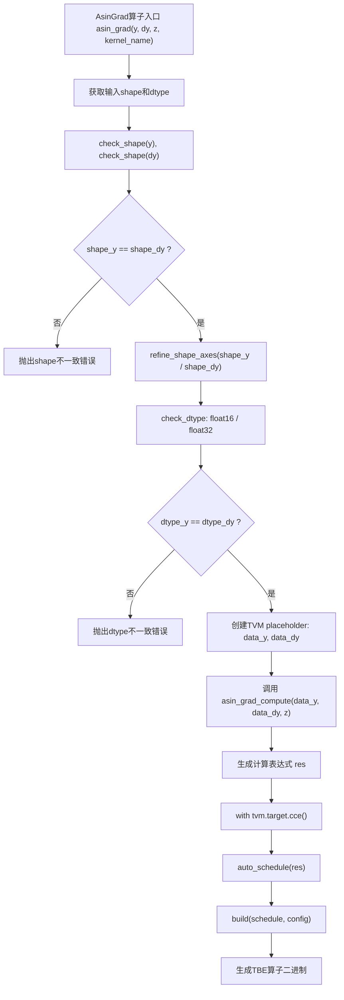
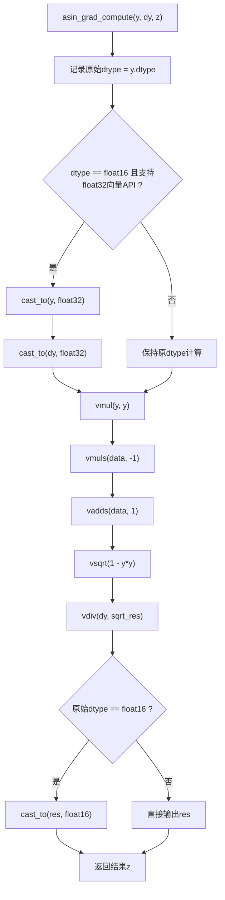
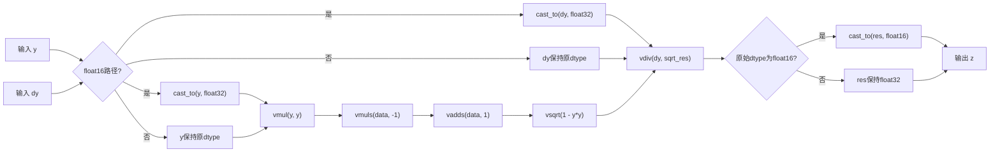
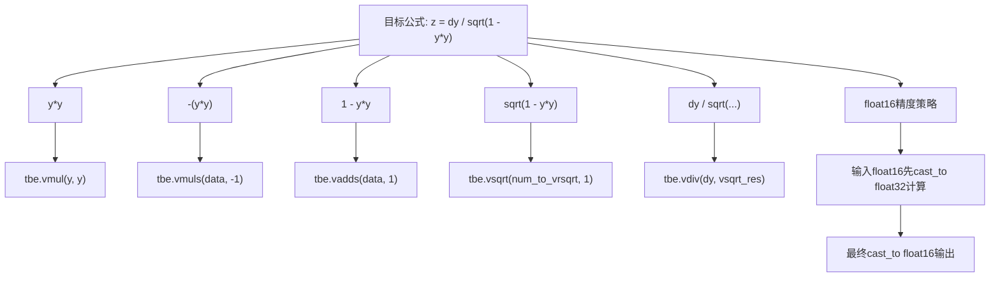
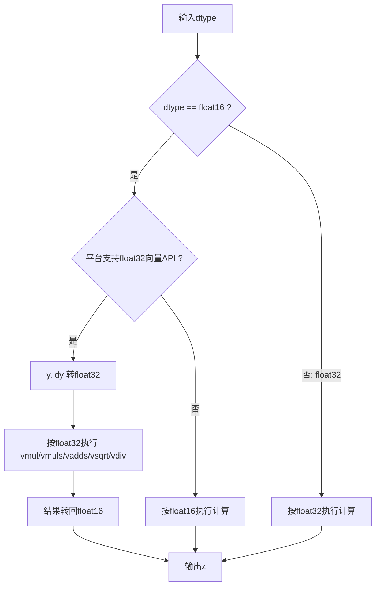
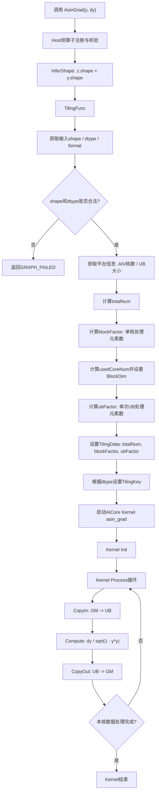
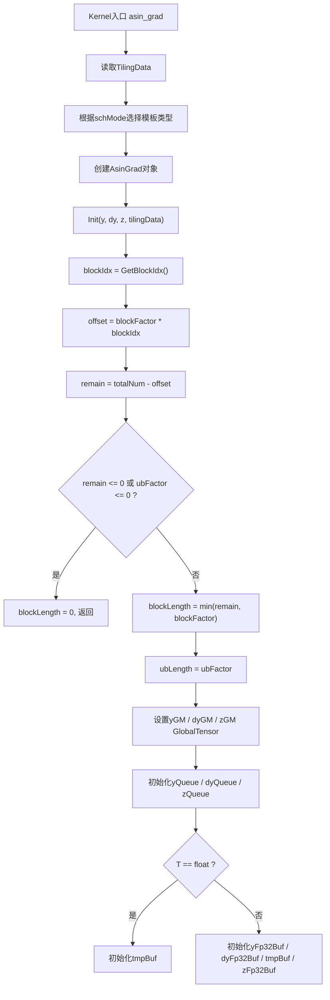
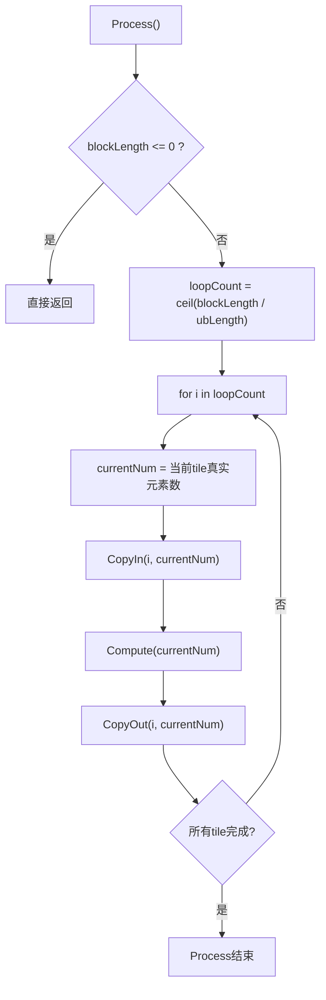

# AsinGrad算子AscendC设计方案

## 需求背景

### 需求来源

依据CANN社区算子迁移任务要求，对历史TBE实现的AsinGrad算子进行AscendC重写，使其能够在Atlas A2/Ascend 910B环境下通过CANNJudge功能、精度和性能验证。

### 背景介绍

AsinGrad用于计算反正弦函数Asin的反向梯度，数学表达式为：

```text
z = dy / sqrt(1 - y * y)
```

其中`y`为前向输入，`dy`为上游梯度，`z`为输出梯度。原TBE实现采用DSL向量接口完成`vmul`、`vmuls`、`vadds`、`vsqrt`、`vdiv`等逐元素计算；本方案使用AscendC在AICore侧显式实现数据搬运、向量计算和结果写回。

AsinGrad算子TBE实现路径和相关API路径如下：

- AsinGrad算子实现路径为：`/usr/local/Ascend/ascend-toolkit/latest/opp/built-in/op_impl/ai_core/tbe/impl`
- AsinGrad算子实现中的API路径：`/usr/local/Ascend/ascend-toolkit/latest/python/site-packages/tbe/dsl`


### AsinGrad算子现状分析

通过对AsinGrad历史TBE版本的功能分析，当前核心能力如下：

- 输入`y`、`dy`形状必须一致，输出`z`与输入保持相同shape。
- TBE历史版本主要支持`float16`、`float32`；CANNJudge任务模板扩展到`float16`、`float32`、`bfloat16`。
- `float16`路径在硬件支持时先转换为`float32`计算，再转换回`float16`，以降低`1 - y * y`接近0时的精度损失。
- 计算过程为纯逐元素操作，不涉及reduce、broadcast、shape变换或workspace依赖。

| 名称 | 类别 | dtype | format | shape | 介绍 |
| --- | --- | --- | --- | --- | --- |
| y | 输入 | fp16/fp32/bf16 | ND | all | Asin前向输入 |
| dy | 输入 | fp16/fp32/bf16 | ND | 同y | 上游梯度 |
| z | 输出 | fp16/fp32/bf16 | ND | 同y | 输出梯度 |

AsinGrad算子TBE版本的整体流程图如下图所示：


TBE Compute计算流程图


接口具体实现图：


数学表达式与TBE API对应关系：


dtype分支逻辑图：



## 需求分析

### 外部组件依赖

不涉及外部组件依赖。

### 内部适配模块

适配Aclnn接口和图模式调用。


### 需求模块设计

#### 算子原型

- 原型设计：`AsinGrad(y, dy) -> z`。
- 相关约束：`y`、`dy`、`z` dtype保持一致；shape保持一致；format支持ND。
- Atlas A2训练系列产品/Atlas 800I A2推理产品支持`float16`、`float32`、`bfloat16`。

## 需求详细设计

### 使能方式

| 上层框架 | 涉及的框架勾选 |
| --- | --- |
| TF训练/推理 |  |
| Pytorch训练/推理 |  |
| ATC推理 | √ |
| Aclnn直调 | √ |
| OPAT调优 |  |

### 需求总体设计

#### host侧设计

AsinGrad计算过程不依赖原始维度的逐维信息，host侧将输入视为一维连续向量，仅关注总元素个数、数据类型、UB大小和AIV核数。Host侧通过`GetInputShape`获取`y`、`dy`的shape，检查输入输出shape一致；通过`GetInputDesc`/`GetOutputDesc`获取dtype并检查一致性。

**分核策略：**

- 优先使用可用AIV核，将`totalNum`按`coreNum`近似均分。
- 单核长度按cache line对应元素数向上对齐得到`blockFactor`。
- `usedCoreNum`由`totalNum`和`blockFactor`反推，避免启动空核。

**数据分块和内存优化策略：**

- 根据UB空间和kernel侧实际buffer数量计算`ubFactor`。
- FP32路径使用`y`、`dy`、`z`双缓冲队列以及`tmp`临时buffer。
- FP16/BF16路径使用低精度输入输出队列，并额外申请float32中间buffer完成升精度计算。
- 单次UB循环仅处理真实`currentNum`元素，尾块不对无效padding区域执行计算。

**tilingData规划：**

| 字段 | 含义 |
| --- | --- |
| totalNum | 展平后的总元素数 |
| blockFactor | 每个核处理的最大元素数 |
| ubFactor | 单次UB循环处理的元素数 |

**tilingKey规划：**

| schMode | 数据类型 | kernel分支 |
| --- | --- | --- |
| 0 | FP16 | `AsinGrad<half>` |
| 1 | FP32 | `AsinGrad<float>` |
| 2 | BF16 | `AsinGrad<bfloat16_t>` |

`schMode`使用2 bit声明，保证三种取值均可表达。

**数据检测：**

- shape约束：`y`、`dy`、`z`必须同shape。
- dtype约束：`y`、`dy`、`z`必须同dtype，支持`DT_FLOAT16`、`DT_FLOAT`、`DT_BF16`。
- format约束：支持ND格式。

#### kernel侧设计

Kernel侧分为`Init`和`Process`两个阶段，其中`Process`包括数据搬入`CopyIn`、计算`Compute`、搬出`CopyOut`三个阶段。

- `Init`阶段：根据`GetBlockIdx`获取当前核编号，结合`blockFactor`计算本核GM起始偏移和`blockLength`；初始化输入输出`GlobalTensor`以及UB队列/临时buffer。
- `CopyIn`阶段：使用`DataCopyPad`将`y`、`dy`从GM搬入UB队列。
- `Compute`阶段：FP32路径直接在float上计算；FP16/BF16路径先Cast到float32，完成`Mul`、`Muls`、`Adds`、`Sqrt`、`Div`后再Cast回原dtype。
- `CopyOut`阶段：将`z`从UB搬回GM，只写回当前tile真实元素数。
- 循环策略：每个核内部按`ubFactor`循环处理，尾块`currentNum`小于`ubFactor`时仅对真实元素执行向量计算，避免无效padding区域影响结果。

AscendC核心计算流程如下：

```text
CopyIn:   yGM, dyGM -> yLocal, dyLocal
Compute:  tmp = yLocal * yLocal
          tmp = 1.0 - tmp
          tmp = sqrt(tmp)
          zLocal = dyLocal / tmp
CopyOut:  zLocal -> zGM
```
Ascend C整体执行流程图：


Kernel侧Init流程图：


Kernel侧Process流程图：



### 支持硬件

| 支持的芯片版本 | 涉及勾选 |
| --- | --- |
| 香橙派OrangePi AIpro |  |
| Atlas 200I/500 A2推理产品 |  |
| Atlas 800I/T A2 | √ |

### 算子约束限制

不支持广播；不支持`y`、`dy` dtype不一致；不支持非ND格式；不支持复数、整数、bool等非浮点输入。输入值通常应位于`[-1, 1]`范围内，超出定义域时结果遵循硬件`sqrt/div`对NaN或Inf的处理行为。

## 特性交叉分析

AsinGrad为逐元素数学算子，与reduce、broadcast、layout转换、原子写、多输出等特性无交叉依赖。算子不使用workspace，不依赖外部状态；可作为图模式或aclnn直调路径中的基础反向算子。

## 可维可测分析

### 精度标准/性能标准

| 验收标准 | 描述(不涉及说明原因) | 标准来源 |
| --- | --- | --- |
| 精度标准 | 不低于TBE版本。 | |
| 性能标准 | 不低于TBE版本。 | |

测试建议覆盖以下场景：

- 基础shape：一维、二维、多维、标量shape。
- 数据类型：`float16`、`float32`、`bfloat16`。
- 规模场景：小shape、单核、满核、多tile、大shape和尾块。
- 数值场景：普通随机值、接近0、接近±1、`dy`包含正负值。

### 兼容性分析

新算子，不涉及历史二进制兼容。
